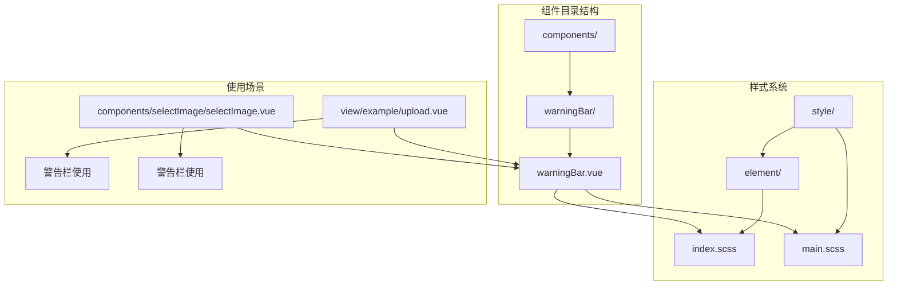
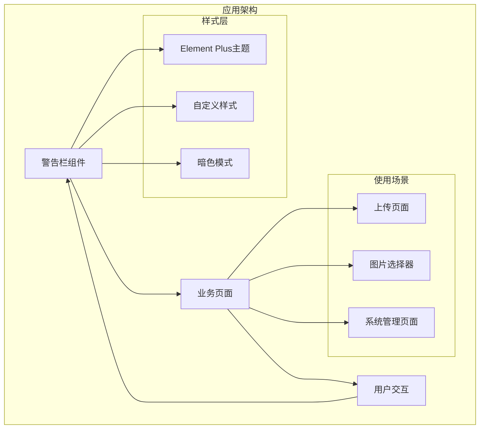
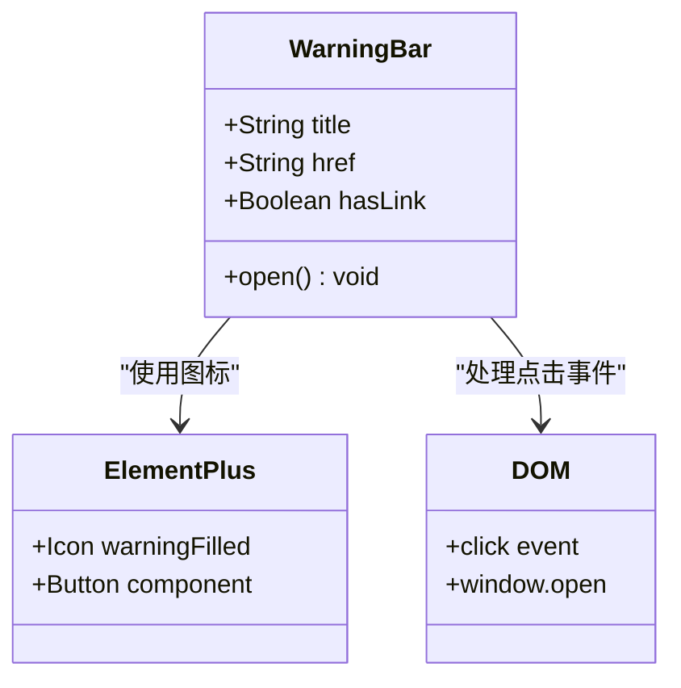
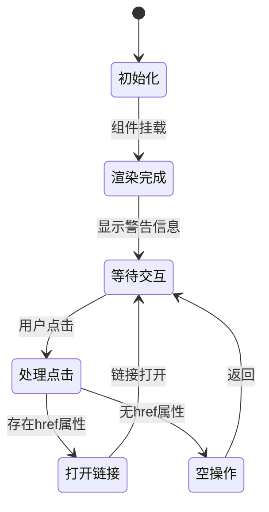
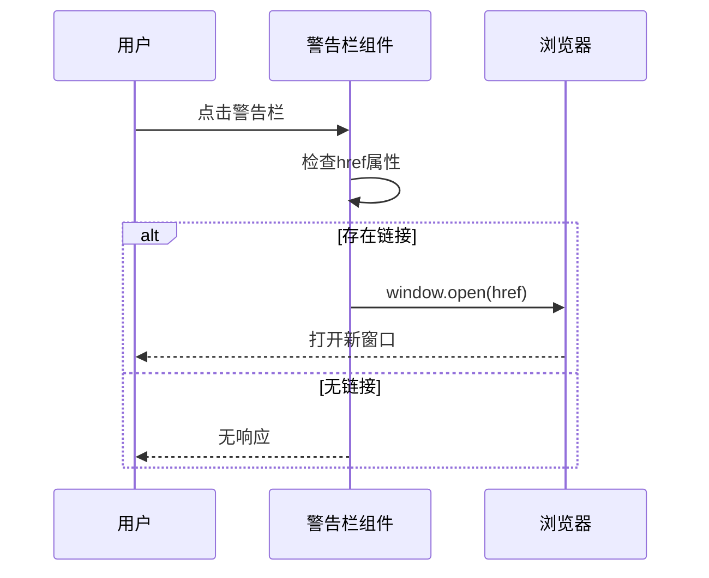
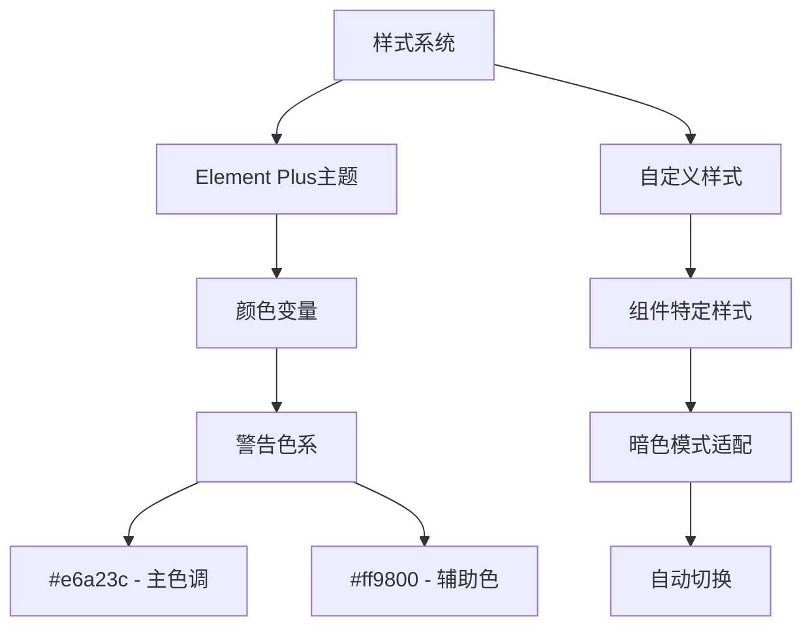

# 警告栏组件

<cite>
**本文档引用的文件**
- [warningBar.vue](file://web/src/components/warningBar/warningBar.vue)
- [index.scss](file://web/src/style/element/index.scss)
- [main.scss](file://web/src/style/main.scss)
- [upload.vue](file://web/src/view/example/upload/upload.vue)
- [selectImage.vue](file://web/src/components/selectImage/selectImage.vue)
</cite>

## 目录
1. [简介](#简介)
2. [项目结构](#项目结构)
3. [核心组件](#核心组件)
4. [架构概览](#架构概览)
5. [详细组件分析](#详细组件分析)
6. [依赖分析](#依赖分析)
7. [性能考虑](#性能考虑)
8. [故障排除指南](#故障排除指南)
9. [结论](#结论)
10. [附录](#附录)

## 简介
警告栏组件是一个轻量级的UI组件，用于在界面中展示重要信息提示。该组件采用简洁的设计风格，通过醒目的视觉效果来吸引用户的注意力，同时保持良好的可读性和可用性。组件支持点击交互，当配置了链接时可以打开外部页面。

## 项目结构
警告栏组件位于前端项目的组件目录中，采用标准的Vue 3单文件组件格式。组件设计遵循单一职责原则，专注于提供一致的警告信息展示体验。



**图表来源**
- [warningBar.vue:1-34](file://web/src/components/warningBar/warningBar.vue#L1-L34)
- [index.scss:1-25](file://web/src/style/element/index.scss#L1-L25)
- [main.scss:1-60](file://web/src/style/main.scss#L1-L60)

**章节来源**
- [warningBar.vue:1-34](file://web/src/components/warningBar/warningBar.vue#L1-L34)
- [index.scss:1-25](file://web/src/style/element/index.scss#L1-L25)
- [main.scss:1-60](file://web/src/style/main.scss#L1-L60)

## 核心组件
警告栏组件采用Vue 3的组合式API设计，具有以下核心特性：

### 组件设计目标
- 提供统一的警告信息展示界面
- 支持可选的链接跳转功能
- 具备响应式设计和暗色模式适配
- 保持简洁的视觉层次和良好的用户体验

### 主要属性配置
组件支持两个核心属性：
- `title`: 显示的警告文本内容
- `href`: 可选的链接地址，用于点击跳转

### 视觉设计特点
- 使用琥珀色系作为主色调，符合警告信息的视觉识别
- 采用圆角设计，提升现代感
- 支持暗色模式自动适配
- 集成Element Plus图标系统

**章节来源**
- [warningBar.vue:15-32](file://web/src/components/warningBar/warningBar.vue#L15-L32)

## 架构概览
警告栏组件在整个应用架构中扮演着信息传达的重要角色，通过与其他组件的协作实现完整的用户交互体验。



**图表来源**
- [warningBar.vue:1-34](file://web/src/components/warningBar/warningBar.vue#L1-L34)
- [upload.vue:55-57](file://web/src/view/example/upload/upload.vue#L55-L57)
- [selectImage.vue](file://web/src/components/selectImage/selectImage.vue#L156)

## 详细组件分析

### 组件结构分析
警告栏组件采用简洁的HTML结构设计，通过条件渲染实现灵活的功能控制。



**图表来源**
- [warningBar.vue:1-34](file://web/src/components/warningBar/warningBar.vue#L1-L34)

### 状态管理机制
组件采用简单的状态管理模式，通过props接收外部配置，内部维护最小化的状态。



**图表来源**
- [warningBar.vue:28-32](file://web/src/components/warningBar/warningBar.vue#L28-L32)

### 事件处理流程
组件的事件处理逻辑简单直接，确保了良好的用户体验和可预测的行为。



**图表来源**
- [warningBar.vue:28-32](file://web/src/components/warningBar/warningBar.vue#L28-L32)

**章节来源**
- [warningBar.vue:1-34](file://web/src/components/warningBar/warningBar.vue#L1-L34)

### 样式定制与主题适配
组件的样式系统基于Element Plus的主题变量，支持深色模式自动切换。



**图表来源**
- [index.scss:11-12](file://web/src/style/element/index.scss#L11-L12)
- [main.scss:1-60](file://web/src/style/main.scss#L1-L60)

**章节来源**
- [index.scss:1-25](file://web/src/style/element/index.scss#L1-L25)
- [main.scss:1-60](file://web/src/style/main.scss#L1-L60)

## 依赖分析
警告栏组件的依赖关系相对简单，主要依赖于Element Plus的图标系统和Vue 3的响应式系统。

```mermaid
graph LR
A[warningBar.vue] --> B[@element-plus/icons-vue]
A --> C[Vue 3 Composition API]
A --> D[Element Plus样式]
E[使用页面] --> A
E --> F[upload.vue]
E --> G[selectImage.vue]
F --> H[文件上传功能]
G --> I[图片选择功能]
```

**图表来源**
- [warningBar.vue](file://web/src/components/warningBar/warningBar.vue#L16)
- [upload.vue:55-57](file://web/src/view/example/upload/upload.vue#L55-L57)
- [selectImage.vue](file://web/src/components/selectImage/selectImage.vue#L156)

**章节来源**
- [warningBar.vue:16](file://web/src/components/warningBar/warningBar.vue#L16)
- [upload.vue:55-57](file://web/src/view/example/upload/upload.vue#L55-L57)
- [selectImage.vue:156](file://web/src/components/selectImage/selectImage.vue#L156)

## 性能考虑
警告栏组件由于其实现的简洁性，在性能方面表现出色：

### 性能优势
- **轻量级实现**: 仅包含必要的DOM结构和事件处理
- **零状态管理**: 不需要复杂的响应式状态更新
- **静态样式**: 使用编译时确定的CSS类名
- **按需加载**: 通过动态导入避免不必要的资源加载

### 优化建议
- 合理使用组件，避免在同一页面中过度使用
- 在大量警告信息场景下考虑虚拟化列表
- 利用浏览器缓存机制提升图标资源加载速度

## 故障排除指南

### 常见问题及解决方案

#### 1. 图标不显示问题
**症状**: 警告图标无法正常显示  
**原因**: Element Plus图标库未正确安装或导入  
**解决方案**: 确保@element-plus/icons-vue包已安装并正确导入

#### 2. 点击无响应问题
**症状**: 点击警告栏没有反应  
**原因**: href属性未正确设置或为空值  
**解决方案**: 检查href属性值，确保提供有效的URL地址

#### 3. 样式异常问题
**症状**: 警告栏样式不符合预期  
**原因**: 样式冲突或主题变量未正确配置  
**解决方案**: 检查Element Plus主题配置和自定义样式优先级

#### 4. 暗色模式适配问题
**症状**: 暗色模式下文字难以辨识  
**原因**: 颜色变量未正确继承  
**解决方案**: 确保使用Element Plus提供的颜色变量

**章节来源**
- [warningBar.vue:28-32](file://web/src/components/warningBar/warningBar.vue#L28-L32)
- [index.scss:1-25](file://web/src/style/element/index.scss#L1-L25)

## 结论
警告栏组件虽然实现简洁，但在实际应用中发挥着重要作用。其设计理念体现了现代前端开发的最佳实践：简单、直观、可维护。通过合理的样式设计和事件处理，组件能够有效地向用户提供关键信息提示。

组件的成功在于：
- **设计简洁**: 避免了过度复杂的功能实现
- **易于集成**: 通过标准化的属性接口便于使用
- **主题友好**: 完美融入Element Plus的设计系统
- **性能优秀**: 最小化的实现带来最佳的运行效率

## 附录

### 使用示例路径
以下文件展示了警告栏组件在实际项目中的使用方式：

#### 基本使用示例
- [上传页面中的警告栏:55-57](file://web/src/view/example/upload/upload.vue#L55-L57)
- [图片选择器中的警告栏](file://web/src/components/selectImage/selectImage.vue#L156)

#### 高级配置示例
- [带链接的警告栏:22-25](file://web/src/components/warningBar/warningBar.vue#L22-L25)
- [标题文本配置:18-20](file://web/src/components/warningBar/warningBar.vue#L18-L20)

### 最佳实践建议
1. **语义化使用**: 警告栏应仅用于重要的信息提示
2. **内容简洁**: 标题文本应简短明了，避免冗长描述
3. **链接安全**: 确保href指向可信的外部资源
4. **样式一致性**: 保持与其他组件的视觉风格统一
5. **可访问性**: 考虑键盘导航和屏幕阅读器支持

### 扩展开发指南
如需扩展组件功能，建议遵循以下原则：
- 保持现有API的向后兼容性
- 遵循Vue 3的Composition API规范
- 继承Element Plus的设计语言
- 提供充分的类型定义和文档说明