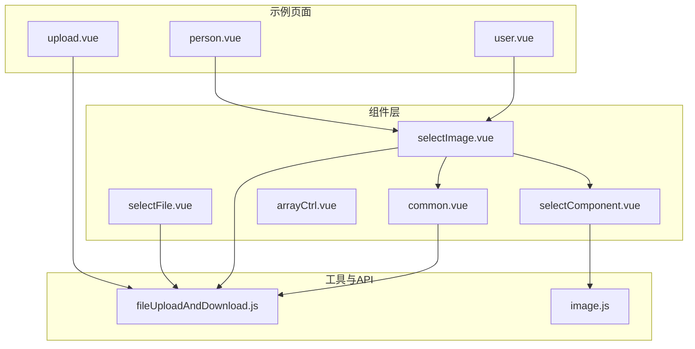
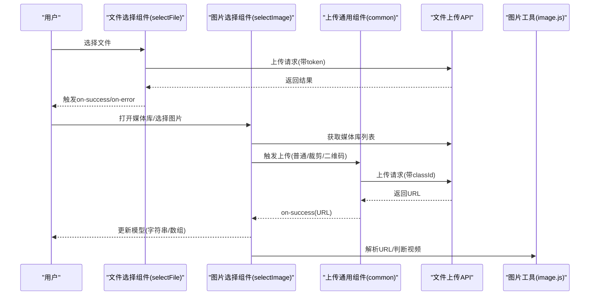
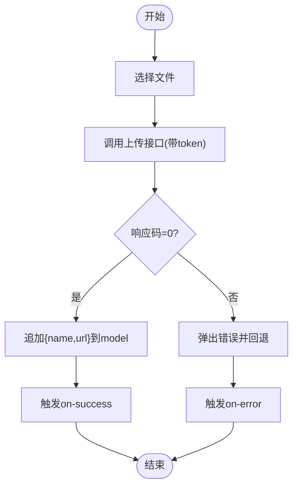
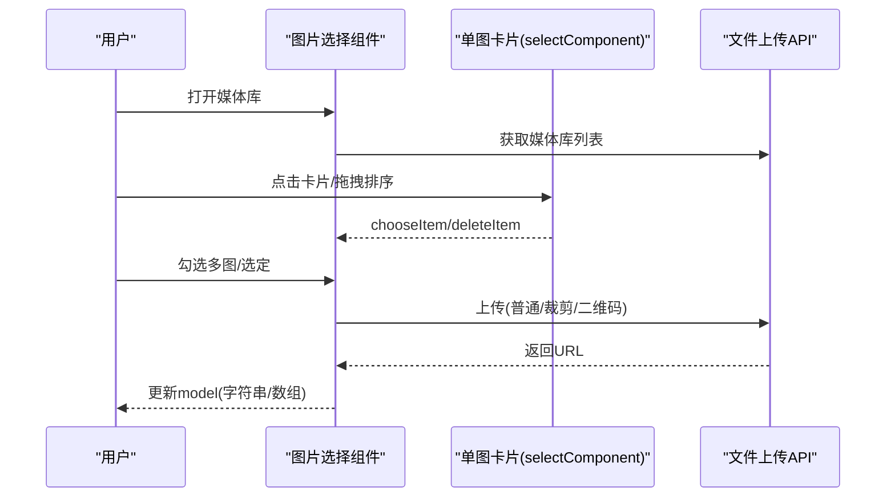
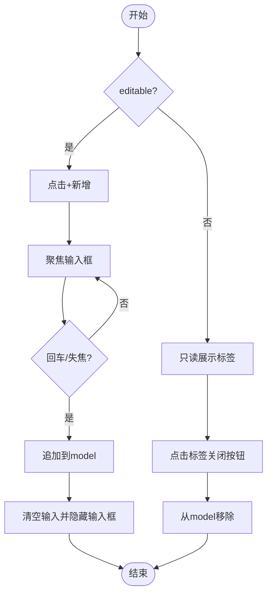
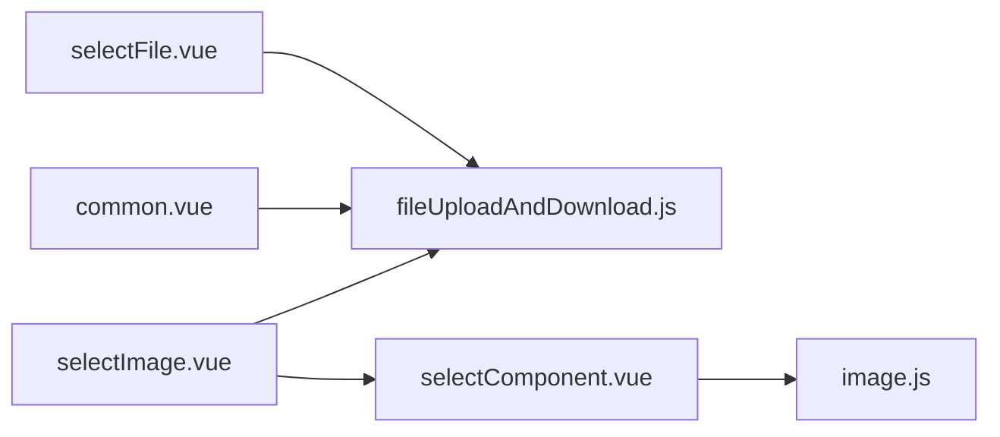

# 表单组件

<cite>
**本文引用的文件**
- [selectFile.vue](file://web/src/components/selectFile/selectFile.vue)
- [selectImage.vue](file://web/src/components/selectImage/selectImage.vue)
- [selectComponent.vue](file://web/src/components/selectImage/selectComponent.vue)
- [arrayCtrl.vue](file://web/src/components/arrayCtrl/arrayCtrl.vue)
- [common.vue](file://web/src/components/upload/common.vue)
- [fileUploadAndDownload.js](file://web/src/api/fileUploadAndDownload.js)
- [image.js](file://web/src/utils/image.js)
- [upload.vue](file://web/src/view/example/upload/upload.vue)
- [person.vue](file://web/src/view/person/person.vue)
- [user.vue](file://web/src/view/superAdmin/user/user.vue)
</cite>

## 目录
1. [简介](#简介)
2. [项目结构](#项目结构)
3. [核心组件](#核心组件)
4. [架构总览](#架构总览)
5. [组件详解](#组件详解)
6. [依赖关系分析](#依赖关系分析)
7. [性能与可用性考量](#性能与可用性考量)
8. [故障排查指南](#故障排查指南)
9. [结论](#结论)
10. [附录](#附录)

## 简介
本文件面向测试管理平台的表单组件，系统性梳理以下三类组件的实现与使用方式：
- 文件选择组件：基于 Element Plus 的上传控件，支持多文件、限制数量与类型、错误提示与成功回调。
- 图片选择组件：提供媒体库选择、拖拽排序、多选勾选、分类管理、裁剪与二维码上传等能力，支持单图与多图模式。
- 数组控制组件：以标签形式展示数组元素，支持新增、删除与可编辑开关。

文档覆盖数据绑定、验证规则、事件处理、选择逻辑、多选支持、数据格式化、可配置性与扩展性，并给出使用场景、集成模式、实际示例与常见问题解决方案。

## 项目结构
围绕表单组件的相关目录与文件如下：
- 组件层
  - 文件选择：web/src/components/selectFile/selectFile.vue
  - 图片选择：web/src/components/selectImage/selectImage.vue、web/src/components/selectImage/selectComponent.vue
  - 数组控制：web/src/components/arrayCtrl/arrayCtrl.vue
  - 上传子组件：web/src/components/upload/common.vue（图片/视频上传校验）
- 工具与API
  - 文件上传与列表：web/src/api/fileUploadAndDownload.js
  - 图片工具：web/src/utils/image.js
- 使用示例
  - 示例页面：web/src/view/example/upload/upload.vue
  - 用户资料页：web/src/view/person/person.vue
  - 用户管理页：web/src/view/superAdmin/user/user.vue

**图表来源**
- [selectFile.vue:1-88](file://web/src/components/selectFile/selectFile.vue#L1-L88)
- [selectImage.vue:1-504](file://web/src/components/selectImage/selectImage.vue#L1-L504)
- [selectComponent.vue:1-87](file://web/src/components/selectImage/selectComponent.vue#L1-L87)
- [arrayCtrl.vue:1-68](file://web/src/components/arrayCtrl/arrayCtrl.vue#L1-L68)
- [common.vue:1-91](file://web/src/components/upload/common.vue#L1-L91)
- [fileUploadAndDownload.js:1-67](file://web/src/api/fileUploadAndDownload.js#L1-L67)
- [image.js:1-127](file://web/src/utils/image.js#L1-L127)
- [upload.vue:1-503](file://web/src/view/example/upload/upload.vue#L1-L503)
- [person.vue:360-559](file://web/src/view/person/person.vue#L360-L559)
- [user.vue:260-459](file://web/src/view/superAdmin/user/user.vue#L260-L459)

**章节来源**
- [selectFile.vue:1-88](file://web/src/components/selectFile/selectFile.vue#L1-L88)
- [selectImage.vue:1-504](file://web/src/components/selectImage/selectImage.vue#L1-L504)
- [selectComponent.vue:1-87](file://web/src/components/selectImage/selectComponent.vue#L1-L87)
- [arrayCtrl.vue:1-68](file://web/src/components/arrayCtrl/arrayCtrl.vue#L1-L68)
- [common.vue:1-91](file://web/src/components/upload/common.vue#L1-L91)
- [fileUploadAndDownload.js:1-67](file://web/src/api/fileUploadAndDownload.js#L1-L67)
- [image.js:1-127](file://web/src/utils/image.js#L1-L127)
- [upload.vue:1-503](file://web/src/view/example/upload/upload.vue#L1-L503)
- [person.vue:360-559](file://web/src/view/person/person.vue#L360-L559)
- [user.vue:260-459](file://web/src/view/superAdmin/user/user.vue#L260-L459)

## 核心组件
- 文件选择组件（selectFile）
  - 支持多文件上传、数量限制、类型过滤、错误与成功事件回调。
  - 数据绑定：通过 defineModel 双向绑定文件数组。
  - 事件：on-success、on-error。
- 图片选择组件（selectImage）
  - 单图/多图模式切换、拖拽排序、勾选多图、媒体库浏览与分类管理、上传入口（普通上传、裁剪、二维码）。
  - 数据绑定：defineModel 接收字符串或数组，内部维护本地状态与媒体库列表。
  - 事件：on-success（来自上传子组件）。
- 数组控制组件（arrayCtrl）
  - 以标签展示数组元素，支持新增与删除，可配置是否可编辑。
  - 数据绑定：defineModel 接收数组，内部维护输入状态与焦点。
- 上传通用组件（common）
  - 提供文件类型与大小校验（图片/视频），统一上传入口与成功回调。

**章节来源**
- [selectFile.vue:21-88](file://web/src/components/selectFile/selectFile.vue#L21-L88)
- [selectImage.vue:150-461](file://web/src/components/selectImage/selectImage.vue#L150-L461)
- [selectComponent.vue:53-87](file://web/src/components/selectImage/selectComponent.vue#L53-L87)
- [arrayCtrl.vue:29-68](file://web/src/components/arrayCtrl/arrayCtrl.vue#L29-L68)
- [common.vue:19-91](file://web/src/components/upload/common.vue#L19-L91)

## 架构总览
下图展示表单组件与外部服务的交互关系：文件选择组件直连后端上传接口；图片选择组件通过媒体库接口与上传子组件协作；数组控制组件作为轻量展示与编辑控件。

**图表来源**
- [selectFile.vue:54-86](file://web/src/components/selectFile/selectFile.vue#L54-L86)
- [selectImage.vue:284-358](file://web/src/components/selectImage/selectImage.vue#L284-L358)
- [common.vue:46-89](file://web/src/components/upload/common.vue#L46-L89)
- [fileUploadAndDownload.js:10-44](file://web/src/api/fileUploadAndDownload.js#L10-L44)
- [image.js:94-127](file://web/src/utils/image.js#L94-L127)

## 组件详解

### 文件选择组件（selectFile）
- 数据绑定
  - 使用 defineModel 接收数组类型，内部维护 fileList 与 model 同步。
- 上传行为
  - 多文件上传，限制数量与类型，携带 x-token 请求头。
  - 成功回调：解析响应码，若成功则追加 {name, url} 到 model。
  - 错误回调：弹出错误消息并触发 on-error。
- 事件
  - on-success(res)：上传成功时触发。
  - on-error(err)：上传失败时触发。
- 配置项
  - limit：最大文件数，默认 3。
  - accept：允许的文件类型字符串。
- 使用建议
  - 在表单中通过 v-model 绑定文件数组，结合表单校验使用。
  - 对于图片/视频，建议优先使用图片选择组件以获得更好的媒体管理体验。

**图表来源**
- [selectFile.vue:54-86](file://web/src/components/selectFile/selectFile.vue#L54-L86)

**章节来源**
- [selectFile.vue:21-88](file://web/src/components/selectFile/selectFile.vue#L21-L88)

### 图片选择组件（selectImage）
- 功能概览
  - 单图/多图模式：单图时直接赋值；多图时以数组存储并支持拖拽排序。
  - 媒体库：树形分类导航、关键词搜索、分页加载、批量勾选与选定。
  - 上传入口：普通上传、图片裁剪、二维码上传、指定尺寸压缩上传。
  - 媒体预览：图片与视频预览，支持删除与重命名。
- 数据绑定
  - defineModel 接收字符串或数组；内部维护 picList、selectedImages、categories 等状态。
- 选择逻辑
  - 单图：点击图片即选中并关闭抽屉。
  - 多图：勾选后点击“选定”批量加入 model。
  - 拖拽排序：使用 vuedraggable，结束时确保 model 为数组。
- 类型与尺寸校验
  - 通过 image.js 的 MIME 类型与扩展名判断，限制图片/视频大小与格式。
- 事件
  - on-success：来自上传子组件的成功回调，刷新媒体库列表。
- 配置项
  - multiple：是否多图模式。
  - fileType：限定类型（如 image/video）。
  - maxUpdateCount：最大更新数量（0 表示无限制）。
  - rounded：圆形头像样式。
- 依赖组件
  - selectComponent：单个图片卡片渲染与交互。
  - common：普通上传组件。
  - cropper、QRCodeUpload、upload-image：其他上传入口。

**图表来源**
- [selectImage.vue:150-461](file://web/src/components/selectImage/selectImage.vue#L150-L461)
- [selectComponent.vue:53-87](file://web/src/components/selectImage/selectComponent.vue#L53-L87)
- [common.vue:46-89](file://web/src/components/upload/common.vue#L46-L89)
- [fileUploadAndDownload.js:10-44](file://web/src/api/fileUploadAndDownload.js#L10-L44)

**章节来源**
- [selectImage.vue:150-461](file://web/src/components/selectImage/selectImage.vue#L150-L461)
- [selectComponent.vue:53-87](file://web/src/components/selectImage/selectComponent.vue#L53-L87)
- [common.vue:19-91](file://web/src/components/upload/common.vue#L19-L91)
- [image.js:94-127](file://web/src/utils/image.js#L94-L127)

### 数组控制组件（arrayCtrl）
- 功能概览
  - 以标签形式展示数组元素，支持新增与删除。
  - 可配置 editable 开关，开启后显示输入框并支持回车/失焦确认。
- 数据绑定
  - defineModel 接收数组，内部维护 inputValue、inputVisible、InputRef。
- 事件与交互
  - 删除：点击标签关闭按钮移除对应元素。
  - 新增：点击“+ 新增”进入输入状态，回车或失焦确认后追加到数组。
- 配置项
  - editable：是否可编辑，默认 false。

**图表来源**
- [arrayCtrl.vue:29-68](file://web/src/components/arrayCtrl/arrayCtrl.vue#L29-L68)

**章节来源**
- [arrayCtrl.vue:1-68](file://web/src/components/arrayCtrl/arrayCtrl.vue#L1-L68)

## 依赖关系分析
- 组件内聚与耦合
  - selectImage 与 selectComponent 高内聚：前者负责业务流程，后者负责单图卡片渲染。
  - selectFile 与 common 低耦合：前者专注上传UI与事件，后者专注上传校验与回调。
  - arrayCtrl 为纯展示/编辑组件，无网络依赖。
- 外部依赖
  - 文件上传 API：统一的分页列表、删除、编辑名称、导入URL等。
  - 图片工具：URL拼接、视频/图片类型判断、Canvas压缩辅助（在上传组件中使用）。
- 可能的循环依赖
  - 当前未发现组件间循环依赖，均为单向依赖。

**图表来源**
- [selectFile.vue:21-88](file://web/src/components/selectFile/selectFile.vue#L21-L88)
- [selectImage.vue:150-461](file://web/src/components/selectImage/selectImage.vue#L150-L461)
- [selectComponent.vue:53-87](file://web/src/components/selectImage/selectComponent.vue#L53-L87)
- [common.vue:19-91](file://web/src/components/upload/common.vue#L19-L91)
- [fileUploadAndDownload.js:10-44](file://web/src/api/fileUploadAndDownload.js#L10-L44)
- [image.js:94-127](file://web/src/utils/image.js#L94-L127)

**章节来源**
- [fileUploadAndDownload.js:1-67](file://web/src/api/fileUploadAndDownload.js#L1-L67)
- [image.js:1-127](file://web/src/utils/image.js#L1-L127)

## 性能与可用性考量
- 上传性能
  - 图片/视频上传前进行类型与大小校验，避免无效请求。
  - 建议在 common 组件中根据项目需求调整大小阈值，减少后端压力。
- 媒体库加载
  - 分页加载与关键词搜索降低一次性数据量，提升交互流畅度。
- 多图排序
  - 拖拽排序使用 vuedraggable，注意在拖拽结束时确保 model 为数组，避免类型不一致导致异常。
- 可访问性
  - 为上传按钮与操作图标提供明确的提示文本与键盘可达性。
- 错误处理
  - 统一的消息提示与错误回退，保证用户操作可预期。

[本节为通用指导，无需特定文件引用]

## 故障排查指南
- 上传失败
  - 症状：弹出“上传失败”消息。
  - 排查：检查 x-token 是否正确、网络是否稳定、后端接口是否可达。
  - 相关实现参考：[selectFile.vue:79-86](file://web/src/components/selectFile/selectFile.vue#L79-L86)、[common.vue:83-89](file://web/src/components/upload/common.vue#L83-L89)
- 文件类型不匹配
  - 症状：提示“上传图片只能是...格式”或“上传视频大小不能超过...”。
  - 排查：确认文件 MIME 类型与扩展名，检查校验逻辑。
  - 相关实现参考：[common.vue:46-74](file://web/src/components/upload/common.vue#L46-L74)、[image.js:109-127](file://web/src/utils/image.js#L109-L127)
- 媒体库为空或无法加载
  - 症状：媒体库列表为空或分页异常。
  - 排查：确认分页参数、关键词搜索条件、分类节点选择。
  - 相关实现参考：[selectImage.vue:294-302](file://web/src/components/selectImage/selectImage.vue#L294-L302)、[fileUploadAndDownload.js:10-16](file://web/src/api/fileUploadAndDownload.js#L10-L16)
- 多图排序后数据类型异常
  - 症状：拖拽结束后 model 不是数组。
  - 排查：在拖拽结束回调中确保 model 为数组。
  - 相关实现参考：[selectImage.vue:447-459](file://web/src/components/selectImage/selectImage.vue#L447-L459)
- 删除文件后列表未刷新
  - 症状：删除成功但页面未更新。
  - 排查：确认删除成功后调用列表刷新逻辑。
  - 相关实现参考：[selectImage.vue:304-324](file://web/src/components/selectImage/selectImage.vue#L304-L324)

**章节来源**
- [selectFile.vue:79-86](file://web/src/components/selectFile/selectFile.vue#L79-L86)
- [common.vue:46-89](file://web/src/components/upload/common.vue#L46-L89)
- [image.js:109-127](file://web/src/utils/image.js#L109-L127)
- [selectImage.vue:294-324](file://web/src/components/selectImage/selectImage.vue#L294-L324)
- [selectImage.vue:447-459](file://web/src/components/selectImage/selectImage.vue#L447-L459)

## 结论
- 文件选择组件适合简单文件上传场景，具备基础的限制与事件回调。
- 图片选择组件提供完整的媒体库与上传生态，覆盖单图/多图、分类管理、多种上传入口与预览能力。
- 数组控制组件简洁实用，适用于标签式数组的增删改场景。
- 三者均采用 defineModel 实现双向绑定，事件驱动清晰，易于在表单中集成与扩展。

[本节为总结，无需特定文件引用]

## 附录

### 使用场景与集成模式
- 文件选择组件
  - 场景：附件上传、日志文件上传等。
  - 集成：在表单中通过 v-model 绑定数组，配合表单校验使用。
  - 参考示例：[selectFile.vue:21-88](file://web/src/components/selectFile/selectFile.vue#L21-L88)
- 图片选择组件
  - 场景：头像设置、产品图片、测试报告截图等。
  - 集成：在用户资料页与用户管理页中直接引入，支持单图与多图模式。
  - 参考示例：[person.vue:363-364](file://web/src/view/person/person.vue#L363-L364)、[user.vue:268](file://web/src/view/superAdmin/user/user.vue#L268)
- 数组控制组件
  - 场景：标签管理、关键字输入、技能列表等。
  - 集成：在需要标签式输入与展示的表单项中使用。
  - 参考示例：[arrayCtrl.vue:1-68](file://web/src/components/arrayCtrl/arrayCtrl.vue#L1-L68)

**章节来源**
- [person.vue:363-364](file://web/src/view/person/person.vue#L363-L364)
- [user.vue:268](file://web/src/view/superAdmin/user/user.vue#L268)
- [arrayCtrl.vue:1-68](file://web/src/components/arrayCtrl/arrayCtrl.vue#L1-L68)

### API 与工具函数要点
- 文件上传与媒体库
  - 获取列表、删除、编辑名称、导入URL等接口。
  - 参考：[fileUploadAndDownload.js:10-44](file://web/src/api/fileUploadAndDownload.js#L10-L44)
- 图片工具
  - URL 拼接、视频/图片类型判断。
  - 参考：[image.js:94-127](file://web/src/utils/image.js#L94-L127)

**章节来源**
- [fileUploadAndDownload.js:10-44](file://web/src/api/fileUploadAndDownload.js#L10-L44)
- [image.js:94-127](file://web/src/utils/image.js#L94-L127)