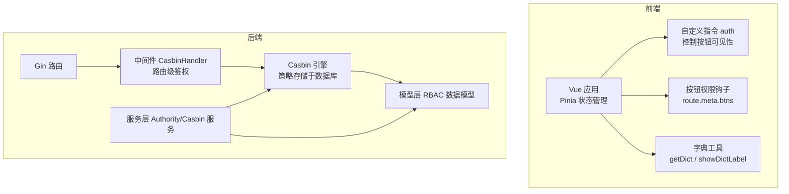
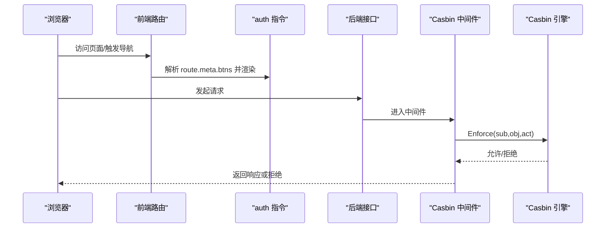
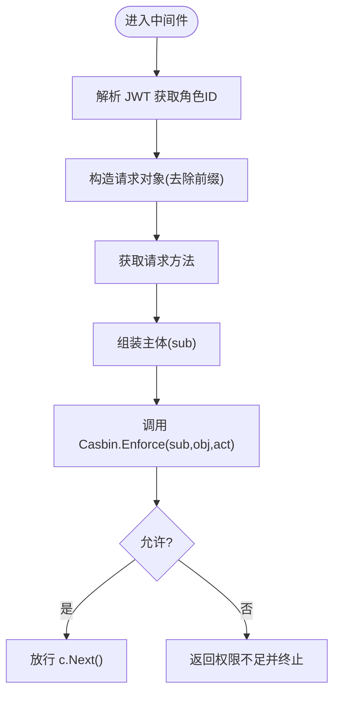
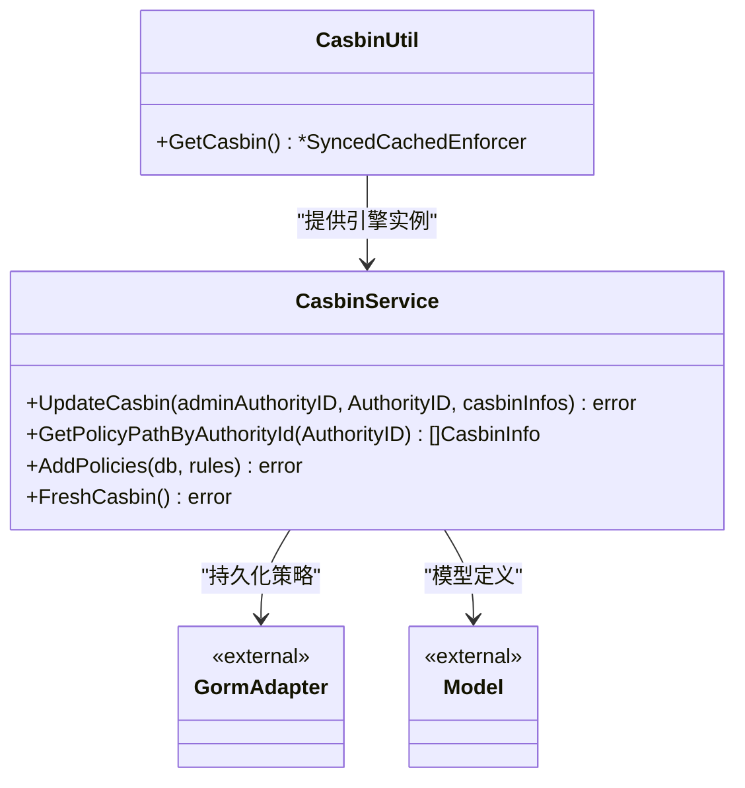
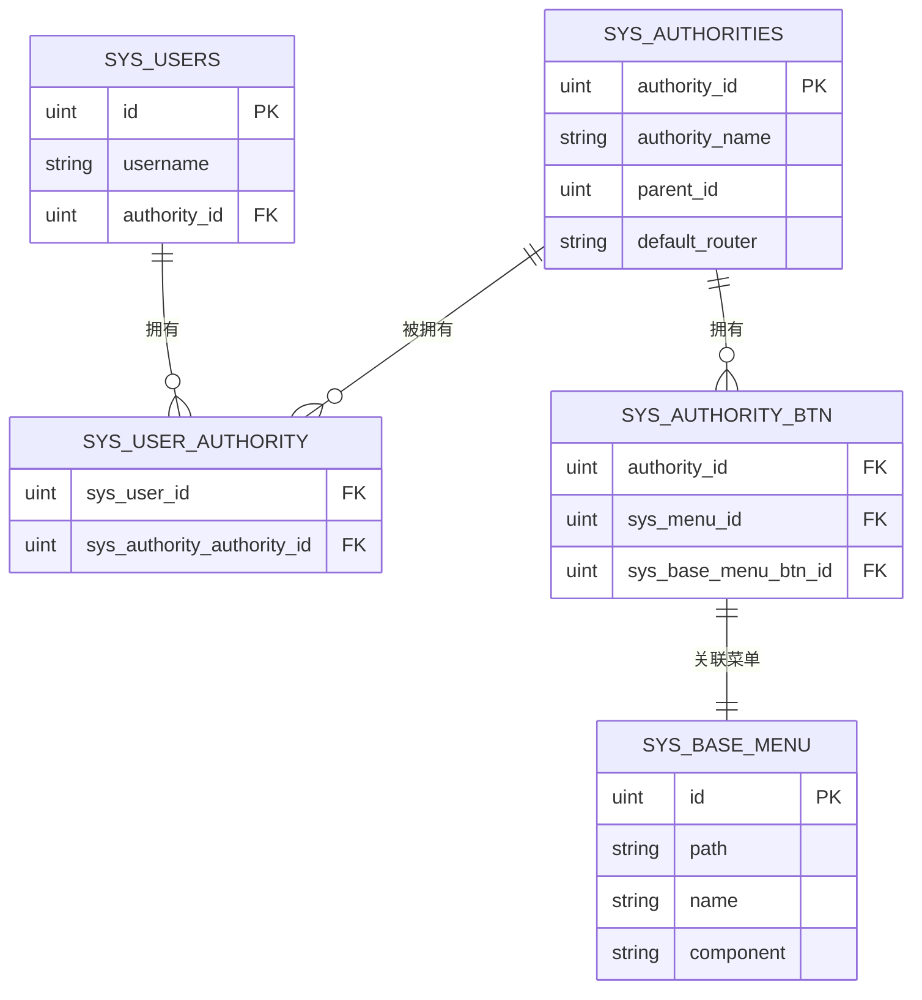
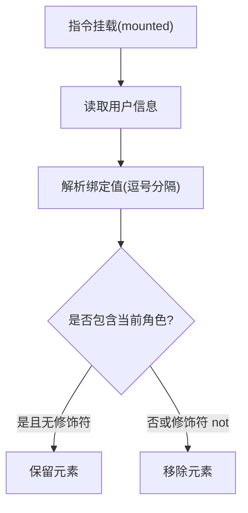
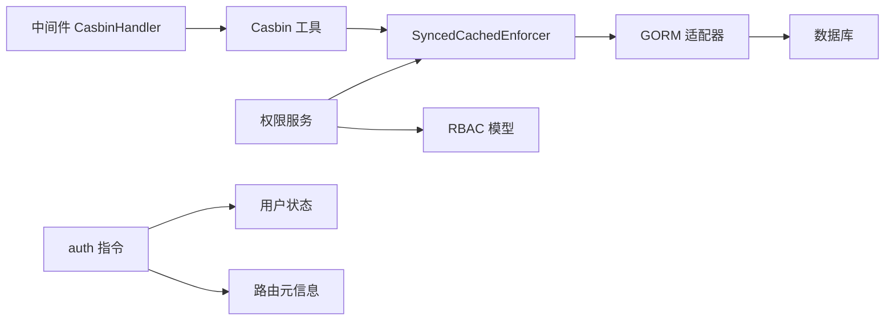

# 权限控制机制

<cite>
**本文引用的文件**
- [server/middleware/casbin_rbac.go](file://server/middleware/casbin_rbac.go)
- [server/utils/casbin_util.go](file://server/utils/casbin_util.go)
- [server/service/system/sys_casbin.go](file://server/service/system/sys_casbin.go)
- [server/service/system/sys_authority.go](file://server/service/system/sys_authority.go)
- [server/router/system/sys_authority.go](file://server/router/system/sys_authority.go)
- [server/model/system/sys_authority.go](file://server/model/system/sys_authority.go)
- [server/model/system/sys_authority_btn.go](file://server/model/system/sys_authority_btn.go)
- [server/model/system/sys_user.go](file://server/model/system/sys_user.go)
- [server/model/system/request/sys_menu.go](file://server/model/system/request/sys_menu.go)
- [web/src/directive/auth.js](file://web/src/directive/auth.js)
- [web/src/utils/btnAuth.js](file://web/src/utils/btnAuth.js)
- [web/src/pinia/modules/user.js](file://web/src/pinia/modules/user.js)
- [web/src/utils/dictionary.js](file://web/src/utils/dictionary.js)
- [server/model/system/sys_dictionary.go](file://server/model/system/sys_dictionary.go)
</cite>

## 目录
1. [引言](#引言)
2. [项目结构](#项目结构)
3. [核心组件](#核心组件)
4. [架构总览](#架构总览)
5. [详细组件分析](#详细组件分析)
6. [依赖分析](#依赖分析)
7. [性能考虑](#性能考虑)
8. [故障排查指南](#故障排查指南)
9. [结论](#结论)
10. [附录](#附录)

## 引言
本文件面向测试管理平台的权限控制机制，系统性阐述基于角色的权限控制系统（RBAC）的实现原理与实践细节。内容覆盖：
- 路由级权限验证与页面元素级权限控制
- 按钮权限指令（auth 指令）的实现与使用
- 字典数据在权限控制中的作用与配置方式
- 权限配置示例、权限继承规则与多层级权限管理
- 权限调试工具与常见问题解决方案
- 权限缓存策略与性能优化建议

## 项目结构
权限控制涉及前后端协同：
- 前端：Vue3 + Pinia + 自定义指令，负责页面元素级权限控制与路由动态加载
- 后端：Gin 中间件 + Casbin + GORM，负责路由级权限校验与策略持久化

图示来源
- [server/middleware/casbin_rbac.go:12-32](file://server/middleware/casbin_rbac.go#L12-L32)
- [server/utils/casbin_util.go:18-52](file://server/utils/casbin_util.go#L18-L52)
- [server/service/system/sys_casbin.go:26-74](file://server/service/system/sys_casbin.go#L26-L74)
- [web/src/directive/auth.js:6-24](file://web/src/directive/auth.js#L6-L24)
- [web/src/utils/btnAuth.js:3-6](file://web/src/utils/btnAuth.js#L3-L6)

章节来源
- [server/middleware/casbin_rbac.go:12-32](file://server/middleware/casbin_rbac.go#L12-L32)
- [server/utils/casbin_util.go:18-52](file://server/utils/casbin_util.go#L18-L52)
- [web/src/directive/auth.js:6-24](file://web/src/directive/auth.js#L6-L24)
- [web/src/utils/btnAuth.js:3-6](file://web/src/utils/btnAuth.js#L3-L6)

## 核心组件
- 路由级权限拦截器：在 Gin 请求链路中对每个请求进行权限判定
- Casbin 策略引擎：以“主体-对象-动作”模型执行权限判断，并支持缓存与持久化
- 权限服务：封装角色、菜单、API 权限的增删改查与同步逻辑
- 页面元素级权限：通过自定义指令与路由元信息控制按钮与区域显示
- 字典数据：用于权限相关配置与展示，提供缓存与查询能力

章节来源
- [server/middleware/casbin_rbac.go:12-32](file://server/middleware/casbin_rbac.go#L12-L32)
- [server/utils/casbin_util.go:18-52](file://server/utils/casbin_util.go#L18-L52)
- [server/service/system/sys_casbin.go:26-74](file://server/service/system/sys_casbin.go#L26-L74)
- [web/src/directive/auth.js:6-24](file://web/src/directive/auth.js#L6-L24)
- [web/src/utils/btnAuth.js:3-6](file://web/src/utils/btnAuth.js#L3-L6)

## 架构总览
下图展示了从浏览器到后端的权限控制流程，以及前端指令如何结合后端策略与路由元信息实现细粒度控制。

图示来源
- [server/middleware/casbin_rbac.go:14-30](file://server/middleware/casbin_rbac.go#L14-L30)
- [server/utils/casbin_util.go:18-52](file://server/utils/casbin_util.go#L18-L52)
- [web/src/directive/auth.js:8-21](file://web/src/directive/auth.js#L8-L21)
- [web/src/utils/btnAuth.js:4-5](file://web/src/utils/btnAuth.js#L4-L5)

## 详细组件分析

### 路由级权限验证（Casbin 中间件）
- 中间件职责：从 JWT 提取用户角色 ID，拼接请求路径与方法，调用 Casbin 执行权限判断
- 关键点：
  - 路径清洗：去除路由前缀，避免策略匹配偏差
  - 角色标识：使用 AuthorityId 作为 sub
  - 拒绝处理：统一返回权限不足并中断后续处理
- 性能：通过缓存引擎减少重复加载策略的成本

图示来源
- [server/middleware/casbin_rbac.go:14-30](file://server/middleware/casbin_rbac.go#L14-L30)

章节来源
- [server/middleware/casbin_rbac.go:12-32](file://server/middleware/casbin_rbac.go#L12-L32)

### Casbin 策略引擎与缓存
- 引擎初始化：基于字符串模型与 GORM 适配器，策略持久化至数据库
- 缓存策略：启用 SyncedCachedEnforcer，设置过期时间，启动时加载策略
- 常用操作：批量添加策略、按条件清除策略、按角色查询策略、刷新策略

图示来源
- [server/utils/casbin_util.go:18-52](file://server/utils/casbin_util.go#L18-L52)
- [server/service/system/sys_casbin.go:26-74](file://server/service/system/sys_casbin.go#L26-L74)

章节来源
- [server/utils/casbin_util.go:18-52](file://server/utils/casbin_util.go#L18-L52)
- [server/service/system/sys_casbin.go:26-74](file://server/service/system/sys_casbin.go#L26-L74)

### 角色与权限数据模型
- 角色模型：包含角色 ID、名称、父角色、默认路由、菜单集合等
- 按钮权限映射：角色-菜单-按钮三者关联，用于页面元素级权限控制
- 用户模型：包含主角色与多角色关联，支持多角色场景

图示来源
- [server/model/system/sys_user.go:20-34](file://server/model/system/sys_user.go#L20-L34)
- [server/model/system/sys_authority.go:7-19](file://server/model/system/sys_authority.go#L7-L19)
- [server/model/system/sys_authority_btn.go:3-8](file://server/model/system/sys_authority_btn.go#L3-L8)

章节来源
- [server/model/system/sys_user.go:20-34](file://server/model/system/sys_user.go#L20-L34)
- [server/model/system/sys_authority.go:7-19](file://server/model/system/sys_authority.go#L7-L19)
- [server/model/system/sys_authority_btn.go:3-8](file://server/model/system/sys_authority_btn.go#L3-L8)

### 页面元素级权限控制（auth 指令）
- 实现思路：在指令挂载时读取用户角色，根据绑定值与修饰符决定元素是否渲染
- 绑定值格式：逗号分隔的角色 ID 列表；修饰符 not 表示取反
- 与路由元信息配合：通过 route.meta.btns 提供按钮级权限清单，前端指令据此过滤不可见按钮

图示来源
- [web/src/directive/auth.js:8-21](file://web/src/directive/auth.js#L8-L21)
- [web/src/utils/btnAuth.js:4-5](file://web/src/utils/btnAuth.js#L4-L5)

章节来源
- [web/src/directive/auth.js:6-24](file://web/src/directive/auth.js#L6-L24)
- [web/src/utils/btnAuth.js:3-6](file://web/src/utils/btnAuth.js#L3-L6)

### 字典数据在权限控制中的作用
- 字典用途：用于权限相关配置项的枚举化管理（如状态、类型），前端通过工具函数获取与展示
- 缓存策略：按类型/深度/节点值生成缓存键，避免重复请求与重复解析
- 展示辅助：提供 label 映射函数，便于在权限控制界面中直观呈现

章节来源
- [web/src/utils/dictionary.js:38-74](file://web/src/utils/dictionary.js#L38-L74)
- [server/model/system/sys_dictionary.go:9-18](file://server/model/system/sys_dictionary.go#L9-L18)

### 权限配置示例与继承规则
- 角色继承：角色可设置父角色，支持树形结构的权限继承与范围限制
- 严格权限模式：开启后仅允许在自身角色树范围内进行权限变更与授权
- API 权限同步：更新角色 API 权限时进行合法性校验与去重处理
- 菜单与按钮：角色绑定菜单与按钮，页面通过指令与元信息控制可见性

章节来源
- [server/service/system/sys_authority.go:194-205](file://server/service/system/sys_authority.go#L194-L205)
- [server/service/system/sys_casbin.go:26-74](file://server/service/system/sys_casbin.go#L26-L74)
- [server/model/system/request/sys_menu.go:20-33](file://server/model/system/request/sys_menu.go#L20-L33)

### 多层级权限管理
- 角色树：通过父子关系构建角色树，支持递归查询子角色与权限范围
- 主角色与多角色：用户可同时拥有多个角色，登录后以主角色为主进行权限判定
- 权限范围校验：在严格模式下，管理员仅能对自身角色树内的角色进行操作

章节来源
- [server/model/system/sys_authority.go:11-14](file://server/model/system/sys_authority.go#L11-L14)
- [server/model/system/sys_user.go:28-29](file://server/model/system/sys_user.go#L28-L29)
- [server/service/system/sys_authority.go:219-237](file://server/service/system/sys_authority.go#L219-L237)

### 权限缓存策略
- Casbin 缓存：启用 SyncedCachedEnforcer，设置过期时间，启动时一次性加载策略
- 前端字典缓存：按类型/深度/节点值生成缓存键，提升权限相关配置的渲染效率
- 策略刷新：通过服务层 FreshCasbin 或手动 LoadPolicy 使策略变更即时生效

章节来源
- [server/utils/casbin_util.go:47-50](file://server/utils/casbin_util.go#L47-L50)
- [web/src/utils/dictionary.js:10-15](file://web/src/utils/dictionary.js#L10-L15)
- [server/service/system/sys_casbin.go:169-173](file://server/service/system/sys_casbin.go#L169-L173)

## 依赖分析
- 中间件依赖 Casbin 引擎，后者依赖数据库适配器与模型定义
- 服务层封装了角色、菜单、API 权限的业务逻辑，并与 Casbin 引擎交互
- 前端指令依赖用户状态与路由元信息，二者共同决定页面元素可见性

图示来源
- [server/middleware/casbin_rbac.go:22-24](file://server/middleware/casbin_rbac.go#L22-L24)
- [server/utils/casbin_util.go:18-52](file://server/utils/casbin_util.go#L18-L52)
- [server/service/system/sys_casbin.go:26-74](file://server/service/system/sys_casbin.go#L26-L74)
- [web/src/directive/auth.js:9-10](file://web/src/directive/auth.js#L9-L10)

章节来源
- [server/middleware/casbin_rbac.go:22-24](file://server/middleware/casbin_rbac.go#L22-L24)
- [server/utils/casbin_util.go:18-52](file://server/utils/casbin_util.go#L18-L52)
- [server/service/system/sys_casbin.go:26-74](file://server/service/system/sys_casbin.go#L26-L74)
- [web/src/directive/auth.js:9-10](file://web/src/directive/auth.js#L9-L10)

## 性能考虑
- 策略缓存：Casbin 使用缓存引擎，避免每次请求都从数据库加载策略
- 去重与批量写入：在更新角色 API 权限时进行去重与批量添加，降低数据库压力
- 前端缓存：字典工具按 key 缓存结果，减少重复请求与解析成本
- 路由懒加载：结合动态路由，仅加载当前用户具备访问权限的菜单与按钮

## 故障排查指南
- 路由访问提示权限不足
  - 检查中间件是否正确提取角色 ID 与请求路径
  - 核对 Casbin 策略中是否存在对应规则
  - 若策略已更新但未生效，尝试刷新策略或重启服务
- 按钮不显示
  - 确认用户角色是否在指令绑定值中
  - 检查修饰符 not 是否导致逻辑反转
  - 确认 route.meta.btns 是否正确下发
- 字典数据异常
  - 检查类型、深度与节点值参数是否符合预期
  - 查看缓存键生成逻辑是否一致
- 角色权限变更无效
  - 在严格模式下确认变更范围是否越权
  - 检查 API 权限同步是否成功，是否存在重复策略导致添加失败

章节来源
- [server/middleware/casbin_rbac.go:25-29](file://server/middleware/casbin_rbac.go#L25-L29)
- [server/service/system/sys_casbin.go:68-73](file://server/service/system/sys_casbin.go#L68-L73)
- [web/src/directive/auth.js:16-21](file://web/src/directive/auth.js#L16-L21)
- [web/src/utils/dictionary.js:45-54](file://web/src/utils/dictionary.js#L45-L54)

## 结论
本项目采用“路由级 + 页面元素级”的双层权限控制方案，结合 Casbin 的策略模型与前端指令，实现了灵活、可维护、高性能的权限体系。通过角色树与严格模式，有效保障了权限变更的安全边界；通过缓存与批量操作，提升了系统整体性能。建议在实际部署中：
- 完善权限审计与日志
- 对关键 API 与按钮建立最小权限原则
- 定期清理冗余策略，保持策略集简洁

## 附录
- 路由级权限验证流程参考：[server/middleware/casbin_rbac.go:14-30](file://server/middleware/casbin_rbac.go#L14-L30)
- Casbin 引擎初始化与缓存策略参考：[server/utils/casbin_util.go:18-52](file://server/utils/casbin_util.go#L18-L52)
- 权限服务更新与同步逻辑参考：[server/service/system/sys_casbin.go:26-74](file://server/service/system/sys_casbin.go#L26-L74)
- 页面元素级权限指令实现参考：[web/src/directive/auth.js:6-24](file://web/src/directive/auth.js#L6-L24)
- 字典工具与缓存策略参考：[web/src/utils/dictionary.js:38-74](file://web/src/utils/dictionary.js#L38-L74)
- 角色与用户模型参考：[server/model/system/sys_authority.go:7-19](file://server/model/system/sys_authority.go#L7-L19)、[server/model/system/sys_user.go:20-34](file://server/model/system/sys_user.go#L20-L34)
- 菜单与按钮权限模型参考：[server/model/system/sys_authority_btn.go:3-8](file://server/model/system/sys_authority_btn.go#L3-L8)、[server/model/system/request/sys_menu.go:20-33](file://server/model/system/request/sys_menu.go#L20-L33)