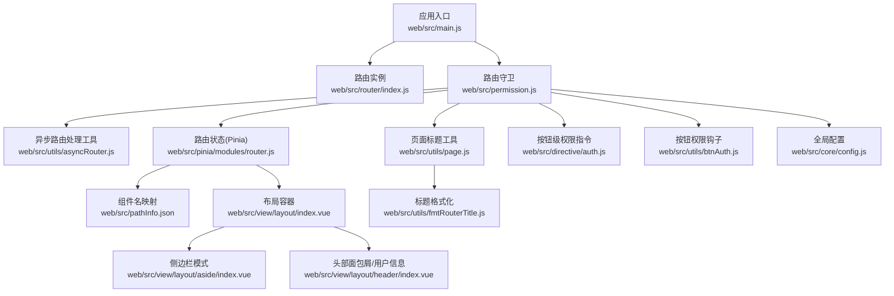
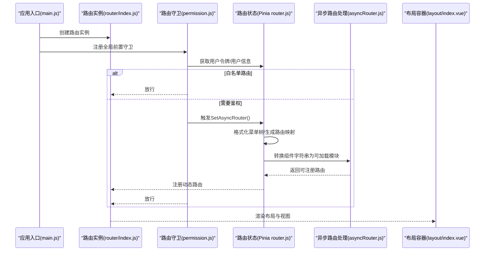
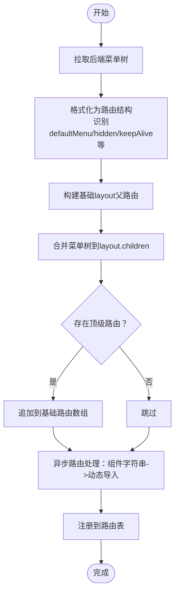
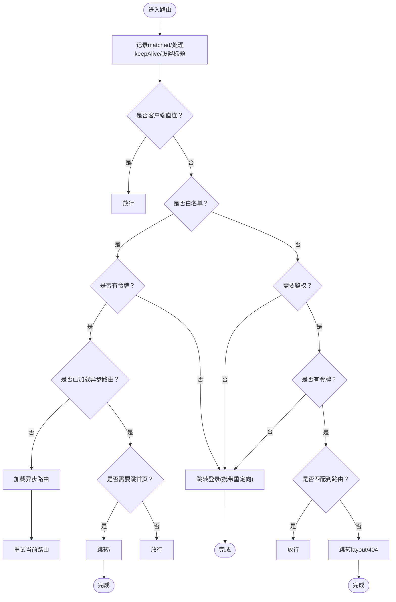
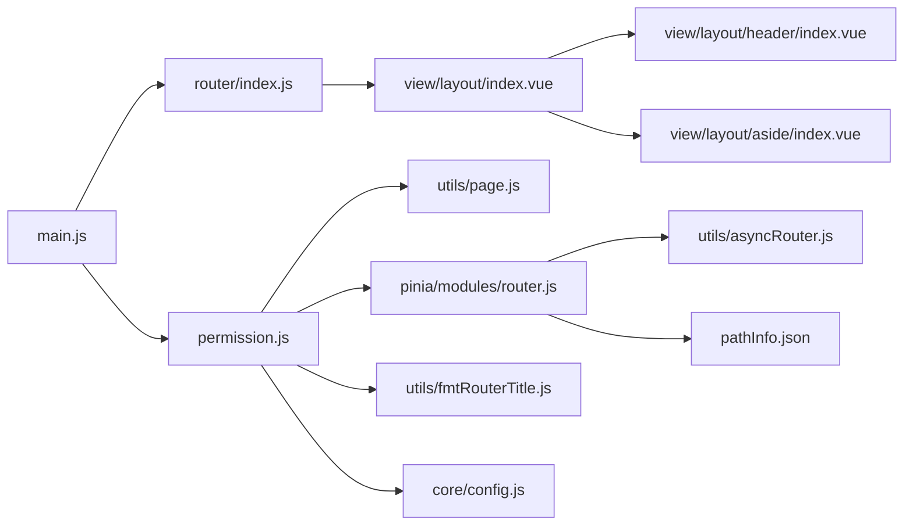

# 路由系统

<cite>
**本文引用的文件**
- [web/src/router/index.js](file://web/src/router/index.js)
- [web/src/permission.js](file://web/src/permission.js)
- [web/src/utils/asyncRouter.js](file://web/src/utils/asyncRouter.js)
- [web/src/pinia/modules/router.js](file://web/src/pinia/modules/router.js)
- [web/src/utils/page.js](file://web/src/utils/page.js)
- [web/src/utils/fmtRouterTitle.js](file://web/src/utils/fmtRouterTitle.js)
- [web/src/main.js](file://web/src/main.js)
- [web/src/view/layout/index.vue](file://web/src/view/layout/index.vue)
- [web/src/view/layout/aside/index.vue](file://web/src/view/layout/aside/index.vue)
- [web/src/view/layout/header/index.vue](file://web/src/view/layout/header/index.vue)
- [web/src/pathInfo.json](file://web/src/pathInfo.json)
- [web/src/utils/btnAuth.js](file://web/src/utils/btnAuth.js)
- [web/src/directive/auth.js](file://web/src/directive/auth.js)
- [web/src/core/config.js](file://web/src/core/config.js)
</cite>

## 目录
1. [简介](#简介)
2. [项目结构](#项目结构)
3. [核心组件](#核心组件)
4. [架构总览](#架构总览)
5. [详细组件分析](#详细组件分析)
6. [依赖分析](#依赖分析)
7. [性能考虑](#性能考虑)
8. [故障排除指南](#故障排除指南)
9. [结论](#结论)
10. [附录](#附录)

## 简介
本文件面向测试管理平台的前端路由系统，系统基于 Vue Router 实现，采用“静态基础路由 + 动态异步路由”的混合模式，结合 Pinia 状态管理、路由守卫、异步路由加载与菜单权限动态绑定，实现权限控制、页面标题动态设置、组件缓存与过渡动画等能力。本文将深入解析：
- 静态路由与动态路由的配置与加载流程
- 路由守卫与白名单机制
- 异步路由加载与菜单权限的动态绑定
- 路由元信息的使用与页面标题动态设置
- 路由懒加载与性能优化策略
- 调试与故障排除方法

## 项目结构
前端路由相关的关键文件分布如下：
- 路由定义与入口：web/src/router/index.js
- 路由守卫与全局逻辑：web/src/permission.js
- 异步路由处理工具：web/src/utils/asyncRouter.js
- 路由状态与菜单生成：web/src/pinia/modules/router.js
- 页面标题与标题格式化：web/src/utils/page.js、web/src/utils/fmtRouterTitle.js
- 应用启动与插件注册：web/src/main.js
- 布局与视图容器：web/src/view/layout/index.vue、web/src/view/layout/aside/index.vue、web/src/view/layout/header/index.vue
- 组件名映射：web/src/pathInfo.json
- 按钮级权限指令与钩子：web/src/directive/auth.js、web/src/utils/btnAuth.js
- 全局配置：web/src/core/config.js

图表来源
- [web/src/main.js:1-38](file://web/src/main.js#L1-L38)
- [web/src/router/index.js:1-42](file://web/src/router/index.js#L1-L42)
- [web/src/permission.js:1-225](file://web/src/permission.js#L1-L225)
- [web/src/utils/asyncRouter.js:1-30](file://web/src/utils/asyncRouter.js#L1-L30)
- [web/src/pinia/modules/router.js:1-208](file://web/src/pinia/modules/router.js#L1-L208)
- [web/src/utils/page.js:1-10](file://web/src/utils/page.js#L1-L10)
- [web/src/utils/fmtRouterTitle.js:1-14](file://web/src/utils/fmtRouterTitle.js#L1-L14)
- [web/src/view/layout/index.vue:1-119](file://web/src/view/layout/index.vue#L1-L119)
- [web/src/view/layout/aside/index.vue:1-40](file://web/src/view/layout/aside/index.vue#L1-L40)
- [web/src/view/layout/header/index.vue:1-134](file://web/src/view/layout/header/index.vue#L1-L134)
- [web/src/pathInfo.json:1-86](file://web/src/pathInfo.json#L1-L86)
- [web/src/directive/auth.js:1-26](file://web/src/directive/auth.js#L1-L26)
- [web/src/utils/btnAuth.js:1-7](file://web/src/utils/btnAuth.js#L1-L7)
- [web/src/core/config.js:1-56](file://web/src/core/config.js#L1-L56)

章节来源
- [web/src/main.js:1-38](file://web/src/main.js#L1-L38)
- [web/src/router/index.js:1-42](file://web/src/router/index.js#L1-L42)

## 核心组件
- 静态基础路由：登录、初始化、扫码上传、兜底错误页等，使用路由懒加载按需加载组件。
- 动态异步路由：从后端拉取菜单树，经 Pinia 路由模块格式化后，通过异步路由处理工具转换为可加载的组件，并注册到路由表。
- 路由守卫：统一处理白名单、鉴权、异步路由首次加载、页面标题设置、keep-alive 缓存策略、错误处理与进度条。
- 页面标题：根据路由元信息与当前路由参数动态拼接标题，统一追加应用名。
- 按钮级权限：指令与钩子读取当前路由元信息中的按钮权限集合，控制按钮渲染。

章节来源
- [web/src/router/index.js:1-42](file://web/src/router/index.js#L1-L42)
- [web/src/permission.js:155-221](file://web/src/permission.js#L155-L221)
- [web/src/utils/page.js:1-10](file://web/src/utils/page.js#L1-L10)
- [web/src/utils/fmtRouterTitle.js:1-14](file://web/src/utils/fmtRouterTitle.js#L1-L14)
- [web/src/directive/auth.js:1-26](file://web/src/directive/auth.js#L1-L26)
- [web/src/utils/btnAuth.js:1-7](file://web/src/utils/btnAuth.js#L1-L7)

## 架构总览
路由系统采用“静态路由 + 动态路由”双轨制：
- 静态路由负责基础页面与兜底，使用哈希历史模式。
- 动态路由由后端菜单树驱动，Pinia 路由模块负责格式化与注册，支持顶级路由(defaultMenu)与嵌套路由的自动扁平化与挂载。

图表来源
- [web/src/main.js:1-38](file://web/src/main.js#L1-L38)
- [web/src/router/index.js:1-42](file://web/src/router/index.js#L1-L42)
- [web/src/permission.js:155-221](file://web/src/permission.js#L155-L221)
- [web/src/pinia/modules/router.js:158-193](file://web/src/pinia/modules/router.js#L158-L193)
- [web/src/utils/asyncRouter.js:4-18](file://web/src/utils/asyncRouter.js#L4-L18)
- [web/src/view/layout/index.vue:33-47](file://web/src/view/layout/index.vue#L33-L47)

## 详细组件分析

### 静态路由与基础配置
- 使用哈希历史模式，确保部署在子路径或无后端代理场景下的可用性。
- 基础路由包含登录、初始化、扫码上传、兜底错误页等；错误页通过通配符捕获未匹配路由并关闭标签页。
- 扫码上传路由带有自定义元信息，用于客户端直连场景。

章节来源
- [web/src/router/index.js:1-42](file://web/src/router/index.js#L1-L42)

### 动态路由与菜单权限绑定
- 后端返回菜单树，Pinia 路由模块将其格式化为带父子关系的路由结构，并识别“顶级路由”标记(defaultMenu)。
- 通过异步路由处理工具将组件字符串路径转换为 Vite 模块加载器可识别的动态导入，再注册到路由表。
- 顶级路由(defaultMenu)直接注册为顶层路由，非顶级路由统一挂载到名为“layout”的父路由下，形成“父路由承载 + 子路由页面”的结构。
- 菜单映射与顶部/左侧菜单联动：根据当前路由反查顶部菜单，联动左侧子菜单。

图表来源
- [web/src/pinia/modules/router.js:14-31](file://web/src/pinia/modules/router.js#L14-L31)
- [web/src/pinia/modules/router.js:158-193](file://web/src/pinia/modules/router.js#L158-L193)
- [web/src/utils/asyncRouter.js:4-18](file://web/src/utils/asyncRouter.js#L4-L18)

章节来源
- [web/src/pinia/modules/router.js:14-31](file://web/src/pinia/modules/router.js#L14-L31)
- [web/src/pinia/modules/router.js:158-193](file://web/src/pinia/modules/router.js#L158-L193)
- [web/src/utils/asyncRouter.js:1-30](file://web/src/utils/asyncRouter.js#L1-L30)

### 路由守卫与权限控制
- 白名单：登录与初始化页面始终放行。
- 鉴权：若无令牌，统一跳转登录页并携带重定向参数。
- 首次进入：若未加载异步路由且不在白名单，先拉取并注册动态路由，再重试目标路由。
- 页面标题：根据路由元信息与当前路由参数动态拼接标题，统一追加应用名。
- keep-alive：在进入时预加载需要缓存的组件，避免首开闪烁。
- 错误处理：监听路由错误并结束进度条。
- 进度条：使用 NProgress 展示导航加载状态。

图表来源
- [web/src/permission.js:155-221](file://web/src/permission.js#L155-L221)
- [web/src/utils/page.js:1-10](file://web/src/utils/page.js#L1-L10)
- [web/src/utils/fmtRouterTitle.js:1-14](file://web/src/utils/fmtRouterTitle.js#L1-L14)

章节来源
- [web/src/permission.js:155-221](file://web/src/permission.js#L155-L221)
- [web/src/utils/page.js:1-10](file://web/src/utils/page.js#L1-L10)
- [web/src/utils/fmtRouterTitle.js:1-14](file://web/src/utils/fmtRouterTitle.js#L1-L14)

### 页面标题与路由元信息
- 页面标题工具会优先使用路由元信息中的标题，若存在模板变量（如 ${id}），通过当前路由的 params 或 query 替换。
- 最终标题追加应用名，保证品牌一致性。
- 布局头部的面包屑也使用相同规则进行标题格式化。

章节来源
- [web/src/utils/page.js:1-10](file://web/src/utils/page.js#L1-L10)
- [web/src/utils/fmtRouterTitle.js:1-14](file://web/src/utils/fmtRouterTitle.js#L1-L14)
- [web/src/view/layout/header/index.vue:25-36](file://web/src/view/layout/header/index.vue#L25-L36)

### 按钮级权限与菜单权限
- 按钮级权限：指令读取当前用户的角色 ID，与绑定值进行比对，决定是否渲染该按钮；支持修饰符取反。
- 菜单权限：Pinia 路由模块在格式化路由时，将按钮权限集合写入路由元信息，供指令与钩子使用。
- 钩子 useBtnAuth：在组件内读取当前路由的按钮权限集合，便于业务层判断。

章节来源
- [web/src/directive/auth.js:1-26](file://web/src/directive/auth.js#L1-L26)
- [web/src/utils/btnAuth.js:1-7](file://web/src/utils/btnAuth.js#L1-L7)
- [web/src/pinia/modules/router.js:14-31](file://web/src/pinia/modules/router.js#L14-L31)

### 布局与视图容器
- 布局容器负责渲染头部、侧边栏、标签页与主内容区，支持多种侧边栏模式与移动端适配。
- 通过 keep-alive 结合路由状态中的组件名列表，实现页面级缓存。
- 提供“刷新”机制，针对需要缓存的页面进行局部重载，避免整页闪烁。

章节来源
- [web/src/view/layout/index.vue:1-119](file://web/src/view/layout/index.vue#L1-L119)
- [web/src/view/layout/aside/index.vue:1-40](file://web/src/view/layout/aside/index.vue#L1-L40)
- [web/src/view/layout/header/index.vue:1-134](file://web/src/view/layout/header/index.vue#L1-L134)

## 依赖分析
- 应用入口 main.js 依赖路由实例、路由守卫、Pinia、Element Plus、自定义指令等。
- 路由守卫依赖用户状态、路由状态、页面标题工具、NProgress。
- 路由状态依赖异步路由处理工具、后端菜单接口、组件名映射文件。
- 布局组件依赖路由状态、用户状态、响应式配置。

图表来源
- [web/src/main.js:1-38](file://web/src/main.js#L1-L38)
- [web/src/router/index.js:1-42](file://web/src/router/index.js#L1-L42)
- [web/src/permission.js:1-225](file://web/src/permission.js#L1-L225)
- [web/src/pinia/modules/router.js:1-208](file://web/src/pinia/modules/router.js#L1-L208)
- [web/src/utils/asyncRouter.js:1-30](file://web/src/utils/asyncRouter.js#L1-L30)
- [web/src/utils/page.js:1-10](file://web/src/utils/page.js#L1-L10)
- [web/src/utils/fmtRouterTitle.js:1-14](file://web/src/utils/fmtRouterTitle.js#L1-L14)
- [web/src/view/layout/index.vue:1-119](file://web/src/view/layout/index.vue#L1-L119)
- [web/src/view/layout/header/index.vue:1-134](file://web/src/view/layout/header/index.vue#L1-L134)
- [web/src/view/layout/aside/index.vue:1-40](file://web/src/view/layout/aside/index.vue#L1-L40)
- [web/src/pathInfo.json:1-86](file://web/src/pathInfo.json#L1-L86)
- [web/src/core/config.js:1-56](file://web/src/core/config.js#L1-L56)

章节来源
- [web/src/main.js:1-38](file://web/src/main.js#L1-L38)
- [web/src/permission.js:1-225](file://web/src/permission.js#L1-L225)

## 性能考虑
- 路由懒加载：静态路由与动态路由均采用动态导入，按需加载组件，减少首屏体积。
- keep-alive 缓存：通过组件名映射与路由元信息，精确控制缓存范围，避免不必要的组件卸载与重建。
- 首次加载优化：在白名单路由中提前触发异步路由加载，减少后续导航等待。
- 进度条与滚动：导航开始显示进度条，完成后隐藏；页面切换时滚动至顶部，提升体验。
- 组件预热：在进入需要缓存的路由前，预先加载组件模块，降低首开延迟。

章节来源
- [web/src/router/index.js:11,25,16](file://web/src/router/index.js#L11,L25,L16)
- [web/src/pinia/modules/router.js:80-100](file://web/src/pinia/modules/router.js#L80-L100)
- [web/src/permission.js:155-221](file://web/src/permission.js#L155-L221)

## 故障排除指南
- 登录后无法进入系统
  - 检查路由守卫中的白名单与令牌逻辑，确认是否正确触发异步路由加载。
  - 确认后端菜单接口返回的路由结构与组件路径是否正确。
- 页面标题不生效
  - 检查路由元信息中的标题字段与模板变量是否与 params/query 对应。
  - 确认页面标题工具与标题格式化函数调用顺序。
- 按钮不显示
  - 检查按钮指令绑定值与用户角色 ID 是否一致，确认指令安装与作用域。
  - 确认路由元信息中的按钮权限集合是否正确注入。
- 路由刷新异常
  - 检查 keep-alive 组件名列表与 pathInfo 映射是否一致。
  - 确认布局容器的“刷新”逻辑是否正确触发。
- 路由错误
  - 查看路由错误监听与进度条移除逻辑，定位具体错误位置并修复。

章节来源
- [web/src/permission.js:155-221](file://web/src/permission.js#L155-L221)
- [web/src/utils/page.js:1-10](file://web/src/utils/page.js#L1-L10)
- [web/src/utils/fmtRouterTitle.js:1-14](file://web/src/utils/fmtRouterTitle.js#L1-L14)
- [web/src/directive/auth.js:1-26](file://web/src/directive/auth.js#L1-L26)
- [web/src/view/layout/index.vue:101-115](file://web/src/view/layout/index.vue#L101-L115)
- [web/src/pathInfo.json:1-86](file://web/src/pathInfo.json#L1-L86)

## 结论
该路由系统通过“静态基础路由 + 动态异步路由”的组合，实现了灵活的权限控制与菜单动态绑定；配合路由守卫、页面标题动态设置、组件缓存与过渡动画，提供了良好的用户体验与开发扩展性。建议在实际项目中：
- 明确静态与动态路由边界，避免重复注册。
- 严格规范路由元信息字段，确保标题与权限控制的一致性。
- 善用 keep-alive 与组件预热策略，平衡内存占用与首开体验。
- 在开发阶段开启路由调试日志，快速定位权限与标题问题。

## 附录
- 路由配置示例与最佳实践
  - 静态路由：使用动态导入与哈希历史模式，确保部署兼容性。
  - 动态路由：后端返回菜单树，Pinia 格式化并注册，支持 defaultMenu 与 keepAlive。
  - 权限控制：白名单 + 令牌校验 + 首次加载异步路由 + 匹配校验。
  - 标题设置：元信息 + 模板变量 + 应用名追加。
  - 按钮权限：指令 + 钩子 + 路由元信息 btns 字段。
- 调试建议
  - 在路由守卫中输出 to/from 与令牌状态，定位拦截原因。
  - 在异步路由处理工具中打印组件路径与匹配结果，排查映射问题。
  - 在布局容器中观察 keep-alive include 列表变化，验证缓存策略。