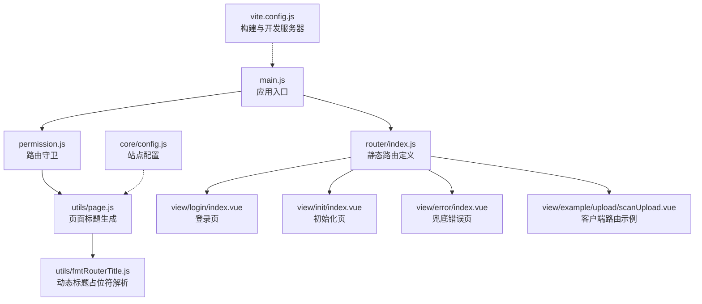
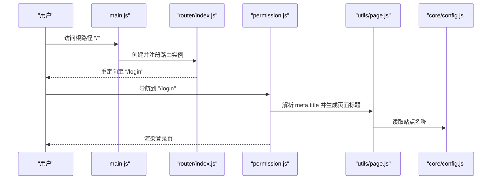
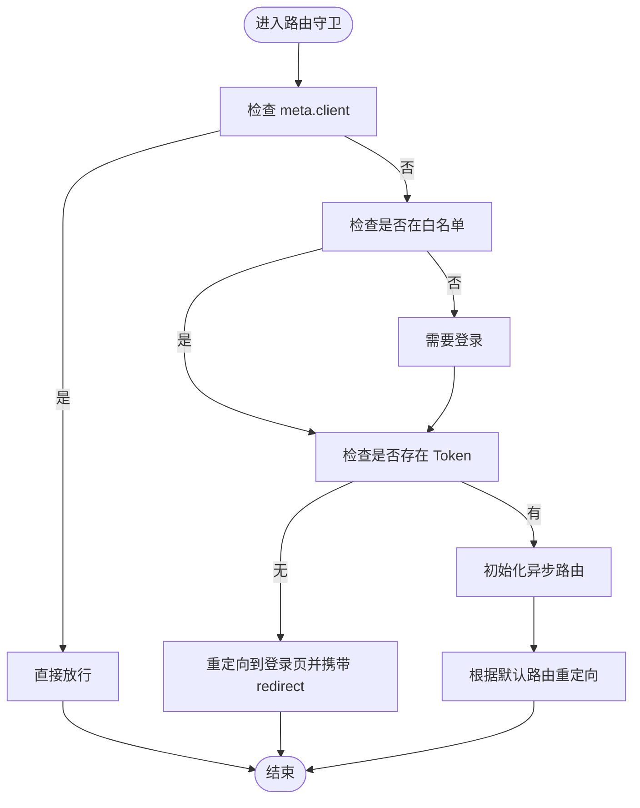
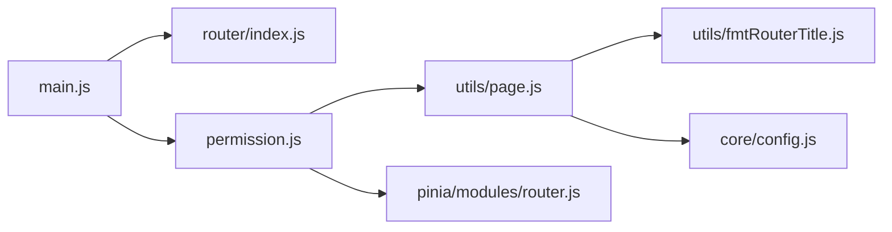

# 静态路由配置

<cite>
**本文引用的文件**
- [web/src/router/index.js](file://web/src/router/index.js)
- [web/src/main.js](file://web/src/main.js)
- [web/src/permission.js](file://web/src/permission.js)
- [web/src/pinia/modules/router.js](file://web/src/pinia/modules/router.js)
- [web/src/utils/page.js](file://web/src/utils/page.js)
- [web/src/utils/fmtRouterTitle.js](file://web/src/utils/fmtRouterTitle.js)
- [web/src/view/login/index.vue](file://web/src/view/login/index.vue)
- [web/src/view/init/index.vue](file://web/src/view/init/index.vue)
- [web/src/view/error/index.vue](file://web/src/view/error/index.vue)
- [web/src/view/example/upload/scanUpload.vue](file://web/src/view/example/upload/scanUpload.vue)
- [web/vite.config.js](file://web/vite.config.js)
- [web/src/core/config.js](file://web/src/core/config.js)
</cite>

## 目录
1. [引言](#引言)
2. [项目结构](#项目结构)
3. [核心组件](#核心组件)
4. [架构总览](#架构总览)
5. [详细组件分析](#详细组件分析)
6. [依赖分析](#依赖分析)
7. [性能考虑](#性能考虑)
8. [故障排查指南](#故障排查指南)
9. [结论](#结论)
10. [附录](#附录)

## 引言
本文件聚焦于测试管理平台前端的“静态路由配置”，系统性阐述基于 Vue Router 的基础路由定义、路由元信息(meta)的使用、路由懒加载与性能优化策略，并结合路由守卫、页面标题生成、以及部署时的历史模式选择与注意事项，帮助开发者快速理解并安全地扩展静态路由。

## 项目结构
静态路由位于前端工程 web/src/router/index.js 中，配合路由守卫 web/src/permission.js 实现白名单、页面标题设置、客户端路由标记等行为；页面标题生成逻辑位于 web/src/utils/page.js 与 web/src/utils/fmtRouterTitle.js；应用入口 web/src/main.js 注册路由实例；构建配置 web/vite.config.js 提供基础路径与开发服务器代理；站点配置 web/src/core/config.js 提供全局应用名等信息。

**图表来源**
- [web/src/main.js:12](file://web/src/main.js#L12)
- [web/src/router/index.js:1-42](file://web/src/router/index.js#L1-L42)
- [web/src/permission.js:167](file://web/src/permission.js#L167)
- [web/src/utils/page.js:1-10](file://web/src/utils/page.js#L1-L10)
- [web/src/utils/fmtRouterTitle.js:1-14](file://web/src/utils/fmtRouterTitle.js#L1-L14)
- [web/vite.config.js:39](file://web/vite.config.js#L39)
- [web/src/core/config.js:8-13](file://web/src/core/config.js#L8-L13)

**章节来源**
- [web/src/router/index.js:1-42](file://web/src/router/index.js#L1-L42)
- [web/src/main.js:12](file://web/src/main.js#L12)
- [web/src/permission.js:167](file://web/src/permission.js#L167)
- [web/src/utils/page.js:1-10](file://web/src/utils/page.js#L1-L10)
- [web/src/utils/fmtRouterTitle.js:1-14](file://web/src/utils/fmtRouterTitle.js#L1-L14)
- [web/vite.config.js:39](file://web/vite.config.js#L39)
- [web/src/core/config.js:8-13](file://web/src/core/config.js#L8-L13)

## 核心组件
- 静态路由定义：根路径重定向、初始化页、登录页、客户端路由、通配符兜底路由。
- 路由守卫：白名单、页面标题设置、客户端路由标记、异步路由注册、登录拦截与跳转。
- 页面标题：基于 meta.title 与动态参数，结合站点配置生成最终标题。
- 构建与部署：基础路径 base 与开发服务器代理，历史模式选择与部署注意事项。

**章节来源**
- [web/src/router/index.js:3-39](file://web/src/router/index.js#L3-L39)
- [web/src/permission.js:15-209](file://web/src/permission.js#L15-L209)
- [web/src/utils/page.js:3-9](file://web/src/utils/page.js#L3-L9)
- [web/src/utils/fmtRouterTitle.js:1-14](file://web/src/utils/fmtRouterTitle.js#L1-L14)
- [web/vite.config.js:39](file://web/vite.config.js#L39)

## 架构总览
静态路由在应用启动时即被注册，随后通过路由守卫(permission.js)对访问进行控制与增强。页面标题生成贯穿守卫流程，确保每个路由的浏览器标题一致且可读。

**图表来源**
- [web/src/main.js:12](file://web/src/main.js#L12)
- [web/src/router/index.js:4-7](file://web/src/router/index.js#L4-L7)
- [web/src/permission.js:167](file://web/src/permission.js#L167)
- [web/src/utils/page.js:3-9](file://web/src/utils/page.js#L3-L9)
- [web/src/core/config.js:8-13](file://web/src/core/config.js#L8-L13)

## 详细组件分析

### 静态路由定义与实现
- 根路径重定向：将 "/" 重定向到 "/login"，保证首次访问进入登录页。
- 初始化页面路由："/init" 对应初始化页组件，支持首次系统初始化。
- 登录页面路由："/login" 对应登录页组件，提供用户认证入口。
- 客户端路由示例："/scanUpload" 使用 meta 标记 client: true，表示该路由无需服务端鉴权，适合直连后端接口的场景。
- 通配符兜底路由："/:catchAll(.*)" 匹配所有未命中路由，渲染错误页并可关闭标签页。

路由懒加载采用动态 import 方式，按需加载组件，减少首屏体积与初次渲染时间。

**章节来源**
- [web/src/router/index.js:3-39](file://web/src/router/index.js#L3-L39)
- [web/src/view/login/index.vue:137-139](file://web/src/view/login/index.vue#L137-L139)
- [web/src/view/init/index.vue:142-144](file://web/src/view/init/index.vue#L142-L144)
- [web/src/view/error/index.vue:29-31](file://web/src/view/error/index.vue#L29-L31)

### 路由元信息(meta)使用
- 页面标题(title)：在路由 meta 中设置 title，路由守卫中调用 getPageTitle 生成最终标题，支持动态参数替换。
- 客户端路由(client)：meta.client 为 true 时，路由被视为“客户端路由”，守卫直接放行，不进行服务端鉴权。
- 关闭标签页(closeTab)：meta.closeTab 用于错误页，指示可关闭标签页的行为。
- 默认菜单(defaultMenu)：在异步路由中用于将某些路由作为顶级路由展示，静态路由中亦可参考该语义进行布局设计。

页面标题生成流程：
- permission.js 在 beforeEach 中设置 document.title。
- utils/page.js 调用 fmtRouterTitle 解析动态参数，再拼接站点名称。

**章节来源**
- [web/src/router/index.js:21-24](file://web/src/router/index.js#L21-L24)
- [web/src/router/index.js:29-31](file://web/src/router/index.js#L29-L31)
- [web/src/permission.js:167](file://web/src/permission.js#L167)
- [web/src/utils/page.js:3-9](file://web/src/utils/page.js#L3-L9)
- [web/src/utils/fmtRouterTitle.js:1-14](file://web/src/utils/fmtRouterTitle.js#L1-L14)
- [web/src/core/config.js:8-13](file://web/src/core/config.js#L8-L13)

### 路由懒加载与性能优化
- 动态 import：静态路由中的 component 均采用动态 import，实现按需加载，降低首屏 JS 体积。
- 组件预加载：在 handleKeepAlive 中，若路由匹配到 keepAlive，会提前加载对应组件，减少切换时的等待。
- 构建产物命名：vite.config.js 中自定义 chunk 与 JS/资源命名，便于缓存与 CDN 管理。
- 开发代理：开发服务器通过代理将 API 请求转发到后端，避免跨域问题，提升开发体验。

最佳实践：
- 将非首屏关键页面（如初始化、登录、扫描上传等）使用懒加载。
- 对频繁切换的页面开启 keepAlive，并在 store 中维护 keepAlive 列表。
- 生产构建开启压缩与去调试符号，减少体积。

**章节来源**
- [web/src/router/index.js:11](file://web/src/router/index.js#L11)
- [web/src/router/index.js:25](file://web/src/router/index.js#L25)
- [web/src/pinia/modules/router.js:81-100](file://web/src/pinia/modules/router.js#L81-L100)
- [web/vite.config.js:80-93](file://web/vite.config.js#L80-L93)

### 路由守卫与白名单
- 白名单：Login、Init 两个路由无需登录即可访问。
- 页面标题：每次导航都会设置 document.title。
- 客户端路由：meta.client 为 true 时直接放行。
- 登录拦截：未登录访问受保护路由时，重定向到 Login 并携带 redirect 参数。
- 异步路由：首次访问受保护路由时，会拉取动态路由并注册，再重试目标路由。

**图表来源**
- [web/src/permission.js:15-209](file://web/src/permission.js#L15-L209)

**章节来源**
- [web/src/permission.js:15-209](file://web/src/permission.js#L15-L209)

### 页面标题生成与动态参数
- utils/page.js：优先使用 meta.title，若存在则调用 fmtRouterTitle 解析动态参数，再拼接站点名称。
- utils/fmtRouterTitle.js：支持形如 "${id}" 的动态占位符，从当前路由的 params 或 query 中取值。

**章节来源**
- [web/src/utils/page.js:3-9](file://web/src/utils/page.js#L3-L9)
- [web/src/utils/fmtRouterTitle.js:1-14](file://web/src/utils/fmtRouterTitle.js#L1-L14)
- [web/src/core/config.js:8-13](file://web/src/core/config.js#L8-L13)

### 客户端路由与扫码上传
- "/scanUpload" 路由设置了 meta.client: true，适合无需服务端鉴权的场景。
- 该路由通过查询参数接收 classId 与 token，用于直连后端接口上传图片。

**章节来源**
- [web/src/router/index.js:21-26](file://web/src/router/index.js#L21-L26)
- [web/src/view/example/upload/scanUpload.vue:110-118](file://web/src/view/example/upload/scanUpload.vue#L110-L118)

### 错误页与兜底路由
- "/:catchAll(.*)" 作为通配符兜底路由，渲染错误页。
- 错误页提供返回首页的按钮，并在异常时触发事件以引导重新登录。

**章节来源**
- [web/src/router/index.js:28-33](file://web/src/router/index.js#L28-L33)
- [web/src/view/error/index.vue:35-48](file://web/src/view/error/index.vue#L35-L48)

## 依赖分析
静态路由与守卫之间的耦合关系如下：
- main.js 注册 router 实例；
- permission.js 依赖 router 实例进行导航控制；
- utils/page.js 依赖 fmtRouterTitle.js 与 core/config.js 生成标题；
- pinia/router.js 与 permission.js 协作处理异步路由与 keepAlive。

**图表来源**
- [web/src/main.js:12](file://web/src/main.js#L12)
- [web/src/router/index.js:1-42](file://web/src/router/index.js#L1-L42)
- [web/src/permission.js:167](file://web/src/permission.js#L167)
- [web/src/utils/page.js:1-10](file://web/src/utils/page.js#L1-L10)
- [web/src/utils/fmtRouterTitle.js:1-14](file://web/src/utils/fmtRouterTitle.js#L1-L14)
- [web/src/core/config.js:8-13](file://web/src/core/config.js#L8-L13)
- [web/src/pinia/modules/router.js:158-193](file://web/src/pinia/modules/router.js#L158-L193)

**章节来源**
- [web/src/main.js:12](file://web/src/main.js#L12)
- [web/src/permission.js:158-193](file://web/src/permission.js#L158-L193)
- [web/src/pinia/modules/router.js:158-193](file://web/src/pinia/modules/router.js#L158-L193)

## 性能考虑
- 路由懒加载：静态路由均采用动态 import，减少首屏加载体积。
- keepAlive 预加载：在 handleKeepAlive 中提前加载组件，降低切换卡顿。
- 构建优化：生产构建开启压缩与去调试符号，Rollup 输出文件名固定前缀，利于缓存。
- 开发代理：通过 devServer.proxy 将 API 请求转发到后端，避免跨域导致的额外握手成本。

最佳实践：
- 将非关键页面（如登录、初始化、扫码上传）使用懒加载。
- 对高频切换页面开启 keepAlive，并在 store 中集中管理 keepAlive 列表。
- 生产环境 base 设置为 "/"，并确保服务器正确配置回退到 index.html。

**章节来源**
- [web/src/router/index.js:11](file://web/src/router/index.js#L11)
- [web/src/router/index.js:25](file://web/src/router/index.js#L25)
- [web/src/pinia/modules/router.js:81-100](file://web/src/pinia/modules/router.js#L81-L100)
- [web/vite.config.js:80-93](file://web/vite.config.js#L80-L93)

## 故障排查指南
- 页面标题未更新
  - 检查路由 meta.title 是否设置，以及 utils/page.js 与 fmtRouterTitle.js 的调用链是否正常。
  - 参考：[web/src/permission.js:167](file://web/src/permission.js#L167)，[web/src/utils/page.js:3-9](file://web/src/utils/page.js#L3-L9)，[web/src/utils/fmtRouterTitle.js:1-14](file://web/src/utils/fmtRouterTitle.js#L1-L14)
- 客户端路由仍被拦截
  - 确认路由 meta.client 是否为 true，守卫中是否直接放行。
  - 参考：[web/src/router/index.js:21-24](file://web/src/router/index.js#L21-L24)，[web/src/permission.js:168-170](file://web/src/permission.js#L168-L170)
- 404 页面未显示
  - 检查通配符路由是否定义，错误页组件是否正确渲染。
  - 参考：[web/src/router/index.js:28-33](file://web/src/router/index.js#L28-L33)，[web/src/view/error/index.vue:29-31](file://web/src/view/error/index.vue#L29-L31)
- 登录后未跳转默认页
  - 检查白名单逻辑与默认路由设置，确认异步路由初始化流程。
  - 参考：[web/src/permission.js:172-183](file://web/src/permission.js#L172-L183)，[web/src/permission.js:194-197](file://web/src/permission.js#L194-L197)

**章节来源**
- [web/src/permission.js:167-183](file://web/src/permission.js#L167-L183)
- [web/src/router/index.js:21-24](file://web/src/router/index.js#L21-L24)
- [web/src/router/index.js:28-33](file://web/src/router/index.js#L28-L33)
- [web/src/view/error/index.vue:29-31](file://web/src/view/error/index.vue#L29-L31)

## 结论
静态路由配置以简洁清晰为核心：根路径重定向、登录与初始化页面、客户端路由与兜底错误页共同构成基础导航骨架；配合路由守卫实现白名单、页面标题与登录拦截；通过懒加载与 keepAlive 预加载优化性能；结合构建配置与部署注意事项，确保开发与生产的稳定一致。

## 附录

### 路由历史模式与部署注意事项
- 历史模式选择
  - 当前使用哈希历史(createWebHashHistory)，无需服务器额外配置，适合静态托管与多环境部署。
  - 若改为 HTML5 历史模式，需在服务器层将所有未命中路由回退到 index.html，确保前端路由正常工作。
- 构建基础路径
  - vite.config.js 中 base 默认为 "/"，生产部署时可根据 CDN 或子路径调整。
- 开发代理
  - devServer.proxy 将 API 请求转发到后端，避免跨域问题，提升开发效率。

**章节来源**
- [web/src/router/index.js:36-39](file://web/src/router/index.js#L36-L39)
- [web/vite.config.js:39](file://web/vite.config.js#L39)
- [web/vite.config.js:61-77](file://web/vite.config.js#L61-L77)