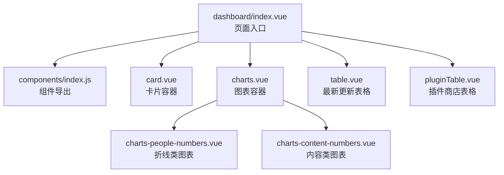
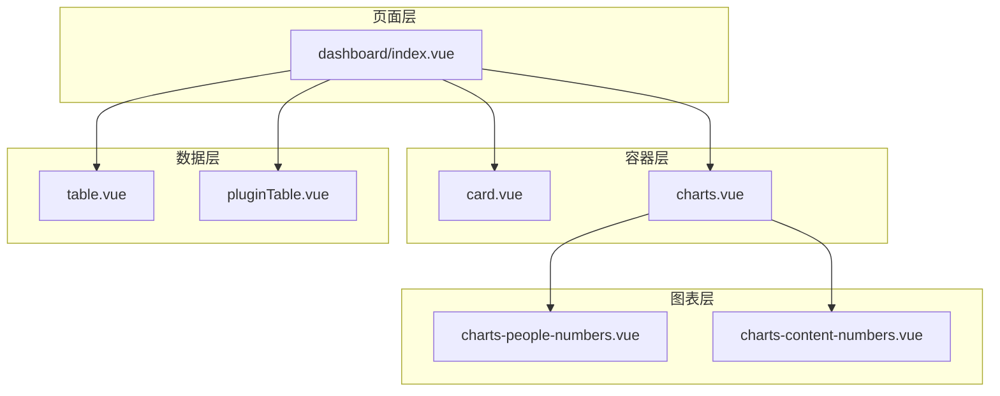
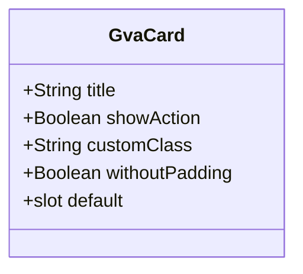
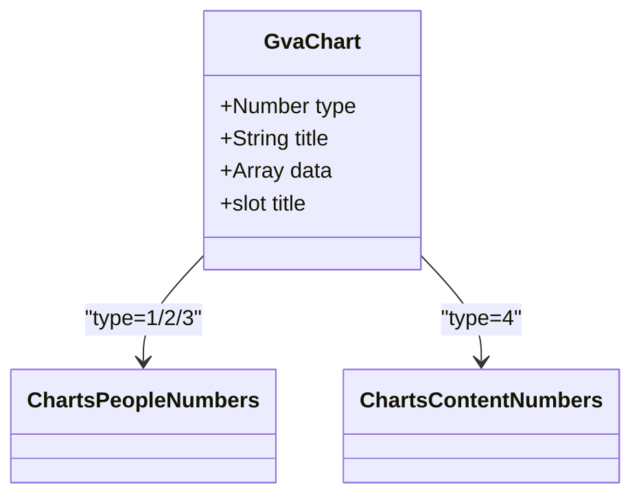
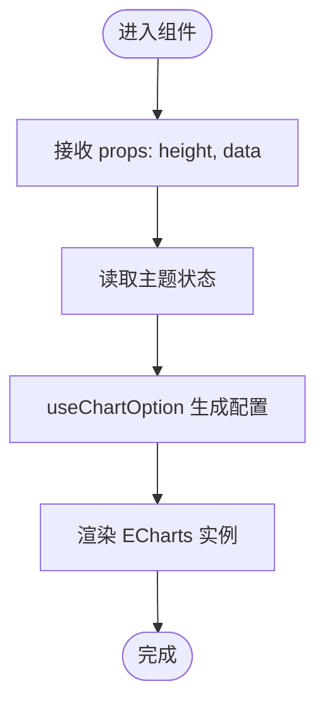
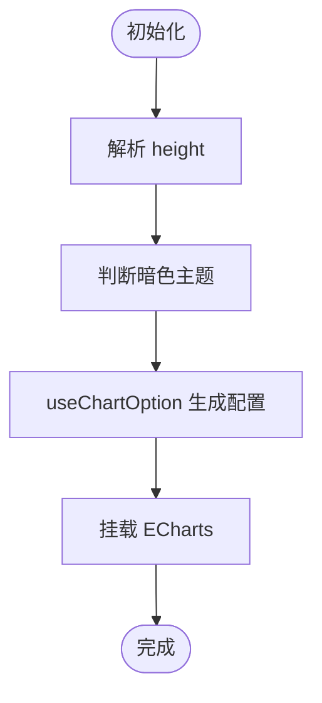
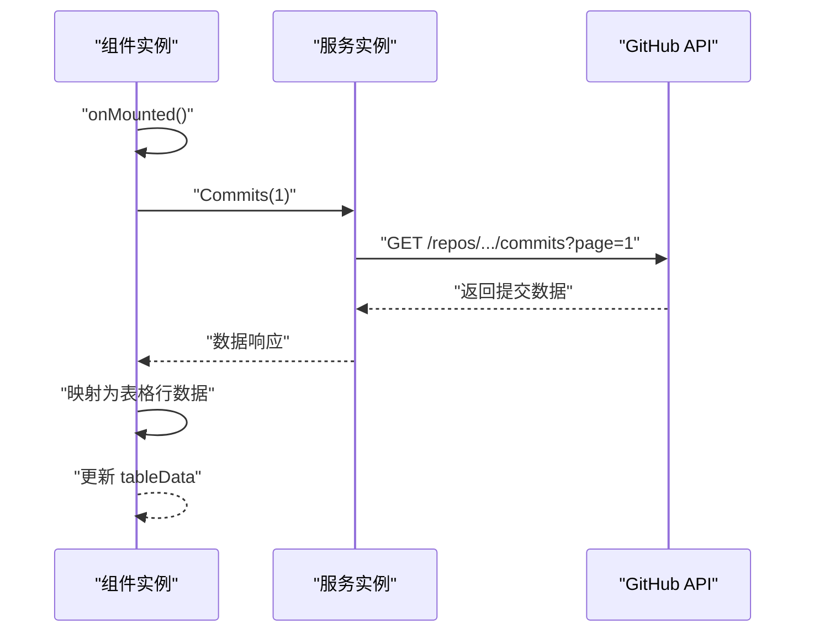
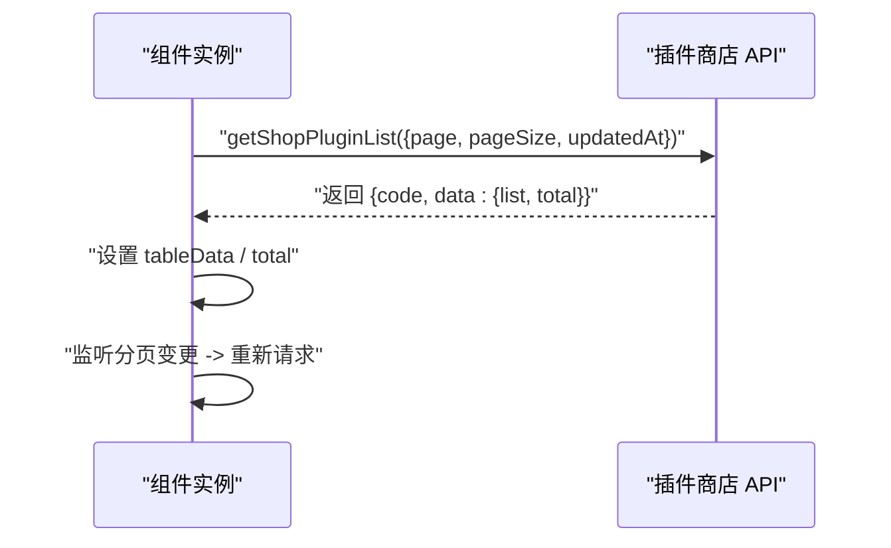
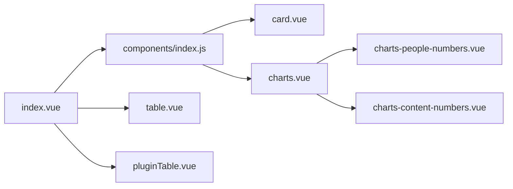

# 仪表盘页面

<cite>
**本文引用的文件**
- [index.vue](file://web/src/view/dashboard/index.vue)
- [index.js](file://web/src/view/dashboard/components/index.js)
- [card.vue](file://web/src/view/dashboard/components/card.vue)
- [charts.vue](file://web/src/view/dashboard/components/charts.vue)
- [charts-people-numbers.vue](file://web/src/view/dashboard/components/charts-people-numbers.vue)
- [charts-content-numbers.vue](file://web/src/view/dashboard/components/charts-content-numbers.vue)
- [table.vue](file://web/src/view/dashboard/components/table.vue)
- [pluginTable.vue](file://web/src/view/dashboard/components/pluginTable.vue)
</cite>

## 目录
1. [引言](#引言)
2. [项目结构](#项目结构)
3. [核心组件](#核心组件)
4. [架构总览](#架构总览)
5. [详细组件分析](#详细组件分析)
6. [依赖分析](#依赖分析)
7. [性能考虑](#性能考虑)
8. [故障排查指南](#故障排查指南)
9. [结论](#结论)
10. [附录](#附录)

## 引言
本文件面向测试管理平台的仪表盘页面，系统性阐述其设计理念、布局与数据可视化实现。仪表盘采用卡片化布局，结合统计卡片、折线类图表与数据表格，形成“概览—明细—动态”的信息层级。图表部分通过 ECharts 封装组件实现，具备主题色适配与响应式网格布局；表格组件负责展示最新更新与插件动态；整体通过组合模式实现模块化复用与灵活扩展。

## 项目结构
仪表盘页面位于前端工程的视图层，采用按功能分组的组件组织方式：
- 页面入口：dashboard/index.vue
- 组件聚合导出：dashboard/components/index.js
- 卡片容器：card.vue
- 图表容器：charts.vue
- 折线类图表子组件：charts-people-numbers.vue
- 内容类图表子组件：charts-content-numbers.vue
- 最新更新表格：table.vue
- 插件商店表格：pluginTable.vue

**图表来源**
- [index.vue:1-129](file://web/src/view/dashboard/index.vue#L1-L129)
- [index.js:1-20](file://web/src/view/dashboard/components/index.js#L1-L20)
- [card.vue:1-46](file://web/src/view/dashboard/components/card.vue#L1-L46)
- [charts.vue:1-50](file://web/src/view/dashboard/components/charts.vue#L1-L50)
- [charts-people-numbers.vue:1-60](file://web/src/view/dashboard/components/charts-people-numbers.vue#L1-L60)
- [charts-content-numbers.vue:1-54](file://web/src/view/dashboard/components/charts-content-numbers.vue#L1-L54)
- [table.vue:1-48](file://web/src/view/dashboard/components/table.vue#L1-L48)
- [pluginTable.vue:1-66](file://web/src/view/dashboard/components/pluginTable.vue#L1-L66)

**章节来源**
- [index.vue:1-129](file://web/src/view/dashboard/index.vue#L1-L129)
- [index.js:1-20](file://web/src/view/dashboard/components/index.js#L1-L20)

## 核心组件
- 卡片容器（GvaCard）
  - 提供统一的标题区、操作区与内容插槽，支持无内边距与自定义样式类。
  - 属性：title、showAction、customClass、withoutPadding。
- 图表容器（GvaChart）
  - 根据 type 渲染不同图表类型：type=1/2/3 对应折线类图表，type=4 对应内容类图表；同时在右侧区域渲染对应折线图。
  - 属性：type、title；内部维护示例数据数组 data。
- 折线类图表（charts-people-numbers）
  - 基于 ECharts 的折线图封装，支持主题色与图形元素工厂函数生成坐标轴标注。
  - 属性：height、data；内部使用 useChartOption 钩子生成图表配置。
- 内容类图表（charts-content-numbers）
  - 基于 ECharts 的通用图表封装，用于展示内容类指标与趋势。
  - 属性：height；内部使用 useChartOption 钩子生成图表配置。
- 最新更新表格（GvaTable）
  - 使用 Element Plus 表格展示最近提交记录，从 GitHub API 获取数据并格式化时间。
  - 支持挂载时自动加载。
- 插件商店表格（GvaPluginTable）
  - 使用 Element Plus 表格展示插件列表，支持分页与价格显示（免费/金额）。
  - 通过插件商店 API 获取数据并设置总数。

**章节来源**
- [card.vue:1-46](file://web/src/view/dashboard/components/card.vue#L1-L46)
- [charts.vue:1-50](file://web/src/view/dashboard/components/charts.vue#L1-L50)
- [charts-people-numbers.vue:1-60](file://web/src/view/dashboard/components/charts-people-numbers.vue#L1-L60)
- [charts-content-numbers.vue:1-54](file://web/src/view/dashboard/components/charts-content-numbers.vue#L1-L54)
- [table.vue:1-48](file://web/src/view/dashboard/components/table.vue#L1-L48)
- [pluginTable.vue:1-66](file://web/src/view/dashboard/components/pluginTable.vue#L1-L66)

## 架构总览
仪表盘采用“页面容器 + 组合卡片 + 图表子组件 + 表格组件”的分层设计。页面容器负责整体布局与数据准备，卡片容器提供一致的视觉与交互语义，图表子组件封装具体可视化细节，表格组件承载动态数据列表。

**图表来源**
- [index.vue:1-129](file://web/src/view/dashboard/index.vue#L1-L129)
- [card.vue:1-46](file://web/src/view/dashboard/components/card.vue#L1-L46)
- [charts.vue:1-50](file://web/src/view/dashboard/components/charts.vue#L1-L50)
- [charts-people-numbers.vue:1-60](file://web/src/view/dashboard/components/charts-people-numbers.vue#L1-L60)
- [charts-content-numbers.vue:1-54](file://web/src/view/dashboard/components/charts-content-numbers.vue#L1-L54)
- [table.vue:1-48](file://web/src/view/dashboard/components/table.vue#L1-L48)
- [pluginTable.vue:1-66](file://web/src/view/dashboard/components/pluginTable.vue#L1-L66)

## 详细组件分析

### 卡片容器（GvaCard）
- 设计要点
  - 标题区与操作区分离，便于扩展更多控制按钮或跳转链接。
  - 插槽承载任意内容，支持复杂布局嵌套。
  - 支持无内边距模式以贴合全宽图表。
- 数据与状态
  - 无内部状态，完全由外部传入属性与插槽内容决定。
- 视觉与交互
  - 暗色主题下自动切换深色背景与浅色文字，提升对比度。
  - 悬停态高亮“更多”操作，增强交互反馈。

**图表来源**
- [card.vue:1-46](file://web/src/view/dashboard/components/card.vue#L1-L46)

**章节来源**
- [card.vue:1-46](file://web/src/view/dashboard/components/card.vue#L1-L46)

### 图表容器（GvaChart）
- 设计要点
  - 通过 type 切换不同图表类型，右侧区域渲染对应折线图，形成“指标+趋势”的复合展示。
  - 内置统计数值与变化率展示，突出关键指标。
- 数据与状态
  - 内部维护示例数据数组 data，包含三组折线数据。
  - 通过 props 接收图表标题 title。
- 视觉与交互
  - 右侧折线图高度自适应父容器，保证视觉平衡。
  - 标题区支持插槽扩展，满足多样化标题渲染需求。

**图表来源**
- [charts.vue:1-50](file://web/src/view/dashboard/components/charts.vue#L1-L50)
- [charts-people-numbers.vue:1-60](file://web/src/view/dashboard/components/charts-people-numbers.vue#L1-L60)
- [charts-content-numbers.vue:1-54](file://web/src/view/dashboard/components/charts-content-numbers.vue#L1-L54)

**章节来源**
- [charts.vue:1-50](file://web/src/view/dashboard/components/charts.vue#L1-L50)

### 折线类图表（charts-people-numbers）
- 设计要点
  - 基于 ECharts 的折线图封装，支持主题色适配与坐标轴隐藏。
  - 通过图形工厂函数生成左右标注文本，提升可读性。
- 数据与状态
  - 接收外部数据 data，内部使用 useChartOption 钩子生成图表配置。
  - 支持自定义高度 height。
- 性能与可维护性
  - 将配置生成逻辑抽象到钩子中，降低组件复杂度。
  - 通过 Pinia store 的主题状态驱动颜色选择，避免重复计算。

**图表来源**
- [charts-people-numbers.vue:1-60](file://web/src/view/dashboard/components/charts-people-numbers.vue#L1-L60)

**章节来源**
- [charts-people-numbers.vue:1-60](file://web/src/view/dashboard/components/charts-people-numbers.vue#L1-L60)

### 内容类图表（charts-content-numbers）
- 设计要点
  - 通用图表封装，适合展示内容类指标与趋势。
  - 通过 useChartOption 钩子生成配置，支持主题色与图形元素。
- 数据与状态
  - 接收外部高度 height，内部维护示例数据与坐标轴配置。
- 可扩展性
  - 可作为其他类型图表的基座，通过传入不同数据与配置实现差异化展示。

**图表来源**
- [charts-content-numbers.vue:1-54](file://web/src/view/dashboard/components/charts-content-numbers.vue#L1-L54)

**章节来源**
- [charts-content-numbers.vue:1-54](file://web/src/view/dashboard/components/charts-content-numbers.vue#L1-L54)

### 最新更新表格（GvaTable）
- 设计要点
  - 使用 Element Plus 表格展示最近提交记录，包含排名、消息、作者与时间列。
  - 从 GitHub API 获取数据，格式化时间为本地字符串。
- 数据与状态
  - 在挂载时自动请求第一页数据，截取前五条记录进行展示。
  - 通过 axios 创建服务实例，简化请求配置。
- 可靠性
  - 包含异常兜底的日期格式化逻辑，确保在极端情况下仍能正确显示。

**图表来源**
- [table.vue:1-48](file://web/src/view/dashboard/components/table.vue#L1-L48)

**章节来源**
- [table.vue:1-48](file://web/src/view/dashboard/components/table.vue#L1-L48)

### 插件商店表格（GvaPluginTable）
- 设计要点
  - 展示插件标题、简介与价格，价格为 0 显示“免费”，否则显示人民币金额。
  - 支持分页，当前页与每页大小可调整。
- 数据与状态
  - 通过插件商店 API 获取列表与总数，设置到组件状态。
  - 分页事件触发重新获取数据。
- 可用性
  - 插件标题点击跳转至详情页，提升用户直达效率。

**图表来源**
- [pluginTable.vue:1-66](file://web/src/view/dashboard/components/pluginTable.vue#L1-L66)

**章节来源**
- [pluginTable.vue:1-66](file://web/src/view/dashboard/components/pluginTable.vue#L1-L66)

## 依赖分析
- 组件耦合
  - 页面容器仅依赖组件聚合导出，不直接导入各子组件，降低耦合度。
  - 图表容器对折线与内容图表采用条件渲染，保持单一职责。
- 外部依赖
  - 图表依赖 ECharts 与 useChartOption 钩子，统一配置生成。
  - 表格组件依赖 Element Plus 组件库与 axios。
- 数据流
  - 页面容器负责日期计算与外部链接跳转，子组件专注自身数据与渲染。
  - 表格组件通过 API 获取远端数据，图表组件通过 props 或内部示例数据渲染。

**图表来源**
- [index.vue:1-129](file://web/src/view/dashboard/index.vue#L1-L129)
- [index.js:1-20](file://web/src/view/dashboard/components/index.js#L1-L20)
- [charts.vue:1-50](file://web/src/view/dashboard/components/charts.vue#L1-L50)
- [charts-people-numbers.vue:1-60](file://web/src/view/dashboard/components/charts-people-numbers.vue#L1-L60)
- [charts-content-numbers.vue:1-54](file://web/src/view/dashboard/components/charts-content-numbers.vue#L1-L54)
- [table.vue:1-48](file://web/src/view/dashboard/components/table.vue#L1-L48)
- [pluginTable.vue:1-66](file://web/src/view/dashboard/components/pluginTable.vue#L1-L66)

**章节来源**
- [index.js:1-20](file://web/src/view/dashboard/components/index.js#L1-L20)

## 性能考虑
- 图表渲染
  - 使用 useChartOption 钩子集中生成配置，减少重复计算与内存占用。
  - 折线图隐藏坐标轴与刻度，降低渲染开销。
- 表格加载
  - 最新更新表格仅加载前五条记录，减少 DOM 与网络请求压力。
  - 插件表格启用分页，避免一次性加载大量数据。
- 主题切换
  - 通过 Pinia store 的主题状态驱动颜色选择，避免频繁重绘。
- 响应式布局
  - 使用 CSS Grid 与 Flex 布局，配合断点适配不同屏幕尺寸，减少额外脚本计算。

[本节为通用性能建议，无需特定文件引用]

## 故障排查指南
- 图表不显示或空白
  - 检查 useChartOption 返回的配置是否正确生成。
  - 确认容器高度设置合理，ECharts 需要明确的高度才能渲染。
- 表格数据为空
  - 确认 API 请求地址与参数正确，检查返回结构与字段映射。
  - 对于 GitHub API，注意速率限制与跨域问题。
- 主题色异常
  - 检查 Pinia store 中的主题状态是否正确传递到组件。
  - 确认暗色主题下的颜色值与透明度设置符合预期。
- 分页无效
  - 检查分页回调是否正确触发 getTableData。
  - 确认 total 与 page、pageSize 的同步关系。

**章节来源**
- [charts-people-numbers.vue:1-60](file://web/src/view/dashboard/components/charts-people-numbers.vue#L1-L60)
- [charts-content-numbers.vue:1-54](file://web/src/view/dashboard/components/charts-content-numbers.vue#L1-L54)
- [table.vue:1-48](file://web/src/view/dashboard/components/table.vue#L1-L48)
- [pluginTable.vue:1-66](file://web/src/view/dashboard/components/pluginTable.vue#L1-L66)

## 结论
仪表盘页面通过卡片化布局与图表子组件的组合，实现了从概览到明细的多层次信息呈现。图表封装统一了配置生成与主题适配，表格组件承担动态数据展示与交互。整体设计具备良好的可扩展性与可维护性，适合在测试管理场景中持续演进。

[本节为总结性内容，无需特定文件引用]

## 附录
- 实时更新与定时刷新
  - 当前实现为挂载时一次性加载数据。若需实时更新，可在组件中引入定时器或 SSE 机制，并在组件卸载时清理定时器。
- 响应式与移动端适配
  - 布局已基于断点进行网格划分，建议在移动端进一步优化字体大小与间距，确保触摸交互的可用性。
- 图表交互与数据钻取
  - 可在图表配置中启用点击、缩放、提示框等交互功能，并通过事件回调实现数据钻取到更细粒度的数据面板。
- 数据源配置与性能优化
  - 对高频接口增加缓存策略与请求合并；对大表格启用虚拟滚动；对图表启用懒渲染与按需加载。

[本节为概念性建议，无需特定文件引用]