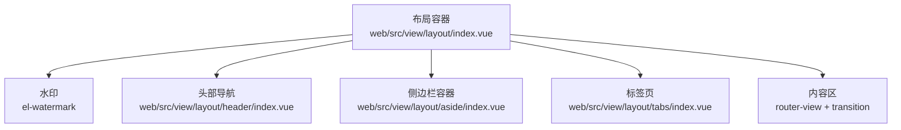
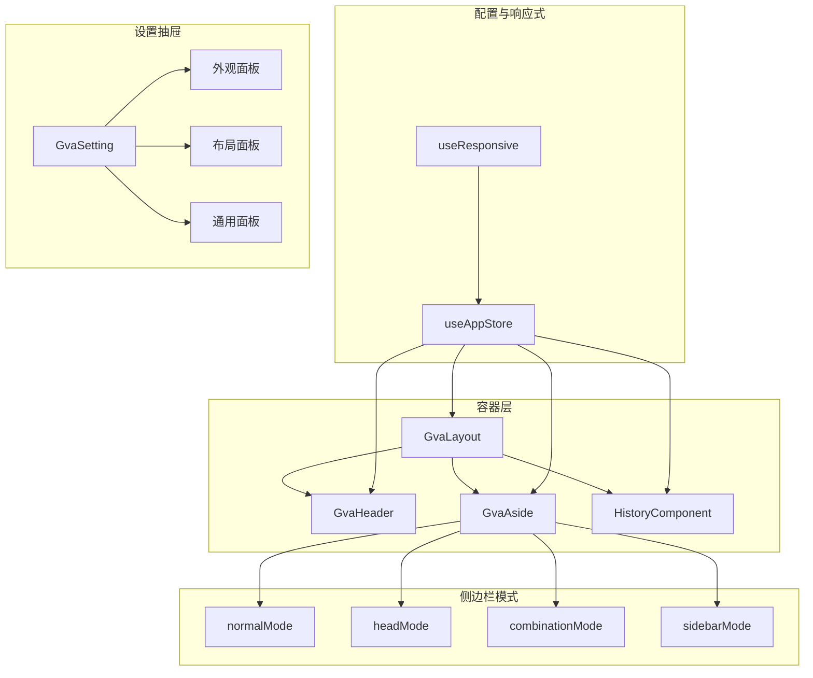
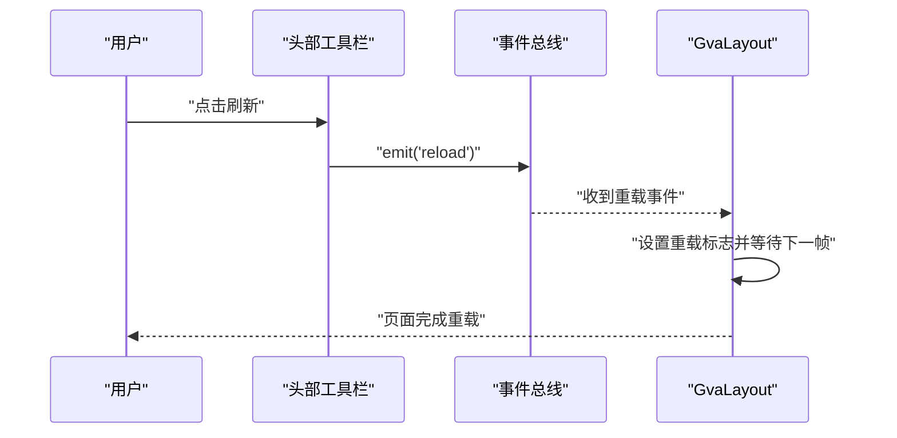
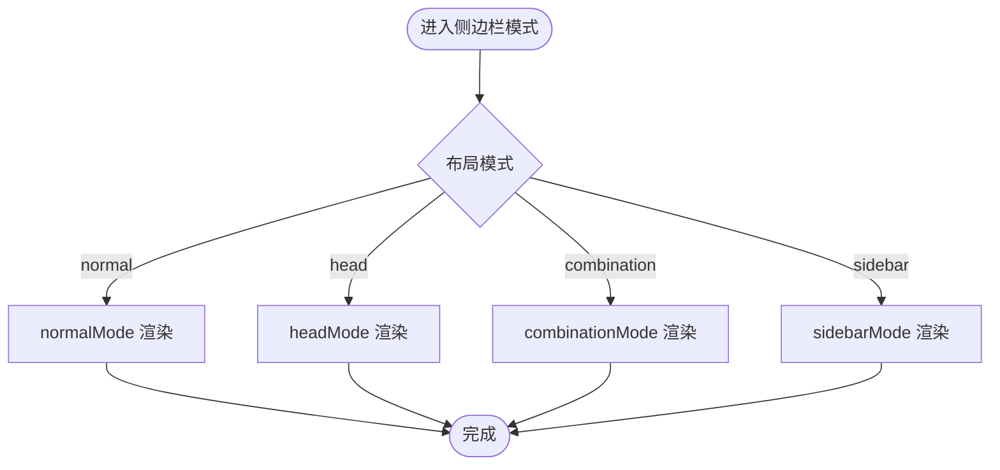
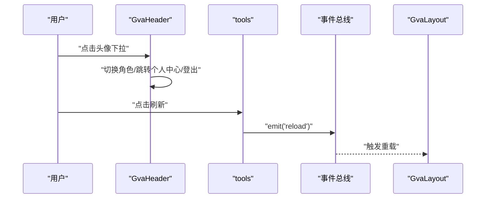
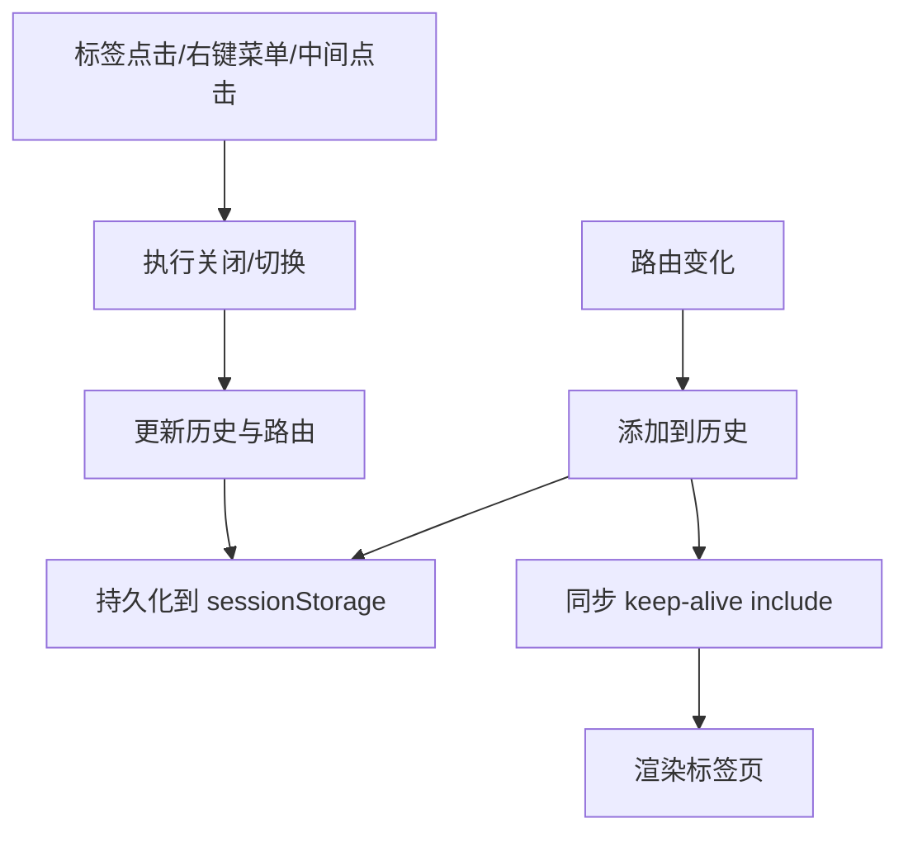
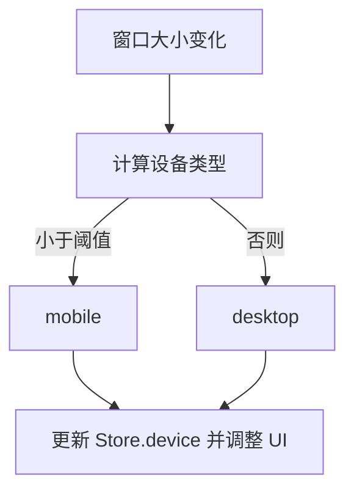
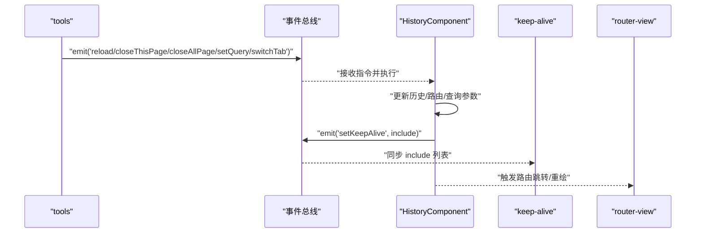
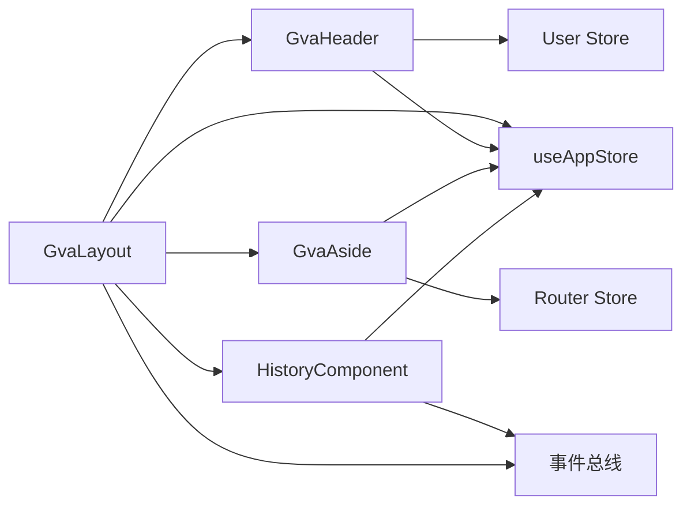

# 布局系统

<cite>
**本文引用的文件**
- [web/src/view/layout/index.vue](file://web/src/view/layout/index.vue)
- [web/src/view/layout/aside/index.vue](file://web/src/view/layout/aside/index.vue)
- [web/src/view/layout/aside/normalMode.vue](file://web/src/view/layout/aside/normalMode.vue)
- [web/src/view/layout/aside/headMode.vue](file://web/src/view/layout/aside/headMode.vue)
- [web/src/view/layout/aside/sidebarMode.vue](file://web/src/view/layout/aside/sidebarMode.vue)
- [web/src/view/layout/aside/combinationMode.vue](file://web/src/view/layout/aside/combinationMode.vue)
- [web/src/view/layout/aside/asideComponent/index.vue](file://web/src/view/layout/aside/asideComponent/index.vue)
- [web/src/view/layout/header/index.vue](file://web/src/view/layout/header/index.vue)
- [web/src/view/layout/header/tools.vue](file://web/src/view/layout/header/tools.vue)
- [web/src/view/layout/tabs/index.vue](file://web/src/view/layout/tabs/index.vue)
- [web/src/view/layout/setting/index.vue](file://web/src/view/layout/setting/index.vue)
- [web/src/view/layout/setting/modules/appearance/index.vue](file://web/src/view/layout/setting/modules/appearance/index.vue)
- [web/src/view/layout/setting/modules/layout/index.vue](file://web/src/view/layout/setting/modules/layout/index.vue)
- [web/src/view/layout/setting/modules/general/index.vue](file://web/src/view/layout/setting/modules/general/index.vue)
- [web/src/hooks/responsive.js](file://web/src/hooks/responsive.js)
- [web/src/pinia/modules/app.js](file://web/src/pinia/modules/app.js)
- [web/src/utils/bus.js](file://web/src/utils/bus.js)
</cite>

## 目录
1. [简介](#简介)
2. [项目结构](#项目结构)
3. [核心组件](#核心组件)
4. [架构总览](#架构总览)
5. [详细组件分析](#详细组件分析)
6. [依赖关系分析](#依赖关系分析)
7. [性能考量](#性能考量)
8. [故障排查指南](#故障排查指南)
9. [结论](#结论)
10. [附录](#附录)

## 简介
本文件面向测试管理平台的布局系统，系统性阐述整体布局架构的设计理念与实现原理，覆盖主布局容器、侧边栏、头部导航与标签页系统的协同机制；详解四种布局模式（normal、sidebar、head、combination）的切换逻辑与适用场景；解释响应式布局与移动端适配策略；梳理布局配置体系（主题、水印、标签页等）与 Pinia Store 的联动；最后给出组件间通信机制、数据流、定制化最佳实践与性能优化建议。

## 项目结构
布局系统主要由以下层次构成：
- 布局容器层：顶层布局容器负责挂载水印、头部、侧边栏、标签页与内容区，并统一处理路由视图与页面过渡。
- 侧边栏层：按模式拆分多种渲染形态，支持垂直菜单、横向菜单、组合模式与双栏侧边栏。
- 头部导航层：包含面包屑、品牌区、用户下拉菜单与工具栏。
- 标签页层：维护页面历史、标签页上下文菜单与跨页交互。
- 设置抽屉层：提供外观、布局、通用三大类配置入口。
- 响应式与状态层：通过响应式 Hook 与 Pinia Store 实现设备检测、主题切换、配置持久化与全局尺寸控制。

图表来源
- [web/src/view/layout/index.vue:1-119](file://web/src/view/layout/index.vue#L1-L119)
- [web/src/view/layout/header/index.vue:1-134](file://web/src/view/layout/header/index.vue#L1-L134)
- [web/src/view/layout/aside/index.vue:1-40](file://web/src/view/layout/aside/index.vue#L1-L40)
- [web/src/view/layout/tabs/index.vue:1-422](file://web/src/view/layout/tabs/index.vue#L1-L422)

章节来源
- [web/src/view/layout/index.vue:1-119](file://web/src/view/layout/index.vue#L1-L119)
- [web/src/view/layout/aside/index.vue:1-40](file://web/src/view/layout/aside/index.vue#L1-L40)
- [web/src/view/layout/header/index.vue:1-134](file://web/src/view/layout/header/index.vue#L1-L134)
- [web/src/view/layout/tabs/index.vue:1-422](file://web/src/view/layout/tabs/index.vue#L1-L422)

## 核心组件
- 布局容器（GvaLayout）
  - 负责挂载水印、头部、侧边栏、标签页与内容区；根据配置决定是否显示标签页与水印；基于路由元信息与配置选择过渡动画类型；提供“重载”机制以支持 keep-alive 缓存刷新。
- 侧边栏容器（GvaAside）
  - 根据设备与布局模式动态渲染不同模式的侧边栏组件。
- 侧边栏模式组件
  - normalMode：垂直折叠菜单，支持折叠宽度与宽度计算。
  - headMode：顶部横向菜单，支持省略计算与响应式宽度。
  - combinationMode：组合模式，同时渲染顶部横向菜单与左侧垂直菜单。
  - sidebarMode：双栏侧边栏，左侧常驻一级菜单，右侧显示二级菜单。
- 头部导航（GvaHeader）
  - 包含品牌区、面包屑、用户下拉菜单与工具栏；在 head/combination 模式下内嵌侧边栏。
- 标签页（HistoryComponent）
  - 维护页面历史、标签页上下文菜单、中间点击关闭、跨页查询参数同步与 keep-alive 同步。
- 设置抽屉（GvaSetting）
  - 提供外观、布局、通用三类配置面板，支持主题、颜色、尺寸、水印、标签页、动画、侧边栏尺寸与重置/导入/导出配置。
- 响应式 Hook（useResponsive）
  - 基于窗口宽度阈值判断设备类型，触发 Pinia Store 的设备切换。
- 应用 Store（useAppStore）
  - 统一管理设备、主题、配置、尺寸等状态，并提供切换与重置方法。

章节来源
- [web/src/view/layout/index.vue:55-119](file://web/src/view/layout/index.vue#L55-L119)
- [web/src/view/layout/aside/index.vue:22-39](file://web/src/view/layout/aside/index.vue#L22-L39)
- [web/src/view/layout/aside/normalMode.vue:42-111](file://web/src/view/layout/aside/normalMode.vue#L42-L111)
- [web/src/view/layout/aside/headMode.vue:27-140](file://web/src/view/layout/aside/headMode.vue#L27-L140)
- [web/src/view/layout/aside/combinationMode.vue:65-147](file://web/src/view/layout/aside/combinationMode.vue#L65-L147)
- [web/src/view/layout/aside/sidebarMode.vue:106-291](file://web/src/view/layout/aside/sidebarMode.vue#L106-L291)
- [web/src/view/layout/header/index.vue:95-134](file://web/src/view/layout/header/index.vue#L95-L134)
- [web/src/view/layout/tabs/index.vue:56-422](file://web/src/view/layout/tabs/index.vue#L56-L422)
- [web/src/view/layout/setting/index.vue:58-229](file://web/src/view/layout/setting/index.vue#L58-L229)
- [web/src/hooks/responsive.js:16-36](file://web/src/hooks/responsive.js#L16-L36)
- [web/src/pinia/modules/app.js:6-163](file://web/src/pinia/modules/app.js#L6-L163)

## 架构总览
布局系统采用“容器 + 模块化组件 + 配置驱动”的架构设计：
- 容器层统一协调各子系统，按配置与设备状态渲染对应 UI。
- 侧边栏按模式拆分，通过容器层条件渲染与模式属性传递，实现灵活组合。
- 头部导航与标签页通过事件总线与 Pinia Store 协同，实现跨组件通信。
- 设置抽屉通过双向绑定与 Store 方法，实时更新配置并持久化。

图表来源
- [web/src/view/layout/index.vue:55-119](file://web/src/view/layout/index.vue#L55-L119)
- [web/src/view/layout/aside/index.vue:22-39](file://web/src/view/layout/aside/index.vue#L22-L39)
- [web/src/view/layout/header/index.vue:95-134](file://web/src/view/layout/header/index.vue#L95-L134)
- [web/src/view/layout/tabs/index.vue:56-422](file://web/src/view/layout/tabs/index.vue#L56-L422)
- [web/src/hooks/responsive.js:16-36](file://web/src/hooks/responsive.js#L16-L36)
- [web/src/pinia/modules/app.js:6-163](file://web/src/pinia/modules/app.js#L6-L163)
- [web/src/view/layout/setting/index.vue:58-229](file://web/src/view/layout/setting/index.vue#L58-L229)

## 详细组件分析

### 布局容器（GvaLayout）
- 功能要点
  - 条件渲染水印：根据配置开关与用户信息生成水印内容。
  - 条件渲染侧边栏与组合侧边栏：依据设备与布局模式动态展示。
  - 条件渲染标签页：根据配置开关决定是否显示。
  - 内容区：基于 keep-alive 与路由元信息控制过渡动画与缓存。
  - 重载机制：通过事件总线触发重载，避免 keep-alive 缓存导致的重复渲染问题。
- 数据流
  - 读取 Pinia Store 中的 config、isDark、device 等状态。
  - 监听路由变化，动态设置过渡动画类型。
  - 通过事件总线接收“reload”事件，执行延迟重载。
- 性能注意
  - 使用 keep-alive 缓存页面，减少重复渲染。
  - 重载采用防抖式延迟，避免频繁触发。

图表来源
- [web/src/view/layout/header/tools.vue:96-102](file://web/src/view/layout/header/tools.vue#L96-L102)
- [web/src/view/layout/index.vue:89-115](file://web/src/view/layout/index.vue#L89-L115)
- [web/src/utils/bus.js:1-5](file://web/src/utils/bus.js#L1-L5)

章节来源
- [web/src/view/layout/index.vue:55-119](file://web/src/view/layout/index.vue#L55-L119)
- [web/src/view/layout/header/tools.vue:84-133](file://web/src/view/layout/header/tools.vue#L84-L133)
- [web/src/utils/bus.js:1-5](file://web/src/utils/bus.js#L1-L5)

### 侧边栏容器与模式组件
- 侧边栏容器（GvaAside）
  - 根据设备与布局模式条件渲染不同模式组件。
- normalMode
  - 垂直折叠菜单，支持折叠宽度与宽度计算；提供折叠/展开按钮。
  - 菜单项点击时解析路由参数并导航。
- headMode
  - 顶部横向菜单，支持省略计算与响应式宽度；菜单项点击时解析参数并导航。
- combinationMode
  - 同时渲染顶部横向菜单与左侧垂直菜单；顶部菜单变更时同步更新左侧菜单。
- sidebarMode
  - 双栏侧边栏：左侧常驻一级菜单，右侧显示二级菜单；支持根据选中一级菜单更新右侧菜单。

图表来源
- [web/src/view/layout/aside/index.vue:22-39](file://web/src/view/layout/aside/index.vue#L22-L39)
- [web/src/view/layout/aside/normalMode.vue:42-111](file://web/src/view/layout/aside/normalMode.vue#L42-L111)
- [web/src/view/layout/aside/headMode.vue:27-140](file://web/src/view/layout/aside/headMode.vue#L27-L140)
- [web/src/view/layout/aside/combinationMode.vue:65-147](file://web/src/view/layout/aside/combinationMode.vue#L65-L147)
- [web/src/view/layout/aside/sidebarMode.vue:106-291](file://web/src/view/layout/aside/sidebarMode.vue#L106-L291)

章节来源
- [web/src/view/layout/aside/index.vue:22-39](file://web/src/view/layout/aside/index.vue#L22-L39)
- [web/src/view/layout/aside/normalMode.vue:42-111](file://web/src/view/layout/aside/normalMode.vue#L42-L111)
- [web/src/view/layout/aside/headMode.vue:27-140](file://web/src/view/layout/aside/headMode.vue#L27-L140)
- [web/src/view/layout/aside/combinationMode.vue:65-147](file://web/src/view/layout/aside/combinationMode.vue#L65-L147)
- [web/src/view/layout/aside/sidebarMode.vue:106-291](file://web/src/view/layout/aside/sidebarMode.vue#L106-L291)

### 头部导航与工具栏
- 头部导航（GvaHeader）
  - 品牌区与面包屑：在非 head/combination 模式下显示面包屑。
  - 用户下拉菜单：支持角色切换、个人信息与登出。
  - 在 head/combination 模式下内嵌侧边栏。
- 工具栏（tools）
  - 提供搜索、设置、刷新、主题切换、命令菜单等快捷入口。
  - 刷新按钮通过事件总线触发重载。

图表来源
- [web/src/view/layout/header/index.vue:95-134](file://web/src/view/layout/header/index.vue#L95-L134)
- [web/src/view/layout/header/tools.vue:84-133](file://web/src/view/layout/header/tools.vue#L84-L133)
- [web/src/view/layout/index.vue:89-115](file://web/src/view/layout/index.vue#L89-L115)
- [web/src/utils/bus.js:1-5](file://web/src/utils/bus.js#L1-L5)

章节来源
- [web/src/view/layout/header/index.vue:95-134](file://web/src/view/layout/header/index.vue#L95-L134)
- [web/src/view/layout/header/tools.vue:84-133](file://web/src/view/layout/header/tools.vue#L84-L133)

### 标签页系统（HistoryComponent）
- 功能要点
  - 维护页面历史列表，支持标签页点击、关闭、中间点击关闭。
  - 支持右键菜单：关闭所有、左侧、右侧、其他。
  - 与 keep-alive 同步：通过事件总线将活动标签页集合同步给 keep-alive include 列表。
  - 查询参数与路由参数同步：支持动态更新 URL 查询串。
- 数据流
  - 监听路由变化，自动写入历史并持久化到 sessionStorage。
  - 监听历史变化，重建历史映射并触发 keep-alive 同步。
  - 通过事件总线接收“closeThisPage”、“closeAllPage”、“setQuery”、“switchTab”等指令。

图表来源
- [web/src/view/layout/tabs/index.vue:237-359](file://web/src/view/layout/tabs/index.vue#L237-L359)
- [web/src/utils/bus.js:1-5](file://web/src/utils/bus.js#L1-L5)

章节来源
- [web/src/view/layout/tabs/index.vue:56-422](file://web/src/view/layout/tabs/index.vue#L56-L422)

### 布局模式切换逻辑与适用场景
- normal
  - 适用于桌面端常规布局，左侧垂直菜单，支持折叠。
  - 适合菜单层级较深、需要稳定导航的场景。
- head
  - 顶部横向菜单，适合宽屏、菜单数量较多但无需左侧固定的情况。
- sidebar
  - 双栏侧边栏，左侧一级菜单常驻，右侧显示二级菜单，适合多级菜单组织清晰的场景。
- combination
  - 同时具备顶部横向菜单与左侧垂直菜单，适合复杂业务与多角色权限的场景。

章节来源
- [web/src/view/layout/aside/index.vue:22-39](file://web/src/view/layout/aside/index.vue#L22-L39)
- [web/src/view/layout/aside/normalMode.vue:42-111](file://web/src/view/layout/aside/normalMode.vue#L42-L111)
- [web/src/view/layout/aside/headMode.vue:27-140](file://web/src/view/layout/aside/headMode.vue#L27-L140)
- [web/src/view/layout/aside/sidebarMode.vue:106-291](file://web/src/view/layout/aside/sidebarMode.vue#L106-L291)
- [web/src/view/layout/aside/combinationMode.vue:65-147](file://web/src/view/layout/aside/combinationMode.vue#L65-L147)

### 响应式布局与移动端适配
- 设备检测
  - 使用响应式 Hook，基于窗口宽度阈值判断设备类型（mobile/desktop），并触发 Store 的设备切换。
- 移动端行为
  - 移动端默认折叠侧边栏，菜单宽度与最小宽度调整，抽屉宽度与操作最小宽度根据设备变化。
- 顶部横向菜单省略
  - headMode 对菜单项总宽度与容器宽度进行比较，动态启用省略功能，保证在窄屏下的可读性。

图表来源
- [web/src/hooks/responsive.js:16-36](file://web/src/hooks/responsive.js#L16-L36)
- [web/src/pinia/modules/app.js:55-64](file://web/src/pinia/modules/app.js#L55-L64)
- [web/src/view/layout/aside/headMode.vue:49-95](file://web/src/view/layout/aside/headMode.vue#L49-L95)

章节来源
- [web/src/hooks/responsive.js:1-36](file://web/src/hooks/responsive.js#L1-L36)
- [web/src/pinia/modules/app.js:55-64](file://web/src/pinia/modules/app.js#L55-L64)
- [web/src/view/layout/aside/headMode.vue:27-140](file://web/src/view/layout/aside/headMode.vue#L27-L140)

### 布局配置系统
- 配置项
  - 主题模式：auto/light/dark。
  - 主题颜色：支持动态切换并应用到全局样式。
  - 标签页显示：控制标签页是否显示。
  - 水印显示：控制水印开关。
  - 布局模式：normal/head/sidebar/combination。
  - 页面过渡动画：fade/slide/zoom/none。
  - 侧边栏尺寸：展开宽度、折叠宽度、菜单项高度。
  - 全局尺寸：default/large/small。
- 设置面板
  - 外观面板：主题模式、主题颜色、全局尺寸、灰色/色弱模式、水印开关。
  - 布局面板：布局模式、标签页显示、页面过渡动画、侧边栏尺寸配置。
  - 通用面板：系统信息、配置重置/导出/导入。
- 持久化
  - 配置变更时自动保存到本地存储；支持重置为默认配置。

章节来源
- [web/src/pinia/modules/app.js:10-24](file://web/src/pinia/modules/app.js#L10-L24)
- [web/src/view/layout/setting/modules/appearance/index.vue:1-107](file://web/src/view/layout/setting/modules/appearance/index.vue#L1-L107)
- [web/src/view/layout/setting/modules/layout/index.vue:1-146](file://web/src/view/layout/setting/modules/layout/index.vue#L1-L146)
- [web/src/view/layout/setting/modules/general/index.vue:1-248](file://web/src/view/layout/setting/modules/general/index.vue#L1-L248)
- [web/src/view/layout/setting/index.vue:58-107](file://web/src/view/layout/setting/index.vue#L58-L107)

### 组件间通信机制与数据流
- 事件总线
  - 通过事件总线在工具栏与标签页之间传递“重载”、“关闭当前/全部页面”、“设置查询参数”、“切换标签”等指令。
- Pinia Store
  - 统一管理设备、主题、配置等状态；组件通过 Store 方法更新状态并触发响应。
- 路由与 Keep-alive
  - 标签页系统与 keep-alive include 列表通过事件总线同步，确保缓存命中与失效控制。

图表来源
- [web/src/view/layout/header/tools.vue:96-102](file://web/src/view/layout/header/tools.vue#L96-L102)
- [web/src/view/layout/tabs/index.vue:274-329](file://web/src/view/layout/tabs/index.vue#L274-L329)
- [web/src/utils/bus.js:1-5](file://web/src/utils/bus.js#L1-L5)

章节来源
- [web/src/view/layout/header/tools.vue:84-133](file://web/src/view/layout/header/tools.vue#L84-L133)
- [web/src/view/layout/tabs/index.vue:237-359](file://web/src/view/layout/tabs/index.vue#L237-L359)
- [web/src/utils/bus.js:1-5](file://web/src/utils/bus.js#L1-L5)

## 依赖关系分析
- 组件耦合
  - GvaLayout 依赖 Header、Aside、Tabs、App Store 与事件总线。
  - 侧边栏模式组件依赖路由 Store 与 App Store，实现菜单数据与尺寸控制。
  - Header 依赖 User Store、App Store 与工具组件。
  - Tabs 依赖事件总线与 User Store，实现跨页交互。
- 外部依赖
  - Element Plus：水印、面包屑、菜单、下拉框、抽屉、滚动条等组件。
  - Vue Router：路由导航与元信息。
  - VueUse：useDark、usePreferredDark、useResponsive 等工具。
  - mitt：事件总线。

图表来源
- [web/src/view/layout/index.vue:69-119](file://web/src/view/layout/index.vue#L69-L119)
- [web/src/view/layout/header/index.vue:98-134](file://web/src/view/layout/header/index.vue#L98-L134)
- [web/src/view/layout/aside/index.vue:35-39](file://web/src/view/layout/aside/index.vue#L35-L39)
- [web/src/view/layout/tabs/index.vue:57-79](file://web/src/view/layout/tabs/index.vue#L57-L79)
- [web/src/utils/bus.js:1-5](file://web/src/utils/bus.js#L1-L5)

章节来源
- [web/src/view/layout/index.vue:55-119](file://web/src/view/layout/index.vue#L55-L119)
- [web/src/view/layout/header/index.vue:95-134](file://web/src/view/layout/header/index.vue#L95-L134)
- [web/src/view/layout/aside/index.vue:22-39](file://web/src/view/layout/aside/index.vue#L22-L39)
- [web/src/view/layout/tabs/index.vue:56-422](file://web/src/view/layout/tabs/index.vue#L56-L422)
- [web/src/utils/bus.js:1-5](file://web/src/utils/bus.js#L1-L5)

## 性能考量
- keep-alive 缓存
  - 仅对需要缓存的页面启用 keep-alive，避免不必要的内存占用。
  - 通过事件总线同步 include 列表，确保缓存命中与失效控制。
- 过渡动画
  - 根据页面复杂度选择合适的过渡动画类型，避免过度动画影响首屏性能。
- 响应式与省略
  - headMode 的省略计算在窗口尺寸变化与路由变化时触发，建议结合防抖以减少重排。
- 水印渲染
  - 水印仅在开启时渲染，且颜色随主题切换动态调整，避免额外开销。
- 重载机制
  - 重载采用延迟与标志位控制，避免频繁触发导致的性能抖动。

## 故障排查指南
- 标签页不显示
  - 检查配置开关与路由元信息，确认是否启用了标签页显示。
- 标签页无法关闭
  - 检查默认路由与标签页关闭条件，确认是否为唯一标签页。
- 侧边栏不显示
  - 检查布局模式与设备状态，确认是否在当前模式下隐藏。
- 主题切换无效
  - 检查主题模式配置与系统偏好，确认是否处于 auto 模式。
- 刷新无效
  - 检查事件总线是否正确触发，以及重载标志位是否被正确设置与清除。

章节来源
- [web/src/view/layout/tabs/index.vue:252-264](file://web/src/view/layout/tabs/index.vue#L252-L264)
- [web/src/view/layout/aside/index.vue:16-26](file://web/src/view/layout/aside/index.vue#L16-L26)
- [web/src/pinia/modules/app.js:70-77](file://web/src/pinia/modules/app.js#L70-L77)
- [web/src/view/layout/header/tools.vue:96-102](file://web/src/view/layout/header/tools.vue#L96-L102)

## 结论
测试管理平台的布局系统以容器层为核心，通过模式化侧边栏、头部导航与标签页系统实现灵活的布局组合；借助 Pinia Store 与事件总线实现配置驱动与跨组件通信；配合响应式 Hook 与移动端适配策略，满足多设备场景需求。通过合理的缓存与过渡策略、完善的配置体系与故障排查手段，系统在可用性与性能之间取得良好平衡。

## 附录
- 最佳实践
  - 将布局配置集中管理，避免分散在多个组件中。
  - 使用 keep-alive 与 include 列表配合标签页系统，提升页面切换性能。
  - 在 headMode 中合理使用省略计算，避免菜单项过多导致的渲染压力。
  - 通过事件总线规范组件间通信，避免直接依赖导致的耦合。
- 定制化建议
  - 自定义侧边栏宽度与菜单项高度时，需考虑不同设备下的可读性与交互体验。
  - 主题颜色与视觉辅助（灰色/色弱模式）应遵循无障碍设计原则。
  - 布局模式的选择应结合业务场景与用户习惯，避免过度复杂的组合模式影响可用性。