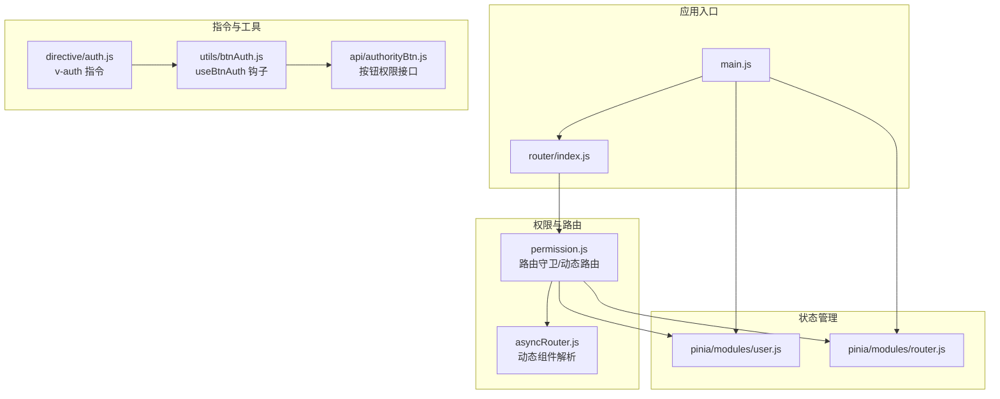
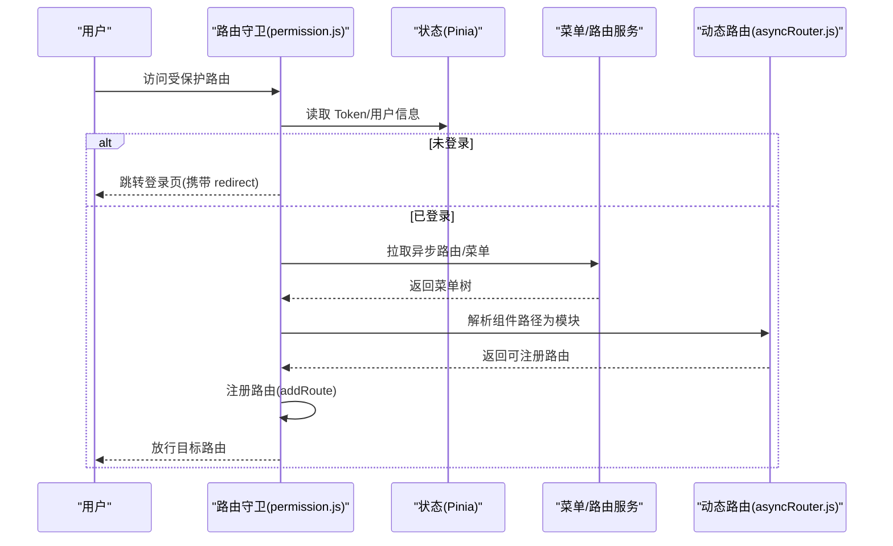
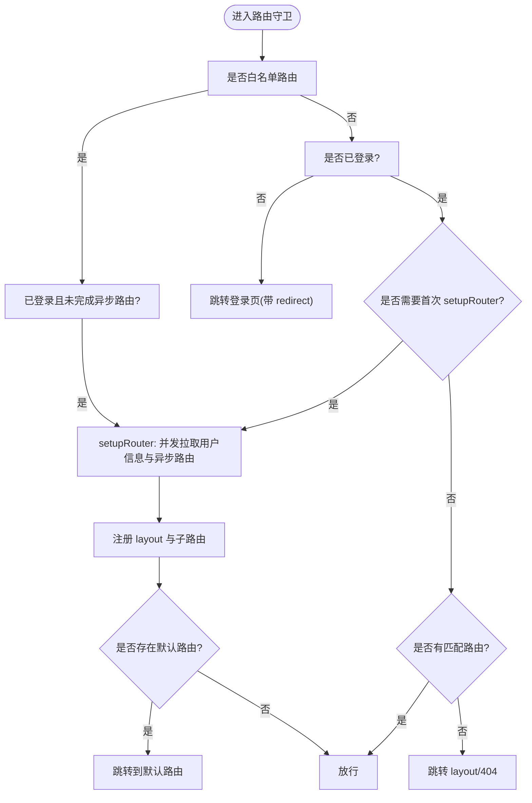
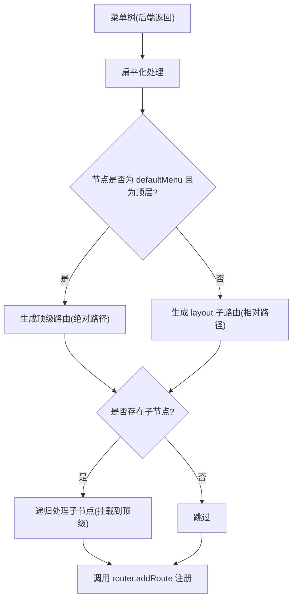
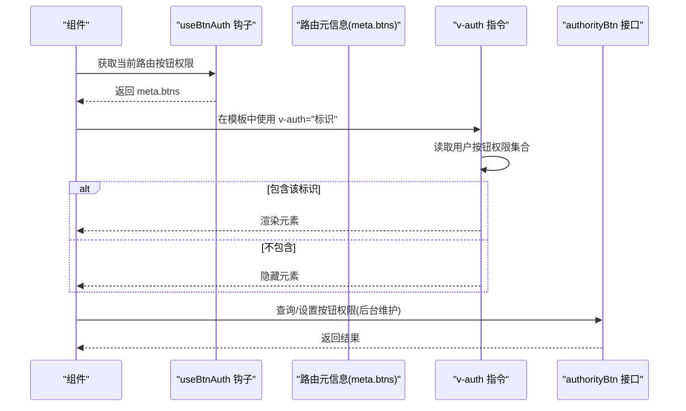
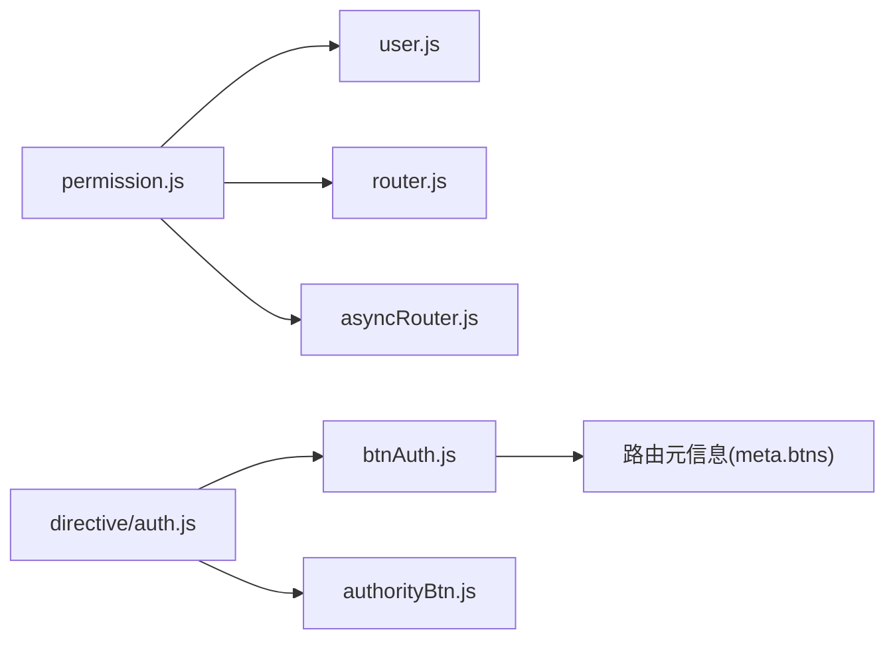

# 权限控制

<cite>
**本文引用的文件**
- [web/src/permission.js](file://web/src/permission.js)
- [web/src/utils/asyncRouter.js](file://web/src/utils/asyncRouter.js)
- [web/src/utils/btnAuth.js](file://web/src/utils/btnAuth.js)
- [web/src/directive/auth.js](file://web/src/directive/auth.js)
- [web/src/api/authorityBtn.js](file://web/src/api/authorityBtn.js)
- [web/src/pinia/modules/user.js](file://web/src/pinia/modules/user.js)
- [web/src/pinia/modules/router.js](file://web/src/pinia/modules/router.js)
- [web/src/router/index.js](file://web/src/router/index.js)
- [web/src/main.js](file://web/src/main.js)
</cite>

## 目录
1. [简介](#简介)
2. [项目结构](#项目结构)
3. [核心组件](#核心组件)
4. [架构总览](#架构总览)
5. [详细组件分析](#详细组件分析)
6. [依赖关系分析](#依赖关系分析)
7. [性能考量](#性能考量)
8. [故障排查指南](#故障排查指南)
9. [结论](#结论)
10. [附录](#附录)

## 简介
本文件面向测试管理平台的权限控制系统，系统性阐述前端权限控制的实现机制，覆盖以下主题：
- 路由级权限验证：基于路由守卫的鉴权与动态路由注入流程
- 按钮级权限控制：通过路由元信息与按钮权限接口实现 UI 元素的动态显隐
- 组件级权限管理：结合 Pinia 状态与指令实现细粒度的组件可见性控制
- 权限指令 v-auth 的使用与实现原理：指令如何解析权限标识并驱动 DOM 显示
- 动态路由生成逻辑与权限菜单加载机制：从后端拉取菜单到前端路由树的构建过程
- 权限缓存策略与权限状态持久化：Token、用户信息、异步路由与 Keep-alive 的协同
- 调试方法与常见问题：路由守卫断点、权限指令生效检查、动态路由注册异常等

## 项目结构
前端权限相关的关键模块分布如下：
- 路由守卫与动态路由：web/src/permission.js
- 动态路由组件解析：web/src/utils/asyncRouter.js
- 按钮权限钩子：web/src/utils/btnAuth.js
- 权限指令：web/src/directive/auth.js
- 按钮权限接口封装：web/src/api/authorityBtn.js
- 用户与路由状态（Pinia）：web/src/pinia/modules/user.js、web/src/pinia/modules/router.js
- 路由入口：web/src/router/index.js
- 应用入口：web/src/main.js

图表来源
- [web/src/main.js](file://web/src/main.js)
- [web/src/router/index.js](file://web/src/router/index.js)
- [web/src/permission.js](file://web/src/permission.js)
- [web/src/utils/asyncRouter.js](file://web/src/utils/asyncRouter.js)
- [web/src/pinia/modules/user.js](file://web/src/pinia/modules/user.js)
- [web/src/pinia/modules/router.js](file://web/src/pinia/modules/router.js)
- [web/src/directive/auth.js](file://web/src/directive/auth.js)
- [web/src/utils/btnAuth.js](file://web/src/utils/btnAuth.js)
- [web/src/api/authorityBtn.js](file://web/src/api/authorityBtn.js)

章节来源
- [web/src/permission.js](file://web/src/permission.js)
- [web/src/utils/asyncRouter.js](file://web/src/utils/asyncRouter.js)
- [web/src/utils/btnAuth.js](file://web/src/utils/btnAuth.js)
- [web/src/directive/auth.js](file://web/src/directive/auth.js)
- [web/src/api/authorityBtn.js](file://web/src/api/authorityBtn.js)
- [web/src/pinia/modules/user.js](file://web/src/pinia/modules/user.js)
- [web/src/pinia/modules/router.js](file://web/src/pinia/modules/router.js)
- [web/src/router/index.js](file://web/src/router/index.js)
- [web/src/main.js](file://web/src/main.js)

## 核心组件
- 路由守卫与动态路由注入：负责白名单放行、登录态校验、异步路由拉取与注册、默认路由跳转、404 回退等
- 动态路由组件解析：将字符串组件路径映射为实际组件模块，支持 view 与 plugin 两类视图
- 按钮权限钩子：在组件内获取当前路由的按钮权限集合，用于控制按钮显隐
- 权限指令 v-auth：根据权限标识动态控制元素显示/隐藏
- 按钮权限接口：提供查询与设置按钮权限的能力
- 状态管理：用户信息、Token、异步路由标志位、Keep-alive 策略等

章节来源
- [web/src/permission.js](file://web/src/permission.js)
- [web/src/utils/asyncRouter.js](file://web/src/utils/asyncRouter.js)
- [web/src/utils/btnAuth.js](file://web/src/utils/btnAuth.js)
- [web/src/directive/auth.js](file://web/src/directive/auth.js)
- [web/src/api/authorityBtn.js](file://web/src/api/authorityBtn.js)
- [web/src/pinia/modules/user.js](file://web/src/pinia/modules/user.js)
- [web/src/pinia/modules/router.js](file://web/src/pinia/modules/router.js)

## 架构总览
前端权限体系围绕“路由守卫 + 动态路由 + 指令/钩子 + 接口”的闭环展开。用户登录后，系统通过 Pinia 获取用户信息与异步路由，permission.js 将后端返回的菜单树转换为可注册的路由表；指令与钩子在渲染阶段按权限标识控制 UI 元素。

图表来源
- [web/src/permission.js](file://web/src/permission.js)
- [web/src/utils/asyncRouter.js](file://web/src/utils/asyncRouter.js)
- [web/src/pinia/modules/user.js](file://web/src/pinia/modules/user.js)
- [web/src/pinia/modules/router.js](file://web/src/pinia/modules/router.js)

## 详细组件分析

### 路由守卫与动态路由注入
- 白名单与外部链接处理：对登录与初始化等白名单路由直接放行；对外部链接进行跳过处理
- 路由扁平化与注册：将多级菜单扁平化为 layout 二级子路由或顶级路由，避免重复注册与路径冲突
- 异步路由拉取与注册：并发拉取用户信息与异步路由，确保 layout 父路由优先注册，再批量注册子路由
- 默认路由与回退：若用户配置了默认路由则跳转；否则在无匹配路由时回退至 404
- Keep-alive 与页面标题：在 beforeEach 中处理 keep-alive 与页面标题设置

图表来源
- [web/src/permission.js](file://web/src/permission.js)

章节来源
- [web/src/permission.js](file://web/src/permission.js)

### 动态路由生成与菜单加载
- 组件路径解析：通过 import.meta.glob 收集视图与插件组件，将字符串组件路径映射为对应模块
- 递归处理：对菜单树进行深度遍历，识别 defaultMenu 顶级路由与普通 layout 子路由，构造最终可注册路由
- 路径归一化：统一处理绝对路径与相对路径，避免重复斜杠与 layout 嵌套问题
- 顶级路由与父级 redirect：当节点标记为 defaultMenu 时，将其子节点作为该顶级路由的二级页面；同时为父级设置 redirect

图表来源
- [web/src/permission.js](file://web/src/permission.js)
- [web/src/utils/asyncRouter.js](file://web/src/utils/asyncRouter.js)

章节来源
- [web/src/permission.js](file://web/src/permission.js)
- [web/src/utils/asyncRouter.js](file://web/src/utils/asyncRouter.js)

### 按钮权限判断与 UI 动态显隐
- 路由元信息：每个路由的 meta 中包含按钮权限集合，组件通过 useBtnAuth 获取当前路由的按钮权限对象
- 指令 v-auth：接收权限标识，根据当前用户的按钮权限集合决定元素显示/隐藏
- 接口能力：提供查询与设置按钮权限的接口，支持后端维护按钮级权限

图表来源
- [web/src/utils/btnAuth.js](file://web/src/utils/btnAuth.js)
- [web/src/directive/auth.js](file://web/src/directive/auth.js)
- [web/src/api/authorityBtn.js](file://web/src/api/authorityBtn.js)

章节来源
- [web/src/utils/btnAuth.js](file://web/src/utils/btnAuth.js)
- [web/src/directive/auth.js](file://web/src/directive/auth.js)
- [web/src/api/authorityBtn.js](file://web/src/api/authorityBtn.js)

### 权限指令 v-auth 使用与实现原理
- 指令参数：通常传入一个权限标识字符串，指令内部会比对当前用户的按钮权限集合
- 实现要点：指令在绑定时读取当前路由的按钮权限集合，结合用户状态进行判定，动态设置 DOM 的显示/隐藏
- 应用场景：按钮、操作项、菜单项等 UI 元素的细粒度权限控制

章节来源
- [web/src/directive/auth.js](file://web/src/directive/auth.js)
- [web/src/utils/btnAuth.js](file://web/src/utils/btnAuth.js)

### 组件级权限管理
- 组件内权限：通过 useBtnAuth 获取当前路由的按钮权限集合，在模板中结合 v-auth 或条件渲染实现组件级权限
- 状态联动：用户信息变更、按钮权限变更会触发组件重新计算，从而更新 UI

章节来源
- [web/src/utils/btnAuth.js](file://web/src/utils/btnAuth.js)
- [web/src/directive/auth.js](file://web/src/directive/auth.js)

## 依赖关系分析
- 路由守卫依赖 Pinia 用户与路由模块，以及动态路由解析工具
- 动态路由解析依赖 import.meta.glob 与菜单树结构
- 按钮权限依赖路由元信息与按钮权限接口
- 指令依赖按钮权限钩子与用户状态

图表来源
- [web/src/permission.js](file://web/src/permission.js)
- [web/src/utils/asyncRouter.js](file://web/src/utils/asyncRouter.js)
- [web/src/utils/btnAuth.js](file://web/src/utils/btnAuth.js)
- [web/src/directive/auth.js](file://web/src/directive/auth.js)
- [web/src/api/authorityBtn.js](file://web/src/api/authorityBtn.js)
- [web/src/pinia/modules/user.js](file://web/src/pinia/modules/user.js)
- [web/src/pinia/modules/router.js](file://web/src/pinia/modules/router.js)

章节来源
- [web/src/permission.js](file://web/src/permission.js)
- [web/src/utils/asyncRouter.js](file://web/src/utils/asyncRouter.js)
- [web/src/utils/btnAuth.js](file://web/src/utils/btnAuth.js)
- [web/src/directive/auth.js](file://web/src/directive/auth.js)
- [web/src/api/authorityBtn.js](file://web/src/api/authorityBtn.js)
- [web/src/pinia/modules/user.js](file://web/src/pinia/modules/user.js)
- [web/src/pinia/modules/router.js](file://web/src/pinia/modules/router.js)

## 性能考量
- 路由注册批量化：一次性注册多个子路由，减少多次 addRoute 的开销
- Keep-alive 策略：在 beforeEach 中统一处理，避免重复渲染带来的性能损耗
- 动态导入：通过 import.meta.glob 按需加载组件，降低首屏体积
- 缓存与去重：对顶级路由进行存在性检查，避免重复注册

## 故障排查指南
- 路由守卫断点：在 permission.js 的 beforeEach 中设置断点，检查 token、白名单、异步路由标志位与默认路由跳转逻辑
- 动态路由注册异常：确认菜单树结构与 component 字段格式，检查 asyncRouter.js 的组件路径映射是否正确
- 按钮权限不生效：核对路由 meta.btns 是否正确下发，指令参数是否与后端一致，接口返回的按钮权限集合是否包含所需标识
- 指令调试：在 v-auth 指令绑定处打断点，检查读取到的按钮权限集合与用户状态
- 页面标题与 Keep-alive：确认 beforeEach 中页面标题与 keep-alive 处理逻辑未被覆盖

章节来源
- [web/src/permission.js](file://web/src/permission.js)
- [web/src/utils/asyncRouter.js](file://web/src/utils/asyncRouter.js)
- [web/src/directive/auth.js](file://web/src/directive/auth.js)
- [web/src/api/authorityBtn.js](file://web/src/api/authorityBtn.js)

## 结论
测试管理平台的前端权限体系以路由守卫为核心，结合动态路由与指令/钩子实现从“路由级”到“按钮级”的全链路权限控制。通过 Pinia 管理用户与路由状态，配合 import.meta.glob 的动态导入与菜单树的扁平化注册，既保证了权限的细粒度控制，也兼顾了性能与可维护性。建议在开发中严格规范路由 meta.btns 的下发与指令参数命名，确保权限策略的一致性与可追溯性。

## 附录
- 权限缓存与持久化：Token 与用户信息由 Pinia 管理，异步路由标志位用于避免重复拉取；建议在刷新后仍保持登录态与默认路由跳转逻辑稳定
- 指令与钩子最佳实践：指令参数尽量使用语义明确的权限标识；在复杂页面中，优先通过 useBtnAuth 获取权限集合，再在模板中组合 v-auth 与其他条件渲染