# 系统工具页面

<cite>
**本文档引用的文件**
- [sys_auto_code.go](file://server/router/system/sys_auto_code.go)
- [auto_code_template.go](file://server/service/system/auto_code_template.go)
- [sys_skills.go](file://server/model/system/sys_skills.go)
- [sys_version.go](file://server/model/system/sys_version.go)
- [sys_export_template.go](file://server/model/system/sys_export_template.go)
- [index.vue](file://web/src/view/systemTools/skills/index.vue)
- [index.vue](file://web/src/view/systemTools/autoCode/index.vue)
- [sys_skills.go](file://server/api/v1/system/sys_skills.go)
- [sys_version.go](file://server/api/v1/system/sys_version.go)
- [sys_export_template.go](file://server/api/v1/system/sys_export_template.go)
- [sys_skills.go](file://server/service/system/sys_skills.go)
- [sys_version.go](file://server/service/system/sys_version.go)
</cite>

## 目录
1. [简介](#简介)
2. [项目结构](#项目结构)
3. [核心组件](#核心组件)
4. [架构概览](#架构概览)
5. [详细组件分析](#详细组件分析)
6. [依赖分析](#依赖分析)
7. [性能考虑](#性能考虑)
8. [故障排除指南](#故障排除指南)
9. [结论](#结论)
10. [附录](#附录)

## 简介

系统工具页面是测试管理平台中的重要功能模块，提供了多种开发辅助工具，包括代码生成工具、技能管理、版本管理和导出模板等功能。这些工具旨在提高开发效率，简化重复性工作，并为测试管理提供完整的工具链支持。

本文档将深入分析系统工具页面的设计和实现，详细介绍各个功能模块的工作原理、数据结构和操作逻辑，为开发者提供全面的技术指导和扩展开发指南。

## 项目结构

系统工具页面采用前后端分离的架构设计，主要由以下层次组成：

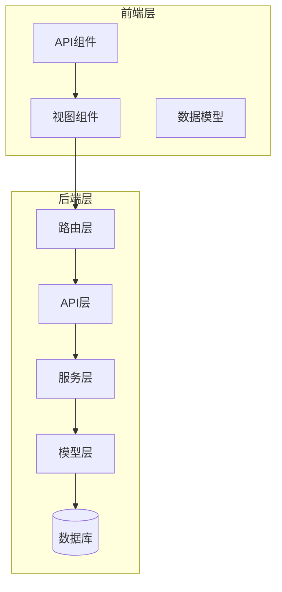

**图表来源**
- [sys_auto_code.go:1-56](file://server/router/system/sys_auto_code.go#L1-L56)
- [auto_code_template.go:1-454](file://server/service/system/auto_code_template.go#L1-L454)

**章节来源**
- [sys_auto_code.go:1-56](file://server/router/system/sys_auto_code.go#L1-L56)
- [auto_code_template.go:1-454](file://server/service/system/auto_code_template.go#L1-L454)

## 核心组件

系统工具页面包含四个主要功能模块：

### 1. 代码生成工具
提供基于模板的代码生成能力，支持数据库表结构分析、字段配置和代码预览生成功能。

### 2. 技能管理
管理AI技能库，支持技能的创建、编辑、打包和在线下载功能。

### 3. 版本管理
管理系统版本，支持版本数据的导出、导入和版本控制功能。

### 4. 导出模板
提供数据导出模板管理，支持Excel模板的创建、预览和批量导出功能。

**章节来源**
- [sys_skills.go:1-26](file://server/model/system/sys_skills.go#L1-L26)
- [sys_version.go:1-21](file://server/model/system/sys_version.go#L1-L21)
- [sys_export_template.go:1-47](file://server/model/system/sys_export_template.go#L1-L47)

## 架构概览

系统工具页面采用分层架构设计，确保各层职责清晰、耦合度低：

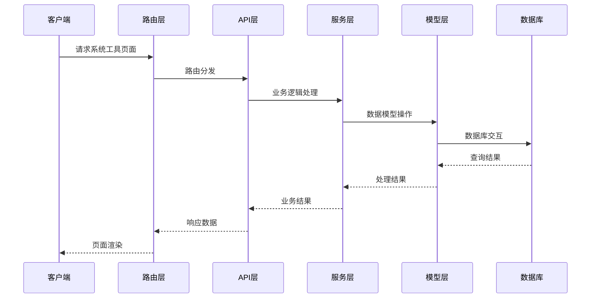

**图表来源**
- [sys_auto_code.go:7-55](file://server/router/system/sys_auto_code.go#L7-L55)
- [sys_skills.go:13-264](file://server/api/v1/system/sys_skills.go#L13-L264)

## 详细组件分析

### 代码生成工具模块

代码生成工具是系统的核心功能之一，提供了完整的代码生成解决方案：

#### 工作流程

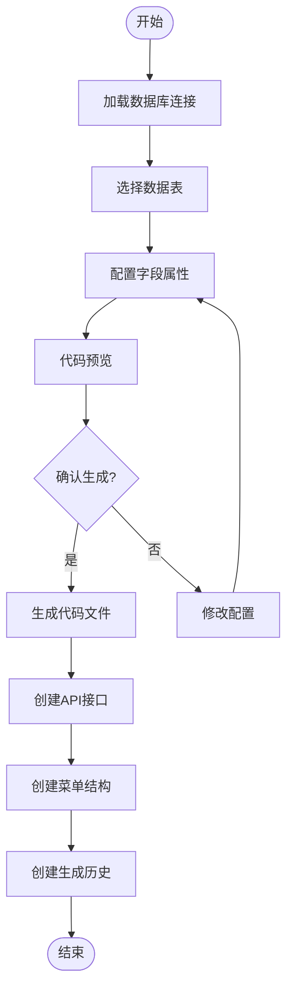

**图表来源**
- [auto_code_template.go:58-186](file://server/service/system/auto_code_template.go#L58-L186)

#### 模板机制

代码生成工具采用Go模板引擎实现，支持动态代码生成：

| 模板类型 | 文件位置 | 功能描述 |
|---------|----------|----------|
| 后端API模板 | `resource/package/server/api/api.go.tpl` | 生成后端API控制器代码 |
| 后端服务模板 | `resource/package/server/service/service.go.tpl` | 生成后端服务层代码 |
| 前端API模板 | `resource/package/web/api/api.js.tpl` | 生成前端API调用代码 |
| 前端视图模板 | `resource/package/web/view/view.vue.tpl` | 生成前端Vue组件代码 |

#### 字段配置系统

字段配置支持多种数据类型和验证规则：

| 字段属性 | 支持类型 | 配置选项 |
|---------|----------|----------|
| 字段名称 | 文本 | 必填，唯一性验证 |
| 中文描述 | 文本 | 可选，用于API描述 |
| 默认值 | 任意类型 | 支持字符串、数字、布尔值 |
| 数据类型 | 枚举 | 支持常见数据库类型 |
| 索引类型 | 枚举 | 支持普通索引、唯一索引等 |
| 验证规则 | 多选 | 必填、排序、表单显示等 |

**章节来源**
- [auto_code_template.go:58-272](file://server/service/system/auto_code_template.go#L58-L272)
- [auto_code_template.go:274-454](file://server/service/system/auto_code_template.go#L274-L454)

### 技能管理模块

技能管理模块提供了完整的AI技能库管理功能：

#### 数据结构设计

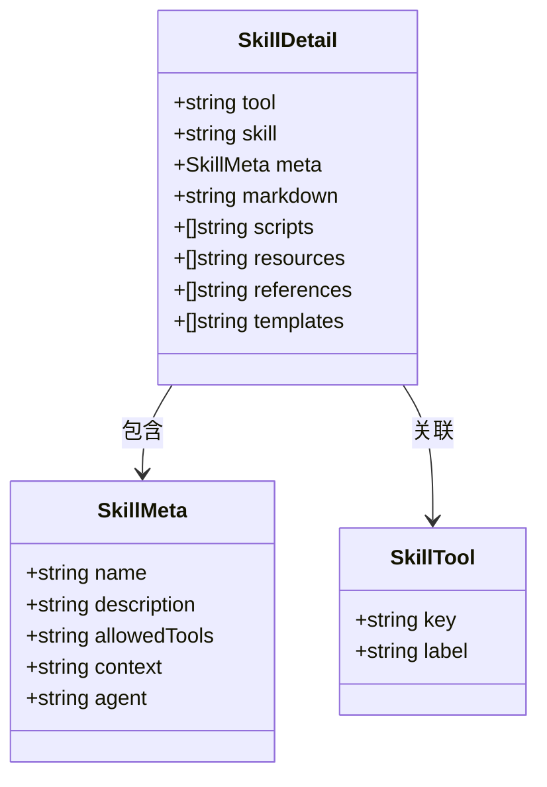

**图表来源**
- [sys_skills.go:3-25](file://server/model/system/sys_skills.go#L3-L25)

#### 技能文件组织

技能文件采用标准化的目录结构：

```
.claude/skills/
├── skill-name/
│   ├── SKILL.md          # 技能元数据
│   ├── scripts/          # 脚本文件
│   ├── resources/        # 资源文件
│   ├── references/       # 参考文件
│   └── templates/        # 模板文件
└── README.md            # 全局约束
```

#### 在线技能下载

支持从官方插件市场下载技能包：

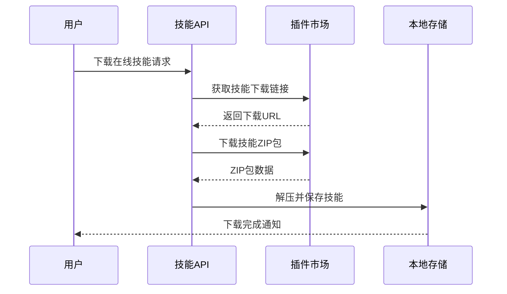

**图表来源**
- [sys_skills.go:388-465](file://server/service/system/sys_skills.go#L388-L465)

**章节来源**
- [sys_skills.go:1-26](file://server/model/system/sys_skills.go#L1-L26)
- [sys_skills.go:59-164](file://server/service/system/sys_skills.go#L59-L164)
- [sys_skills.go:190-265](file://server/service/system/sys_skills.go#L190-L265)

### 版本管理模块

版本管理模块提供了完整的版本控制和数据迁移功能：

#### 版本数据结构

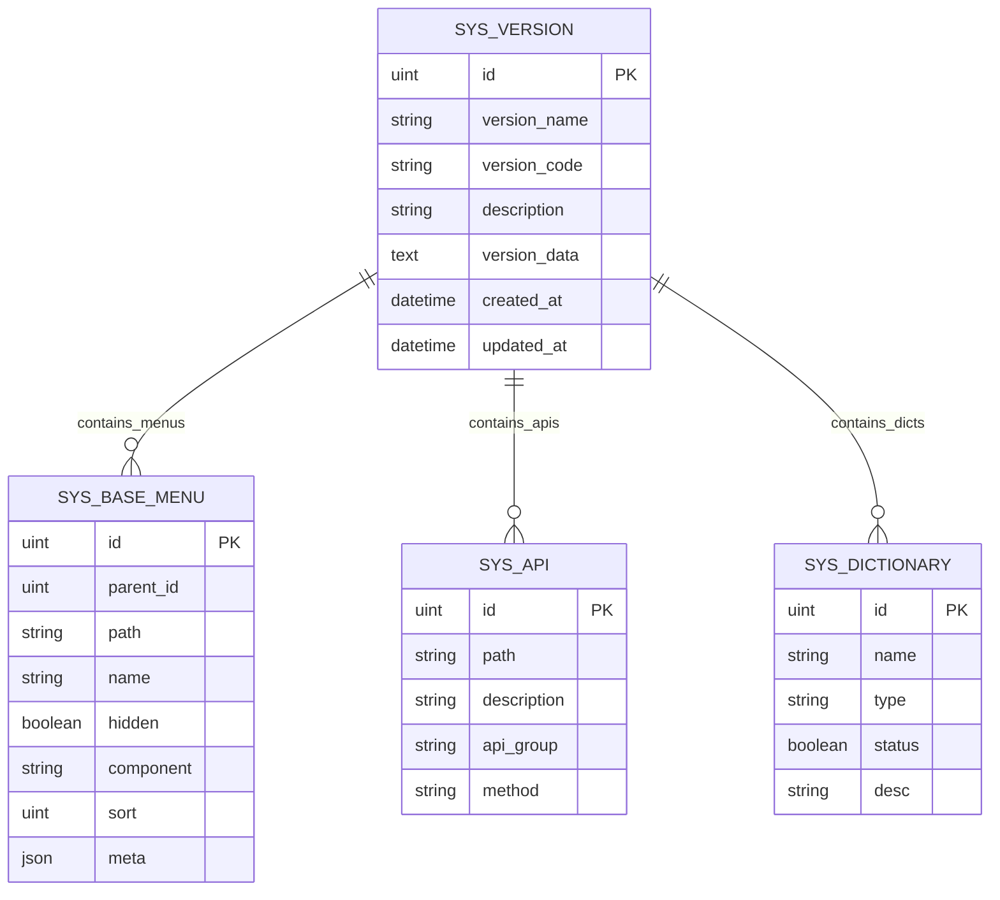

**图表来源**
- [sys_version.go:9-20](file://server/model/system/sys_version.go#L9-L20)

#### 导出流程

版本导出采用增量备份策略：

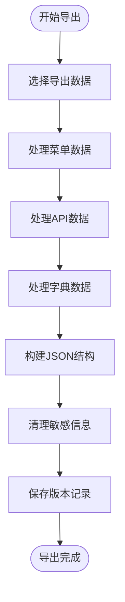

**图表来源**
- [sys_version.go:229-361](file://server/api/v1/system/sys_version.go#L229-L361)

#### 导入流程

版本导入支持增量恢复：

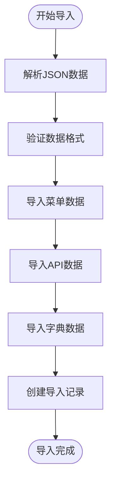

**图表来源**
- [sys_version.go:417-486](file://server/api/v1/system/sys_version.go#L417-L486)

**章节来源**
- [sys_version.go:1-21](file://server/model/system/sys_version.go#L1-L21)
- [sys_version.go:13-75](file://server/service/system/sys_version.go#L13-L75)
- [sys_version.go:229-486](file://server/api/v1/system/sys_version.go#L229-L486)

### 导出模板模块

导出模板模块提供了灵活的数据导出解决方案：

#### 模板数据模型

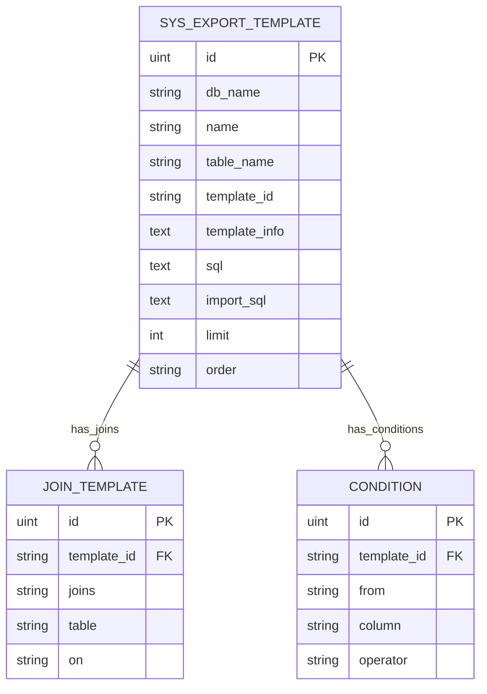

**图表来源**
- [sys_export_template.go:9-46](file://server/model/system/sys_export_template.go#L9-L46)

#### Token安全机制

导出模板采用一次性Token机制确保安全性：

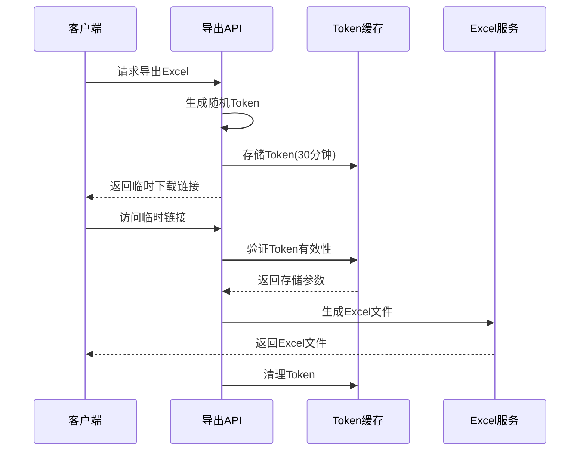

**图表来源**
- [sys_export_template.go:244-333](file://server/api/v1/system/sys_export_template.go#L244-L333)

#### SQL预览功能

支持在不执行查询的情况下预览生成的SQL：

| 预览类型 | 功能描述 | 使用场景 |
|---------|----------|----------|
| 基础SQL预览 | 显示最终生成的SQL字符串 | 开发调试 |
| 条件SQL预览 | 显示带条件的SQL | 参数验证 |
| 关联SQL预览 | 显示JOIN关联的SQL | 性能优化 |

**章节来源**
- [sys_export_template.go:1-47](file://server/model/system/sys_export_template.go#L1-L47)
- [sys_export_template.go:48-457](file://server/api/v1/system/sys_export_template.go#L48-L457)

## 依赖分析

系统工具页面的依赖关系呈现清晰的分层结构：

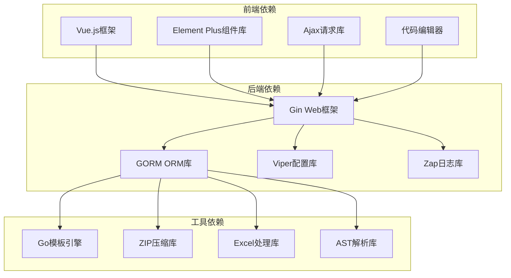

**图表来源**
- [auto_code_template.go:3-23](file://server/service/system/auto_code_template.go#L3-L23)

**章节来源**
- [auto_code_template.go:3-23](file://server/service/system/auto_code_template.go#L3-L23)

## 性能考虑

系统工具页面在设计时充分考虑了性能优化：

### 代码生成性能优化

1. **模板缓存机制**：编译后的模板会被缓存，避免重复编译
2. **并发处理**：支持多模板并行生成，提高处理效率
3. **内存管理**：及时释放生成过程中的临时内存

### 技能管理性能优化

1. **文件系统缓存**：技能文件采用文件系统缓存机制
2. **异步下载**：在线技能下载采用异步处理，不影响主线程
3. **增量更新**：支持增量更新技能，减少不必要的I/O操作

### 版本管理性能优化

1. **批量操作**：支持批量导入导出，减少数据库往返次数
2. **事务处理**：使用数据库事务确保数据一致性
3. **索引优化**：为常用查询字段建立数据库索引

### 导出模板性能优化

1. **流式处理**：Excel文件采用流式生成，避免内存溢出
2. **Token缓存**：一次性Token使用内存缓存，提高访问速度
3. **并发限制**：对高并发场景进行合理的并发限制

## 故障排除指南

### 常见问题及解决方案

#### 代码生成失败

**问题现象**：代码生成过程中出现错误

**可能原因**：
1. 模板文件损坏或缺失
2. 数据库连接异常
3. 权限不足导致文件写入失败

**解决步骤**：
1. 检查模板文件完整性
2. 验证数据库连接配置
3. 确认文件写入权限

#### 技能管理异常

**问题现象**：技能保存或读取失败

**可能原因**：
1. 文件名不合法
2. 目录权限问题
3. YAML格式错误

**解决步骤**：
1. 检查技能名称是否符合命名规范
2. 验证技能目录权限
3. 格式化YAML文件内容

#### 版本导入失败

**问题现象**：版本数据导入过程中出现错误

**可能原因**：
1. JSON数据格式错误
2. 数据库约束冲突
3. 外键关系不匹配

**解决步骤**：
1. 验证JSON数据格式
2. 检查数据库约束
3. 处理外键关系

#### 导出模板错误

**问题现象**：Excel导出失败或Token过期

**可能原因**：
1. Token过期时间设置不当
2. Excel文件过大
3. 内存不足

**解决步骤**：
1. 调整Token过期时间
2. 优化Excel生成逻辑
3. 增加内存配置

**章节来源**
- [sys_skills.go:130-188](file://server/service/system/sys_skills.go#L130-L188)
- [sys_version.go:95-175](file://server/service/system/sys_version.go#L95-L175)
- [sys_export_template.go:280-333](file://server/api/v1/system/sys_export_template.go#L280-L333)

## 结论

系统工具页面为测试管理平台提供了完整的开发辅助工具集，涵盖了代码生成、技能管理、版本管理和导出模板等核心功能。通过模块化的架构设计和完善的错误处理机制，确保了系统的稳定性和可扩展性。

各个功能模块相互协作，形成了完整的工具链生态系统，能够有效提高开发效率，简化重复性工作，并为测试管理提供强有力的技术支撑。未来可以进一步优化性能表现，增强用户体验，并扩展更多实用的开发工具。

## 附录

### 扩展开发指南

#### 自定义代码生成模板

1. 在 `resource/package/server/api/` 目录下创建新的API模板
2. 在 `resource/package/server/service/` 目录下创建新的服务模板
3. 在 `resource/package/web/api/` 目录下创建新的前端模板
4. 在 `resource/package/web/view/` 目录下创建新的Vue组件模板

#### 添加新的技能工具

1. 在 `skillToolDirs` 映射中添加新的工具配置
2. 在 `skillToolOrder` 数组中添加工具优先级
3. 在前端 `tools` 数组中添加工具选项
4. 实现相应的工具特定功能

#### 版本管理扩展

1. 在 `SysVersion` 模型中添加新的字段
2. 在API层添加相应的处理逻辑
3. 在前端界面中添加新的配置选项
4. 实现数据迁移和兼容性处理

#### 导出模板增强

1. 在 `SysExportTemplate` 模型中添加新的字段
2. 实现新的SQL生成逻辑
3. 在前端添加新的配置界面
4. 支持更多的导出格式

### 最佳实践

1. **模块化设计**：保持各功能模块的独立性和低耦合
2. **错误处理**：完善错误处理机制，提供友好的错误提示
3. **性能优化**：关注性能瓶颈，及时进行优化
4. **安全性**：确保数据安全和访问控制
5. **可维护性**：编写清晰的代码注释和文档
6. **测试覆盖**：确保关键功能有足够的测试覆盖