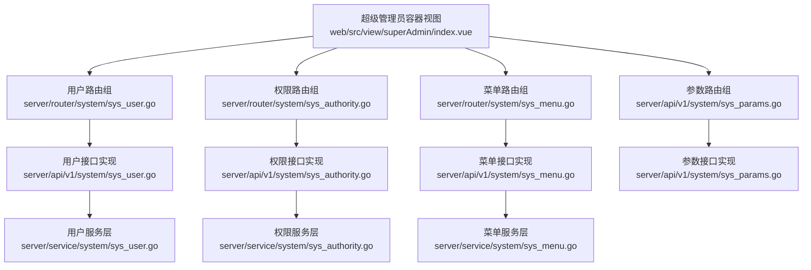
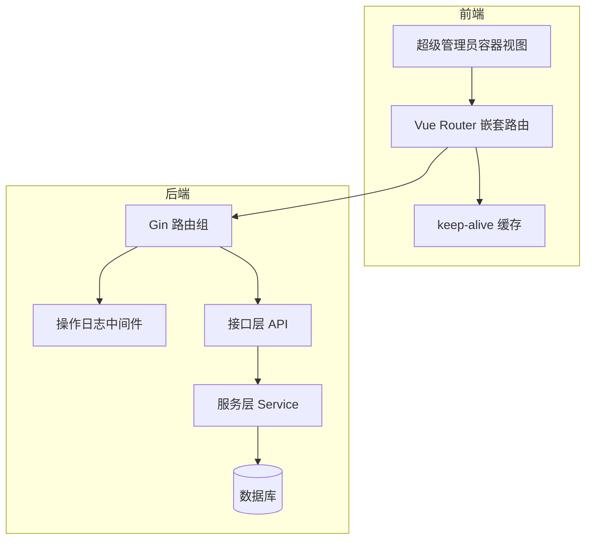
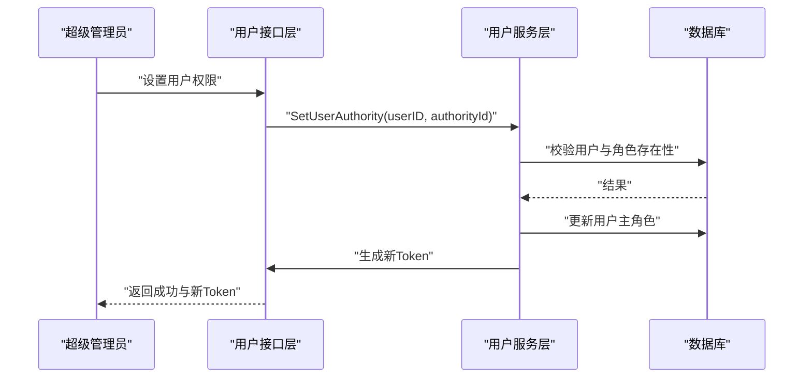
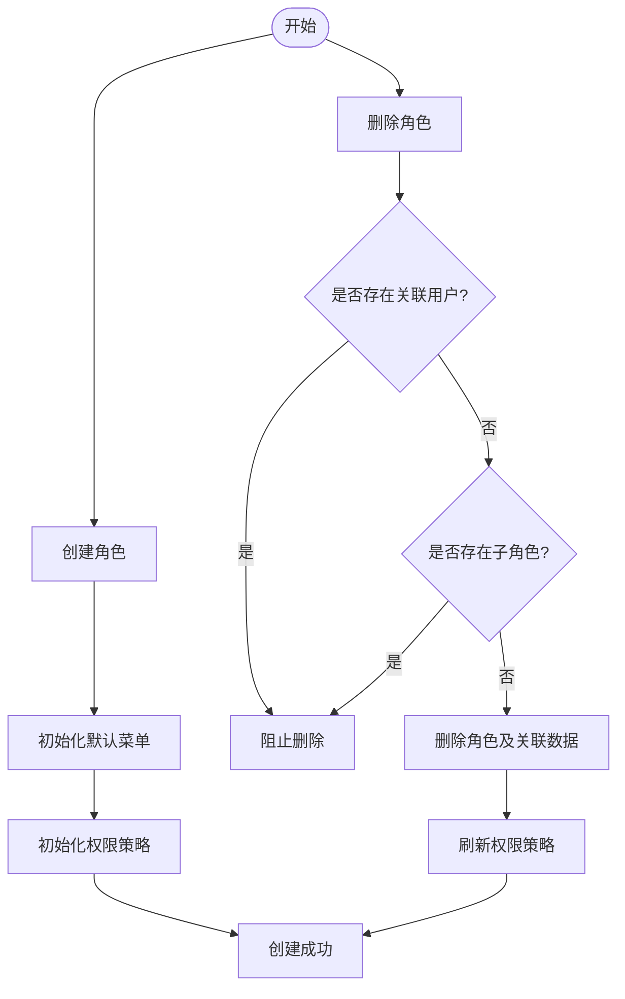
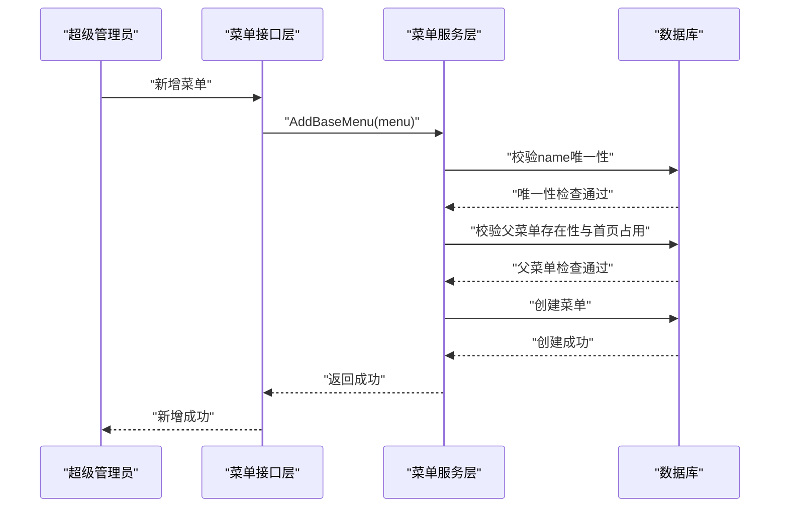
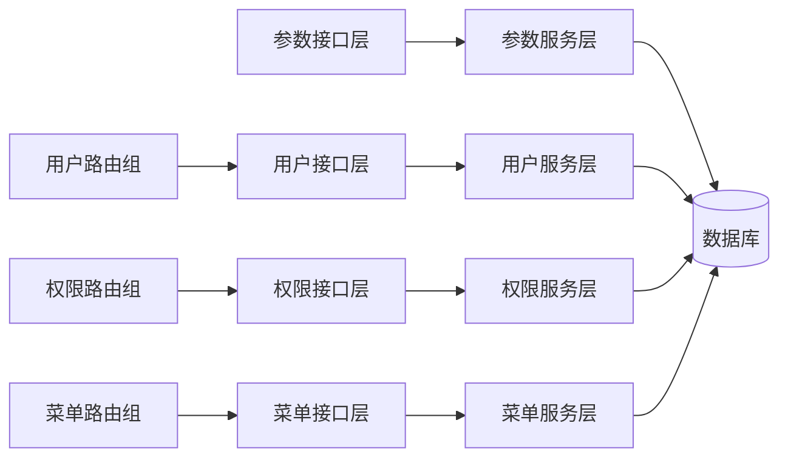

# 超级管理员页面

<cite>
**本文引用的文件**
- [web/src/view/superAdmin/index.vue](file://web/src/view/superAdmin/index.vue)
- [server/router/system/sys_user.go](file://server/router/system/sys_user.go)
- [server/router/system/sys_authority.go](file://server/router/system/sys_authority.go)
- [server/router/system/sys_menu.go](file://server/router/system/sys_menu.go)
- [server/api/v1/system/sys_user.go](file://server/api/v1/system/sys_user.go)
- [server/api/v1/system/sys_authority.go](file://server/api/v1/system/sys_authority.go)
- [server/api/v1/system/sys_menu.go](file://server/api/v1/system/sys_menu.go)
- [server/api/v1/system/sys_params.go](file://server/api/v1/system/sys_params.go)
- [server/service/system/sys_user.go](file://server/service/system/sys_user.go)
- [server/service/system/sys_authority.go](file://server/service/system/sys_authority.go)
- [server/service/system/sys_menu.go](file://server/service/system/sys_menu.go)
</cite>

## 目录
1. [简介](#简介)
2. [项目结构](#项目结构)
3. [核心组件](#核心组件)
4. [架构总览](#架构总览)
5. [详细组件分析](#详细组件分析)
6. [依赖分析](#依赖分析)
7. [性能考量](#性能考量)
8. [故障排查指南](#故障排查指南)
9. [结论](#结论)
10. [附录](#附录)

## 简介
本文件面向测试管理平台的“超级管理员页面”功能，系统性梳理后台服务端与前端视图层在用户管理、权限管理、菜单管理、系统参数等维度的实现与交互。文档重点覆盖：
- 页面入口与路由组织
- 管理员权限校验与访问控制
- 数据表格的 CRUD 实现（含分页、排序、批量操作）
- 表单组件与自定义校验规则
- 安全与性能注意事项

## 项目结构
超级管理员页面由前端路由视图与后端接口两部分组成：
- 前端：超级管理员容器视图负责嵌套路由与缓存，承载用户、权限、菜单、参数等子页面
- 后端：按模块划分路由组，分别暴露用户、权限、菜单、参数等管理接口

图表来源
- [web/src/view/superAdmin/index.vue:1-21](file://web/src/view/superAdmin/index.vue#L1-L21)
- [server/router/system/sys_user.go:1-29](file://server/router/system/sys_user.go#L1-L29)
- [server/router/system/sys_authority.go:1-26](file://server/router/system/sys_authority.go#L1-L26)
- [server/router/system/sys_menu.go:1-30](file://server/router/system/sys_menu.go#L1-L30)
- [server/api/v1/system/sys_user.go:1-517](file://server/api/v1/system/sys_user.go#L1-L517)
- [server/api/v1/system/sys_authority.go:1-258](file://server/api/v1/system/sys_authority.go#L1-L258)
- [server/api/v1/system/sys_menu.go:1-336](file://server/api/v1/system/sys_menu.go#L1-L336)
- [server/api/v1/system/sys_params.go:1-172](file://server/api/v1/system/sys_params.go#L1-L172)
- [server/service/system/sys_user.go:1-337](file://server/service/system/sys_user.go#L1-L337)
- [server/service/system/sys_authority.go:1-413](file://server/service/system/sys_authority.go#L1-L413)
- [server/service/system/sys_menu.go:1-391](file://server/service/system/sys_menu.go#L1-L391)

章节来源
- [web/src/view/superAdmin/index.vue:1-21](file://web/src/view/superAdmin/index.vue#L1-L21)
- [server/router/system/sys_user.go:1-29](file://server/router/system/sys_user.go#L1-L29)
- [server/router/system/sys_authority.go:1-26](file://server/router/system/sys_authority.go#L1-L26)
- [server/router/system/sys_menu.go:1-30](file://server/router/system/sys_menu.go#L1-L30)

## 核心组件
- 超级管理员容器视图：负责渲染子路由页面并启用 keep-alive 缓存，提升切换体验
- 用户管理模块：提供管理员注册、修改密码、设置权限、删除用户、设置用户信息、重置密码、分页查询等能力
- 权限管理模块：提供角色创建/复制/更新/删除、设置数据权限、全量覆盖角色关联用户、分页查询角色列表等能力
- 菜单管理模块：提供菜单增删改、设置菜单关联角色、获取菜单树、动态路由、分页查询等能力
- 系统参数模块：提供参数的增删改查、分页查询、批量删除等能力

章节来源
- [web/src/view/superAdmin/index.vue:1-21](file://web/src/view/superAdmin/index.vue#L1-L21)
- [server/api/v1/system/sys_user.go:163-517](file://server/api/v1/system/sys_user.go#L163-L517)
- [server/api/v1/system/sys_authority.go:17-258](file://server/api/v1/system/sys_authority.go#L17-L258)
- [server/api/v1/system/sys_menu.go:18-336](file://server/api/v1/system/sys_menu.go#L18-L336)
- [server/api/v1/system/sys_params.go:14-172](file://server/api/v1/system/sys_params.go#L14-L172)

## 架构总览
超级管理员页面采用前后端分离架构：
- 前端：基于 Vue Router 的嵌套路由，容器视图通过 keep-alive 缓存子页面，减少重复渲染
- 后端：按模块划分路由组，统一使用中间件记录操作日志；接口层调用服务层完成业务逻辑；服务层与数据库交互并执行权限校验

图表来源
- [web/src/view/superAdmin/index.vue:1-21](file://web/src/view/superAdmin/index.vue#L1-L21)
- [server/router/system/sys_user.go:10-28](file://server/router/system/sys_user.go#L10-L28)
- [server/router/system/sys_authority.go:10-25](file://server/router/system/sys_authority.go#L10-L25)
- [server/router/system/sys_menu.go:10-29](file://server/router/system/sys_menu.go#L10-L29)
- [server/api/v1/system/sys_user.go:163-517](file://server/api/v1/system/sys_user.go#L163-L517)
- [server/api/v1/system/sys_authority.go:17-258](file://server/api/v1/system/sys_authority.go#L17-L258)
- [server/api/v1/system/sys_menu.go:18-336](file://server/api/v1/system/sys_menu.go#L18-L336)

## 详细组件分析

### 用户管理模块
- 功能点
  - 管理员注册账号
  - 用户修改密码
  - 设置用户权限/权限组
  - 删除用户（不可删除自身）
  - 设置用户信息（昵称、头像、手机、邮箱、启用状态）
  - 重置用户密码
  - 分页获取用户列表（支持多字段模糊搜索与排序）
  - 获取自身信息与界面配置
- 关键流程
  - 登录成功后签发 JWT，并记录登录日志
  - 设置用户权限后刷新 Token 并下发新 Token
  - 删除用户时回滚主角色（如需）

图表来源
- [server/api/v1/system/sys_user.go:264-303](file://server/api/v1/system/sys_user.go#L264-L303)
- [server/service/system/sys_user.go:140-181](file://server/service/system/sys_user.go#L140-L181)

章节来源
- [server/router/system/sys_user.go:10-27](file://server/router/system/sys_user.go#L10-L27)
- [server/api/v1/system/sys_user.go:163-517](file://server/api/v1/system/sys_user.go#L163-L517)
- [server/service/system/sys_user.go:89-132](file://server/service/system/sys_user.go#L89-L132)

### 权限管理模块
- 功能点
  - 创建/复制/更新/删除角色
  - 设置角色数据权限（可限定可操作的角色范围）
  - 全量覆盖角色关联用户
  - 分页查询角色列表（支持严格树形结构下的父子层级过滤）
- 关键流程
  - 创建角色时初始化默认菜单与权限策略
  - 删除角色前校验是否仍有用户或子角色
  - 复制角色时同步菜单与按钮权限

图表来源
- [server/api/v1/system/sys_authority.go:17-122](file://server/api/v1/system/sys_authority.go#L17-L122)
- [server/service/system/sys_authority.go:28-54](file://server/service/system/sys_authority.go#L28-L54)
- [server/service/system/sys_authority.go:131-178](file://server/service/system/sys_authority.go#L131-L178)

章节来源
- [server/router/system/sys_authority.go:10-24](file://server/router/system/sys_authority.go#L10-L24)
- [server/api/v1/system/sys_authority.go:17-258](file://server/api/v1/system/sys_authority.go#L17-L258)
- [server/service/system/sys_authority.go:186-211](file://server/service/system/sys_authority.go#L186-L211)

### 菜单管理模块
- 功能点
  - 新增/删除/更新菜单
  - 设置菜单与角色的关联关系（全量覆盖）
  - 获取菜单树、动态路由、基础菜单列表
  - 获取拥有指定菜单的角色列表与默认首页角色列表
- 关键流程
  - 新增菜单时校验名称唯一性、父菜单存在性与首页占用情况
  - 设置菜单角色关联时执行严格树形结构校验（非顶级角色不可跨级操作）

图表来源
- [server/api/v1/system/sys_menu.go:117-150](file://server/api/v1/system/sys_menu.go#L117-L150)
- [server/service/system/sys_menu.go:136-183](file://server/service/system/sys_menu.go#L136-L183)

章节来源
- [server/router/system/sys_menu.go:10-29](file://server/router/system/sys_menu.go#L10-L29)
- [server/api/v1/system/sys_menu.go:18-336](file://server/api/v1/system/sys_menu.go#L18-L336)
- [server/service/system/sys_menu.go:190-233](file://server/service/system/sys_menu.go#L190-L233)

### 系统参数模块
- 功能点
  - 创建、删除、批量删除、更新系统参数
  - 根据 ID 或 key 查询参数
  - 分页查询参数列表（支持分页与条件过滤）
- 关键流程
  - 删除参数时支持单个与批量删除
  - 查询参数时区分按 ID 与按 key 的场景

章节来源
- [server/api/v1/system/sys_params.go:14-172](file://server/api/v1/system/sys_params.go#L14-L172)

### 权限验证与访问控制
- 中间件
  - 统一使用操作日志中间件记录管理员操作
  - JWT 校验确保接口访问合法性
- 严格权限控制
  - 严格树形结构下，非顶级角色仅能对下级角色与菜单进行操作
  - 设置角色数据权限时校验目标角色是否在授权范围内
- 安全要点
  - 管理员自身不可删除
  - 修改主角色时自动刷新 Token 并下发新 Token
  - 登录失败与异常操作均记录日志

章节来源
- [server/router/system/sys_user.go:10-12](file://server/router/system/sys_user.go#L10-L12)
- [server/router/system/sys_authority.go:10-12](file://server/router/system/sys_authority.go#L10-L12)
- [server/router/system/sys_menu.go:10-12](file://server/router/system/sys_menu.go#L10-L12)
- [server/api/v1/system/sys_user.go:352-356](file://server/api/v1/system/sys_user.go#L352-L356)
- [server/api/v1/system/sys_user.go:291-302](file://server/api/v1/system/sys_user.go#L291-L302)
- [server/service/system/sys_authority.go:277-295](file://server/service/system/sys_authority.go#L277-L295)
- [server/service/system/sys_menu.go:241-282](file://server/service/system/sys_menu.go#L241-L282)

### 数据表格 CRUD 与批量操作
- 分页与排序
  - 用户列表支持多字段模糊匹配与排序键控制
- 批量操作
  - 权限模块：全量覆盖角色关联用户
  - 菜单模块：全量覆盖菜单关联角色
  - 参数模块：批量删除参数
- 表单校验
  - 接口层统一使用验证器对请求体进行参数校验
  - 服务层在关键操作前进行业务规则校验（如角色存在性、菜单唯一性等）

章节来源
- [server/api/v1/system/sys_user.go:229-262](file://server/api/v1/system/sys_user.go#L229-L262)
- [server/service/system/sys_user.go:89-132](file://server/service/system/sys_user.go#L89-L132)
- [server/api/v1/system/sys_authority.go:241-257](file://server/api/v1/system/sys_authority.go#L241-L257)
- [server/api/v1/system/sys_menu.go:299-315](file://server/api/v1/system/sys_menu.go#L299-L315)
- [server/api/v1/system/sys_params.go:67-76](file://server/api/v1/system/sys_params.go#L67-L76)

### 表单组件与自定义校验
- 表单组件
  - 前端使用 Element Plus 表单组件，结合校验规则与远程校验
- 自定义校验规则
  - 接口层通过统一验证器对请求参数进行格式与业务规则校验
  - 服务层补充复杂业务校验（如菜单名称唯一、父菜单存在、角色与菜单跨级限制等）

章节来源
- [server/api/v1/system/sys_user.go:177-180](file://server/api/v1/system/sys_user.go#L177-L180)
- [server/api/v1/system/sys_menu.go:133-142](file://server/api/v1/system/sys_menu.go#L133-L142)
- [server/service/system/sys_menu.go:136-183](file://server/service/system/sys_menu.go#L136-L183)

## 依赖分析
- 路由到接口层
  - 用户、权限、菜单路由组分别映射至对应 API 层
- 接口层到服务层
  - API 层负责参数解析、校验与响应封装，调用服务层执行业务
- 服务层到数据库
  - 服务层封装事务、关联查询与复杂业务规则，保证一致性与安全性

图表来源
- [server/router/system/sys_user.go:10-27](file://server/router/system/sys_user.go#L10-L27)
- [server/router/system/sys_authority.go:10-24](file://server/router/system/sys_authority.go#L10-L24)
- [server/router/system/sys_menu.go:10-29](file://server/router/system/sys_menu.go#L10-L29)
- [server/api/v1/system/sys_user.go:163-517](file://server/api/v1/system/sys_user.go#L163-L517)
- [server/api/v1/system/sys_authority.go:17-258](file://server/api/v1/system/sys_authority.go#L17-L258)
- [server/api/v1/system/sys_menu.go:18-336](file://server/api/v1/system/sys_menu.go#L18-L336)
- [server/service/system/sys_user.go:1-337](file://server/service/system/sys_user.go#L1-337)
- [server/service/system/sys_authority.go:1-413](file://server/service/system/sys_authority.go#L1-413)
- [server/service/system/sys_menu.go:1-391](file://server/service/system/sys_menu.go#L1-391)

## 性能考量
- 前端
  - 使用 keep-alive 缓存子页面，减少重复渲染与请求
- 后端
  - 分页查询时使用索引列与 LIMIT/OFFSET 控制数据量
  - 关联预加载（Preload）避免 N+1 查询问题
  - 事务包裹批量写入，保证一致性与原子性
- 安全与审计
  - 统一记录操作日志，便于追踪与审计

## 故障排查指南
- 常见问题
  - 删除失败：确认目标角色是否仍有关联用户或子角色
  - 跨级操作受限：严格树形结构下，非顶级角色不可对上级角色或菜单进行操作
  - 菜单新增失败：检查菜单名称是否重复、父菜单是否存在、父菜单是否被设为首页
  - 设置角色数据权限失败：确认目标角色在授权范围内
- 排查步骤
  - 检查接口返回的错误信息与状态码
  - 查看操作日志定位具体失败环节
  - 在服务层断点验证业务规则与事务边界

章节来源
- [server/service/system/sys_authority.go:131-178](file://server/service/system/sys_authority.go#L131-L178)
- [server/service/system/sys_menu.go:136-183](file://server/service/system/sys_menu.go#L136-L183)
- [server/service/system/sys_authority.go:277-295](file://server/service/system/sys_authority.go#L277-L295)
- [server/service/system/sys_menu.go:241-282](file://server/service/system/sys_menu.go#L241-L282)

## 结论
超级管理员页面围绕用户、权限、菜单与参数四大模块构建，采用前后端分离与严格的权限控制策略，确保管理操作的安全与可控。通过统一的日志中间件、参数校验与事务封装，系统在功能完整性与运行稳定性之间取得平衡。

## 附录
- 开发规范建议
  - 接口命名遵循“模块+动作”语义化风格
  - 请求参数必须通过验证器校验，响应统一封装
  - 关键业务操作必须在事务中执行，保证一致性
  - 严格树形结构开启时，务必进行跨级操作校验
- 安全最佳实践
  - 管理员自身不可删除
  - 修改主角色后及时刷新 Token 并下发新 Token
  - 登录失败与异常操作必须记录日志