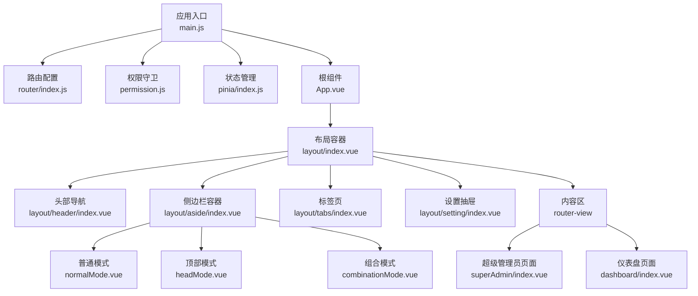
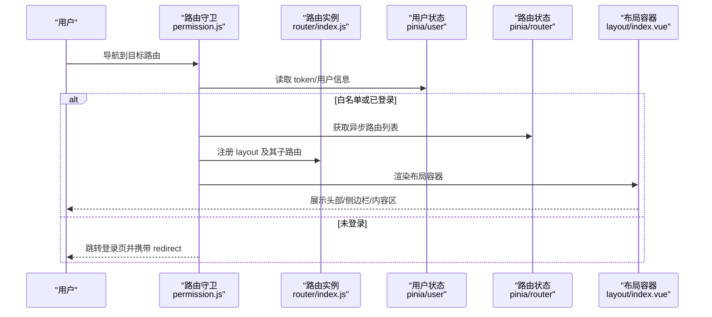
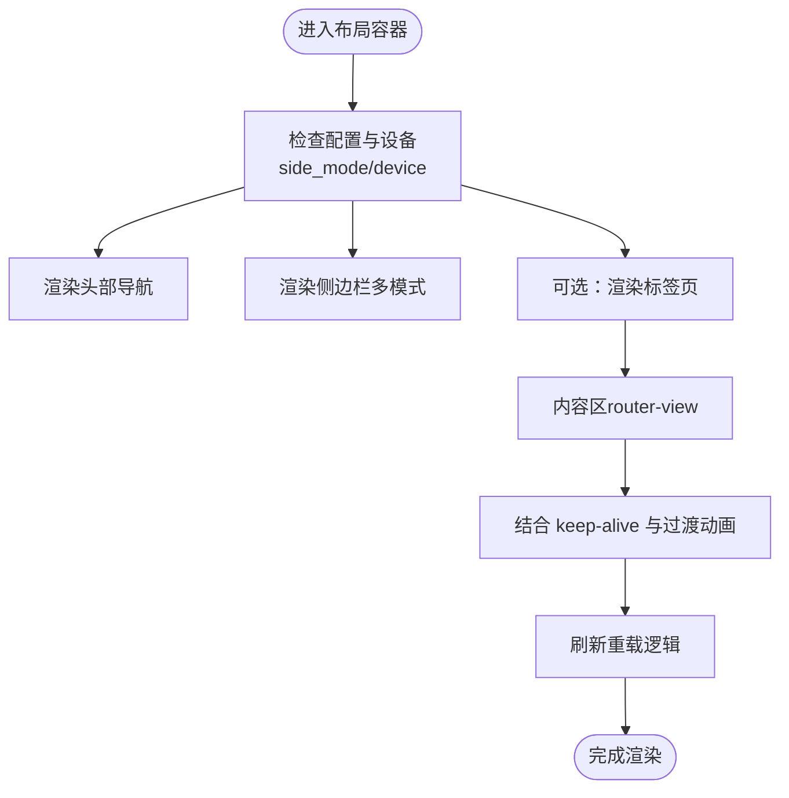
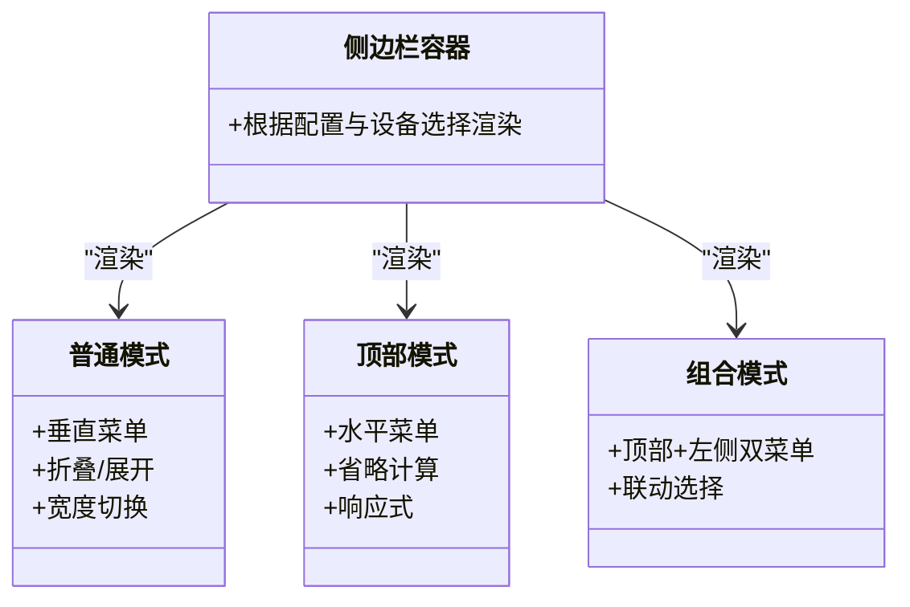
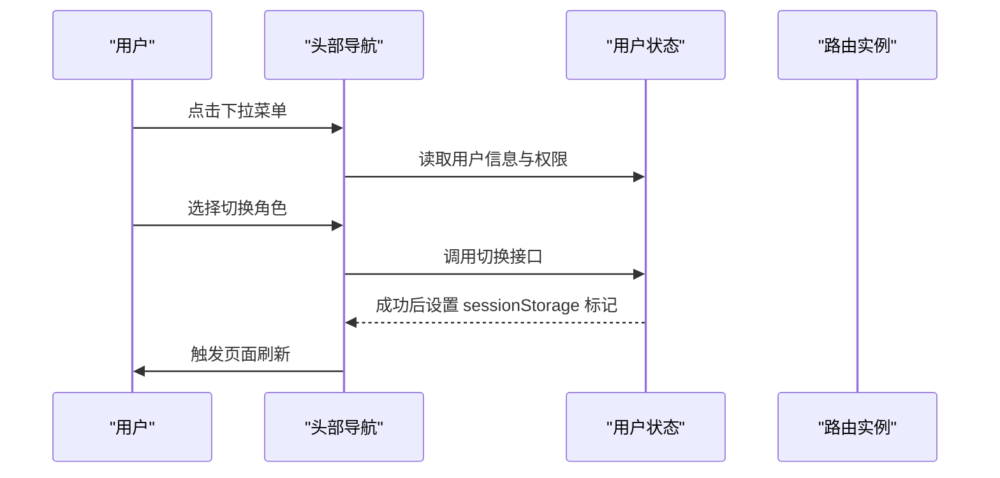
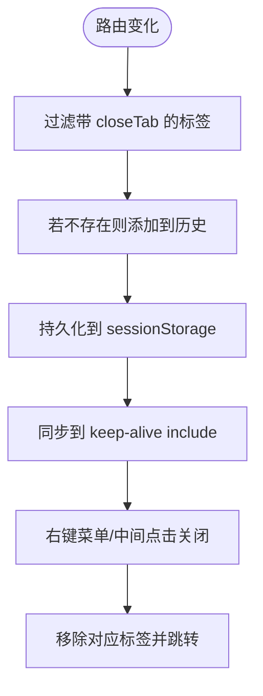
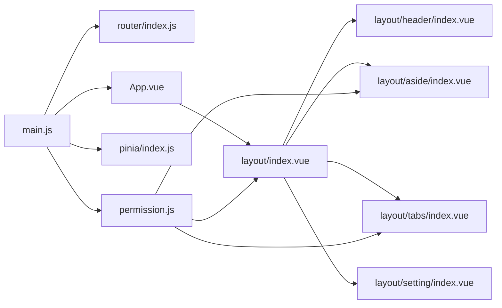

# 页面管理

<cite>
**本文引用的文件**
- [web/src/App.vue](file://web/src/App.vue)
- [web/src/main.js](file://web/src/main.js)
- [web/src/router/index.js](file://web/src/router/index.js)
- [web/src/permission.js](file://web/src/permission.js)
- [web/src/pinia/index.js](file://web/src/pinia/index.js)
- [web/src/view/layout/index.vue](file://web/src/view/layout/index.vue)
- [web/src/view/layout/aside/index.vue](file://web/src/view/layout/aside/index.vue)
- [web/src/view/layout/aside/normalMode.vue](file://web/src/view/layout/aside/normalMode.vue)
- [web/src/view/layout/aside/headMode.vue](file://web/src/view/layout/aside/headMode.vue)
- [web/src/view/layout/aside/combinationMode.vue](file://web/src/view/layout/aside/combinationMode.vue)
- [web/src/view/layout/header/index.vue](file://web/src/view/layout/header/index.vue)
- [web/src/view/layout/tabs/index.vue](file://web/src/view/layout/tabs/index.vue)
- [web/src/view/layout/setting/index.vue](file://web/src/view/layout/setting/index.vue)
- [web/src/view/superAdmin/index.vue](file://web/src/view/superAdmin/index.vue)
- [web/src/view/dashboard/index.vue](file://web/src/view/dashboard/index.vue)
</cite>

## 目录
1. [简介](#简介)
2. [项目结构](#项目结构)
3. [核心组件](#核心组件)
4. [架构总览](#架构总览)
5. [详细组件分析](#详细组件分析)
6. [依赖关系分析](#依赖关系分析)
7. [性能考量](#性能考量)
8. [故障排查指南](#故障排查指南)
9. [结论](#结论)
10. [附录](#附录)

## 简介
本文件面向测试管理平台的“页面管理系统”，系统性梳理前端页面布局体系与路由权限控制，覆盖以下主题：
- 页面布局系统：侧边栏、头部导航、内容区与标签页的组织结构与交互
- 页面类型：超级管理员页面、仪表盘页面、功能页面的实现方式与入口
- 权限控制与动态菜单：基于用户权限的异步路由注册、菜单渲染与访问控制
- 组件组合与数据传递：布局组件的组合模式、父子通信与状态共享
- 响应式与移动端适配：多布局模式与设备检测的联动
- 开发规范与复用策略：组件拆分、命名约定与可维护性建议
- 性能优化与体验改进：路由懒加载、keep-alive、过渡动画与滚动恢复

## 项目结构
前端采用 Vue 3 + Element Plus + Pinia + Vue Router 架构，页面管理相关的关键目录与文件如下：
- 应用入口与全局配置：App.vue、main.js、router/index.js、permission.js、pinia/index.js
- 布局与导航：view/layout 下的 index.vue、aside、header、tabs、setting
- 页面示例：superAdmin/index.vue、dashboard/index.vue
- 样式与主题：通过 SCSS 和 Element Plus 主题变量实现深色/浅色切换与主题定制

图表来源
- [web/src/main.js:1-38](file://web/src/main.js#L1-L38)
- [web/src/router/index.js:1-42](file://web/src/router/index.js#L1-L42)
- [web/src/permission.js:1-225](file://web/src/permission.js#L1-L225)
- [web/src/pinia/index.js:1-9](file://web/src/pinia/index.js#L1-L9)
- [web/src/App.vue:1-47](file://web/src/App.vue#L1-L47)
- [web/src/view/layout/index.vue:1-119](file://web/src/view/layout/index.vue#L1-L119)
- [web/src/view/layout/aside/index.vue:1-40](file://web/src/view/layout/aside/index.vue#L1-L40)
- [web/src/view/layout/aside/normalMode.vue:1-111](file://web/src/view/layout/aside/normalMode.vue#L1-L111)
- [web/src/view/layout/aside/headMode.vue:1-140](file://web/src/view/layout/aside/headMode.vue#L1-L140)
- [web/src/view/layout/aside/combinationMode.vue:1-147](file://web/src/view/layout/aside/combinationMode.vue#L1-L147)
- [web/src/view/layout/header/index.vue:1-134](file://web/src/view/layout/header/index.vue#L1-L134)
- [web/src/view/layout/tabs/index.vue:1-422](file://web/src/view/layout/tabs/index.vue#L1-L422)
- [web/src/view/layout/setting/index.vue:1-229](file://web/src/view/layout/setting/index.vue#L1-L229)
- [web/src/view/superAdmin/index.vue:1-21](file://web/src/view/superAdmin/index.vue#L1-L21)
- [web/src/view/dashboard/index.vue:1-129](file://web/src/view/dashboard/index.vue#L1-L129)

章节来源
- [web/src/main.js:1-38](file://web/src/main.js#L1-L38)
- [web/src/router/index.js:1-42](file://web/src/router/index.js#L1-L42)
- [web/src/permission.js:1-225](file://web/src/permission.js#L1-L225)
- [web/src/pinia/index.js:1-9](file://web/src/pinia/index.js#L1-L9)
- [web/src/App.vue:1-47](file://web/src/App.vue#L1-L47)

## 核心组件
- 布局容器：负责水印、头部、侧边栏、标签页、内容区与底部信息的整体排布，并提供刷新重载能力
- 侧边栏：支持多种布局模式（普通、顶部、组合、侧边栏），根据设备与配置动态渲染
- 头部导航：品牌区、面包屑、用户下拉菜单与工具区
- 标签页：多页签管理、右键菜单、中间点击关闭、持久化与 keep-alive 协作
- 设置抽屉：外观、布局、通用三类配置项，支持主题色与布局模式切换
- 页面视图：超级管理员页面与仪表盘页面作为典型页面示例

章节来源
- [web/src/view/layout/index.vue:1-119](file://web/src/view/layout/index.vue#L1-L119)
- [web/src/view/layout/aside/index.vue:1-40](file://web/src/view/layout/aside/index.vue#L1-L40)
- [web/src/view/layout/header/index.vue:1-134](file://web/src/view/layout/header/index.vue#L1-L134)
- [web/src/view/layout/tabs/index.vue:1-422](file://web/src/view/layout/tabs/index.vue#L1-L422)
- [web/src/view/layout/setting/index.vue:1-229](file://web/src/view/layout/setting/index.vue#L1-L229)
- [web/src/view/superAdmin/index.vue:1-21](file://web/src/view/superAdmin/index.vue#L1-L21)
- [web/src/view/dashboard/index.vue:1-129](file://web/src/view/dashboard/index.vue#L1-L129)

## 架构总览
页面管理的运行时流程围绕“路由守卫 + 异步路由注册 + 动态菜单渲染”展开，配合 Pinia 状态与 Element Plus 组件库实现统一的主题、布局与交互。

图表来源
- [web/src/permission.js:155-209](file://web/src/permission.js#L155-L209)
- [web/src/router/index.js:1-42](file://web/src/router/index.js#L1-L42)
- [web/src/view/layout/index.vue:1-119](file://web/src/view/layout/index.vue#L1-L119)

## 详细组件分析

### 布局容器（layout/index.vue）
- 职责：承载水印、头部、侧边栏、标签页、内容区与底部信息；提供页面刷新重载逻辑
- 关键特性：
  - 水印：按用户昵称显示，支持深色模式
  - 布局模式：根据配置与设备选择渲染不同侧边栏模式
  - 标签页：可选开启，与 keep-alive 协同
  - 内容区：过渡动画与 keep-alive 结合，支持 keepAliveRouters
  - 刷新：通过 reloadFlag 控制组件重建，避免 keep-alive 缓存导致的重复渲染

图表来源
- [web/src/view/layout/index.vue:14-52](file://web/src/view/layout/index.vue#L14-L52)
- [web/src/view/layout/index.vue:99-115](file://web/src/view/layout/index.vue#L99-L115)

章节来源
- [web/src/view/layout/index.vue:1-119](file://web/src/view/layout/index.vue#L1-L119)

### 侧边栏（layout/aside/index.vue 与三种模式）
- 容器：根据配置与设备决定渲染哪几种模式的侧边栏
- 普通模式（normalMode.vue）：垂直菜单，支持折叠与宽度切换
- 顶部模式（headMode.vue）：水平菜单，支持自动省略与响应式宽度计算
- 组合模式（combinationMode.vue）：同时提供顶部与左侧菜单，支持联动选择

图表来源
- [web/src/view/layout/aside/index.vue:1-40](file://web/src/view/layout/aside/index.vue#L1-L40)
- [web/src/view/layout/aside/normalMode.vue:1-111](file://web/src/view/layout/aside/normalMode.vue#L1-L111)
- [web/src/view/layout/aside/headMode.vue:1-140](file://web/src/view/layout/aside/headMode.vue#L1-L140)
- [web/src/view/layout/aside/combinationMode.vue:1-147](file://web/src/view/layout/aside/combinationMode.vue#L1-L147)

章节来源
- [web/src/view/layout/aside/index.vue:1-40](file://web/src/view/layout/aside/index.vue#L1-L40)
- [web/src/view/layout/aside/normalMode.vue:1-111](file://web/src/view/layout/aside/normalMode.vue#L1-L111)
- [web/src/view/layout/aside/headMode.vue:1-140](file://web/src/view/layout/aside/headMode.vue#L1-L140)
- [web/src/view/layout/aside/combinationMode.vue:1-147](file://web/src/view/layout/aside/combinationMode.vue#L1-L147)

### 头部导航（layout/header/index.vue）
- 职责：品牌区、面包屑、用户下拉菜单、角色切换、登出
- 特性：移动端隐藏面包屑；支持切换角色并触发全量重载

图表来源
- [web/src/view/layout/header/index.vue:116-130](file://web/src/view/layout/header/index.vue#L116-L130)

章节来源
- [web/src/view/layout/header/index.vue:1-134](file://web/src/view/layout/header/index.vue#L1-L134)

### 标签页（layout/tabs/index.vue）
- 职责：多页签管理、右键菜单、中间点击关闭、持久化与 keep-alive 同步
- 关键逻辑：根据路由变化动态增删标签；支持关闭所有/左侧/右侧/其他；与 keepAliveRouters 同步 include 列表

图表来源
- [web/src/view/layout/tabs/index.vue:188-235](file://web/src/view/layout/tabs/index.vue#L188-L235)
- [web/src/view/layout/tabs/index.vue:274-279](file://web/src/view/layout/tabs/index.vue#L274-L279)

章节来源
- [web/src/view/layout/tabs/index.vue:1-422](file://web/src/view/layout/tabs/index.vue#L1-L422)

### 设置抽屉（layout/setting/index.vue）
- 职责：外观、布局、通用三类配置；支持主题色与布局模式切换；自动保存至用户设置
- 特性：移动端抽屉宽度自适应；配置变更时自动保存

章节来源
- [web/src/view/layout/setting/index.vue:1-229](file://web/src/view/layout/setting/index.vue#L1-L229)

### 页面类型与入口
- 超级管理员页面（superAdmin/index.vue）：作为超级管理员专属页面的容器，内部通过 router-view 加载子页面
- 仪表盘页面（dashboard/index.vue）：展示欢迎语、卡片与图表组件，作为常用业务看板

章节来源
- [web/src/view/superAdmin/index.vue:1-21](file://web/src/view/superAdmin/index.vue#L1-L21)
- [web/src/view/dashboard/index.vue:1-129](file://web/src/view/dashboard/index.vue#L1-L129)

## 依赖关系分析
- 应用入口 main.js 初始化 Element Plus、路由、权限、Pinia，并挂载 App.vue
- App.vue 提供全局配置提供者与应用根组件
- permission.js 实现路由守卫与异步路由注册，确保仅在登录后按权限生成路由
- layout/index.vue 作为页面骨架，依赖 aside、header、tabs、setting 等子组件
- 路由层通过 router/index.js 定义基础路由，permission.js 在运行时动态注入

图表来源
- [web/src/main.js:1-38](file://web/src/main.js#L1-L38)
- [web/src/router/index.js:1-42](file://web/src/router/index.js#L1-L42)
- [web/src/permission.js:117-146](file://web/src/permission.js#L117-L146)
- [web/src/pinia/index.js:1-9](file://web/src/pinia/index.js#L1-L9)
- [web/src/App.vue:1-47](file://web/src/App.vue#L1-L47)
- [web/src/view/layout/index.vue:1-119](file://web/src/view/layout/index.vue#L1-L119)

章节来源
- [web/src/main.js:1-38](file://web/src/main.js#L1-L38)
- [web/src/router/index.js:1-42](file://web/src/router/index.js#L1-L42)
- [web/src/permission.js:1-225](file://web/src/permission.js#L1-L225)
- [web/src/pinia/index.js:1-9](file://web/src/pinia/index.js#L1-L9)
- [web/src/App.vue:1-47](file://web/src/App.vue#L1-L47)

## 性能考量
- 路由懒加载：路由组件通过动态导入实现按需加载，减少首屏体积
- keep-alive 与标签页：仅对需要缓存的页面进行 include，避免无谓缓存
- 过渡动画：统一的过渡名称与配置，保证切换流畅且不阻塞渲染
- 滚动恢复：路由切换后滚动到顶部，提升连续浏览体验
- 响应式计算：菜单省略与宽度计算在窗口尺寸变化时按需重算，避免过度重绘

章节来源
- [web/src/router/index.js:13-33](file://web/src/router/index.js#L13-L33)
- [web/src/view/layout/tabs/index.vue:274-279](file://web/src/view/layout/tabs/index.vue#L274-L279)
- [web/src/permission.js:212-215](file://web/src/permission.js#L212-L215)
- [web/src/view/layout/aside/headMode.vue:50-95](file://web/src/view/layout/aside/headMode.vue#L50-L95)

## 故障排查指南
- 登录后无法进入页面
  - 检查白名单与 token 逻辑，确认已调用异步路由注册
  - 确认路由守卫中 redirect 参数正确传递
- 菜单不显示或空白
  - 检查用户权限是否下发了菜单数据
  - 确认 permission.js 中异步路由注册流程执行
- 标签页异常
  - 检查 sessionStorage 中 historys 是否被意外清空
  - 确认 keep-alive include 列表与标签页同步
- 切换角色后页面未刷新
  - 检查切换角色接口返回与 sessionStorage 标记
  - 确认页面刷新逻辑是否触发

章节来源
- [web/src/permission.js:155-209](file://web/src/permission.js#L155-L209)
- [web/src/view/layout/tabs/index.vue:340-352](file://web/src/view/layout/tabs/index.vue#L340-L352)
- [web/src/view/layout/header/index.vue:121-130](file://web/src/view/layout/header/index.vue#L121-L130)

## 结论
页面管理系统以布局容器为核心，通过多布局模式与动态菜单实现灵活的导航体验；借助路由守卫与异步路由注册，实现严格的权限控制与页面隔离；配合标签页与 keep-alive，兼顾性能与可用性。整体架构清晰、职责分离明确，适合在大型后台系统中持续演进与扩展。

## 附录
- 开发规范与复用策略
  - 组件命名：采用语义化命名，如 layout/aside/normalMode.vue
  - 状态共享：优先使用 Pinia 模块化管理，避免跨层级 props
  - 路由设计：页面路由尽量扁平化，菜单树通过后端下发，permission.js 统一注册
  - 样式组织：SCSS 变量与 Element Plus 主题变量结合，统一深色/浅色风格
- 响应式与移动端适配
  - 使用设备检测与布局配置联动，自动切换侧边栏模式
  - 顶部模式支持菜单省略与宽度计算，避免溢出
- 性能优化与体验改进
  - 保持路由懒加载与按需引入
  - 合理使用 keep-alive，避免缓存过多页面
  - 优化过渡动画与滚动行为，减少不必要的重绘