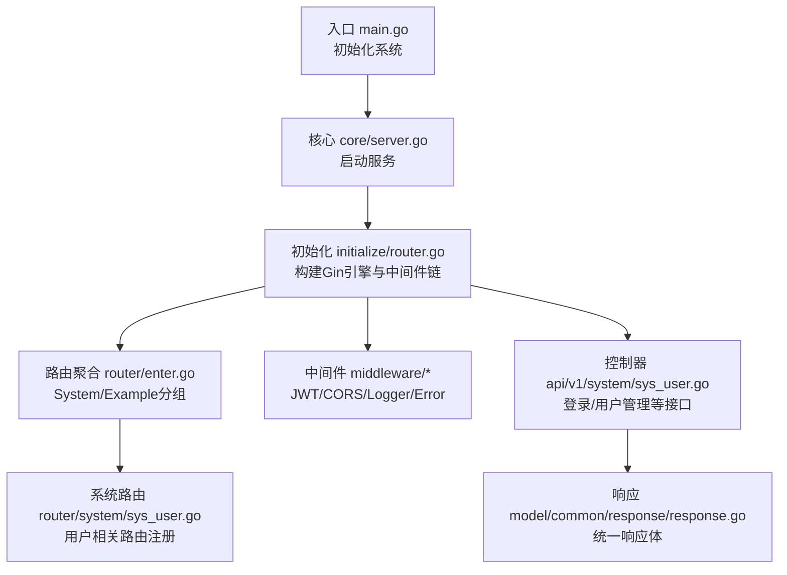
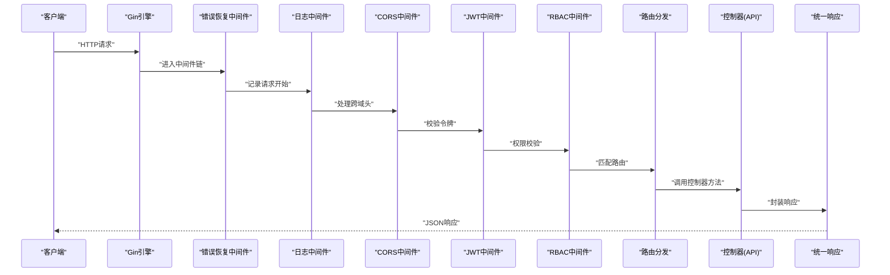
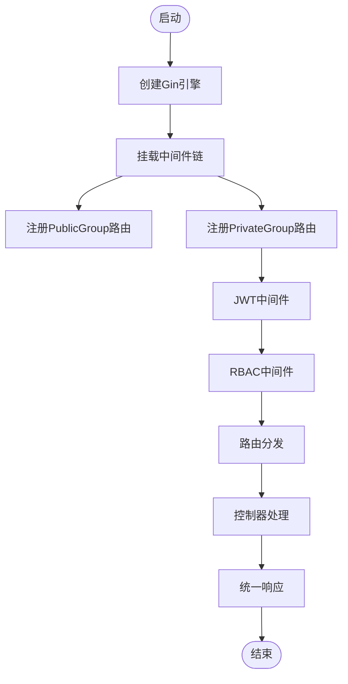
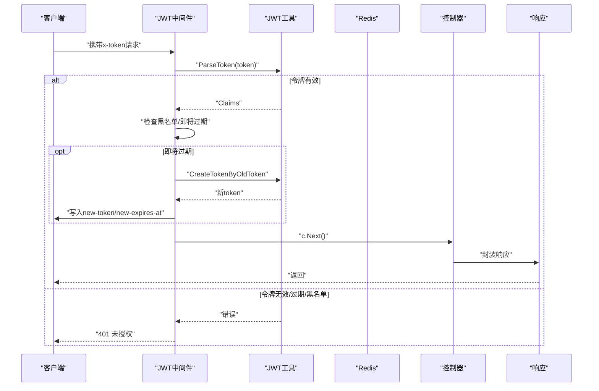
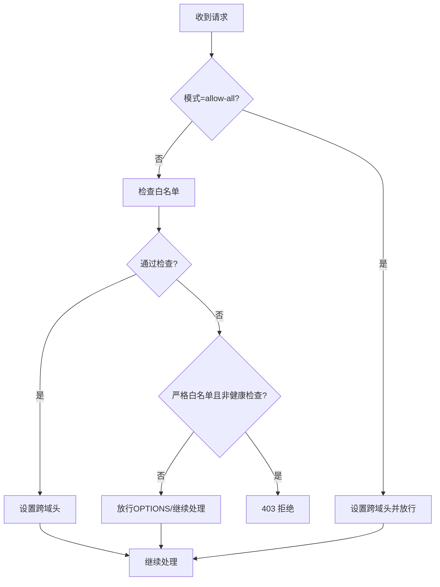
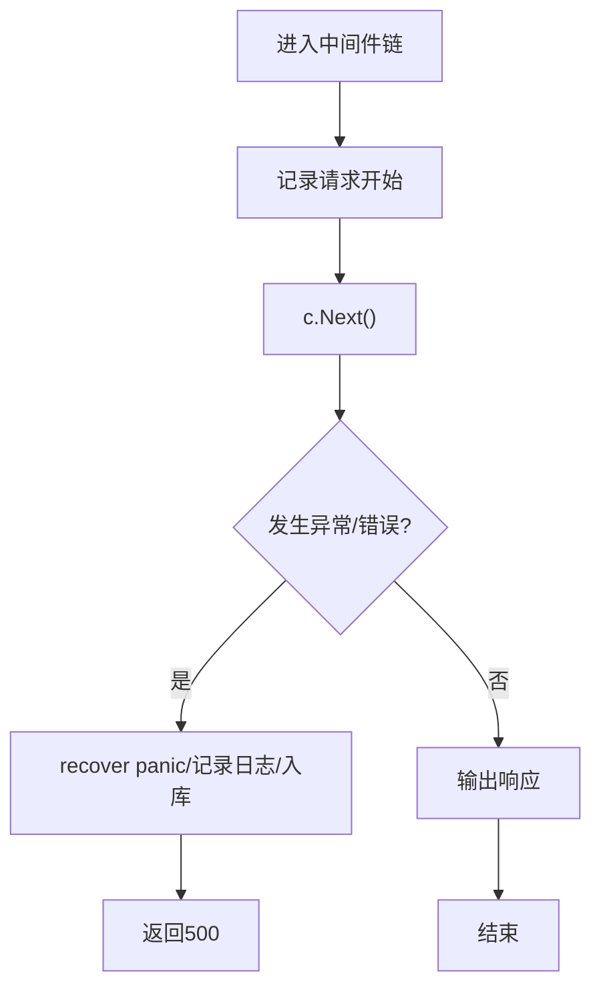
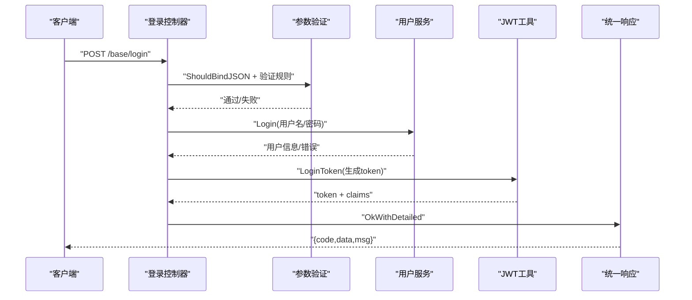
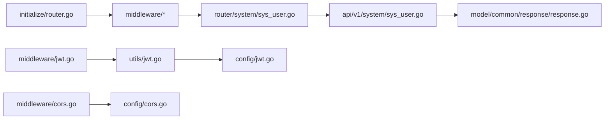

# API层设计

<cite>
**本文引用的文件**
- [server/main.go](file://server/main.go)
- [server/core/server.go](file://server/core/server.go)
- [server/initialize/router.go](file://server/initialize/router.go)
- [server/router/enter.go](file://server/router/enter.go)
- [server/router/system/sys_user.go](file://server/router/system/sys_user.go)
- [server/api/v1/enter.go](file://server/api/v1/enter.go)
- [server/api/v1/system/sys_user.go](file://server/api/v1/system/sys_user.go)
- [server/middleware/jwt.go](file://server/middleware/jwt.go)
- [server/middleware/cors.go](file://server/middleware/cors.go)
- [server/middleware/logger.go](file://server/middleware/logger.go)
- [server/middleware/error.go](file://server/middleware/error.go)
- [server/config/jwt.go](file://server/config/jwt.go)
- [server/config/cors.go](file://server/config/cors.go)
- [server/utils/jwt.go](file://server/utils/jwt.go)
- [server/model/common/response/response.go](file://server/model/common/response/response.go)
</cite>

## 目录
1. [引言](#引言)
2. [项目结构](#项目结构)
3. [核心组件](#核心组件)
4. [架构总览](#架构总览)
5. [详细组件分析](#详细组件分析)
6. [依赖分析](#依赖分析)
7. [性能考量](#性能考量)
8. [故障排查指南](#故障排查指南)
9. [结论](#结论)
10. [附录](#附录)

## 引言
本文件面向测试管理平台的API层设计，系统性阐述基于Gin框架的RESTful API架构原则与实现细节，覆盖HTTP方法使用、URL设计规范、状态码策略；路由注册与中间件链路；JWT认证、CORS跨域、请求日志与错误恢复等中间件的功能与配置；以及接口设计最佳实践与安全防护建议。目标是帮助开发者快速理解并高效扩展API层。

## 项目结构
API层围绕“入口初始化—路由注册—中间件链—控制器（API）—响应封装”展开，采用分层与模块化组织：
- 入口与初始化：main负责系统初始化，core负责启动服务，initialize完成路由与静态资源、Swagger等注册。
- 路由层：router/enter.go聚合各业务路由组，router/system/*.go按功能域注册具体路由。
- 中间件层：middleware/*提供JWT、CORS、日志、错误恢复等横切能力。
- 控制器层：api/v1/*对应业务API，遵循Swagger注解与统一响应封装。
- 配置与工具：config/*定义JWT/CORS等配置结构，utils/*提供JWT签发/解析、Redis交互等工具。

图表来源
- [server/main.go:30-35](file://server/main.go#L30-L35)
- [server/core/server.go:14-48](file://server/core/server.go#L14-L48)
- [server/initialize/router.go:36-117](file://server/initialize/router.go#L36-L117)
- [server/router/enter.go:8-13](file://server/router/enter.go#L8-L13)
- [server/router/system/sys_user.go:10-28](file://server/router/system/sys_user.go#L10-L28)
- [server/api/v1/system/sys_user.go:20-99](file://server/api/v1/system/sys_user.go#L20-L99)
- [server/model/common/response/response.go:9-63](file://server/model/common/response/response.go#L9-L63)

章节来源
- [server/main.go:30-35](file://server/main.go#L30-L35)
- [server/core/server.go:14-48](file://server/core/server.go#L14-L48)
- [server/initialize/router.go:36-117](file://server/initialize/router.go#L36-L117)

## 核心组件
- 路由引擎与中间件链
  - Gin引擎在initialize/router.go中创建，按需挂载错误恢复、日志、跨域、JWT与RBAC等中间件。
  - 私有路由组与公开路由组分离，私有路由组统一加入JWT与RBAC中间件。
- 统一响应封装
  - model/common/response/response.go提供SUCCESS/ERROR常量与Ok/Fail/NoAuth等便捷方法，确保前后端一致的响应结构。
- JWT认证工具
  - utils/jwt.go提供Claims构造、签发、解析、并发安全换发、Redis持久化等能力。
  - middleware/jwt.go实现中间件：校验令牌、黑名单检查、过期自动续签、多点登录记录。
- CORS跨域
  - middleware/cors.go支持“全部放行”和“按配置白名单放行”，严格白名单模式下非OPTIONS直接拒绝。
- 请求日志
  - middleware/logger.go提供可定制的日志中间件，支持过滤、脱敏、鉴权信息注入与自定义打印。
- 错误处理
  - middleware/error.go捕获panic，区分“断开连接”场景，记录请求上下文与堆栈，必要时入库并返回500。

章节来源
- [server/initialize/router.go:36-117](file://server/initialize/router.go#L36-L117)
- [server/model/common/response/response.go:9-63](file://server/model/common/response/response.go#L9-L63)
- [server/utils/jwt.go:13-106](file://server/utils/jwt.go#L13-L106)
- [server/middleware/jwt.go:16-89](file://server/middleware/jwt.go#L16-L89)
- [server/middleware/cors.go:11-73](file://server/middleware/cors.go#L11-L73)
- [server/middleware/logger.go:41-89](file://server/middleware/logger.go#L41-89)
- [server/middleware/error.go:21-79](file://server/middleware/error.go#L21-79)

## 架构总览
下图展示从客户端到控制器的典型请求流，突出中间件链与路由注册位置：

图表来源
- [server/initialize/router.go:36-117](file://server/initialize/router.go#L36-L117)
- [server/middleware/error.go:21-79](file://server/middleware/error.go#L21-79)
- [server/middleware/logger.go:41-89](file://server/middleware/logger.go#L41-89)
- [server/middleware/cors.go:11-73](file://server/middleware/cors.go#L11-L73)
- [server/middleware/jwt.go:16-89](file://server/middleware/jwt.go#L16-L89)
- [server/api/v1/system/sys_user.go:20-99](file://server/api/v1/system/sys_user.go#L20-L99)
- [server/model/common/response/response.go:20-62](file://server/model/common/response/response.go#L20-L62)

## 详细组件分析

### 路由系统与注册流程
- 路由分组
  - PublicGroup/PrivateGroup分别承载无需鉴权与需要鉴权的接口。
  - PrivateGroup统一挂载JWTAuth与CasbinHandler中间件。
- 路由注册
  - initialize/router.go集中注册系统路由、示例路由、插件路由与业务路由。
  - router/enter.go聚合各业务路由组，router/system/sys_user.go按功能域注册具体路由。
- URL设计规范
  - 采用清晰的层级命名，如/user/*、/base/*等，便于语义化与维护。
  - Swagger注解用于生成文档与接口描述，API文件内以注释形式声明标签、参数与响应。

图表来源
- [server/initialize/router.go:36-117](file://server/initialize/router.go#L36-L117)
- [server/router/enter.go:8-13](file://server/router/enter.go#L8-L13)
- [server/router/system/sys_user.go:10-28](file://server/router/system/sys_user.go#L10-L28)

章节来源
- [server/initialize/router.go:36-117](file://server/initialize/router.go#L36-L117)
- [server/router/enter.go:8-13](file://server/router/enter.go#L8-L13)
- [server/router/system/sys_user.go:10-28](file://server/router/system/sys_user.go#L10-L28)

### JWT认证中间件与令牌管理
- 令牌获取与校验
  - 从请求头读取令牌，若缺失或在黑名单则拒绝访问。
  - 使用utils/jwt.go解析令牌，区分过期、签名无效等错误类型。
- 自动续签与多点登录
  - 当即将过期时，生成新令牌并写入响应头与Cookie，必要时更新Redis中的活跃令牌。
  - 若启用多点登录，使用Redis记录用户当前活跃JWT，实现异地登录拦截与切换。
- 令牌生成与配置
  - config/jwt.go定义签名密钥、过期时间、缓冲时间与签发者，utils/jwt.go据此构造CustomClaims并签发。

图表来源
- [server/middleware/jwt.go:16-89](file://server/middleware/jwt.go#L16-L89)
- [server/utils/jwt.go:48-88](file://server/utils/jwt.go#L48-L88)
- [server/config/jwt.go:3-8](file://server/config/jwt.go#L3-L8)

章节来源
- [server/middleware/jwt.go:16-89](file://server/middleware/jwt.go#L16-L89)
- [server/utils/jwt.go:13-106](file://server/utils/jwt.go#L13-L106)
- [server/config/jwt.go:3-8](file://server/config/jwt.go#L3-L8)

### CORS跨域处理
- 全部放行模式
  - 返回Origin、允许头、方法、暴露头与凭据，对OPTIONS直接返回204。
- 白名单模式
  - 严格白名单：未通过检查且非健康检查路径时拒绝（403）。
  - 非严格白名单：未通过检查也放行OPTIONS，其余继续处理。
- 配置结构
  - config/cors.go定义模式与白名单条目，包含允许来源、方法、头、暴露头与凭据开关。

图表来源
- [server/middleware/cors.go:11-73](file://server/middleware/cors.go#L11-L73)
- [server/config/cors.go:3-14](file://server/config/cors.go#L3-L14)

章节来源
- [server/middleware/cors.go:11-73](file://server/middleware/cors.go#L11-L73)
- [server/config/cors.go:3-14](file://server/config/cors.go#L3-L14)

### 请求日志与错误处理
- 请求日志
  - middleware/logger.go记录时间、路径、查询、IP、UA、错误、耗时与来源；支持过滤原始Body、关键字脱敏与鉴权信息注入。
  - 默认Logger将日志JSON输出至标准输出，便于容器日志采集。
- 错误处理
  - middleware/error.go捕获panic，区分“断开连接”场景，记录请求与堆栈，必要时入库并返回500。
  - Gin调试模式下自动输出访问日志。

图表来源
- [server/middleware/logger.go:41-89](file://server/middleware/logger.go#L41-89)
- [server/middleware/error.go:21-79](file://server/middleware/error.go#L21-79)

章节来源
- [server/middleware/logger.go:41-89](file://server/middleware/logger.go#L41-89)
- [server/middleware/error.go:21-79](file://server/middleware/error.go#L21-79)

### API接口设计与统一响应
- 统一响应体
  - model/common/response/response.go定义通用响应结构与常用方法，保证前后端契约一致。
- 接口设计规范
  - 使用Swagger注解声明标签、参数、响应与安全方案，例如ApiKeyAuth与x-token头。
  - 控制器方法内先进行参数绑定与验证，再调用服务层，最后封装统一响应。
- 示例：登录流程
  - api/v1/system/sys_user.go.Login接收JSON参数，进行验证码与用户校验，成功后调用TokenNext生成JWT并记录登录日志。

图表来源
- [server/api/v1/system/sys_user.go:20-99](file://server/api/v1/system/sys_user.go#L20-L99)
- [server/model/common/response/response.go:20-62](file://server/model/common/response/response.go#L20-L62)
- [server/utils/jwt.go:48-88](file://server/utils/jwt.go#L48-L88)

章节来源
- [server/api/v1/system/sys_user.go:20-99](file://server/api/v1/system/sys_user.go#L20-L99)
- [server/model/common/response/response.go:9-63](file://server/model/common/response/response.go#L9-L63)

## 依赖分析
- 组件耦合
  - 路由层依赖中间件与API层；中间件依赖配置与工具层；API层依赖模型与服务层。
- 关键依赖链
  - initialize/router.go -> middleware/* -> router/system/* -> api/v1/system/* -> model/common/response/response.go
  - middleware/jwt.go -> utils/jwt.go -> config/jwt.go
  - middleware/cors.go -> config/cors.go

图表来源
- [server/initialize/router.go:36-117](file://server/initialize/router.go#L36-L117)
- [server/middleware/jwt.go:16-89](file://server/middleware/jwt.go#L16-L89)
- [server/utils/jwt.go:13-106](file://server/utils/jwt.go#L13-L106)
- [server/config/jwt.go:3-8](file://server/config/jwt.go#L3-L8)
- [server/middleware/cors.go:11-73](file://server/middleware/cors.go#L11-L73)
- [server/config/cors.go:3-14](file://server/config/cors.go#L3-L14)
- [server/router/system/sys_user.go:10-28](file://server/router/system/sys_user.go#L10-L28)
- [server/api/v1/system/sys_user.go:20-99](file://server/api/v1/system/sys_user.go#L20-L99)
- [server/model/common/response/response.go:9-63](file://server/model/common/response/response.go#L9-L63)

章节来源
- [server/initialize/router.go:36-117](file://server/initialize/router.go#L36-L117)
- [server/middleware/jwt.go:16-89](file://server/middleware/jwt.go#L16-L89)
- [server/middleware/cors.go:11-73](file://server/middleware/cors.go#L11-L73)

## 性能考量
- 中间件顺序
  - 将轻量中间件（CORS、日志）置于链前，重逻辑中间件（JWT、RBAC）靠后，减少不必要的后续处理。
- JWT并发控制
  - utils/jwt.go使用并发控制避免“旧token换新token”的并发风暴，提升高并发下的稳定性。
- 缓存与限流
  - 登录失败计数与验证码缓存使用内存缓存，建议结合Redis实现分布式限流与防刷。
- 响应与序列化
  - 统一响应体减少字段冗余，建议在大对象返回时采用分页或懒加载策略。

## 故障排查指南
- 401 未授权
  - 检查请求头是否包含x-token，确认令牌未过期或未在黑名单中；查看JWT中间件日志定位原因。
- 403 权限不足
  - 确认用户角色与资源权限映射；检查RBAC中间件与策略配置。
- CORS失败
  - 核对config/cors.go中的模式与白名单条目；确认浏览器实际Origin是否匹配。
- 500 服务器错误
  - 查看错误中间件日志与堆栈；关注“断开连接”类错误的特殊处理。
- 登录频繁失败
  - 检查验证码配置与缓存超时；确认登录失败计数是否正确递增。

章节来源
- [server/middleware/jwt.go:16-89](file://server/middleware/jwt.go#L16-L89)
- [server/middleware/cors.go:30-62](file://server/middleware/cors.go#L30-L62)
- [server/middleware/error.go:21-79](file://server/middleware/error.go#L21-79)

## 结论
本API层设计以Gin为核心，通过清晰的路由分组、可插拔中间件链与统一响应封装，实现了RESTful接口的标准化与安全性。JWT认证、CORS、日志与错误恢复等中间件协同工作，保障了系统的可用性与可观测性。配合Swagger注解与严格的参数验证，进一步提升了接口质量与可维护性。

## 附录
- 最佳实践
  - URL设计：使用名词复数与清晰层级；避免在URL中传递敏感信息。
  - HTTP方法：GET用于查询、POST用于创建、PUT用于更新、DELETE用于删除。
  - 状态码：遵循REST约定；错误场景返回4xx/5xx并附带明确消息。
  - 输入验证：在API层进行参数绑定与规则校验，必要时引入Schema校验。
  - 安全防护：启用HTTPS、CORS白名单、JWT过期与刷新、防爆破与防注入、参数过滤与脱敏。
- 安全考虑
  - 令牌安全：强密钥、合理过期时间、多点登录与异地登出机制。
  - 跨域安全：仅放行可信域名，限制允许方法与头，谨慎开启凭据。
  - 日志安全：避免记录敏感字段；对日志内容进行脱敏与分级存储。