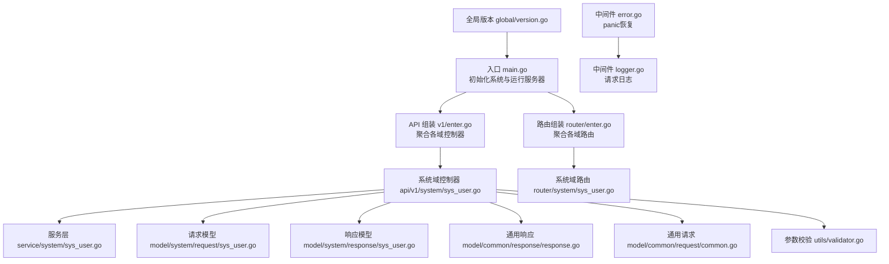
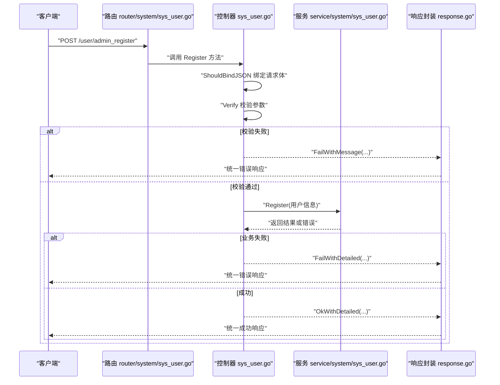
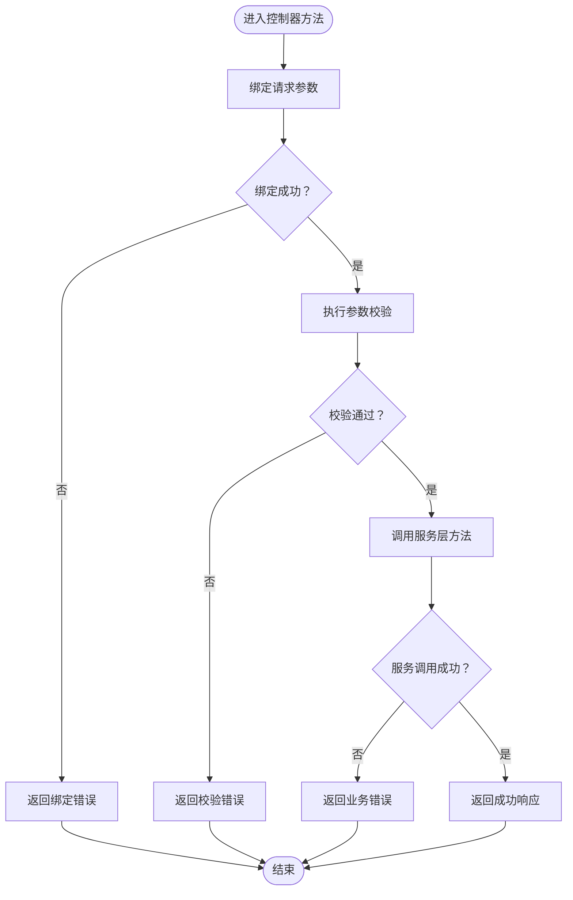
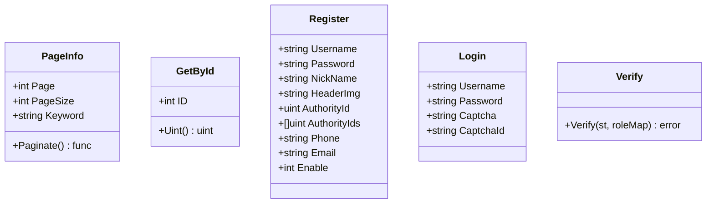
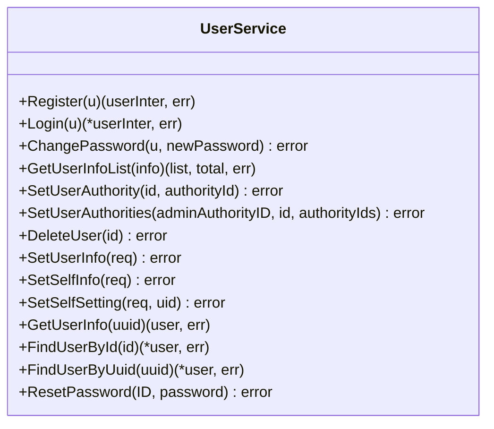
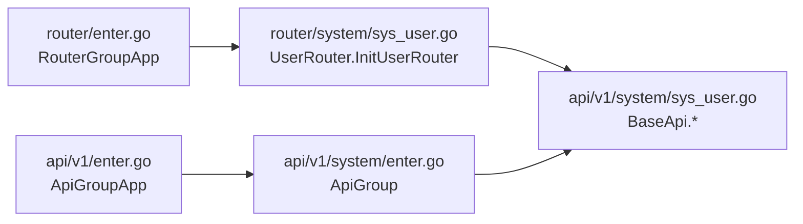
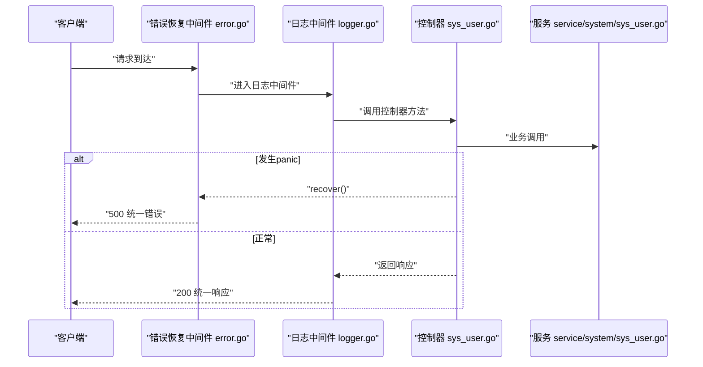
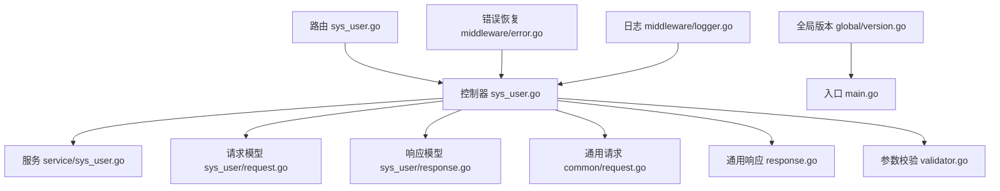

# API控制器设计

<cite>
**本文引用的文件**
- [server/main.go](file://server/main.go)
- [server/api/v1/enter.go](file://server/api/v1/enter.go)
- [server/api/v1/system/enter.go](file://server/api/v1/system/enter.go)
- [server/api/v1/system/sys_user.go](file://server/api/v1/system/sys_user.go)
- [server/router/enter.go](file://server/router/enter.go)
- [server/router/system/sys_user.go](file://server/router/system/sys_user.go)
- [server/model/common/response/response.go](file://server/model/common/response/response.go)
- [server/model/common/request/common.go](file://server/model/common/request/common.go)
- [server/model/system/request/sys_user.go](file://server/model/system/request/sys_user.go)
- [server/model/system/response/sys_user.go](file://server/model/system/response/sys_user.go)
- [server/service/system/sys_user.go](file://server/service/system/sys_user.go)
- [server/middleware/error.go](file://server/middleware/error.go)
- [server/middleware/logger.go](file://server/middleware/logger.go)
- [server/utils/validator.go](file://server/utils/validator.go)
- [server/global/version.go](file://server/global/version.go)
</cite>

## 目录
1. [简介](#简介)
2. [项目结构](#项目结构)
3. [核心组件](#核心组件)
4. [架构总览](#架构总览)
5. [详细组件分析](#详细组件分析)
6. [依赖分析](#依赖分析)
7. [性能考虑](#性能考虑)
8. [故障排查指南](#故障排查指南)
9. [结论](#结论)
10. [附录](#附录)

## 简介
本文件面向API控制器设计，系统性阐述控制器层的职责边界、通用结构与最佳实践，涵盖请求参数接收、数据验证、业务调用、响应封装、错误处理、日志记录与性能优化。同时给出版本管理策略与向后兼容保障思路，并以用户管理模块为例展示典型控制器实现与常见业务场景。

## 项目结构
后端采用典型的“路由-控制器-服务-模型”分层，API控制器位于 api/v1 下，按功能域拆分为 system、example 等子包；路由在 router 下按域组织；响应统一由公共 response 包封装；请求参数与业务模型分别在 model 的 request/response 与 system 下定义；服务层在 service 下实现具体业务逻辑；中间件负责错误恢复与日志记录；全局版本常量在 global 下维护。



**图示来源**
- [server/main.go:30-52](file://server/main.go#L30-L52)
- [server/api/v1/enter.go:8-14](file://server/api/v1/enter.go#L8-L14)
- [server/api/v1/system/enter.go:5-31](file://server/api/v1/system/enter.go#L5-L31)
- [server/api/v1/system/sys_user.go:20-196](file://server/api/v1/system/sys_user.go#L20-L196)
- [server/router/enter.go:8-14](file://server/router/enter.go#L8-L14)
- [server/router/system/sys_user.go:10-28](file://server/router/system/sys_user.go#L10-L28)
- [server/model/common/response/response.go:9-63](file://server/model/common/response/response.go#L9-L63)
- [server/model/common/request/common.go:7-49](file://server/model/common/request/common.go#L7-L49)
- [server/model/system/request/sys_user.go:8-78](file://server/model/system/request/sys_user.go#L8-L78)
- [server/model/system/response/sys_user.go:7-16](file://server/model/system/response/sys_user.go#L7-L16)
- [server/service/system/sys_user.go:24-337](file://server/service/system/sys_user.go#L24-L337)
- [server/middleware/error.go:20-81](file://server/middleware/error.go#L20-L81)
- [server/middleware/logger.go:41-90](file://server/middleware/logger.go#L41-L90)
- [server/utils/validator.go:118-165](file://server/utils/validator.go#L118-L165)
- [server/global/version.go:5-13](file://server/global/version.go#L5-L13)

**章节来源**
- [server/main.go:30-52](file://server/main.go#L30-L52)
- [server/api/v1/enter.go:8-14](file://server/api/v1/enter.go#L8-L14)
- [server/router/enter.go:8-14](file://server/router/enter.go#L8-L14)
- [server/global/version.go:5-13](file://server/global/version.go#L5-L13)

## 核心组件
- 控制器层（API）：负责请求参数绑定、参数校验、调用服务层、封装响应与错误处理。
- 服务层（Service）：承载业务逻辑，处理数据访问与事务控制。
- 模型层（Model）：请求/响应模型与数据库实体分离，便于演进与复用。
- 中间件（Middleware）：统一错误恢复与日志记录。
- 响应封装（Response）：统一的响应结构与便捷方法。
- 参数校验（Validator）：基于标签规则的反射校验工具。
- 路由与API组（Router/ApiGroup）：按域组织路由与控制器入口。

**章节来源**
- [server/api/v1/system/sys_user.go:20-196](file://server/api/v1/system/sys_user.go#L20-L196)
- [server/service/system/sys_user.go:24-337](file://server/service/system/sys_user.go#L24-L337)
- [server/model/common/response/response.go:9-63](file://server/model/common/response/response.go#L9-L63)
- [server/utils/validator.go:118-165](file://server/utils/validator.go#L118-L165)
- [server/router/system/sys_user.go:10-28](file://server/router/system/sys_user.go#L10-L28)
- [server/api/v1/system/enter.go:5-31](file://server/api/v1/system/enter.go#L5-L31)

## 架构总览
控制器层作为HTTP请求的门面，职责清晰：
- 请求参数接收：使用 ShouldBindJSON/ShouldBind 等绑定请求体与查询参数。
- 数据验证：先绑定再校验，支持内置规则与自定义规则。
- 业务调用：调用对应服务层方法，必要时开启事务。
- 响应封装：统一使用响应封装工具输出标准格式。
- 错误处理：捕获panic并记录日志，对非法输入与业务异常进行友好提示。



**图示来源**
- [server/router/system/sys_user.go:14](file://server/router/system/sys_user.go#L14)
- [server/api/v1/system/sys_user.go:170-196](file://server/api/v1/system/sys_user.go#L170-L196)
- [server/service/system/sys_user.go:28-38](file://server/service/system/sys_user.go#L28-L38)
- [server/model/common/response/response.go:20-62](file://server/model/common/response/response.go#L20-L62)

## 详细组件分析

### 控制器通用结构与职责
- 请求参数接收：使用 ShouldBindJSON/ShouldBind，确保参数绑定失败时立即返回错误。
- 数据验证：先绑定后校验，利用内置规则（如非空、长度范围、正则）与自定义规则。
- 业务调用：调用服务层方法，必要时开启事务，避免脏读与不一致。
- 响应封装：根据成功/失败场景选择 Ok*/Fail* 方法，保持前后端契约稳定。
- 错误处理：对业务异常与panic进行统一处理，记录日志并返回标准错误响应。



**图示来源**
- [server/api/v1/system/sys_user.go:28-38](file://server/api/v1/system/sys_user.go#L28-L38)
- [server/utils/validator.go:118-165](file://server/utils/validator.go#L118-L165)
- [server/service/system/sys_user.go:28-38](file://server/service/system/sys_user.go#L28-L38)
- [server/model/common/response/response.go:20-62](file://server/model/common/response/response.go#L20-L62)

**章节来源**
- [server/api/v1/system/sys_user.go:28-38](file://server/api/v1/system/sys_user.go#L28-L38)
- [server/utils/validator.go:118-165](file://server/utils/validator.go#L118-L165)
- [server/model/common/response/response.go:20-62](file://server/model/common/response/response.go#L20-L62)

### 响应模型设计
- 统一响应结构包含状态码、数据体与消息，便于前端统一处理。
- 成功/失败/未授权等常用场景提供便捷方法，减少重复代码。
- 响应常量统一管理，确保前后端一致性。

```mermaid
classDiagram
class Response {
+int Code
+interface{} Data
+string Msg
}
class ResponseMethods {
+Result(code, data, msg, c)
+Ok(c)
+OkWithMessage(message, c)
+OkWithData(data, c)
+OkWithDetailed(data, message, c)
+Fail(c)
+FailWithMessage(message, c)
+FailWithDetailed(data, message, c)
+NoAuth(message, c)
}
ResponseMethods --> Response : "封装"
```

**图示来源**
- [server/model/common/response/response.go:9-63](file://server/model/common/response/response.go#L9-L63)

**章节来源**
- [server/model/common/response/response.go:9-63](file://server/model/common/response/response.go#L9-L63)

### 参数模型与校验
- 通用请求模型：分页、ID、批量ID等通用结构，支持GORM分页函数。
- 业务请求模型：针对具体业务的参数结构，如登录、注册、修改密码等。
- 校验规则：支持非空、长度/数值范围、正则匹配等，可扩展自定义规则。



**图示来源**
- [server/model/common/request/common.go:7-49](file://server/model/common/request/common.go#L7-L49)
- [server/model/system/request/sys_user.go:8-78](file://server/model/system/request/sys_user.go#L8-L78)
- [server/utils/validator.go:118-165](file://server/utils/validator.go#L118-L165)

**章节来源**
- [server/model/common/request/common.go:7-49](file://server/model/common/request/common.go#L7-L49)
- [server/model/system/request/sys_user.go:8-78](file://server/model/system/request/sys_user.go#L8-L78)
- [server/utils/validator.go:118-165](file://server/utils/validator.go#L118-L165)

### 服务层与事务
- 服务层承担业务逻辑，如用户注册、登录、密码修改、列表查询、权限设置、删除用户等。
- 对于需要强一致性的操作（如权限批量更新、用户删除），使用事务包裹，保证原子性。
- 服务层与控制器解耦，便于单元测试与复用。



**图示来源**
- [server/service/system/sys_user.go:24-337](file://server/service/system/sys_user.go#L24-L337)

**章节来源**
- [server/service/system/sys_user.go:24-337](file://server/service/system/sys_user.go#L24-L337)

### 路由与API组
- 路由按域组织，每个域提供路由入口，控制器方法挂载到路由组。
- API组聚合各域控制器，形成统一入口，便于集中管理与扩展。



**图示来源**
- [server/router/enter.go:8-14](file://server/router/enter.go#L8-L14)
- [server/router/system/sys_user.go:10-28](file://server/router/system/sys_user.go#L10-L28)
- [server/api/v1/enter.go:8-14](file://server/api/v1/enter.go#L8-L14)
- [server/api/v1/system/enter.go:5-31](file://server/api/v1/system/enter.go#L5-L31)

**章节来源**
- [server/router/enter.go:8-14](file://server/router/enter.go#L8-L14)
- [server/router/system/sys_user.go:10-28](file://server/router/system/sys_user.go#L10-L28)
- [server/api/v1/enter.go:8-14](file://server/api/v1/enter.go#L8-L14)
- [server/api/v1/system/enter.go:5-31](file://server/api/v1/system/enter.go#L5-L31)

### 错误处理与日志
- 错误恢复中间件：捕获panic，区分“断开连接”与普通异常，记录请求上下文与堆栈，返回统一错误。
- 日志中间件：记录请求路径、查询参数、请求体、耗时、错误等，支持过滤与脱敏。
- 控制器内错误：使用响应封装方法返回业务错误，避免泄露内部细节。



**图示来源**
- [server/middleware/error.go:20-81](file://server/middleware/error.go#L20-L81)
- [server/middleware/logger.go:41-90](file://server/middleware/logger.go#L41-L90)
- [server/api/v1/system/sys_user.go:170-196](file://server/api/v1/system/sys_user.go#L170-L196)
- [server/service/system/sys_user.go:28-38](file://server/service/system/sys_user.go#L28-L38)

**章节来源**
- [server/middleware/error.go:20-81](file://server/middleware/error.go#L20-L81)
- [server/middleware/logger.go:41-90](file://server/middleware/logger.go#L41-L90)

### API版本管理与向后兼容
- 版本常量：当前版本在全局常量中维护，便于统一升级与追踪。
- 版本策略建议：
  - 语义化版本：主版本号变更表示破坏性改动；次版本号变更表示新增功能且兼容；修订号变更表示修复。
  - 路由前缀：通过 v1/v2 等前缀隔离不同版本，新功能优先在新版本推出。
  - 文档同步：Swagger/OpenAPI 随版本更新，标注废弃字段与迁移指引。
  - 降级与兼容：旧版本接口保留过渡期，提供明确的弃用时间线与替代方案。
- 本仓库版本信息参考：[server/global/version.go:5-13](file://server/global/version.go#L5-L13)

**章节来源**
- [server/global/version.go:5-13](file://server/global/version.go#L5-L13)

### 典型控制器实现示例
- 用户注册：接收JSON参数 -> 绑定与校验 -> 调用服务注册 -> 成功返回用户信息，失败返回错误。
- 登录流程：接收登录参数 -> 校验验证码/安全策略 -> 调用服务登录 -> 生成令牌 -> 返回用户、token与过期时间。
- 修改密码：接收参数 -> 校验原密码 -> 更新密码 -> 返回成功。
- 分页列表：接收分页参数 -> 校验分页信息 -> 查询列表与总数 -> 返回分页结果。
- 设置权限：接收权限参数 -> 校验权限有效性 -> 批量更新 -> 返回成功。
- 删除用户：接收ID -> 校验自身不可删除 -> 删除用户与关联权限 -> 返回成功。

以上流程均遵循“绑定-校验-调用-封装”的统一模式，详见以下文件路径：
- [server/api/v1/system/sys_user.go:170-196](file://server/api/v1/system/sys_user.go#L170-L196)
- [server/api/v1/system/sys_user.go:28-99](file://server/api/v1/system/sys_user.go#L28-L99)
- [server/api/v1/system/sys_user.go:206-227](file://server/api/v1/system/sys_user.go#L206-L227)
- [server/api/v1/system/sys_user.go:238-262](file://server/api/v1/system/sys_user.go#L238-L262)
- [server/api/v1/system/sys_user.go:273-303](file://server/api/v1/system/sys_user.go#L273-L303)
- [server/api/v1/system/sys_user.go:340-364](file://server/api/v1/system/sys_user.go#L340-L364)

**章节来源**
- [server/api/v1/system/sys_user.go:28-99](file://server/api/v1/system/sys_user.go#L28-L99)
- [server/api/v1/system/sys_user.go:170-196](file://server/api/v1/system/sys_user.go#L170-L196)
- [server/api/v1/system/sys_user.go:206-227](file://server/api/v1/system/sys_user.go#L206-L227)
- [server/api/v1/system/sys_user.go:238-262](file://server/api/v1/system/sys_user.go#L238-L262)
- [server/api/v1/system/sys_user.go:273-303](file://server/api/v1/system/sys_user.go#L273-L303)
- [server/api/v1/system/sys_user.go:340-364](file://server/api/v1/system/sys_user.go#L340-L364)

## 依赖分析
- 控制器依赖：依赖服务层、请求/响应模型、通用响应封装与参数校验工具。
- 路由依赖：依赖控制器方法指针，按组挂载。
- 中间件依赖：依赖日志与错误恢复，贯穿请求生命周期。
- 全局依赖：版本常量、配置、日志、数据库连接等。



**图示来源**
- [server/api/v1/system/sys_user.go:20-196](file://server/api/v1/system/sys_user.go#L20-L196)
- [server/service/system/sys_user.go:24-337](file://server/service/system/sys_user.go#L24-L337)
- [server/model/system/request/sys_user.go:8-78](file://server/model/system/request/sys_user.go#L8-L78)
- [server/model/system/response/sys_user.go:7-16](file://server/model/system/response/sys_user.go#L7-L16)
- [server/model/common/request/common.go:7-49](file://server/model/common/request/common.go#L7-L49)
- [server/model/common/response/response.go:9-63](file://server/model/common/response/response.go#L9-L63)
- [server/utils/validator.go:118-165](file://server/utils/validator.go#L118-L165)
- [server/router/system/sys_user.go:10-28](file://server/router/system/sys_user.go#L10-L28)
- [server/middleware/error.go:20-81](file://server/middleware/error.go#L20-L81)
- [server/middleware/logger.go:41-90](file://server/middleware/logger.go#L41-L90)
- [server/global/version.go:5-13](file://server/global/version.go#L5-L13)
- [server/main.go:30-52](file://server/main.go#L30-L52)

**章节来源**
- [server/api/v1/system/sys_user.go:20-196](file://server/api/v1/system/sys_user.go#L20-L196)
- [server/router/system/sys_user.go:10-28](file://server/router/system/sys_user.go#L10-L28)
- [server/middleware/error.go:20-81](file://server/middleware/error.go#L20-L81)
- [server/middleware/logger.go:41-90](file://server/middleware/logger.go#L41-L90)
- [server/global/version.go:5-13](file://server/global/version.go#L5-L13)
- [server/main.go:30-52](file://server/main.go#L30-L52)

## 性能考虑
- 参数绑定与校验：尽量在控制器层尽早失败，减少无效调用。
- 分页查询：限制最大页大小，避免超大offset导致慢查询；合理使用索引与预加载。
- 事务使用：仅在必要时开启事务，避免长事务占用资源。
- 日志与错误：生产环境避免输出敏感信息；对高频错误进行限流或熔断。
- 缓存与并发：对热点数据使用缓存；注意并发安全与锁粒度。

## 故障排查指南
- 统一错误恢复：检查错误恢复中间件日志，定位panic原因与请求上下文。
- 请求日志：通过日志中间件查看请求路径、参数、耗时与错误，辅助定位问题。
- 响应一致性：确认控制器使用统一响应封装方法，避免混用原生 JSON。
- 参数校验：核对请求体与查询参数是否符合模型定义与校验规则。
- 服务层事务：对于批量更新/删除失败，检查事务回滚与错误传播。

**章节来源**
- [server/middleware/error.go:20-81](file://server/middleware/error.go#L20-L81)
- [server/middleware/logger.go:41-90](file://server/middleware/logger.go#L41-L90)
- [server/model/common/response/response.go:20-62](file://server/model/common/response/response.go#L20-L62)
- [server/utils/validator.go:118-165](file://server/utils/validator.go#L118-L165)

## 结论
本项目通过清晰的分层与统一的响应封装，实现了可控、可维护、可扩展的API控制器设计。建议在后续迭代中持续完善版本管理策略、增强可观测性与性能监控，并在控制器层坚持“早失败、少依赖、易测试”的原则，以提升整体质量与交付效率。

## 附录
- 入口与初始化：[server/main.go:30-52](file://server/main.go#L30-L52)
- API组入口：[server/api/v1/enter.go:8-14](file://server/api/v1/enter.go#L8-L14)
- 系统域控制器入口：[server/api/v1/system/enter.go:5-31](file://server/api/v1/system/enter.go#L5-L31)
- 路由入口：[server/router/enter.go:8-14](file://server/router/enter.go#L8-L14)
- 全局版本：[server/global/version.go:5-13](file://server/global/version.go#L5-L13)