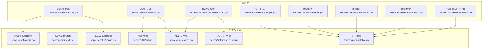
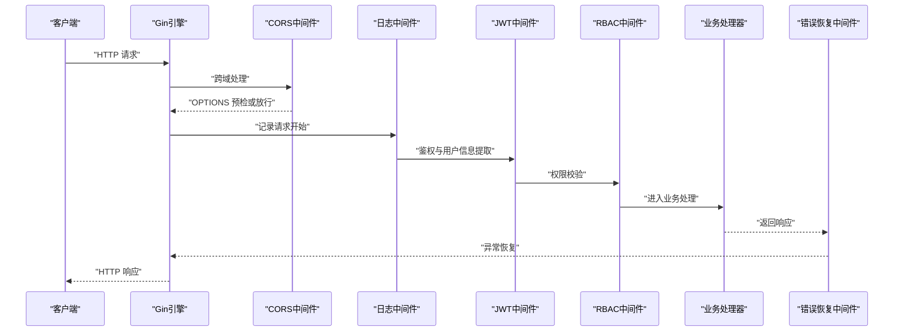
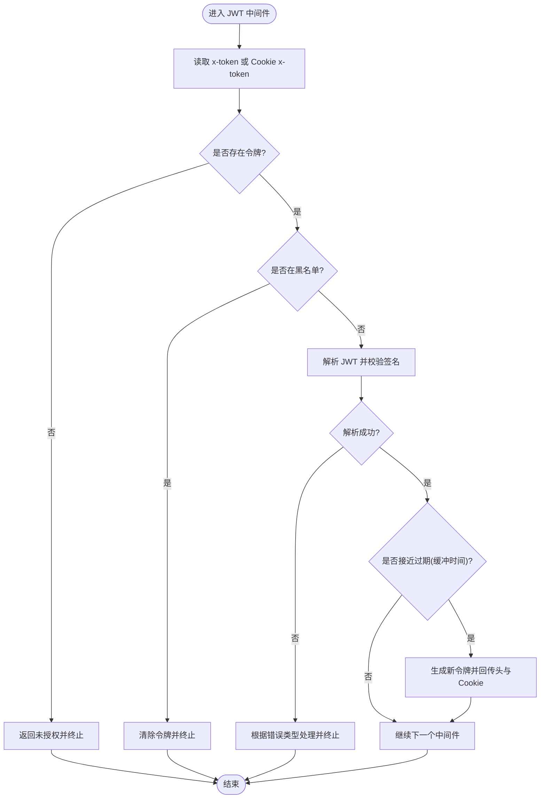
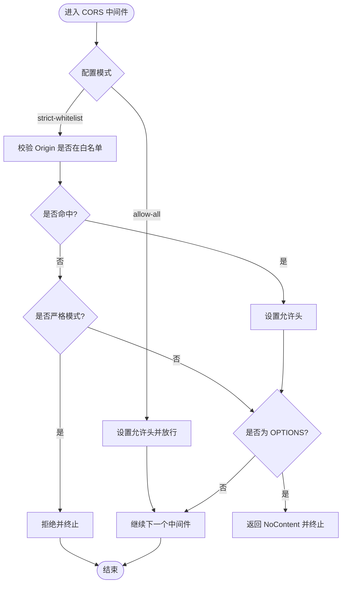
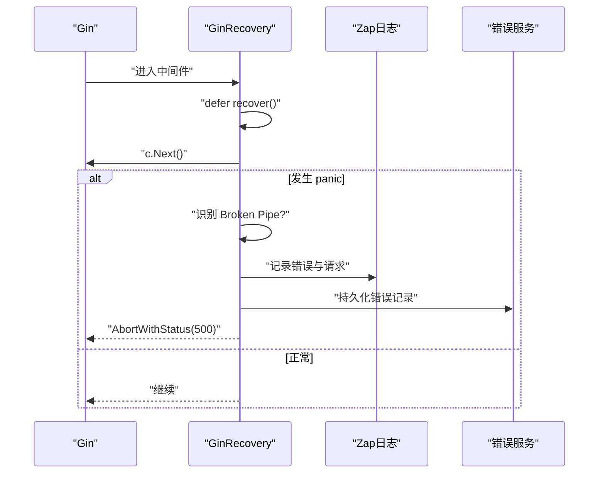
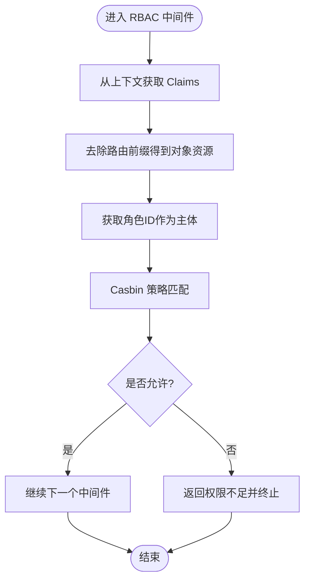
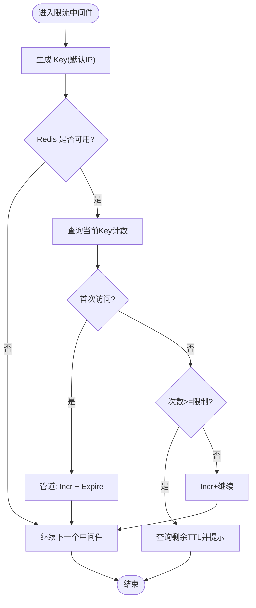
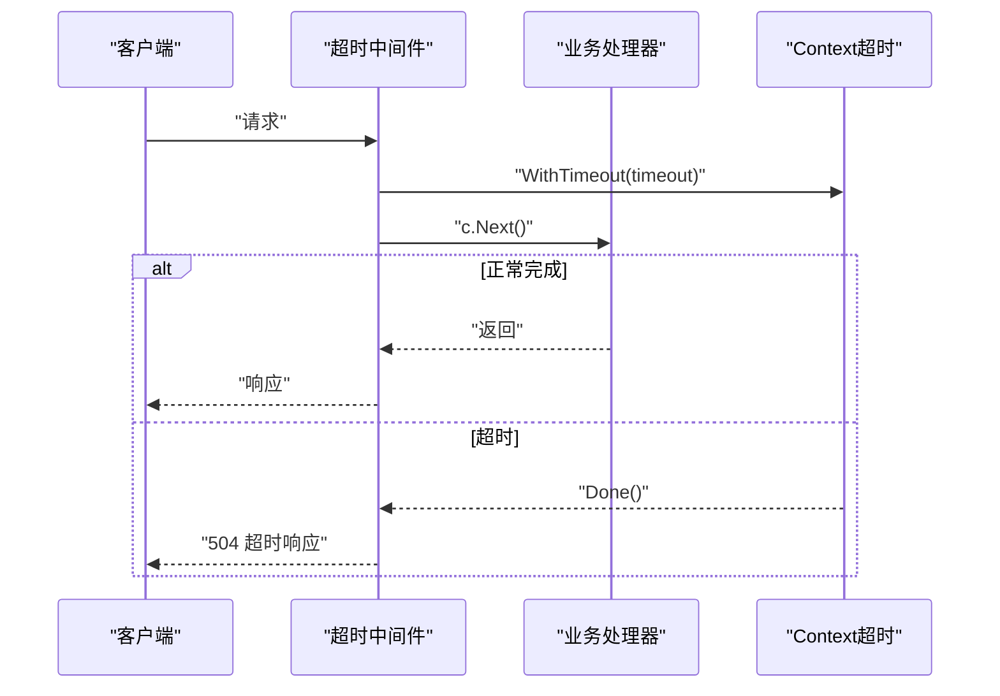
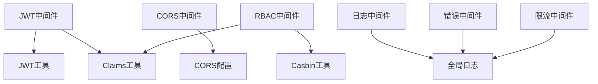

# 中间件系统

<cite>
**本文引用的文件**
- [server/middleware/jwt.go](file://server/middleware/jwt.go)
- [server/middleware/cors.go](file://server/middleware/cors.go)
- [server/middleware/logger.go](file://server/middleware/logger.go)
- [server/middleware/error.go](file://server/middleware/error.go)
- [server/middleware/casbin_rbac.go](file://server/middleware/casbin_rbac.go)
- [server/middleware/limit_ip.go](file://server/middleware/limit_ip.go)
- [server/middleware/timeout.go](file://server/middleware/timeout.go)
- [server/middleware/loadtls.go](file://server/middleware/loadtls.go)
- [server/config/cors.go](file://server/config/cors.go)
- [server/config/jwt.go](file://server/config/jwt.go)
- [server/config/config.go](file://server/config/config.go)
- [server/utils/jwt.go](file://server/utils/jwt.go)
- [server/utils/claims.go](file://server/utils/claims.go)
- [server/utils/casbin_util.go](file://server/utils/casbin_util.go)
- [server/global/global.go](file://server/global/global.go)
</cite>

## 目录
1. [简介](#简介)
2. [项目结构](#项目结构)
3. [核心组件](#核心组件)
4. [架构总览](#架构总览)
5. [详细组件分析](#详细组件分析)
6. [依赖分析](#依赖分析)
7. [性能考虑](#性能考虑)
8. [故障排查指南](#故障排查指南)
9. [结论](#结论)
10. [附录](#附录)

## 简介
本文件系统性梳理测试管理平台的中间件体系，重点覆盖以下方面：
- Gin 中间件链的构建与执行顺序
- JWT 认证中间件：令牌解析、用户信息提取、权限刷新与黑名单校验
- CORS 跨域中间件：预检请求处理、响应头设置与白名单策略
- 请求日志中间件：日志格式、关键字脱敏、鉴权上下文注入与输出
- 错误处理中间件：panic 恢复、Broken Pipe 识别、错误记录与统一响应
- RBAC 权限控制中间件：基于 Casbin 的策略匹配与路由前缀处理
- 中间件开发最佳实践与性能优化建议

## 项目结构
中间件集中位于 server/middleware 目录，围绕 Gin 的中间件链进行组织；相关配置位于 server/config，通用工具位于 server/utils，全局状态位于 server/global。



图表来源
- [server/middleware/jwt.go:1-90](file://server/middleware/jwt.go#L1-L90)
- [server/middleware/cors.go:1-74](file://server/middleware/cors.go#L1-L74)
- [server/middleware/logger.go:1-90](file://server/middleware/logger.go#L1-L90)
- [server/middleware/error.go:1-81](file://server/middleware/error.go#L1-L81)
- [server/middleware/casbin_rbac.go:1-33](file://server/middleware/casbin_rbac.go#L1-L33)
- [server/middleware/limit_ip.go:1-93](file://server/middleware/limit_ip.go#L1-L93)
- [server/middleware/timeout.go:1-56](file://server/middleware/timeout.go#L1-L56)
- [server/middleware/loadtls.go:1-28](file://server/middleware/loadtls.go#L1-L28)
- [server/config/cors.go:1-15](file://server/config/cors.go#L1-L15)
- [server/config/jwt.go:1-9](file://server/config/jwt.go#L1-L9)
- [server/config/config.go:1-41](file://server/config/config.go#L1-L41)
- [server/utils/jwt.go:1-106](file://server/utils/jwt.go#L1-L106)
- [server/utils/claims.go:1-149](file://server/utils/claims.go#L1-L149)
- [server/utils/casbin_util.go:1-53](file://server/utils/casbin_util.go#L1-L53)
- [server/global/global.go:1-69](file://server/global/global.go#L1-L69)

章节来源
- [server/middleware/jwt.go:1-90](file://server/middleware/jwt.go#L1-L90)
- [server/middleware/cors.go:1-74](file://server/middleware/cors.go#L1-L74)
- [server/middleware/logger.go:1-90](file://server/middleware/logger.go#L1-L90)
- [server/middleware/error.go:1-81](file://server/middleware/error.go#L1-L81)
- [server/middleware/casbin_rbac.go:1-33](file://server/middleware/casbin_rbac.go#L1-L33)
- [server/middleware/limit_ip.go:1-93](file://server/middleware/limit_ip.go#L1-L93)
- [server/middleware/timeout.go:1-56](file://server/middleware/timeout.go#L1-L56)
- [server/middleware/loadtls.go:1-28](file://server/middleware/loadtls.go#L1-L28)
- [server/config/cors.go:1-15](file://server/config/cors.go#L1-L15)
- [server/config/jwt.go:1-9](file://server/config/jwt.go#L1-L9)
- [server/config/config.go:1-41](file://server/config/config.go#L1-L41)
- [server/utils/jwt.go:1-106](file://server/utils/jwt.go#L1-L106)
- [server/utils/claims.go:1-149](file://server/utils/claims.go#L1-L149)
- [server/utils/casbin_util.go:1-53](file://server/utils/casbin_util.go#L1-L53)
- [server/global/global.go:1-69](file://server/global/global.go#L1-L69)

## 核心组件
- JWT 认证中间件：负责令牌解析、黑名单校验、过期缓冲刷新、新令牌与过期头回传、Redis 多端登录记录
- CORS 跨域中间件：支持宽松放行与严格白名单两种模式，自动处理 OPTIONS 预检与凭证头
- 请求日志中间件：统一日志结构体、可插拔过滤与脱敏、鉴权上下文注入、标准 JSON 输出
- 错误处理中间件：recover panic、识别 Broken Pipe、记录请求与堆栈、持久化错误记录
- RBAC 权限中间件：基于 Casbin 的策略匹配，按路由前缀裁剪对象资源
- IP 限流中间件：基于 Redis 的滑动窗口计数，支持自定义 Key 生成与检查逻辑
- 超时中间件：基于 Context 超时控制，避免 goroutine 泄漏，超时返回统一格式
- TLS 强制 HTTPS 中间件：通过 secure 库重定向至 HTTPS

章节来源
- [server/middleware/jwt.go:16-78](file://server/middleware/jwt.go#L16-L78)
- [server/middleware/cors.go:10-63](file://server/middleware/cors.go#L10-L63)
- [server/middleware/logger.go:14-89](file://server/middleware/logger.go#L14-L89)
- [server/middleware/error.go:20-80](file://server/middleware/error.go#L20-L80)
- [server/middleware/casbin_rbac.go:12-32](file://server/middleware/casbin_rbac.go#L12-L32)
- [server/middleware/limit_ip.go:16-62](file://server/middleware/limit_ip.go#L16-L62)
- [server/middleware/timeout.go:10-55](file://server/middleware/timeout.go#L10-L55)
- [server/middleware/loadtls.go:10-27](file://server/middleware/loadtls.go#L10-L27)

## 架构总览
下图展示中间件在请求生命周期中的调用顺序与职责分工，以及与配置、工具和全局状态的交互。



图表来源
- [server/middleware/cors.go:11-27](file://server/middleware/cors.go#L11-L27)
- [server/middleware/logger.go:41-78](file://server/middleware/logger.go#L41-L78)
- [server/middleware/jwt.go:16-78](file://server/middleware/jwt.go#L16-L78)
- [server/middleware/casbin_rbac.go:13-32](file://server/middleware/casbin_rbac.go#L13-L32)
- [server/middleware/error.go:21-80](file://server/middleware/error.go#L21-L80)

## 详细组件分析

### JWT 认证中间件
- 令牌来源：优先从请求头 x-token 获取；若为空则从 Cookie x-token 解析并回写
- 黑名单校验：若命中黑名单，清除令牌并终止请求
- 令牌解析：使用 HS256 签名与配置的签发者、过期时间、缓冲时间进行校验
- 过期缓冲刷新：当剩余有效期小于缓冲时间时，生成新令牌并回传新令牌与过期时间，同时更新 Cookie 与 Redis（多端登录）
- 上下文注入：将解析后的 Claims 写入上下文，供后续中间件与业务使用



图表来源
- [server/middleware/jwt.go:16-78](file://server/middleware/jwt.go#L16-L78)
- [server/utils/claims.go:42-65](file://server/utils/claims.go#L42-L65)
- [server/utils/jwt.go:62-88](file://server/utils/jwt.go#L62-L88)

章节来源
- [server/middleware/jwt.go:16-78](file://server/middleware/jwt.go#L16-L78)
- [server/utils/claims.go:42-65](file://server/utils/claims.go#L42-L65)
- [server/utils/jwt.go:62-88](file://server/utils/jwt.go#L62-L88)

### CORS 跨域中间件
- 宽松放行模式：对任意 Origin 返回允许头，放行所有 OPTIONS
- 白名单模式：按配置逐条匹配 Origin，仅在匹配成功时设置允许头；严格模式下未匹配直接拒绝
- 预检处理：对 OPTIONS 方法直接返回 NoContent，避免重复处理业务
- 凭证支持：可按需设置 Allow-Credentials



图表来源
- [server/middleware/cors.go:10-63](file://server/middleware/cors.go#L10-L63)
- [server/config/cors.go:3-14](file://server/config/cors.go#L3-L14)
- [server/config/config.go:35-36](file://server/config/config.go#L35-L36)

章节来源
- [server/middleware/cors.go:10-63](file://server/middleware/cors.go#L10-L63)
- [server/config/cors.go:3-14](file://server/config/cors.go#L3-L14)
- [server/config/config.go:35-36](file://server/config/config.go#L35-L36)

### 请求日志中间件
- 结构化日志：包含时间、路径、查询、Body、IP、UA、错误、耗时、来源等字段
- 可插拔扩展：支持自定义过滤器、关键字脱敏、鉴权上下文注入
- 输出方式：默认 JSON 标准输出，便于容器日志采集

```mermaid
classDiagram
class LogLayout {
+Time time.Time
+Metadata map[string]interface{}
+Path string
+Query string
+Body string
+IP string
+UserAgent string
+Error string
+Cost time.Duration
+Source string
}
class Logger {
+Filter func(*gin.Context) bool
+FilterKeyword func(*LogLayout) bool
+AuthProcess func(*gin.Context, *LogLayout)
+Print func(LogLayout)
+Source string
+SetLoggerMiddleware() gin.HandlerFunc
}
Logger --> LogLayout : "构造并输出"
```

图表来源
- [server/middleware/logger.go:14-89](file://server/middleware/logger.go#L14-L89)

章节来源
- [server/middleware/logger.go:14-89](file://server/middleware/logger.go#L14-L89)

### 错误处理中间件
- panic 恢复：recover 捕获异常，区分 Broken Pipe 与普通异常
- 请求转储：DumpRequest 用于记录请求上下文
- 错误持久化：将错误信息与来源写入系统错误表
- 统一响应：对非 Broken Pipe 场景返回 500



图表来源
- [server/middleware/error.go:20-80](file://server/middleware/error.go#L20-L80)

章节来源
- [server/middleware/error.go:20-80](file://server/middleware/error.go#L20-L80)

### RBAC 权限控制中间件
- 资源裁剪：去除路由前缀，得到对象资源
- 策略匹配：使用 Casbin Enforce(sub, obj, act)，其中 sub 为角色 ID，obj 为资源，act 为动作
- 拒绝处理：不满足策略时返回权限不足并终止



图表来源
- [server/middleware/casbin_rbac.go:12-32](file://server/middleware/casbin_rbac.go#L12-L32)
- [server/utils/casbin_util.go:18-52](file://server/utils/casbin_util.go#L18-L52)
- [server/utils/claims.go:57-107](file://server/utils/claims.go#L57-L107)

章节来源
- [server/middleware/casbin_rbac.go:12-32](file://server/middleware/casbin_rbac.go#L12-L32)
- [server/utils/casbin_util.go:18-52](file://server/utils/casbin_util.go#L18-L52)
- [server/utils/claims.go:57-107](file://server/utils/claims.go#L57-L107)

### IP 限流中间件
- Key 生成：默认按客户端 IP 生成 Key
- 检查逻辑：基于 Redis Exists/Incr/Expire 实现滑动窗口计数
- 配额控制：超过限制时返回友好提示，包含剩余 TTL



图表来源
- [server/middleware/limit_ip.go:27-62](file://server/middleware/limit_ip.go#L27-L62)
- [server/middleware/limit_ip.go:64-92](file://server/middleware/limit_ip.go#L64-L92)

章节来源
- [server/middleware/limit_ip.go:27-62](file://server/middleware/limit_ip.go#L27-L62)
- [server/middleware/limit_ip.go:64-92](file://server/middleware/limit_ip.go#L64-L92)

### 超时中间件
- 超时控制：基于 Context.WithTimeout，防止下游阻塞
- 泄漏防护：使用 buffered channel 与 defer cancel，避免 goroutine 泄漏
- 统一超时响应：超时返回 504 与统一 JSON



图表来源
- [server/middleware/timeout.go:10-55](file://server/middleware/timeout.go#L10-L55)

章节来源
- [server/middleware/timeout.go:10-55](file://server/middleware/timeout.go#L10-L55)

### TLS 强制 HTTPS 中间件
- 通过 secure 库启用 SSL 重定向与主机配置
- 出错时打印并终止后续处理

章节来源
- [server/middleware/loadtls.go:10-27](file://server/middleware/loadtls.go#L10-L27)

## 依赖分析
- 中间件与配置：CORS 中间件依赖配置结构体；JWT 中间件依赖 JWT 配置与全局 Redis
- 中间件与工具：JWT/Claims/Casbin 工具提供令牌生成、解析与权限校验能力
- 中间件与全局：日志中间件依赖全局日志；错误中间件依赖全局日志与错误服务；限流中间件依赖全局 Redis



图表来源
- [server/middleware/jwt.go:16-78](file://server/middleware/jwt.go#L16-L78)
- [server/middleware/cors.go:10-63](file://server/middleware/cors.go#L10-L63)
- [server/middleware/casbin_rbac.go:12-32](file://server/middleware/casbin_rbac.go#L12-L32)
- [server/middleware/logger.go:41-78](file://server/middleware/logger.go#L41-L78)
- [server/middleware/error.go:21-80](file://server/middleware/error.go#L21-L80)
- [server/middleware/limit_ip.go:27-62](file://server/middleware/limit_ip.go#L27-L62)
- [server/utils/jwt.go:26-88](file://server/utils/jwt.go#L26-L88)
- [server/utils/claims.go:42-107](file://server/utils/claims.go#L42-L107)
- [server/utils/casbin_util.go:18-52](file://server/utils/casbin_util.go#L18-L52)
- [server/global/global.go:25-42](file://server/global/global.go#L25-L42)

章节来源
- [server/middleware/jwt.go:16-78](file://server/middleware/jwt.go#L16-L78)
- [server/middleware/cors.go:10-63](file://server/middleware/cors.go#L10-L63)
- [server/middleware/casbin_rbac.go:12-32](file://server/middleware/casbin_rbac.go#L12-L32)
- [server/middleware/logger.go:41-78](file://server/middleware/logger.go#L41-L78)
- [server/middleware/error.go:21-80](file://server/middleware/error.go#L21-L80)
- [server/middleware/limit_ip.go:27-62](file://server/middleware/limit_ip.go#L27-L62)
- [server/utils/jwt.go:26-88](file://server/utils/jwt.go#L26-L88)
- [server/utils/claims.go:42-107](file://server/utils/claims.go#L42-L107)
- [server/utils/casbin_util.go:18-52](file://server/utils/casbin_util.go#L18-L52)
- [server/global/global.go:25-42](file://server/global/global.go#L25-L42)

## 性能考虑
- JWT 刷新与并发：使用单飞机制避免并发刷新导致的令牌风暴
- 缓冲过期刷新：合理设置缓冲时间，减少频繁刷新带来的开销
- Redis 限流：使用管道命令减少 RTT；注意 Key 过期策略与内存占用
- 日志输出：默认 JSON 输出利于采集，但需控制 Body 字段大小与脱敏成本
- RBAC 匹配：Casbin 策略缓存与模型字符串加载仅初始化一次，避免重复开销
- 超时控制：为下游服务设置合理超时，避免长时间阻塞

## 故障排查指南
- JWT 未登录/非法访问：检查请求头 x-token 或 Cookie x-token 是否正确传递
- JWT 已过期：确认缓冲时间配置与前端刷新策略；查看新令牌头与过期头
- CORS 跨域失败：核对白名单配置与严格模式；确认预检请求是否返回 NoContent
- RBAC 权限不足：检查角色 ID、对象资源（去除前缀）与动作是否匹配
- 限流频繁：调整限制次数与过期时间；确认 Redis 是否正常
- 超时 504：检查下游处理耗时与超时阈值；确保 Context 超时设置合理
- Panic 500：查看日志与错误服务记录，定位异常堆栈

章节来源
- [server/middleware/jwt.go:16-78](file://server/middleware/jwt.go#L16-L78)
- [server/middleware/cors.go:10-63](file://server/middleware/cors.go#L10-L63)
- [server/middleware/casbin_rbac.go:12-32](file://server/middleware/casbin_rbac.go#L12-L32)
- [server/middleware/limit_ip.go:27-62](file://server/middleware/limit_ip.go#L27-L62)
- [server/middleware/timeout.go:10-55](file://server/middleware/timeout.go#L10-L55)
- [server/middleware/error.go:20-80](file://server/middleware/error.go#L20-L80)

## 结论
本中间件体系以 Gin 中间件链为核心，结合配置、工具与全局状态，实现了从鉴权、跨域、日志、错误恢复到权限控制与限流、超时控制的完整闭环。通过模块化设计与可插拔扩展点，既保证了易用性，也为性能优化与运维监控提供了基础。

## 附录
- 中间件开发最佳实践
  - 明确中间件职责边界，避免在一个中间件中做过多事情
  - 使用上下文传递必要信息，避免全局状态污染
  - 对外部依赖（如 Redis、数据库）做好降级与错误处理
  - 控制日志体量，对敏感字段进行脱敏
  - 为关键路径设置超时，防止级联阻塞
  - 对热点资源使用缓存与单飞机制，降低并发风险