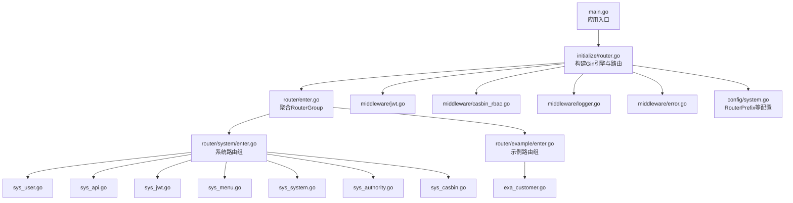
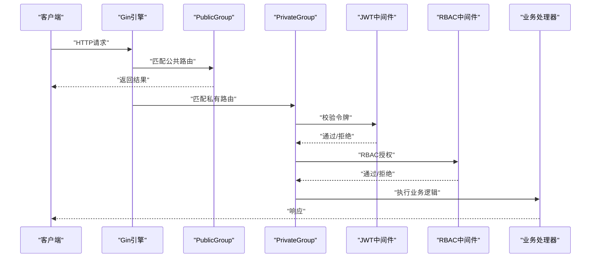
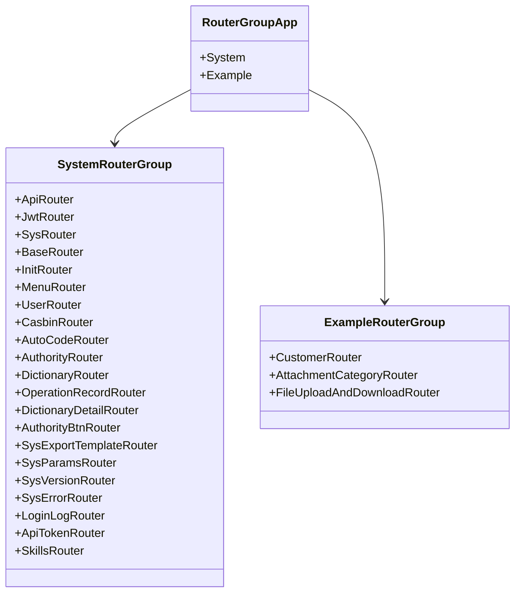
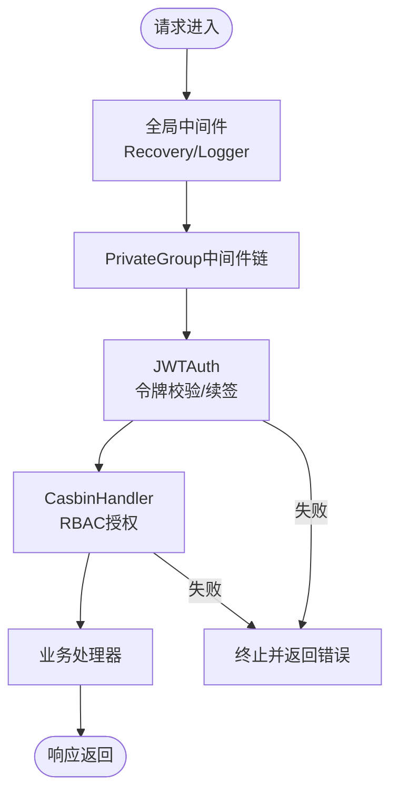
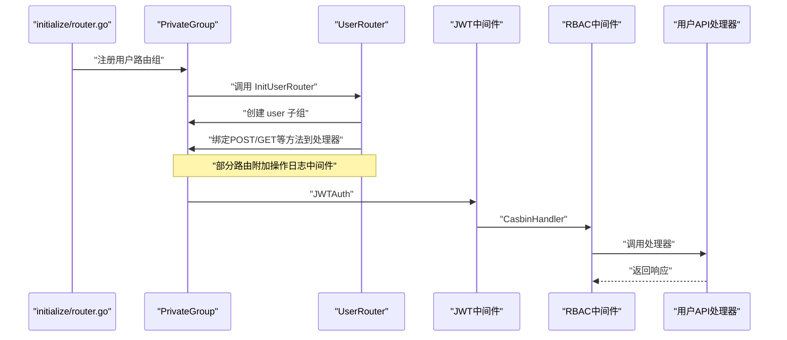
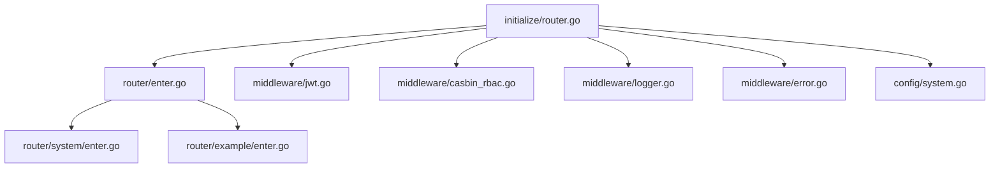

# 路由管理系统

<cite>
**本文引用的文件**
- [server/main.go](file://server/main.go)
- [server/initialize/router.go](file://server/initialize/router.go)
- [server/router/enter.go](file://server/router/enter.go)
- [server/router/system/enter.go](file://server/router/system/enter.go)
- [server/router/example/enter.go](file://server/router/example/enter.go)
- [server/router/system/sys_user.go](file://server/router/system/sys_user.go)
- [server/router/system/sys_api.go](file://server/router/system/sys_api.go)
- [server/router/system/sys_jwt.go](file://server/router/system/sys_jwt.go)
- [server/router/system/sys_menu.go](file://server/router/system/sys_menu.go)
- [server/router/system/sys_system.go](file://server/router/system/sys_system.go)
- [server/router/system/sys_authority.go](file://server/router/system/sys_authority.go)
- [server/router/system/sys_casbin.go](file://server/router/system/sys_casbin.go)
- [server/router/example/exa_customer.go](file://server/router/example/exa_customer.go)
- [server/middleware/jwt.go](file://server/middleware/jwt.go)
- [server/middleware/casbin_rbac.go](file://server/middleware/casbin_rbac.go)
- [server/middleware/logger.go](file://server/middleware/logger.go)
- [server/middleware/error.go](file://server/middleware/error.go)
- [server/config/system.go](file://server/config/system.go)
- [server/config/config.go](file://server/config/config.go)
</cite>

## 目录
1. [简介](#简介)
2. [项目结构](#项目结构)
3. [核心组件](#核心组件)
4. [架构总览](#架构总览)
5. [详细组件分析](#详细组件分析)
6. [依赖分析](#依赖分析)
7. [性能考虑](#性能考虑)
8. [故障排查指南](#故障排查指南)
9. [结论](#结论)
10. [附录](#附录)

## 简介
本文件系统性阐述基于 Gin 的路由管理系统，重点围绕以下主题展开：
- RouterGroup 设计模式与路由分组管理
- 系统路由与示例路由的组织结构（前缀、HTTP 方法映射、处理器绑定）
- 中间件应用方式与执行顺序（权限验证、日志记录等）
- 路由设计最佳实践（URL 命名规范、参数传递、错误处理）
- 典型路由配置示例与常见问题解决方案

## 项目结构
本项目采用“按功能域分层 + RouterGroup 组合”的组织方式：
- 入口与初始化：main.go 负责系统初始化；initialize/router.go 构建 Gin 引擎并注册路由组与中间件
- 路由聚合：router/enter.go 聚合 system 与 example 两套路由组
- 功能路由：router/system 与 router/example 下的各模块路由文件，分别负责系统功能与示例功能
- 中间件：middleware 目录下提供 JWT、RBAC、日志、异常恢复等中间件
- 配置：config/system.go 与 config/config.go 提供系统级路由前缀等配置项

图表来源
- [server/main.go:30-35](file://server/main.go#L30-L35)
- [server/initialize/router.go:36-117](file://server/initialize/router.go#L36-L117)
- [server/router/enter.go:8-13](file://server/router/enter.go#L8-L13)
- [server/router/system/enter.go:5-27](file://server/router/system/enter.go#L5-L27)
- [server/router/example/enter.go:7-12](file://server/router/example/enter.go#L7-L12)
- [server/middleware/jwt.go:16-77](file://server/middleware/jwt.go#L16-L77)
- [server/middleware/casbin_rbac.go:13-31](file://server/middleware/casbin_rbac.go#L13-L31)
- [server/middleware/logger.go:41-78](file://server/middleware/logger.go#L41-L78)
- [server/middleware/error.go:21-78](file://server/middleware/error.go#L21-L78)
- [server/config/system.go:6](file://server/config/system.go#L6)

章节来源
- [server/main.go:30-35](file://server/main.go#L30-L35)
- [server/initialize/router.go:36-117](file://server/initialize/router.go#L36-L117)
- [server/router/enter.go:8-13](file://server/router/enter.go#L8-L13)
- [server/router/system/enter.go:5-27](file://server/router/system/enter.go#L5-L27)
- [server/router/example/enter.go:7-12](file://server/router/example/enter.go#L7-L12)
- [server/config/system.go:6](file://server/config/system.go#L6)

## 核心组件
- 路由引擎与分组
  - Gin 引擎在 initialize/router.go 中创建，并注册公共与私有路由组，设置 RouterPrefix
  - 私有组启用 JWT 与 RBAC 中间件，确保受保护接口的安全性
- RouterGroup 聚合
  - router/enter.go 定义 RouterGroupApp，聚合 system 与 example 两套路由组
  - system/enter.go 与 example/enter.go 作为子路由组入口，集中导入 API 层引用
- 中间件链
  - GinRecovery：统一捕获 panic 并记录日志
  - Logger：结构化日志采集，支持过滤、脱敏与鉴权字段提取
  - JWTAuth：令牌校验、黑名单检查、续签与缓存更新
  - CasbinHandler：基于角色的访问控制（RBAC）

章节来源
- [server/initialize/router.go:36-117](file://server/initialize/router.go#L36-L117)
- [server/router/enter.go:8-13](file://server/router/enter.go#L8-L13)
- [server/router/system/enter.go:5-27](file://server/router/system/enter.go#L5-L27)
- [server/router/example/enter.go:7-12](file://server/router/example/enter.go#L7-L12)
- [server/middleware/jwt.go:16-77](file://server/middleware/jwt.go#L16-L77)
- [server/middleware/casbin_rbac.go:13-31](file://server/middleware/casbin_rbac.go#L13-L31)
- [server/middleware/logger.go:41-78](file://server/middleware/logger.go#L41-L78)
- [server/middleware/error.go:21-78](file://server/middleware/error.go#L21-L78)

## 架构总览
下图展示路由注册与中间件执行的总体流程：

图表来源
- [server/initialize/router.go:65-105](file://server/initialize/router.go#L65-L105)
- [server/middleware/jwt.go:16-77](file://server/middleware/jwt.go#L16-L77)
- [server/middleware/casbin_rbac.go:13-31](file://server/middleware/casbin_rbac.go#L13-L31)

## 详细组件分析

### RouterGroup 设计模式与路由分组
- 聚合入口
  - router/enter.go 定义 RouterGroupApp，包含 system 与 example 两个子组
  - system/enter.go 与 example/enter.go 通过组合嵌入具体路由结构体，形成清晰的功能域划分
- 分组与前缀
  - initialize/router.go 使用 RouterPrefix 作为统一前缀，通过 PublicGroup/PrivateGroup 两组分别承载公开与受保护接口
  - 所有子路由在各自模块内以相对路径注册，最终拼接为完整路径

图表来源
- [server/router/enter.go:8-13](file://server/router/enter.go#L8-L13)
- [server/router/system/enter.go:5-27](file://server/router/system/enter.go#L5-L27)
- [server/router/example/enter.go:7-12](file://server/router/example/enter.go#L7-L12)

章节来源
- [server/router/enter.go:8-13](file://server/router/enter.go#L8-L13)
- [server/router/system/enter.go:5-27](file://server/router/system/enter.go#L5-L27)
- [server/router/example/enter.go:7-12](file://server/router/example/enter.go#L7-L12)

### 系统路由与示例路由组织
- 系统路由（system）
  - 用户管理：router/system/sys_user.go
  - API 管理：router/system/sys_api.go
  - JWT 黑名单：router/system/sys_jwt.go
  - 菜单管理：router/system/sys_menu.go
  - 系统配置：router/system/sys_system.go
  - 角色管理：router/system/sys_authority.go
  - 权限策略：router/system/sys_casbin.go
- 示例路由（example）
  - 客户管理：router/example/exa_customer.go

这些路由均在 initialize/router.go 中按模块注册到 PublicGroup 或 PrivateGroup。

章节来源
- [server/initialize/router.go:77-105](file://server/initialize/router.go#L77-L105)
- [server/router/system/sys_user.go:10-28](file://server/router/system/sys_user.go#L10-L28)
- [server/router/system/sys_api.go:10-35](file://server/router/system/sys_api.go#L10-L35)
- [server/router/system/sys_jwt.go:9-14](file://server/router/system/sys_jwt.go#L9-L14)
- [server/router/system/sys_menu.go:10-29](file://server/router/system/sys_menu.go#L10-L29)
- [server/router/system/sys_system.go:10-22](file://server/router/system/sys_system.go#L10-L22)
- [server/router/system/sys_authority.go:10-25](file://server/router/system/sys_authority.go#L10-L25)
- [server/router/system/sys_casbin.go:10-19](file://server/router/system/sys_casbin.go#L10-L19)
- [server/router/example/exa_customer.go:10-22](file://server/router/example/exa_customer.go#L10-L22)

### 中间件应用与执行顺序
- 初始化阶段
  - initialize/router.go 在 Router 上注册 GinRecovery 与 Logger（调试模式），随后为 PrivateGroup 注册 JWTAuth 与 CasbinHandler
- 执行顺序
  - 请求进入时，先执行全局中间件（Recovery/Logger），再进入 PrivateGroup 的 JWTAuth，最后进入 CasbinHandler
  - 任一环节失败将中断后续处理并返回相应错误
- 中间件职责
  - JWTAuth：令牌解析、黑名单校验、过期续签与缓存更新
  - CasbinHandler：基于角色的路径与方法授权
  - Logger：结构化日志采集与打印
  - GinRecovery：异常捕获与日志记录

图表来源
- [server/initialize/router.go:37-68](file://server/initialize/router.go#L37-L68)
- [server/middleware/jwt.go:16-77](file://server/middleware/jwt.go#L16-L77)
- [server/middleware/casbin_rbac.go:13-31](file://server/middleware/casbin_rbac.go#L13-L31)
- [server/middleware/logger.go:41-78](file://server/middleware/logger.go#L41-L78)
- [server/middleware/error.go:21-78](file://server/middleware/error.go#L21-L78)

章节来源
- [server/initialize/router.go:37-68](file://server/initialize/router.go#L37-L68)
- [server/middleware/jwt.go:16-77](file://server/middleware/jwt.go#L16-L77)
- [server/middleware/casbin_rbac.go:13-31](file://server/middleware/casbin_rbac.go#L13-L31)
- [server/middleware/logger.go:41-78](file://server/middleware/logger.go#L41-L78)
- [server/middleware/error.go:21-78](file://server/middleware/error.go#L21-L78)

### 典型路由注册流程（以用户管理为例）

图表来源
- [server/initialize/router.go:84-86](file://server/initialize/router.go#L84-L86)
- [server/router/system/sys_user.go:10-27](file://server/router/system/sys_user.go#L10-L27)
- [server/middleware/jwt.go:16-77](file://server/middleware/jwt.go#L16-L77)
- [server/middleware/casbin_rbac.go:13-31](file://server/middleware/casbin_rbac.go#L13-L31)

章节来源
- [server/initialize/router.go:84-86](file://server/initialize/router.go#L84-L86)
- [server/router/system/sys_user.go:10-27](file://server/router/system/sys_user.go#L10-L27)

## 依赖分析
- 组件耦合
  - initialize/router.go 依赖 router/enter.go 与各 middleware，体现高层装配职责
  - 各 RouterGroup 仅依赖对应 API 层引用，保持低耦合
- 外部依赖
  - Gin、Swag（Swagger）、Casbin（RBAC）等
- 配置依赖
  - RouterPrefix 由 config/system.go 提供，影响所有路由前缀拼接

图表来源
- [server/initialize/router.go:36-117](file://server/initialize/router.go#L36-L117)
- [server/router/enter.go:8-13](file://server/router/enter.go#L8-L13)
- [server/router/system/enter.go:5-27](file://server/router/system/enter.go#L5-L27)
- [server/router/example/enter.go:7-12](file://server/router/example/enter.go#L7-L12)
- [server/middleware/jwt.go:16-77](file://server/middleware/jwt.go#L16-L77)
- [server/middleware/casbin_rbac.go:13-31](file://server/middleware/casbin_rbac.go#L13-L31)
- [server/middleware/logger.go:41-78](file://server/middleware/logger.go#L41-L78)
- [server/middleware/error.go:21-78](file://server/middleware/error.go#L21-L78)
- [server/config/system.go:6](file://server/config/system.go#L6)

章节来源
- [server/initialize/router.go:36-117](file://server/initialize/router.go#L36-L117)
- [server/router/enter.go:8-13](file://server/router/enter.go#L8-L13)
- [server/router/system/enter.go:5-27](file://server/router/system/enter.go#L5-L27)
- [server/router/example/enter.go:7-12](file://server/router/example/enter.go#L7-L12)
- [server/middleware/jwt.go:16-77](file://server/middleware/jwt.go#L16-L77)
- [server/middleware/casbin_rbac.go:13-31](file://server/middleware/casbin_rbac.go#L13-L31)
- [server/middleware/logger.go:41-78](file://server/middleware/logger.go#L41-L78)
- [server/middleware/error.go:21-78](file://server/middleware/error.go#L21-L78)
- [server/config/system.go:6](file://server/config/system.go#L6)

## 性能考虑
- 中间件顺序与开销
  - JWT 与 RBAC 均为轻量级校验，建议保持现有顺序，避免重复计算
  - 若业务处理器本身较重，可在处理器内部进行缓存与并发控制
- 日志与异常
  - Logger 与 GinRecovery 建议在生产环境谨慎开启敏感字段脱敏与堆栈记录，降低 I/O 压力
- 路由前缀与静态资源
  - RouterPrefix 统一前缀可简化网关与反向代理配置，减少路径解析歧义

## 故障排查指南
- 401 未认证
  - 检查请求头中的令牌是否有效、是否在黑名单、是否过期
  - 参考：[server/middleware/jwt.go:16-77](file://server/middleware/jwt.go#L16-L77)
- 403 权限不足
  - 核对用户角色与目标路径/方法的授权策略
  - 参考：[server/middleware/casbin_rbac.go:13-31](file://server/middleware/casbin_rbac.go#L13-L31)
- 500 服务器异常
  - 查看 GinRecovery 记录的日志与堆栈信息，定位异常源头
  - 参考：[server/middleware/error.go:21-78](file://server/middleware/error.go#L21-L78)
- 路由未生效
  - 确认 RouterPrefix 是否正确，以及路由是否注册到 PublicGroup 或 PrivateGroup
  - 参考：[server/initialize/router.go:65-105](file://server/initialize/router.go#L65-L105)

章节来源
- [server/middleware/jwt.go:16-77](file://server/middleware/jwt.go#L16-L77)
- [server/middleware/casbin_rbac.go:13-31](file://server/middleware/casbin_rbac.go#L13-L31)
- [server/middleware/error.go:21-78](file://server/middleware/error.go#L21-L78)
- [server/initialize/router.go:65-105](file://server/initialize/router.go#L65-L105)

## 结论
本路由管理系统通过 RouterGroup 模式实现了清晰的功能域划分，结合中间件链实现了统一的安全与可观测性。通过 RouterPrefix 统一前缀与模块化注册，既保证了扩展性，也便于维护与排错。建议在实际项目中遵循本文最佳实践，持续完善中间件与错误处理策略。

## 附录

### 路由设计最佳实践
- URL 命名规范
  - 使用小写与短横线或下划线风格，保持一致性
  - 资源名词复数化，路径层级尽量扁平
- 参数传递方式
  - 查询参数用于筛选与分页；路径参数用于定位资源；请求体用于创建/更新
- 错误处理策略
  - 明确区分业务错误与系统错误，使用统一响应结构
  - 对敏感信息进行脱敏，避免泄露

### 常见问题与解决方案
- 路由前缀导致的路径冲突
  - 统一在 RouterPrefix 中配置，确保前后端一致
  - 参考：[server/config/system.go:6](file://server/config/system.go#L6)
- 中间件顺序不当导致的权限绕过
  - 将 JWTAuth 放在 RBAC 之前，确保授权对象明确
  - 参考：[server/initialize/router.go:68](file://server/initialize/router.go#L68)
- 日志噪声过大
  - 使用 Logger 的过滤与脱敏能力，按需输出
  - 参考：[server/middleware/logger.go:41-78](file://server/middleware/logger.go#L41-L78)