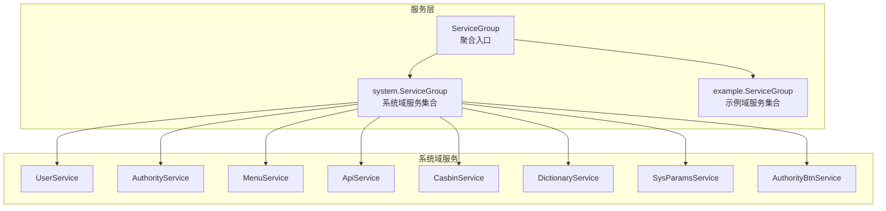
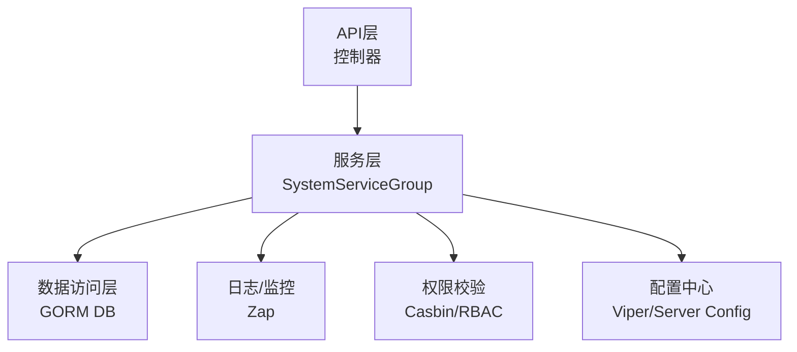
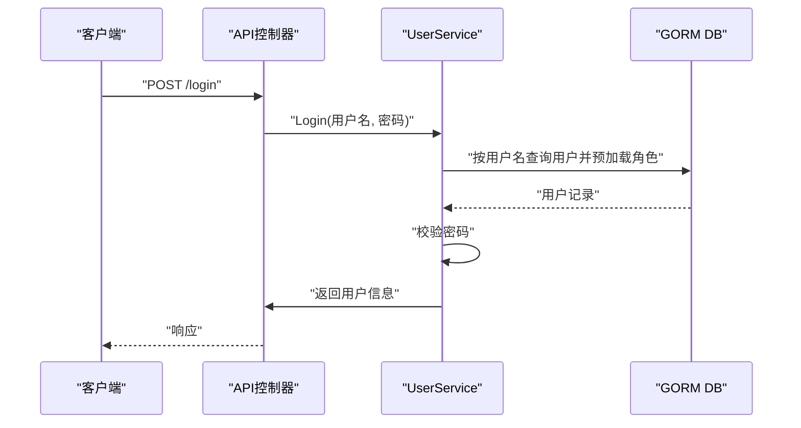
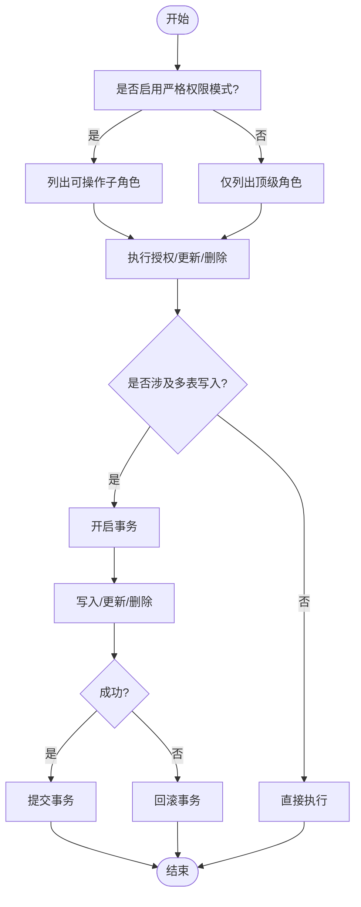
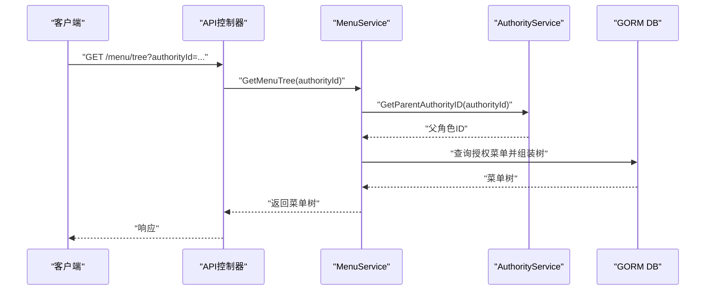
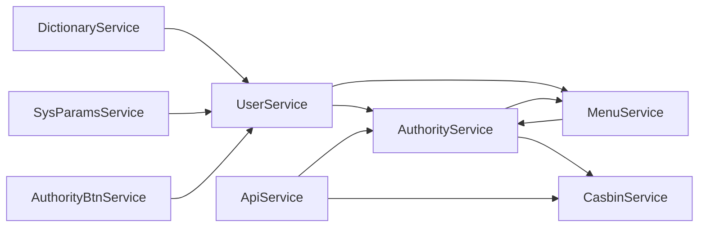
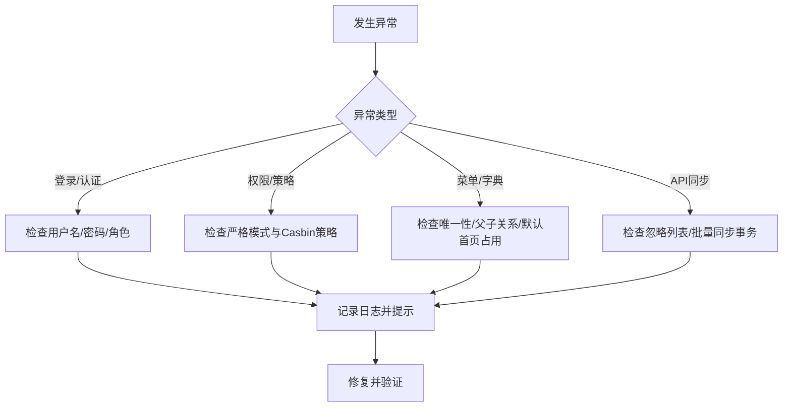

# 业务逻辑层

<cite>
**本文档引用的文件**
- [server/service/enter.go](file://server/service/enter.go)
- [server/service/system/enter.go](file://server/service/system/enter.go)
- [server/service/system/sys_user.go](file://server/service/system/sys_user.go)
- [server/service/system/sys_authority.go](file://server/service/system/sys_authority.go)
- [server/service/system/sys_menu.go](file://server/service/system/sys_menu.go)
- [server/service/system/sys_api.go](file://server/service/system/sys_api.go)
- [server/service/system/sys_casbin.go](file://server/service/system/sys_casbin.go)
- [server/service/system/sys_authority_btn.go](file://server/service/system/sys_authority_btn.go)
- [server/service/system/sys_params.go](file://server/service/system/sys_params.go)
- [server/service/system/sys_dictionary.go](file://server/service/system/sys_dictionary.go)
- [server/model/system/sys_user.go](file://server/model/system/sys_user.go)
- [server/global/global.go](file://server/global/global.go)
- [server/middleware/error.go](file://server/middleware/error.go)
</cite>

## 目录
1. [引言](#引言)
2. [项目结构](#项目结构)
3. [核心组件](#核心组件)
4. [架构总览](#架构总览)
5. [详细组件分析](#详细组件分析)
6. [依赖关系分析](#依赖关系分析)
7. [性能考量](#性能考量)
8. [故障排查指南](#故障排查指南)
9. [结论](#结论)
10. [附录](#附录)

## 引言
本文件面向测试管理平台的业务逻辑层，系统性阐述服务层（Service Layer）的设计理念与实现方式，重点覆盖以下方面：
- 业务逻辑封装与职责边界
- 事务管理与异常处理策略
- 服务层与数据访问层（DAO/ORM）的交互关系
- 权限控制（RBAC/Casbin）与业务规则的统一管理
- 核心业务模块（用户、权限、菜单、API、字典、参数等）的实现要点
- 事务边界定义、回滚策略与并发控制
- 业务扩展方法与最佳实践

## 项目结构
服务层采用“按域分组”的组织方式，系统域（system）与示例域（example）分别提供各自领域的业务能力。系统域包含用户、权限、菜单、API、字典、参数、日志、版本等核心能力；示例域提供演示性质的业务能力。

**图表来源**
- [server/service/enter.go:1-14](file://server/service/enter.go#L1-L14)
- [server/service/system/enter.go:1-31](file://server/service/system/enter.go#L1-L31)

**章节来源**
- [server/service/enter.go:1-14](file://server/service/enter.go#L1-L14)
- [server/service/system/enter.go:1-31](file://server/service/system/enter.go#L1-L31)

## 核心组件
- 服务聚合入口：通过全局聚合对象统一暴露各服务实例，便于API层调用与依赖注入。
- 系统域服务组：集中管理用户、权限、菜单、API、字典、参数、日志、版本等系统级业务。
- 示例域服务组：提供示例场景下的业务能力，便于快速复制与扩展。

关键特性：
- 统一的错误返回与日志记录，便于上层统一处理。
- 广泛使用GORM事务包裹复杂写操作，确保一致性。
- 权限校验贯穿多处业务流程，保障安全边界。

**章节来源**
- [server/service/enter.go:1-14](file://server/service/enter.go#L1-L14)
- [server/service/system/enter.go:1-31](file://server/service/system/enter.go#L1-L31)

## 架构总览
服务层位于API层与数据访问层之间，承担业务编排、规则校验、事务控制与异常处理职责。系统域服务间通过共享的全局DB连接与工具函数协作，形成清晰的业务闭环。

**图表来源**
- [server/service/system/sys_user.go:24-38](file://server/service/system/sys_user.go#L24-L38)
- [server/service/system/sys_authority.go:24-54](file://server/service/system/sys_authority.go#L24-L54)
- [server/service/system/sys_menu.go:18-85](file://server/service/system/sys_menu.go#L18-L85)
- [server/service/system/sys_api.go:21-31](file://server/service/system/sys_api.go#L21-L31)
- [server/service/system/sys_casbin.go:22-74](file://server/service/system/sys_casbin.go#L22-L74)
- [server/global/global.go:25-42](file://server/global/global.go#L25-L42)

## 详细组件分析

### 用户服务（UserService）
职责与要点：
- 用户注册：唯一性校验、密码哈希、UUID生成、持久化。
- 登录：用户名查找、密码校验、角色预加载、默认路由校验。
- 密码变更：原密码校验、新密码哈希、更新。
- 用户列表：条件过滤、分页、排序、预加载角色。
- 角色切换：校验默认路由是否在角色菜单范围内。
- 批量授权：事务内删除旧关系、批量写入、主角色更新。
- 删除用户：事务内级联删除用户与其授权关系。
- 信息维护：更新用户基本信息与个人设置。

事务与异常：
- 批量授权与删除用户均使用GORM事务，保证原子性。
- 错误统一返回，便于上层捕获与处理。

**图表来源**
- [server/service/system/sys_user.go:47-61](file://server/service/system/sys_user.go#L47-L61)

**章节来源**
- [server/service/system/sys_user.go:24-337](file://server/service/system/sys_user.go#L24-L337)
- [server/model/system/sys_user.go:20-63](file://server/model/system/sys_user.go#L20-L63)

### 权限服务（AuthorityService）
职责与要点：
- 角色创建：唯一性校验、默认菜单与Casbin策略初始化。
- 角色复制：复制菜单与按钮权限，同步Casbin策略。
- 角色更新与删除：严格校验（是否被使用、是否存在子角色）。
- 授权树管理：支持严格树形权限模式，限制可操作范围。
- 数据权限：设置角色的数据权限范围。
- 菜单权限：设置角色的菜单授权树。
- 关联用户/菜单批量覆盖：事务内全量替换，避免残留。

事务与异常：
- 创建、复制、删除、菜单/数据权限设置、用户批量覆盖均使用事务。
- 严格模式下进行权限ID合法性校验，防止越权。

**图表来源**
- [server/service/system/sys_authority.go:186-211](file://server/service/system/sys_authority.go#L186-L211)
- [server/service/system/sys_authority.go:350-412](file://server/service/system/sys_authority.go#L350-L412)

**章节来源**
- [server/service/system/sys_authority.go:24-413](file://server/service/system/sys_authority.go#L24-L413)

### 菜单服务（MenuService）
职责与要点：
- 动态菜单树构建：基于角色授权的菜单集合，组装父子关系。
- 基础菜单树：支持严格模式下的菜单筛选。
- 菜单新增：名称唯一性校验、父子关系约束、默认首页占用检查、必要时清空父菜单权限。
- 菜单授权：校验管理员权限与严格模式限制，批量写入授权。
- 默认路由校验：当用户默认路由不在其菜单范围内时回退至404。

事务与异常：
- 新增菜单使用事务，确保约束检查与写入的一致性。
- 严格模式下对跨级操作进行拦截。

**图表来源**
- [server/service/system/sys_menu.go:78-85](file://server/service/system/sys_menu.go#L78-L85)
- [server/service/system/sys_menu.go:190-219](file://server/service/system/sys_menu.go#L190-L219)

**章节来源**
- [server/service/system/sys_menu.go:18-391](file://server/service/system/sys_menu.go#L18-L391)

### API服务（ApiService）
职责与要点：
- API新增：路径+方法唯一性校验。
- API同步：对比路由缓存与数据库，生成新增/删除/忽略清单。
- API忽略：加入/移除忽略列表。
- API批量同步：事务内新增与删除，同时清理Casbin策略。
- API删除：删除记录并清理Casbin策略。
- API列表：条件过滤、分页、排序。
- API更新：路径/方法变更时的重复性校验与Casbin联动更新。

事务与异常：
- 批量同步与批量删除使用事务，保证一致性。
- 严格模式下按角色权限筛选可见API。

**章节来源**
- [server/service/system/sys_api.go:21-327](file://server/service/system/sys_api.go#L21-L327)

### Casbin权限服务（CasbinService）
职责与要点：
- 权限更新：严格模式下校验API是否在角色权限范围内，去重后批量写入。
- API联动更新：路径/方法变更后同步Casbin策略。
- 策略查询：按角色ID获取策略列表。
- 策略清理：按前缀清理策略或数据库落盘后刷新内存策略。
- 策略同步：先清理再写入，确保与数据库一致。

**章节来源**
- [server/service/system/sys_casbin.go:22-216](file://server/service/system/sys_casbin.go#L22-L216)

### 字典服务（DictionaryService）
职责与要点：
- 字典创建：类型唯一性校验。
- 字典更新：类型变更时唯一性校验，循环引用检测。
- 字典删除：级联删除详情。
- 字典导出/导入：支持含详情的JSON导出与导入，事务内重建父子关系。
- 列表查询：条件过滤、分页、预加载子字典。

事务与异常：
- 导入流程使用事务，确保父子关系重建的完整性。
- 循环引用检测避免树形结构破坏。

**章节来源**
- [server/service/system/sys_dictionary.go:21-298](file://server/service/system/sys_dictionary.go#L21-L298)

### 参数服务（SysParamsService）
职责与要点：
- 参数的增删改查与分页查询。
- 支持按时间范围、名称、键值模糊查询。

**章节来源**
- [server/service/system/sys_params.go:9-83](file://server/service/system/sys_params.go#L9-L83)

### 按钮权限服务（AuthorityBtnService）
职责与要点：
- 查询角色在特定菜单下的按钮权限集合。
- 全量覆盖某角色-菜单组合的按钮权限，事务内先清后写。

**章节来源**
- [server/service/system/sys_authority_btn.go:12-61](file://server/service/system/sys_authority_btn.go#L12-L61)

## 依赖关系分析
服务层内部依赖关系如下：
- UserService依赖AuthorityService（角色校验）、MenuService（默认路由校验）、全局DB与工具库。
- AuthorityService依赖MenuService（菜单树）、CasbinService（策略）、全局DB。
- MenuService依赖AuthorityService（父角色ID）、全局DB。
- ApiService依赖CasbinService（策略联动）、全局DB。
- DictionaryService、SysParamsService、AuthorityBtnService均依赖全局DB。

**图表来源**
- [server/service/system/sys_user.go:58-60](file://server/service/system/sys_user.go#L58-L60)
- [server/service/system/sys_authority.go:68-78](file://server/service/system/sys_authority.go#L68-L78)
- [server/service/system/sys_menu.go:191-194](file://server/service/system/sys_menu.go#L191-L194)
- [server/service/system/sys_api.go:137-154](file://server/service/system/sys_api.go#L137-L154)
- [server/service/system/sys_casbin.go:68-73](file://server/service/system/sys_casbin.go#L68-L73)

**章节来源**
- [server/service/system/sys_user.go:1-337](file://server/service/system/sys_user.go#L1-L337)
- [server/service/system/sys_authority.go:1-413](file://server/service/system/sys_authority.go#L1-L413)
- [server/service/system/sys_menu.go:1-391](file://server/service/system/sys_menu.go#L1-L391)
- [server/service/system/sys_api.go:1-327](file://server/service/system/sys_api.go#L1-L327)
- [server/service/system/sys_casbin.go:1-216](file://server/service/system/sys_casbin.go#L1-L216)
- [server/service/system/sys_dictionary.go:1-298](file://server/service/system/sys_dictionary.go#L1-L298)
- [server/service/system/sys_params.go:1-83](file://server/service/system/sys_params.go#L1-L83)
- [server/service/system/sys_authority_btn.go:1-61](file://server/service/system/sys_authority_btn.go#L1-L61)

## 性能考量
- 事务边界：在批量写入、级联删除、跨表更新等场景使用事务，减少中间状态，提升一致性与可恢复性。
- 预加载策略：在用户列表、菜单树、字典详情等场景使用预加载，降低N+1查询风险。
- 唯一性与索引：用户名、API路径+方法、字典类型等关键字段建立唯一索引，避免重复与冲突。
- 严格权限模式：在严格树形权限下进行筛选与校验，减少不必要的数据扫描。
- 日志与监控：统一使用Zap记录错误与异常，便于定位性能瓶颈与问题根因。

## 故障排查指南
常见问题与处理建议：
- 登录失败：检查用户名是否存在、密码是否正确、角色是否正确预加载。
- 角色切换失败：确认默认路由是否在角色菜单范围内，避免回退至404。
- 菜单新增失败：检查名称唯一性、父菜单是否存在、默认首页占用情况。
- API同步异常：核对忽略列表、Casbin策略是否同步成功。
- 权限更新无效：确认严格模式下API是否在角色权限范围内，策略是否去重与刷新。
- 导入字典失败：检查JSON格式、类型唯一性、父子关系映射。

**图表来源**
- [server/middleware/error.go:21-81](file://server/middleware/error.go#L21-L81)
- [server/service/system/sys_user.go:47-61](file://server/service/system/sys_user.go#L47-L61)
- [server/service/system/sys_menu.go:136-183](file://server/service/system/sys_menu.go#L136-L183)
- [server/service/system/sys_api.go:136-154](file://server/service/system/sys_api.go#L136-L154)
- [server/service/system/sys_casbin.go:26-74](file://server/service/system/sys_casbin.go#L26-L74)

**章节来源**
- [server/middleware/error.go:1-81](file://server/middleware/error.go#L1-L81)

## 结论
服务层通过清晰的职责划分、严格的事务边界与完善的异常处理，实现了测试管理平台的核心业务能力。权限控制与业务规则在多处服务中得到统一落地，既保证了安全性，也提升了可维护性。遵循本文的最佳实践，可在不破坏现有契约的前提下高效扩展新的业务功能。

## 附录
- 业务扩展建议
  - 新增领域服务时，优先在system.ServiceGroup中注册，保持聚合入口一致。
  - 写操作尽量使用事务，确保跨表一致性；读操作注意预加载与索引优化。
  - 权限校验前置，避免在事务中进行昂贵的权限计算。
  - 异常统一返回，结合Zap记录关键上下文，便于追踪与审计。