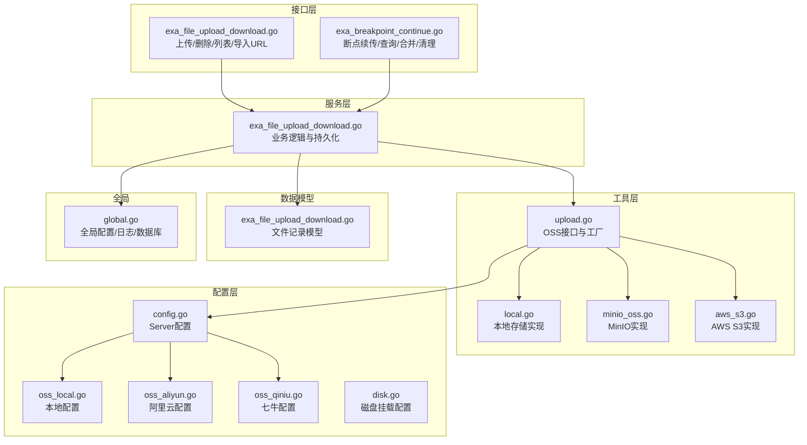
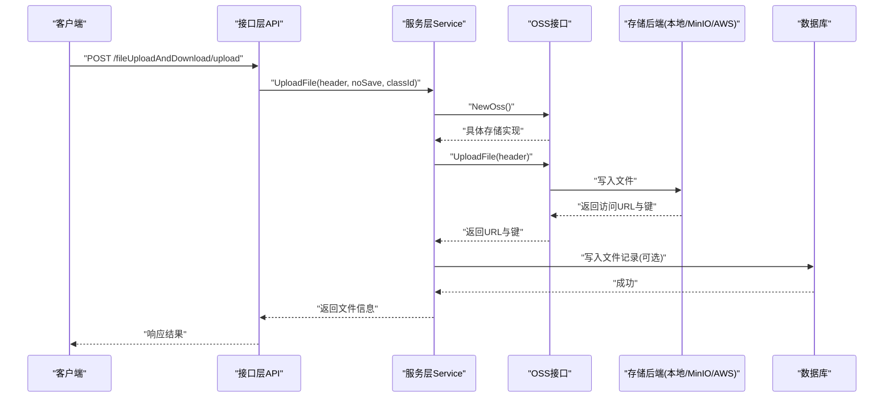
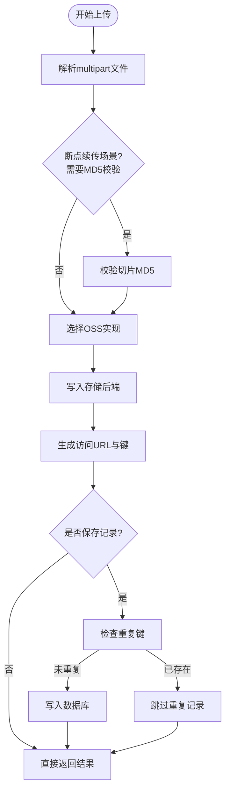
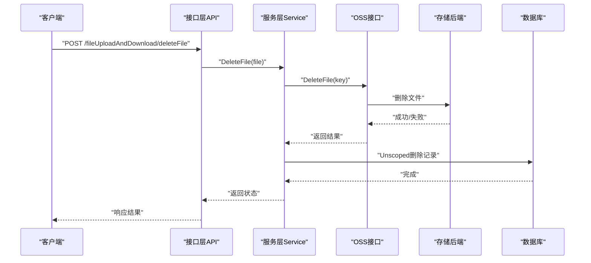
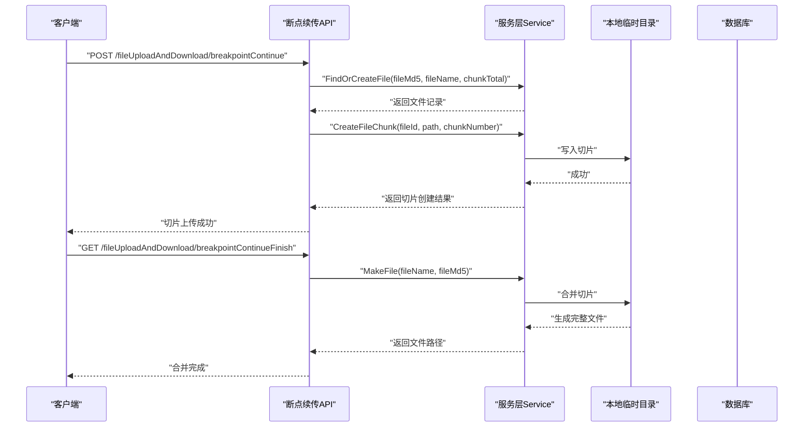
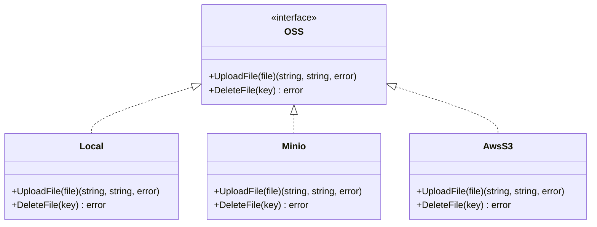
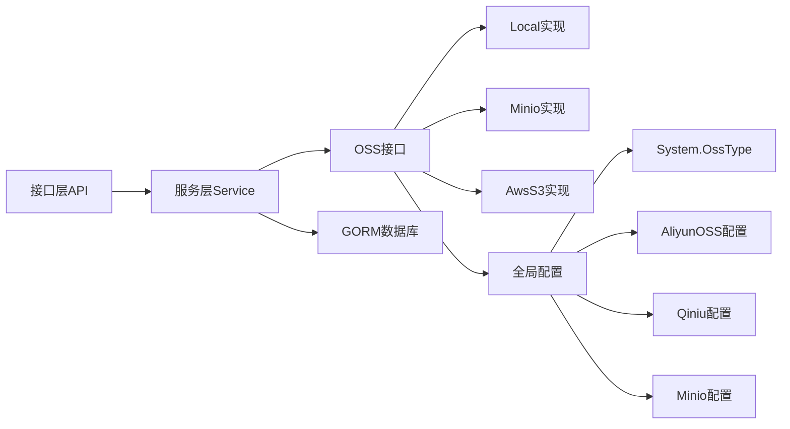

# 文件上传下载服务

<cite>
**本文引用的文件**
- [server/api/v1/example/exa_file_upload_download.go](file://server/api/v1/example/exa_file_upload_download.go)
- [server/service/example/exa_file_upload_download.go](file://server/service/example/exa_file_upload_download.go)
- [server/model/example/exa_file_upload_download.go](file://server/model/example/exa_file_upload_download.go)
- [server/router/example/exa_file_upload_and_download.go](file://server/router/example/exa_file_upload_and_download.go)
- [server/utils/upload/upload.go](file://server/utils/upload/upload.go)
- [server/utils/upload/local.go](file://server/utils/upload/local.go)
- [server/utils/upload/minio_oss.go](file://server/utils/upload/minio_oss.go)
- [server/utils/upload/aws_s3.go](file://server/utils/upload/aws_s3.go)
- [server/config/config.go](file://server/config/config.go)
- [server/config/oss_local.go](file://server/config/oss_local.go)
- [server/config/oss_aliyun.go](file://server/config/oss_aliyun.go)
- [server/config/oss_qiniu.go](file://server/config/oss_qiniu.go)
- [server/config/disk.go](file://server/config/disk.go)
- [server/global/global.go](file://server/global/global.go)
- [server/api/v1/example/exa_breakpoint_continue.go](file://server/api/v1/example/exa_breakpoint_continue.go)
</cite>

## 目录
1. [简介](#简介)
2. [项目结构](#项目结构)
3. [核心组件](#核心组件)
4. [架构总览](#架构总览)
5. [详细组件分析](#详细组件分析)
6. [依赖关系分析](#依赖关系分析)
7. [性能考量](#性能考量)
8. [故障排查指南](#故障排查指南)
9. [结论](#结论)
10. [附录](#附录)

## 简介
本文件上传下载服务围绕“文件上传、断点续传、文件记录与查询、删除与导入URL”等核心能力展开，覆盖安全验证（MD5校验、路径穿越防护）、存储策略（本地与多种云存储后端）、以及与数据库的记录管理。系统通过统一的OSS接口抽象，支持在不同存储后端之间灵活切换；同时提供断点续传能力以提升大文件传输的可靠性与效率。

## 项目结构
文件上传下载相关代码主要分布在以下模块：
- 接口层：负责HTTP路由与请求参数解析
- 服务层：封装业务逻辑，协调存储与数据库
- 工具层：统一的OSS接口与具体存储实现
- 配置层：系统与各云存储的配置项
- 数据模型：文件记录的数据结构
- 全局变量：全局配置、日志、数据库连接等

**图示来源**
- [server/api/v1/example/exa_file_upload_download.go:1-136](file://server/api/v1/example/exa_file_upload_download.go#L1-L136)
- [server/api/v1/example/exa_breakpoint_continue.go:1-157](file://server/api/v1/example/exa_breakpoint_continue.go#L1-L157)
- [server/service/example/exa_file_upload_download.go:1-131](file://server/service/example/exa_file_upload_download.go#L1-L131)
- [server/utils/upload/upload.go:1-47](file://server/utils/upload/upload.go#L1-L47)
- [server/utils/upload/local.go:1-110](file://server/utils/upload/local.go#L1-L110)
- [server/utils/upload/minio_oss.go:1-107](file://server/utils/upload/minio_oss.go#L1-L107)
- [server/utils/upload/aws_s3.go:1-115](file://server/utils/upload/aws_s3.go#L1-L115)
- [server/config/config.go:1-41](file://server/config/config.go#L1-L41)
- [server/config/oss_local.go:1-7](file://server/config/oss_local.go#L1-L7)
- [server/config/oss_aliyun.go:1-11](file://server/config/oss_aliyun.go#L1-L11)
- [server/config/oss_qiniu.go:1-12](file://server/config/oss_qiniu.go#L1-L12)
- [server/config/disk.go:1-10](file://server/config/disk.go#L1-L10)
- [server/model/example/exa_file_upload_download.go:1-19](file://server/model/example/exa_file_upload_download.go#L1-L19)
- [server/global/global.go:1-69](file://server/global/global.go#L1-L69)

**章节来源**
- [server/api/v1/example/exa_file_upload_download.go:1-136](file://server/api/v1/example/exa_file_upload_download.go#L1-L136)
- [server/router/example/exa_file_upload_and_download.go:1-23](file://server/router/example/exa_file_upload_and_download.go#L1-L23)

## 核心组件
- 接口层API：提供上传、删除、列表、导入URL、断点续传等接口，统一返回格式。
- 服务层Service：封装上传、删除、编辑、分页查询、导入URL等业务逻辑；调用OSS接口完成实际存储。
- OSS接口与实现：通过NewOss工厂按配置选择本地或云存储实现；支持MinIO、AWS S3等多种后端。
- 配置模块：集中管理系统与各云存储的配置项，支持运行时切换。
- 数据模型：记录文件名、分类、URL、标签、唯一键等字段，映射至数据库表。
- 全局模块：提供全局配置、日志、数据库连接等共享资源。

**章节来源**
- [server/service/example/exa_file_upload_download.go:1-131](file://server/service/example/exa_file_upload_download.go#L1-L131)
- [server/utils/upload/upload.go:1-47](file://server/utils/upload/upload.go#L1-L47)
- [server/model/example/exa_file_upload_download.go:1-19](file://server/model/example/exa_file_upload_download.go#L1-L19)
- [server/config/config.go:1-41](file://server/config/config.go#L1-L41)
- [server/global/global.go:1-69](file://server/global/global.go#L1-L69)

## 架构总览
系统采用“接口层-服务层-存储层”的分层设计，通过OSS接口抽象屏蔽存储差异，实现多后端可插拔。上传流程中，服务层根据配置选择具体存储实现，生成文件唯一键与访问URL，同时写入数据库记录；删除流程先从存储后端删除，再删除数据库记录。

**图示来源**
- [server/api/v1/example/exa_file_upload_download.go:25-42](file://server/api/v1/example/exa_file_upload_download.go#L25-L42)
- [server/service/example/exa_file_upload_download.go:96-120](file://server/service/example/exa_file_upload_download.go#L96-L120)
- [server/utils/upload/upload.go:20-46](file://server/utils/upload/upload.go#L20-L46)
- [server/utils/upload/local.go:31-69](file://server/utils/upload/local.go#L31-L69)
- [server/utils/upload/minio_oss.go:55-96](file://server/utils/upload/minio_oss.go#L55-L96)
- [server/utils/upload/aws_s3.go:29-53](file://server/utils/upload/aws_s3.go#L29-L53)

## 详细组件分析

### 上传流程与安全验证
- 请求参数：接收multipart文件，支持附加参数如分类ID与是否保存记录标志。
- 安全校验：
  - MD5校验：断点续传场景下对切片内容进行MD5校验，确保数据一致性。
  - 路径穿越防护：删除切片时对路径进行严格校验，拒绝异常路径。
- 存储与命名：
  - 本地存储：基于时间戳与MD5组合生成新文件名，避免冲突；支持配置存储路径与访问路径。
  - MinIO/AWS S3：使用MD5作为文件名基础，结合日期路径组织，支持自定义BasePath与BucketUrl。
- 记录管理：根据配置决定是否入库；若开启入库，会检查重复键并去重。

**图示来源**
- [server/api/v1/example/exa_breakpoint_continue.go:54-58](file://server/api/v1/example/exa_breakpoint_continue.go#L54-L58)
- [server/utils/upload/local.go:31-69](file://server/utils/upload/local.go#L31-L69)
- [server/utils/upload/minio_oss.go:71-96](file://server/utils/upload/minio_oss.go#L71-L96)
- [server/utils/upload/aws_s3.go:29-53](file://server/utils/upload/aws_s3.go#L29-L53)
- [server/service/example/exa_file_upload_download.go:96-120](file://server/service/example/exa_file_upload_download.go#L96-L120)

**章节来源**
- [server/api/v1/example/exa_file_upload_download.go:25-42](file://server/api/v1/example/exa_file_upload_download.go#L25-L42)
- [server/api/v1/example/exa_breakpoint_continue.go:29-78](file://server/api/v1/example/exa_breakpoint_continue.go#L29-L78)
- [server/utils/upload/local.go:31-69](file://server/utils/upload/local.go#L31-L69)
- [server/utils/upload/minio_oss.go:55-96](file://server/utils/upload/minio_oss.go#L55-L96)
- [server/utils/upload/aws_s3.go:29-53](file://server/utils/upload/aws_s3.go#L29-L53)
- [server/service/example/exa_file_upload_download.go:96-120](file://server/service/example/exa_file_upload_download.go#L96-L120)

### 删除流程与权限控制
- 删除流程：先从存储后端删除文件，再删除数据库记录；若存储删除失败，返回错误。
- 权限控制：所有相关接口均标注ApiKey鉴权，需在网关或中间件层完成JWT校验与RBAC授权。
- 路径安全：删除切片时进行路径穿越拦截，防止误删或越权删除。

**图示来源**
- [server/api/v1/example/exa_file_upload_download.go:69-82](file://server/api/v1/example/exa_file_upload_download.go#L69-L82)
- [server/service/example/exa_file_upload_download.go:43-55](file://server/service/example/exa_file_upload_download.go#L43-L55)
- [server/utils/upload/local.go:81-109](file://server/utils/upload/local.go#L81-L109)

**章节来源**
- [server/api/v1/example/exa_file_upload_download.go:69-82](file://server/api/v1/example/exa_file_upload_download.go#L69-L82)
- [server/service/example/exa_file_upload_download.go:43-55](file://server/service/example/exa_file_upload_download.go#L43-L55)
- [server/api/v1/example/exa_breakpoint_continue.go:132-156](file://server/api/v1/example/exa_breakpoint_continue.go#L132-L156)

### 断点续传机制
- 切片上传：客户端按序上传文件切片，携带文件MD5、文件名、切片序号与总数。
- 校验与落盘：服务端对切片内容进行MD5校验，校验通过后将切片写入临时目录。
- 合并文件：当所有切片完成后，触发合并流程，生成完整文件并返回访问路径。
- 清理切片：提供删除切片接口，清理临时切片与数据库记录。

**图示来源**
- [server/api/v1/example/exa_breakpoint_continue.go:29-78](file://server/api/v1/example/exa_breakpoint_continue.go#L29-L78)
- [server/api/v1/example/exa_breakpoint_continue.go:111-121](file://server/api/v1/example/exa_breakpoint_continue.go#L111-L121)

**章节来源**
- [server/api/v1/example/exa_breakpoint_continue.go:29-156](file://server/api/v1/example/exa_breakpoint_continue.go#L29-L156)

### 存储策略与配置
- 本地存储：通过配置项指定访问路径与存储路径，文件名采用MD5+时间戳策略，避免冲突。
- 云存储：
  - MinIO：支持自定义Endpoint、AccessKey、SecretKey、Bucket、BasePath与BucketUrl，自动创建桶并上传。
  - AWS S3：支持自定义Region、SecretID/SecretKey、Bucket、BaseURL、PathPrefix与Endpoint，兼容MinIO。
  - 阿里云OSS/七牛等：通过配置项提供对应密钥与域名，由OSS工厂按类型实例化。
- 磁盘挂载：支持多磁盘挂载配置，便于本地存储扩展。

**图示来源**
- [server/utils/upload/upload.go:12-46](file://server/utils/upload/upload.go#L12-L46)
- [server/utils/upload/local.go:20-109](file://server/utils/upload/local.go#L20-L109)
- [server/utils/upload/minio_oss.go:23-106](file://server/utils/upload/minio_oss.go#L23-L106)
- [server/utils/upload/aws_s3.go:20-114](file://server/utils/upload/aws_s3.go#L20-L114)

**章节来源**
- [server/utils/upload/upload.go:20-46](file://server/utils/upload/upload.go#L20-L46)
- [server/utils/upload/local.go:31-69](file://server/utils/upload/local.go#L31-L69)
- [server/utils/upload/minio_oss.go:55-96](file://server/utils/upload/minio_oss.go#L55-L96)
- [server/utils/upload/aws_s3.go:29-53](file://server/utils/upload/aws_s3.go#L29-L53)
- [server/config/oss_local.go:1-7](file://server/config/oss_local.go#L1-L7)
- [server/config/oss_aliyun.go:1-11](file://server/config/oss_aliyun.go#L1-L11)
- [server/config/oss_qiniu.go:1-12](file://server/config/oss_qiniu.go#L1-L12)
- [server/config/disk.go:1-10](file://server/config/disk.go#L1-L10)

### 下载控制与访问日志
- 下载控制：当前仓库未提供专用下载接口；建议在路由层新增受控下载接口，结合鉴权中间件与RBAC策略，仅允许授权用户访问。
- 访问日志：可在下载接口处统一记录访问日志，包含用户ID、文件ID、访问时间、IP、UA等信息，便于审计与追踪。

[本节为概念性说明，不直接分析具体文件，故不附“章节来源”]

## 依赖关系分析
- 组件耦合：接口层仅依赖服务层；服务层依赖OSS接口与数据库；OSS接口依赖具体存储实现与配置。
- 外部依赖：MinIO SDK、AWS SDK v2、Zap日志库、GORM数据库ORM。
- 配置依赖：OSS工厂依赖全局配置中的System.OssType与各云存储配置项。

**图示来源**
- [server/api/v1/example/exa_file_upload_download.go:1-136](file://server/api/v1/example/exa_file_upload_download.go#L1-L136)
- [server/service/example/exa_file_upload_download.go:1-131](file://server/service/example/exa_file_upload_download.go#L1-L131)
- [server/utils/upload/upload.go:1-47](file://server/utils/upload/upload.go#L1-L47)
- [server/config/config.go:1-41](file://server/config/config.go#L1-L41)
- [server/global/global.go:1-69](file://server/global/global.go#L1-L69)

**章节来源**
- [server/utils/upload/upload.go:20-46](file://server/utils/upload/upload.go#L20-L46)
- [server/config/config.go:21-29](file://server/config/config.go#L21-L29)
- [server/global/global.go:31-31](file://server/global/global.go#L31-L31)

## 性能考量
- 并发与锁：本地删除操作使用互斥锁，避免并发删除导致的竞态条件。
- 大文件处理：MinIO与AWS S3实现中对上传设置了较长的超时时间，适合大文件场景。
- 存储选择：本地存储适合小规模部署；云存储适合高可用与弹性扩展。
- 日志与监控：建议在关键路径增加埋点与指标采集，便于性能分析与问题定位。

[本节提供一般性指导，不直接分析具体文件，故不附“章节来源”]

## 故障排查指南
- 上传失败：
  - 检查OSS类型配置与对应密钥是否正确。
  - 查看存储路径权限与磁盘空间。
  - 观察日志输出，定位具体错误位置。
- 删除失败：
  - 确认文件键是否为空或包含非法字符。
  - 检查存储后端是否可达，网络与权限是否正常。
- 断点续传异常：
  - 校验切片MD5是否一致。
  - 确认临时目录权限与磁盘空间充足。
  - 检查数据库中切片记录是否完整。

**章节来源**
- [server/utils/upload/local.go:81-109](file://server/utils/upload/local.go#L81-L109)
- [server/utils/upload/minio_oss.go:99-106](file://server/utils/upload/minio_oss.go#L99-L106)
- [server/api/v1/example/exa_breakpoint_continue.go:54-58](file://server/api/v1/example/exa_breakpoint_continue.go#L54-L58)

## 结论
该文件上传下载服务通过清晰的分层设计与OSS接口抽象，实现了对本地与多种云存储的统一接入；结合断点续传与严格的路径校验，提升了大文件传输的可靠性与安全性。建议后续完善下载接口的权限控制与访问日志记录，并针对不同场景优化存储与网络配置。

## 附录

### 扩展方法与自定义存储后端集成指南
- 新增存储后端步骤：
  - 实现OSS接口的UploadFile与DeleteFile方法。
  - 在OSS工厂中添加类型分支，返回新实现。
  - 在全局配置中新增对应配置项。
  - 在路由层或服务层按需调整调用逻辑。
- 最佳实践：
  - 统一文件命名策略，避免冲突。
  - 对上传内容进行必要的MIME类型与大小校验。
  - 在生产环境启用HTTPS与访问控制。
  - 为大文件提供分片上传与断点续传能力。

**章节来源**
- [server/utils/upload/upload.go:12-46](file://server/utils/upload/upload.go#L12-L46)
- [server/config/config.go:21-29](file://server/config/config.go#L21-L29)