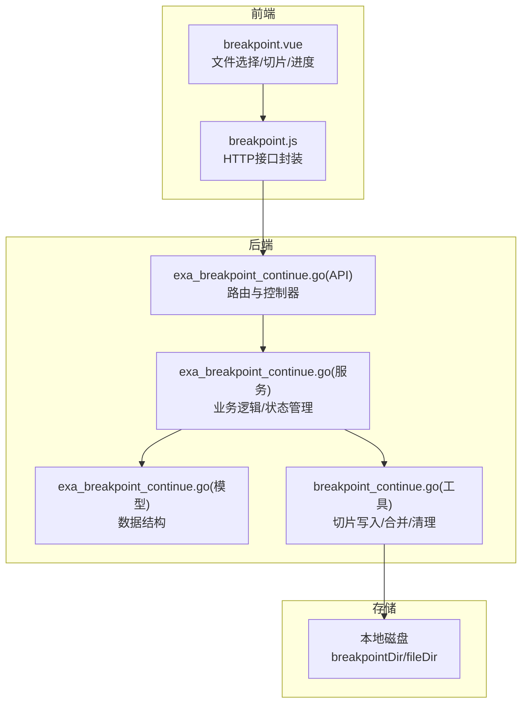
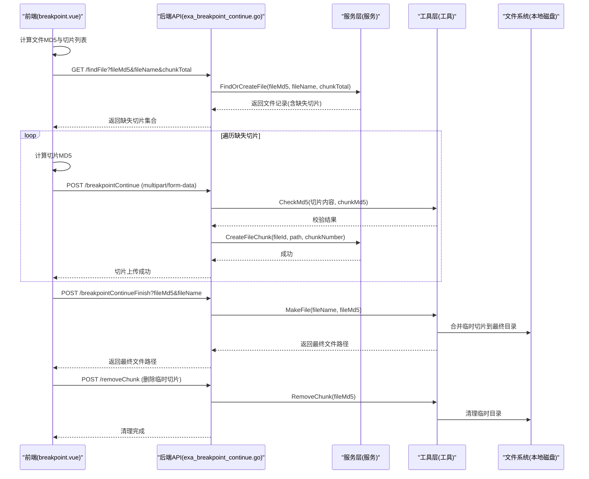
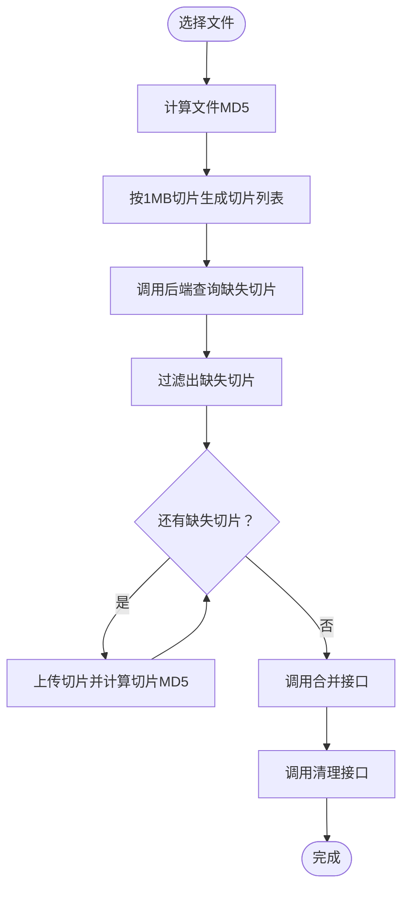
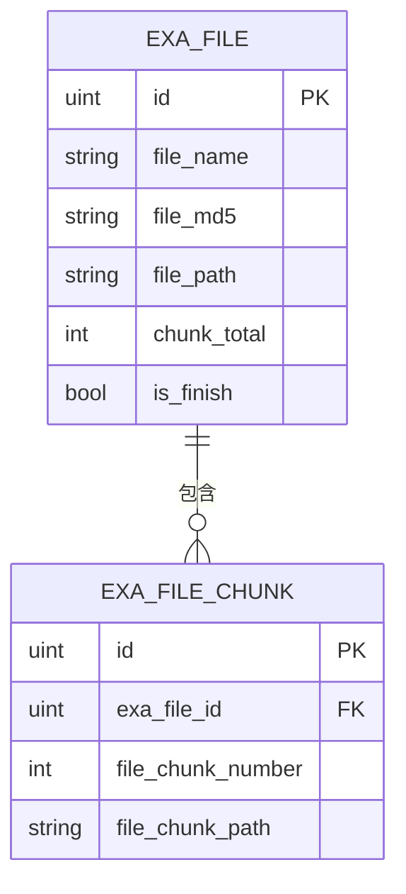
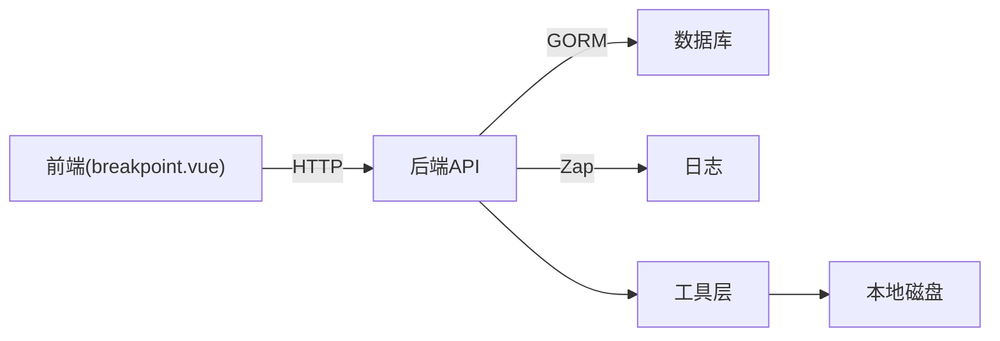

# 断点续传服务

<cite>
**本文引用的文件**
- [exa_breakpoint_continue.go（API）](file://server/api/v1/example/exa_breakpoint_continue.go)
- [exa_breakpoint_continue.go（服务）](file://server/service/example/exa_breakpoint_continue.go)
- [exa_breakpoint_continue.go（模型）](file://server/model/example/exa_breakpoint_continue.go)
- [exa_breakpoint_continue.go（响应模型）](file://server/model/example/response/exa_breakpoint_continue.go)
- [breakpoint_continue.go（工具）](file://server/utils/breakpoint_continue.go)
- [breakpoint.js（前端API）](file://web/src/api/breakpoint.js)
- [breakpoint.vue（前端组件）](file://web/src/view/example/breakpoint/breakpoint.vue)
- [disk.go（磁盘配置）](file://server/config/disk.go)
- [config.go（系统配置）](file://server/config/config.go)
</cite>

## 目录
1. [简介](#简介)
2. [项目结构](#项目结构)
3. [核心组件](#核心组件)
4. [架构总览](#架构总览)
5. [详细组件分析](#详细组件分析)
6. [依赖关系分析](#依赖关系分析)
7. [性能考量](#性能考量)
8. [故障排查指南](#故障排查指南)
9. [结论](#结论)
10. [附录](#附录)

## 简介
本文件面向“断点续传服务”的实现与使用，围绕大文件上传的分片策略、状态管理、完整性校验、进度跟踪以及与本地文件系统的集成方式进行系统化说明。文档同时给出性能优化建议与常见问题排查方法，帮助开发者快速理解并安全地部署与维护该功能。

## 项目结构
断点续传功能由前后端协同实现：
- 前端负责文件切片、MD5 校验、进度计算与请求调度
- 后端负责切片接收、完整性校验、状态持久化、切片合并与清理
- 文件系统采用本地磁盘作为存储介质（可替换为云存储）

图表来源
- [exa_breakpoint_continue.go（API）:20-157](file://server/api/v1/example/exa_breakpoint_continue.go#L20-L157)
- [exa_breakpoint_continue.go（服务）:11-72](file://server/service/example/exa_breakpoint_continue.go#L11-L72)
- [exa_breakpoint_continue.go（模型）:8-25](file://server/model/example/exa_breakpoint_continue.go#L8-L25)
- [breakpoint_continue.go（工具）:15-122](file://server/utils/breakpoint_continue.go#L15-L122)
- [disk.go（磁盘配置）:1-10](file://server/config/disk.go#L1-L10)

章节来源
- [exa_breakpoint_continue.go（API）:1-157](file://server/api/v1/example/exa_breakpoint_continue.go#L1-L157)
- [exa_breakpoint_continue.go（服务）:1-72](file://server/service/example/exa_breakpoint_continue.go#L1-L72)
- [exa_breakpoint_continue.go（模型）:1-25](file://server/model/example/exa_breakpoint_continue.go#L1-L25)
- [breakpoint_continue.go（工具）:1-122](file://server/utils/breakpoint_continue.go#L1-L122)
- [disk.go（磁盘配置）:1-10](file://server/config/disk.go#L1-L10)

## 核心组件
- 前端组件：负责文件切片、MD5 校验、进度计算与请求调度
- 后端API：接收切片、校验完整性、记录状态、触发合并与清理
- 服务层：文件与切片状态管理、数据库操作
- 工具层：切片写入、文件合并、切片清理
- 数据模型：文件与切片记录结构
- 存储层：本地磁盘（breakpointDir 临时切片，fileDir 最终文件）

章节来源
- [exa_breakpoint_continue.go（API）:20-157](file://server/api/v1/example/exa_breakpoint_continue.go#L20-L157)
- [exa_breakpoint_continue.go（服务）:11-72](file://server/service/example/exa_breakpoint_continue.go#L11-L72)
- [exa_breakpoint_continue.go（模型）:8-25](file://server/model/example/exa_breakpoint_continue.go#L8-L25)
- [breakpoint_continue.go（工具）:15-122](file://server/utils/breakpoint_continue.go#L15-L122)

## 架构总览
断点续传的关键流程如下：
- 前端计算文件整体MD5与切片列表，向后端查询当前文件的上传状态
- 后端根据文件MD5与名称判断是否已完整上传（秒传）
- 若非秒传，后端返回缺失的切片索引；前端仅上传缺失切片
- 后端对每个切片进行MD5校验，写入临时目录，并记录切片索引
- 所有切片完成后，后端按顺序合并至最终目录
- 前端发起清理请求，删除临时切片并更新数据库状态

图表来源
- [exa_breakpoint_continue.go（API）:20-157](file://server/api/v1/example/exa_breakpoint_continue.go#L20-L157)
- [exa_breakpoint_continue.go（服务）:11-72](file://server/service/example/exa_breakpoint_continue.go#L11-L72)
- [breakpoint_continue.go（工具）:26-121](file://server/utils/breakpoint_continue.go#L26-L121)
- [breakpoint.vue（前端组件）:77-211](file://web/src/view/example/breakpoint/breakpoint.vue#L77-L211)

## 详细组件分析

### 前端实现（breakpoint.vue）
- 文件切片与MD5
  - 使用浏览器原生File.slice进行分片，默认单片大小为1MB
  - 对每个切片计算MD5，用于后端完整性校验
- 进度计算
  - 基于“待上传切片数量”与“总切片数”计算百分比
- 请求流程
  - 选择文件后，先调用后端查询当前文件状态
  - 仅上传缺失切片
  - 所有切片完成后，调用合并接口并清理临时切片

图表来源
- [breakpoint.vue（前端组件）:77-211](file://web/src/view/example/breakpoint/breakpoint.vue#L77-L211)

章节来源
- [breakpoint.vue（前端组件）:77-211](file://web/src/view/example/breakpoint/breakpoint.vue#L77-L211)
- [breakpoint.js（前端API）:10-44](file://web/src/api/breakpoint.js#L10-L44)

### 后端API（exa_breakpoint_continue.go）
- 接口职责
  - 断点续传上传：接收切片、校验MD5、记录切片索引
  - 查询文件：返回当前文件的上传状态与缺失切片
  - 合并文件：将临时切片按序合并到最终目录
  - 清理切片：删除临时切片并更新数据库状态
- 关键参数
  - fileMd5：文件整体MD5
  - fileName：文件名
  - chunkNumber/chunkTotal：当前切片编号与总切片数
  - chunkMd5：当前切片MD5

章节来源
- [exa_breakpoint_continue.go（API）:20-157](file://server/api/v1/example/exa_breakpoint_continue.go#L20-L157)

### 服务层（exa_breakpoint_continue.go）
- 文件状态管理
  - FindOrCreateFile：若历史文件已完整上传则直接返回（秒传），否则返回当前文件并预加载已存在的切片
  - CreateFileChunk：记录每个切片的路径与编号
  - DeleteFileChunk：在清理阶段更新文件状态并删除切片记录
- 数据库交互
  - 使用GORM进行查询、创建与更新

章节来源
- [exa_breakpoint_continue.go（服务）:11-72](file://server/service/example/exa_breakpoint_continue.go#L11-L72)

### 工具层（breakpoint_continue.go）
- 切片写入
  - BreakPointContinue：按文件MD5创建独立目录，写入切片文件
  - makeFileContent：将切片内容写入指定路径
- 完整性校验
  - CheckMd5：对上传内容重新计算MD5并与前端传入的chunkMd5对比
- 文件合并
  - MakeFile：遍历临时目录下所有切片，按序追加写入最终文件
- 切片清理
  - RemoveChunk：删除对应文件MD5的临时目录

章节来源
- [breakpoint_continue.go（工具）:26-121](file://server/utils/breakpoint_continue.go#L26-L121)

### 数据模型（exa_breakpoint_continue.go）
- ExaFile：文件记录，包含文件名、MD5、路径、总切片数、是否完成等字段
- ExaFileChunk：切片记录，包含所属文件ID、切片编号与切片路径

图表来源
- [exa_breakpoint_continue.go（模型）:8-25](file://server/model/example/exa_breakpoint_continue.go#L8-L25)

章节来源
- [exa_breakpoint_continue.go（模型）:8-25](file://server/model/example/exa_breakpoint_continue.go#L8-L25)

### 存储集成（本地磁盘）
- 目录结构
  - breakpointDir：临时切片目录，按fileMd5分组存放
  - fileDir：最终文件目录
- 路径安全性
  - 工具层对文件名与路径进行安全检查，防止路径穿越
- 可扩展性
  - 通过配置文件可扩展为云存储（如MinIO、AWS S3等），但当前实现使用本地磁盘

章节来源
- [breakpoint_continue.go（工具）:15-18](file://server/utils/breakpoint_continue.go#L15-L18)
- [disk.go（磁盘配置）:1-10](file://server/config/disk.go#L1-L10)
- [config.go（系统配置）:24-40](file://server/config/config.go#L24-L40)

## 依赖关系分析
- 前端依赖
  - SparkMD5：计算切片MD5
  - Element Plus：UI组件与消息提示
  - Axios：HTTP请求封装
- 后端依赖
  - Gin：Web框架
  - GORM：数据库ORM
  - Zap：日志
- 存储依赖
  - 本地文件系统（当前实现）
  - 可替换为云存储SDK（如MinIO、AWS S3）

图表来源
- [exa_breakpoint_continue.go（API）:1-18](file://server/api/v1/example/exa_breakpoint_continue.go#L1-L18)
- [exa_breakpoint_continue.go（服务）:1-10](file://server/service/example/exa_breakpoint_continue.go#L1-L10)
- [breakpoint_continue.go（工具）:1-8](file://server/utils/breakpoint_continue.go#L1-L8)

章节来源
- [exa_breakpoint_continue.go（API）:1-18](file://server/api/v1/example/exa_breakpoint_continue.go#L1-L18)
- [exa_breakpoint_continue.go（服务）:1-10](file://server/service/example/exa_breakpoint_continue.go#L1-L10)
- [breakpoint_continue.go（工具）:1-8](file://server/utils/breakpoint_continue.go#L1-L8)

## 性能考量
- 切片大小
  - 默认1MB，可根据网络环境调整；过大影响并发与重试成本，过小增加请求开销
- 并发上传
  - 前端可限制并发切片数量，避免过多I/O竞争
- MD5计算
  - 建议在主线程外异步计算，避免阻塞UI
- 存储写入
  - 合并阶段按序追加写入，减少随机I/O
- 数据库压力
  - 切片记录频繁写入，建议合理索引与批量写入策略
- 云存储迁移
  - 如需高可用与跨地域分发，可替换为MinIO/AWS S3等对象存储

[本节为通用性能建议，无需特定文件引用]

## 故障排查指南
- 常见错误与定位
  - “检查MD5失败”：前端切片MD5与后端计算不一致，检查切片是否被修改或传输损坏
  - “路径不合法/非法路径”：检测路径穿越攻击或参数异常，确认前端传参与后端校验
  - “断点续传失败/文件创建失败”：检查临时目录写入权限与磁盘空间
  - “缓存切片删除失败”：确认临时目录是否存在或已被清理
- 日志与监控
  - 后端使用Zap记录错误堆栈，便于定位具体环节
- 重试与幂等
  - 切片上传具备幂等性（重复上传不会破坏已有切片），前端应避免重复提交
- 临时文件清理
  - 合并完成后务必调用清理接口，避免磁盘占用

章节来源
- [exa_breakpoint_continue.go（API）:36-78](file://server/api/v1/example/exa_breakpoint_continue.go#L36-L78)
- [exa_breakpoint_continue.go（API）:139-156](file://server/api/v1/example/exa_breakpoint_continue.go#L139-L156)
- [breakpoint_continue.go（工具）:85-121](file://server/utils/breakpoint_continue.go#L85-L121)

## 结论
该断点续传服务通过“前端切片+后端校验+数据库状态+本地磁盘存储”的组合，实现了稳定的大文件上传能力。其设计强调：
- 完整性校验（MD5）
- 状态持久化（文件与切片记录）
- 进度可视化与秒传支持
- 易于扩展到云存储

建议在生产环境中结合网络状况与业务需求，优化切片大小、并发策略与存储方案，并完善监控与告警体系。

[本节为总结性内容，无需特定文件引用]

## 附录

### API定义（后端）
- 断点续传上传
  - 方法：POST
  - 路径：/fileUploadAndDownload/breakpointContinue
  - 表单字段：fileMd5、fileName、chunkNumber、chunkTotal、chunkMd5、file（multipart）
- 查询文件
  - 方法：GET
  - 路径：/fileUploadAndDownload/findFile
  - 查询参数：fileMd5、fileName、chunkTotal
- 合并文件
  - 方法：POST
  - 路径：/fileUploadAndDownload/breakpointContinueFinish
  - 查询参数：fileMd5、fileName
- 清理切片
  - 方法：POST
  - 路径：/fileUploadAndDownload/removeChunk
  - 请求体：fileMd5、fileName、filePath

章节来源
- [exa_breakpoint_continue.go（API）:20-157](file://server/api/v1/example/exa_breakpoint_continue.go#L20-L157)

### 前端调用（简化）
- findFile(params)
- breakpointContinue(data)
- breakpointContinueFinish(params)
- removeChunk(data, params)

章节来源
- [breakpoint.js（前端API）:10-44](file://web/src/api/breakpoint.js#L10-L44)