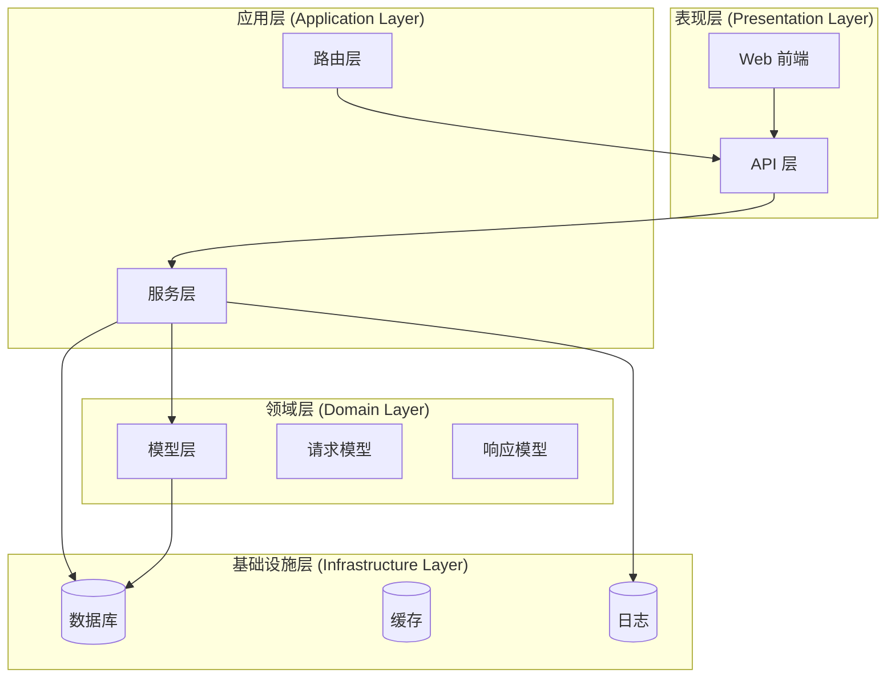
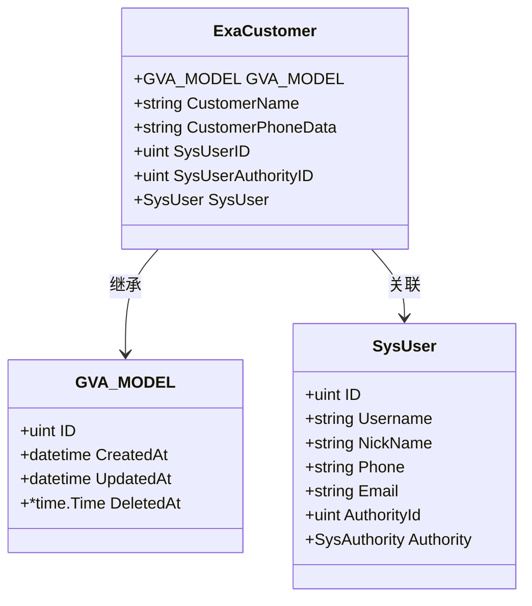
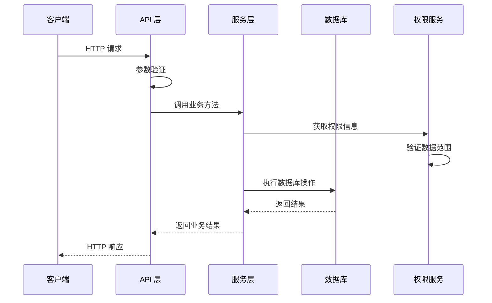
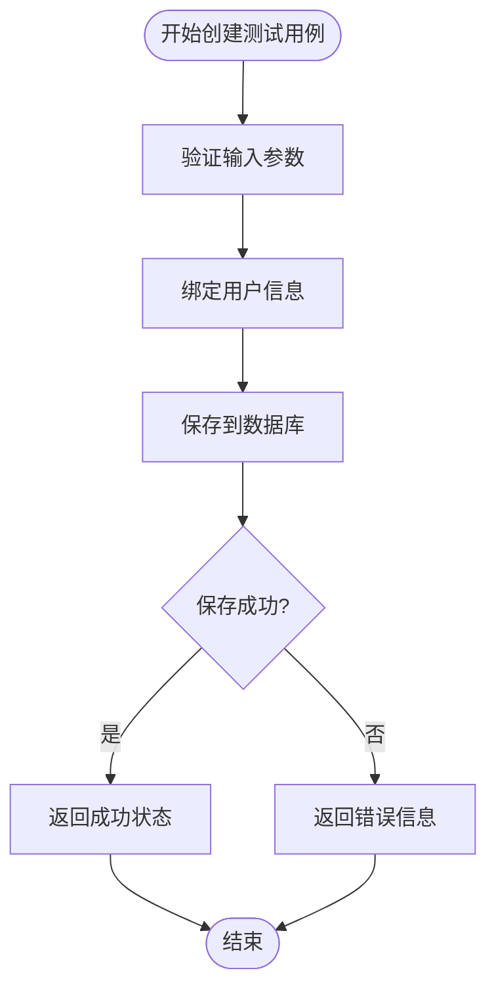
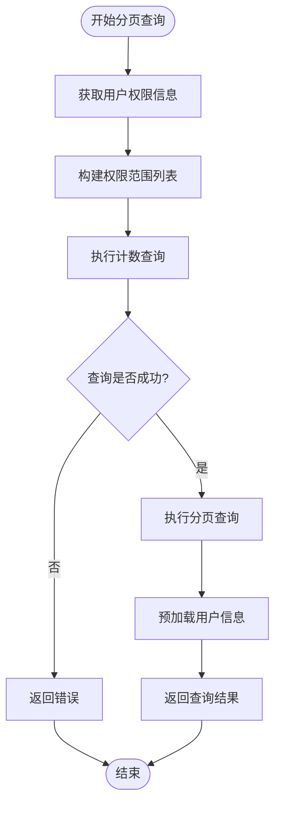
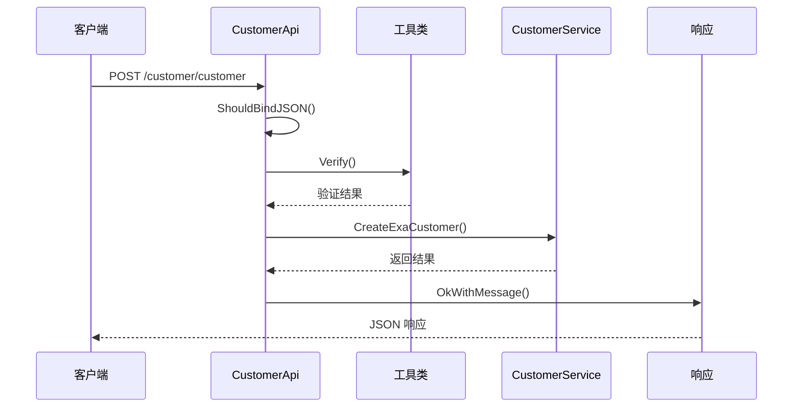
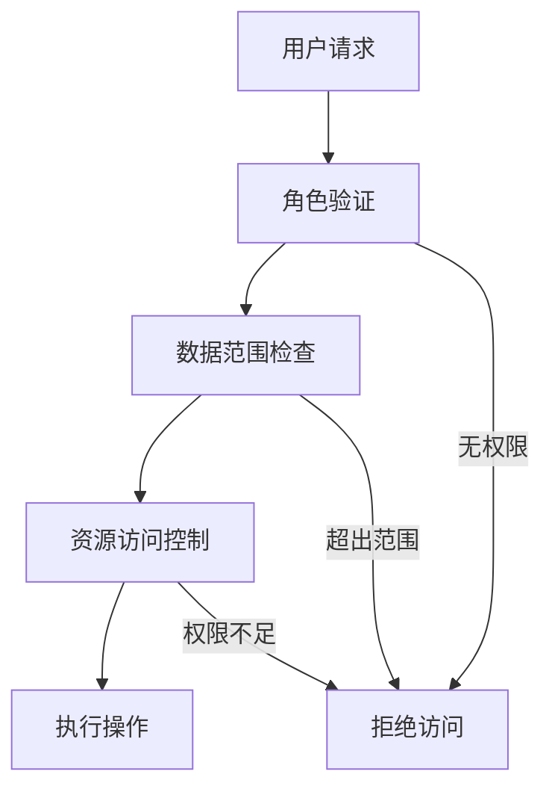
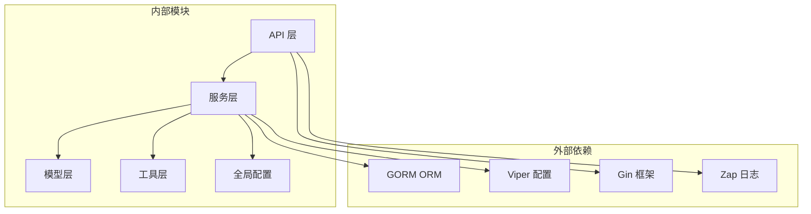
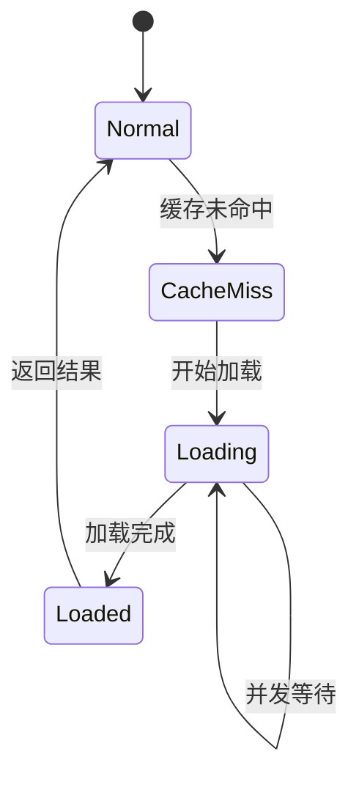

# 测试用例管理服务

<cite>
**本文档引用的文件**
- [server/model/example/exa_customer.go](file://server/model/example/exa_customer.go)
- [server/service/example/exa_customer.go](file://server/service/example/exa_customer.go)
- [server/api/v1/example/exa_customer.go](file://server/api/v1/example/exa_customer.go)
- [server/router/example/exa_customer.go](file://server/router/example/exa_customer.go)
- [server/model/example/response/exa_customer.go](file://server/model/example/response/exa_customer.go)
- [server/model/common/request/common.go](file://server/model/common/request/common.go)
- [server/model/system/sys_authority.go](file://server/model/system/sys_authority.go)
- [server/service/system/sys_authority.go](file://server/service/system/sys_authority.go)
- [server/utils/validator.go](file://server/utils/validator.go)
- [server/utils/verify.go](file://server/utils/verify.go)
- [server/global/global.go](file://server/global/global.go)
- [server/model/common/response/common.go](file://server/model/common/response/common.go)
- [server/model/system/sys_user.go](file://server/model/system/sys_user.go)
- [web/src/api/customer.js](file://web/src/api/customer.js)
</cite>

## 目录
1. [简介](#简介)
2. [项目结构](#项目结构)
3. [核心组件](#核心组件)
4. [架构概览](#架构概览)
5. [详细组件分析](#详细组件分析)
6. [依赖分析](#依赖分析)
7. [性能考虑](#性能考虑)
8. [故障排除指南](#故障排除指南)
9. [最佳实践](#最佳实践)
10. [结论](#结论)

## 简介

测试用例管理服务是一个基于 Gin-Vue-Admin 框架构建的企业级测试管理平台的核心模块。该服务提供了完整的测试用例生命周期管理功能，包括测试用例的创建、编辑、删除、查询等核心操作。系统采用分层架构设计，通过 API 层、服务层、数据访问层的清晰分离，实现了高内聚低耦合的代码组织结构。

本服务特别注重数据安全性和权限控制，通过基于角色的访问控制（RBAC）机制，确保用户只能访问其权限范围内的测试用例数据。同时，系统支持分页查询、数据范围控制和预加载机制，为大规模数据场景提供了高效的解决方案。

## 项目结构

测试用例管理服务遵循典型的三层架构模式，主要包含以下层次：



**图表来源**
- [server/api/v1/example/exa_customer.go:1-177](file://server/api/v1/example/exa_customer.go#L1-L177)
- [server/service/example/exa_customer.go:1-88](file://server/service/example/exa_customer.go#L1-L88)
- [server/model/example/exa_customer.go:1-16](file://server/model/example/exa_customer.go#L1-L16)

**章节来源**
- [server/api/v1/example/exa_customer.go:1-177](file://server/api/v1/example/exa_customer.go#L1-L177)
- [server/service/example/exa_customer.go:1-88](file://server/service/example/exa_customer.go#L1-L88)
- [server/router/example/exa_customer.go:1-23](file://server/router/example/exa_customer.go#L1-L23)

## 核心组件

### 数据模型层

测试用例管理服务的核心数据模型是 `ExaCustomer` 结构体，它定义了测试用例的基本属性和业务含义：



**图表来源**
- [server/model/example/exa_customer.go:8-15](file://server/model/example/exa_customer.go#L8-L15)
- [server/model/system/sys_user.go:20-34](file://server/model/system/sys_user.go#L20-L34)

### 服务层组件

服务层通过 `CustomerService` 结构体提供核心业务逻辑，包含以下关键方法：

| 方法名 | 功能描述 | 参数 | 返回值 |
|--------|----------|------|--------|
| CreateExaCustomer | 创建测试用例 | ExaCustomer | error |
| DeleteExaCustomer | 删除测试用例 | ExaCustomer | error |
| UpdateExaCustomer | 更新测试用例 | *ExaCustomer | error |
| GetExaCustomer | 获取单个测试用例 | uint | (ExaCustomer, error) |
| GetCustomerInfoList | 分页获取测试用例列表 | (uint, PageInfo) | (interface{}, int64, error) |

**章节来源**
- [server/service/example/exa_customer.go:11-87](file://server/service/example/exa_customer.go#L11-L87)

## 架构概览

测试用例管理服务采用经典的 MVC（Model-View-Controller）架构模式，通过清晰的职责分离实现松耦合的设计：



**图表来源**
- [server/api/v1/example/exa_customer.go:25-46](file://server/api/v1/example/exa_customer.go#L25-L46)
- [server/service/example/exa_customer.go:65-87](file://server/service/example/exa_customer.go#L65-L87)

## 详细组件分析

### CustomerService 结构体设计

`CustomerService` 是测试用例管理的核心服务类，采用单例模式设计，确保在整个应用生命周期内只有一个实例：

```mermaid
classDiagram
class CustomerService {
+CreateExaCustomer(e ExaCustomer) error
+DeleteExaCustomer(e ExaCustomer) error
+UpdateExaCustomer(e *ExaCustomer) error
+GetExaCustomer(id uint) (ExaCustomer, error)
+GetCustomerInfoList(sysUserAuthorityID uint, info PageInfo) (list interface{}, total int64, err error)
}
class AuthorityService {
+GetAuthorityInfo(auth SysAuthority) (SysAuthority, error)
+GetStructAuthorityList(authorityID uint) ([]uint, error)
}
CustomerService --> AuthorityService : 使用
```

**图表来源**
- [server/service/example/exa_customer.go:11-13](file://server/service/example/exa_customer.go#L11-L13)
- [server/service/system/sys_authority.go:24-26](file://server/service/system/sys_authority.go#L24-L26)

#### CreateExaCustomer 方法实现

创建测试用例的方法实现了完整的数据持久化流程：



**图表来源**
- [server/service/example/exa_customer.go:21-24](file://server/service/example/exa_customer.go#L21-L24)
- [server/api/v1/example/exa_customer.go:25-46](file://server/api/v1/example/exa_customer.go#L25-L46)

#### GetCustomerInfoList 方法详解

分页查询功能是系统的核心特性之一，实现了复杂的数据权限控制：



**图表来源**
- [server/service/example/exa_customer.go:65-87](file://server/service/example/exa_customer.go#L65-L87)

**章节来源**
- [server/service/example/exa_customer.go:21-87](file://server/service/example/exa_customer.go#L21-L87)

### API 层实现

API 层负责处理 HTTP 请求和响应，提供了完整的 RESTful 接口：



**图表来源**
- [server/api/v1/example/exa_customer.go:25-46](file://server/api/v1/example/exa_customer.go#L25-L46)

**章节来源**
- [server/api/v1/example/exa_customer.go:16-177](file://server/api/v1/example/exa_customer.go#L16-L177)

### 数据模型详解

#### ExaCustomer 数据模型

测试用例数据模型定义了完整的测试用例属性：

| 字段名 | 类型 | 描述 | 约束条件 |
|--------|------|------|----------|
| ID | uint | 测试用例唯一标识 | 主键，自增 |
| CreatedAt | datetime | 创建时间 | 自动设置 |
| UpdatedAt | datetime | 更新时间 | 自动更新 |
| DeletedAt | *time.Time | 删除时间 | 软删除标记 |
| CustomerName | string | 客户名称 | 非空，最大长度限制 |
| CustomerPhoneData | string | 客户手机号 | 非空，格式验证 |
| SysUserID | uint | 管理用户ID | 外键约束 |
| SysUserAuthorityID | uint | 管理角色ID | 外键约束 |
| SysUser | SysUser | 管理用户详情 | 关联查询 |

**章节来源**
- [server/model/example/exa_customer.go:8-15](file://server/model/example/exa_customer.go#L8-L15)

#### 权限控制机制

系统通过多层权限控制确保数据安全：



**图表来源**
- [server/service/example/exa_customer.go:65-87](file://server/service/example/exa_customer.go#L65-L87)
- [server/service/system/sys_authority.go:266-269](file://server/service/system/sys_authority.go#L266-L269)

**章节来源**
- [server/model/system/sys_authority.go:7-19](file://server/model/system/sys_authority.go#L7-L19)
- [server/service/system/sys_authority.go:266-269](file://server/service/system/sys_authority.go#L266-L269)

## 依赖分析

测试用例管理服务的依赖关系体现了清晰的分层架构：



**图表来源**
- [server/api/v1/example/exa_customer.go:3-12](file://server/api/v1/example/exa_customer.go#L3-L12)
- [server/service/example/exa_customer.go:3-9](file://server/service/example/exa_customer.go#L3-L9)

**章节来源**
- [server/global/global.go:25-42](file://server/global/global.go#L25-L42)

## 性能考虑

### 查询优化策略

系统采用了多种查询优化技术：

1. **预加载机制**：使用 `Preload("SysUser")` 避免 N+1 查询问题
2. **分页查询**：通过 `Limit()` 和 `Offset()` 实现高效分页
3. **索引优化**：关键字段建立适当的数据库索引
4. **批量操作**：支持批量删除和更新操作

### 缓存策略

系统集成了 Redis 缓存机制，用于存储热点数据：

- 用户权限信息缓存
- 配置数据缓存
- 频繁访问的查询结果缓存

### 并发控制

通过 `singleflight` 机制避免缓存击穿和并发竞争：



## 故障排除指南

### 常见错误及解决方案

| 错误类型 | 错误代码 | 可能原因 | 解决方案 |
|----------|----------|----------|----------|
| 参数验证错误 | 400 | 输入参数不符合验证规则 | 检查前端表单验证和后端验证规则 |
| 权限不足 | 403 | 用户权限不足以访问数据 | 检查用户角色和数据范围设置 |
| 数据库连接错误 | 500 | 数据库连接异常 | 检查数据库配置和连接池设置 |
| 业务逻辑错误 | 500 | 业务处理过程中发生异常 | 查看日志文件定位具体错误位置 |

### 调试技巧

1. **启用详细日志**：在开发环境中启用调试模式
2. **使用断点调试**：在关键业务逻辑处设置断点
3. **数据库查询跟踪**：监控 SQL 查询执行情况
4. **性能分析**：使用性能分析工具识别瓶颈

**章节来源**
- [server/utils/validator.go:118-165](file://server/utils/validator.go#L118-L165)

## 最佳实践

### 代码组织规范

1. **命名约定**：采用 Go 语言标准的命名约定
2. **错误处理**：统一的错误处理模式和错误码定义
3. **接口设计**：清晰的接口定义和实现分离
4. **文档注释**：完整的函数和方法注释

### 安全最佳实践

1. **输入验证**：所有外部输入必须经过严格验证
2. **权限控制**：基于角色的细粒度权限控制
3. **SQL 注入防护**：使用 GORM 的参数绑定防止注入攻击
4. **敏感数据保护**：对密码等敏感信息进行加密存储

### 性能优化建议

1. **数据库索引**：为常用查询字段建立合适的索引
2. **查询优化**：避免 N+1 查询问题，合理使用预加载
3. **缓存策略**：合理使用缓存减少数据库压力
4. **连接池配置**：根据业务需求调整数据库连接池大小

### 扩展方法

1. **插件化架构**：支持通过插件扩展新功能
2. **配置驱动**：通过配置文件灵活调整系统行为
3. **API 版本控制**：支持 API 版本演进和向后兼容
4. **监控告警**：集成监控系统及时发现和解决问题

## 结论

测试用例管理服务是一个设计精良、功能完善的测试管理平台核心模块。通过采用分层架构、严格的权限控制和高效的查询机制，系统能够满足企业级测试管理的各种需求。

系统的主要优势包括：
- 清晰的架构设计和职责分离
- 完善的权限控制和数据安全机制
- 高效的查询优化和缓存策略
- 易于扩展和维护的代码结构

未来可以进一步优化的方向包括：
- 增强实时协作功能
- 支持更复杂的测试场景管理
- 提供更丰富的报表和分析功能
- 集成更多的第三方测试工具和服务

通过持续的改进和优化，测试用例管理服务将成为企业测试管理的重要基础设施。