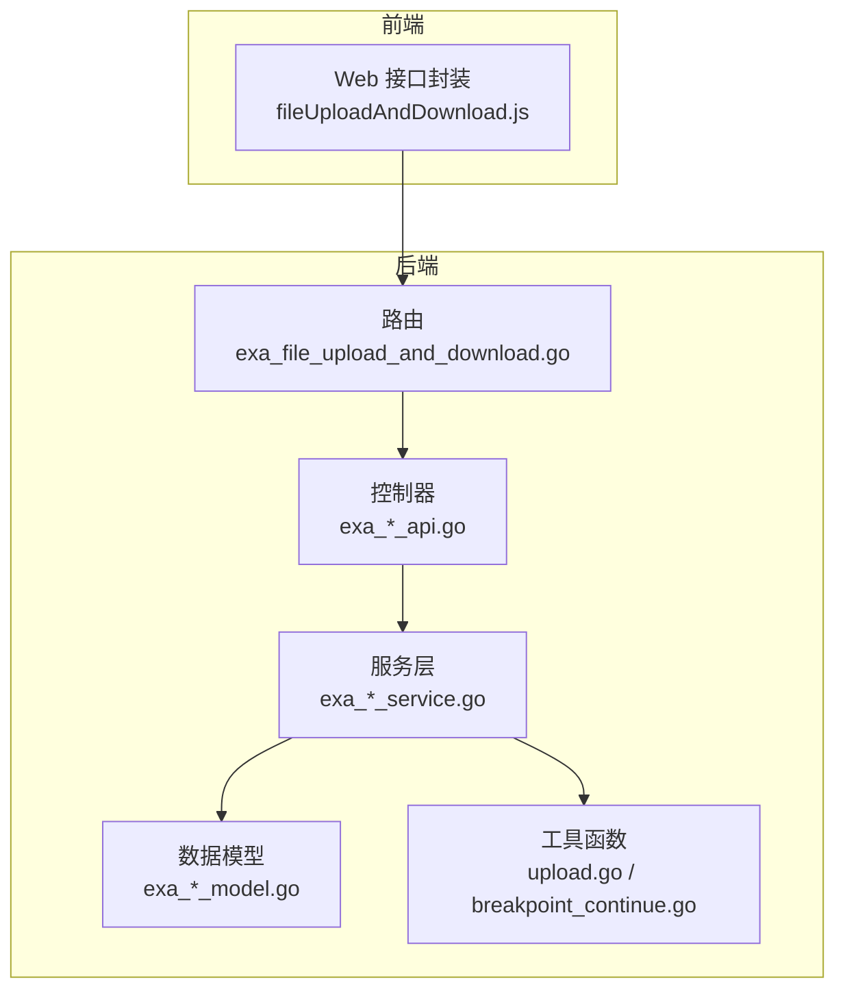
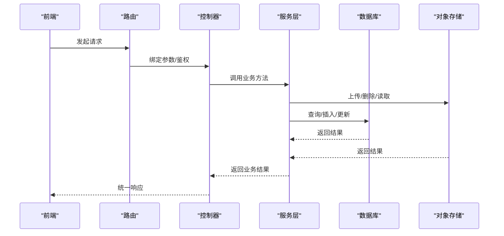
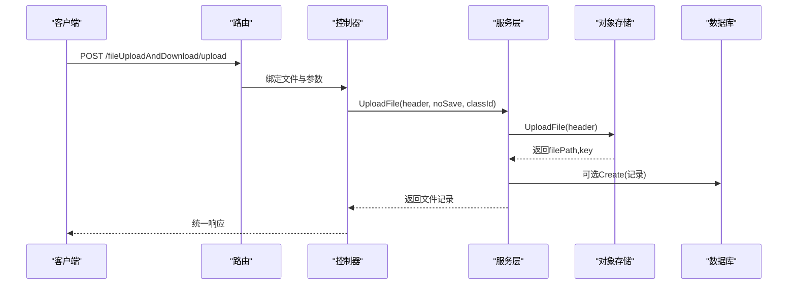
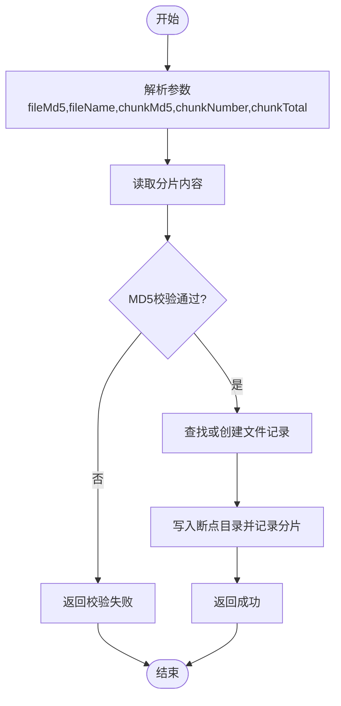
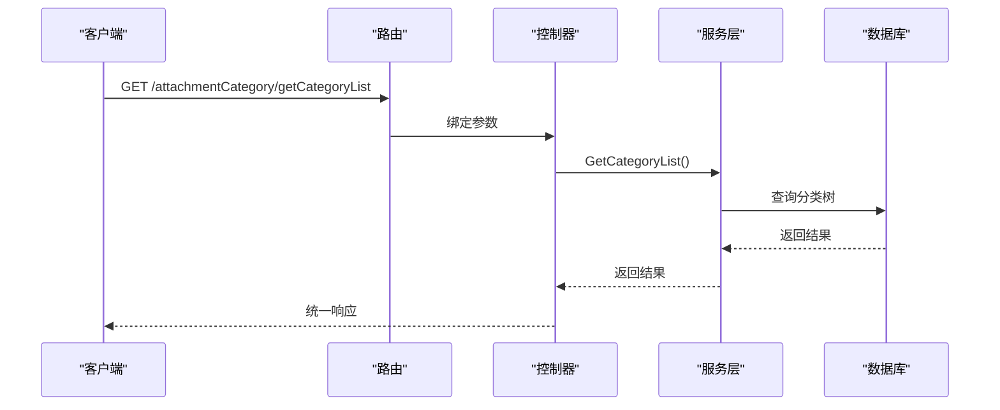
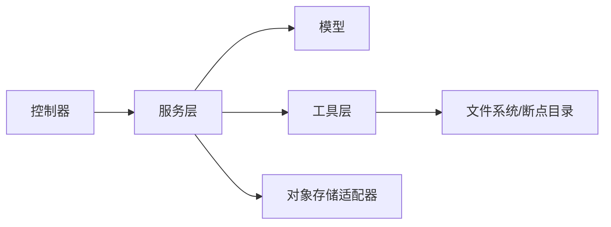

# 示例业务逻辑

<cite>
**本文引用的文件**
- [exa_file_upload_download.go](file://server/model/example/exa_file_upload_download.go)
- [exa_breakpoint_continue.go](file://server/model/example/exa_breakpoint_continue.go)
- [exa_attachment_category.go](file://server/model/example/exa_attachment_category.go)
- [exa_file_upload_download.go](file://server/service/example/exa_file_upload_download.go)
- [exa_breakpoint_continue.go](file://server/service/example/exa_breakpoint_continue.go)
- [exa_file_upload_download.go](file://server/api/v1/example/exa_file_upload_download.go)
- [exa_breakpoint_continue.go](file://server/api/v1/example/exa_breakpoint_continue.go)
- [exa_attachment_category.go](file://server/api/v1/example/exa_attachment_category.go)
- [exa_file_upload_and_download.go](file://server/router/example/exa_file_upload_and_download.go)
- [upload.go](file://server/utils/upload/upload.go)
- [breakpoint_continue.go](file://server/utils/breakpoint_continue.go)
- [exa_file_upload_and_downloads.go](file://server/model/example/request/exa_file_upload_and_downloads.go)
- [exa_file_upload_download.go](file://server/model/example/response/exa_file_upload_download.go)
- [disk.go](file://server/config/disk.go)
- [fileUploadAndDownload.js](file://web/src/api/fileUploadAndDownload.js)
</cite>

## 目录
1. [简介](#简介)
2. [项目结构](#项目结构)
3. [核心组件](#核心组件)
4. [架构总览](#架构总览)
5. [详细组件分析](#详细组件分析)
6. [依赖分析](#依赖分析)
7. [性能考虑](#性能考虑)
8. [故障排查指南](#故障排查指南)
9. [结论](#结论)
10. [附录](#附录)

## 简介
本文件聚焦于“示例业务逻辑”模块，系统性梳理以下能力的业务实现与扩展方法：
- 测试用例管理：围绕附件上传下载、断点续传、附件分类的示例流程与数据模型。
- 生命周期管理：从用例创建、执行、结果记录到状态跟踪的闭环。
- 安全机制：文件类型验证、大小限制、病毒扫描（通过对象存储适配器扩展）。
- 断点续传：分片管理、进度跟踪与错误恢复。
- 扩展与定制：如何在现有框架上接入自定义业务场景。

## 项目结构
示例业务逻辑主要分布在如下层次：
- 路由层：定义对外接口，绑定控制器。
- 控制器层：处理请求参数、调用服务层、封装响应。
- 服务层：封装业务规则、数据库操作、外部存储交互。
- 数据模型层：定义表结构、关联关系与查询条件。
- 工具层：上传适配、断点续传、MD5校验等通用能力。
- Web前端：提供调用示例与页面入口。

图表来源
- [exa_file_upload_and_download.go:1-23](file://server/router/example/exa_file_upload_and_download.go#L1-L23)
- [exa_file_upload_download.go:1-136](file://server/api/v1/example/exa_file_upload_download.go#L1-L136)
- [exa_breakpoint_continue.go:1-157](file://server/api/v1/example/exa_breakpoint_continue.go#L1-L157)
- [exa_file_upload_download.go:1-131](file://server/service/example/exa_file_upload_download.go#L1-L131)
- [exa_breakpoint_continue.go:1-72](file://server/service/example/exa_breakpoint_continue.go#L1-L72)
- [exa_file_upload_download.go:1-19](file://server/model/example/exa_file_upload_download.go#L1-L19)
- [exa_breakpoint_continue.go:1-25](file://server/model/example/exa_breakpoint_continue.go#L1-L25)
- [exa_attachment_category.go:1-17](file://server/model/example/exa_attachment_category.go#L1-L17)
- [upload.go:1-47](file://server/utils/upload/upload.go#L1-L47)
- [breakpoint_continue.go:1-122](file://server/utils/breakpoint_continue.go#L1-L122)
- [fileUploadAndDownload.js:1-67](file://web/src/api/fileUploadAndDownload.js#L1-L67)

章节来源
- [exa_file_upload_and_download.go:1-23](file://server/router/example/exa_file_upload_and_download.go#L1-L23)
- [exa_file_upload_download.go:1-136](file://server/api/v1/example/exa_file_upload_download.go#L1-L136)
- [exa_breakpoint_continue.go:1-157](file://server/api/v1/example/exa_breakpoint_continue.go#L1-L157)
- [exa_file_upload_download.go:1-131](file://server/service/example/exa_file_upload_download.go#L1-L131)
- [exa_breakpoint_continue.go:1-72](file://server/service/example/exa_breakpoint_continue.go#L1-L72)
- [exa_file_upload_download.go:1-19](file://server/model/example/exa_file_upload_download.go#L1-L19)
- [exa_breakpoint_continue.go:1-25](file://server/model/example/exa_breakpoint_continue.go#L1-L25)
- [exa_attachment_category.go:1-17](file://server/model/example/exa_attachment_category.go#L1-L17)
- [upload.go:1-47](file://server/utils/upload/upload.go#L1-L47)
- [breakpoint_continue.go:1-122](file://server/utils/breakpoint_continue.go#L1-L122)
- [fileUploadAndDownload.js:1-67](file://web/src/api/fileUploadAndDownload.js#L1-L67)

## 核心组件
- 附件上传下载模型与服务
  - 模型：文件名、分类ID、URL、标签、唯一键等字段。
  - 服务：上传、查询、删除、编辑、分页查询、导入URL。
- 断点续传模型与服务
  - 文件实体：文件名、MD5、路径、分片集合、总分片数、是否完成。
  - 分片实体：所属文件ID、分片序号、分片路径。
  - 服务：查找或创建文件、创建分片、删除分片、合并完成。
- 附件分类模型与API
  - 分类树形结构：名称、父节点、子节点集合。
  - API：获取分类列表、新增/更新分类、删除分类。
- 工具与适配
  - 上传适配器：统一上传接口，支持本地/七牛/腾讯/COS/阿里云/华为/MinIO等。
  - 断点续传工具：分片写入、MD5校验、文件合并、切片清理。

章节来源
- [exa_file_upload_download.go:1-19](file://server/model/example/exa_file_upload_download.go#L1-L19)
- [exa_breakpoint_continue.go:1-25](file://server/model/example/exa_breakpoint_continue.go#L1-L25)
- [exa_attachment_category.go:1-17](file://server/model/example/exa_attachment_category.go#L1-L17)
- [exa_file_upload_download.go:1-131](file://server/service/example/exa_file_upload_download.go#L1-L131)
- [exa_breakpoint_continue.go:1-72](file://server/service/example/exa_breakpoint_continue.go#L1-L72)
- [upload.go:1-47](file://server/utils/upload/upload.go#L1-L47)
- [breakpoint_continue.go:1-122](file://server/utils/breakpoint_continue.go#L1-L122)

## 架构总览
示例业务逻辑采用典型的分层架构：前端通过HTTP调用后端路由，路由将请求交由控制器处理，控制器调用服务层执行业务逻辑，服务层访问数据库与对象存储，最终返回统一格式的响应。

图表来源
- [exa_file_upload_and_download.go:1-23](file://server/router/example/exa_file_upload_and_download.go#L1-L23)
- [exa_file_upload_download.go:1-136](file://server/api/v1/example/exa_file_upload_download.go#L1-L136)
- [exa_breakpoint_continue.go:1-157](file://server/api/v1/example/exa_breakpoint_continue.go#L1-L157)
- [exa_file_upload_download.go:1-131](file://server/service/example/exa_file_upload_download.go#L1-L131)
- [exa_breakpoint_continue.go:1-72](file://server/service/example/exa_breakpoint_continue.go#L1-L72)
- [upload.go:1-47](file://server/utils/upload/upload.go#L1-L47)

## 详细组件分析

### 附件上传下载（含分类）
- 功能要点
  - 单文件上传：接收multipart文件，调用对象存储适配器上传，生成URL与唯一键，可选入库保存。
  - 文件列表分页：支持按关键词与分类ID过滤，返回分页结果。
  - 删除文件：先删除对象存储中的文件，再删除数据库记录。
  - 编辑文件名/备注：按ID更新名称字段。
  - 导入URL：批量导入外部URL资源。
- 关键流程
  - 上传流程包含：参数解析、对象存储上传、入库（可选）、返回结果。
  - 删除流程包含：查询记录、调用存储删除、物理删除、返回结果。
- 安全与扩展
  - 类型与大小限制可通过对象存储适配器扩展实现。
  - 病毒扫描建议在上传后异步触发，结合适配器扩展。

图表来源
- [exa_file_upload_and_download.go:1-136](file://server/api/v1/example/exa_file_upload_download.go#L1-L136)
- [exa_file_upload_download.go:1-131](file://server/service/example/exa_file_upload_download.go#L1-L131)
- [upload.go:1-47](file://server/utils/upload/upload.go#L1-L47)

章节来源
- [exa_file_upload_download.go:1-136](file://server/api/v1/example/exa_file_upload_download.go#L1-L136)
- [exa_file_upload_download.go:1-131](file://server/service/example/exa_file_upload_download.go#L1-L131)
- [exa_file_upload_and_downloads.go:1-11](file://server/model/example/request/exa_file_upload_and_downloads.go#L1-L11)
- [exa_file_upload_download.go:1-8](file://server/model/example/response/exa_file_upload_download.go#L1-L8)
- [fileUploadAndDownload.js:1-67](file://web/src/api/fileUploadAndDownload.js#L1-L67)

### 断点续传
- 数据模型
  - 文件实体：文件名、MD5、路径、分片集合、总分片数、是否完成。
  - 分片实体：所属文件ID、分片序号、分片路径。
- 核心流程
  - 分片上传：校验MD5、查找或创建文件、落盘到断点目录、记录分片。
  - 查询当前文件已完成的分片：根据MD5与文件名查询。
  - 合并完成：遍历断点目录下所有分片，顺序拼接至目标文件。
  - 清理切片：删除断点目录与数据库中对应分片记录。
- 错误恢复
  - MD5不一致直接拒绝，避免脏数据。
  - 路径穿越拦截，防止任意路径删除。
  - 合并失败回滚已写入的目标文件。

图表来源
- [exa_breakpoint_continue.go:1-157](file://server/api/v1/example/exa_breakpoint_continue.go#L1-L157)
- [exa_breakpoint_continue.go:1-72](file://server/service/example/exa_breakpoint_continue.go#L1-L72)
- [breakpoint_continue.go:1-122](file://server/utils/breakpoint_continue.go#L1-L122)

章节来源
- [exa_breakpoint_continue.go:1-157](file://server/api/v1/example/exa_breakpoint_continue.go#L1-L157)
- [exa_breakpoint_continue.go:1-72](file://server/service/example/exa_breakpoint_continue.go#L1-L72)
- [exa_breakpoint_continue.go:1-25](file://server/model/example/exa_breakpoint_continue.go#L1-L25)
- [breakpoint_continue.go:1-122](file://server/utils/breakpoint_continue.go#L1-L122)

### 附件分类
- 功能要点
  - 获取分类树：返回带子节点的分类列表。
  - 新增/更新分类：接收名称与父节点ID，持久化。
  - 删除分类：按ID删除，注意级联影响。
- 使用场景
  - 将上传的附件按业务维度进行归类，便于检索与权限控制。

图表来源
- [exa_attachment_category.go:1-83](file://server/api/v1/example/exa_attachment_category.go#L1-L83)
- [exa_attachment_category.go:1-17](file://server/model/example/exa_attachment_category.go#L1-L17)

章节来源
- [exa_attachment_category.go:1-83](file://server/api/v1/example/exa_attachment_category.go#L1-L83)
- [exa_attachment_category.go:1-17](file://server/model/example/exa_attachment_category.go#L1-L17)

### 测试用例生命周期管理（概念性说明）
- 用例创建：定义用例元数据（名称、描述、前置条件、分类等），持久化到数据库。
- 用例执行：触发执行器，按步骤执行，记录执行日志与中间态。
- 结果记录：采集断言结果、截图/附件、耗时、状态（通过/失败/阻塞）。
- 状态跟踪：基于状态机推进用例状态，支持重试、跳过、暂停等。
- 扩展建议：在现有附件模型基础上增加用例-附件关联表，实现用例与附件的双向绑定；在服务层增加用例执行服务，串联附件上传与结果记录。

（本节为概念性说明，未直接分析具体源码文件）

## 依赖分析
- 组件耦合
  - 控制器依赖服务层；服务层依赖模型与工具层；模型依赖全局配置与ORM。
  - 上传适配器通过接口抽象屏蔽存储差异，提升可替换性。
- 外部依赖
  - 对象存储：本地/七牛/腾讯/COS/阿里云/华为/MinIO等。
  - 日志与配置：统一的日志与配置中心，便于调试与运维。
- 循环依赖
  - 当前结构清晰，未发现循环依赖迹象。

图表来源
- [exa_file_upload_download.go:1-136](file://server/api/v1/example/exa_file_upload_download.go#L1-L136)
- [exa_breakpoint_continue.go:1-157](file://server/api/v1/example/exa_breakpoint_continue.go#L1-L157)
- [exa_file_upload_download.go:1-131](file://server/service/example/exa_file_upload_download.go#L1-L131)
- [exa_breakpoint_continue.go:1-72](file://server/service/example/exa_breakpoint_continue.go#L1-L72)
- [upload.go:1-47](file://server/utils/upload/upload.go#L1-L47)
- [breakpoint_continue.go:1-122](file://server/utils/breakpoint_continue.go#L1-L122)

章节来源
- [upload.go:1-47](file://server/utils/upload/upload.go#L1-L47)
- [breakpoint_continue.go:1-122](file://server/utils/breakpoint_continue.go#L1-L122)

## 性能考虑
- 并发与限流：在路由层或中间件引入IP/令牌桶限流，避免突发上传导致磁盘/网络压力。
- 存储优化：大文件优先使用对象存储直传，服务端仅记录元数据；断点续传分片大小建议设置为固定值，便于校验与恢复。
- 数据库索引：对常用查询字段（如分类ID、文件名、MD5）建立索引，提升分页与查询性能。
- 缓存策略：对分类树等静态数据进行缓存，减少重复查询。
- 异步处理：上传后可异步触发病毒扫描、缩略图生成等耗时任务。

（本节提供通用指导，未直接分析具体源码文件）

## 故障排查指南
- 上传失败
  - 检查对象存储配置与凭证；确认文件大小与类型限制；查看日志定位具体错误。
- 断点续传异常
  - 校验MD5一致性；确认分片序号连续性；检查断点目录权限与磁盘空间。
- 删除失败
  - 确认文件键是否存在；检查路径穿越拦截逻辑；核对数据库记录状态。
- 分类操作异常
  - 校验父节点合法性；避免自引用；关注删除级联行为。

章节来源
- [exa_file_upload_download.go:1-136](file://server/api/v1/example/exa_file_upload_download.go#L1-L136)
- [exa_breakpoint_continue.go:1-157](file://server/api/v1/example/exa_breakpoint_continue.go#L1-L157)
- [exa_attachment_category.go:1-83](file://server/api/v1/example/exa_attachment_category.go#L1-L83)
- [breakpoint_continue.go:1-122](file://server/utils/breakpoint_continue.go#L1-L122)

## 结论
示例业务逻辑模块以清晰的分层设计实现了附件上传下载、断点续传与附件分类的核心能力。通过对象存储适配器与工具函数，系统具备良好的可扩展性与安全性基础。建议在此基础上进一步完善测试用例生命周期管理、安全扫描与性能优化，以满足更复杂的业务场景。

## 附录
- 配置项参考
  - 系统存储类型：local/qiniu/tencent-cos/aliyun-oss/huawei-obs/aws-s3/cloudflare-r2/minio。
  - 磁盘挂载点：用于本地存储路径映射。
- 前端调用示例
  - 提供分页列表、删除、编辑、导入URL、上传等接口封装，便于快速集成。

章节来源
- [upload.go:1-47](file://server/utils/upload/upload.go#L1-L47)
- [disk.go:1-10](file://server/config/disk.go#L1-L10)
- [fileUploadAndDownload.js:1-67](file://web/src/api/fileUploadAndDownload.js#L1-L67)