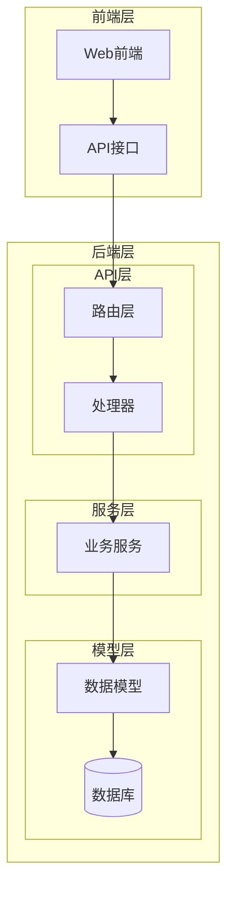
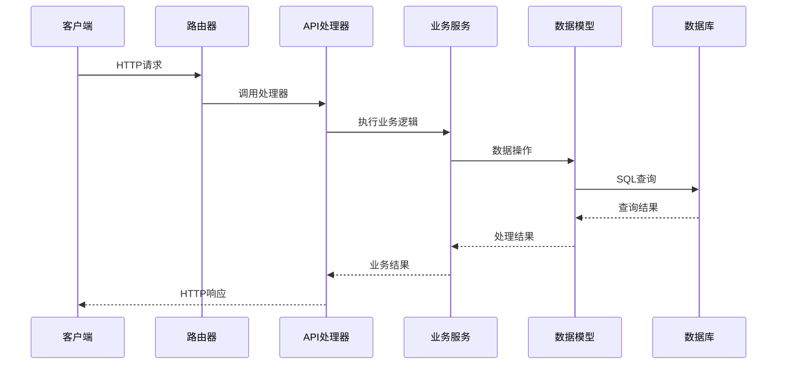
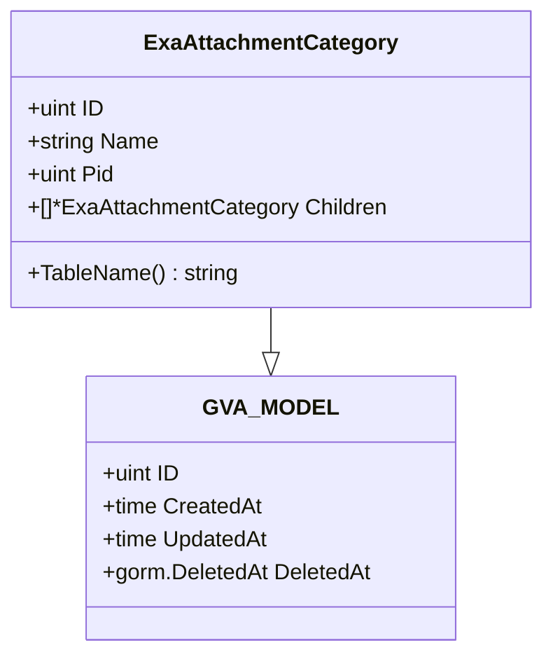
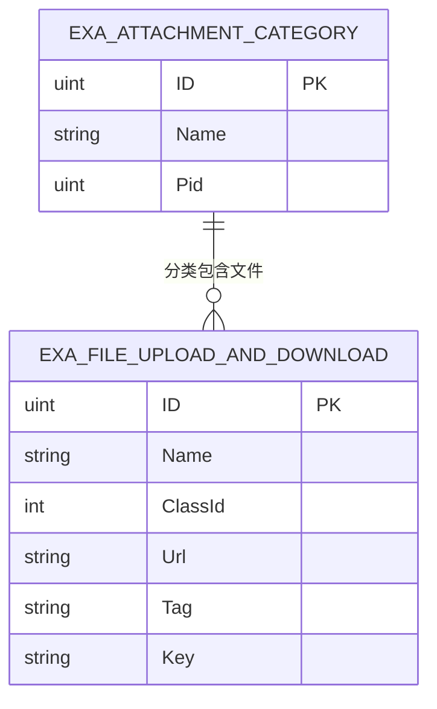
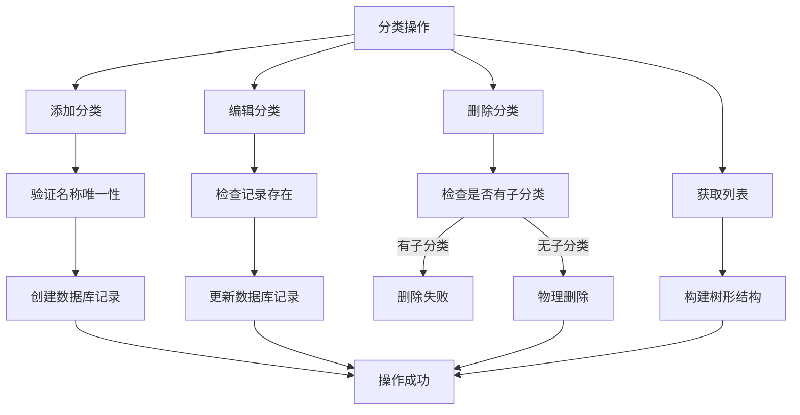
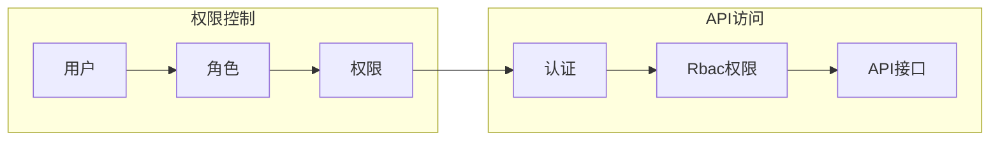
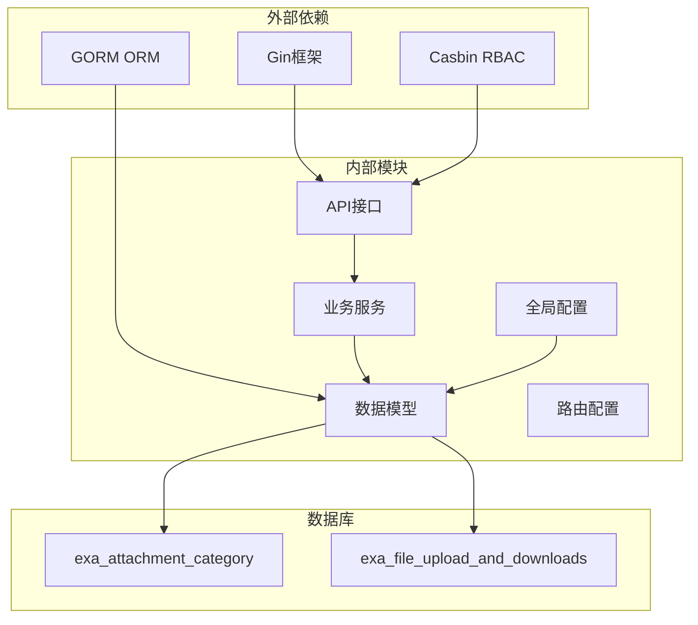

# 附件分类服务

<cite>
**本文档引用的文件**
- [exa_attachment_category.go](file://server/model/example/exa_attachment_category.go)
- [exa_file_upload_download.go](file://server/model/example/exa_file_upload_download.go)
- [exa_attachment_category.go](file://server/service/example/exa_attachment_category.go)
- [exa_attachment_category.go](file://server/api\v1\example\exa_attachment_category.go)
- [exa_attachment_category.go](file://server/router\example\exa_attachment_category.go)
- [attachmentCategory.js](file://web/src/api/attachmentCategory.js)
- [ensure_tables.go](file://server/initialize/ensure_tables.go)
- [model.go](file://server/global/model.go)
- [api.go](file://server/source/system/api.go)
- [casbin.go](file://server/source/system/casbin.go)
</cite>

## 目录
1. [简介](#简介)
2. [项目结构](#项目结构)
3. [核心组件](#核心组件)
4. [架构概览](#架构概览)
5. [详细组件分析](#详细组件分析)
6. [依赖分析](#依赖分析)
7. [性能考虑](#性能考虑)
8. [故障排除指南](#故障排除指南)
9. [最佳实践](#最佳实践)
10. [结论](#结论)

## 简介

附件分类服务是测试管理平台中的一个核心功能模块，负责管理附件文件的分类体系。该服务实现了完整的分类管理功能，包括分类的增删改查操作、树形结构维护、以及附件与分类的关联管理。

该系统采用典型的三层架构设计：API层负责请求处理和响应封装，Service层实现业务逻辑，Model层定义数据结构和数据库映射。通过这种分层设计，系统实现了良好的代码组织和职责分离。

## 项目结构

附件分类服务在项目中的组织结构如下：



**图表来源**
- [exa_attachment_category.go:1-17](file://server/router/example/exa_attachment_category.go#L1-L17)
- [exa_attachment_category.go:1-83](file://server/api\v1\example\exa_attachment_category.go#L1-L83)

**章节来源**
- [exa_attachment_category.go:1-17](file://server/router/example/exa_attachment_category.go#L1-L17)
- [exa_attachment_category.go:1-83](file://server/api\v1\example\exa_attachment_category.go#L1-L83)
- [exa_attachment_category.go:1-67](file://server/service/example/exa_attachment_category.go#L1-L67)

## 核心组件

附件分类服务由以下核心组件构成：

### 数据模型层
- **ExaAttachmentCategory**: 分类实体模型，包含分类基本信息和树形结构支持
- **ExaFileUploadAndDownload**: 文件上传下载模型，包含分类关联字段

### 业务服务层
- **AttachmentCategoryService**: 分类业务逻辑实现，提供完整的CRUD操作

### 接口层
- **AttachmentCategoryApi**: API接口实现，处理HTTP请求和响应
- **AttachmentCategoryRouter**: 路由配置，定义API访问路径

**章节来源**
- [exa_attachment_category.go:1-17](file://server/model/example/exa_attachment_category.go#L1-L17)
- [exa_file_upload_download.go:1-19](file://server/model/example/exa_file_upload_download.go#L1-L19)
- [exa_attachment_category.go:1-67](file://server/service/example/exa_attachment_category.go#L1-L67)

## 架构概览

附件分类服务采用经典的MVC架构模式，实现了清晰的职责分离：



**图表来源**
- [exa_attachment_category.go:9-16](file://server/router/example/exa_attachment_category.go#L9-L16)
- [exa_attachment_category.go:21-28](file://server/api\v1\example\exa_attachment_category.go#L21-L28)

## 详细组件分析

### 数据模型设计

#### 分类实体模型
ExaAttachmentCategory模型定义了附件分类的核心数据结构：



**图表来源**
- [exa_attachment_category.go:7-12](file://server/model/example/exa_attachment_category.go#L7-L12)
- [model.go:9-14](file://server/global/model.go#L9-L14)

#### 文件关联模型
ExaFileUploadAndDownload模型通过ClassId字段与分类建立关联：



**图表来源**
- [exa_attachment_category.go:14-16](file://server/model/example/exa_attachment_category.go#L14-L16)
- [exa_file_upload_download.go:16-18](file://server/model/example/exa_file_upload_download.go#L16-L18)

**章节来源**
- [exa_attachment_category.go:1-17](file://server/model/example/exa_attachment_category.go#L1-L17)
- [exa_file_upload_download.go:1-19](file://server/model/example/exa_file_upload_download.go#L1-L19)
- [model.go:1-14](file://server/global/model.go#L1-L14)

### 业务逻辑实现

#### 分类树形结构构建
服务层实现了递归算法来构建分类树形结构：

```mermaid
flowchart TD
Start([开始构建树形结构]) --> LoadData[加载所有分类数据]
LoadData --> FindRoot[查找根节点(Pid=0)]
FindRoot --> BuildTree[递归构建子树]
BuildTree --> CheckChild{检查子节点}
CheckChild --> |有子节点| Recurse[递归处理子节点]
CheckChild --> |无子节点| ReturnNode[返回节点]
Recurse --> CheckChild
ReturnNode --> End([完成])
```

**图表来源**
- [exa_attachment_category.go:47-66](file://server/service/example/exa_attachment_category.go#L47-L66)

#### 分类操作流程
系统支持完整的CRUD操作，每种操作都有明确的业务规则：



**图表来源**
- [exa_attachment_category.go:12-44](file://server/service/example/exa_attachment_category.go#L12-L44)

**章节来源**
- [exa_attachment_category.go:1-67](file://server/service/example/exa_attachment_category.go#L1-L67)

### API接口设计

#### RESTful接口规范
系统提供了标准的RESTful API接口：

| 方法 | 路径 | 功能 | 请求参数 | 响应数据 |
|------|------|------|----------|----------|
| GET | /attachmentCategory/getCategoryList | 获取分类列表 | 无 | 分类树形结构 |
| POST | /attachmentCategory/addCategory | 添加/编辑分类 | 分类数据 | 操作结果 |
| POST | /attachmentCategory/deleteCategory | 删除分类 | 分类ID | 操作结果 |

#### 接口安全机制
所有接口都配置了基于Casbin的权限控制：



**图表来源**
- [api.go:246-248](file://server/source/system/api.go#L246-L248)
- [casbin.go](file://server/source/system/casbin.go#L247)

**章节来源**
- [exa_attachment_category.go:14-82](file://server/api\v1\example\exa_attachment_category.go#L14-L82)
- [exa_attachment_category.go:9-16](file://server/router/example/exa_attachment_category.go#L9-L16)
- [api.go:246-248](file://server/source/system/api.go#L246-L248)

## 依赖分析

附件分类服务的依赖关系呈现清晰的层次化结构：



**图表来源**
- [ensure_tables.go:38-76](file://server/initialize/ensure_tables.go#L38-L76)
- [exa_attachment_category.go:14-16](file://server/model/example/exa_attachment_category.go#L14-L16)

**章节来源**
- [ensure_tables.go:1-119](file://server/initialize/ensure_tables.go#L1-L119)

## 性能考虑

### 数据库优化策略
1. **索引设计**: 在Pid字段上建立索引以优化树形查询性能
2. **查询优化**: 使用递归查询减少数据库往返次数
3. **缓存策略**: 对常用的分类树形结构进行缓存

### 内存管理
1. **对象池**: 对频繁创建的分类对象使用对象池技术
2. **延迟加载**: 仅在需要时加载子分类数据
3. **内存回收**: 及时清理不再使用的分类树形结构

### 并发处理
1. **事务管理**: 对分类操作使用数据库事务确保数据一致性
2. **锁机制**: 在高并发场景下使用适当的锁策略
3. **异步处理**: 对耗时的操作采用异步处理方式

## 故障排除指南

### 常见问题及解决方案

#### 分类删除失败
**问题描述**: 尝试删除分类时提示"请先删除子级"
**原因分析**: 分类下存在子分类或关联的附件
**解决方法**: 
1. 先删除所有子分类
2. 清理关联的附件文件
3. 重新执行删除操作

#### 分类名称重复
**问题描述**: 添加分类时报错"分类名称已存在"
**原因分析**: 同级目录下存在相同名称的分类
**解决方法**: 修改分类名称或调整父分类

#### 树形结构异常
**问题描述**: 分类树形显示不正确
**原因分析**: 数据库中存在循环引用或无效的父分类ID
**解决方法**: 
1. 检查数据库中的Pid字段值
2. 修复循环引用关系
3. 重新构建分类树形结构

**章节来源**
- [exa_attachment_category.go:36-44](file://server/service/example/exa_attachment_category.go#L36-L44)

## 最佳实践

### 设计原则
1. **单一职责**: 每个组件只负责特定的功能领域
2. **开闭原则**: 对扩展开放，对修改封闭
3. **依赖倒置**: 高层模块不应该依赖低层模块

### 代码规范
1. **命名约定**: 使用清晰的命名规范，避免缩写
2. **错误处理**: 统一的错误处理机制和错误码定义
3. **日志记录**: 完善的日志记录，便于问题追踪

### 安全考虑
1. **输入验证**: 对所有用户输入进行严格的验证
2. **权限控制**: 实施细粒度的权限控制机制
3. **SQL注入防护**: 使用参数化查询防止SQL注入攻击

### 扩展方法
1. **插件化架构**: 支持通过插件扩展新的分类类型
2. **配置驱动**: 通过配置文件控制分类行为
3. **事件机制**: 实现事件驱动的扩展点

## 结论

附件分类服务通过合理的架构设计和完善的业务逻辑实现，为测试管理平台提供了强大的文件分类管理能力。系统具有以下特点：

1. **模块化设计**: 清晰的分层架构便于维护和扩展
2. **完整的功能**: 支持分类的全生命周期管理
3. **良好的性能**: 优化的查询和缓存策略
4. **安全可靠**: 完善的权限控制和错误处理机制

该服务为后续的功能扩展奠定了坚实的基础，可以轻松地支持更复杂的分类需求和业务场景。