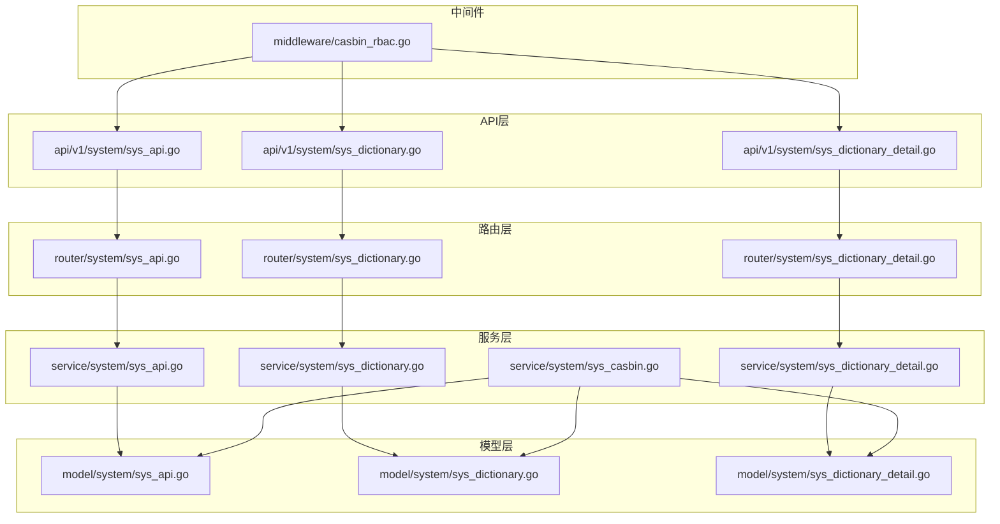
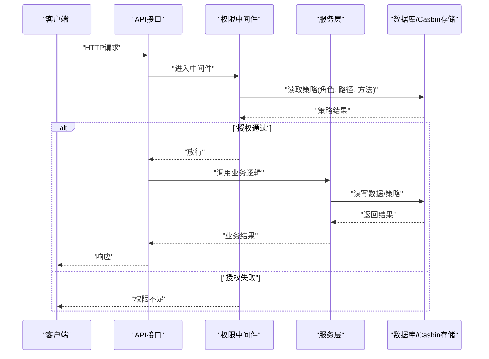
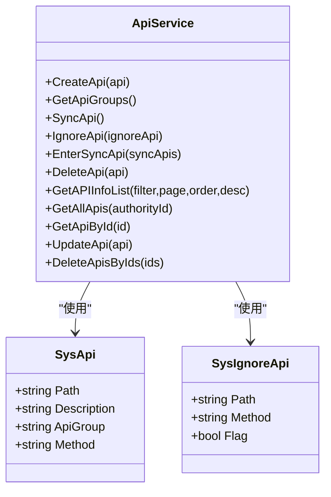
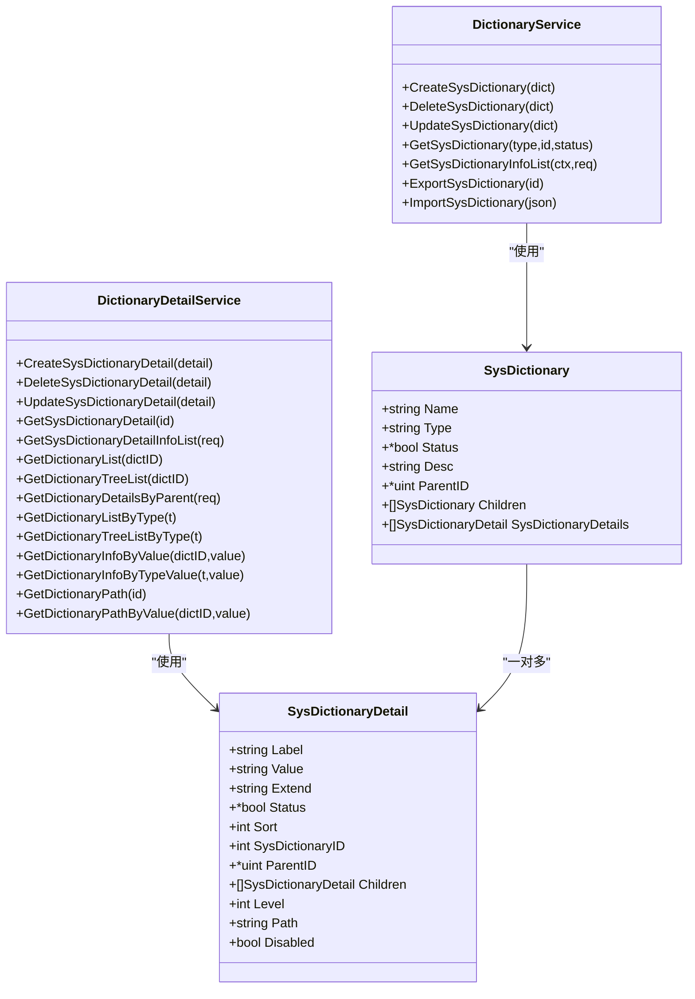
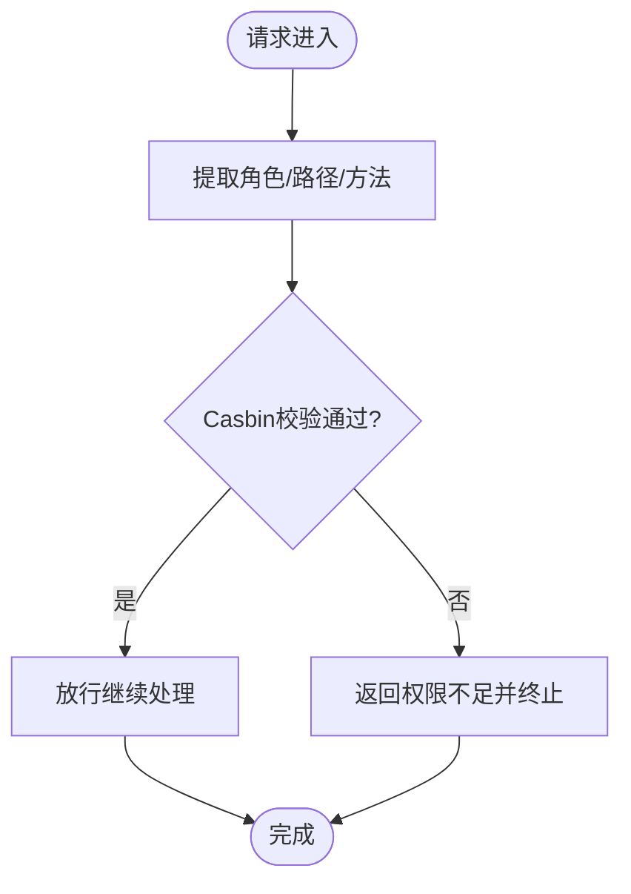
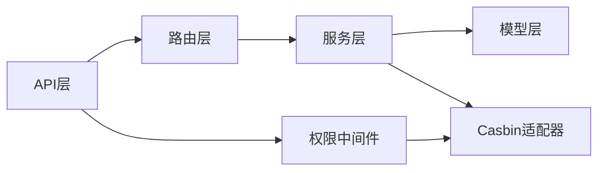

# API与字典服务

<cite>
**本文档引用的文件**
- [server/model/system/sys_api.go](file://server/model/system/sys_api.go)
- [server/model/system/sys_dictionary.go](file://server/model/system/sys_dictionary.go)
- [server/model/system/sys_dictionary_detail.go](file://server/model/system/sys_dictionary_detail.go)
- [server/service/system/sys_api.go](file://server/service/system/sys_api.go)
- [server/service/system/sys_dictionary.go](file://server/service/system/sys_dictionary.go)
- [server/service/system/sys_dictionary_detail.go](file://server/service/system/sys_dictionary_detail.go)
- [server/service/system/sys_casbin.go](file://server/service/system/sys_casbin.go)
- [server/router/system/sys_api.go](file://server/router/system/sys_api.go)
- [server/router/system/sys_dictionary.go](file://server/router/system/sys_dictionary.go)
- [server/router/system/sys_dictionary_detail.go](file://server/router/system/sys_dictionary_detail.go)
- [server/api/v1/system/sys_api.go](file://server/api/v1/system/sys_api.go)
- [server/api/v1/system/sys_dictionary.go](file://server/api/v1/system/sys_dictionary.go)
- [server/api/v1/system/sys_dictionary_detail.go](file://server/api/v1/system/sys_dictionary_detail.go)
- [server/middleware/casbin_rbac.go](file://server/middleware/casbin_rbac.go)
</cite>

## 目录
1. [简介](#简介)
2. [项目结构](#项目结构)
3. [核心组件](#核心组件)
4. [架构总览](#架构总览)
5. [详细组件分析](#详细组件分析)
6. [依赖分析](#依赖分析)
7. [性能考虑](#性能考虑)
8. [故障排除指南](#故障排除指南)
9. [结论](#结论)
10. [附录](#附录)

## 简介
本文件面向“API与字典服务”的设计与实现，围绕以下目标展开：
- API接口管理：接口注册、同步、白名单、权限控制、批量操作与版本化策略
- 系统字典维护：字典类型、字典值、父子层级、排序规则与树形结构
- 权限控制机制：基于Casbin的RBAC策略、接口白名单、访问控制策略
- 缓存与实时更新：策略缓存刷新与前端数据一致性保障
- 扩展能力：自定义字典类型与API接口的开发指南
- 国际化与批量：多语言支持与批量导入导出流程

## 项目结构
后端采用典型的分层架构：API层负责HTTP接口与注解文档；Router层负责路由分发；Service层封装业务逻辑；Model层定义数据结构；Middleware层提供中间件（如权限拦截）。

**图表来源**
- [server/api/v1/system/sys_api.go:1-382](file://server/api/v1/system/sys_api.go#L1-L382)
- [server/router/system/sys_api.go:1-36](file://server/router/system/sys_api.go#L1-L36)
- [server/service/system/sys_api.go:1-327](file://server/service/system/sys_api.go#L1-L327)
- [server/model/system/sys_api.go:1-29](file://server/model/system/sys_api.go#L1-L29)
- [server/middleware/casbin_rbac.go:1-33](file://server/middleware/casbin_rbac.go#L1-L33)

**章节来源**
- [server/api/v1/system/sys_api.go:1-382](file://server/api/v1/system/sys_api.go#L1-L382)
- [server/router/system/sys_api.go:1-36](file://server/router/system/sys_api.go#L1-L36)
- [server/service/system/sys_api.go:1-327](file://server/service/system/sys_api.go#L1-L327)
- [server/model/system/sys_api.go:1-29](file://server/model/system/sys_api.go#L1-L29)
- [server/middleware/casbin_rbac.go:1-33](file://server/middleware/casbin_rbac.go#L1-L33)

## 核心组件
- API接口模型与服务：SysApi、SysIgnoreApi；提供创建、同步、白名单、查询、更新、删除、批量删除、权限关联等能力
- 字典模型与服务：SysDictionary、SysDictionaryDetail；提供树形结构、父子关系、排序、禁用态、路径追踪、导入导出、按类型检索等能力
- 权限服务：CasbinService；提供策略写入、更新、清理、批量同步、按API查询角色、全量覆盖API角色等
- 路由与中间件：路由分组与鉴权中间件，统一接入权限拦截

**章节来源**
- [server/model/system/sys_api.go:7-28](file://server/model/system/sys_api.go#L7-L28)
- [server/model/system/sys_dictionary.go:9-22](file://server/model/system/sys_dictionary.go#L9-L22)
- [server/model/system/sys_dictionary_detail.go:9-26](file://server/model/system/sys_dictionary_detail.go#L9-L26)
- [server/service/system/sys_api.go:21-327](file://server/service/system/sys_api.go#L21-L327)
- [server/service/system/sys_dictionary.go:21-298](file://server/service/system/sys_dictionary.go#L21-L298)
- [server/service/system/sys_dictionary_detail.go:18-393](file://server/service/system/sys_dictionary_detail.go#L18-L393)
- [server/service/system/sys_casbin.go:22-216](file://server/service/system/sys_casbin.go#L22-L216)

## 架构总览
API与字典服务通过“接口-路由-服务-模型-中间件”链路协作，权限控制通过Casbin中间件在请求进入阶段进行校验，策略变更通过服务层同步至Casbin并可即时刷新。

**图表来源**
- [server/middleware/casbin_rbac.go:13-32](file://server/middleware/casbin_rbac.go#L13-L32)
- [server/service/system/sys_casbin.go:101-112](file://server/service/system/sys_casbin.go#L101-L112)
- [server/api/v1/system/sys_api.go:308-323](file://server/api/v1/system/sys_api.go#L308-L323)

## 详细组件分析

### API接口管理
- 数据模型
  - SysApi：包含路径、描述、分组、方法等字段
  - SysIgnoreApi：用于接口白名单，标识忽略同步的接口
- 服务能力
  - 创建/删除/更新/批量删除
  - 查询列表与分页、按条件过滤
  - 同步路由与数据库差异，生成新增/删除/忽略集合
  - 白名单维护：新增/移除忽略项
  - 权限关联：按API查询角色、全量覆盖API角色
  - 权限策略更新：API路径/方法变更联动更新策略
- 路由与API
  - 提供同步、白名单、创建、删除、更新、查询、权限查询与设置等接口

**图表来源**
- [server/model/system/sys_api.go:7-28](file://server/model/system/sys_api.go#L7-L28)
- [server/service/system/sys_api.go:21-327](file://server/service/system/sys_api.go#L21-L327)

**章节来源**
- [server/model/system/sys_api.go:7-28](file://server/model/system/sys_api.go#L7-L28)
- [server/service/system/sys_api.go:21-327](file://server/service/system/sys_api.go#L21-L327)
- [server/router/system/sys_api.go:10-35](file://server/router/system/sys_api.go#L10-L35)
- [server/api/v1/system/sys_api.go:18-382](file://server/api/v1/system/sys_api.go#L18-L382)

### 系统字典维护
- 数据模型
  - SysDictionary：字典名、类型、状态、描述、父子关系、详情集合
  - SysDictionaryDetail：标签、值、扩展、状态、排序、父子关系、层级与路径、禁用态
- 服务能力
  - 字典CRUD与类型唯一性约束
  - 字典详情层级计算与路径追踪、父子关系校验、循环引用检测
  - 树形结构构建、按父级查询、按类型查询、路径回溯
  - 导入导出：JSON结构含详情，支持父子关系重建
  - 按状态过滤、排序、禁用态计算

**图表来源**
- [server/model/system/sys_dictionary.go:9-22](file://server/model/system/sys_dictionary.go#L9-L22)
- [server/model/system/sys_dictionary_detail.go:9-26](file://server/model/system/sys_dictionary_detail.go#L9-L26)
- [server/service/system/sys_dictionary.go:21-298](file://server/service/system/sys_dictionary.go#L21-L298)
- [server/service/system/sys_dictionary_detail.go:18-393](file://server/service/system/sys_dictionary_detail.go#L18-L393)

**章节来源**
- [server/model/system/sys_dictionary.go:9-22](file://server/model/system/sys_dictionary.go#L9-L22)
- [server/model/system/sys_dictionary_detail.go:9-26](file://server/model/system/sys_dictionary_detail.go#L9-L26)
- [server/service/system/sys_dictionary.go:21-298](file://server/service/system/sys_dictionary.go#L21-L298)
- [server/service/system/sys_dictionary_detail.go:18-393](file://server/service/system/sys_dictionary_detail.go#L18-L393)
- [server/router/system/sys_dictionary.go:10-24](file://server/router/system/sys_dictionary.go#L10-L24)
- [server/router/system/sys_dictionary_detail.go:10-26](file://server/router/system/sys_dictionary_detail.go#L10-L26)
- [server/api/v1/system/sys_dictionary.go:14-192](file://server/api/v1/system/sys_dictionary.go#L14-L192)
- [server/api/v1/system/sys_dictionary_detail.go:17-268](file://server/api/v1/system/sys_dictionary_detail.go#L17-L268)

### 权限控制机制
- 中间件CasbinHandler：从请求上下文提取角色、路径、方法，调用Casbin进行强制校验
- 服务层CasbinService：
  - 角色策略写入与去重
  - API更新联动策略字段更新
  - 按角色查询策略、按API查询角色ID列表
  - 清理策略、批量同步策略、刷新策略缓存
- 严格模式：在严格认证模式下，仅允许角色具备的API参与授权

**图表来源**
- [server/middleware/casbin_rbac.go:13-32](file://server/middleware/casbin_rbac.go#L13-L32)
- [server/service/system/sys_casbin.go:26-74](file://server/service/system/sys_casbin.go#L26-L74)

**章节来源**
- [server/middleware/casbin_rbac.go:13-32](file://server/middleware/casbin_rbac.go#L13-L32)
- [server/service/system/sys_casbin.go:22-216](file://server/service/system/sys_casbin.go#L22-L216)
- [server/api/v1/system/sys_api.go:308-381](file://server/api/v1/system/sys_api.go#L308-L381)

### 字典缓存与实时更新
- 策略缓存：Casbin策略支持加载与刷新，确保权限变更即时生效
- 前端数据一致性：字典详情树形结构与禁用态在服务层计算，避免前端重复处理
- 导入导出：字典与详情整体导出/导入，保持父子关系与层级路径一致

**章节来源**
- [server/service/system/sys_casbin.go:169-173](file://server/service/system/sys_casbin.go#L169-L173)
- [server/service/system/sys_dictionary_detail.go:219-270](file://server/service/system/sys_dictionary_detail.go#L219-L270)
- [server/service/system/sys_dictionary.go:163-198](file://server/service/system/sys_dictionary.go#L163-L198)
- [server/service/system/sys_dictionary.go:206-297](file://server/service/system/sys_dictionary.go#L206-L297)

### API版本管理与白名单
- 版本化：通过接口分组（ApiGroup）与路径前缀管理不同版本的API
- 白名单：SysIgnoreApi用于声明忽略同步的接口，避免误删或误授权
- 同步策略：SyncApi对比路由与数据库差异，生成新增/删除/忽略集合，EnterSyncApi确认执行

**章节来源**
- [server/service/system/sys_api.go:55-127](file://server/service/system/sys_api.go#L55-L127)
- [server/service/system/sys_api.go:136-154](file://server/service/system/sys_api.go#L136-L154)
- [server/model/system/sys_api.go:19-28](file://server/model/system/sys_api.go#L19-L28)

### 字典国际化支持与批量操作
- 国际化：字典名与描述字段支持多语言展示，可通过Type区分类型，Label/Value承载具体键值
- 批量：字典详情支持批量导入/导出，父子关系通过层级与路径重建
- 排序与禁用：Sort字段控制顺序，Disabled由状态动态计算，保证前端渲染一致性

**章节来源**
- [server/model/system/sys_dictionary.go:11-17](file://server/model/system/sys_dictionary.go#L11-L17)
- [server/model/system/sys_dictionary_detail.go:11-21](file://server/model/system/sys_dictionary_detail.go#L11-L21)
- [server/service/system/sys_dictionary.go:163-198](file://server/service/system/sys_dictionary.go#L163-L198)
- [server/service/system/sys_dictionary.go:206-297](file://server/service/system/sys_dictionary.go#L206-L297)

## 依赖分析
- 组件耦合
  - API层依赖Router层与服务层；Router层依赖API层；服务层依赖模型层与Casbin适配器
  - 权限中间件独立于业务，仅依赖Casbin与上下文
- 外部依赖
  - GORM用于ORM操作
  - Casbin用于策略存储与校验
  - Gin用于HTTP框架

**图表来源**
- [server/api/v1/system/sys_api.go:1-382](file://server/api/v1/system/sys_api.go#L1-L382)
- [server/router/system/sys_api.go:1-36](file://server/router/system/sys_api.go#L1-L36)
- [server/service/system/sys_api.go:1-327](file://server/service/system/sys_api.go#L1-L327)
- [server/middleware/casbin_rbac.go:1-33](file://server/middleware/casbin_rbac.go#L1-L33)

**章节来源**
- [server/service/system/sys_api.go:1-327](file://server/service/system/sys_api.go#L1-L327)
- [server/service/system/sys_dictionary.go:1-298](file://server/service/system/sys_dictionary.go#L1-L298)
- [server/service/system/sys_dictionary_detail.go:1-393](file://server/service/system/sys_dictionary_detail.go#L1-L393)
- [server/service/system/sys_casbin.go:1-216](file://server/service/system/sys_casbin.go#L1-L216)

## 性能考虑
- 查询优化
  - API列表与字典详情均支持分页与条件过滤，避免全表扫描
  - 字典树形结构采用递归加载，建议在前端分层渲染以减少一次性传输
- 写入优化
  - 权限策略写入前进行去重，避免重复规则
  - 批量导入字典详情时先创建再回填父ID，降低二次更新成本
- 缓存与刷新
  - 刷新Casbin策略应结合业务场景，避免频繁刷新导致抖动

## 故障排除指南
- 权限不足
  - 检查角色是否具备对应API权限；必要时调用刷新策略接口
- API同步异常
  - 核对白名单配置；确认路由与数据库差异集合；执行确认同步
- 字典导入失败
  - 检查JSON格式与必填字段；确认类型唯一性；查看父子关系映射
- 字典树形异常
  - 检查层级与路径计算逻辑；确认无循环引用；验证禁用态计算

**章节来源**
- [server/api/v1/system/sys_api.go:308-381](file://server/api/v1/system/sys_api.go#L308-L381)
- [server/service/system/sys_api.go:55-127](file://server/service/system/sys_api.go#L55-L127)
- [server/service/system/sys_dictionary.go:206-297](file://server/service/system/sys_dictionary.go#L206-L297)
- [server/service/system/sys_dictionary_detail.go:106-160](file://server/service/system/sys_dictionary_detail.go#L106-L160)

## 结论
本服务通过清晰的分层与职责划分，实现了API与字典的全生命周期管理，并以Casbin为核心提供细粒度的权限控制。通过白名单、同步策略、树形结构与导入导出能力，满足复杂业务场景下的扩展与维护需求。建议在生产环境中配合缓存刷新策略与前端分层渲染，确保性能与一致性。

## 附录
- 自定义字典类型与API接口开发指南
  - 自定义字典类型：在字典模型中新增类型字段，前端按类型渲染；服务层提供按类型查询与树形结构接口
  - 自定义API接口：在路由层注册接口，API层编写处理器，服务层实现业务逻辑，必要时更新白名单与权限策略
- 批量操作与国际化
  - 批量导入导出：遵循现有JSON结构，确保父子关系与层级路径正确
  - 国际化：通过字典类型区分语言域，标签与描述支持多语言展示