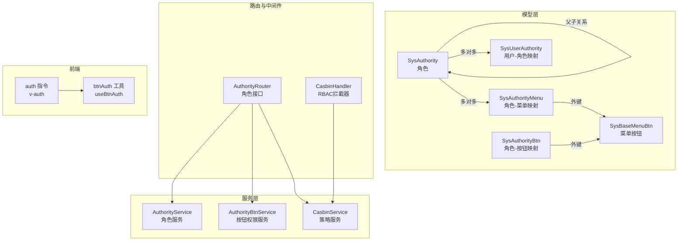
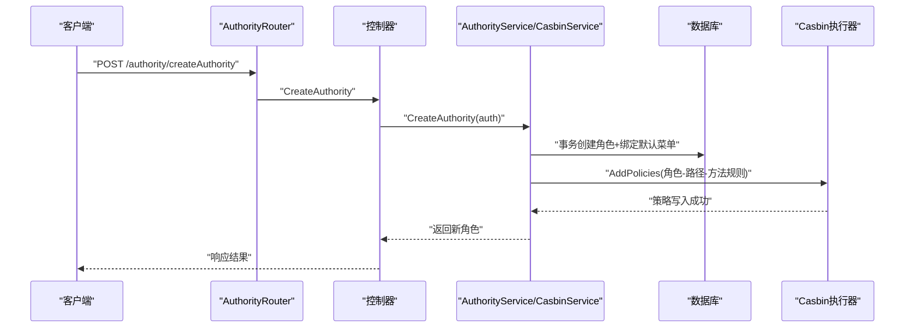
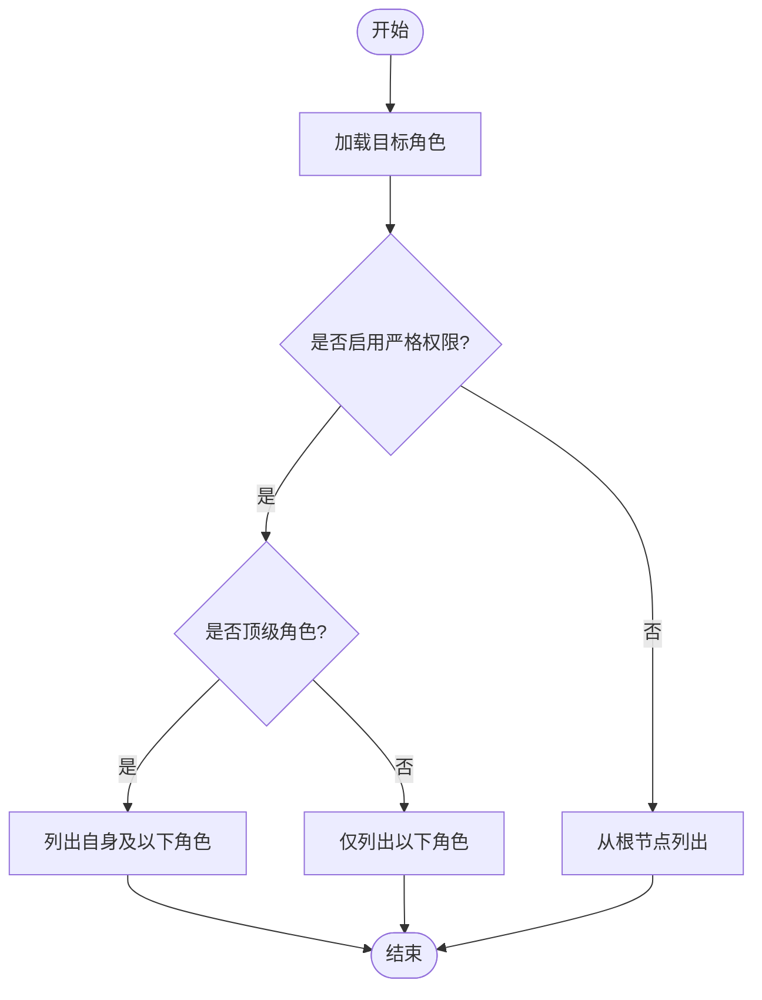
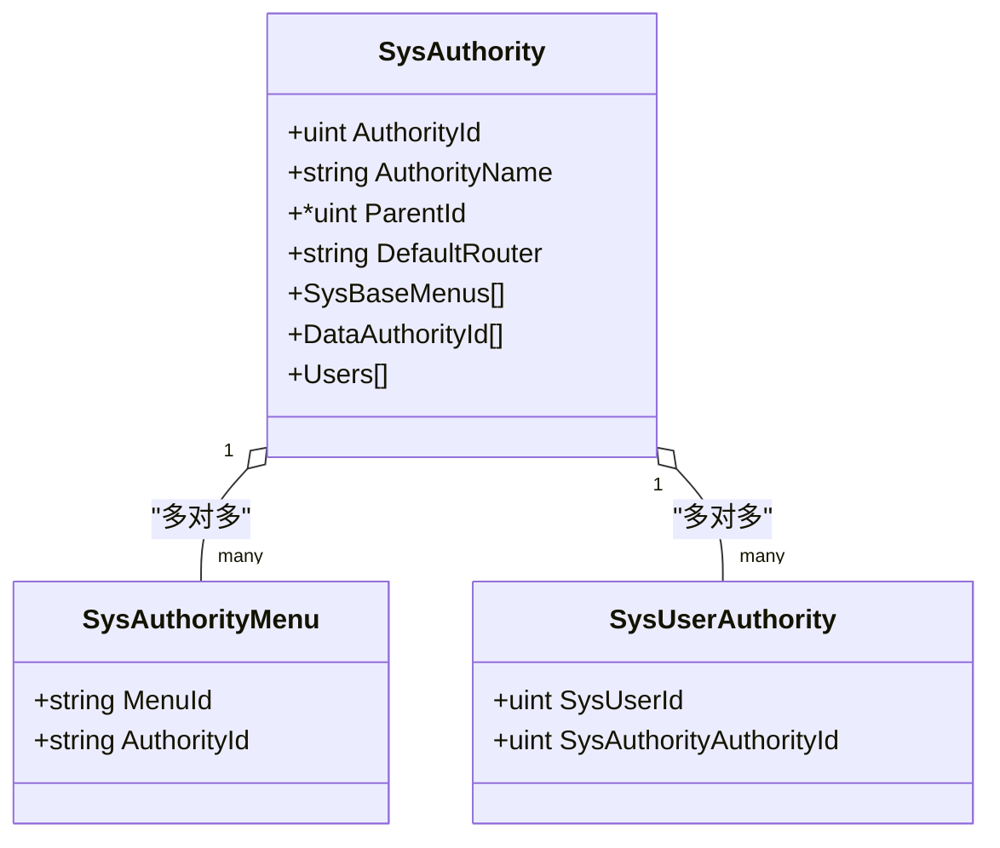
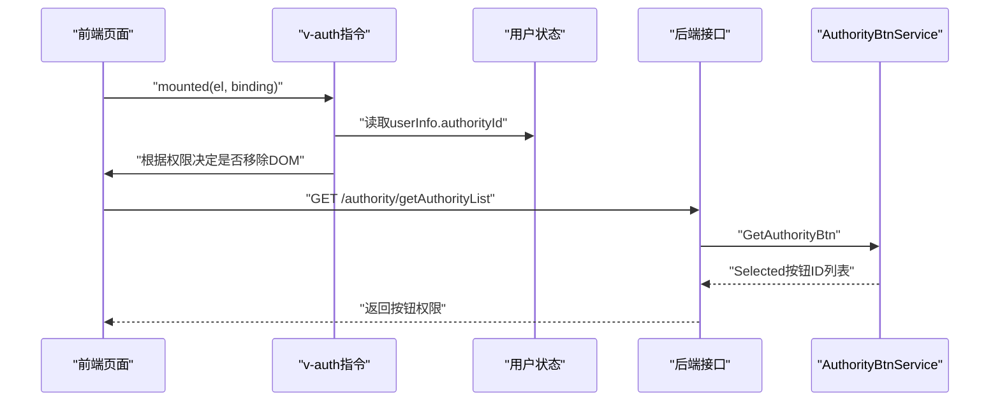
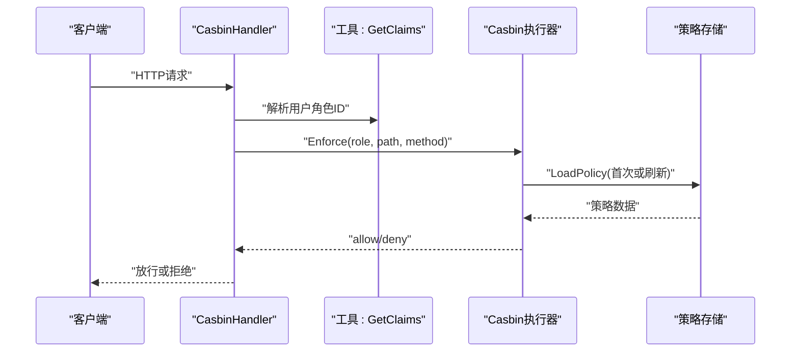
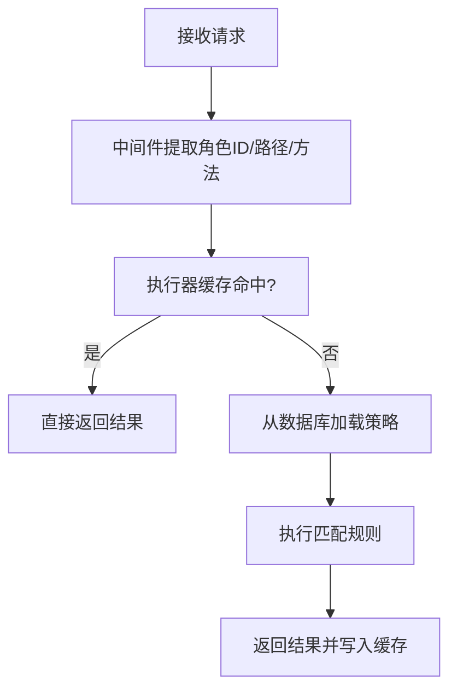
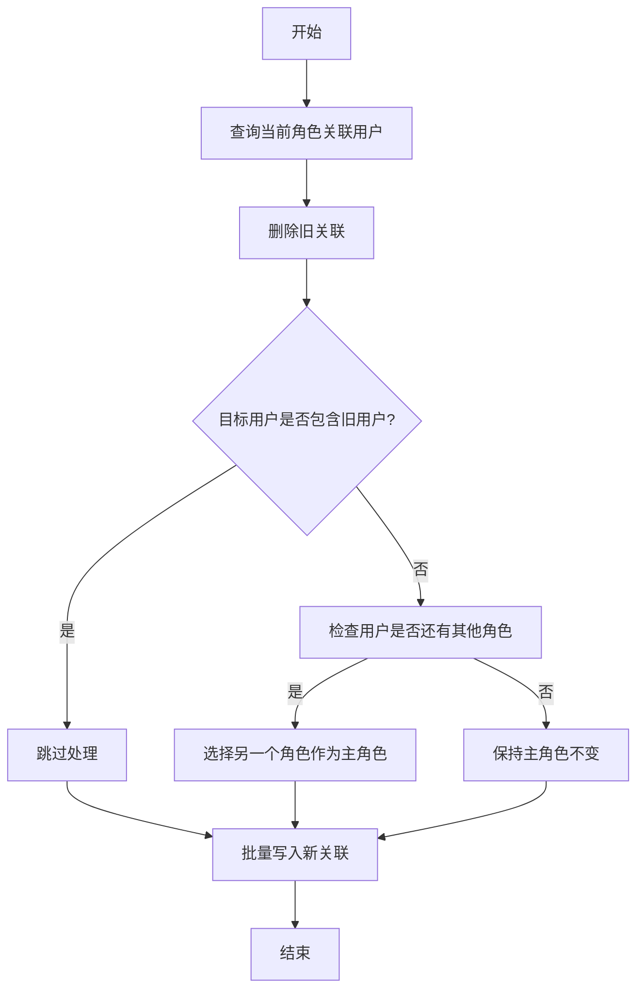
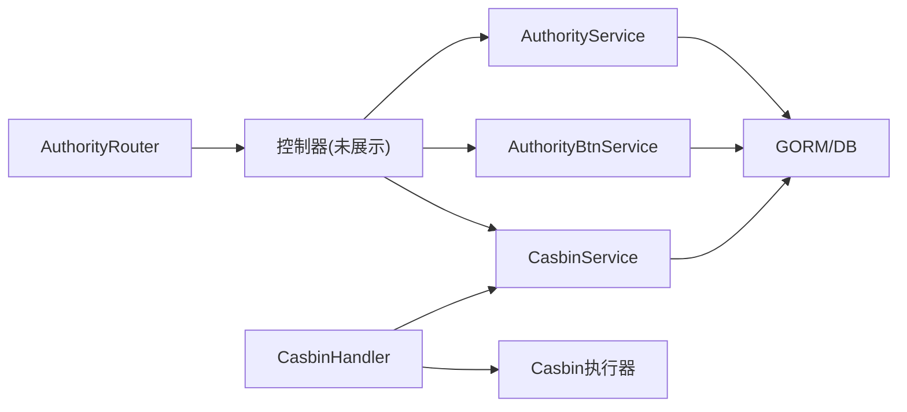

# 权限管理服务

<cite>
**本文引用的文件**
- [server/model/system/sys_authority.go](file://server/model/system/sys_authority.go)
- [server/model/system/sys_authority_btn.go](file://server/model/system/sys_authority_btn.go)
- [server/model/system/sys_authority_menu.go](file://server/model/system/sys_authority_menu.go)
- [server/model/system/sys_user_authority.go](file://server/model/system/sys_user_authority.go)
- [server/model/system/sys_menu_btn.go](file://server/model/system/sys_menu_btn.go)
- [server/service/system/sys_authority.go](file://server/service/system/sys_authority.go)
- [server/service/system/sys_authority_btn.go](file://server/service/system/sys_authority_btn.go)
- [server/service/system/sys_casbin.go](file://server/service/system/sys_casbin.go)
- [server/router/system/sys_authority.go](file://server/router/system/sys_authority.go)
- [server/middleware/casbin_rbac.go](file://server/middleware/casbin_rbac.go)
- [server/source/system/authority.go](file://server/source/system/authority.go)
- [server/utils/casbin_util.go](file://server/utils/casbin_util.go)
- [web/src/directive/auth.js](file://web/src/directive/auth.js)
- [web/src/utils/btnAuth.js](file://web/src/utils/btnAuth.js)
</cite>

## 目录
1. [简介](#简介)
2. [项目结构](#项目结构)
3. [核心组件](#核心组件)
4. [架构总览](#架构总览)
5. [详细组件分析](#详细组件分析)
6. [依赖分析](#依赖分析)
7. [性能考虑](#性能考虑)
8. [故障排查指南](#故障排查指南)
9. [结论](#结论)
10. [附录](#附录)

## 简介
本文件系统性梳理权限管理服务的实现，重点覆盖：
- 角色管理：角色创建、复制、更新、删除、层级结构与严格权限校验
- 权限分配：菜单权限与资源权限（数据权限）的设置与校验
- RBAC 权限模型：基于 Casbin 的策略存储与执行，角色-权限与用户-角色关联
- 权限继承：父子角色权限合并与优先级处理
- 按钮级细粒度控制：组件级与操作级权限控制
- 扩展与自定义：新增权限类型与策略扩展建议
- 权限验证流程、缓存机制与更新策略

## 项目结构
权限相关代码主要分布在以下模块：
- 数据模型层：角色、菜单、按钮、用户-角色关联、角色-菜单关联
- 服务层：角色服务、按钮权限服务、Casbin 策略服务
- 路由与中间件：角色管理接口、RBAC 拦截器
- 前端指令与工具：按钮权限指令与按钮权限读取工具
- 初始化：角色基础数据初始化

图示来源
- [server/model/system/sys_authority.go:7-19](file://server/model/system/sys_authority.go#L7-L19)
- [server/model/system/sys_authority_btn.go:3-8](file://server/model/system/sys_authority_btn.go#L3-L8)
- [server/model/system/sys_authority_menu.go:12-19](file://server/model/system/sys_authority_menu.go#L12-L19)
- [server/model/system/sys_user_authority.go:4-11](file://server/model/system/sys_user_authority.go#L4-L11)
- [server/service/system/sys_authority.go:24-412](file://server/service/system/sys_authority.go#L24-L412)
- [server/service/system/sys_authority_btn.go:12-60](file://server/service/system/sys_authority_btn.go#L12-L60)
- [server/service/system/sys_casbin.go:22-215](file://server/service/system/sys_casbin.go#L22-L215)
- [server/router/system/sys_authority.go:10-25](file://server/router/system/sys_authority.go#L10-L25)
- [server/middleware/casbin_rbac.go:13-32](file://server/middleware/casbin_rbac.go#L13-L32)
- [web/src/directive/auth.js:1-26](file://web/src/directive/auth.js#L1-L26)
- [web/src/utils/btnAuth.js:1-7](file://web/src/utils/btnAuth.js#L1-L7)

章节来源
- [server/model/system/sys_authority.go:1-24](file://server/model/system/sys_authority.go#L1-L24)
- [server/model/system/sys_authority_btn.go:1-9](file://server/model/system/sys_authority_btn.go#L1-L9)
- [server/model/system/sys_authority_menu.go:1-20](file://server/model/system/sys_authority_menu.go#L1-L20)
- [server/model/system/sys_user_authority.go:1-12](file://server/model/system/sys_user_authority.go#L1-L12)
- [server/model/system/sys_menu_btn.go:1-11](file://server/model/system/sys_menu_btn.go#L1-L11)

## 核心组件
- 角色模型：包含角色ID、名称、父角色ID、默认路由、菜单集合、用户集合、数据权限集合等字段
- 按钮模型：角色-菜单-按钮三元映射，用于按钮级权限控制
- 用户-角色映射：多对多关联，支持用户拥有多个角色（主角色切换）
- 角色-菜单映射：角色与菜单的多对多关联
- 角色服务：提供角色创建、复制、更新、删除、菜单与数据权限设置、用户覆盖等能力
- 按钮权限服务：提供按钮权限查询与设置
- Casbin 策略服务：提供策略增删改查、按角色或API维度同步
- RBAC 中间件：统一鉴权入口，基于角色ID与请求路径/方法进行策略匹配
- 初始化器：角色基础数据初始化与数据权限关联

章节来源
- [server/service/system/sys_authority.go:24-412](file://server/service/system/sys_authority.go#L24-L412)
- [server/service/system/sys_authority_btn.go:12-60](file://server/service/system/sys_authority_btn.go#L12-L60)
- [server/service/system/sys_casbin.go:22-215](file://server/service/system/sys_casbin.go#L22-L215)
- [server/middleware/casbin_rbac.go:13-32](file://server/middleware/casbin_rbac.go#L13-L32)
- [server/source/system/authority.go:41-76](file://server/source/system/authority.go#L41-L76)

## 架构总览
权限管理采用“模型-服务-路由-中间件-前端指令”的分层设计，核心流程如下：
- 角色管理通过路由进入服务层，服务层维护角色与菜单、按钮、用户的关联
- RBAC 中间件在请求到达控制器前进行权限校验
- Casbin 提供策略存储与匹配，支持缓存与热更新
- 前端通过指令与工具读取按钮权限，实现界面级的按钮可见性控制

图示来源
- [server/router/system/sys_authority.go:10-25](file://server/router/system/sys_authority.go#L10-L25)
- [server/service/system/sys_authority.go:28-54](file://server/service/system/sys_authority.go#L28-L54)
- [server/service/system/sys_casbin.go:156-167](file://server/service/system/sys_casbin.go#L156-L167)

## 详细组件分析

### 角色管理与层级继承
- 角色模型包含父角色ID，支持父子角色结构；服务层提供递归查询子角色、严格权限校验、结构化角色列表等能力
- 严格模式下，仅顶级角色可修改自身及以下角色，非顶级角色仅能修改其子角色
- 支持全量覆盖角色关联用户，自动处理主角色切换

图示来源
- [server/service/system/sys_authority.go:186-211](file://server/service/system/sys_authority.go#L186-L211)
- [server/service/system/sys_authority.go:219-237](file://server/service/system/sys_authority.go#L219-L237)

章节来源
- [server/model/system/sys_authority.go:7-19](file://server/model/system/sys_authority.go#L7-L19)
- [server/service/system/sys_authority.go:186-258](file://server/service/system/sys_authority.go#L186-L258)

### 菜单权限与数据权限
- 菜单权限：角色与菜单为多对多关联，服务层提供替换绑定的能力
- 数据权限：角色可配置可访问的数据范围，初始化器演示了数据权限的关联方式

图示来源
- [server/model/system/sys_authority.go:7-19](file://server/model/system/sys_authority.go#L7-L19)
- [server/model/system/sys_authority_menu.go:12-19](file://server/model/system/sys_authority_menu.go#L12-L19)
- [server/model/system/sys_user_authority.go:4-11](file://server/model/system/sys_user_authority.go#L4-L11)

章节来源
- [server/service/system/sys_authority.go:297-308](file://server/service/system/sys_authority.go#L297-L308)
- [server/source/system/authority.go:46-76](file://server/source/system/authority.go#L46-L76)

### 按钮级权限控制
- 按钮权限模型：角色-菜单-按钮三元映射，支持查询与批量设置
- 前端指令：v-auth 指令根据用户角色与绑定值决定元素显示/隐藏
- 前端工具：useBtnAuth 从路由 meta.btns 读取按钮权限字典

图示来源
- [web/src/directive/auth.js:1-26](file://web/src/directive/auth.js#L1-L26)
- [web/src/utils/btnAuth.js:1-7](file://web/src/utils/btnAuth.js#L1-L7)
- [server/service/system/sys_authority_btn.go:16-28](file://server/service/system/sys_authority_btn.go#L16-L28)

章节来源
- [server/model/system/sys_authority_btn.go:3-8](file://server/model/system/sys_authority_btn.go#L3-L8)
- [server/service/system/sys_authority_btn.go:16-60](file://server/service/system/sys_authority_btn.go#L16-L60)
- [web/src/directive/auth.js:1-26](file://web/src/directive/auth.js#L1-L26)
- [web/src/utils/btnAuth.js:1-7](file://web/src/utils/btnAuth.js#L1-L7)

### RBAC 权限模型与策略执行
- 模型定义：sub(obj)act 匹配规则，使用 keyMatch2 进行路径匹配
- 执行器：全局单例的 SyncedCachedEnforcer，带缓存与过期时间
- 中间件：从请求上下文提取角色ID、路径、方法，调用 Enforce 进行判断

图示来源
- [server/middleware/casbin_rbac.go:13-32](file://server/middleware/casbin_rbac.go#L13-L32)
- [server/utils/casbin_util.go:18-52](file://server/utils/casbin_util.go#L18-L52)

章节来源
- [server/utils/casbin_util.go:18-52](file://server/utils/casbin_util.go#L18-L52)
- [server/middleware/casbin_rbac.go:13-32](file://server/middleware/casbin_rbac.go#L13-L32)

### 权限验证流程与更新策略
- 验证流程：中间件统一拦截，依据角色ID与请求路径/方法进行策略匹配
- 更新策略：
  - 按角色更新：先清理旧策略，再去重写入新策略
  - API维度随动：API变更时同步更新策略
  - 热更新：写入数据库后触发 LoadPolicy 生效
- 缓存机制：执行器内置缓存，设置过期时间，减少重复加载

图示来源
- [server/middleware/casbin_rbac.go:13-32](file://server/middleware/casbin_rbac.go#L13-L32)
- [server/utils/casbin_util.go:47-52](file://server/utils/casbin_util.go#L47-L52)

章节来源
- [server/service/system/sys_casbin.go:26-74](file://server/service/system/sys_casbin.go#L26-L74)
- [server/service/system/sys_casbin.go:82-93](file://server/service/system/sys_casbin.go#L82-L93)
- [server/utils/casbin_util.go:18-52](file://server/utils/casbin_util.go#L18-L52)

### 角色-用户关联与主角色切换
- 全量覆盖某角色的用户列表，删除旧关联后批量写入新记录
- 若被移除用户的主角色恰好是该角色，则从剩余关联中选择一个作为新的主角色

图示来源
- [server/service/system/sys_authority.go:348-412](file://server/service/system/sys_authority.go#L348-L412)

章节来源
- [server/service/system/sys_authority.go:348-412](file://server/service/system/sys_authority.go#L348-L412)

### 接口与路由
- 角色管理接口：创建、删除、更新、复制、设置资源权限、设置角色用户、获取角色列表、获取角色用户ID列表
- 中间件：统一在权限路由组上应用 RBAC 拦截器

章节来源
- [server/router/system/sys_authority.go:10-25](file://server/router/system/sys_authority.go#L10-L25)

## 依赖分析
- 组件耦合
  - 服务层依赖模型层与工具层（Casbin 实例）
  - 路由层依赖控制器（未在本文件中展示），控制器依赖服务层
  - 中间件依赖工具层（获取用户角色与 Casbin 实例）
  - 前端指令依赖用户状态与路由元信息
- 外部依赖
  - Casbin 执行器与 GORM 适配器
  - Gin 路由与中间件生态

图示来源
- [server/router/system/sys_authority.go:10-25](file://server/router/system/sys_authority.go#L10-L25)
- [server/middleware/casbin_rbac.go:13-32](file://server/middleware/casbin_rbac.go#L13-L32)
- [server/service/system/sys_authority.go:24-412](file://server/service/system/sys_authority.go#L24-L412)
- [server/service/system/sys_authority_btn.go:12-60](file://server/service/system/sys_authority_btn.go#L12-L60)
- [server/service/system/sys_casbin.go:22-215](file://server/service/system/sys_casbin.go#L22-L215)

## 性能考虑
- 缓存命中：执行器内置缓存与过期时间，减少策略加载开销
- 去重策略：更新策略时对路径-方法组合去重，避免重复写入
- 批量操作：用户覆盖与按钮设置采用批量删除与批量写入，降低往返次数
- 严格模式下的树形遍历：在严格模式下递归查询子角色，注意大规模层级结构下的查询成本

## 故障排查指南
- 权限不足：中间件返回权限不足错误，检查角色ID、路径与方法是否正确
- 角色删除失败：若角色仍有用户或存在子角色，会阻止删除；需先迁移用户与子角色
- 按钮删除失败：若按钮仍被使用，会阻止删除；需先解除关联
- 策略未生效：确认是否调用了策略刷新或等待缓存过期

章节来源
- [server/middleware/casbin_rbac.go:24-29](file://server/middleware/casbin_rbac.go#L24-L29)
- [server/service/system/sys_authority.go:131-178](file://server/service/system/sys_authority.go#L131-L178)
- [server/service/system/sys_authority_btn.go:54-60](file://server/service/system/sys_authority_btn.go#L54-L60)
- [server/service/system/sys_casbin.go:169-173](file://server/service/system/sys_casbin.go#L169-L173)

## 结论
该权限管理服务以 RBAC 为核心，结合 Casbin 的策略存储与执行，实现了角色管理、菜单权限、数据权限、按钮级细粒度控制与严格的层级权限校验。通过中间件统一鉴权、服务层事务化操作与前端指令级控制，形成从前端到后端的完整权限闭环。同时提供了良好的扩展点，便于后续引入更复杂的权限模型与自定义权限类型。

## 附录
- 扩展方法与自定义权限类型建议
  - 引入新的权限类型：在模型层新增实体并在服务层提供 CRUD 与关联设置接口
  - 自定义匹配器：在 Casbin 模型中增加新的匹配器以支持更复杂的路径/资源匹配
  - 策略维度扩展：支持按组织、项目等维度扩展策略表结构与查询逻辑
- 权限验证流程与缓存机制
  - 验证流程：中间件统一拦截，依据角色ID与请求路径/方法进行策略匹配
  - 缓存机制：执行器内置缓存，设置过期时间，减少重复加载
- 权限更新策略
  - 按角色更新：先清理旧策略，再去重写入新策略
  - API维度随动：API变更时同步更新策略
  - 热更新：写入数据库后触发 LoadPolicy 生效