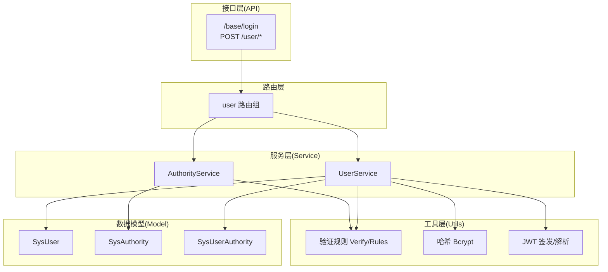
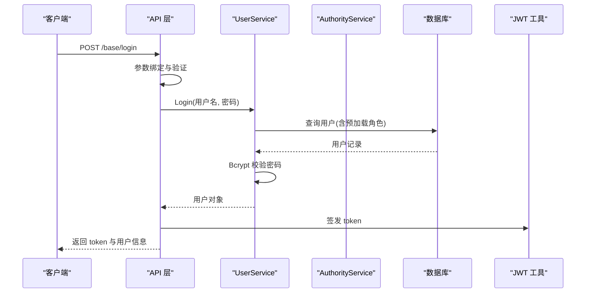
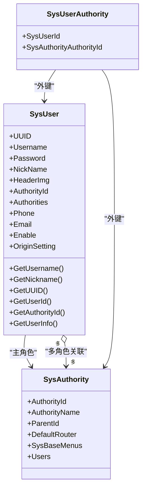
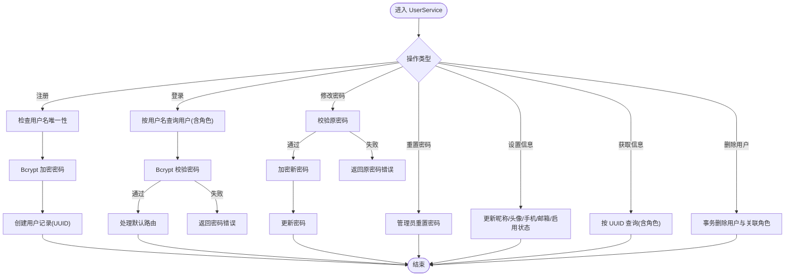
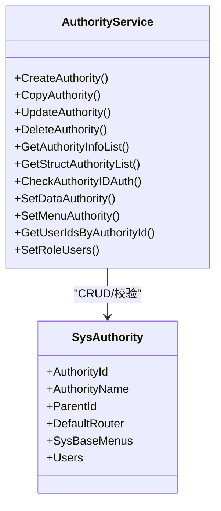
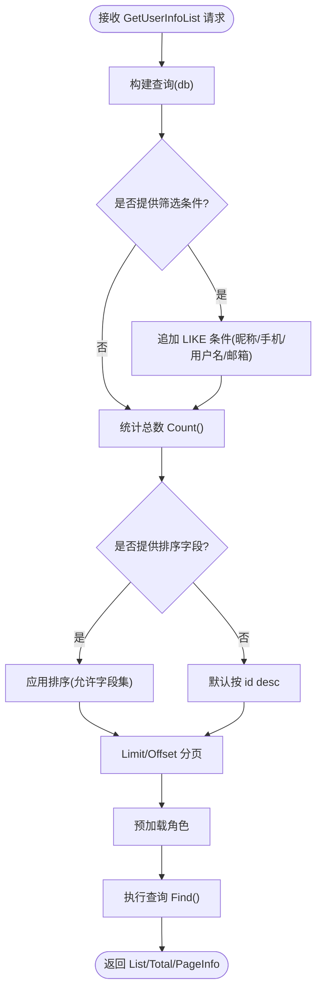
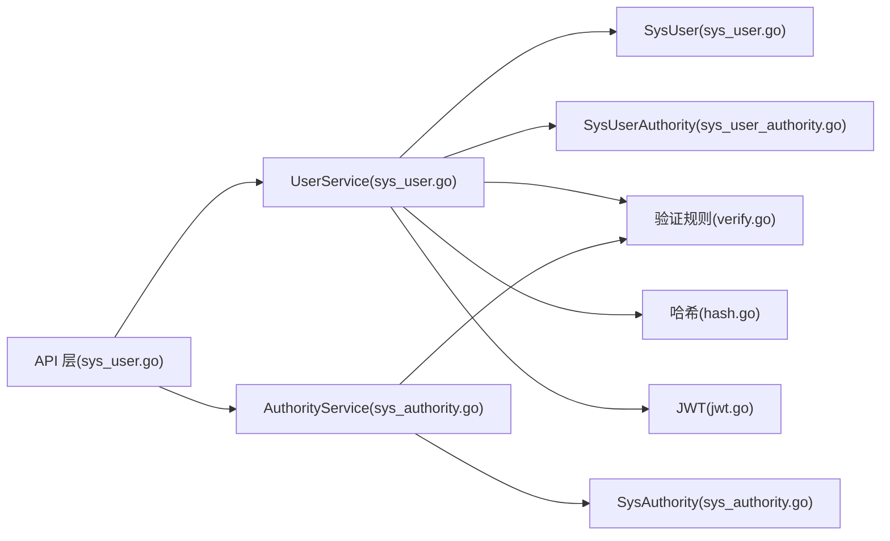
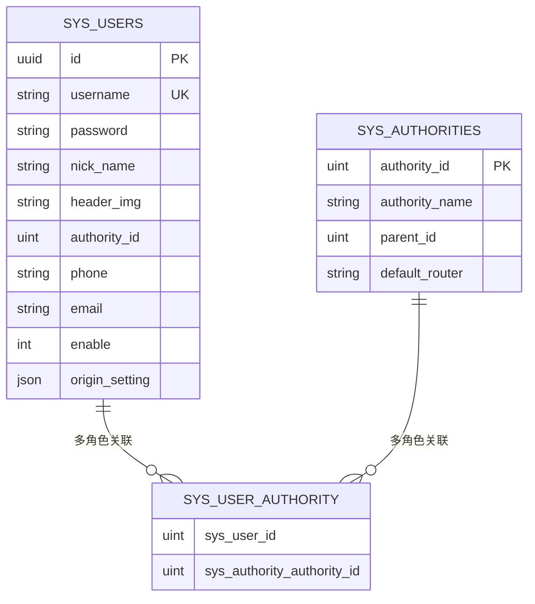

# 用户管理服务

<cite>
**本文引用的文件**
- [sys_user.go](file://server/model/system/sys_user.go)
- [sys_authority.go](file://server/model/system/sys_authority.go)
- [sys_user_authority.go](file://server/model/system/sys_user_authority.go)
- [sys_user.go](file://server/service/system/sys_user.go)
- [sys_authority.go](file://server/service/system/sys_authority.go)
- [sys_user.go](file://server/router/system/sys_user.go)
- [sys_user.go](file://server/api/v1/system/sys_user.go)
- [user.go](file://server/source/system/user.go)
- [sys_user.go](file://server/model/system/request/sys_user.go)
- [validator.go](file://server/utils/validator.go)
- [verify.go](file://server/utils/verify.go)
- [hash.go](file://server/utils/hash.go)
- [jwt.go](file://server/utils/jwt.go)
- [jwt.go](file://server/config/jwt.go)
- [sys_user.go](file://server/model/system/response/sys_user.go)
</cite>

## 目录
1. [简介](#简介)
2. [项目结构](#项目结构)
3. [核心组件](#核心组件)
4. [架构总览](#架构总览)
5. [详细组件分析](#详细组件分析)
6. [依赖分析](#依赖分析)
7. [性能考量](#性能考量)
8. [故障排查指南](#故障排查指南)
9. [结论](#结论)
10. [附录](#附录)

## 简介
本文件系统化梳理用户管理服务的完整实现，覆盖用户注册、登录、信息修改、密码管理、角色分配与权限继承、状态管理、数据验证与安全策略、以及高级查询（分页、排序、筛选）等核心能力。文档以代码级事实为基础，结合可视化图示帮助读者快速理解业务流程与技术实现。

## 项目结构
用户管理相关代码主要分布在以下层次：
- 数据模型层：用户、角色、用户-角色关联
- 服务层：用户业务逻辑、角色权限管理
- 接口层：HTTP API 定义与参数校验
- 路由层：REST 路由映射
- 初始化层：内置管理员与初始数据
- 工具层：验证规则、哈希与 JWT

**图表来源**
- [sys_user.go:20-517](file://server/api/v1/system/sys_user.go#L20-L517)
- [sys_user.go:10-28](file://server/router/system/sys_user.go#L10-L28)
- [sys_user.go:24-337](file://server/service/system/sys_user.go#L24-L337)
- [sys_authority.go:24-413](file://server/service/system/sys_authority.go#L24-L413)
- [sys_user.go:20-63](file://server/model/system/sys_user.go#L20-L63)
- [sys_authority.go:7-24](file://server/model/system/sys_authority.go#L7-L24)
- [sys_user_authority.go:4-11](file://server/model/system/sys_user_authority.go#L4-L11)
- [verify.go:3-19](file://server/utils/verify.go#L3-L19)
- [hash.go:9-19](file://server/utils/hash.go#L9-L19)
- [jwt.go:32-88](file://server/utils/jwt.go#L32-L88)

**章节来源**
- [sys_user.go:20-517](file://server/api/v1/system/sys_user.go#L20-L517)
- [sys_user.go:10-28](file://server/router/system/sys_user.go#L10-L28)
- [sys_user.go:24-337](file://server/service/system/sys_user.go#L24-L337)
- [sys_authority.go:24-413](file://server/service/system/sys_authority.go#L24-L413)
- [sys_user.go:20-63](file://server/model/system/sys_user.go#L20-L63)
- [sys_authority.go:7-24](file://server/model/system/sys_authority.go#L7-L24)
- [sys_user_authority.go:4-11](file://server/model/system/sys_user_authority.go#L4-L11)
- [verify.go:3-19](file://server/utils/verify.go#L3-L19)
- [hash.go:9-19](file://server/utils/hash.go#L9-L19)
- [jwt.go:32-88](file://server/utils/jwt.go#L32-L88)

## 核心组件
- 用户模型：包含 UUID、用户名、密码、昵称、头像、角色主键、多角色关联、手机号、邮箱、启用状态、配置等字段，并实现登录接口。
- 角色模型：角色ID、角色名、父角色、默认路由、菜单集合、用户集合等。
- 用户-角色关联：多对多中间表，支持用户主角色与多角色并存。
- 用户服务：注册、登录、修改密码、重置密码、设置用户信息、设置自身信息、设置自身配置、获取用户信息、分页查询、删除用户、设置单个/多个角色、切换主角色等。
- 权限服务：角色创建/复制/更新/删除、严格权限树校验、菜单与数据权限设置、按角色获取用户ID等。
- API 层：登录、注册、修改密码、获取/设置用户信息、分页列表、删除、重置密码、设置角色等接口。
- 验证与安全：统一验证规则、Bcrypt 密码哈希、JWT 签发与刷新、验证码风控、登录日志记录。

**章节来源**
- [sys_user.go:20-63](file://server/model/system/sys_user.go#L20-L63)
- [sys_authority.go:7-24](file://server/model/system/sys_authority.go#L7-L24)
- [sys_user_authority.go:4-11](file://server/model/system/sys_user_authority.go#L4-L11)
- [sys_user.go:28-337](file://server/service/system/sys_user.go#L28-L337)
- [sys_authority.go:28-413](file://server/service/system/sys_authority.go#L28-L413)
- [sys_user.go:20-517](file://server/api/v1/system/sys_user.go#L20-L517)
- [verify.go:3-19](file://server/utils/verify.go#L3-L19)
- [hash.go:9-19](file://server/utils/hash.go#L9-L19)
- [jwt.go:32-88](file://server/utils/jwt.go#L32-L88)

## 架构总览
用户管理服务采用典型的三层架构：接口层负责请求接入与响应封装；服务层承载业务规则；模型层负责数据持久化。JWT 用于会话管理，bcrypt 保障密码安全，统一验证器确保输入合规。

**图表来源**
- [sys_user.go:27-99](file://server/api/v1/system/sys_user.go#L27-L99)
- [sys_user.go:47-61](file://server/service/system/sys_user.go#L47-L61)
- [hash.go:15-19](file://server/utils/hash.go#L15-L19)
- [jwt.go:48-88](file://server/utils/jwt.go#L48-L88)

**章节来源**
- [sys_user.go:27-99](file://server/api/v1/system/sys_user.go#L27-L99)
- [sys_user.go:47-61](file://server/service/system/sys_user.go#L47-L61)
- [hash.go:15-19](file://server/utils/hash.go#L15-L19)
- [jwt.go:48-88](file://server/utils/jwt.go#L48-L88)

## 详细组件分析

### 用户模型与接口
- SysUser 实现 Login 接口，提供用户名、昵称、UUID、用户ID、主角色ID与用户信息获取。
- 字段注释明确：UUID、用户名、密码、昵称、头像、主角色ID、多角色关联、手机号、邮箱、启用状态、配置等。
- 支持预加载角色与多角色关联，便于权限下发与菜单默认路由处理。

**图表来源**
- [sys_user.go:20-63](file://server/model/system/sys_user.go#L20-L63)
- [sys_authority.go:7-24](file://server/model/system/sys_authority.go#L7-L24)
- [sys_user_authority.go:4-11](file://server/model/system/sys_user_authority.go#L4-L11)

**章节来源**
- [sys_user.go:20-63](file://server/model/system/sys_user.go#L20-L63)
- [sys_authority.go:7-24](file://server/model/system/sys_authority.go#L7-L24)
- [sys_user_authority.go:4-11](file://server/model/system/sys_user_authority.go#L4-L11)

### 用户服务：注册、登录、密码管理
- 注册：检查用户名唯一性，生成 UUID，使用 Bcrypt 加密密码，创建用户。
- 登录：根据用户名查询用户并预加载角色；校验密码；触发默认路由处理；返回用户对象。
- 修改密码：先校验原密码，再加密新密码并更新。
- 重置密码：管理员重置指定用户密码。
- 设置用户信息/自身信息：支持昵称、头像、手机、邮箱、启用状态等字段更新。
- 获取用户信息：按 UUID 查询并预加载角色。
- 删除用户：事务删除用户及关联角色。

**图表来源**
- [sys_user.go:28-337](file://server/service/system/sys_user.go#L28-L337)
- [hash.go:9-19](file://server/utils/hash.go#L9-L19)

**章节来源**
- [sys_user.go:28-337](file://server/service/system/sys_user.go#L28-L337)
- [hash.go:9-19](file://server/utils/hash.go#L9-L19)

### 角色与权限服务：多角色支持与权限继承
- 角色模型支持父子关系与默认路由，菜单与按钮权限通过中间表维护。
- 用户可同时拥有多个角色，主角色决定默认菜单与部分权限判定。
- 权限服务提供严格权限树校验，限制管理员仅能操作其可管理的角色层级。
- 支持批量设置用户角色、切换主角色、按角色获取用户ID、全量覆盖角色-用户关联等。

**图表来源**
- [sys_authority.go:24-413](file://server/service/system/sys_authority.go#L24-L413)
- [sys_authority.go:7-24](file://server/model/system/sys_authority.go#L7-L24)

**章节来源**
- [sys_authority.go:24-413](file://server/service/system/sys_authority.go#L24-L413)
- [sys_authority.go:7-24](file://server/model/system/sys_authority.go#L7-L24)

### 用户列表查询、分页、排序与筛选
- 支持按昵称、手机号、用户名、邮箱模糊筛选。
- 支持按 id、username、nick_name、phone、email 排序，支持升序/降序。
- 分页通过 Page、PageSize 计算 offset 与 limit，返回列表、总数与分页信息。

**图表来源**
- [sys_user.go:89-132](file://server/service/system/sys_user.go#L89-L132)
- [sys_user.go:63-71](file://server/model/system/request/sys_user.go#L63-L71)

**章节来源**
- [sys_user.go:89-132](file://server/service/system/sys_user.go#L89-L132)
- [sys_user.go:63-71](file://server/model/system/request/sys_user.go#L63-L71)

### 用户状态管理：激活、锁定与删除
- 启用状态字段 enable 控制用户是否可登录（1 正常，非 1 冻结）。
- 登录前检查启用状态，若非 1 则拒绝登录并记录失败日志。
- 删除用户采用事务，同时清理用户与角色的关联关系。

**章节来源**
- [sys_user.go:32-33](file://server/model/system/sys_user.go#L32-L33)
- [sys_user.go:82-97](file://server/api/v1/system/sys_user.go#L82-L97)
- [sys_user.go:230-240](file://server/service/system/sys_user.go#L230-L240)

### 密码管理与安全
- 密码加密：注册与重置均使用 Bcrypt 哈希，修改密码需先校验原密码。
- 会话安全：JWT 签发与刷新，支持多端登录控制与黑名单（登出/失效）。
- 输入验证：统一验证规则（如 LoginVerify、RegisterVerify、ChangePasswordVerify 等），确保必填与基本约束。
- 验证码风控：登录接口支持验证码校验与失败次数缓存，防止暴力破解。

**章节来源**
- [hash.go:9-19](file://server/utils/hash.go#L9-L19)
- [sys_user.go:27-99](file://server/api/v1/system/sys_user.go#L27-L99)
- [verify.go:3-19](file://server/utils/verify.go#L3-L19)
- [jwt.go:32-88](file://server/utils/jwt.go#L32-L88)
- [jwt.go:3-9](file://server/config/jwt.go#L3-L9)

### 角色分配与权限继承
- 单角色切换：SetUserAuthority 校验用户是否具备该角色，且角色默认路由存在于其菜单集合中，否则拒绝切换。
- 多角色设置：SetUserAuthorities 在事务内先清空旧关联，再写入新角色集合，并将第一个角色设为主角色。
- 权限树校验：CheckAuthorityIDAuth 在严格模式下限制管理员仅能操作其可管理的角色层级。
- 全量覆盖角色-用户关联：SetRoleUsers 支持按角色维度全量替换用户列表，自动处理主角色切换。

**章节来源**
- [sys_user.go:140-222](file://server/service/system/sys_user.go#L140-L222)
- [sys_authority.go:239-258](file://server/service/system/sys_authority.go#L239-L258)
- [sys_authority.go:348-412](file://server/service/system/sys_authority.go#L348-L412)

### 初始化与内置用户
- 初始化流程自动迁移用户表并写入内置管理员与普通用户。
- 为内置用户建立多角色关联，确保权限体系可用。

**章节来源**
- [user.go:42-93](file://server/source/system/user.go#L42-L93)

## 依赖分析
- 组件耦合：API 层依赖 UserService 与 AuthorityService；Service 层依赖模型层与工具层；模型层通过 GORM 定义关系与索引。
- 外部依赖：GORM（ORM）、bcrypt（密码哈希）、JWT（令牌）、Redis（可选会话存储）。
- 循环依赖：未见直接循环依赖，但注意路由、API、Service 间应避免互相导入。

**图表来源**
- [sys_user.go:20-517](file://server/api/v1/system/sys_user.go#L20-L517)
- [sys_user.go:24-337](file://server/service/system/sys_user.go#L24-L337)
- [sys_authority.go:24-413](file://server/service/system/sys_authority.go#L24-L413)
- [sys_user.go:20-63](file://server/model/system/sys_user.go#L20-L63)
- [sys_authority.go:7-24](file://server/model/system/sys_authority.go#L7-L24)
- [sys_user_authority.go:4-11](file://server/model/system/sys_user_authority.go#L4-L11)
- [verify.go:3-19](file://server/utils/verify.go#L3-L19)
- [hash.go:9-19](file://server/utils/hash.go#L9-L19)
- [jwt.go:32-88](file://server/utils/jwt.go#L32-L88)

**章节来源**
- [sys_user.go:20-517](file://server/api/v1/system/sys_user.go#L20-L517)
- [sys_user.go:24-337](file://server/service/system/sys_user.go#L24-L337)
- [sys_authority.go:24-413](file://server/service/system/sys_authority.go#L24-L413)
- [sys_user.go:20-63](file://server/model/system/sys_user.go#L20-L63)
- [sys_authority.go:7-24](file://server/model/system/sys_authority.go#L7-L24)
- [sys_user_authority.go:4-11](file://server/model/system/sys_user_authority.go#L4-L11)
- [verify.go:3-19](file://server/utils/verify.go#L3-L19)
- [hash.go:9-19](file://server/utils/hash.go#L9-L19)
- [jwt.go:32-88](file://server/utils/jwt.go#L32-L88)

## 性能考量
- 查询优化：用户列表查询使用索引字段（用户名、昵称、手机号、邮箱）与 LIMIT/OFFSET 分页；预加载角色减少 N+1 查询。
- 密码处理：Bcrypt 成本因子默认，兼顾安全性与性能；批量角色设置使用事务一次性写入。
- 会话管理：JWT 过期时间可配置；多端登录场景建议结合 Redis 存储与黑名单提升安全与性能。
- 并发控制：JWT 刷新使用并发控制避免并发换发导致的异常。

[本节为通用指导，无需列出具体文件来源]

## 故障排查指南
- 登录失败
  - 检查用户名是否存在、密码是否正确、用户是否被冻结。
  - 查看验证码是否开启、验证码是否匹配、失败次数缓存是否触发。
- 修改密码失败
  - 确认原密码校验通过；检查新密码是否符合最小长度等要求。
- 设置角色失败
  - 若提示“该用户无此角色”，确认用户确实关联了该角色。
  - 若提示“找不到默认路由”，确认角色默认路由存在于其菜单集合。
- 删除用户失败
  - 确认非本人删除；检查事务是否成功提交。
- JWT 相关
  - 检查签名密钥、过期时间配置；多端登录场景确认 Redis 存储与黑名单状态。

**章节来源**
- [sys_user.go:27-99](file://server/api/v1/system/sys_user.go#L27-L99)
- [sys_user.go:47-61](file://server/service/system/sys_user.go#L47-L61)
- [sys_user.go:140-181](file://server/service/system/sys_user.go#L140-L181)
- [sys_user.go:331-364](file://server/api/v1/system/sys_user.go#L331-L364)
- [jwt.go:32-88](file://server/utils/jwt.go#L32-L88)

## 结论
用户管理服务通过清晰的分层设计与完善的业务流程，实现了从注册、登录到信息维护、密码管理、角色分配与权限继承的全链路能力。配合统一验证、Bcrypt 哈希与 JWT 会话管理，既保证了易用性也强化了安全性。建议在生产环境中结合严格的权限树配置、验证码风控与审计日志进一步加固。

[本节为总结性内容，无需列出具体文件来源]

## 附录

### 数据模型关系图

**图表来源**
- [sys_user.go:20-63](file://server/model/system/sys_user.go#L20-L63)
- [sys_authority.go:7-24](file://server/model/system/sys_authority.go#L7-L24)
- [sys_user_authority.go:4-11](file://server/model/system/sys_user_authority.go#L4-L11)

### API 一览（节选）
- 登录：POST /base/login
- 注册：POST /user/admin_register
- 修改密码：POST /user/changePassword
- 获取用户列表：POST /user/getUserList
- 获取用户信息：GET /user/getUserInfo
- 设置用户信息：PUT /user/setUserInfo
- 设置自身信息：PUT /user/setSelfInfo
- 设置用户权限：POST /user/setUserAuthority
- 设置用户权限组：POST /user/setUserAuthorities
- 删除用户：DELETE /user/deleteUser
- 重置用户密码：POST /user/resetPassword
- 设置自身配置：PUT /user/setSelfSetting

**章节来源**
- [sys_user.go:10-28](file://server/router/system/sys_user.go#L10-L28)
- [sys_user.go:20-517](file://server/api/v1/system/sys_user.go#L20-L517)