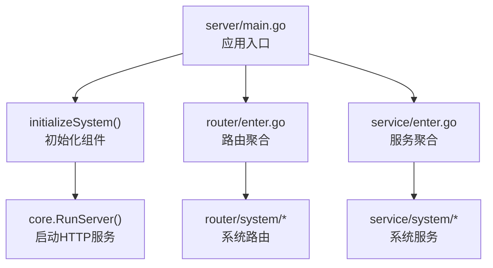
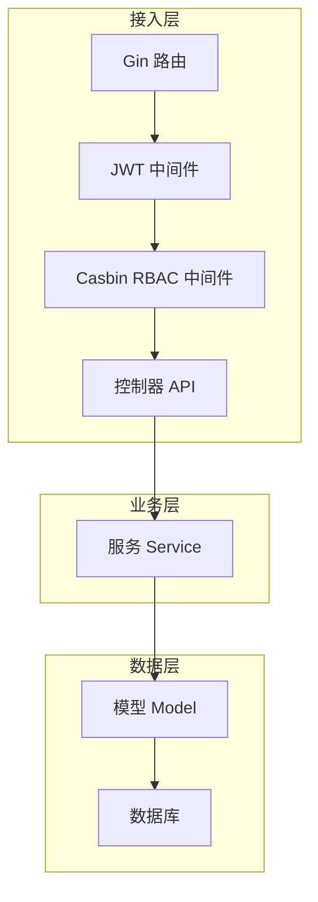
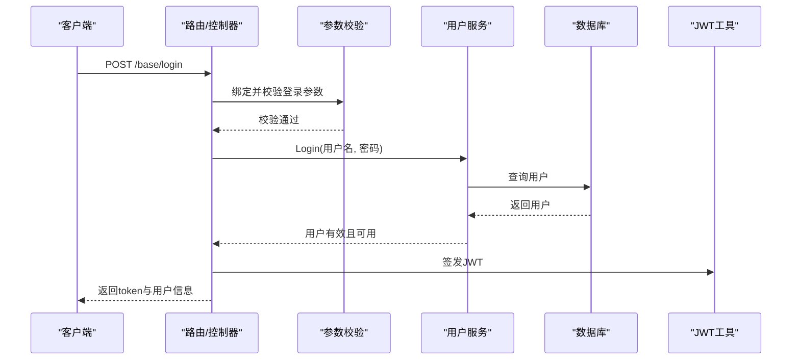
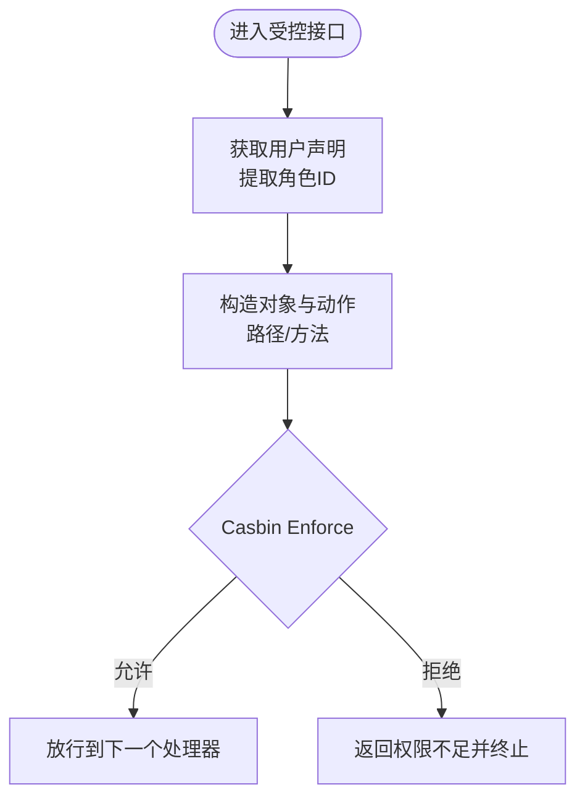
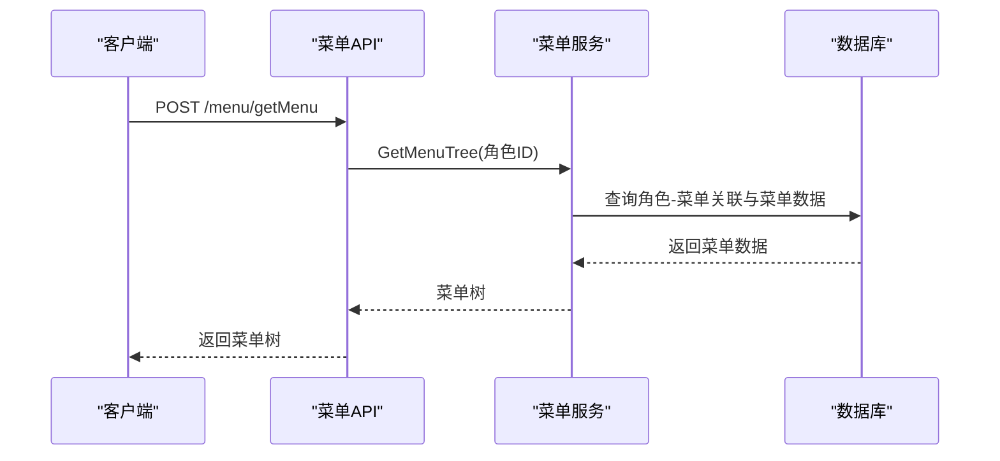
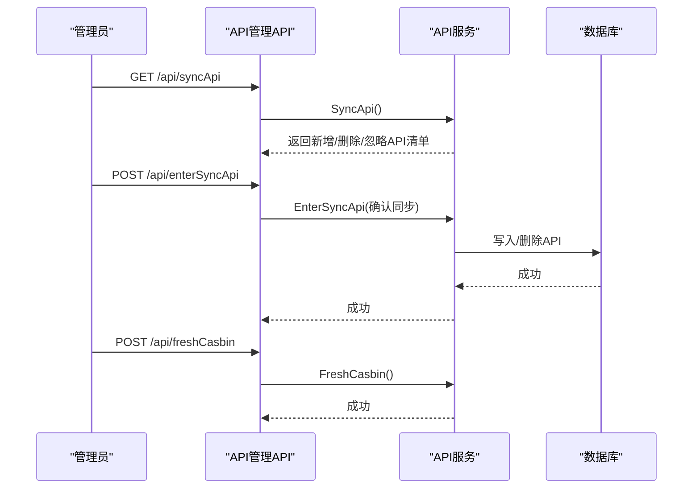
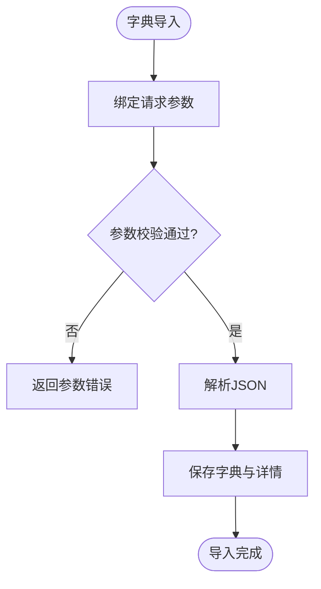
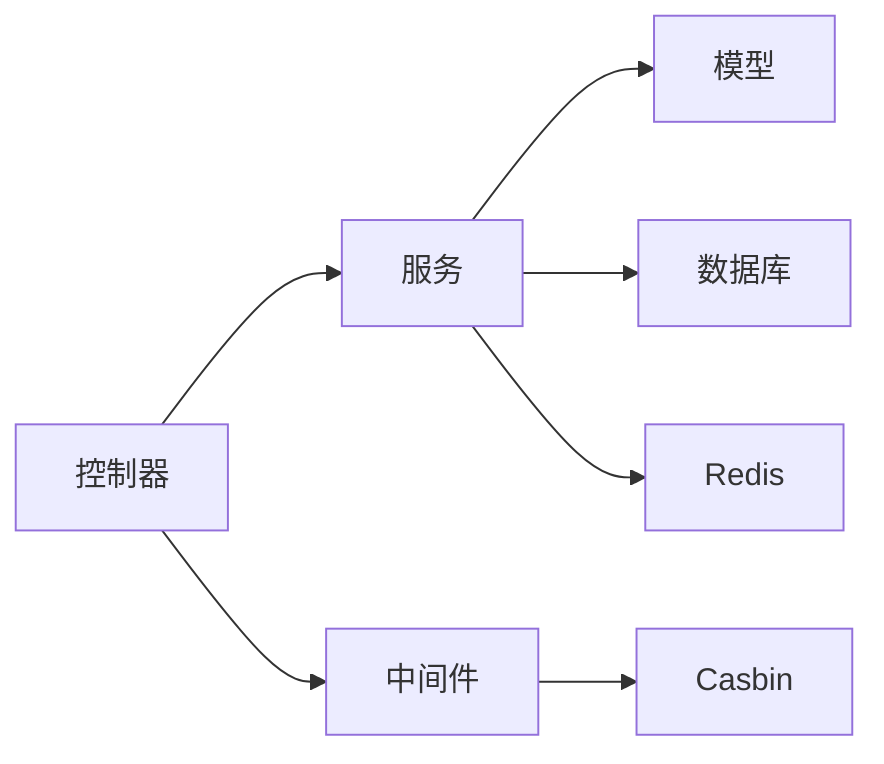

# 系统业务逻辑

<cite>
**本文引用的文件**
- [server/main.go](file://server/main.go)
- [server/router/enter.go](file://server/router/enter.go)
- [server/service/enter.go](file://server/service/enter.go)
- [server/middleware/casbin_rbac.go](file://server/middleware/casbin_rbac.go)
- [server/model/system/sys_user.go](file://server/model/system/sys_user.go)
- [server/model/system/sys_authority.go](file://server/model/system/sys_authority.go)
- [server/model/system/sys_api.go](file://server/model/system/sys_api.go)
- [server/model/system/sys_dictionary.go](file://server/model/system/sys_dictionary.go)
- [server/model/system/sys_params.go](file://server/model/system/sys_params.go)
- [server/api/v1/system/sys_user.go](file://server/api/v1/system/sys_user.go)
- [server/api/v1/system/sys_authority.go](file://server/api/v1/system/sys_authority.go)
- [server/api/v1/system/sys_menu.go](file://server/api/v1/system/sys_menu.go)
- [server/api/v1/system/sys_api.go](file://server/api/v1/system/sys_api.go)
- [server/api/v1/system/sys_dictionary.go](file://server/api/v1/system/sys_dictionary.go)
</cite>

## 目录
1. [引言](#引言)
2. [项目结构](#项目结构)
3. [核心组件](#核心组件)
4. [架构总览](#架构总览)
5. [详细组件分析](#详细组件分析)
6. [依赖分析](#依赖分析)
7. [性能考虑](#性能考虑)
8. [故障排查指南](#故障排查指南)
9. [结论](#结论)
10. [附录](#附录)

## 引言
本文件面向系统业务逻辑模块，围绕用户管理、权限控制、菜单管理、API管理、字典管理和参数管理等核心功能，系统性梳理数据验证规则、业务流程控制与异常处理机制；解释基于 RBAC 的角色权限体系及权限继承关系；阐述菜单动态生成的权限过滤与路由生成过程；并给出可扩展的接口定义与实现建议，帮助开发者快速理解与扩展系统能力。

## 项目结构
后端采用 Go + Gin 架构，按“路由-服务-数据访问”分层组织，系统入口负责初始化配置、日志、数据库与定时任务，随后启动 HTTP 服务。系统模块通过统一的 RouterGroup 与 ServiceGroup 组织，便于扩展与维护。

图示来源
- [server/main.go:30-52](file://server/main.go#L30-L52)
- [server/router/enter.go:8-14](file://server/router/enter.go#L8-L14)
- [server/service/enter.go:8-14](file://server/service/enter.go#L8-L14)

章节来源
- [server/main.go:30-52](file://server/main.go#L30-L52)
- [server/router/enter.go:8-14](file://server/router/enter.go#L8-L14)
- [server/service/enter.go:8-14](file://server/service/enter.go#L8-L14)

## 核心组件
- 用户管理：登录、注册、密码修改、用户列表、角色设置、个人信息维护、重置密码等。
- 权限控制：基于 Casbin 的 RBAC 权限拦截，支持刷新策略缓存。
- 菜单管理：动态路由树生成、菜单 CRUD、菜单-角色授权、菜单-角色批量设置。
- API 管理：API 增删改查、分组、同步、忽略、刷新 Casbin 策略、API-角色授权。
- 字典管理：字典树形结构、字典详情、导入导出、分页查询。
- 参数管理：系统参数的增删改查与校验。

章节来源
- [server/api/v1/system/sys_user.go:20-517](file://server/api/v1/system/sys_user.go#L20-L517)
- [server/api/v1/system/sys_authority.go:17-258](file://server/api/v1/system/sys_authority.go#L17-L258)
- [server/api/v1/system/sys_menu.go:18-336](file://server/api/v1/system/sys_menu.go#L18-L336)
- [server/api/v1/system/sys_api.go:18-382](file://server/api/v1/system/sys_api.go#L18-L382)
- [server/api/v1/system/sys_dictionary.go:14-192](file://server/api/v1/system/sys_dictionary.go#L14-L192)
- [server/model/system/sys_params.go:9-21](file://server/model/system/sys_params.go#L9-L21)

## 架构总览
系统采用“控制器-服务-数据模型-中间件”的分层架构。控制器负责请求绑定与参数校验、调用服务层执行业务、封装响应；服务层协调模型与仓储操作；中间件负责 JWT 鉴权与 Casbin RBAC 拦截；模型定义数据结构与关系。

图示来源
- [server/middleware/casbin_rbac.go:13-33](file://server/middleware/casbin_rbac.go#L13-L33)
- [server/api/v1/system/sys_user.go:27-161](file://server/api/v1/system/sys_user.go#L27-L161)
- [server/api/v1/system/sys_menu.go:26-37](file://server/api/v1/system/sys_menu.go#L26-L37)
- [server/api/v1/system/sys_api.go:27-46](file://server/api/v1/system/sys_api.go#L27-L46)

## 详细组件分析

### 用户管理
- 数据模型
  - SysUser：包含 UUID、用户名、密码、昵称、头像、主角色、多角色、手机号、邮箱、启用状态、用户配置等字段，并实现 Login 接口以适配统一登录上下文。
- 关键流程
  - 登录：参数绑定与校验、验证码校验（可配置）、用户存在性与密码校验、冻结状态检查、签发 JWT 并记录登录日志。
  - 注册：参数校验、构建用户对象（含多角色），调用服务完成持久化。
  - 修改密码：当前用户身份校验、原密码一致性校验、新密码写入。
  - 用户列表：分页参数校验，调用服务查询并返回分页结果。
  - 角色设置：单角色与多角色设置，必要时重新签发 JWT 并下发新令牌头。
  - 个人信息维护：支持昵称、头像、手机、邮箱、启用状态等字段更新。
  - 自身配置：JSON 配置写入。
  - 重置密码：管理员重置指定用户密码。
- 数据验证规则
  - 登录：用户名、密码、验证码等必填项与长度限制。
  - 注册：用户名、昵称、密码、头像、主角色、启用状态、手机号、邮箱等字段校验。
  - 修改密码：原密码与新密码格式校验。
  - 列表与设置：分页信息、ID、UUID 等标识类参数校验。
- 异常处理
  - 参数绑定失败、验证码错误、用户不存在或密码错误、用户被冻结、Redis 写入失败、JWT 黑名单作废失败等均记录日志并返回明确错误信息。

图示来源
- [server/api/v1/system/sys_user.go:27-99](file://server/api/v1/system/sys_user.go#L27-L99)
- [server/api/v1/system/sys_user.go:102-161](file://server/api/v1/system/sys_user.go#L102-L161)

章节来源
- [server/model/system/sys_user.go:20-63](file://server/model/system/sys_user.go#L20-L63)
- [server/api/v1/system/sys_user.go:27-517](file://server/api/v1/system/sys_user.go#L27-L517)

### 权限控制（RBAC）
- 实现原理
  - 角色模型：SysAuthority 定义角色 ID、角色名、父角色、默认路由、菜单集合等。
  - 用户-角色：SysUser 支持主角色与多角色关联。
  - 权限拦截：CasbinHandler 读取当前用户角色 ID、请求路径与方法，调用 Casbin Enforce 判断是否允许；拒绝时返回权限不足并终止后续处理。
  - 策略刷新：创建/复制/删除角色、设置角色资源权限、API-角色授权等变更后刷新 Casbin 策略，确保策略即时生效。
- 权限继承
  - 通过父子角色关系与多对多菜单/API授权实现权限继承与组合，子角色可叠加父角色权限。
- 异常处理
  - 当 Enforce 返回失败时，直接返回权限不足并中断请求链路。

图示来源
- [server/middleware/casbin_rbac.go:13-33](file://server/middleware/casbin_rbac.go#L13-L33)
- [server/api/v1/system/sys_authority.go:44-56](file://server/api/v1/system/sys_authority.go#L44-L56)
- [server/api/v1/system/sys_api.go:315-323](file://server/api/v1/system/sys_api.go#L315-L323)

章节来源
- [server/model/system/sys_authority.go:7-24](file://server/model/system/sys_authority.go#L7-L24)
- [server/middleware/casbin_rbac.go:13-33](file://server/middleware/casbin_rbac.go#L13-L33)
- [server/api/v1/system/sys_authority.go:44-56](file://server/api/v1/system/sys_authority.go#L44-L56)
- [server/api/v1/system/sys_api.go:315-323](file://server/api/v1/system/sys_api.go#L315-L323)

### 菜单管理
- 动态路由生成
  - 获取用户动态路由：根据用户角色 ID 调用服务层生成菜单树，返回给前端。
  - 获取基础菜单树：获取全部基础菜单树，供后台管理使用。
  - 菜单 CRUD：新增、删除、更新、按 ID 查询。
  - 菜单-角色授权：为指定角色增加菜单关联；获取指定角色的菜单；全量覆盖某菜单关联的角色列表。
- 权限过滤与路由生成
  - 控制器根据当前用户角色 ID 调用服务层生成菜单树，服务层基于角色-菜单多对多关系与菜单层级结构生成树形路由，前端据此渲染导航与页面路由。
- 数据验证规则
  - 新增/更新菜单：路径、父级、前端文件路径、排序标记等字段校验。
  - 删除/按 ID 查询：菜单 ID 校验。
  - 菜单-角色授权：角色 ID 校验，菜单 ID 校验。
- 异常处理
  - 参数绑定失败、菜单不存在、服务层查询/更新失败等均记录日志并返回错误信息。

图示来源
- [server/api/v1/system/sys_menu.go:26-37](file://server/api/v1/system/sys_menu.go#L26-L37)
- [server/api/v1/system/sys_menu.go:47-56](file://server/api/v1/system/sys_menu.go#L47-L56)
- [server/api/v1/system/sys_menu.go:67-85](file://server/api/v1/system/sys_menu.go#L67-L85)
- [server/api/v1/system/sys_menu.go:96-115](file://server/api/v1/system/sys_menu.go#L96-L115)

章节来源
- [server/api/v1/system/sys_menu.go:18-336](file://server/api/v1/system/sys_menu.go#L18-L336)

### API 管理
- 功能点
  - API 增删改查、分组查询、同步 API、忽略 API、确认同步、刷新 Casbin 策略、API-角色授权。
- 流程控制
  - 同步 API：扫描现有 API 与数据库差异，返回新增、删除、忽略项；确认同步后执行入库或删除。
  - 刷新策略：每次授权变更后刷新 Casbin 策略，保证权限即时生效。
- 数据验证规则
  - 新增/更新 API：路径、描述、分组、方法等字段校验。
  - 批量删除：ID 列表校验。
  - API-角色授权：路径与方法非空，角色 ID 列表校验。
- 异常处理
  - 参数绑定失败、同步失败、刷新失败、授权失败等均记录日志并返回错误信息。

图示来源
- [server/api/v1/system/sys_api.go:56-68](file://server/api/v1/system/sys_api.go#L56-L68)
- [server/api/v1/system/sys_api.go:123-137](file://server/api/v1/system/sys_api.go#L123-L137)
- [server/api/v1/system/sys_api.go:315-323](file://server/api/v1/system/sys_api.go#L315-L323)

章节来源
- [server/model/system/sys_api.go:7-29](file://server/model/system/sys_api.go#L7-L29)
- [server/api/v1/system/sys_api.go:18-382](file://server/api/v1/system/sys_api.go#L18-L382)

### 字典管理
- 功能点
  - 字典树形结构 CRUD、字典详情 CRUD、导入导出 JSON、分页查询。
- 数据模型
  - SysDictionary：包含名称、类型、状态、描述、父级 ID、子节点、详情集合等。
- 数据验证规则
  - 创建/更新：名称、类型、状态、描述等字段校验。
  - 导入：JSON 数据结构校验。
  - 导出：字典 ID 校验。
- 异常处理
  - 参数绑定失败、字典未创建或未开启、导入/导出失败等均记录日志并返回错误信息。

图示来源
- [server/api/v1/system/sys_dictionary.go:177-191](file://server/api/v1/system/sys_dictionary.go#L177-L191)
- [server/model/system/sys_dictionary.go:9-23](file://server/model/system/sys_dictionary.go#L9-L23)

章节来源
- [server/model/system/sys_dictionary.go:9-23](file://server/model/system/sys_dictionary.go#L9-L23)
- [server/api/v1/system/sys_dictionary.go:14-192](file://server/api/v1/system/sys_dictionary.go#L14-L192)

### 参数管理
- 功能点
  - 系统参数的增删改查，支持分页查询与模糊搜索。
- 数据模型
  - SysParams：包含参数名称、键、值、说明，其中名称、键、值为必填。
- 数据验证规则
  - 创建/更新：名称、键、值必填；说明可选。
- 异常处理
  - 参数绑定失败、查询/保存失败等均记录日志并返回错误信息。

章节来源
- [server/model/system/sys_params.go:9-21](file://server/model/system/sys_params.go#L9-L21)

## 依赖分析
- 组件耦合
  - 控制器仅依赖服务接口，服务层依赖模型与仓储，降低耦合度。
  - 中间件独立于业务逻辑，仅做鉴权与权限校验。
- 外部依赖
  - Casbin：提供 RBAC 策略引擎。
  - Redis：用于 JWT 黑名单与登录状态存储（可选多端登录场景）。
  - 数据库：GORM 持久化用户、角色、菜单、API、字典、参数等数据。
- 循环依赖
  - 通过接口与分层设计避免循环依赖；路由与服务通过聚合器统一暴露。

图示来源
- [server/middleware/casbin_rbac.go:13-33](file://server/middleware/casbin_rbac.go#L13-L33)
- [server/api/v1/system/sys_user.go:102-161](file://server/api/v1/system/sys_user.go#L102-L161)

章节来源
- [server/middleware/casbin_rbac.go:13-33](file://server/middleware/casbin_rbac.go#L13-L33)
- [server/api/v1/system/sys_user.go:102-161](file://server/api/v1/system/sys_user.go#L102-L161)

## 性能考虑
- 缓存与并发
  - 登录验证码防爆破可使用本地缓存计数；高并发下建议引入分布式缓存。
  - Casbin 策略刷新仅在权限变更时触发，避免频繁刷新造成开销。
- 数据访问
  - 分页查询与条件筛选减少一次性加载大量数据。
  - 复杂树形结构（菜单、字典）建议在服务层进行一次拉取后内存组装，减少多次往返。
- 序列化与传输
  - 响应体尽量精简，避免传输冗余字段；前端按需渲染。

## 故障排查指南
- 登录失败
  - 现象：用户名不存在或密码错误、验证码错误、用户被禁止登录。
  - 排查：检查参数绑定、验证码服务、用户启用状态、登录日志记录。
- 权限不足
  - 现象：Casbin Enforce 返回失败。
  - 排查：确认用户角色 ID、请求路径与方法、策略是否已刷新。
- 菜单为空或不正确
  - 现象：动态路由为空或缺少某些菜单。
  - 排查：确认角色-菜单关联、菜单层级结构、服务层菜单树生成逻辑。
- API 同步不一致
  - 现象：新增/删除 API 未生效。
  - 排查：确认同步流程、确认同步步骤、刷新 Casbin 策略。
- 字典导入失败
  - 现象：导入 JSON 报错或未生效。
  - 排查：检查 JSON 结构、字段映射、导入服务实现。

章节来源
- [server/api/v1/system/sys_user.go:49-97](file://server/api/v1/system/sys_user.go#L49-L97)
- [server/middleware/casbin_rbac.go:24-30](file://server/middleware/casbin_rbac.go#L24-L30)
- [server/api/v1/system/sys_menu.go:26-37](file://server/api/v1/system/sys_menu.go#L26-L37)
- [server/api/v1/system/sys_api.go:56-68](file://server/api/v1/system/sys_api.go#L56-L68)
- [server/api/v1/system/sys_dictionary.go:177-191](file://server/api/v1/system/sys_dictionary.go#L177-L191)

## 结论
本系统以清晰的分层架构与严格的参数校验为基础，结合 RBAC 权限模型与动态菜单生成机制，实现了用户、权限、菜单、API、字典与参数等核心业务的完整闭环。通过中间件统一拦截与服务层编排，既保证了安全性，也提升了可扩展性。建议在高并发场景下进一步优化缓存与策略刷新策略，并持续完善日志与监控体系。

## 附录
- 扩展接口建议
  - 在服务层新增接口时，遵循“请求参数模型 + 响应模型 + 业务逻辑 + 异常处理”的模式，保持与现有风格一致。
  - 权限相关扩展：通过 Casbin 策略刷新接口确保即时生效；角色继承可通过父子角色与多对多授权组合实现。
  - 菜单扩展：新增菜单后，通过菜单-角色授权接口为需要的角色赋予访问权限。
  - API 扩展：新增接口后，走同步流程并确认同步，最后刷新 Casbin 策略。
- 最佳实践
  - 所有对外接口均应经过参数校验与中间件拦截。
  - 权限变更后务必刷新 Casbin 策略。
  - 对敏感操作记录审计日志，便于追踪与回溯。