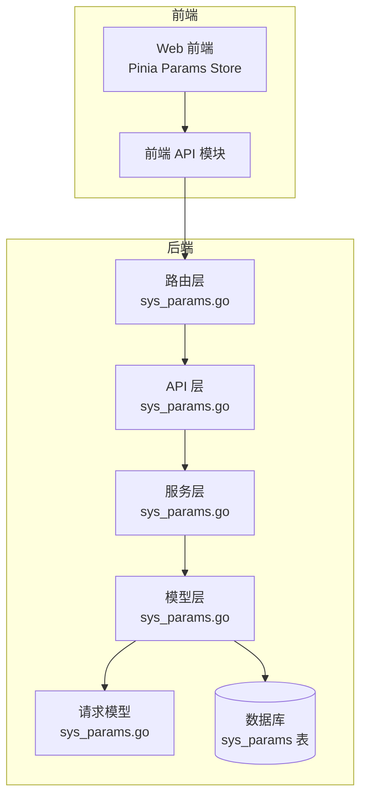
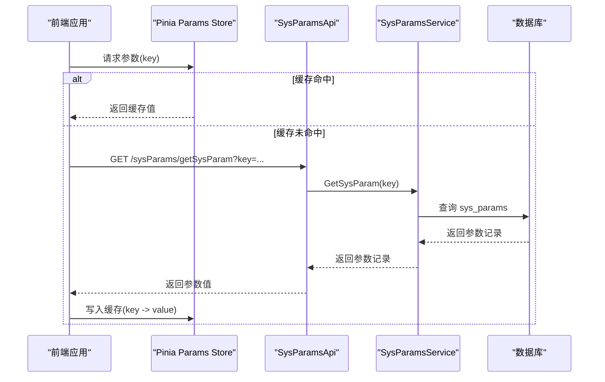
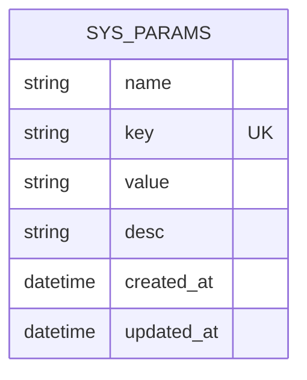
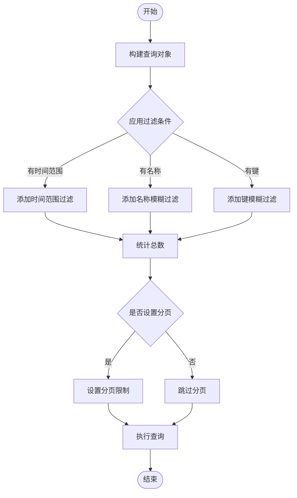
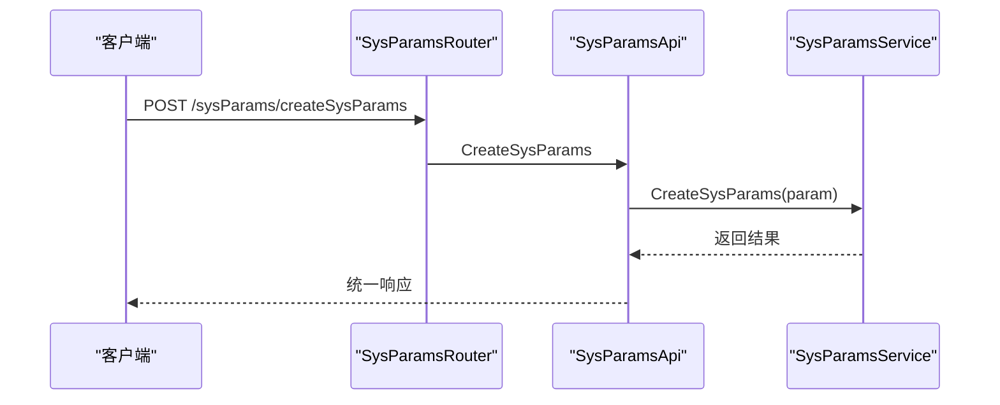
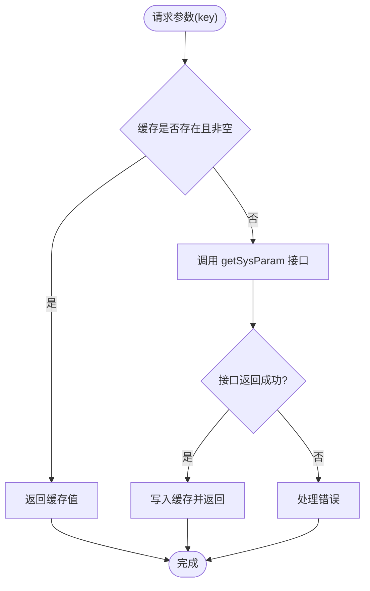
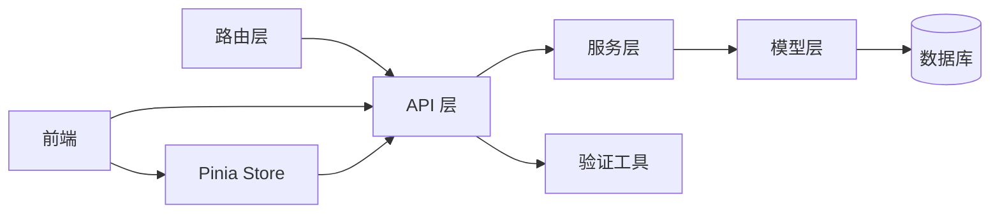

# 系统参数服务

<cite>
**本文档引用的文件**
- [sys_params.go](file://server/model/system/sys_params.go)
- [sys_params.go](file://server/service/system/sys_params.go)
- [sys_params.go](file://server/api/v1/system/sys_params.go)
- [sys_params.go](file://server/router/system/sys_params.go)
- [params.js](file://web/src/pinia/modules/params.js)
- [sysParams.js](file://web/src/api/sysParams.js)
- [global.go](file://server/global/global.go)
- [system.go](file://server/config/system.go)
- [validator.go](file://server/utils/validator.go)
- [system_events.go](file://server/utils/system_events.go)
- [init.go](file://server/initialize/init.go)
- [sys_params.go](file://server/model/system/request/sys_params.go)
</cite>

## 目录
1. [简介](#简介)
2. [项目结构](#项目结构)
3. [核心组件](#核心组件)
4. [架构概览](#架构概览)
5. [详细组件分析](#详细组件分析)
6. [依赖分析](#依赖分析)
7. [性能考虑](#性能考虑)
8. [故障排除指南](#故障排除指南)
9. [结论](#结论)
10. [附录](#附录)

## 简介
本文件全面阐述系统参数管理服务的设计与实现，覆盖参数配置、读取、更新等核心功能，并深入解析参数分类管理机制（系统级、业务参数、用户自定义参数）、参数缓存策略与热更新机制、参数验证规则与默认值处理、最佳实践（命名规范、版本控制、备份恢复）以及参数迁移、批量导入导出与审计日志等关键能力。文档旨在帮助开发者与运维人员准确理解并高效使用系统参数服务。

## 项目结构
系统参数服务采用经典的三层架构：API 层负责请求接入与响应封装；Service 层承载业务逻辑与数据持久化调用；Model 层定义数据模型与查询条件。前端通过 Pinia Store 缓存参数值，减少重复网络请求。

**图表来源**
- [sys_params.go:11-24](file://server/router/system/sys_params.go#L11-L24)
- [sys_params.go:14-171](file://server/api/v1/system/sys_params.go#L14-L171)
- [sys_params.go:9-82](file://server/service/system/sys_params.go#L9-L82)
- [sys_params.go:9-20](file://server/model/system/sys_params.go#L9-L20)
- [sys_params.go:8-14](file://server/model/system/request/sys_params.go#L8-L14)

**章节来源**
- [sys_params.go:1-26](file://server/router/system/sys_params.go#L1-L26)
- [sys_params.go:1-172](file://server/api/v1/system/sys_params.go#L1-L172)
- [sys_params.go:1-83](file://server/service/system/sys_params.go#L1-L83)
- [sys_params.go:1-21](file://server/model/system/sys_params.go#L1-L21)
- [sys_params.go:1-15](file://server/model/system/request/sys_params.go#L1-L15)

## 核心组件
- 数据模型（Model）
  - SysParams：定义参数的名称、键、值、描述等字段，映射到数据库表 sys_params。
- 服务层（Service）
  - SysParamsService：提供创建、删除、批量删除、更新、按 ID 查询、分页查询、按 key 查询等核心方法。
- API 层（API）
  - SysParamsApi：封装 HTTP 接口，完成参数的增删改查与分页列表展示。
- 路由层（Router）
  - SysParamsRouter：定义参数管理的路由组与权限中间件。
- 前端缓存（Pinia Store）
  - useParamsStore：基于 key 的参数值缓存，首次访问从后端拉取并写入缓存，后续直接从缓存读取。
- 验证工具（Utils）
  - validator：提供通用的参数验证规则（非空、正则、范围比较等），可扩展自定义规则集。

**章节来源**
- [sys_params.go:9-20](file://server/model/system/sys_params.go#L9-L20)
- [sys_params.go:9-82](file://server/service/system/sys_params.go#L9-L82)
- [sys_params.go:12-171](file://server/api/v1/system/sys_params.go#L12-L171)
- [sys_params.go:8-25](file://server/router/system/sys_params.go#L8-L25)
- [params.js:5-31](file://web/src/pinia/modules/params.js#L5-L31)
- [validator.go:11-295](file://server/utils/validator.go#L11-L295)

## 架构概览
系统参数服务遵循清晰的分层设计，从前端缓存到后端持久化形成闭环。参数变更通过 API 层进入服务层，持久化至数据库；前端通过 Pinia Store 缓存参数值，提升读取效率。当前实现未内置分布式缓存与参数热更新机制，但提供了系统事件触发器以支持后续扩展。

**图表来源**
- [sys_params.go:153-171](file://server/api/v1/system/sys_params.go#L153-L171)
- [sys_params.go:77-82](file://server/service/system/sys_params.go#L77-L82)
- [params.js:12-24](file://web/src/pinia/modules/params.js#L12-L24)

**章节来源**
- [sys_params.go:153-171](file://server/api/v1/system/sys_params.go#L153-L171)
- [sys_params.go:77-82](file://server/service/system/sys_params.go#L77-L82)
- [params.js:12-24](file://web/src/pinia/modules/params.js#L12-L24)

## 详细组件分析

### 数据模型与表结构
- 字段定义
  - 名称（name）：参数显示名称，必填。
  - 键（key）：参数唯一标识，必填。
  - 值（value）：参数实际值，必填。
  - 描述（desc）：参数说明，可选。
- 约束与索引
  - 建议对 key 建立唯一索引，保证键的唯一性与查询效率。
  - 支持按名称、键进行模糊检索，便于管理界面筛选。
- 表名映射
  - 映射到数据库表 sys_params。

**图表来源**
- [sys_params.go:9-20](file://server/model/system/sys_params.go#L9-L20)

**章节来源**
- [sys_params.go:9-20](file://server/model/system/sys_params.go#L9-L20)

### 服务层实现
- 核心方法
  - CreateSysParams：创建新参数。
  - DeleteSysParams/DeleteSysParamsByIds：删除单个或批量参数。
  - UpdateSysParams：更新参数。
  - GetSysParams：按 ID 查询。
  - GetSysParamsInfoList：分页查询，支持按时间范围、名称、键过滤。
  - GetSysParam：按 key 查询参数。
- 查询优化
  - 分页查询通过 Page 与 PageSize 控制，避免一次性加载过多数据。
  - 过滤条件动态拼接，支持多字段组合查询。

**图表来源**
- [sys_params.go:46-75](file://server/service/system/sys_params.go#L46-L75)

**章节来源**
- [sys_params.go:9-82](file://server/service/system/sys_params.go#L9-L82)

### API 层与路由
- 接口定义
  - 创建、删除、批量删除、更新、按 ID 查询、分页列表、按 key 查询。
- 权限与中间件
  - 受操作审计中间件保护的路由组，确保关键操作可追踪。
- 响应封装
  - 统一使用响应模块封装成功/失败消息与数据。

**图表来源**
- [sys_params.go:11-19](file://server/router/system/sys_params.go#L11-L19)
- [sys_params.go:14-37](file://server/api/v1/system/sys_params.go#L14-L37)

**章节来源**
- [sys_params.go:1-26](file://server/router/system/sys_params.go#L1-L26)
- [sys_params.go:1-172](file://server/api/v1/system/sys_params.go#L1-L172)

### 前端缓存与参数读取
- 缓存策略
  - 使用 Pinia Store 维护 paramsMap，key 作为索引缓存参数值。
  - 首次访问时若缓存为空，则发起后端请求获取参数值并写入缓存。
- 性能优势
  - 减少重复网络请求，提升参数读取性能。
  - 适合高频读取场景，如页面渲染、功能开关等。

**图表来源**
- [params.js:12-24](file://web/src/pinia/modules/params.js#L12-L24)
- [sysParams.js:105-111](file://web/src/api/sysParams.js#L105-L111)

**章节来源**
- [params.js:1-31](file://web/src/pinia/modules/params.js#L1-L31)
- [sysParams.js:1-112](file://web/src/api/sysParams.js#L1-L112)

### 参数验证规则与默认值处理
- 验证规则
  - 提供非空、正则匹配、长度/数值范围比较等通用规则。
  - 支持注册自定义规则集，便于业务扩展。
- 默认值处理
  - 当前实现未包含默认值字段与自动填充逻辑，建议在服务层或前端统一处理默认值策略。
- 应用建议
  - 在创建参数时结合验证规则确保数据质量；在读取参数时补充默认值保障健壮性。

**章节来源**
- [validator.go:11-295](file://server/utils/validator.go#L11-L295)

### 参数分类管理机制
- 系统级参数
  - 通常由系统管理员维护，涉及运行时配置（如数据库类型、端口、OSS 类型等）。
  - 建议通过专用键前缀或单独表空间隔离，配合严格权限控制。
- 业务参数
  - 与具体业务域相关，如业务开关、阈值配置等。
  - 建议按业务模块划分命名空间，便于治理与审计。
- 用户自定义参数
  - 允许用户在受控范围内进行个性化配置。
  - 建议提供可视化界面与版本控制，确保变更可追溯。

**章节来源**
- [system.go:3-15](file://server/config/system.go#L3-L15)

### 参数缓存策略与热更新机制
- 现状
  - 前端采用 Pinia Store 缓存参数值，后端未实现分布式缓存与参数热更新。
- 建议
  - 引入 Redis 缓存参数值，结合发布订阅或轮询实现热更新。
  - 提供参数变更事件通知，触发前端缓存刷新与后端缓存失效。
  - 对关键参数建立灰度发布与回滚机制。

**章节来源**
- [global.go:25-42](file://server/global/global.go#L25-L42)

### 参数迁移、批量导入导出与审计日志
- 批量导入导出
  - 可参考系统版本管理模块的导入导出机制，为参数提供统一的导入导出流程。
  - 建议支持 Excel/JSON 格式，包含参数键、值、描述与分类信息。
- 审计日志
  - 路由层已集成操作审计中间件，可用于记录参数管理的关键操作。
  - 建议在服务层增加参数变更审计日志，记录变更人、时间、前后值等。

**章节来源**
- [sys_params.go:12-13](file://server/router/system/sys_params.go#L12-L13)

## 依赖分析
系统参数服务各层之间耦合度低，职责清晰，便于独立演进与测试。

**图表来源**
- [sys_params.go:11-24](file://server/router/system/sys_params.go#L11-L24)
- [sys_params.go:12-171](file://server/api/v1/system/sys_params.go#L12-L171)
- [sys_params.go:9-82](file://server/service/system/sys_params.go#L9-L82)
- [sys_params.go:9-20](file://server/model/system/sys_params.go#L9-L20)
- [validator.go:11-30](file://server/utils/validator.go#L11-L30)
- [params.js:5-31](file://web/src/pinia/modules/params.js#L5-L31)

**章节来源**
- [sys_params.go:1-26](file://server/router/system/sys_params.go#L1-L26)
- [sys_params.go:1-172](file://server/api/v1/system/sys_params.go#L1-L172)
- [sys_params.go:1-83](file://server/service/system/sys_params.go#L1-L83)
- [sys_params.go:1-21](file://server/model/system/sys_params.go#L1-L21)
- [validator.go:1-295](file://server/utils/validator.go#L1-L295)
- [params.js:1-31](file://web/src/pinia/modules/params.js#L1-L31)

## 性能考虑
- 查询性能
  - 对 key 建立唯一索引，提升按 key 查询性能。
  - 分页查询避免全表扫描，合理设置分页大小。
- 缓存策略
  - 前端 Pinia Store 已实现基础缓存；建议引入 Redis 实现跨进程共享缓存。
  - 对热点参数设置合理的缓存 TTL，平衡一致性与性能。
- 并发控制
  - 使用单飞机制（singleflight）避免缓存击穿与并发风暴。
- 日志与监控
  - 记录参数访问与变更日志，结合指标监控参数读写延迟与错误率。

**章节来源**
- [global.go:36-41](file://server/global/global.go#L36-L41)

## 故障排除指南
- 参数读取失败
  - 检查 key 是否正确，确认数据库中存在对应记录。
  - 查看 API 层日志输出，定位数据库查询异常。
- 参数更新失败
  - 确认请求体字段完整且符合验证规则。
  - 检查数据库连接状态与事务提交情况。
- 缓存未生效
  - 确认前端缓存写入逻辑是否执行。
  - 检查浏览器缓存或代理缓存影响。
- 系统重载与热更新
  - 若需实现热更新，可利用系统事件触发器注册重载处理函数，确保参数变更后及时生效。

**章节来源**
- [sys_params.go:23-37](file://server/api/v1/system/sys_params.go#L23-L37)
- [system_events.go:16-34](file://server/utils/system_events.go#L16-L34)
- [init.go:10-15](file://server/initialize/init.go#L10-L15)

## 结论
系统参数服务提供了完整的参数生命周期管理能力，具备良好的扩展性与可维护性。当前实现侧重于基础的增删改查与前端缓存，建议在后续版本中完善参数分类、分布式缓存与热更新、批量导入导出与审计日志等能力，以满足更复杂的生产环境需求。

## 附录

### 最佳实践
- 命名规范
  - 使用清晰、语义化的 key，建议采用“模块_子系统_参数名”的层级命名。
  - 区分系统级、业务与用户自定义参数，便于权限与审计管理。
- 版本控制
  - 对关键参数变更进行版本化管理，支持回滚与灰度发布。
- 备份恢复
  - 定期导出参数清单，建立备份与恢复流程，确保灾难恢复。
- 验证与默认值
  - 在创建参数时启用验证规则，读取时补充默认值，提升系统稳定性。

### 参数验证规则示例
- 非空校验：确保必填字段不为空。
- 正则校验：对复杂格式（如邮箱、URL）进行约束。
- 范围校验：对数值或长度设定上下限。

**章节来源**
- [validator.go:118-165](file://server/utils/validator.go#L118-L165)