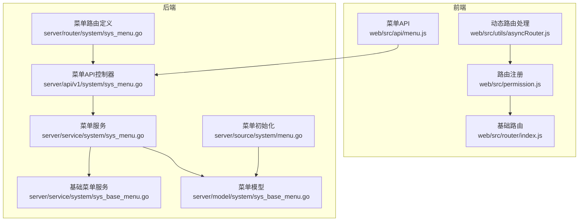
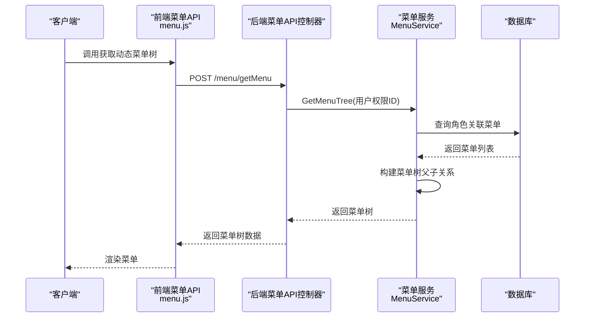
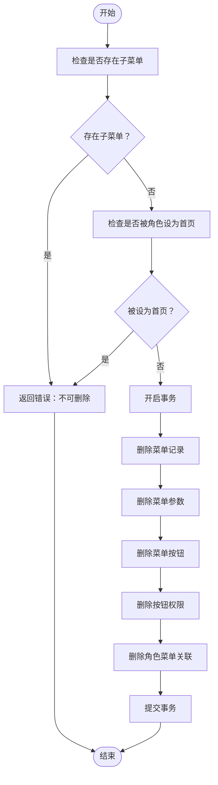
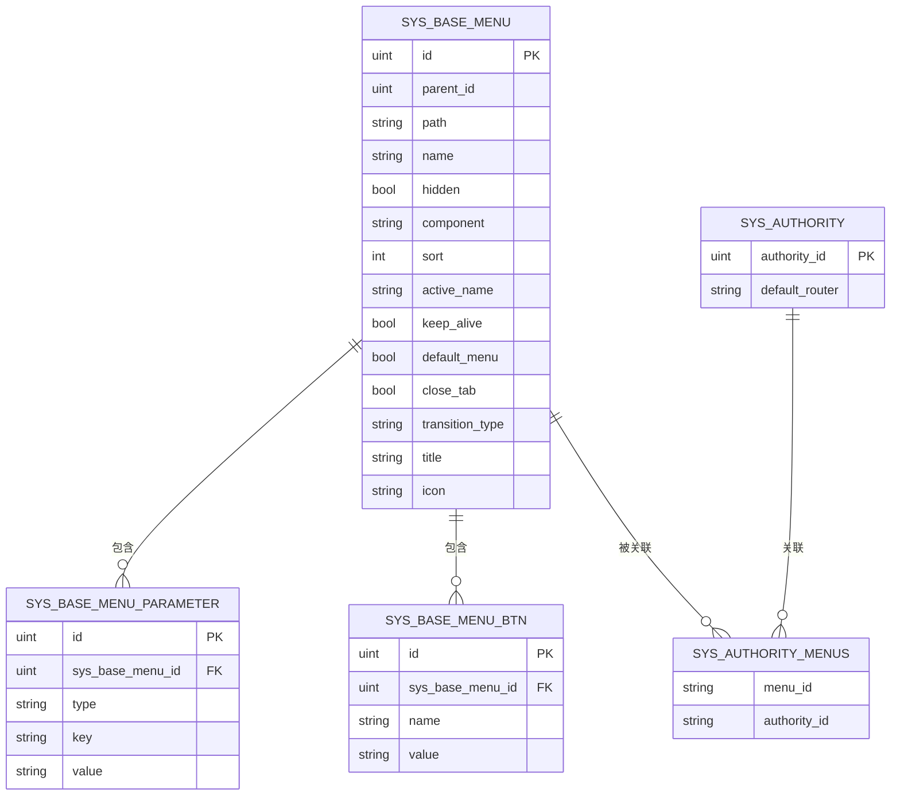
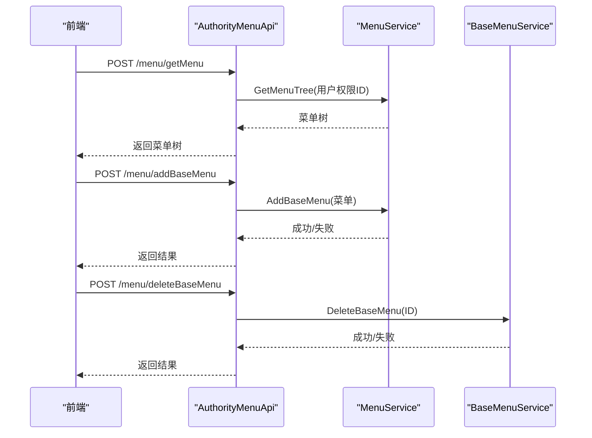
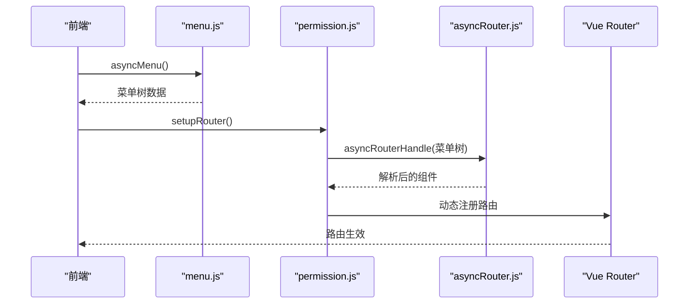
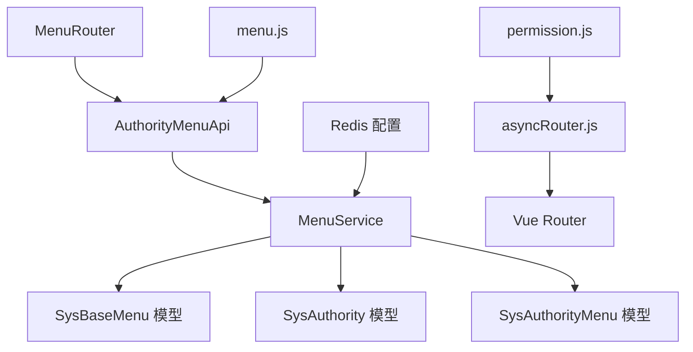

# 菜单管理服务

<cite>
**本文档引用的文件**
- [sys_menu.go](file://server/service/system/sys_menu.go)
- [sys_menu.go](file://server/api/v1/system/sys_menu.go)
- [sys_menu.go](file://server/router/system/sys_menu.go)
- [sys_base_menu.go](file://server/model/system/sys_base_menu.go)
- [sys_menu.go](file://server/model/system/request/sys_menu.go)
- [sys_menu.go](file://server/model/system/response/sys_menu.go)
- [menu.js](file://web/src/api/menu.js)
- [asyncRouter.js](file://web/src/utils/asyncRouter.js)
- [index.js](file://web/src/router/index.js)
- [permission.js](file://web/src/permission.js)
- [sys_base_menu.go](file://server/service/system/sys_base_menu.go)
- [menu.go](file://server/source/system/menu.go)
- [redis.go](file://server/config/redis.go)
</cite>

## 目录
1. [简介](#简介)
2. [项目结构](#项目结构)
3. [核心组件](#核心组件)
4. [架构概览](#架构概览)
5. [详细组件分析](#详细组件分析)
6. [依赖分析](#依赖分析)
7. [性能考虑](#性能考虑)
8. [故障排除指南](#故障排除指南)
9. [结论](#结论)
10. [附录](#附录)

## 简介
本文件全面阐述测试管理平台的菜单管理服务，重点覆盖菜单的创建、编辑、删除、排序等核心功能，以及菜单层级结构的管理、父子关系维护、无限级分类处理。文档还深入解释菜单动态生成的业务逻辑，包括基于用户权限的菜单过滤、路由配置生成过程、图标与权限标识管理机制，以及菜单扩展与自定义菜单类型的开发指南。最后涵盖菜单缓存策略、权限验证集成和前端路由同步的技术实现。

## 项目结构
菜单管理服务跨越后端服务层、API 层、路由层与前端三层，形成完整的菜单生命周期管理闭环：
- 后端服务层：负责菜单树构建、权限过滤、角色菜单授权、菜单参数与按钮管理
- 后端 API 层：提供菜单 CRUD、菜单树查询、角色菜单授权、菜单角色关联查询等接口
- 后端路由层：定义菜单管理相关路由及中间件
- 前端：调用后端接口获取动态菜单树，动态解析组件路径并注册路由



**图表来源**
- [sys_menu.go:18-336](file://server/api/v1/system/sys_menu.go#L18-L336)
- [sys_menu.go:10-29](file://server/router/system/sys_menu.go#L10-L29)
- [sys_menu.go:18-391](file://server/service/system/sys_menu.go#L18-L391)
- [sys_base_menu.go:19-148](file://server/service/system/sys_base_menu.go#L19-L148)
- [sys_base_menu.go:7-44](file://server/model/system/sys_base_menu.go#L7-L44)
- [menu.js:6-142](file://web/src/api/menu.js#L6-L142)
- [asyncRouter.js:4-29](file://web/src/utils/asyncRouter.js#L4-L29)
- [permission.js:117-145](file://web/src/permission.js#L117-L145)
- [index.js:1-42](file://web/src/router/index.js#L1-L42)
- [menu.go:48-128](file://server/source/system/menu.go#L48-L128)

**章节来源**
- [sys_menu.go:18-391](file://server/service/system/sys_menu.go#L18-L391)
- [sys_menu.go:18-336](file://server/api/v1/system/sys_menu.go#L18-L336)
- [sys_menu.go:10-29](file://server/router/system/sys_menu.go#L10-L29)
- [sys_base_menu.go:19-148](file://server/service/system/sys_base_menu.go#L19-L148)
- [sys_base_menu.go:7-44](file://server/model/system/sys_base_menu.go#L7-L44)
- [menu.js:6-142](file://web/src/api/menu.js#L6-L142)
- [asyncRouter.js:4-29](file://web/src/utils/asyncRouter.js#L4-L29)
- [permission.js:117-145](file://web/src/permission.js#L117-L145)
- [index.js:1-42](file://web/src/router/index.js#L1-L42)
- [menu.go:48-128](file://server/source/system/menu.go#L48-L128)

## 核心组件
- 菜单服务（MenuService）：提供菜单树构建、权限过滤、角色菜单授权、菜单参数与按钮管理等能力
- 基础菜单服务（BaseMenuService）：提供菜单删除、更新、按ID查询等基础操作
- 菜单模型（SysBaseMenu）：定义菜单字段、元信息（图标、标题、缓存等）、父子关系、参数与按钮集合
- 菜单API控制器（AuthorityMenuApi）：封装菜单管理相关接口，负责请求校验、调用服务层并返回响应
- 菜单路由（MenuRouter）：定义菜单管理相关路由及中间件
- 前端菜单API（menu.js）：封装后端菜单接口调用
- 动态路由处理（asyncRouter.js）：将字符串组件路径转换为实际组件模块
- 权限路由注册（permission.js）：根据后端返回的菜单树动态注册前端路由
- 菜单初始化（menu.go）：系统启动时初始化基础菜单与子菜单

**章节来源**
- [sys_menu.go:18-391](file://server/service/system/sys_menu.go#L18-L391)
- [sys_base_menu.go:19-148](file://server/service/system/sys_base_menu.go#L19-L148)
- [sys_base_menu.go:7-44](file://server/model/system/sys_base_menu.go#L7-L44)
- [sys_menu.go:18-336](file://server/api/v1/system/sys_menu.go#L18-L336)
- [sys_menu.go:10-29](file://server/router/system/sys_menu.go#L10-L29)
- [menu.js:6-142](file://web/src/api/menu.js#L6-L142)
- [asyncRouter.js:4-29](file://web/src/utils/asyncRouter.js#L4-L29)
- [permission.js:117-145](file://web/src/permission.js#L117-L145)
- [menu.go:48-128](file://server/source/system/menu.go#L48-L128)

## 架构概览
菜单管理服务采用分层架构，后端通过服务层统一处理业务逻辑，API 层负责接口契约与参数校验，路由层定义访问入口；前端通过 API 层获取动态菜单树，再由动态路由处理器解析组件路径并注册到 Vue Router 中。



**图表来源**
- [sys_menu.go:26-37](file://server/api/v1/system/sys_menu.go#L26-L37)
- [sys_menu.go:78-85](file://server/service/system/sys_menu.go#L78-L85)
- [menu.js:6-11](file://web/src/api/menu.js#L6-L11)

## 详细组件分析

### 菜单服务（MenuService）
- 菜单树构建：通过角色ID查询关联菜单，按 ParentId 构建树形结构，支持多级嵌套
- 权限过滤：严格模式下限制角色只能看到其上级角色授予的菜单
- 角色菜单授权：为角色批量设置菜单权限，支持严格模式下的跨级校验
- 菜单参数与按钮：预加载菜单参数与按钮，支持动态按钮权限
- 菜单角色关联：提供查询与全量覆盖某菜单关联角色列表的能力

```mermaid
classDiagram
class MenuService {
+GetMenuTree(authorityId) []SysMenu
+GetBaseMenuTree(authorityId) []SysBaseMenu
+AddMenuAuthority(menus, adminAuthorityID, authorityId) error
+GetMenuAuthority(info) []SysMenu
+GetInfoList(authorityId) interface{}
+GetAuthoritiesByMenuId(menuId) []uint
+GetDefaultRouterAuthorityIds(menuId) []uint
+SetMenuAuthorities(menuId, authorityIds) error
+UserAuthorityDefaultRouter(user) void
}
class SysBaseMenu {
+ID uint
+ParentId uint
+Path string
+Name string
+Hidden bool
+Component string
+Sort int
+Meta Meta
+Children []SysBaseMenu
+Parameters []SysBaseMenuParameter
+MenuBtn []SysBaseMenuBtn
}
class Meta {
+Title string
+Icon string
+KeepAlive bool
+DefaultMenu bool
+CloseTab bool
+TransitionType string
}
MenuService --> SysBaseMenu : "构建菜单树"
SysBaseMenu --> Meta : "包含"
```

**图表来源**
- [sys_menu.go:18-391](file://server/service/system/sys_menu.go#L18-L391)
- [sys_base_menu.go:7-44](file://server/model/system/sys_base_menu.go#L7-L44)

**章节来源**
- [sys_menu.go:22-391](file://server/service/system/sys_menu.go#L22-L391)
- [sys_base_menu.go:7-44](file://server/model/system/sys_base_menu.go#L7-L44)

### 基础菜单服务（BaseMenuService）
- 删除菜单：防止删除存在子菜单或被角色设为首页的菜单，事务性删除菜单、参数、按钮及相关权限
- 更新菜单：支持更新菜单元信息、组件路径、排序等，同时维护参数与按钮集合
- 查询菜单：按ID查询菜单并预加载按钮与参数



**图表来源**
- [sys_base_menu.go:21-63](file://server/service/system/sys_base_menu.go#L21-L63)

**章节来源**
- [sys_base_menu.go:21-148](file://server/service/system/sys_base_menu.go#L21-L148)

### 菜单模型（SysBaseMenu）
- 字段定义：包含菜单ID、父ID、路由路径、名称、是否隐藏、组件路径、排序、元信息等
- 元信息（Meta）：包含标题、图标、是否缓存、是否默认菜单、是否关闭标签、路由切换动画等
- 关系映射：支持多对多角色关联、参数集合、按钮集合



**图表来源**
- [sys_base_menu.go:7-44](file://server/model/system/sys_base_menu.go#L7-L44)

**章节来源**
- [sys_base_menu.go:7-44](file://server/model/system/sys_base_menu.go#L7-L44)

### 菜单API控制器（AuthorityMenuApi）
- 动态菜单树：根据用户权限ID获取菜单树
- 基础菜单树：获取所有基础菜单树（用于后台管理）
- 菜单授权：为角色批量设置菜单权限
- 菜单查询：按ID获取菜单详情
- 菜单角色关联：查询与全量覆盖菜单关联角色



**图表来源**
- [sys_menu.go:26-336](file://server/api/v1/system/sys_menu.go#L26-L336)
- [sys_menu.go:136-183](file://server/service/system/sys_menu.go#L136-L183)
- [sys_base_menu.go:21-63](file://server/service/system/sys_base_menu.go#L21-L63)

**章节来源**
- [sys_menu.go:18-336](file://server/api/v1/system/sys_menu.go#L18-L336)
- [sys_menu.go:136-183](file://server/service/system/sys_menu.go#L136-L183)
- [sys_base_menu.go:21-63](file://server/service/system/sys_base_menu.go#L21-L63)

### 前端动态路由与菜单渲染
- 动态菜单获取：前端通过 menu.js 调用后端接口获取动态菜单树
- 组件路径解析：asyncRouter.js 将字符串组件路径解析为实际组件模块
- 路由注册：permission.js 根据菜单树动态注册路由，支持 defaultMenu 顶级路由与 layout 包裹



**图表来源**
- [menu.js:6-11](file://web/src/api/menu.js#L6-L11)
- [permission.js:117-145](file://web/src/permission.js#L117-L145)
- [asyncRouter.js:4-29](file://web/src/utils/asyncRouter.js#L4-L29)
- [index.js:1-42](file://web/src/router/index.js#L1-L42)

**章节来源**
- [menu.js:6-142](file://web/src/api/menu.js#L6-L142)
- [asyncRouter.js:4-29](file://web/src/utils/asyncRouter.js#L4-L29)
- [permission.js:117-145](file://web/src/permission.js#L117-L145)
- [index.js:1-42](file://web/src/router/index.js#L1-L42)

### 菜单初始化与默认菜单
- 初始化流程：系统启动时自动迁移菜单相关表并初始化基础菜单与子菜单
- 菜单映射：通过名称建立父子关系映射，确保子菜单 ParentId 正确
- 默认菜单：支持将某些菜单作为顶级路由（defaultMenu）直接挂载到根路径

**章节来源**
- [menu.go:48-128](file://server/source/system/menu.go#L48-L128)

## 依赖分析
- 后端依赖：MenuService 依赖 GORM 数据库访问，结合 SysBaseMenu、SysAuthorityMenu 等模型完成菜单树构建与权限过滤
- 前端依赖：前端通过 menu.js 调用后端接口，permission.js 与 asyncRouter.js 协作完成动态路由注册与组件解析
- 配置依赖：Redis 配置用于缓存策略（如需启用）



**图表来源**
- [sys_menu.go:18-391](file://server/service/system/sys_menu.go#L18-L391)
- [sys_base_menu.go:7-44](file://server/model/system/sys_base_menu.go#L7-L44)
- [sys_menu.go:18-336](file://server/api/v1/system/sys_menu.go#L18-L336)
- [sys_menu.go:10-29](file://server/router/system/sys_menu.go#L10-L29)
- [menu.js:6-142](file://web/src/api/menu.js#L6-L142)
- [permission.js:117-145](file://web/src/permission.js#L117-L145)
- [asyncRouter.js:4-29](file://web/src/utils/asyncRouter.js#L4-L29)
- [redis.go:3-10](file://server/config/redis.go#L3-L10)

**章节来源**
- [sys_menu.go:18-391](file://server/service/system/sys_menu.go#L18-L391)
- [sys_base_menu.go:7-44](file://server/model/system/sys_base_menu.go#L7-L44)
- [sys_menu.go:18-336](file://server/api/v1/system/sys_menu.go#L18-L336)
- [sys_menu.go:10-29](file://server/router/system/sys_menu.go#L10-L29)
- [menu.js:6-142](file://web/src/api/menu.js#L6-L142)
- [permission.js:117-145](file://web/src/permission.js#L117-L145)
- [asyncRouter.js:4-29](file://web/src/utils/asyncRouter.js#L4-L29)
- [redis.go:3-10](file://server/config/redis.go#L3-L10)

## 性能考虑
- 菜单树构建：使用 map[ParentId][]Menu 的方式一次性构建树，避免深度递归带来的复杂度问题
- 预加载策略：通过 Preload 加载参数与按钮，减少 N+1 查询
- 严格权限模式：在严格模式下通过子角色授权集合限制查询范围，降低不必要的数据传输
- 缓存策略：可利用 Redis 缓存菜单树与角色授权映射，减少数据库压力（需在服务层实现）

[本节为通用性能建议，无需特定文件引用]

## 故障排除指南
- 菜单删除失败：若提示存在子菜单或被角色设为首页，需先清理子菜单或调整角色首页设置
- 菜单更新失败：若修改名称导致冲突，需确保名称唯一性
- 动态路由不生效：确认后端返回的组件路径正确且前端 asyncRouter.js 能解析到对应模块
- 路由注册异常：检查 permission.js 中 defaultMenu 与 layout 的处理逻辑，确保顶级路由与子路由正确挂载

**章节来源**
- [sys_base_menu.go:21-63](file://server/service/system/sys_base_menu.go#L21-L63)
- [sys_menu.go:136-183](file://server/service/system/sys_menu.go#L136-L183)
- [asyncRouter.js:4-29](file://web/src/utils/asyncRouter.js#L4-L29)
- [permission.js:117-145](file://web/src/permission.js#L117-L145)

## 结论
菜单管理服务通过清晰的分层设计实现了菜单的完整生命周期管理，从前端动态菜单树生成到后端权限过滤与角色授权，形成了稳定可靠的菜单体系。通过模型化的元信息管理与初始化流程，系统具备良好的扩展性与可维护性。建议在生产环境中引入缓存策略与更细粒度的权限控制，进一步提升性能与安全性。

## 附录

### 菜单字段与含义
- 菜单ID：唯一标识
- 父ID：父菜单ID，0 表示顶级
- 路由路径：前端路由 path
- 路由名称：前端路由 name
- 是否隐藏：是否在菜单列表中显示
- 组件路径：对应前端视图组件路径
- 排序：菜单排序标记
- 元信息：标题、图标、是否缓存、是否默认菜单、是否关闭标签、路由切换动画等

**章节来源**
- [sys_base_menu.go:7-44](file://server/model/system/sys_base_menu.go#L7-L44)

### 菜单动态生成流程
- 后端：根据用户权限查询菜单，构建树形结构并返回
- 前端：解析组件路径，动态注册路由，支持顶级路由与 layout 包裹

**章节来源**
- [sys_menu.go:26-56](file://server/api/v1/system/sys_menu.go#L26-L56)
- [permission.js:117-145](file://web/src/permission.js#L117-L145)
- [asyncRouter.js:4-29](file://web/src/utils/asyncRouter.js#L4-L29)

### 菜单扩展与自定义类型开发指南
- 扩展字段：可在 SysBaseMenu 中增加新字段，配合前端展示与路由配置
- 自定义菜单类型：通过 Meta 中的标志位（如 defaultMenu）控制路由行为
- 参数与按钮：通过 Parameters 与 MenuBtn 扩展菜单的动态行为与权限控制

**章节来源**
- [sys_base_menu.go:7-44](file://server/model/system/sys_base_menu.go#L7-L44)
- [menu.go:48-128](file://server/source/system/menu.go#L48-L128)