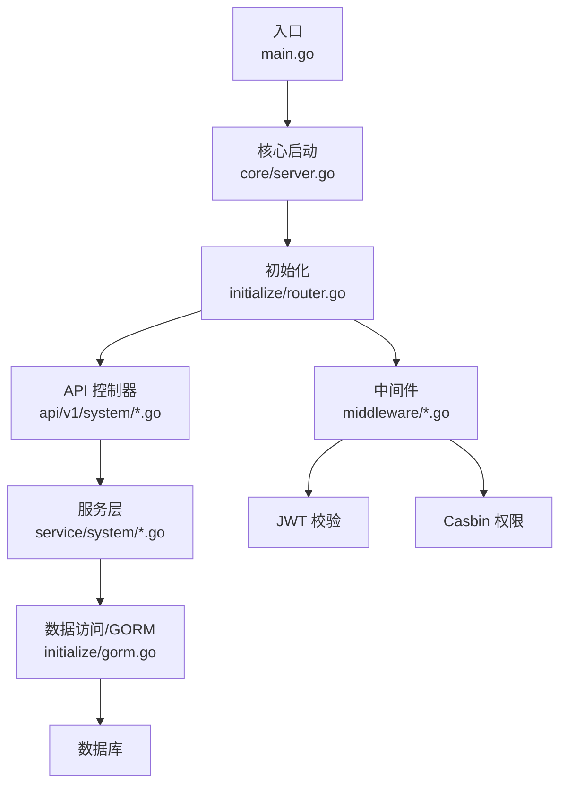
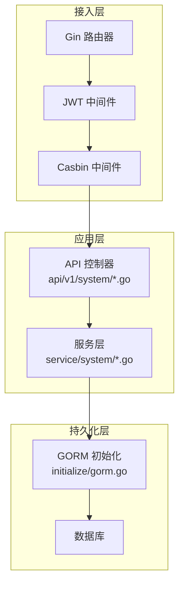
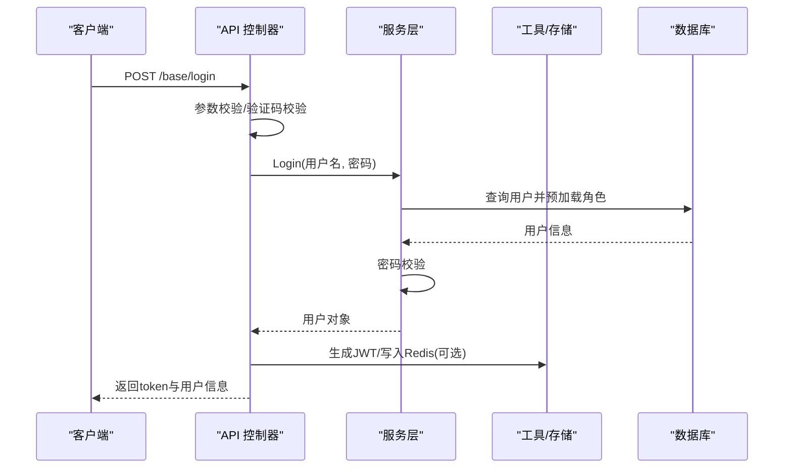
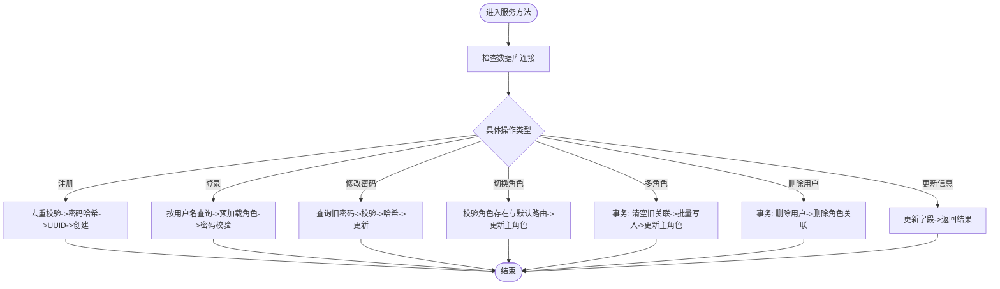
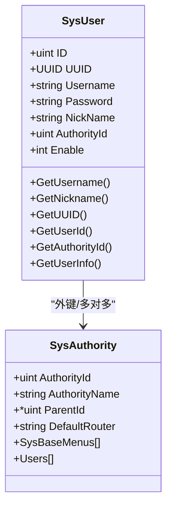
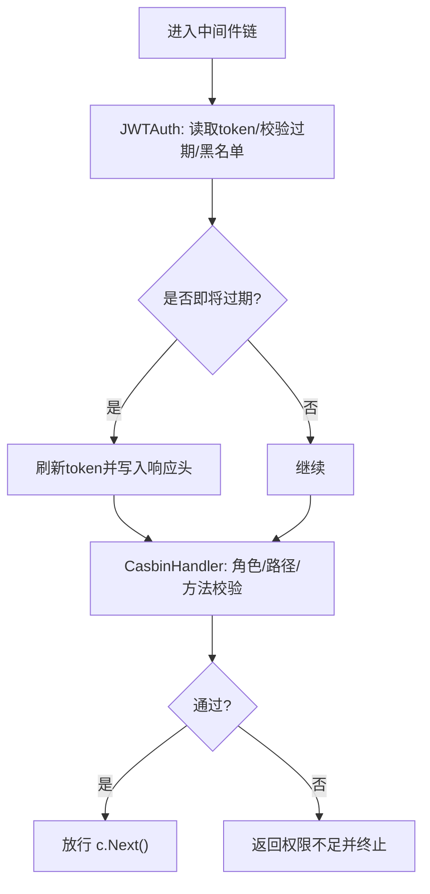
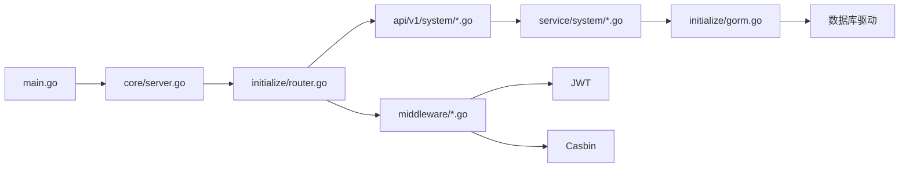

# 后端系统

<cite>
**本文引用的文件**
- [main.go](file://server/main.go)
- [go.mod](file://server/go.mod)
- [config.go](file://server/config/config.go)
- [global.go](file://server/global/global.go)
- [server.go](file://server/core/server.go)
- [router.go](file://server/initialize/router.go)
- [sys_user.go（模型）](file://server/model/system/sys_user.go)
- [sys_user.go（服务）](file://server/service/system/sys_user.go)
- [sys_user.go（API）](file://server/api/v1/system/sys_user.go)
- [jwt.go（中间件）](file://server/middleware/jwt.go)
- [casbin_rbac.go（中间件）](file://server/middleware/casbin_rbac.go)
- [sys_authority.go（模型）](file://server/model/system/sys_authority.go)
- [gorm.go（初始化）](file://server/initialize/gorm.go)
- [upload.go（上传接口）](file://server/utils/upload/upload.go)
- [sys_casbin.go（API）](file://server/api/v1/system/sys_casbin.go)
</cite>

## 目录
1. [简介](#简介)
2. [项目结构](#项目结构)
3. [核心组件](#核心组件)
4. [架构总览](#架构总览)
5. [详细组件分析](#详细组件分析)
6. [依赖分析](#依赖分析)
7. [性能考虑](#性能考虑)
8. [故障排查指南](#故障排查指南)
9. [结论](#结论)
10. [附录](#附录)

## 简介
本文件面向测试管理平台后端系统，围绕基于 Gin 的三层架构（API 层、服务层、数据访问层）进行系统化梳理，覆盖 RESTful 设计原则、路由组织、JWT 认证、Casbin 权限控制、中间件体系、数据库与 GORM 使用、事务管理、数据模型、用户与权限管理、文件上传下载等核心能力，并提供可操作的最佳实践与排障建议。

## 项目结构
后端采用模块化分层组织：
- 入口与启动：main.go 负责初始化系统并启动服务；core/server.go 组织运行参数与服务启动流程。
- 配置与全局：config/config.go 定义各类配置项；global/global.go 提供全局变量与并发安全访问。
- 初始化：initialize/router.go 组织路由注册与中间件链；initialize/gorm.go 负责数据库连接与表迁移。
- API 层：api/v1/system 下按领域拆分控制器，负责请求解析、参数校验、响应封装与调用服务层。
- 服务层：service/system 下实现业务逻辑，封装事务、复杂查询与领域操作。
- 数据模型：model/system 与 model/example 定义实体与 DTO，配合 GORM 映射。
- 中间件：middleware 提供 JWT 校验、Casbin 权限拦截、跨域、日志、限流等。
- 工具与上传：utils/upload 提供对象存储抽象与多云实现选择。

图表来源
- [main.go:30-52](file://server/main.go#L30-L52)
- [server.go:14-49](file://server/core/server.go#L14-L49)
- [router.go:36-118](file://server/initialize/router.go#L36-L118)

章节来源
- [main.go:1-52](file://server/main.go#L1-52)
- [server.go:14-49](file://server/core/server.go#L14-L49)
- [router.go:36-118](file://server/initialize/router.go#L36-L118)

## 核心组件
- 入口与启动
  - main.initializeSystem 负责加载配置、初始化日志、数据库、定时任务、表结构等。
  - core.RunServer 组织路由、监听端口、打印启动信息。
- 配置与全局
  - config.Server 聚合 JWT、Zap 日志、Redis/Mongo、数据库、对象存储、Excel、跨域、MCP 等配置。
  - global 包提供全局 DB、Redis、Mongo、配置、日志、定时任务、MCP 服务等单例与并发安全访问。
- 初始化
  - initialize.Gorm 根据配置选择数据库驱动并建立连接。
  - initialize.RegisterTables 自动迁移系统与业务表。
  - initialize.Routers 构建 Gin 引擎、注册中间件与路由组。
- 中间件
  - JWTAuth：从请求头提取 token，校验过期与黑名单，必要时刷新 token 并写入响应头。
  - CasbinHandler：根据角色、路径、方法进行权限判断。
- API/服务/模型
  - API 层负责参数绑定、校验与响应封装。
  - 服务层处理业务规则、事务与复杂查询。
  - 模型层定义实体与关联关系，支持预加载与多对多映射。

章节来源
- [main.go:37-52](file://server/main.go#L37-L52)
- [config.go:1-41](file://server/config/config.go#L1-L41)
- [global.go:25-69](file://server/global/global.go#L25-L69)
- [gorm.go:14-88](file://server/initialize/gorm.go#L14-L88)
- [router.go:36-118](file://server/initialize/router.go#L36-L118)
- [jwt.go:16-90](file://server/middleware/jwt.go#L16-L90)
- [casbin_rbac.go:12-33](file://server/middleware/casbin_rbac.go#L12-L33)

## 架构总览
系统遵循“API -> 服务 -> 数据访问”的分层设计，结合中间件完成认证与授权。路由按业务域分组，公共路由无需鉴权，私有路由叠加 JWT 与 Casbin 中间件。

图表来源
- [router.go:68-105](file://server/initialize/router.go#L68-L105)
- [jwt.go:16-90](file://server/middleware/jwt.go#L16-L90)
- [casbin_rbac.go:12-33](file://server/middleware/casbin_rbac.go#L12-L33)
- [gorm.go:14-35](file://server/initialize/gorm.go#L14-L35)

## 详细组件分析

### API 层：用户管理与登录
- 登录流程
  - API 接收用户名、密码、验证码，进行参数校验与验证码校验。
  - 调用服务层 Login，验证密码后生成 JWT 并记录登录日志。
  - 支持单点登录与多端互斥，必要时写入 Redis 并刷新 token。
- 注册、修改密码、重置密码、查询列表、设置信息、设置自身配置、删除用户等均在 API 层完成参数绑定与响应封装。

图表来源
- [sys_user.go（API）:20-99](file://server/api/v1/system/sys_user.go#L20-L99)
- [sys_user.go（服务）:47-61](file://server/service/system/sys_user.go#L47-L61)
- [jwt.go:16-90](file://server/middleware/jwt.go#L16-L90)

章节来源
- [sys_user.go（API）:20-196](file://server/api/v1/system/sys_user.go#L20-L196)
- [sys_user.go（服务）:24-61](file://server/service/system/sys_user.go#L24-L61)

### 服务层：用户与权限业务
- 用户服务
  - Register：用户名去重、密码哈希、UUID 生成、入库。
  - Login：按用户名查询用户并预加载角色，密码校验，设置默认菜单。
  - ChangePassword：旧密码校验后更新新密码。
  - SetUserAuthority/SetUserAuthorities：切换主角色或多角色，含事务保证一致性。
  - DeleteUser：级联删除用户与其角色关联。
  - SetUserInfo/SetSelfInfo/SetSelfSetting：更新用户资料与个人配置。
  - GetUserInfo/FindUserById/FindUserByUuid：查询用户信息。
  - ResetPassword：管理员重置密码。
- 权限服务
  - 通过 Casbin 策略模型进行 API 权限判定，支持动态更新策略。

图表来源
- [sys_user.go（服务）:28-337](file://server/service/system/sys_user.go#L28-L337)

章节来源
- [sys_user.go（服务）:24-337](file://server/service/system/sys_user.go#L24-L337)

### 数据访问层：GORM 与事务
- 初始化
  - Gorm 根据配置选择 mysql/pgsql/oracle/mssql/sqlite 驱动并建立连接。
  - RegisterTables 在启用自动迁移时注册系统与业务表。
- 事务
  - 服务层使用 gorm 的 Transaction 包裹多步写入，确保原子性（如切换多角色、删除用户）。
- 模型
  - SysUser 与 SysAuthority 定义用户、角色、菜单、字典、操作日志等核心实体，支持预加载与多对多关系。

图表来源
- [sys_user.go（模型）:20-63](file://server/model/system/sys_user.go#L20-L63)
- [sys_authority.go:7-24](file://server/model/system/sys_authority.go#L7-L24)

章节来源
- [gorm.go:14-88](file://server/initialize/gorm.go#L14-L88)
- [sys_user.go（服务）:189-222](file://server/service/system/sys_user.go#L189-L222)
- [sys_user.go（模型）:20-63](file://server/model/system/sys_user.go#L20-L63)
- [sys_authority.go:7-24](file://server/model/system/sys_authority.go#L7-L24)

### 中间件体系：JWT 与 Casbin
- JWTAuth
  - 从请求头读取 token，校验黑名单与过期；若接近过期则刷新 token 并写入响应头，支持 Redis 存储活跃 token。
- CasbinHandler
  - 从请求上下文获取角色 ID，结合请求路径与方法进行权限强制校验，拒绝则返回权限不足。

图表来源
- [jwt.go:16-90](file://server/middleware/jwt.go#L16-L90)
- [casbin_rbac.go:12-33](file://server/middleware/casbin_rbac.go#L12-L33)

章节来源
- [jwt.go:16-90](file://server/middleware/jwt.go#L16-L90)
- [casbin_rbac.go:12-33](file://server/middleware/casbin_rbac.go#L12-L33)

### 路由组织与 RESTful 设计
- 路由前缀与分组
  - PublicGroup/PrivateGroup 基于系统 RouterPrefix 统一前缀，私有路由叠加 JWT 与 Casbin。
- 路由注册
  - 健康检查、基础登录、初始化、用户、菜单、系统、字典、导出模板、参数、错误日志、登录日志、API Token、Skills、示例上传下载等路由按模块注册。
- 设计原则
  - 资源命名清晰（/user/*、/casbin/*、/system/*），动词使用 GET/POST/PUT/DELETE，响应统一封装，错误码与消息标准化。

章节来源
- [router.go:65-118](file://server/initialize/router.go#L65-L118)

### 权限控制：Casbin RBAC
- 策略模型
  - Sub：角色 ID（字符串）
  - Obj：请求路径（去除 RouterPrefix）
  - Act：HTTP 方法
- 动态维护
  - API 提供更新角色 API 权限与获取权限列表接口，便于后台管理。

章节来源
- [casbin_rbac.go:12-33](file://server/middleware/casbin_rbac.go#L12-L33)
- [sys_casbin.go:15-70](file://server/api/v1/system/sys_casbin.go#L15-L70)

### 文件上传下载
- 抽象接口
  - utils/upload/OSS 接口定义 UploadFile 与 DeleteFile，NewOss 根据配置返回具体实现（local/qiniu/tencent-cos/aliyun-oss/huawei-obs/aws-s3/cloudflare-r2/minio）。
- 示例路由
  - 示例模块提供上传与下载路由，便于集成到业务模块。

章节来源
- [upload.go:12-47](file://server/utils/upload/upload.go#L12-L47)
- [router.go:103-105](file://server/initialize/router.go#L103-L105)

## 依赖分析
- 核心依赖
  - Gin：Web 框架与路由。
  - GORM：ORM 与数据库驱动（mysql/pgsql/oracle/mssql/sqlite）。
  - Casbin：RBAC 权限引擎。
  - JWT：令牌生成与解析。
  - Redis：缓存与分布式锁/活跃 token。
  - Swagger：自动生成 API 文档。
- 项目模块依赖
  - main 依赖 core 与 initialize；core 依赖 initialize；initialize 依赖 global 与 config；API/Service/Model 之间形成清晰的调用链。

图表来源
- [go.mod:7-61](file://server/go.mod#L7-L61)
- [main.go:3-14](file://server/main.go#L3-L14)
- [server.go:14-49](file://server/core/server.go#L14-L49)
- [router.go:36-118](file://server/initialize/router.go#L36-L118)

章节来源
- [go.mod:1-208](file://server/go.mod#L1-L208)

## 性能考虑
- 中间件顺序
  - 将 JWT/Casbin 放在私有路由组，避免对公开接口产生额外开销。
- 预加载与 N+1
  - 服务层查询时合理使用 Preload/Joins，减少 N+1 查询。
- 事务边界
  - 将多步写入放入事务，降低并发冲突概率，同时缩短事务持续时间。
- 缓存与热点
  - 对频繁访问的配置、字典、策略进行缓存；对登录失败尝试进行短期限速。
- 数据库连接池
  - 合理配置最大连接数与空闲连接，避免连接争用。

## 故障排查指南
- 登录失败
  - 检查验证码开关与缓存超时；确认用户状态是否被禁用；查看登录日志记录。
- 权限不足
  - 确认角色 ID 与路由前缀去除后的路径是否匹配；检查策略是否正确更新。
- JWT 失效
  - 核对 token 是否在黑名单；检查过期时间与刷新逻辑；确认 Redis 中活跃 token 是否同步。
- 数据库迁移
  - 确认自动迁移开关与表清单；检查驱动与连接参数；关注迁移失败日志。
- 文件上传异常
  - 校验对象存储配置与凭证；检查桶/目录权限；观察具体云厂商 SDK 报错。

章节来源
- [sys_user.go（API）:50-99](file://server/api/v1/system/sys_user.go#L50-L99)
- [casbin_rbac.go:12-33](file://server/middleware/casbin_rbac.go#L12-L33)
- [jwt.go:16-90](file://server/middleware/jwt.go#L16-L90)
- [gorm.go:37-88](file://server/initialize/gorm.go#L37-L88)
- [upload.go:20-47](file://server/utils/upload/upload.go#L20-L47)

## 结论
该后端系统以 Gin 为核心，采用清晰的三层架构与中间件体系，结合 JWT 与 Casbin 实现认证与授权，配合 GORM 完成多数据库支持与自动迁移。通过模块化的 API、服务与模型，系统具备良好的扩展性与可维护性。建议在生产环境中强化缓存、限流与监控，完善日志与审计，持续优化事务边界与查询性能。

## 附录
- 最佳实践
  - 所有对外接口统一响应封装；参数校验前置到 API 层；复杂业务下沉至服务层并使用事务。
  - 权限模型与路由保持一致，策略变更后及时同步；对敏感操作增加二次确认或审计日志。
  - 对象存储接入应统一抽象，便于多云切换与灾备。
  - 定期清理 JWT 黑名单与登录日志，控制数据规模。