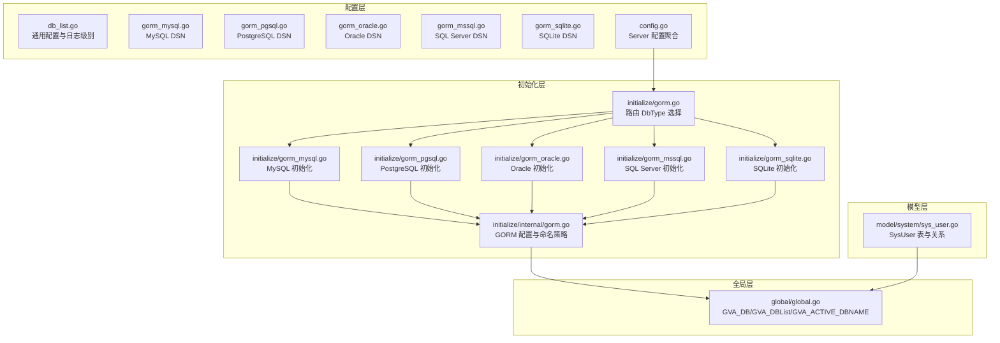
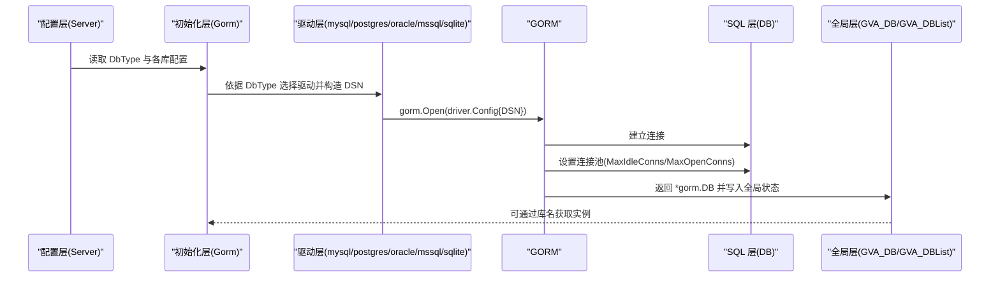
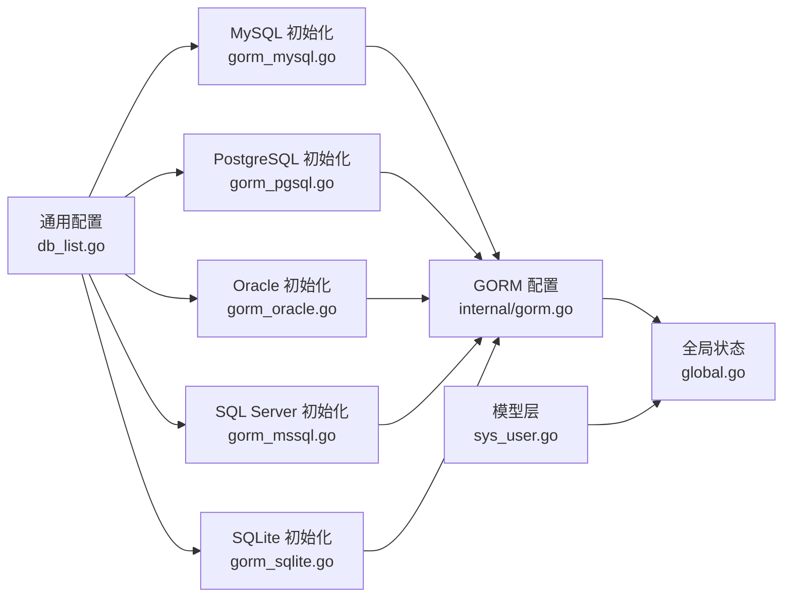

# 数据库层

<cite>
**本文引用的文件**
- [server/config/gorm_mysql.go](file://server/config/gorm_mysql.go)
- [server/config/gorm_pgsql.go](file://server/config/gorm_pgsql.go)
- [server/config/gorm_oracle.go](file://server/config/gorm_oracle.go)
- [server/config/gorm_mssql.go](file://server/config/gorm_mssql.go)
- [server/config/gorm_sqlite.go](file://server/config/gorm_sqlite.go)
- [server/config/db_list.go](file://server/config/db_list.go)
- [server/config/config.go](file://server/config/config.go)
- [server/initialize/gorm.go](file://server/initialize/gorm.go)
- [server/initialize/gorm_mysql.go](file://server/initialize/gorm_mysql.go)
- [server/initialize/gorm_pgsql.go](file://server/initialize/gorm_pgsql.go)
- [server/initialize/gorm_oracle.go](file://server/initialize/gorm_oracle.go)
- [server/initialize/gorm_mssql.go](file://server/initialize/gorm_mssql.go)
- [server/initialize/gorm_sqlite.go](file://server/initialize/gorm_sqlite.go)
- [server/initialize/internal/gorm.go](file://server/initialize/internal/gorm.go)
- [server/global/global.go](file://server/global/global.go)
- [server/model/system/sys_user.go](file://server/model/system/sys_user.go)
</cite>

## 目录
1. [简介](#简介)
2. [项目结构](#项目结构)
3. [核心组件](#核心组件)
4. [架构总览](#架构总览)
5. [详细组件分析](#详细组件分析)
6. [依赖分析](#依赖分析)
7. [性能考虑](#性能考虑)
8. [故障排查指南](#故障排查指南)
9. [结论](#结论)
10. [附录](#附录)

## 简介
本文件面向测试管理平台的数据库层，系统性梳理基于 GORM 的数据库配置与使用，覆盖多数据库（MySQL、PostgreSQL、Oracle、SQL Server、SQLite）的适配方式、连接池与日志配置、事务与性能优化、数据模型定义与关系映射、初始化流程与表结构迁移、索引设计建议以及最佳实践。目标是帮助开发者正确配置、使用与扩展数据库功能。

## 项目结构
数据库相关代码主要分布在以下模块：
- 配置层：定义各数据库的 DSN 生成与通用配置项
- 初始化层：按配置选择驱动并建立连接，设置连接池与日志策略
- 全局层：维护主库与多库实例、活跃库名等全局状态
- 模型层：定义业务实体与关系映射，包含索引与命名策略

图表来源
- [server/config/config.go:1-41](file://server/config/config.go#L1-L41)
- [server/config/db_list.go:1-54](file://server/config/db_list.go#L1-L54)
- [server/config/gorm_mysql.go:1-10](file://server/config/gorm_mysql.go#L1-L10)
- [server/config/gorm_pgsql.go:1-18](file://server/config/gorm_pgsql.go#L1-L18)
- [server/config/gorm_oracle.go:1-19](file://server/config/gorm_oracle.go#L1-L19)
- [server/config/gorm_mssql.go:1-11](file://server/config/gorm_mssql.go#L1-L11)
- [server/config/gorm_sqlite.go:1-14](file://server/config/gorm_sqlite.go#L1-L14)
- [server/initialize/gorm.go:1-88](file://server/initialize/gorm.go#L1-L88)
- [server/initialize/gorm_mysql.go:1-49](file://server/initialize/gorm_mysql.go#L1-L49)
- [server/initialize/gorm_pgsql.go:1-44](file://server/initialize/gorm_pgsql.go#L1-L44)
- [server/initialize/gorm_oracle.go:1-38](file://server/initialize/gorm_oracle.go#L1-L38)
- [server/initialize/gorm_mssql.go:1-65](file://server/initialize/gorm_mssql.go#L1-L65)
- [server/initialize/gorm_sqlite.go:1-39](file://server/initialize/gorm_sqlite.go#L1-L39)
- [server/initialize/internal/gorm.go:1-32](file://server/initialize/internal/gorm.go#L1-L32)
- [server/global/global.go:1-69](file://server/global/global.go#L1-L69)
- [server/model/system/sys_user.go:1-63](file://server/model/system/sys_user.go#L1-L63)

章节来源
- [server/config/config.go:1-41](file://server/config/config.go#L1-L41)
- [server/initialize/gorm.go:1-88](file://server/initialize/gorm.go#L1-L88)

## 核心组件
- 通用配置与 DSN 提供者
  - 通用配置结构体包含数据库地址、端口、用户名、密码、数据库名、高级配置、日志模式、连接池参数、是否单数表名、是否使用 Zap 写日志等字段，并提供日志级别转换。
  - 各数据库类型均内嵌通用配置并通过 Dsn 方法生成各自 DSN 字符串。
- GORM 初始化与连接池
  - 根据 DbType 选择对应数据库初始化函数，构造 driver.Config 并调用 gorm.Open，随后设置最大空闲连接数与最大打开连接数。
  - 使用内部 GORM 配置统一设置日志器、命名策略（表前缀、单数表名）、外键约束迁移策略等。
- 全局状态
  - 维护主数据库指针、多数据库实例列表、当前活跃库名等，提供按库名获取实例的工具方法。
- 数据模型与关系映射
  - 示例模型展示字段注释、索引声明、外键与多对多关系映射，以及自定义表名与 JSON 字段处理。

章节来源
- [server/config/db_list.go:16-54](file://server/config/db_list.go#L16-L54)
- [server/config/gorm_mysql.go:3-9](file://server/config/gorm_mysql.go#L3-L9)
- [server/config/gorm_pgsql.go:3-17](file://server/config/gorm_pgsql.go#L3-L17)
- [server/config/gorm_oracle.go:9-18](file://server/config/gorm_oracle.go#L9-L18)
- [server/config/gorm_mssql.go:3-10](file://server/config/gorm_mssql.go#L3-L10)
- [server/config/gorm_sqlite.go:7-13](file://server/config/gorm_sqlite.go#L7-L13)
- [server/initialize/internal/gorm.go:16-31](file://server/initialize/internal/gorm.go#L16-L31)
- [server/initialize/gorm_mysql.go:26-48](file://server/initialize/gorm_mysql.go#L26-L48)
- [server/initialize/gorm_pgsql.go:24-43](file://server/initialize/gorm_pgsql.go#L24-L43)
- [server/initialize/gorm_oracle.go:22-37](file://server/initialize/gorm_oracle.go#L22-L37)
- [server/initialize/gorm_mssql.go:20-42](file://server/initialize/gorm_mssql.go#L20-L42)
- [server/initialize/gorm_sqlite.go:22-38](file://server/initialize/gorm_sqlite.go#L22-L38)
- [server/global/global.go:25-69](file://server/global/global.go#L25-L69)
- [server/model/system/sys_user.go:20-38](file://server/model/system/sys_user.go#L20-L38)

## 架构总览
下图展示了从配置到初始化再到运行时使用的整体流程，以及多数据库支持的入口与关键交互点。

图表来源
- [server/initialize/gorm.go:14-35](file://server/initialize/gorm.go#L14-L35)
- [server/initialize/gorm_mysql.go:16-48](file://server/initialize/gorm_mysql.go#L16-L48)
- [server/initialize/gorm_pgsql.go:24-43](file://server/initialize/gorm_pgsql.go#L24-L43)
- [server/initialize/gorm_oracle.go:22-37](file://server/initialize/gorm_oracle.go#L22-L37)
- [server/initialize/gorm_mssql.go:20-42](file://server/initialize/gorm_mssql.go#L20-L42)
- [server/initialize/gorm_sqlite.go:22-38](file://server/initialize/gorm_sqlite.go#L22-L38)
- [server/global/global.go:25-49](file://server/global/global.go#L25-L49)

## 详细组件分析

### GORM 配置与命名策略
- 日志器：统一通过内部配置设置慢查询阈值、日志级别与颜色输出；日志级别由通用配置的日志模式转换而来。
- 命名策略：支持表前缀与单数表名，便于兼容历史表结构或采用更现代的命名风格。
- 外键策略：迁移阶段禁用外键约束，降低迁移失败风险，后续可按需在应用层控制。

章节来源
- [server/initialize/internal/gorm.go:16-31](file://server/initialize/internal/gorm.go#L16-L31)
- [server/config/db_list.go:33-46](file://server/config/db_list.go#L33-L46)

### MySQL 初始化与连接池
- DSN 生成：基于用户名、密码、主机、端口、数据库名与高级配置拼接。
- 连接池：设置最大空闲连接与最大打开连接。
- 引擎选项：为表设置 ENGINE 参数以满足字符集与存储引擎需求。

章节来源
- [server/config/gorm_mysql.go:7-9](file://server/config/gorm_mysql.go#L7-L9)
- [server/initialize/gorm_mysql.go:26-48](file://server/initialize/gorm_mysql.go#L26-L48)

### PostgreSQL 初始化与连接池
- DSN 生成：采用键值对形式的 DSN。
- 连接池：设置最大空闲连接与最大打开连接。
- 协议：默认启用复杂协议，提升兼容性。

章节来源
- [server/config/gorm_pgsql.go:9-17](file://server/config/gorm_pgsql.go#L9-L17)
- [server/initialize/gorm_pgsql.go:24-43](file://server/initialize/gorm_pgsql.go#L24-L43)

### Oracle 初始化与连接池
- DSN 生成：使用标准 Oracle DSN 格式并进行必要的转义。
- 连接池：设置最大空闲连接与最大打开连接。
- 驱动：使用第三方 Oracle 驱动适配 GORM。

章节来源
- [server/config/gorm_oracle.go:13-18](file://server/config/gorm_oracle.go#L13-L18)
- [server/initialize/gorm_oracle.go:22-37](file://server/initialize/gorm_oracle.go#L22-L37)

### SQL Server 初始化与连接池
- DSN 生成：采用 sqlserver:// 前缀与参数形式。
- 连接池：设置最大空闲连接与最大打开连接。
- 引擎选项：在实例层面设置表选项以兼容特性。

章节来源
- [server/config/gorm_mssql.go:7-10](file://server/config/gorm_mssql.go#L7-L10)
- [server/initialize/gorm_mssql.go:20-42](file://server/initialize/gorm_mssql.go#L20-L42)

### SQLite 初始化与连接池
- DSN 生成：基于路径与数据库文件名拼接。
- 连接池：设置最大空闲连接与最大打开连接。
- 驱动：使用轻量级驱动适配本地开发与测试场景。

章节来源
- [server/config/gorm_sqlite.go:11-13](file://server/config/gorm_sqlite.go#L11-L13)
- [server/initialize/gorm_sqlite.go:22-38](file://server/initialize/gorm_sqlite.go#L22-L38)

### 多数据库支持与切换
- 初始化入口：根据 DbType 分派到具体数据库初始化函数。
- 全局状态：维护主库指针与多库实例列表，支持按库名获取实例。
- 活跃库名：记录当前活动库名，便于日志与上下文追踪。

章节来源
- [server/initialize/gorm.go:14-35](file://server/initialize/gorm.go#L14-L35)
- [server/global/global.go:25-69](file://server/global/global.go#L25-L69)

### 数据模型定义与关系映射
- 字段注释：通过标签为字段添加注释，便于文档化与迁移工具识别。
- 索引声明：在字段上直接声明索引，简化索引管理。
- 关系映射：一对一/一对多/多对多关系通过标签声明外键与关联表。
- 自定义表名：通过 TableName 方法指定实际表名，避免复数与命名冲突。
- JSON 字段：使用合适的数据类型与默认值，确保迁移与查询一致性。

章节来源
- [server/model/system/sys_user.go:20-38](file://server/model/system/sys_user.go#L20-L38)

### 查询优化策略
- 索引设计：在高频查询字段上建立索引，避免全表扫描；复合索引遵循“最左匹配”原则。
- 字段选择：仅查询必要字段，减少网络与解析开销。
- 分页查询：使用游标或基于索引的分页策略，避免深层偏移。
- 连接池：合理设置最大空闲与最大打开连接，平衡并发与资源占用。
- 日志与慢查询：结合慢查询阈值与日志级别定位热点 SQL。

（本节为通用优化建议，不直接分析具体文件）

### 数据库初始化流程与表结构创建
- 初始化入口：根据 DbType 选择驱动并建立连接。
- 表注册：在 AutoMigrate 开关开启时，批量迁移系统与示例表。
- 业务表：支持业务模型的额外注册与迁移。
- 错误处理：迁移失败时记录错误并终止启动流程。

章节来源
- [server/initialize/gorm.go:37-87](file://server/initialize/gorm.go#L37-L87)

### 事务管理
- 基础事务：使用 GORM 的 Session 或原生事务接口开启/提交/回滚。
- 并发控制：结合全局并发控制组件，避免竞态条件。
- 回滚策略：在业务异常时及时回滚，保证数据一致性。
- 性能权衡：长事务会阻塞锁竞争，应尽量缩短事务时间。

（本节为通用实践建议，不直接分析具体文件）

## 依赖分析
- 配置层依赖：各数据库类型依赖通用配置结构体与日志级别转换。
- 初始化层依赖：按 DbType 选择驱动，驱动依赖对应数据库客户端库。
- 全局层依赖：初始化后将实例写入全局状态，供其他模块使用。
- 模型层依赖：模型依赖全局模型基类与 GORM 标签进行映射。

图表来源
- [server/config/db_list.go:16-54](file://server/config/db_list.go#L16-L54)
- [server/initialize/gorm_mysql.go:16-48](file://server/initialize/gorm_mysql.go#L16-L48)
- [server/initialize/gorm_pgsql.go:24-43](file://server/initialize/gorm_pgsql.go#L24-L43)
- [server/initialize/gorm_oracle.go:22-37](file://server/initialize/gorm_oracle.go#L22-L37)
- [server/initialize/gorm_mssql.go:20-42](file://server/initialize/gorm_mssql.go#L20-L42)
- [server/initialize/gorm_sqlite.go:22-38](file://server/initialize/gorm_sqlite.go#L22-L38)
- [server/initialize/internal/gorm.go:16-31](file://server/initialize/internal/gorm.go#L16-L31)
- [server/global/global.go:25-49](file://server/global/global.go#L25-L49)
- [server/model/system/sys_user.go:20-38](file://server/model/system/sys_user.go#L20-L38)

## 性能考虑
- 连接池参数
  - MaxIdleConns：建议根据并发峰值与数据库承载能力设定，避免过多空闲连接占用资源。
  - MaxOpenConns：建议与数据库最大连接数相匹配，防止连接风暴。
- 日志级别
  - 生产环境建议使用“信息”或“警告”，避免过多日志影响性能。
  - 慢查询阈值建议设置为毫秒级，便于发现慢 SQL。
- 索引与查询
  - 对高频过滤、排序与连接字段建立合适索引，定期评估索引使用情况。
  - 避免 SELECT *，仅查询必要字段。
- 事务
  - 缩短事务时间，批量操作合并提交，减少锁持有时间。
- 数据库选择
  - 开发/测试优先 SQLite；高并发 OLTP 场景优先 MySQL/PG；需要强一致与企业级特性可选 Oracle/SQL Server。

（本节为通用性能建议，不直接分析具体文件）

## 故障排查指南
- 连接失败
  - 检查 DSN 拼接是否正确，确认主机、端口、数据库名与认证信息。
  - 校验驱动导入与版本兼容性。
- 迁移失败
  - 查看迁移日志与错误堆栈，确认字段类型与约束是否冲突。
  - 在禁用外键约束的策略下，检查业务层外键逻辑。
- 性能问题
  - 启用慢查询日志，定位慢 SQL 并优化索引与查询计划。
  - 调整连接池参数，观察数据库负载与响应时间。
- 多库访问
  - 使用全局工具方法按库名获取实例，避免误用主库实例。
  - 确认活跃库名与当前上下文一致。

章节来源
- [server/initialize/gorm.go:37-87](file://server/initialize/gorm.go#L37-L87)
- [server/global/global.go:44-69](file://server/global/global.go#L44-L69)

## 结论
该数据库层通过统一的配置与初始化流程，实现了对多种数据库的无缝支持。借助 GORM 的配置化日志与命名策略、完善的连接池设置以及清晰的模型映射，平台能够在不同环境下稳定运行。建议在生产环境中严格控制日志级别与连接池参数，持续优化索引与查询，并通过多库工具方法实现灵活的数据库访问。

## 附录
- 配置示例要点
  - 通用配置：包含日志模式、连接池参数、单数表名、表前缀等。
  - MySQL：提供 DSN 拼接与引擎选项设置。
  - PostgreSQL：提供 DSN 与协议配置。
  - Oracle：提供 DSN 与第三方驱动集成。
  - SQL Server：提供 DSN 与字符串长度配置。
  - SQLite：提供本地文件路径 DSN。
- 最佳实践
  - 明确区分开发、测试与生产环境的连接池参数。
  - 定期审查索引使用情况，删除冗余索引。
  - 在业务层显式管理事务边界，避免长事务。
  - 使用全局多库工具方法进行跨库访问，确保一致性。

章节来源
- [server/config/db_list.go:16-54](file://server/config/db_list.go#L16-L54)
- [server/config/gorm_mysql.go:7-9](file://server/config/gorm_mysql.go#L7-L9)
- [server/config/gorm_pgsql.go:9-17](file://server/config/gorm_pgsql.go#L9-L17)
- [server/config/gorm_oracle.go:13-18](file://server/config/gorm_oracle.go#L13-L18)
- [server/config/gorm_mssql.go:7-10](file://server/config/gorm_mssql.go#L7-L10)
- [server/config/gorm_sqlite.go:11-13](file://server/config/gorm_sqlite.go#L11-L13)
- [server/initialize/internal/gorm.go:16-31](file://server/initialize/internal/gorm.go#L16-L31)