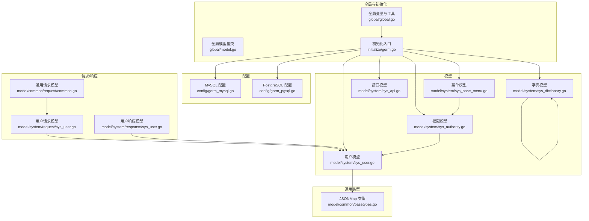
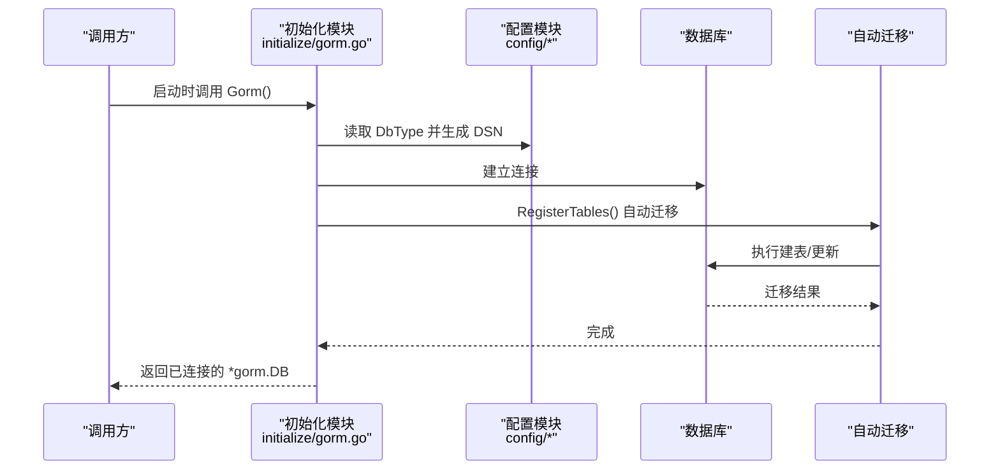
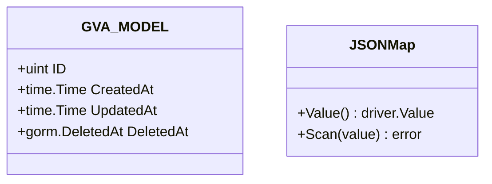
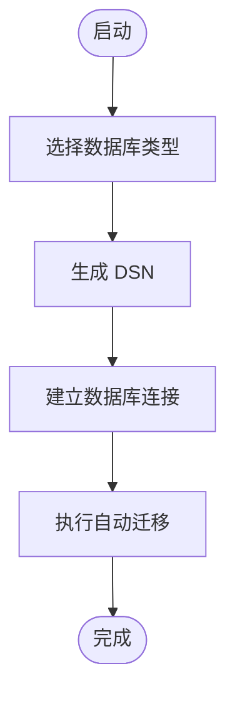
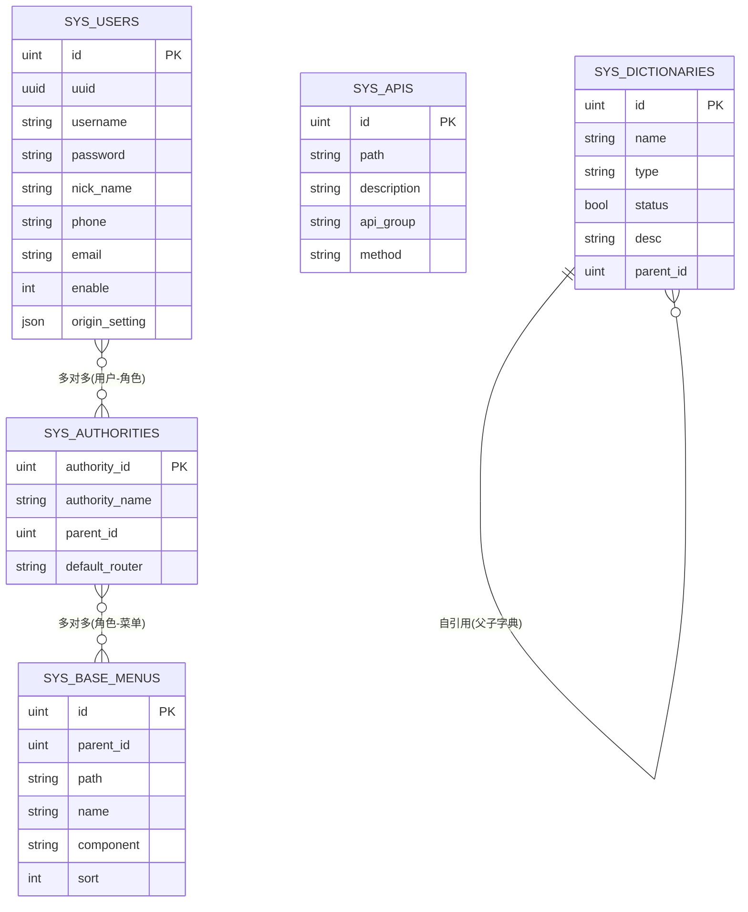
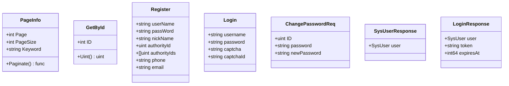
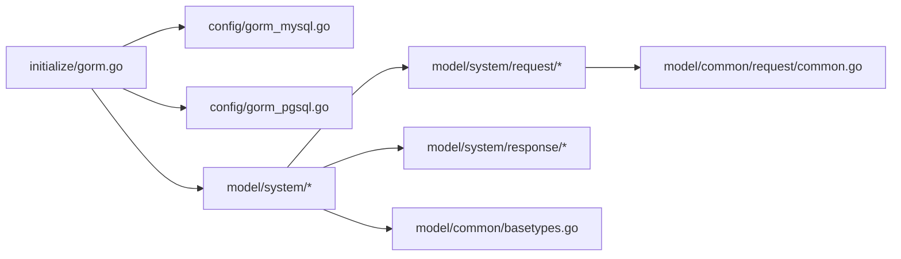

# 数据访问层

<cite>
**本文引用的文件**
- [server/global/model.go](file://server/global/model.go)
- [server/global/global.go](file://server/global/global.go)
- [server/initialize/gorm.go](file://server/initialize/gorm.go)
- [server/config/gorm_mysql.go](file://server/config/gorm_mysql.go)
- [server/config/gorm_pgsql.go](file://server/config/gorm_pgsql.go)
- [server/model/system/sys_user.go](file://server/model/system/sys_user.go)
- [server/model/system/sys_api.go](file://server/model/system/sys_api.go)
- [server/model/system/sys_authority.go](file://server/model/system/sys_authority.go)
- [server/model/system/sys_base_menu.go](file://server/model/system/sys_base_menu.go)
- [server/model/system/sys_dictionary.go](file://server/model/system/sys_dictionary.go)
- [server/model/common/request/common.go](file://server/model/common/request/common.go)
- [server/model/system/request/sys_user.go](file://server/model/system/request/sys_user.go)
- [server/model/system/response/sys_user.go](file://server/model/system/response/sys_user.go)
- [server/model/common/basetypes.go](file://server/model/common/basetypes.go)
</cite>

## 目录
1. [简介](#简介)
2. [项目结构](#项目结构)
3. [核心组件](#核心组件)
4. [架构总览](#架构总览)
5. [详细组件分析](#详细组件分析)
6. [依赖分析](#依赖分析)
7. [性能考虑](#性能考虑)
8. [故障排查指南](#故障排查指南)
9. [结论](#结论)
10. [附录](#附录)

## 简介
本章节面向测试管理平台的数据访问层，系统性阐述数据模型设计原则与实现方式，涵盖实体关系映射、字段定义与约束、GORM 标签用法（表名映射、字段类型转换、索引配置）、请求/响应模型设计（参数校验、数据转换、序列化）、数据访问模式（CRUD、关联查询、批量处理），以及模型扩展与性能优化建议。目标是帮助开发者正确设计与使用数据模型，确保可维护性与高性能。

## 项目结构
数据访问层主要由以下部分组成：
- 全局模型基类：统一主键、时间戳与软删除字段，便于所有业务模型复用。
- 初始化与连接：根据配置选择数据库类型并建立连接，自动迁移注册表。
- 配置层：不同数据库的 DSN 生成逻辑。
- 模型层：系统与示例模块的业务模型，包含实体关系与标签配置。
- 请求/响应模型：分页、条件查询、参数校验与序列化包装。
- 通用类型：JSONMap 的数据库驱动适配，支持 JSON 字段的读写。

图表来源
- [server/global/model.go:1-15](file://server/global/model.go#L1-L15)
- [server/global/global.go:25-42](file://server/global/global.go#L25-L42)
- [server/initialize/gorm.go:14-87](file://server/initialize/gorm.go#L14-L87)
- [server/config/gorm_mysql.go:3-9](file://server/config/gorm_mysql.go#L3-L9)
- [server/config/gorm_pgsql.go:3-17](file://server/config/gorm_pgsql.go#L3-L17)
- [server/model/system/sys_user.go:20-34](file://server/model/system/sys_user.go#L20-L34)
- [server/model/system/sys_api.go:7-13](file://server/model/system/sys_api.go#L7-L13)
- [server/model/system/sys_authority.go:7-19](file://server/model/system/sys_authority.go#L7-L19)
- [server/model/system/sys_base_menu.go:7-21](file://server/model/system/sys_base_menu.go#L7-L21)
- [server/model/system/sys_dictionary.go:9-18](file://server/model/system/sys_dictionary.go#L9-L18)
- [server/model/common/request/common.go:8-28](file://server/model/common/request/common.go#L8-L28)
- [server/model/system/request/sys_user.go:8-19](file://server/model/system/request/sys_user.go#L8-L19)
- [server/model/system/response/sys_user.go:7-15](file://server/model/system/response/sys_user.go#L7-L15)
- [server/model/common/basetypes.go:9-36](file://server/model/common/basetypes.go#L9-L36)

章节来源
- [server/global/model.go:1-15](file://server/global/model.go#L1-L15)
- [server/global/global.go:25-42](file://server/global/global.go#L25-L42)
- [server/initialize/gorm.go:14-87](file://server/initialize/gorm.go#L14-L87)
- [server/config/gorm_mysql.go:3-9](file://server/config/gorm_mysql.go#L3-L9)
- [server/config/gorm_pgsql.go:3-17](file://server/config/gorm_pgsql.go#L3-L17)

## 核心组件
- 全局模型基类：提供统一的主键、创建/更新时间与软删除字段，减少重复代码，提升一致性。
- 初始化与迁移：按配置选择数据库类型，建立连接，并自动迁移注册的系统与业务表。
- 配置层：提供 MySQL 与 PostgreSQL 的 DSN 生成方法，支持按库名生成连接串。
- 模型层：系统用户、接口、权限、菜单、字典等模型，展示一对一、一对多、多对多关系与标签配置。
- 请求/响应模型：通用分页、按 ID 查询、批量 ID 查询；用户模块的注册、登录、修改密码、重置密码、设置角色、变更信息等请求体与登录响应体。
- 通用类型：JSONMap 实现 database/sql/driver.Valuer 与 sql.Scanner，支持 JSON 字段的读写与类型转换。

章节来源
- [server/global/model.go:9-14](file://server/global/model.go#L9-L14)
- [server/initialize/gorm.go:37-87](file://server/initialize/gorm.go#L37-L87)
- [server/config/gorm_mysql.go:7-9](file://server/config/gorm_mysql.go#L7-L9)
- [server/config/gorm_pgsql.go:9-17](file://server/config/gorm_pgsql.go#L9-L17)
- [server/model/system/sys_user.go:20-34](file://server/model/system/sys_user.go#L20-L34)
- [server/model/system/sys_api.go:7-13](file://server/model/system/sys_api.go#L7-L13)
- [server/model/system/sys_authority.go:7-19](file://server/model/system/sys_authority.go#L7-L19)
- [server/model/system/sys_base_menu.go:7-21](file://server/model/system/sys_base_menu.go#L7-L21)
- [server/model/system/sys_dictionary.go:9-18](file://server/model/system/sys_dictionary.go#L9-L18)
- [server/model/common/request/common.go:8-28](file://server/model/common/request/common.go#L8-L28)
- [server/model/system/request/sys_user.go:8-19](file://server/model/system/request/sys_user.go#L8-L19)
- [server/model/system/response/sys_user.go:7-15](file://server/model/system/response/sys_user.go#L7-L15)
- [server/model/common/basetypes.go:9-36](file://server/model/common/basetypes.go#L9-L36)

## 架构总览
数据访问层采用“配置驱动 + 初始化迁移 + 模型定义 + 请求/响应封装”的分层设计。初始化模块根据配置选择数据库类型并建立连接，随后自动迁移系统与业务表；模型层通过 GORM 标签定义表名、字段类型、索引与关系；请求/响应模型负责参数校验与序列化；通用类型提供 JSON 字段的数据库适配。

图表来源
- [server/initialize/gorm.go:14-35](file://server/initialize/gorm.go#L14-L35)
- [server/config/gorm_mysql.go:7-9](file://server/config/gorm_mysql.go#L7-L9)
- [server/config/gorm_pgsql.go:9-17](file://server/config/gorm_pgsql.go#L9-L17)
- [server/initialize/gorm.go:37-87](file://server/initialize/gorm.go#L37-L87)

## 详细组件分析

### 全局模型基类与通用类型
- 全局模型基类提供统一的主键、创建/更新时间与软删除字段，所有业务模型可直接嵌入该结构体，减少重复定义。
- JSONMap 实现 Valuer 与 Scanner，支持将 map[string]interface{} 写入数据库的 JSON/BLOB 字段，并在读取时反序列化为 map，兼容多种输入类型。

图表来源
- [server/global/model.go:9-14](file://server/global/model.go#L9-L14)
- [server/model/common/basetypes.go:9-36](file://server/model/common/basetypes.go#L9-L36)

章节来源
- [server/global/model.go:9-14](file://server/global/model.go#L9-L14)
- [server/model/common/basetypes.go:9-36](file://server/model/common/basetypes.go#L9-L36)

### 初始化与自动迁移
- 初始化模块根据配置选择数据库类型，生成 DSN 并建立连接；随后注册系统与业务表进行自动迁移。
- 支持禁用自动迁移的场景，便于在生产环境手动控制迁移策略。

图表来源
- [server/initialize/gorm.go:14-35](file://server/initialize/gorm.go#L14-L35)
- [server/initialize/gorm.go:37-87](file://server/initialize/gorm.go#L37-L87)

章节来源
- [server/initialize/gorm.go:14-35](file://server/initialize/gorm.go#L14-L35)
- [server/initialize/gorm.go:37-87](file://server/initialize/gorm.go#L37-L87)

### 配置层（MySQL 与 PostgreSQL）
- MySQL 配置提供标准 DSN 组装方法，包含用户名、密码、主机、端口、数据库名与额外参数。
- PostgreSQL 配置提供标准 DSN 组装方法，并支持按库名生成临时连接串，便于动态切换数据库。

章节来源
- [server/config/gorm_mysql.go:3-9](file://server/config/gorm_mysql.go#L3-L9)
- [server/config/gorm_pgsql.go:3-17](file://server/config/gorm_pgsql.go#L3-L17)

### 模型层：用户、接口、权限、菜单、字典
- 用户模型：嵌入全局模型，包含 UUID、用户名、密码、昵称、头像、角色 ID、手机号、邮箱、启用状态与 JSON 配置字段；定义与权限的多对多关系及与菜单的中间表。
- 接口模型：定义 API 路径、描述、分组与方法；忽略接口模型用于白名单控制。
- 权限模型：定义角色 ID、角色名、父角色、默认路由与多对多关系（菜单、用户）。
- 菜单模型：定义路由路径、名称、组件、排序、元信息、父子关系与参数、按钮等。
- 字典模型：定义字典名、类型、状态、描述、父级 ID 与子字典、详情集合。

图表来源
- [server/model/system/sys_user.go:20-34](file://server/model/system/sys_user.go#L20-L34)
- [server/model/system/sys_authority.go:7-19](file://server/model/system/sys_authority.go#L7-L19)
- [server/model/system/sys_base_menu.go:7-21](file://server/model/system/sys_base_menu.go#L7-L21)
- [server/model/system/sys_api.go:7-13](file://server/model/system/sys_api.go#L7-L13)
- [server/model/system/sys_dictionary.go:9-18](file://server/model/system/sys_dictionary.go#L9-L18)

章节来源
- [server/model/system/sys_user.go:20-34](file://server/model/system/sys_user.go#L20-L34)
- [server/model/system/sys_api.go:7-13](file://server/model/system/sys_api.go#L7-L13)
- [server/model/system/sys_authority.go:7-19](file://server/model/system/sys_authority.go#L7-L19)
- [server/model/system/sys_base_menu.go:7-21](file://server/model/system/sys_base_menu.go#L7-L21)
- [server/model/system/sys_dictionary.go:9-18](file://server/model/system/sys_dictionary.go#L9-L18)

### 请求/响应模型：分页、按 ID 查询与用户相关
- 通用请求模型：提供分页参数与分页函数，支持默认页码与最大页大小限制；提供按 ID 查询结构体与转为 uint 的辅助方法。
- 用户请求模型：注册、登录、修改密码、重置密码、设置角色、批量设置角色、变更用户信息、获取用户列表（含排序字段与升降序）。
- 用户响应模型：登录返回用户、JWT 令牌与过期时间。

图表来源
- [server/model/common/request/common.go:8-28](file://server/model/common/request/common.go#L8-L28)
- [server/model/system/request/sys_user.go:8-19](file://server/model/system/request/sys_user.go#L8-L19)
- [server/model/system/request/sys_user.go:21-34](file://server/model/system/request/sys_user.go#L21-L34)
- [server/model/system/request/sys_user.go:41-50](file://server/model/system/request/sys_user.go#L41-L50)
- [server/model/system/request/sys_user.go:52-61](file://server/model/system/request/sys_user.go#L52-L61)
- [server/model/system/response/sys_user.go:7-15](file://server/model/system/response/sys_user.go#L7-L15)

章节来源
- [server/model/common/request/common.go:8-28](file://server/model/common/request/common.go#L8-L28)
- [server/model/system/request/sys_user.go:8-19](file://server/model/system/request/sys_user.go#L8-L19)
- [server/model/system/request/sys_user.go:21-34](file://server/model/system/request/sys_user.go#L21-L34)
- [server/model/system/request/sys_user.go:41-50](file://server/model/system/request/sys_user.go#L41-L50)
- [server/model/system/request/sys_user.go:52-61](file://server/model/system/request/sys_user.go#L52-L61)
- [server/model/system/response/sys_user.go:7-15](file://server/model/system/response/sys_user.go#L7-L15)

### 数据访问模式：CRUD、关联查询与批量处理
- CRUD 操作：通过 GORM 提供的 Create、First、Find、Take、Updates、Delete、Unscoped 等方法实现增删改查；结合分页函数与条件查询结构体实现复杂查询。
- 关联查询：利用 GORM 的预加载与 Joins 实现多对多、一对多、自引用等关系的查询；例如用户与角色的多对多、权限与菜单的多对多、字典的父子关系。
- 批量处理：通过切片或结构体数组进行批量插入、更新与删除；注意批量操作的事务与回滚策略，避免部分失败导致的数据不一致。

章节来源
- [server/model/system/sys_user.go:28-29](file://server/model/system/sys_user.go#L28-L29)
- [server/model/system/sys_authority.go:14-17](file://server/model/system/sys_authority.go#L14-L17)
- [server/model/system/sys_dictionary.go:16-17](file://server/model/system/sys_dictionary.go#L16-L17)
- [server/model/common/request/common.go:14-28](file://server/model/common/request/common.go#L14-L28)

## 依赖分析
- 初始化模块依赖配置模块以生成 DSN 并建立连接；随后调用自动迁移模块注册系统与业务表。
- 模型层之间存在明确的外键与多对多关系，如用户-角色、角色-菜单、字典父子关系。
- 请求/响应模型依赖通用请求模型与系统模型，用于参数校验与序列化。

图表来源
- [server/initialize/gorm.go:14-35](file://server/initialize/gorm.go#L14-L35)
- [server/config/gorm_mysql.go:7-9](file://server/config/gorm_mysql.go#L7-L9)
- [server/config/gorm_pgsql.go:9-17](file://server/config/gorm_pgsql.go#L9-L17)
- [server/model/system/sys_user.go:20-34](file://server/model/system/sys_user.go#L20-L34)
- [server/model/system/request/sys_user.go:8-19](file://server/model/system/request/sys_user.go#L8-L19)
- [server/model/system/response/sys_user.go:7-15](file://server/model/system/response/sys_user.go#L7-L15)
- [server/model/common/request/common.go:8-28](file://server/model/common/request/common.go#L8-L28)
- [server/model/common/basetypes.go:9-36](file://server/model/common/basetypes.go#L9-L36)

章节来源
- [server/initialize/gorm.go:14-35](file://server/initialize/gorm.go#L14-L35)
- [server/config/gorm_mysql.go:7-9](file://server/config/gorm_mysql.go#L7-L9)
- [server/config/gorm_pgsql.go:9-17](file://server/config/gorm_pgsql.go#L9-L17)
- [server/model/system/sys_user.go:20-34](file://server/model/system/sys_user.go#L20-L34)
- [server/model/system/request/sys_user.go:8-19](file://server/model/system/request/sys_user.go#L8-L19)
- [server/model/system/response/sys_user.go:7-15](file://server/model/system/response/sys_user.go#L7-L15)
- [server/model/common/request/common.go:8-28](file://server/model/common/request/common.go#L8-L28)
- [server/model/common/basetypes.go:9-36](file://server/model/common/basetypes.go#L9-L36)

## 性能考虑
- 索引与查询优化：为常用查询字段（如用户名、UUID、角色 ID）添加索引；合理使用分页函数，避免一次性加载大量数据。
- 关联查询：优先使用预加载或显式 Join，减少 N+1 查询；对大结果集进行投影裁剪，仅选择必要字段。
- JSON 字段：谨慎使用 JSON 字段存储复杂结构，避免频繁更新整个对象；必要时拆分为独立表或使用更高效的数据结构。
- 批量操作：批量插入/更新时使用事务，确保原子性；对超大批量数据分批处理，避免长时间锁表。
- 连接池与并发：合理配置数据库连接池大小与超时时间；使用并发控制工具避免热点数据争用。

## 故障排查指南
- 迁移失败：检查自动迁移注册的表清单与数据库权限；确认禁用自动迁移时的替代方案。
- 连接异常：核对 DSN 参数（主机、端口、用户名、密码、数据库名、额外参数）；验证网络连通性与防火墙策略。
- 查询性能问题：分析慢查询日志，为高频查询字段添加索引；优化关联查询与分页参数。
- JSON 字段读写错误：确认 JSONMap 的扫描与值转换逻辑；检查数据库字段类型与默认值。

章节来源
- [server/initialize/gorm.go:37-87](file://server/initialize/gorm.go#L37-L87)
- [server/config/gorm_mysql.go:7-9](file://server/config/gorm_mysql.go#L7-L9)
- [server/config/gorm_pgsql.go:9-17](file://server/config/gorm_pgsql.go#L9-L17)
- [server/model/common/basetypes.go:11-36](file://server/model/common/basetypes.go#L11-L36)

## 结论
本数据访问层通过统一的模型基类、清晰的初始化与迁移流程、完善的模型与请求/响应设计，以及通用类型适配，构建了可扩展、可维护且具备良好性能的数据访问基础设施。遵循本文档的设计原则与优化建议，可在保证数据一致性的同时，满足测试管理平台的多样化业务需求。

## 附录
- GORM 标签使用要点
  - 表名映射：通过 TableName 方法指定实际表名，避免复数与命名冲突。
  - 字段类型转换：使用 JSONMap 实现 map 到 JSON/BLOB 的自动转换。
  - 索引配置：为高频查询字段添加索引；软删除使用 DeletedAt 字段配合 GORM 索引。
- 请求/响应模型最佳实践
  - 分页参数校验：默认页码与最大页大小限制，防止资源滥用。
  - 参数验证：结合结构体标签与业务规则进行参数校验。
  - 序列化控制：敏感字段（如密码）避免序列化到响应体。
- 扩展与优化建议
  - 新增模型：优先嵌入全局模型基类，统一时间与软删除；合理设计关系与索引。
  - 批量处理：使用事务与分批策略，确保一致性与性能。
  - 监控与日志：记录关键操作与慢查询，持续优化查询计划与索引策略。