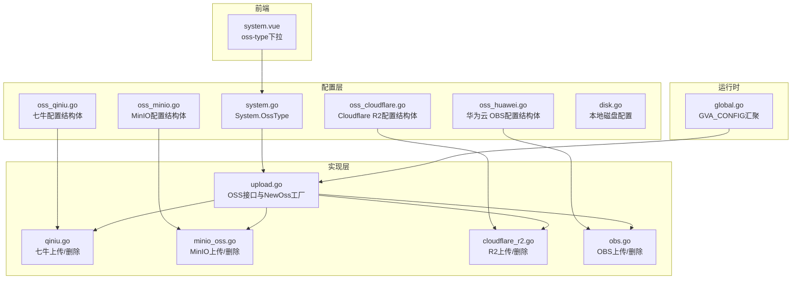
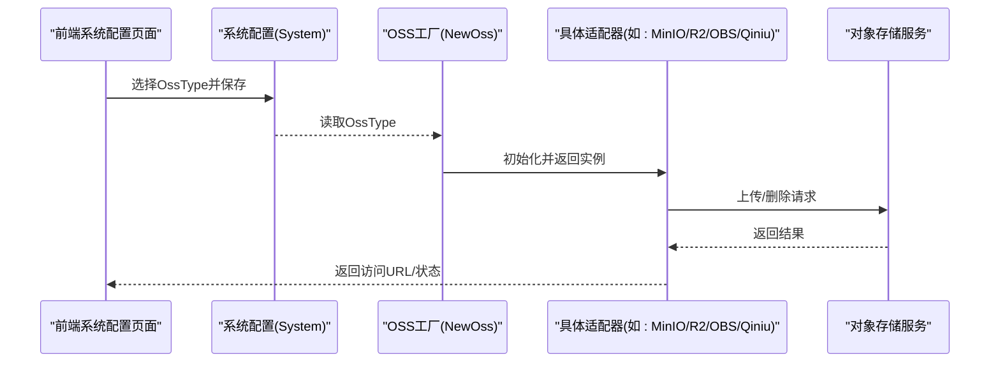
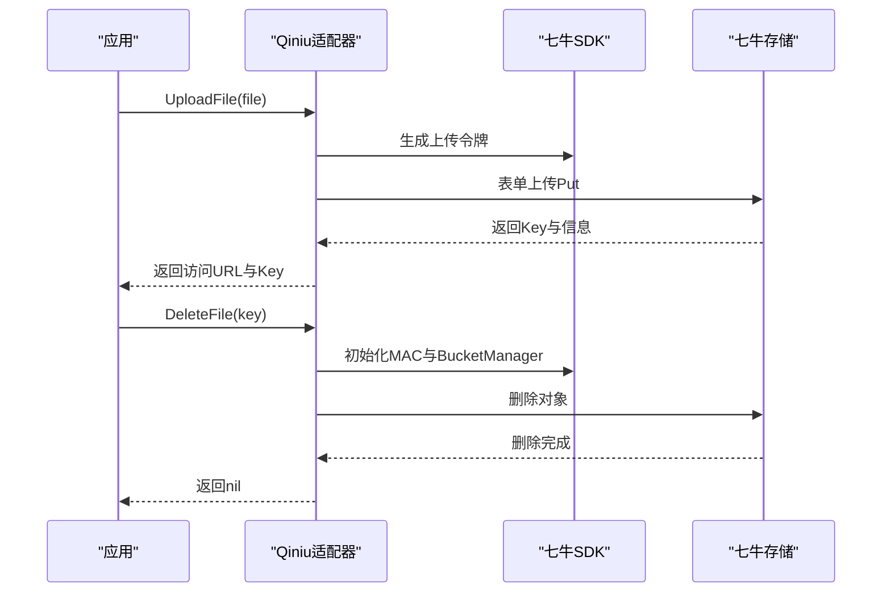
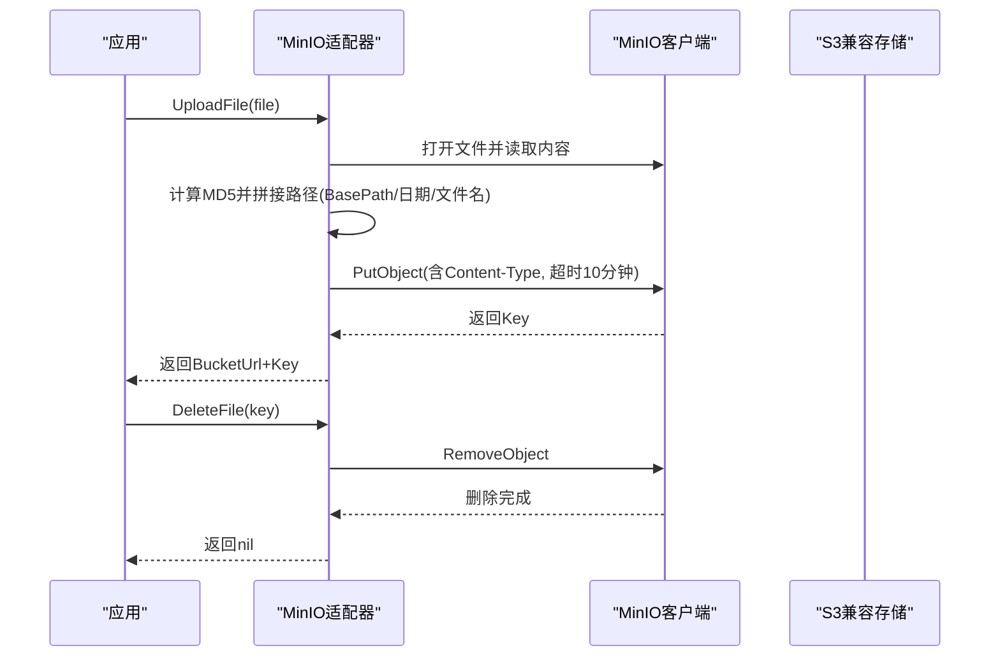
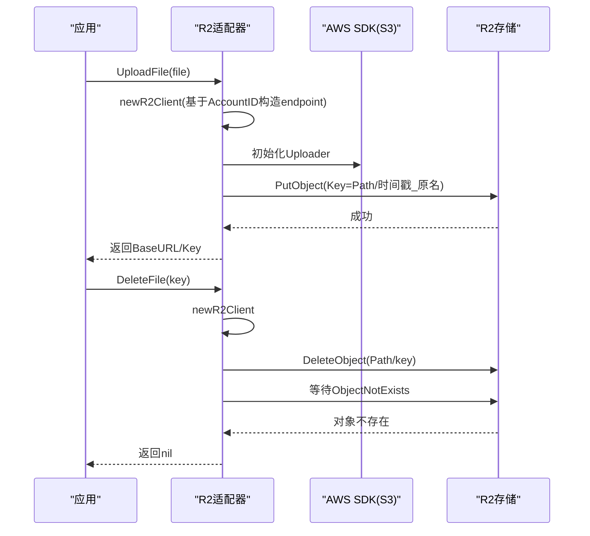
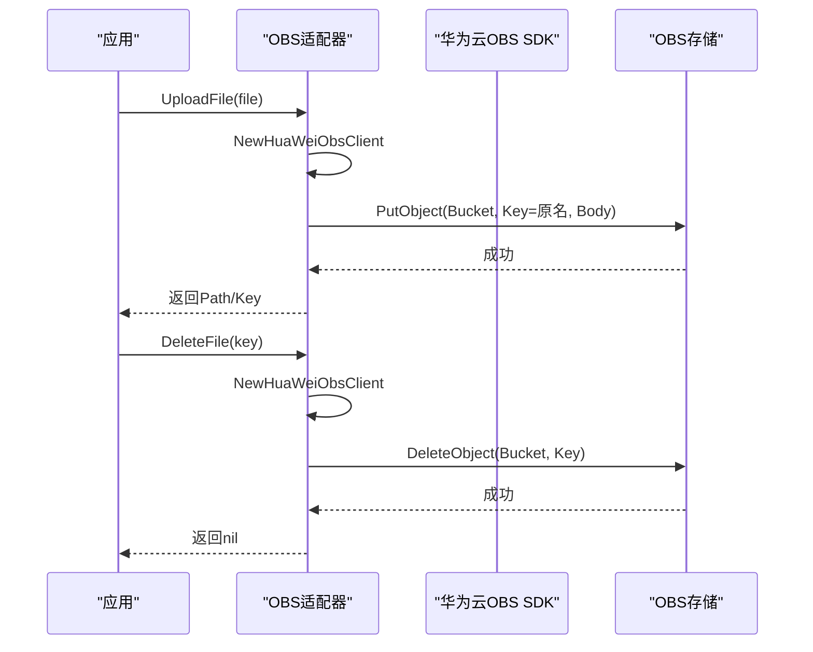
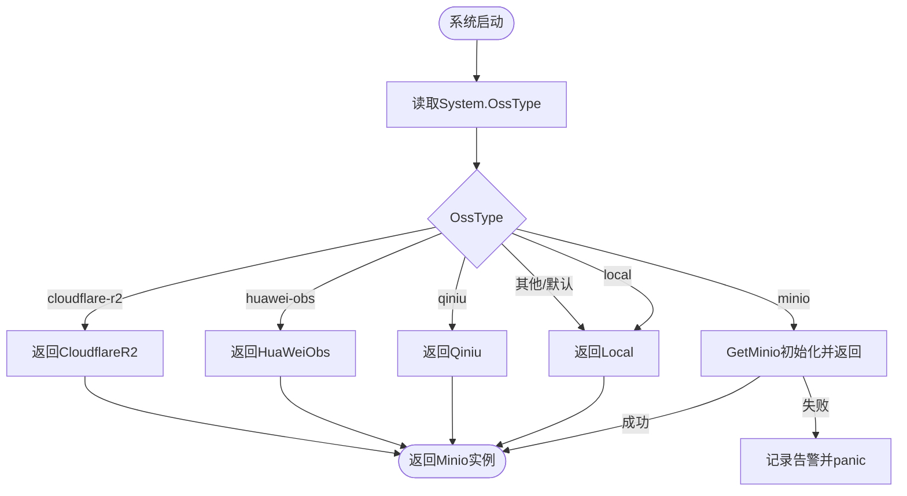
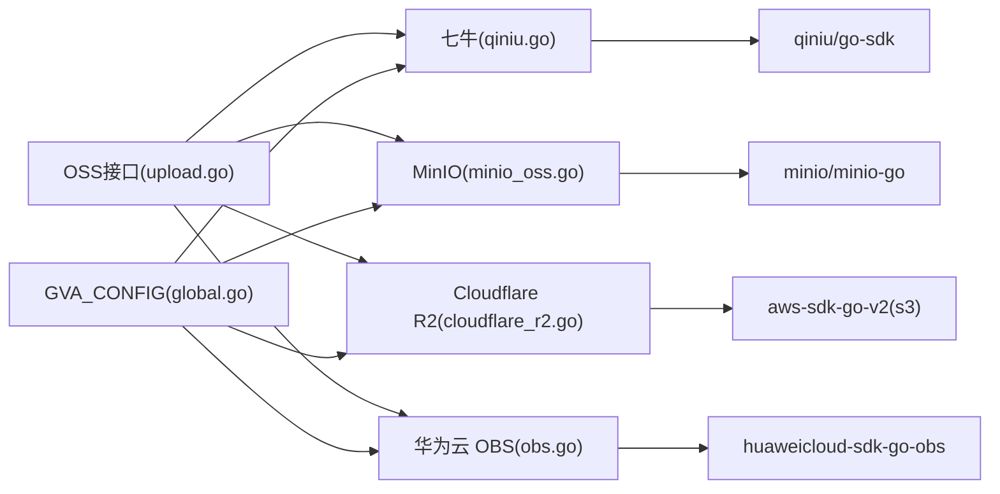

# 其他云存储

<cite>
**本文引用的文件**
- [server/config/oss_qiniu.go](file://server/config/oss_qiniu.go)
- [server/config/oss_minio.go](file://server/config/oss_minio.go)
- [server/config/oss_cloudflare.go](file://server/config/oss_cloudflare.go)
- [server/config/oss_huawei.go](file://server/config/oss_huawei.go)
- [server/config/disk.go](file://server/config/disk.go)
- [server/config/system.go](file://server/config/system.go)
- [server/utils/upload/upload.go](file://server/utils/upload/upload.go)
- [server/utils/upload/qiniu.go](file://server/utils/upload/qiniu.go)
- [server/utils/upload/minio_oss.go](file://server/utils/upload/minio_oss.go)
- [server/utils/upload/cloudflare_r2.go](file://server/utils/upload/cloudflare_r2.go)
- [server/utils/upload/obs.go](file://server/utils/upload/obs.go)
- [server/global/global.go](file://server/global/global.go)
- [web/src/view/systemTools/system/system.vue](file://web/src/view/systemTools/system/system.vue)
</cite>

## 目录
1. [简介](#简介)
2. [项目结构](#项目结构)
3. [核心组件](#核心组件)
4. [架构总览](#架构总览)
5. [详细组件分析](#详细组件分析)
6. [依赖分析](#依赖分析)
7. [性能考虑](#性能考虑)
8. [故障排查指南](#故障排查指南)
9. [结论](#结论)
10. [附录](#附录)

## 简介
本文件面向“其他云存储”能力，系统梳理并对比以下对象存储与兼容 S3 的存储服务在本项目中的集成方式与使用要点：七牛云存储（Qiniu）、MinIO、Cloudflare R2、华为云 OBS。内容涵盖配置项、调用流程、特性差异、适用场景、性能优化、安全配置与成本控制策略，并给出选型建议。

## 项目结构
围绕对象存储的配置与实现主要分布在如下位置：
- 配置层：server/config 下的 oss_* 配置结构体定义
- 实现层：server/utils/upload 下的各存储适配器
- 统一入口：server/utils/upload/upload.go 中的 OSS 接口与工厂函数
- 运行时配置：server/global/global.go 汇聚全局配置
- 前端选择：web 系统配置界面中提供 OSS 类型下拉选择

图表来源
- [server/config/oss_qiniu.go:1-12](file://server/config/oss_qiniu.go#L1-L12)
- [server/config/oss_minio.go:1-12](file://server/config/oss_minio.go#L1-L12)
- [server/config/oss_cloudflare.go:1-11](file://server/config/oss_cloudflare.go#L1-L11)
- [server/config/oss_huawei.go:1-10](file://server/config/oss_huawei.go#L1-L10)
- [server/config/system.go:1-15](file://server/config/system.go#L1-L15)
- [server/config/disk.go:1-10](file://server/config/disk.go#L1-L10)
- [server/utils/upload/upload.go:1-47](file://server/utils/upload/upload.go#L1-L47)
- [server/utils/upload/qiniu.go:1-97](file://server/utils/upload/qiniu.go#L1-L97)
- [server/utils/upload/minio_oss.go:1-107](file://server/utils/upload/minio_oss.go#L1-L107)
- [server/utils/upload/cloudflare_r2.go:1-86](file://server/utils/upload/cloudflare_r2.go#L1-L86)
- [server/utils/upload/obs.go:1-70](file://server/utils/upload/obs.go#L1-L70)
- [server/global/global.go:1-69](file://server/global/global.go#L1-L69)
- [web/src/view/systemTools/system/system.vue:1-31](file://web/src/view/systemTools/system/system.vue#L1-L31)

章节来源
- [server/config/oss_qiniu.go:1-12](file://server/config/oss_qiniu.go#L1-L12)
- [server/config/oss_minio.go:1-12](file://server/config/oss_minio.go#L1-L12)
- [server/config/oss_cloudflare.go:1-11](file://server/config/oss_cloudflare.go#L1-L11)
- [server/config/oss_huawei.go:1-10](file://server/config/oss_huawei.go#L1-L10)
- [server/config/system.go:1-15](file://server/config/system.go#L1-L15)
- [server/config/disk.go:1-10](file://server/config/disk.go#L1-L10)
- [server/utils/upload/upload.go:1-47](file://server/utils/upload/upload.go#L1-L47)
- [server/utils/upload/qiniu.go:1-97](file://server/utils/upload/qiniu.go#L1-L97)
- [server/utils/upload/minio_oss.go:1-107](file://server/utils/upload/minio_oss.go#L1-L107)
- [server/utils/upload/cloudflare_r2.go:1-86](file://server/utils/upload/cloudflare_r2.go#L1-L86)
- [server/utils/upload/obs.go:1-70](file://server/utils/upload/obs.go#L1-L70)
- [server/global/global.go:1-69](file://server/global/global.go#L1-L69)
- [web/src/view/systemTools/system/system.vue:1-31](file://web/src/view/systemTools/system/system.vue#L1-L31)

## 核心组件
- OSS 接口与工厂
  - 接口定义：统一的上传与删除方法，便于多后端切换
  - 工厂函数：根据系统配置的 OssType 返回具体实现（七牛、MinIO、R2、OBS 等）
- 各存储适配器
  - 七牛：基于 SDK 的表单上传、删除；支持 HTTPS 与 CDN 域名
  - MinIO：兼容 S3 协议，自动创建桶、MD5 加密文件名、设置 MIME 类型、10 分钟上传超时
  - Cloudflare R2：基于 AWS SDK v2，自动生成 endpoint，支持删除后等待对象不存在
  - 华为云 OBS：基于官方 SDK，简单直传与删除
- 全局配置
  - GVA_CONFIG 汇聚所有配置，适配器从其中读取对应存储的参数

章节来源
- [server/utils/upload/upload.go:17-46](file://server/utils/upload/upload.go#L17-L46)
- [server/config/system.go:3-15](file://server/config/system.go#L3-L15)
- [server/global/global.go:25-42](file://server/global/global.go#L25-L42)

## 架构总览
统一的 OSS 抽象屏蔽底层差异，前端通过系统配置选择 OSS 类型，后端按需初始化对应客户端并执行上传/删除操作。

图表来源
- [server/utils/upload/upload.go:20-46](file://server/utils/upload/upload.go#L20-L46)
- [web/src/view/systemTools/system/system.vue:22-30](file://web/src/view/systemTools/system/system.vue#L22-L30)

## 详细组件分析

### 七牛云存储（Qiniu）
- 配置项
  - 存储区域、空间名称、CDN 加速域名、访问密钥、是否使用 HTTPS、是否使用 CDN 域名
- 特性与流程
  - 上传：生成上传令牌，使用表单上传，返回访问 URL 与文件 Key
  - 删除：基于 BucketManager 删除指定 Key
  - 配置：按区域选择 Zone，支持 HTTPS 与 CDN
- 适用场景
  - 国内流量大、对图片/静态资源加速有强需求的业务
- 最佳实践
  - 开启 HTTPS 与 CDN 加速以提升安全性与访问速度
  - 上传前生成带有效期的上传令牌，避免泄露密钥
- 性能与安全
  - 使用 CDN 域名可降低源站压力
  - 建议限制上传文件类型与大小，结合签名直传

图表来源
- [server/utils/upload/qiniu.go:27-50](file://server/utils/upload/qiniu.go#L27-L50)
- [server/utils/upload/qiniu.go:61-70](file://server/utils/upload/qiniu.go#L61-L70)
- [server/config/oss_qiniu.go:3-11](file://server/config/oss_qiniu.go#L3-L11)

章节来源
- [server/config/oss_qiniu.go:3-11](file://server/config/oss_qiniu.go#L3-L11)
- [server/utils/upload/qiniu.go:27-50](file://server/utils/upload/qiniu.go#L27-L50)
- [server/utils/upload/qiniu.go:61-70](file://server/utils/upload/qiniu.go#L61-L70)
- [server/utils/upload/qiniu.go:78-96](file://server/utils/upload/qiniu.go#L78-L96)

### MinIO（兼容 S3）
- 配置项
  - Endpoint、AccessKeyID、SecretAccessKey、BucketName、是否使用 SSL、BasePath、BucketUrl
- 特性与流程
  - 初始化客户端并尝试创建桶；上传时计算 MD5 作为文件名，自动分片上传；设置 MIME 类型；10 分钟超时
  - 删除：按 Key 删除对象
- 适用场景
  - 自建对象存储、私有化部署、需要与 S3 生态兼容的场景
- 最佳实践
  - BasePath 用于多租户隔离；BucketUrl 用于生成外链
  - 上传前确保桶存在，避免运行时错误
- 性能与安全
  - 大文件自动分片上传，提高稳定性
  - 建议开启 SSL 并限制跨域访问

图表来源
- [server/utils/upload/minio_oss.go:55-97](file://server/utils/upload/minio_oss.go#L55-L97)
- [server/utils/upload/minio_oss.go:99-107](file://server/utils/upload/minio_oss.go#L99-L107)
- [server/config/oss_minio.go:3-11](file://server/config/oss_minio.go#L3-L11)

章节来源
- [server/config/oss_minio.go:3-11](file://server/config/oss_minio.go#L3-L11)
- [server/utils/upload/minio_oss.go:28-53](file://server/utils/upload/minio_oss.go#L28-L53)
- [server/utils/upload/minio_oss.go:55-97](file://server/utils/upload/minio_oss.go#L55-L97)
- [server/utils/upload/minio_oss.go:99-107](file://server/utils/upload/minio_oss.go#L99-L107)

### Cloudflare R2（兼容 S3）
- 配置项
  - Bucket、BaseURL、Path、AccountID、AccessKeyID、SecretAccessKey
- 特性与流程
  - 基于 AWS SDK v2，动态构造 endpoint（AccountID.r2.cloudflarestorage.com）
  - 上传：使用分块上传器，Key 由时间戳与原文件名组成
  - 删除：删除后等待对象不存在，增强幂等性
- 适用场景
  - 边缘网络优势明显、全球分发需求强的业务
- 最佳实践
  - BaseURL 与 Path 组合形成稳定访问路径
  - AccessKeyID/SecretAccessKey 权限最小化
- 性能与安全
  - R2 与 Cloudflare Workers 可配合实现边缘缓存与鉴权
  - 建议启用访问日志与审计

图表来源
- [server/utils/upload/cloudflare_r2.go:21-45](file://server/utils/upload/cloudflare_r2.go#L21-L45)
- [server/utils/upload/cloudflare_r2.go:47-68](file://server/utils/upload/cloudflare_r2.go#L47-L68)
- [server/utils/upload/cloudflare_r2.go:70-85](file://server/utils/upload/cloudflare_r2.go#L70-L85)
- [server/config/oss_cloudflare.go:3-10](file://server/config/oss_cloudflare.go#L3-L10)

章节来源
- [server/config/oss_cloudflare.go:3-10](file://server/config/oss_cloudflare.go#L3-L10)
- [server/utils/upload/cloudflare_r2.go:21-45](file://server/utils/upload/cloudflare_r2.go#L21-L45)
- [server/utils/upload/cloudflare_r2.go:47-68](file://server/utils/upload/cloudflare_r2.go#L47-L68)
- [server/utils/upload/cloudflare_r2.go:70-85](file://server/utils/upload/cloudflare_r2.go#L70-L85)

### 华为云 OBS
- 配置项
  - Path、Bucket、Endpoint、AccessKey、SecretKey
- 特性与流程
  - 直接使用官方 SDK 初始化客户端
  - 上传：按原文件名 Key 直传；设置 Content-Type
  - 删除：按 Bucket 与 Key 删除
- 适用场景
  - 国内合规要求高、需要与华为生态深度集成的企业
- 最佳实践
  - Endpoint 与 Bucket 需匹配；Path 用于生成访问路径
  - 严格控制密钥权限范围
- 性能与安全
  - 建议开启传输加密与访问控制策略
  - 结合华为云 CDN/证书服务提升访问体验

图表来源
- [server/utils/upload/obs.go:19-52](file://server/utils/upload/obs.go#L19-L52)
- [server/utils/upload/obs.go:54-70](file://server/utils/upload/obs.go#L54-L70)
- [server/config/oss_huawei.go:3-9](file://server/config/oss_huawei.go#L3-L9)

章节来源
- [server/config/oss_huawei.go:3-9](file://server/config/oss_huawei.go#L3-L9)
- [server/utils/upload/obs.go:15-17](file://server/utils/upload/obs.go#L15-L17)
- [server/utils/upload/obs.go:19-52](file://server/utils/upload/obs.go#L19-L52)
- [server/utils/upload/obs.go:54-70](file://server/utils/upload/obs.go#L54-L70)

### 统一入口与配置联动
- OSS 接口与工厂
  - NewOss 根据 System.OssType 返回对应适配器实例
  - MinIO 在此处做一次性初始化并校验可用性
- 前端配置
  - 系统配置页提供 oss-type 下拉，包含本地、七牛、腾讯 COS、阿里云 OSS、华为云 OBS、Cloudflare R2、MinIO

图表来源
- [server/utils/upload/upload.go:20-46](file://server/utils/upload/upload.go#L20-L46)
- [web/src/view/systemTools/system/system.vue:22-30](file://web/src/view/systemTools/system/system.vue#L22-L30)

章节来源
- [server/utils/upload/upload.go:12-15](file://server/utils/upload/upload.go#L12-L15)
- [server/utils/upload/upload.go:20-46](file://server/utils/upload/upload.go#L20-L46)
- [server/config/system.go:3-5](file://server/config/system.go#L3-L5)
- [web/src/view/systemTools/system/system.vue:22-30](file://web/src/view/systemTools/system/system.vue#L22-L30)

## 依赖分析
- 组件耦合
  - 适配器均实现统一 OSS 接口，降低上层调用复杂度
  - MinIO 采用单例缓存客户端，减少重复初始化开销
- 外部依赖
  - 七牛：qiniu/go-sdk
  - MinIO：minio/minio-go
  - R2：aws-sdk-go-v2（S3）
  - 华为云：huaweicloud/huaweicloud-sdk-go-obs
- 配置依赖
  - 所有适配器从 GVA_CONFIG 读取各自配置字段

图表来源
- [server/utils/upload/upload.go:12-15](file://server/utils/upload/upload.go#L12-L15)
- [server/utils/upload/qiniu.go:10-14](file://server/utils/upload/qiniu.go#L10-L14)
- [server/utils/upload/minio_oss.go:14-19](file://server/utils/upload/minio_oss.go#L14-L19)
- [server/utils/upload/cloudflare_r2.go:10-17](file://server/utils/upload/cloudflare_r2.go#L10-L17)
- [server/utils/upload/obs.go:6-9](file://server/utils/upload/obs.go#L6-L9)
- [server/global/global.go:31](file://server/global/global.go#L31)

章节来源
- [server/utils/upload/upload.go:12-15](file://server/utils/upload/upload.go#L12-L15)
- [server/utils/upload/qiniu.go:10-14](file://server/utils/upload/qiniu.go#L10-L14)
- [server/utils/upload/minio_oss.go:14-19](file://server/utils/upload/minio_oss.go#L14-L19)
- [server/utils/upload/cloudflare_r2.go:10-17](file://server/utils/upload/cloudflare_r2.go#L10-L17)
- [server/utils/upload/obs.go:6-9](file://server/utils/upload/obs.go#L6-L9)
- [server/global/global.go:31](file://server/global/global.go#L31)

## 性能考虑
- 上传路径与命名
  - MinIO 使用 MD5 文件名与日期路径，有助于去重与归档
  - R2 与 OBS 使用原文件名 Key，便于溯源
- 超时与并发
  - MinIO 上传设置较长超时（10 分钟），适合大文件
  - R2 删除后等待对象不存在，保障幂等
- CDN 与边缘
  - 七牛与 R2 借助 CDN/边缘节点提升全球访问性能
- 存储成本
  - 合理设置生命周期规则与分层存储，降低长期存储成本

## 故障排查指南
- 初始化失败
  - MinIO：若配置错误会 panic，需检查 Endpoint、密钥、桶名与 SSL 设置
- 上传失败
  - 检查桶是否存在、权限策略、网络连通性
  - 大文件建议分片上传（MinIO 已内置）
- 删除异常
  - R2 删除后等待对象不存在，若仍可见可重试或检查权限
  - OBS/七牛删除需确认 Key 正确
- 日志定位
  - 所有适配器在关键步骤记录错误日志，便于快速定位

章节来源
- [server/utils/upload/upload.go:37-42](file://server/utils/upload/upload.go#L37-L42)
- [server/utils/upload/minio_oss.go:90-96](file://server/utils/upload/minio_oss.go#L90-L96)
- [server/utils/upload/cloudflare_r2.go:39-42](file://server/utils/upload/cloudflare_r2.go#L39-L42)
- [server/utils/upload/qiniu.go:45-48](file://server/utils/upload/qiniu.go#L45-L48)
- [server/utils/upload/obs.go:46-49](file://server/utils/upload/obs.go#L46-L49)

## 结论
- 七牛：国内加速与生态完善，适合静态资源与图片类业务
- MinIO：自建/私有化首选，兼容 S3，适合需要完全掌控的场景
- Cloudflare R2：边缘网络与全球分发优势明显，适合全球化业务
- 华为云 OBS：合规与国内生态优先的场景，适合企业级应用
- 选型建议：优先评估合规与地域覆盖，再结合成本与运维能力决定

## 附录
- 配置项对照
  - 七牛：存储区域、空间、CDN 域名、密钥、HTTPS、CDN 开关
  - MinIO：Endpoint、AccessKeyID、SecretAccessKey、BucketName、UseSSL、BasePath、BucketUrl
  - R2：Bucket、BaseURL、Path、AccountID、AccessKeyID、SecretAccessKey
  - OBS：Path、Bucket、Endpoint、AccessKey、SecretKey
- 前端选择
  - 系统配置页提供 oss-type 下拉，包含上述选项

章节来源
- [server/config/oss_qiniu.go:3-11](file://server/config/oss_qiniu.go#L3-L11)
- [server/config/oss_minio.go:3-11](file://server/config/oss_minio.go#L3-L11)
- [server/config/oss_cloudflare.go:3-10](file://server/config/oss_cloudflare.go#L3-L10)
- [server/config/oss_huawei.go:3-9](file://server/config/oss_huawei.go#L3-L9)
- [web/src/view/systemTools/system/system.vue:22-30](file://web/src/view/systemTools/system/system.vue#L22-L30)