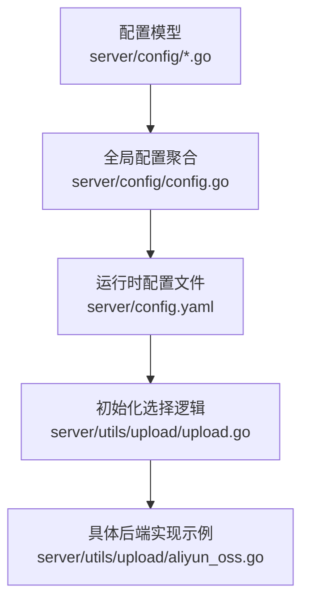
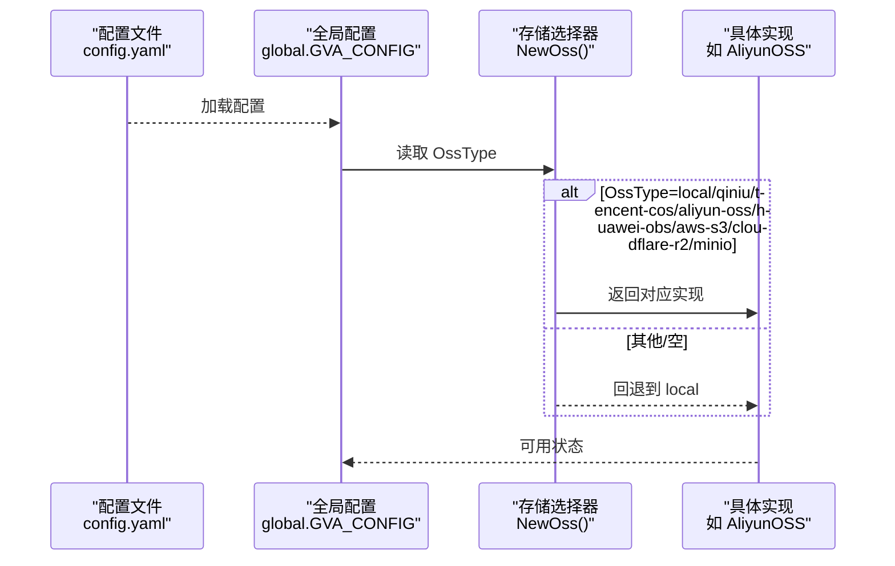
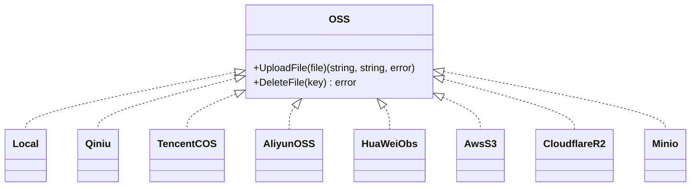
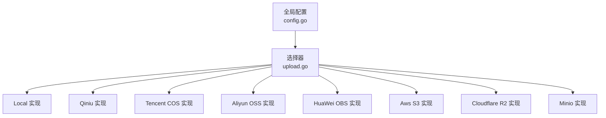

# 存储配置管理

<cite>
**本文档引用的文件**
- [server/config/config.go](file://server/config/config.go)
- [server/config/disk.go](file://server/config/disk.go)
- [server/config/oss_local.go](file://server/config/oss_local.go)
- [server/config/oss_aliyun.go](file://server/config/oss_aliyun.go)
- [server/config/oss_aws.go](file://server/config/oss_aws.go)
- [server/config/oss_minio.go](file://server/config/oss_minio.go)
- [server/config/oss_qiniu.go](file://server/config/oss_qiniu.go)
- [server/config/oss_huawei.go](file://server/config/oss_huawei.go)
- [server/config/oss_tencent.go](file://server/config/oss_tencent.go)
- [server/config/oss_cloudflare.go](file://server/config/oss_cloudflare.go)
- [server/config.yaml](file://server/config.yaml)
- [server/cmd/mcp/config.yaml](file://server/cmd/mcp/config.yaml)
- [server/utils/upload/upload.go](file://server/utils/upload/upload.go)
- [server/utils/upload/aliyun_oss.go](file://server/utils/upload/aliyun_oss.go)
</cite>

## 目录
1. [简介](#简介)
2. [项目结构](#项目结构)
3. [核心组件](#核心组件)
4. [架构总览](#架构总览)
5. [详细组件分析](#详细组件分析)
6. [依赖关系分析](#依赖关系分析)
7. [性能考虑](#性能考虑)
8. [故障排除指南](#故障排除指南)
9. [结论](#结论)
10. [附录](#附录)

## 简介
本文件系统性阐述存储配置管理，涵盖配置文件中不同存储后端的设置方法、OSS 类型选择、凭证配置、参数调优、默认值说明、访问权限与性能参数、配置示例、故障排除以及配置热更新与环境变量覆盖机制。目标是帮助运维与开发人员快速、准确地完成对象存储与本地磁盘的配置与优化。

## 项目结构
存储配置主要分布在以下位置：
- 配置模型定义：位于 server/config 下，包含各存储后端的结构体定义与全局配置聚合
- 运行时配置文件：server/config.yaml 提供默认配置示例
- 初始化与选择逻辑：server/utils/upload/upload.go 根据系统配置动态选择具体存储实现
- 各后端实现示例：以阿里云 OSS 为例，展示上传与删除流程

**图表来源**
- [server/config/config.go:1-41](file://server/config/config.go#L1-L41)
- [server/config.yaml:1-284](file://server/config.yaml#L1-L284)
- [server/utils/upload/upload.go:17-46](file://server/utils/upload/upload.go#L17-L46)
- [server/utils/upload/aliyun_oss.go:13-76](file://server/utils/upload/aliyun_oss.go#L13-L76)

**章节来源**
- [server/config/config.go:1-41](file://server/config/config.go#L1-L41)
- [server/config.yaml:1-284](file://server/config.yaml#L1-L284)

## 核心组件
- 全局配置聚合：包含系统、数据库、缓存、日志、邮件、Excel、跨域、MCP、以及各类存储后端配置字段
- 存储后端配置模型：分别定义本地、七牛、阿里云 OSS、华为 OBS、腾讯 COS、AWS S3、Cloudflare R2、MinIO 的参数
- 存储选择器：根据系统配置中的 OssType 动态返回对应存储实现
- 本地磁盘挂载点：通过 disk-list 指定挂载点，用于磁盘使用情况监控等场景

关键字段与默认值（来自配置文件）：
- 系统配置（oss-type 默认为 local）
- 各存储后端均有默认占位值，需按实际后端替换
- 本地磁盘挂载点默认为根目录

**章节来源**
- [server/config/config.go:21-33](file://server/config/config.go#L21-L33)
- [server/config.yaml:78](file://server/config.yaml#L78)
- [server/config.yaml:177-179](file://server/config.yaml#L177-L179)
- [server/config.yaml:261-263](file://server/config.yaml#L261-L263)

## 架构总览
存储配置的运行时选择流程如下：

**图表来源**
- [server/config.yaml:78](file://server/config.yaml#L78)
- [server/utils/upload/upload.go:20-46](file://server/utils/upload/upload.go#L20-L46)

## 详细组件分析

### 配置模型与字段说明
- 全局配置聚合（Server）：包含系统、数据库、缓存、日志、邮件、Excel、跨域、MCP、以及各类存储后端配置
- 本地存储（Local）：path 与 store-path 分别控制访问路径与存储路径
- 阿里云 OSS（AliyunOSS）：endpoint、access-key-id、access-key-secret、bucket-name、bucket-url、base-path
- AWS S3（AwsS3）：bucket、region、endpoint、secret-id、secret-key、base-url、path-prefix、s3-force-path-style、disable-ssl
- MinIO（Minio）：endpoint、access-key-id、access-key-secret、bucket-name、use-ssl、base-path、bucket-url
- 七牛（Qiniu）：zone、bucket、img-path、access-key、secret-key、use-https、use-cdn-domains
- 华为 OBS（HuaWeiObs）：path、bucket、endpoint、access-key、secret-key
- 腾讯 COS（TencentCOS）：bucket、region、secret-id、secret-key、base-url、path-prefix
- Cloudflare R2（CloudflareR2）：bucket、base-url、path、account-id、access-key-id、secret-access-key
- 本地磁盘（Disk/DiskList）：mount-point

默认值与作用：
- oss-type 默认为 local，决定运行时选择的存储实现
- 各后端均提供默认占位值，需按实际后端替换
- base-path/base-url/path-prefix 等用于拼接最终访问 URL 或对象键
- use-ssl/disable-ssl 控制连接是否使用 SSL/TLS

**章节来源**
- [server/config/config.go:3-40](file://server/config/config.go#L3-L40)
- [server/config/oss_local.go:3-6](file://server/config/oss_local.go#L3-L6)
- [server/config/oss_aliyun.go:3-10](file://server/config/oss_aliyun.go#L3-L10)
- [server/config/oss_aws.go:3-13](file://server/config/oss_aws.go#L3-L13)
- [server/config/oss_minio.go:3-11](file://server/config/oss_minio.go#L3-L11)
- [server/config/oss_qiniu.go:3-11](file://server/config/oss_qiniu.go#L3-L11)
- [server/config/oss_huawei.go:3-9](file://server/config/oss_huawei.go#L3-L9)
- [server/config/oss_tencent.go:3-10](file://server/config/oss_tencent.go#L3-L10)
- [server/config/oss_cloudflare.go:3-10](file://server/config/oss_cloudflare.go#L3-L10)
- [server/config/disk.go:3-9](file://server/config/disk.go#L3-L9)

### 存储类型选择与初始化
- 选择逻辑：根据系统配置中的 OssType 返回对应存储实现；若配置异常则回退到 local
- MinIO 特殊处理：初始化时会尝试连接并校验可用性，失败会记录警告并中断启动
- 上传流程（以阿里云 OSS 为例）：构造对象键（含 base-path 与日期），上传文件流，返回访问 URL 与对象键；删除流程：通过对象键删除对象

**图表来源**
- [server/utils/upload/upload.go:12-15](file://server/utils/upload/upload.go#L12-L15)
- [server/utils/upload/upload.go:20-46](file://server/utils/upload/upload.go#L20-L46)

**章节来源**
- [server/utils/upload/upload.go:12-46](file://server/utils/upload/upload.go#L12-L46)
- [server/utils/upload/aliyun_oss.go:15-59](file://server/utils/upload/aliyun_oss.go#L15-L59)

### 参数调优与性能要点
- BasePath/PathPrefix：合理设置可提升 URL 结构清晰度与缓存命中率
- DisableSSL/UseSSL：生产环境建议启用 SSL；仅在调试或兼容性需求下禁用
- BucketUrl/BaseURL：确保与 CDN 或网关配置一致，避免跨域与证书问题
- 并发与超时：上传实现未内置并发控制，建议在业务层控制并发数与超时时间
- 访问权限：确保 SecretID/SecretKey、AccessKey/SecretKey 等凭证最小权限原则，定期轮换

**章节来源**
- [server/config/oss_aws.go:11-12](file://server/config/oss_aws.go#L11-L12)
- [server/config/oss_minio.go:8](file://server/config/oss_minio.go#L8)
- [server/config/oss_aliyun.go:9](file://server/config/oss_aliyun.go#L9)

### 配置示例
- 本地存储：设置 path 与 store-path 指向实际目录
- 阿里云 OSS：填写 endpoint、access-key-id、access-key-secret、bucket-name、bucket-url、base-path
- AWS S3/MinIO：填写 bucket、region、endpoint、secret-id、secret-key、base-url、path-prefix、s3-force-path-style、disable-ssl/use-ssl
- 七牛：填写 zone、bucket、img-path、access-key、secret-key、use-https、use-cdn-domains
- 华为 OBS：填写 path、bucket、endpoint、access-key、secret-key
- 腾讯 COS：填写 bucket、region、secret-id、secret-key、base-url、path-prefix
- Cloudflare R2：填写 bucket、base-url、path、account-id、access-key-id、secret-access-key

以上示例均可参考配置文件中的对应段落进行填充。

**章节来源**
- [server/config.yaml:177-179](file://server/config.yaml#L177-L179)
- [server/config.yaml:209-217](file://server/config.yaml#L209-L217)
- [server/config.yaml:227-237](file://server/config.yaml#L227-L237)
- [server/config.yaml:190-197](file://server/config.yaml#L190-L197)
- [server/config.yaml:248-254](file://server/config.yaml#L248-L254)
- [server/config.yaml:218-226](file://server/config.yaml#L218-L226)
- [server/config.yaml:239-247](file://server/config.yaml#L239-L247)

### 故障排除指南
- MinIO 初始化失败：检查 endpoint、access-key-id、access-key-secret、bucket-name、use-ssl 是否正确；查看日志警告并修正
- 上传失败：确认 base-path 与对象键拼接规则；检查 bucket-url/base-url 与实际访问域名一致
- 权限错误：核对 SecretID/SecretKey、AccessKey/SecretKey、AccountID 等凭证；确保具备写入权限
- 跨域与证书问题：确保启用 SSL 且证书有效；检查 CORS 配置与前端域名匹配
- 回退到本地：当 OssType 非法或后端不可用时，系统回退到本地存储

**章节来源**
- [server/utils/upload/upload.go:37-42](file://server/utils/upload/upload.go#L37-L42)
- [server/utils/upload/aliyun_oss.go:34-38](file://server/utils/upload/aliyun_oss.go#L34-L38)

## 依赖关系分析
- 配置模型之间无直接耦合，通过全局配置聚合统一注入
- 存储选择器依赖系统配置中的 OssType，返回对应实现
- 各后端实现依赖各自配置结构体，不互相依赖
- 本地磁盘配置独立于存储后端配置

**图表来源**
- [server/config/config.go:22-29](file://server/config/config.go#L22-L29)
- [server/utils/upload/upload.go:20-46](file://server/utils/upload/upload.go#L20-L46)

**章节来源**
- [server/config/config.go:22-29](file://server/config/config.go#L22-L29)
- [server/utils/upload/upload.go:20-46](file://server/utils/upload/upload.go#L20-L46)

## 性能考虑
- URL 拼接与缓存：合理设置 base-path/base-url，减少重复解析与网络往返
- 传输安全：优先使用 SSL/TLS，避免明文传输带来的性能与安全风险
- 并发控制：在业务层控制上传并发，避免后端限速或资源争用
- 路径前缀：使用 path-prefix 将不同模块或租户隔离，便于缓存与统计

[本节为通用指导，无需特定文件引用]

## 故障排除指南
- MinIO 初始化失败：检查 endpoint、access-key-id、access-key-secret、bucket-name、use-ssl；查看日志警告并修正
- 上传失败：确认 base-path 与对象键拼接规则；检查 bucket-url/base-url 与实际访问域名一致
- 权限错误：核对 SecretID/SecretKey、AccessKey/SecretKey、AccountID 等凭证；确保具备写入权限
- 跨域与证书问题：确保启用 SSL 且证书有效；检查 CORS 配置与前端域名匹配
- 回退到本地：当 OssType 非法或后端不可用时，系统回退到本地存储

**章节来源**
- [server/utils/upload/upload.go:37-42](file://server/utils/upload/upload.go#L37-L42)
- [server/utils/upload/aliyun_oss.go:34-38](file://server/utils/upload/aliyun_oss.go#L34-L38)

## 结论
通过统一的配置模型与运行时选择器，系统实现了对多种存储后端的灵活接入。正确配置各后端参数、遵循最小权限原则与启用 SSL、合理设置路径前缀与 URL，是保障稳定性与性能的关键。遇到问题时，优先检查凭证、网络连通性与 URL 一致性，并利用日志定位根因。

[本节为总结，无需特定文件引用]

## 附录

### 配置热更新与环境变量覆盖机制
- 配置热更新：当前仓库未提供配置热更新的具体实现细节。建议在部署环境中结合配置中心或容器编排工具，在重启或滚动更新时加载新配置
- 环境变量覆盖：当前仓库未提供环境变量覆盖配置的具体实现细节。建议在启动脚本或容器入口中注入环境变量，并在应用启动时合并至配置文件

[本节为通用指导，无需特定文件引用]