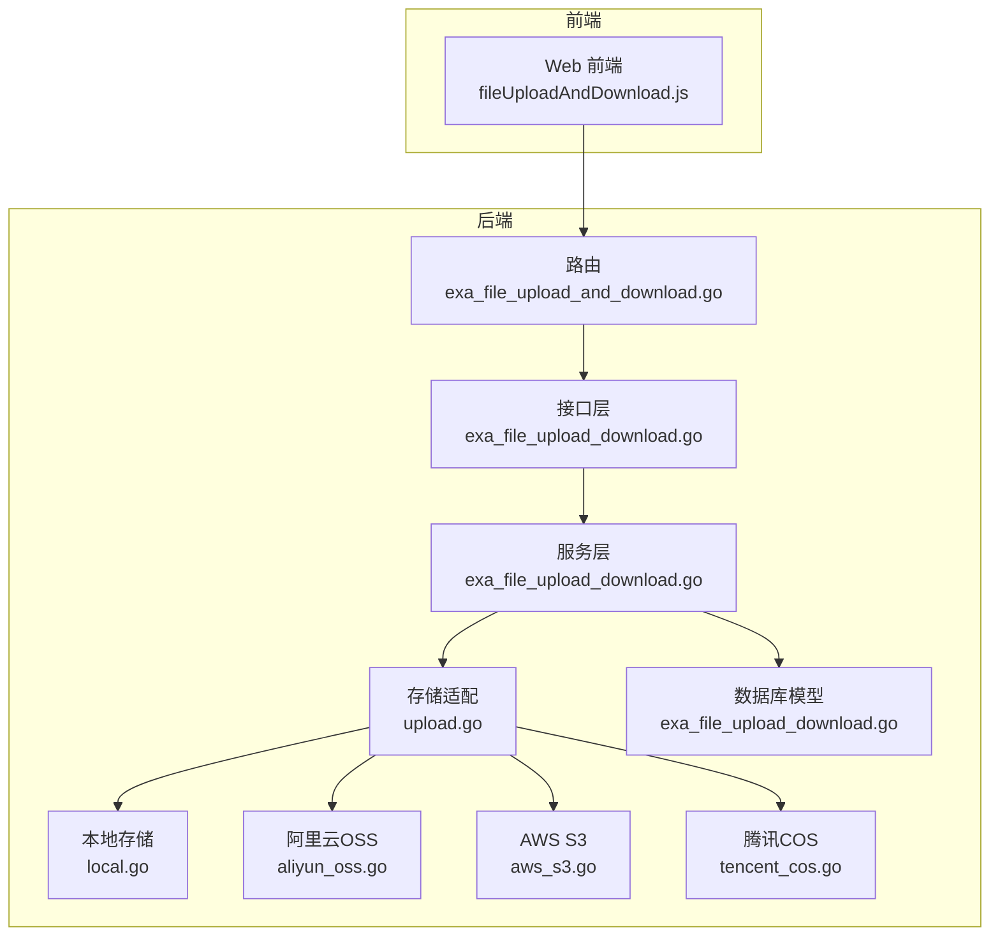
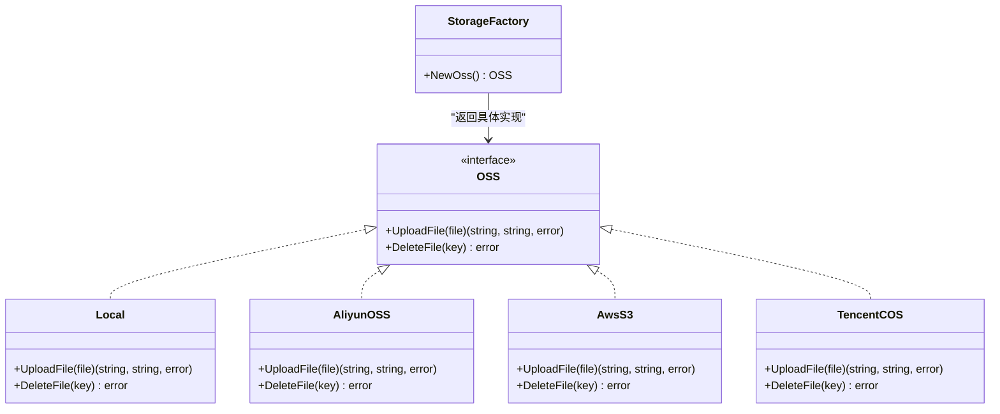
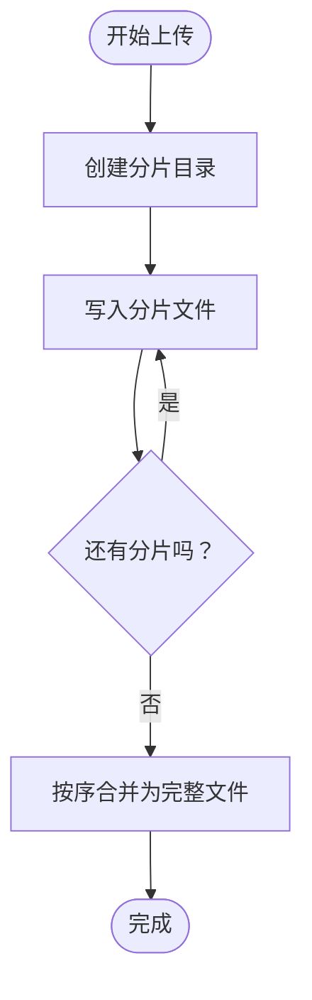
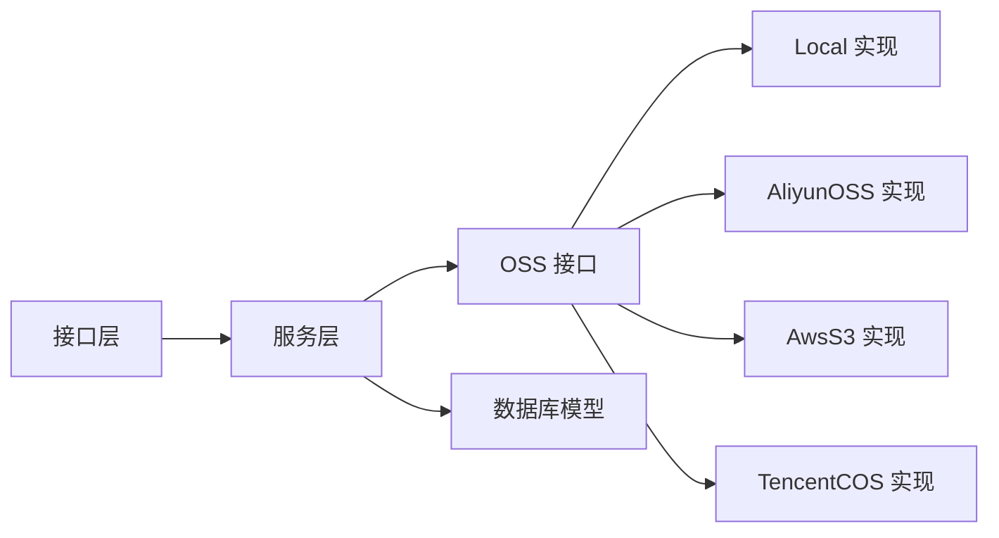

# 文件存储系统

<cite>
**本文引用的文件**
- [exa_file_upload_download.go](file://server/api/v1/example/exa_file_upload_download.go)
- [exa_file_upload_download.go](file://server/service/example/exa_file_upload_download.go)
- [upload.go](file://server/utils/upload/upload.go)
- [breakpoint_continue.go](file://server/utils/breakpoint_continue.go)
- [local.go](file://server/utils/upload/local.go)
- [aliyun_oss.go](file://server/utils/upload/aliyun_oss.go)
- [aws_s3.go](file://server/utils/upload/aws_s3.go)
- [tencent_cos.go](file://server/utils/upload/tencent_cos.go)
- [oss_local.go](file://server/config/oss_local.go)
- [oss_aws.go](file://server/config/oss_aws.go)
- [oss_tencent.go](file://server/config/oss_tencent.go)
- [oss_aliyun.go](file://server/config/oss_aliyun.go)
- [exa_file_upload_and_download.go](file://server/router/example/exa_file_upload_and_download.go)
- [fileUploadAndDownload.js](file://web/src/api/fileUploadAndDownload.js)
- [exa_file_upload_download.go](file://server/model/example/exa_file_upload_download.go)
</cite>

## 目录
1. [简介](#简介)
2. [项目结构](#项目结构)
3. [核心组件](#核心组件)
4. [架构总览](#架构总览)
5. [详细组件分析](#详细组件分析)
6. [依赖分析](#依赖分析)
7. [性能考量](#性能考量)
8. [故障排查指南](#故障排查指南)
9. [结论](#结论)
10. [附录](#附录)

## 简介
本文件存储系统为测试管理平台提供统一的文件上传、下载与管理能力，覆盖本地存储与多家云存储后端（阿里云 OSS、腾讯 COS、AWS S3 等）。系统支持基础上传、文件元数据管理、删除与分页查询；同时提供断点续传与分片上传能力，结合进度跟踪与安全校验，满足企业级场景对可靠性、安全性与可扩展性的要求。

## 项目结构
围绕文件存储的关键模块分布如下：
- 接口层：提供 REST API，定义上传、删除、列表、断点续传等接口
- 服务层：封装业务逻辑，协调存储后端与数据库
- 存储适配层：通过统一接口抽象，屏蔽不同后端差异
- 配置层：集中管理各后端的访问凭据、路径前缀与区域参数
- 前端交互：提供上传、列表、删除等前端调用封装

图表来源
- [exa_file_upload_and_download.go:1-23](file://server/router/example/exa_file_upload_and_download.go#L1-L23)
- [exa_file_upload_download.go:1-136](file://server/api/v1/example/exa_file_upload_download.go#L1-L136)
- [exa_file_upload_download.go:1-131](file://server/service/example/exa_file_upload_download.go#L1-L131)
- [upload.go:1-47](file://server/utils/upload/upload.go#L1-L47)
- [local.go:1-110](file://server/utils/upload/local.go#L1-L110)
- [aliyun_oss.go:1-76](file://server/utils/upload/aliyun_oss.go#L1-L76)
- [aws_s3.go:1-115](file://server/utils/upload/aws_s3.go#L1-L115)
- [tencent_cos.go:1-62](file://server/utils/upload/tencent_cos.go#L1-L62)
- [exa_file_upload_download.go:1-19](file://server/model/example/exa_file_upload_download.go#L1-L19)

章节来源
- [exa_file_upload_and_download.go:1-23](file://server/router/example/exa_file_upload_and_download.go#L1-L23)
- [exa_file_upload_download.go:1-136](file://server/api/v1/example/exa_file_upload_download.go#L1-L136)
- [exa_file_upload_download.go:1-131](file://server/service/example/exa_file_upload_download.go#L1-L131)
- [upload.go:1-47](file://server/utils/upload/upload.go#L1-L47)

## 核心组件
- 统一存储接口与工厂
  - 通过接口抽象与工厂函数在运行时根据配置选择具体存储实现，支持本地、阿里云OSS、腾讯COS、AWS S3、MinIO 等
- 上传流程
  - 接收 multipart 文件，调用存储后端写入，生成访问路径与唯一键值，持久化元数据
- 删除流程
  - 先从存储后端删除对象，再删除数据库记录
- 列表与查询
  - 支持分页、关键词与分类筛选
- 断点续传与分片
  - 基于本地临时目录保存分片，按序合并，支持校验与清理

章节来源
- [upload.go:1-47](file://server/utils/upload/upload.go#L1-L47)
- [exa_file_upload_download.go:96-120](file://server/service/example/exa_file_upload_download.go#L96-L120)
- [exa_file_upload_download.go:43-55](file://server/service/example/exa_file_upload_download.go#L43-L55)
- [exa_file_upload_download.go:84-112](file://server/api/v1/example/exa_file_upload_download.go#L84-L112)
- [breakpoint_continue.go:26-107](file://server/utils/breakpoint_continue.go#L26-L107)

## 架构总览
系统采用“接口抽象 + 工厂模式 + 路由/服务/存储三层”的设计，确保新增后端成本低、扩展性强。

图表来源
- [upload.go:12-46](file://server/utils/upload/upload.go#L12-L46)
- [local.go:20-109](file://server/utils/upload/local.go#L20-L109)
- [aliyun_oss.go:13-75](file://server/utils/upload/aliyun_oss.go#L13-L75)
- [aws_s3.go:20-114](file://server/utils/upload/aws_s3.go#L20-L114)
- [tencent_cos.go:18-61](file://server/utils/upload/tencent_cos.go#L18-L61)

## 详细组件分析

### 上传与下载 API 层
- 提供上传、删除、列表、编辑、导入URL等接口
- 上传接口支持 noSave 参数与分类字段，便于灵活控制是否入库
- 列表接口支持分页、关键词与分类过滤

章节来源
- [exa_file_upload_download.go:16-136](file://server/api/v1/example/exa_file_upload_download.go#L16-L136)

### 服务层：业务编排与存储调度
- UploadFile：调用存储适配器执行上传，生成访问路径与键值，按需入库
- DeleteFile：先删除存储对象，再删除数据库记录
- GetFileRecordInfoList：分页查询文件记录
- ImportURL：批量导入外部链接

章节来源
- [exa_file_upload_download.go:96-130](file://server/service/example/exa_file_upload_download.go#L96-L130)

### 存储适配层：统一接口与多后端实现
- 接口定义：UploadFile 返回访问路径与键值；DeleteFile 以键值删除对象
- 工厂函数：根据系统配置选择具体实现（local、aliyun-oss、tencent-cos、aws-s3、cloudflare-r2、minio 等）
- 各后端实现要点
  - 本地存储：基于文件系统，支持路径与存储路径分离
  - 阿里云 OSS：按日期组织对象路径，支持自定义 BasePath
  - AWS S3：支持自定义 Endpoint、Region、S3ForcePathStyle 与 SSL 开关
  - 腾讯 COS：按 Region 与 Bucket 组织客户端，支持 PathPrefix

章节来源
- [upload.go:12-46](file://server/utils/upload/upload.go#L12-L46)
- [local.go:31-69](file://server/utils/upload/local.go#L31-L69)
- [aliyun_oss.go:15-40](file://server/utils/upload/aliyun_oss.go#L15-L40)
- [aws_s3.go:29-53](file://server/utils/upload/aws_s3.go#L29-L53)
- [tencent_cos.go:21-35](file://server/utils/upload/tencent_cos.go#L21-L35)

### 断点续传与分片处理
- 本地分片缓存：以文件MD5为目录，按序写入分片文件
- 校验与合并：前端可校验分片完整性，完成后按序合并至最终文件
- 清理：支持删除临时分片目录
- 注意：当前实现为本地分片，未直接对接云存储的分段上传能力

图表来源
- [breakpoint_continue.go:26-107](file://server/utils/breakpoint_continue.go#L26-L107)

章节来源
- [breakpoint_continue.go:26-122](file://server/utils/breakpoint_continue.go#L26-L122)

### 数据模型与持久化
- 记录字段：文件名、分类ID、访问URL、标签、键值
- 表名：exa_file_upload_and_downloads
- 服务层在上传成功后按需入库，避免重复键值冲突

章节来源
- [exa_file_upload_download.go:7-18](file://server/model/example/exa_file_upload_download.go#L7-L18)
- [exa_file_upload_download.go:103-119](file://server/service/example/exa_file_upload_download.go#L103-L119)

### 前端交互
- 提供上传、删除、列表、编辑、导入URL等 API 封装
- 上传接口路径与方法定义清晰，便于前端集成

章节来源
- [fileUploadAndDownload.js:1-67](file://web/src/api/fileUploadAndDownload.js#L1-L67)

## 依赖分析
- 组件耦合
  - 服务层依赖存储适配器接口，解耦具体后端
  - 存储适配器依赖各自 SDK 与配置
- 外部依赖
  - 阿里云 OSS SDK、AWS SDK v2、腾讯 COS SDK
- 可能的循环依赖
  - 当前结构清晰，未见循环依赖迹象

图表来源
- [exa_file_upload_download.go:1-136](file://server/api/v1/example/exa_file_upload_download.go#L1-L136)
- [exa_file_upload_download.go:1-131](file://server/service/example/exa_file_upload_download.go#L1-L131)
- [upload.go:1-47](file://server/utils/upload/upload.go#L1-L47)
- [exa_file_upload_download.go:1-19](file://server/model/example/exa_file_upload_download.go#L1-L19)

章节来源
- [exa_file_upload_download.go:1-136](file://server/api/v1/example/exa_file_upload_download.go#L1-L136)
- [exa_file_upload_download.go:1-131](file://server/service/example/exa_file_upload_download.go#L1-L131)
- [upload.go:1-47](file://server/utils/upload/upload.go#L1-L47)

## 性能考量
- 本地存储
  - IO 受磁盘性能影响，建议使用高性能磁盘与合理的并发控制
  - 并发删除使用互斥锁，避免竞态
- 云存储
  - OSS/COS/S3 建议启用 CDN 加速与合适的存储类型
  - S3 客户端支持自定义 Endpoint 与 PathStyle，便于兼容 MinIO
- 断点续传
  - 本地分片适合中小文件快速恢复；大文件建议使用云原生分段上传（如 S3 Multipart Upload）以提升稳定性与速度
- 进度跟踪
  - 可在前端基于分片大小与数量计算进度，结合服务端状态查询

## 故障排查指南
- 上传失败
  - 检查存储路径权限与磁盘空间（本地）
  - 校验后端凭据与网络连通性（云存储）
- 删除失败
  - 确认键值正确且对象存在
  - 查看日志定位具体错误
- 断点续传异常
  - 检查分片目录权限与临时文件
  - 确保分片顺序与数量一致
- 配置问题
  - 对照配置项核对 OssType 与各后端配置
  - MinIO 初始化失败会触发告警，需检查 Endpoint、凭据与 SSL 设置

章节来源
- [local.go:81-109](file://server/utils/upload/local.go#L81-L109)
- [breakpoint_continue.go:115-121](file://server/utils/breakpoint_continue.go#L115-L121)
- [upload.go:37-42](file://server/utils/upload/upload.go#L37-L42)

## 结论
本文件存储系统通过统一接口与工厂模式，实现了对多种存储后端的无缝接入；结合本地断点续传与云存储能力，满足不同规模与场景的需求。建议在生产环境优先采用云存储，并结合 CDN、监控与备份策略，进一步提升可用性与安全性。

## 附录

### 存储配置管理
- 本地存储
  - 字段：path、store-path
- 阿里云 OSS
  - 字段：endpoint、access-key-id、access-key-secret、bucket-name、bucket-url、base-path
- 腾讯 COS
  - 字段：bucket、region、secret-id、secret-key、base-url、path-prefix
- AWS S3
  - 字段：bucket、region、endpoint、secret-id、secret-key、base-url、path-prefix、s3-force-path-style、disable-ssl

章节来源
- [oss_local.go:1-7](file://server/config/oss_local.go#L1-L7)
- [oss_aliyun.go:1-11](file://server/config/oss_aliyun.go#L1-L11)
- [oss_tencent.go:1-11](file://server/config/oss_tencent.go#L1-L11)
- [oss_aws.go:1-14](file://server/config/oss_aws.go#L1-L14)

### 文件管理功能
- 类型检查与大小限制
  - 当前代码未内置类型与大小限制逻辑，建议在接口层或服务层增加校验
- 安全验证
  - 本地删除对键值进行基本合法性校验；云存储删除依赖后端鉴权
- 元数据管理
  - 服务层负责入库与更新文件名、分类等信息

章节来源
- [exa_file_upload_download.go:58-61](file://server/service/example/exa_file_upload_download.go#L58-L61)
- [local.go:82-90](file://server/utils/upload/local.go#L82-L90)

### 安全考虑与最佳实践
- 访问控制
  - 云存储端设置 Bucket/容器策略，限制匿名访问
  - 使用签名 URL 或预签名链接控制临时访问
- 加密传输
  - 强制 HTTPS；S3/MinIO 可配置禁用 SSL 仅限内网或可信网络
- 备份策略
  - 启用跨区域复制或多版本控制；定期导出元数据
- 日志与审计
  - 记录上传/删除操作与错误信息，便于追踪