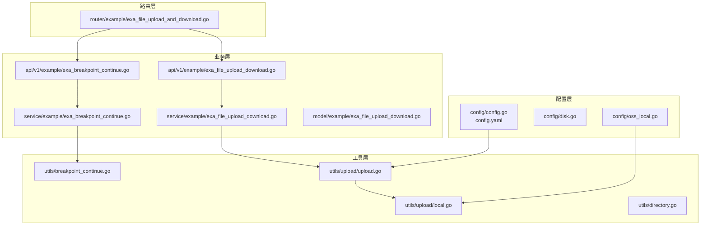
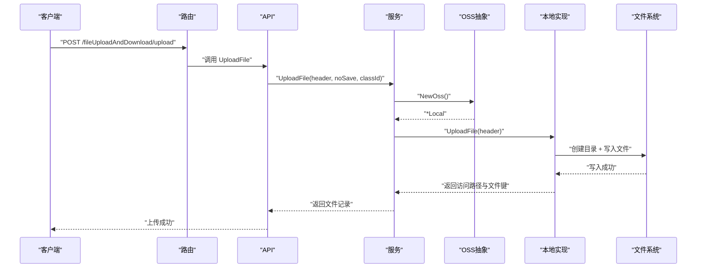
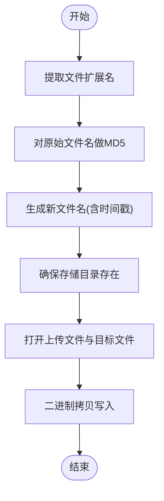
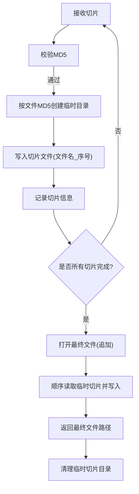
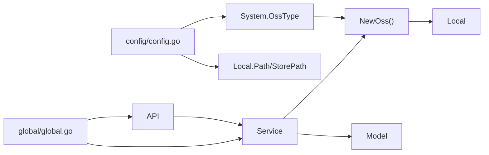

# 本地存储

<cite>
**本文引用的文件**
- [server/config/disk.go](file://server/config/disk.go)
- [server/config/oss_local.go](file://server/config/oss_local.go)
- [server/config/config.go](file://server/config/config.go)
- [server/config.yaml](file://server/config.yaml)
- [server/utils/upload/local.go](file://server/utils/upload/local.go)
- [server/utils/upload/upload.go](file://server/utils/upload/upload.go)
- [server/utils/directory.go](file://server/utils/directory.go)
- [server/utils/breakpoint_continue.go](file://server/utils/breakpoint_continue.go)
- [server/api/v1/example/exa_file_upload_download.go](file://server/api/v1/example/exa_file_upload_download.go)
- [server/api/v1/example/exa_breakpoint_continue.go](file://server/api/v1/example/exa_breakpoint_continue.go)
- [server/service/example/exa_file_upload_download.go](file://server/service/example/exa_file_upload_download.go)
- [server/service/example/exa_breakpoint_continue.go](file://server/service/example/exa_breakpoint_continue.go)
- [server/router/example/exa_file_upload_and_download.go](file://server/router/example/exa_file_upload_and_download.go)
- [server/model/example/exa_file_upload_download.go](file://server/model/example/exa_file_upload_download.go)
- [server/global/global.go](file://server/global/global.go)
</cite>

## 目录
1. [简介](#简介)
2. [项目结构](#项目结构)
3. [核心组件](#核心组件)
4. [架构总览](#架构总览)
5. [详细组件分析](#详细组件分析)
6. [依赖关系分析](#依赖关系分析)
7. [性能考量](#性能考量)
8. [故障排查指南](#故障排查指南)
9. [结论](#结论)
10. [附录](#附录)

## 简介
本章节面向“本地存储”能力，系统性阐述文件上传与删除在本地文件系统的实现原理与使用方式。重点覆盖以下方面：
- 存储根目录与访问路径配置
- 目录结构管理与权限策略
- 文件上传流程（含断点续传）
- 安全与性能最佳实践
- 使用示例与常见问题排查

## 项目结构
本地存储相关代码主要分布在如下模块：
- 配置层：定义本地存储路径与系统 OSS 类型选择
- 工具层：本地上传实现、断点续传工具、通用目录操作
- 业务层：API 接口、服务编排、模型定义
- 路由层：对外暴露上传、删除、断点续传等接口

图表来源
- [server/config/config.go:1-41](file://server/config/config.go#L1-L41)
- [server/config.yaml:176-180](file://server/config.yaml#L176-L180)
- [server/utils/upload/upload.go:17-46](file://server/utils/upload/upload.go#L17-L46)
- [server/utils/upload/local.go:31-70](file://server/utils/upload/local.go#L31-L70)
- [server/api/v1/example/exa_file_upload_download.go:25-42](file://server/api/v1/example/exa_file_upload_download.go#L25-L42)
- [server/api/v1/example/exa_breakpoint_continue.go:29-78](file://server/api/v1/example/exa_breakpoint_continue.go#L29-L78)
- [server/service/example/exa_file_upload_download.go:96-120](file://server/service/example/exa_file_upload_download.go#L96-L120)
- [server/service/example/exa_breakpoint_continue.go:21-35](file://server/service/example/exa_breakpoint_continue.go#L21-L35)
- [server/router/example/exa_file_upload_and_download.go:9-22](file://server/router/example/exa_file_upload_and_download.go#L9-L22)

章节来源
- [server/config/config.go:1-41](file://server/config/config.go#L1-L41)
- [server/config.yaml:176-180](file://server/config.yaml#L176-L180)
- [server/utils/upload/upload.go:17-46](file://server/utils/upload/upload.go#L17-L46)
- [server/utils/upload/local.go:31-70](file://server/utils/upload/local.go#L31-L70)
- [server/api/v1/example/exa_file_upload_download.go:25-42](file://server/api/v1/example/exa_file_upload_download.go#L25-L42)
- [server/api/v1/example/exa_breakpoint_continue.go:29-78](file://server/api/v1/example/exa_breakpoint_continue.go#L29-L78)
- [server/service/example/exa_file_upload_download.go:96-120](file://server/service/example/exa_file_upload_download.go#L96-L120)
- [server/service/example/exa_breakpoint_continue.go:21-35](file://server/service/example/exa_breakpoint_continue.go#L21-L35)
- [server/router/example/exa_file_upload_and_download.go:9-22](file://server/router/example/exa_file_upload_and_download.go#L9-L22)

## 核心组件
- 本地存储配置项
  - 存储根目录：用于存放实际文件
  - 访问路径：用于生成可访问 URL 的前缀
- 上传接口与服务
  - 上传入口：接收 multipart/form-data，委派 OSS 实现
  - OSS 抽象：根据系统配置选择本地或其他云存储
  - 本地上传实现：负责创建目录、写入文件、返回访问路径与文件键
- 断点续传
  - 切片校验与落盘
  - 组装完成后的合并
  - 清理临时切片
- 目录与文件工具
  - 目录存在性与批量创建
  - 文件移动与删除
  - 切片清理

章节来源
- [server/config/oss_local.go:3-6](file://server/config/oss_local.go#L3-L6)
- [server/config/config.go:22-29](file://server/config/config.go#L22-L29)
- [server/utils/upload/upload.go:17-46](file://server/utils/upload/upload.go#L17-L46)
- [server/utils/upload/local.go:31-70](file://server/utils/upload/local.go#L31-L70)
- [server/utils/breakpoint_continue.go:26-76](file://server/utils/breakpoint_continue.go#L26-L76)
- [server/utils/directory.go:40-55](file://server/utils/directory.go#L40-L55)

## 架构总览
本地存储采用“配置驱动 + 接口抽象”的设计：
- 配置层决定 OSS 类型与本地路径
- 服务层统一编排上传/删除逻辑
- 工具层提供具体实现与安全校验
- API 层对外暴露 HTTP 接口

图表来源
- [server/router/example/exa_file_upload_and_download.go:12](file://server/router/example/exa_file_upload_and_download.go#L12)
- [server/api/v1/example/exa_file_upload_download.go:25-42](file://server/api/v1/example/exa_file_upload_download.go#L25-L42)
- [server/service/example/exa_file_upload_download.go:96-120](file://server/service/example/exa_file_upload_download.go#L96-L120)
- [server/utils/upload/upload.go:20-24](file://server/utils/upload/upload.go#L20-L24)
- [server/utils/upload/local.go:31-70](file://server/utils/upload/local.go#L31-L70)

## 详细组件分析

### 本地存储配置
- 配置项
  - 存储根目录：用于持久化文件
  - 访问路径：用于拼接对外可访问 URL
- 配置来源
  - 服务端配置文件中定义本地存储参数
  - 系统 OSS 类型决定上传走本地还是其他云存储
- 目录与挂载点
  - 通过磁盘挂载点配置可扩展多盘管理（如需要）

章节来源
- [server/config/oss_local.go:3-6](file://server/config/oss_local.go#L3-L6)
- [server/config/config.go:22-29](file://server/config/config.go#L22-L29)
- [server/config.yaml:176-180](file://server/config.yaml#L176-L180)
- [server/config/disk.go:3-10](file://server/config/disk.go#L3-L10)

### 上传流程（本地）
- 输入：multipart 文件头
- 处理：
  - 生成新文件名（基于文件名 MD5 + 时间戳 + 原扩展名）
  - 确保存储目录存在
  - 打开上传文件与目标文件句柄
  - 二进制拷贝完成写入
- 输出：返回访问路径与文件键，用于后续记录与访问

图表来源
- [server/utils/upload/local.go:31-70](file://server/utils/upload/local.go#L31-L70)

章节来源
- [server/utils/upload/local.go:31-70](file://server/utils/upload/local.go#L31-L70)

### 删除流程（本地）
- 输入：文件键
- 处理：
  - 校验键合法性（防路径穿越与非法字符）
  - 拼接存储路径并检查文件存在
  - 并发删除加锁
  - 删除成功返回空；失败返回错误
- 输出：成功或错误信息

章节来源
- [server/utils/upload/local.go:81-109](file://server/utils/upload/local.go#L81-L109)

### 断点续传（本地）
- 流程概览
  - 接收切片：校验切片内容 MD5，按文件 MD5 与切片序号落盘到临时目录
  - 查询/创建记录：根据文件 MD5 与文件名维护上传记录
  - 合并完成：遍历临时切片顺序追加写入最终文件
  - 清理切片：删除对应文件 MD5 的临时切片目录
- 安全与健壮性
  - 路径穿越与非法字符拦截
  - 失败回滚（合并失败时删除已创建的最终文件）

图表来源
- [server/api/v1/example/exa_breakpoint_continue.go:29-78](file://server/api/v1/example/exa_breakpoint_continue.go#L29-L78)
- [server/service/example/exa_breakpoint_continue.go:21-35](file://server/service/example/exa_breakpoint_continue.go#L21-L35)
- [server/utils/breakpoint_continue.go:26-107](file://server/utils/breakpoint_continue.go#L26-L107)

章节来源
- [server/api/v1/example/exa_breakpoint_continue.go:29-78](file://server/api/v1/example/exa_breakpoint_continue.go#L29-L78)
- [server/service/example/exa_breakpoint_continue.go:21-35](file://server/service/example/exa_breakpoint_continue.go#L21-L35)
- [server/utils/breakpoint_continue.go:26-107](file://server/utils/breakpoint_continue.go#L26-L107)

### 目录与文件管理
- 目录存在性检查与批量创建
- 文件移动（支持绝对/相对路径，自动创建目标目录）
- 文件删除（递归删除）

章节来源
- [server/utils/directory.go:20-55](file://server/utils/directory.go#L20-L55)
- [server/utils/directory.go:63-90](file://server/utils/directory.go#L63-L90)
- [server/utils/directory.go:92-94](file://server/utils/directory.go#L92-L94)

### API 与服务编排
- 上传接口
  - 接收 multipart 文件，调用服务层进行上传与记录
- 删除接口
  - 校验参数，调用服务层删除记录与物理文件
- 断点续传接口
  - 切片上传、查询/创建记录、合并完成、清理切片

章节来源
- [server/api/v1/example/exa_file_upload_download.go:25-42](file://server/api/v1/example/exa_file_upload_download.go#L25-L42)
- [server/api/v1/example/exa_file_upload_download.go:69-82](file://server/api/v1/example/exa_file_upload_download.go#L69-L82)
- [server/api/v1/example/exa_breakpoint_continue.go:29-78](file://server/api/v1/example/exa_breakpoint_continue.go#L29-L78)
- [server/api/v1/example/exa_breakpoint_continue.go:111-121](file://server/api/v1/example/exa_breakpoint_continue.go#L111-L121)

## 依赖关系分析
- 配置依赖
  - 系统 OSS 类型决定上传走本地还是其他云存储
  - 本地存储路径与访问路径来自配置
- 运行时依赖
  - 全局配置与日志在各层被广泛使用
  - 服务层依赖 OSS 抽象，避免直接耦合具体实现

图表来源
- [server/config/config.go:3,22-29](file://server/config/config.go#L3,L22-L29)
- [server/utils/upload/upload.go:20-24](file://server/utils/upload/upload.go#L20-L24)
- [server/global/global.go:25-42](file://server/global/global.go#L25-L42)

章节来源
- [server/config/config.go:3,22-29](file://server/config/config.go#L3,L22-L29)
- [server/utils/upload/upload.go:20-24](file://server/utils/upload/upload.go#L20-L24)
- [server/global/global.go:25-42](file://server/global/global.go#L25-L42)

## 性能考量
- IO 与并发
  - 本地上传采用二进制拷贝，适合小到中等文件；大文件建议结合断点续传
  - 删除操作使用互斥锁，避免并发删除冲突
- 目录与文件组织
  - 建议按日期或业务维度分层组织，降低单目录文件过多带来的性能问题
- 存储介质
  - 本地存储性能受磁盘吞吐与寻道影响，建议使用高性能磁盘或 SSD
- 日志与监控
  - 上传/删除失败应记录详细错误，便于定位性能瓶颈

章节来源
- [server/utils/upload/local.go:18](file://server/utils/upload/local.go#L18)
- [server/utils/upload/local.go:81-109](file://server/utils/upload/local.go#L81-L109)

## 故障排查指南
- 上传失败
  - 检查存储目录是否存在且具备写权限
  - 确认文件句柄创建与拷贝阶段的错误日志
- 删除失败
  - 校验文件键是否为空或包含非法字符
  - 确认文件确实存在于存储路径下
- 断点续传异常
  - 校验切片 MD5 是否匹配
  - 检查临时目录与最终文件的读写权限
  - 若合并失败，确认临时切片完整性并清理残留

章节来源
- [server/utils/upload/local.go:40-44](file://server/utils/upload/local.go#L40-L44)
- [server/utils/upload/local.go:56-61](file://server/utils/upload/local.go#L56-L61)
- [server/utils/upload/local.go:88-90](file://server/utils/upload/local.go#L88-L90)
- [server/utils/upload/local.go:95-97](file://server/utils/upload/local.go#L95-L97)
- [server/utils/breakpoint_continue.go:45-52](file://server/utils/breakpoint_continue.go#L45-L52)
- [server/utils/breakpoint_continue.go:88-106](file://server/utils/breakpoint_continue.go#L88-L106)

## 结论
本地存储通过清晰的配置与抽象接口，实现了从文件接收、落盘、记录到删除的完整闭环，并提供了断点续传能力。结合合理的目录组织与权限策略，可在保证安全性的同时获得良好的性能表现。

## 附录

### 配置项一览
- 系统 OSS 类型：决定上传走本地还是其他云存储
- 本地存储路径：文件实际存放目录
- 本地访问路径：对外可访问 URL 前缀

章节来源
- [server/config.yaml:78](file://server/config.yaml#L78)
- [server/config.yaml:176-180](file://server/config.yaml#L176-L180)
- [server/config/config.go:22-29](file://server/config/config.go#L22-L29)

### 使用示例与最佳实践
- 路径配置
  - 在配置文件中设置本地存储根目录与访问路径
  - 确保运行账户对该目录具备读写权限
- 安全考虑
  - 上传与删除均进行键合法性校验，防止路径穿越
  - 断点续传对文件名与 MD5 进行校验
- 性能优化
  - 小文件直传；大文件优先断点续传
  - 合理规划目录层级，避免单目录文件过多
  - 使用高性能存储介质

章节来源
- [server/utils/upload/local.go:88-90](file://server/utils/upload/local.go#L88-L90)
- [server/utils/breakpoint_continue.go:27-29](file://server/utils/breakpoint_continue.go#L27-L29)
- [server/utils/breakpoint_continue.go:45-52](file://server/utils/breakpoint_continue.go#L45-L52)