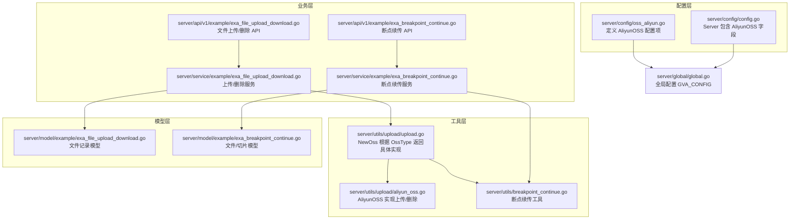
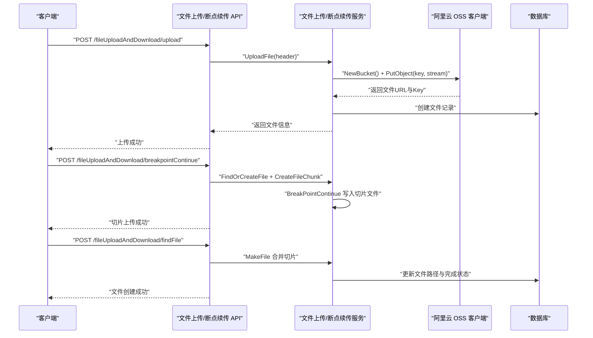
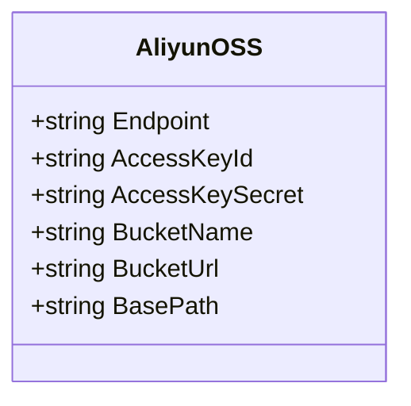
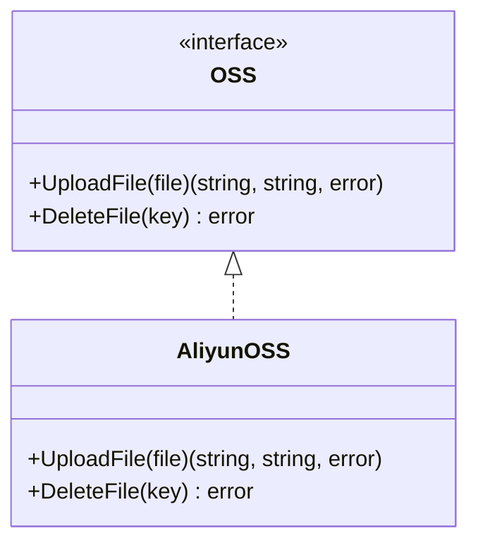
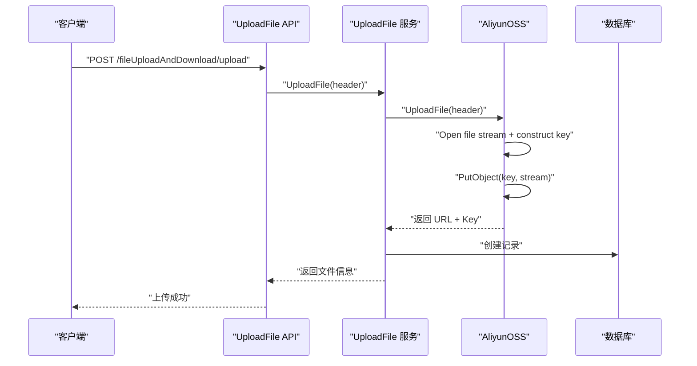
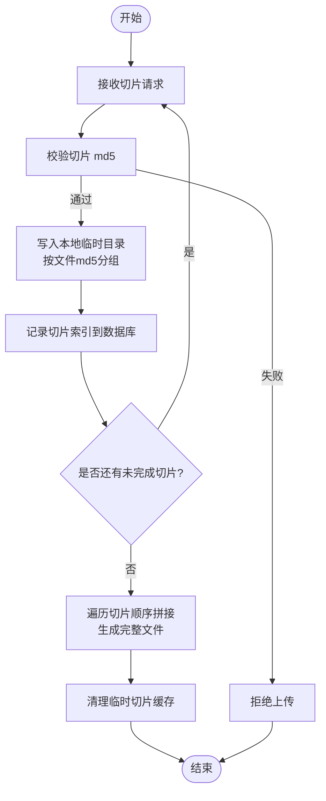
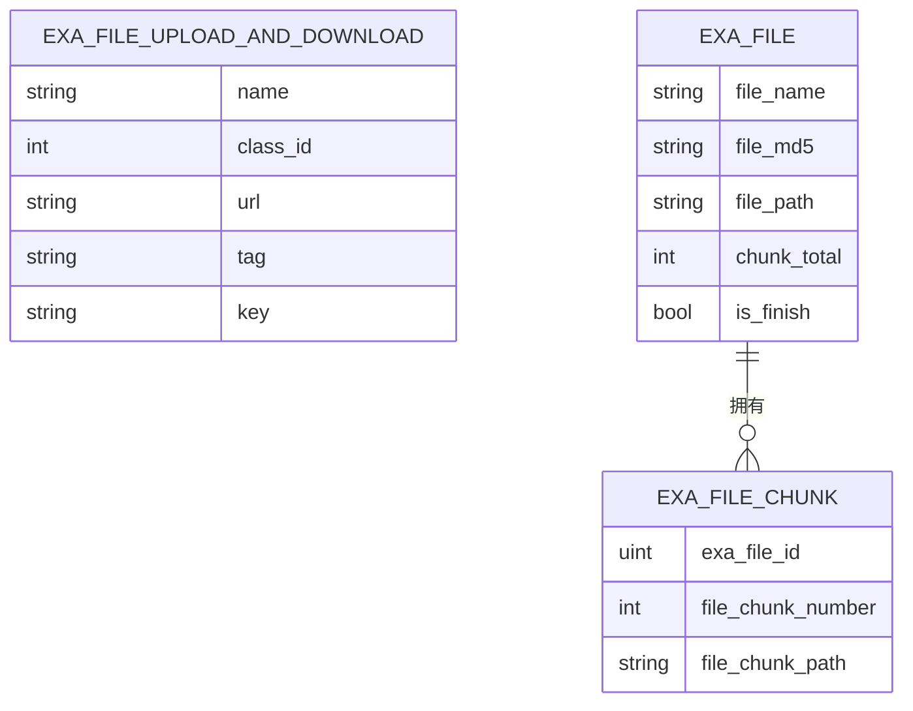
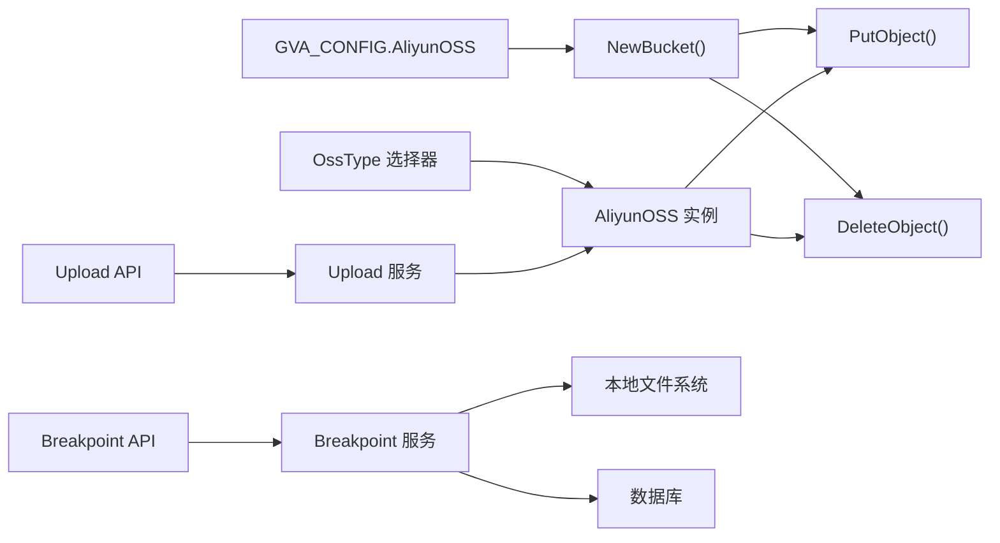

# 阿里云OSS

<cite>
**本文档引用的文件**
- [server/config/oss_aliyun.go](file://server/config/oss_aliyun.go)
- [server/utils/upload/aliyun_oss.go](file://server/utils/upload/aliyun_oss.go)
- [server/utils/upload/upload.go](file://server/utils/upload/upload.go)
- [server/api/v1/example/exa_file_upload_download.go](file://server/api/v1/example/exa_file_upload_download.go)
- [server/service/example/exa_file_upload_download.go](file://server/service/example/exa_file_upload_download.go)
- [server/model/example/exa_file_upload_download.go](file://server/model/example/exa_file_upload_download.go)
- [server/api/v1/example/exa_breakpoint_continue.go](file://server/api/v1/example/exa_breakpoint_continue.go)
- [server/service/example/exa_breakpoint_continue.go](file://server/service/example/exa_breakpoint_continue.go)
- [server/utils/breakpoint_continue.go](file://server/utils/breakpoint_continue.go)
- [server/model/example/exa_breakpoint_continue.go](file://server/model/example/exa_breakpoint_continue.go)
- [server/global/global.go](file://server/global/global.go)
- [server/config/config.go](file://server/config/config.go)
</cite>

## 目录
1. [简介](#简介)
2. [项目结构](#项目结构)
3. [核心组件](#核心组件)
4. [架构总览](#架构总览)
5. [详细组件分析](#详细组件分析)
6. [依赖分析](#依赖分析)
7. [性能考虑](#性能考虑)
8. [故障排查指南](#故障排查指南)
9. [结论](#结论)
10. [附录](#附录)

## 简介
本文件面向在 Gin-Vue-Admin 基础设施上集成阿里云 OSS 的开发者，系统性阐述以下主题：
- 阿里云 OSS 的集成配置：AccessKey 设置、Bucket 配置、Endpoint 选择
- 上传流程：普通上传、断点续传（切片上传）与文件合并
- 高级特性：CDN 加速、图片处理、生命周期管理（概念性说明）
- 使用示例：文件上传、下载、删除操作
- 安全配置与成本优化策略

注意：当前仓库实现主要覆盖“普通上传”和“断点续传”的服务端逻辑；OSS 的签名 URL 生成、CDN 加速、图片处理、生命周期管理等高级特性在本仓库中未直接实现，将在“概念性说明”部分给出实践建议。

## 项目结构
围绕 OSS 的关键模块分布如下：
- 配置层：定义阿里云 OSS 的配置项，供全局配置读取
- 工具层：OSS 接口抽象与阿里云 OSS 实现，以及断点续传工具
- 业务层：文件上传下载 API 与服务层，负责调用 OSS 并持久化元数据
- 数据模型：文件记录与断点续传记录的数据结构
- 全局与配置：全局配置对象与系统 OssType 选择器

**图表来源**
- [server/config/oss_aliyun.go:1-11](file://server/config/oss_aliyun.go#L1-L11)
- [server/config/config.go:1-41](file://server/config/config.go#L1-L41)
- [server/utils/upload/upload.go:1-47](file://server/utils/upload/upload.go#L1-L47)
- [server/utils/upload/aliyun_oss.go:1-76](file://server/utils/upload/aliyun_oss.go#L1-L76)
- [server/utils/breakpoint_continue.go:1-122](file://server/utils/breakpoint_continue.go#L1-L122)
- [server/api/v1/example/exa_file_upload_download.go:1-136](file://server/api/v1/example/exa_file_upload_download.go#L1-L136)
- [server/service/example/exa_file_upload_download.go:1-131](file://server/service/example/exa_file_upload_download.go#L1-L131)
- [server/api/v1/example/exa_breakpoint_continue.go:1-157](file://server/api/v1/example/exa_breakpoint_continue.go#L1-L157)
- [server/service/example/exa_breakpoint_continue.go:1-72](file://server/service/example/exa_breakpoint_continue.go#L1-L72)
- [server/model/example/exa_file_upload_download.go:1-19](file://server/model/example/exa_file_upload_download.go#L1-L19)
- [server/model/example/exa_breakpoint_continue.go:1-25](file://server/model/example/exa_breakpoint_continue.go#L1-L25)
- [server/global/global.go:1-69](file://server/global/global.go#L1-L69)

**章节来源**
- [server/config/oss_aliyun.go:1-11](file://server/config/oss_aliyun.go#L1-L11)
- [server/config/config.go:1-41](file://server/config/config.go#L1-L41)
- [server/utils/upload/upload.go:1-47](file://server/utils/upload/upload.go#L1-L47)
- [server/utils/upload/aliyun_oss.go:1-76](file://server/utils/upload/aliyun_oss.go#L1-L76)
- [server/utils/breakpoint_continue.go:1-122](file://server/utils/breakpoint_continue.go#L1-L122)
- [server/api/v1/example/exa_file_upload_download.go:1-136](file://server/api/v1/example/exa_file_upload_download.go#L1-L136)
- [server/service/example/exa_file_upload_download.go:1-131](file://server/service/example/exa_file_upload_download.go#L1-L131)
- [server/api/v1/example/exa_breakpoint_continue.go:1-157](file://server/api/v1/example/exa_breakpoint_continue.go#L1-L157)
- [server/service/example/exa_breakpoint_continue.go:1-72](file://server/service/example/exa_breakpoint_continue.go#L1-L72)
- [server/model/example/exa_file_upload_download.go:1-19](file://server/model/example/exa_file_upload_download.go#L1-L19)
- [server/model/example/exa_breakpoint_continue.go:1-25](file://server/model/example/exa_breakpoint_continue.go#L1-L25)
- [server/global/global.go:1-69](file://server/global/global.go#L1-L69)

## 核心组件
- 阿里云 OSS 配置结构：包含 Endpoint、AccessKeyId、AccessKeySecret、BucketName、BucketUrl、BasePath 等字段，用于连接 OSS 并生成可访问的文件 URL
- OSS 接口与实现：通过统一接口抽象，根据系统配置的 OssType 返回阿里云 OSS 实现
- 上传与删除：封装 PutObject 上传与 DeleteObject 删除，支持基于 BasePath 的目录组织
- 断点续传：前端分片上传，后端按 md5 和切片序号落盘，最终合并生成完整文件
- API 与服务：提供文件上传、删除、查询列表等接口，并在服务层协调 OSS 与数据库

**章节来源**
- [server/config/oss_aliyun.go:1-11](file://server/config/oss_aliyun.go#L1-L11)
- [server/utils/upload/upload.go:1-47](file://server/utils/upload/upload.go#L1-L47)
- [server/utils/upload/aliyun_oss.go:1-76](file://server/utils/upload/aliyun_oss.go#L1-L76)
- [server/api/v1/example/exa_file_upload_download.go:1-136](file://server/api/v1/example/exa_file_upload_download.go#L1-L136)
- [server/service/example/exa_file_upload_download.go:1-131](file://server/service/example/exa_file_upload_download.go#L1-L131)
- [server/utils/breakpoint_continue.go:1-122](file://server/utils/breakpoint_continue.go#L1-L122)
- [server/api/v1/example/exa_breakpoint_continue.go:1-157](file://server/api/v1/example/exa_breakpoint_continue.go#L1-L157)
- [server/service/example/exa_breakpoint_continue.go:1-72](file://server/service/example/exa_breakpoint_continue.go#L1-L72)

## 架构总览
下图展示从 API 到服务、再到 OSS 的调用链路，以及断点续传的文件落盘与合并流程。

**图表来源**
- [server/api/v1/example/exa_file_upload_download.go:1-136](file://server/api/v1/example/exa_file_upload_download.go#L1-L136)
- [server/service/example/exa_file_upload_download.go:1-131](file://server/service/example/exa_file_upload_download.go#L1-L131)
- [server/utils/upload/aliyun_oss.go:1-76](file://server/utils/upload/aliyun_oss.go#L1-L76)
- [server/api/v1/example/exa_breakpoint_continue.go:1-157](file://server/api/v1/example/exa_breakpoint_continue.go#L1-L157)
- [server/service/example/exa_breakpoint_continue.go:1-72](file://server/service/example/exa_breakpoint_continue.go#L1-L72)
- [server/utils/breakpoint_continue.go:1-122](file://server/utils/breakpoint_continue.go#L1-L122)

## 详细组件分析

### 配置组件：AliyunOSS
- 字段说明
  - Endpoint：OSS 访问域名
  - AccessKeyId / AccessKeySecret：访问凭证
  - BucketName：存储空间名称
  - BucketUrl：对外访问的域名前缀
  - BasePath：对象键（Key）的根目录前缀
- 作用：作为全局配置的一部分，被 OSS 客户端初始化与 URL 组装使用

**图表来源**
- [server/config/oss_aliyun.go:1-11](file://server/config/oss_aliyun.go#L1-L11)

**章节来源**
- [server/config/oss_aliyun.go:1-11](file://server/config/oss_aliyun.go#L1-L11)
- [server/config/config.go:1-41](file://server/config/config.go#L1-L41)

### OSS 接口与阿里云实现
- OSS 接口：定义 UploadFile 与 DeleteFile 两个方法
- AliyunOSS 实现：
  - UploadFile：打开 multipart 文件流，构造对象 Key（基于 BasePath + uploads + 日期 + 文件名），调用 PutObject 上传，返回可访问 URL 与 Key
  - DeleteFile：调用 DeleteObject 删除指定 Key
  - NewBucket：根据 Endpoint、AccessKeyId、AccessKeySecret 初始化 OSS 客户端并获取 Bucket

**图表来源**
- [server/utils/upload/upload.go:1-47](file://server/utils/upload/upload.go#L1-L47)
- [server/utils/upload/aliyun_oss.go:1-76](file://server/utils/upload/aliyun_oss.go#L1-L76)

**章节来源**
- [server/utils/upload/upload.go:1-47](file://server/utils/upload/upload.go#L1-L47)
- [server/utils/upload/aliyun_oss.go:1-76](file://server/utils/upload/aliyun_oss.go#L1-L76)

### 上传流程（普通上传）
- API 层：接收 multipart/form-data，解析文件头
- 服务层：调用 OSS 实例上传，生成 URL 与 Key，按需写入数据库
- OSS 层：构造对象 Key，PutObject 上传

**图表来源**
- [server/api/v1/example/exa_file_upload_download.go:1-136](file://server/api/v1/example/exa_file_upload_download.go#L1-L136)
- [server/service/example/exa_file_upload_download.go:1-131](file://server/service/example/exa_file_upload_download.go#L1-L131)
- [server/utils/upload/aliyun_oss.go:1-76](file://server/utils/upload/aliyun_oss.go#L1-L76)

**章节来源**
- [server/api/v1/example/exa_file_upload_download.go:1-136](file://server/api/v1/example/exa_file_upload_download.go#L1-L136)
- [server/service/example/exa_file_upload_download.go:1-131](file://server/service/example/exa_file_upload_download.go#L1-L131)
- [server/utils/upload/aliyun_oss.go:1-76](file://server/utils/upload/aliyun_oss.go#L1-L76)

### 断点续传（切片上传与合并）
- 前端：计算文件整体 md5 与每个切片 md5，按序上传切片
- 后端：
  - 接收切片，校验 md5
  - 在本地临时目录按 md5 分组存储切片文件
  - 记录切片索引到数据库
  - 合并阶段：遍历切片顺序拼接生成完整文件
  - 清理临时切片缓存

**图表来源**
- [server/api/v1/example/exa_breakpoint_continue.go:1-157](file://server/api/v1/example/exa_breakpoint_continue.go#L1-L157)
- [server/service/example/exa_breakpoint_continue.go:1-72](file://server/service/example/exa_breakpoint_continue.go#L1-L72)
- [server/utils/breakpoint_continue.go:1-122](file://server/utils/breakpoint_continue.go#L1-L122)

**章节来源**
- [server/api/v1/example/exa_breakpoint_continue.go:1-157](file://server/api/v1/example/exa_breakpoint_continue.go#L1-L157)
- [server/service/example/exa_breakpoint_continue.go:1-72](file://server/service/example/exa_breakpoint_continue.go#L1-L72)
- [server/utils/breakpoint_continue.go:1-122](file://server/utils/breakpoint_continue.go#L1-L122)

### 数据模型
- 文件记录模型：包含文件名、分类 ID、URL、标签、对象 Key 等字段
- 断点续传模型：文件主表与切片明细表，记录文件 md5、总切片数、完成状态与路径

**图表来源**
- [server/model/example/exa_file_upload_download.go:1-19](file://server/model/example/exa_file_upload_download.go#L1-L19)
- [server/model/example/exa_breakpoint_continue.go:1-25](file://server/model/example/exa_breakpoint_continue.go#L1-L25)

**章节来源**
- [server/model/example/exa_file_upload_download.go:1-19](file://server/model/example/exa_file_upload_download.go#L1-L19)
- [server/model/example/exa_breakpoint_continue.go:1-25](file://server/model/example/exa_breakpoint_continue.go#L1-L25)

## 依赖分析
- 配置依赖：全局配置对象包含 AliyunOSS 配置，OSS 客户端初始化与 URL 组装均依赖该配置
- 运行时选择：通过 OssType 选择器在运行时返回阿里云 OSS 实例
- 上传链路：API -> 服务 -> OSS 实现 -> OSS SDK
- 断点续传链路：API -> 服务 -> 本地文件系统 -> 数据库

**图表来源**
- [server/global/global.go:1-69](file://server/global/global.go#L1-L69)
- [server/config/config.go:1-41](file://server/config/config.go#L1-L41)
- [server/utils/upload/upload.go:1-47](file://server/utils/upload/upload.go#L1-L47)
- [server/utils/upload/aliyun_oss.go:1-76](file://server/utils/upload/aliyun_oss.go#L1-L76)
- [server/api/v1/example/exa_file_upload_download.go:1-136](file://server/api/v1/example/exa_file_upload_download.go#L1-L136)
- [server/service/example/exa_file_upload_download.go:1-131](file://server/service/example/exa_file_upload_download.go#L1-L131)
- [server/api/v1/example/exa_breakpoint_continue.go:1-157](file://server/api/v1/example/exa_breakpoint_continue.go#L1-L157)
- [server/service/example/exa_breakpoint_continue.go:1-72](file://server/service/example/exa_breakpoint_continue.go#L1-L72)

**章节来源**
- [server/global/global.go:1-69](file://server/global/global.go#L1-L69)
- [server/config/config.go:1-41](file://server/config/config.go#L1-L41)
- [server/utils/upload/upload.go:1-47](file://server/utils/upload/upload.go#L1-L47)
- [server/utils/upload/aliyun_oss.go:1-76](file://server/utils/upload/aliyun_oss.go#L1-L76)
- [server/api/v1/example/exa_file_upload_download.go:1-136](file://server/api/v1/example/exa_file_upload_download.go#L1-L136)
- [server/service/example/exa_file_upload_download.go:1-131](file://server/service/example/exa_file_upload_download.go#L1-L131)
- [server/api/v1/example/exa_breakpoint_continue.go:1-157](file://server/api/v1/example/exa_breakpoint_continue.go#L1-L157)
- [server/service/example/exa_breakpoint_continue.go:1-72](file://server/service/example/exa_breakpoint_continue.go#L1-L72)

## 性能考虑
- 上传性能
  - 大文件优先采用断点续传，减少网络波动导致的重传成本
  - 合理设置切片大小，避免过小造成过多请求开销
- 存储性能
  - 使用合适的存储类型（标准/低频/归档），结合访问频率优化成本
  - 启用 CDN 加速可显著提升静态资源访问速度
- 并发控制
  - 服务端并发上传场景下，建议对同一文件 md5 的并发写入进行串行化，避免竞态
- 日志与监控
  - 对 PutObject/DeleteObject 的错误进行分级日志记录，便于定位性能瓶颈

## 故障排查指南
- 常见错误与定位
  - 初始化失败：检查 Endpoint、AccessKeyId、AccessKeySecret 是否正确
  - 上传失败：确认 BucketName 与权限策略，检查对象 Key 是否包含非法字符
  - 删除失败：确认 Key 是否完整，是否存在同名文件夹未清空
  - 断点续传失败：核对前端传来的 md5 与后端计算值是否一致；检查本地临时目录权限
- 建议排查步骤
  - 打印全局配置的关键字段，确认加载顺序与值
  - 在服务层捕获 OSS SDK 返回的错误，输出到日志
  - 对于断点续传，打印切片序号与目标路径，确保顺序拼接正确

**章节来源**
- [server/utils/upload/aliyun_oss.go:1-76](file://server/utils/upload/aliyun_oss.go#L1-L76)
- [server/utils/breakpoint_continue.go:1-122](file://server/utils/breakpoint_continue.go#L1-L122)

## 结论
本仓库提供了完整的阿里云 OSS 集成方案，覆盖普通上传与断点续传两大场景。通过统一的 OSS 接口抽象，系统可在不同存储后端间灵活切换。对于签名 URL、CDN 加速、图片处理与生命周期管理等高级特性，可在现有架构基础上扩展实现，以满足更复杂的业务需求。

## 附录

### 阿里云 OSS 集成配置清单
- 必填项
  - Endpoint：OSS 访问域名
  - AccessKeyId / AccessKeySecret：访问凭证
  - BucketName：存储空间名称
  - BucketUrl：对外访问域名前缀
  - BasePath：对象 Key 的根目录前缀
- 作用范围
  - 用于初始化 OSS 客户端与生成可访问 URL

**章节来源**
- [server/config/oss_aliyun.go:1-11](file://server/config/oss_aliyun.go#L1-L11)
- [server/config/config.go:1-41](file://server/config/config.go#L1-L41)

### 使用示例（基于现有实现）
- 上传文件
  - 调用接口：POST /fileUploadAndDownload/upload
  - 参数：multipart/form-data，包含 file 字段
  - 返回：文件 URL 与 Key
- 删除文件
  - 调用接口：POST /fileUploadAndDownload/deleteFile
  - 参数：文件记录 ID
  - 行为：调用 OSS 删除指定 Key，并清理数据库记录
- 断点续传
  - 分片上传：POST /fileUploadAndDownload/breakpointContinue
  - 合并文件：GET /fileUploadAndDownload/findFile
  - 清理缓存：POST /fileUploadAndDownload/removeChunk

**章节来源**
- [server/api/v1/example/exa_file_upload_download.go:1-136](file://server/api/v1/example/exa_file_upload_download.go#L1-L136)
- [server/service/example/exa_file_upload_download.go:1-131](file://server/service/example/exa_file_upload_download.go#L1-L131)
- [server/api/v1/example/exa_breakpoint_continue.go:1-157](file://server/api/v1/example/exa_breakpoint_continue.go#L1-L157)
- [server/service/example/exa_breakpoint_continue.go:1-72](file://server/service/example/exa_breakpoint_continue.go#L1-L72)

### 高级特性（概念性说明）
- 签名 URL 生成
  - 建议在服务层新增签名接口，使用 OSS SDK 生成带过期时间的私有链接，用于前端直传或限时访问
- CDN 加速
  - 在 OSS 控制台绑定 CDN 域名，将 BucketUrl 指向 CDN 域名，提升全球访问速度
- 图片处理
  - 使用 OSS 图片处理样式参数，在 URL 后附加处理指令，实现缩放、裁剪、水印等
- 生命周期管理
  - 配置规则自动将旧版本对象或临时文件迁移至低频/归档，降低长期存储成本

[本节为概念性说明，无需源码引用]

### 安全配置与成本优化策略
- 安全
  - 最小权限原则：为 AccessKey 配置只读/写入最小范围的 Bucket 权限
  - 使用 RAM 角色与子账号，定期轮换密钥
  - 限制 Bucket 访问来源，启用 IP 白名单
- 成本
  - 根据访问模式选择合适存储类型（标准/低频/归档）
  - 启用生命周期规则，自动清理临时文件与旧版本
  - 使用 CDN 缓存热点资源，减少回源次数

[本节为通用实践建议，无需源码引用]