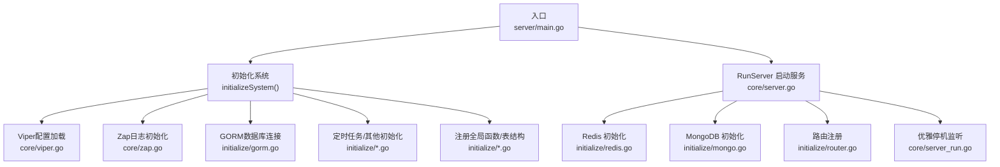
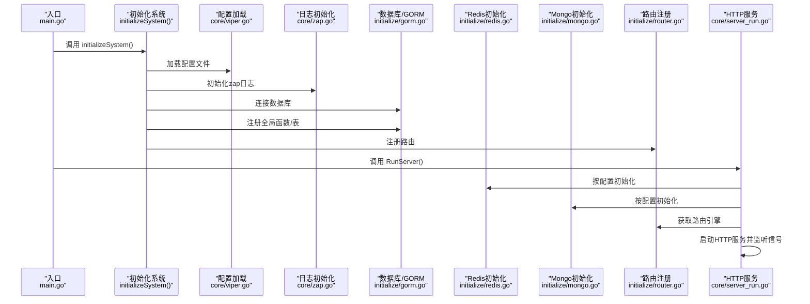
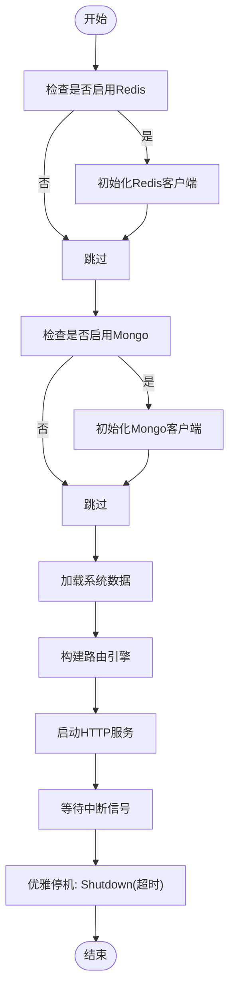
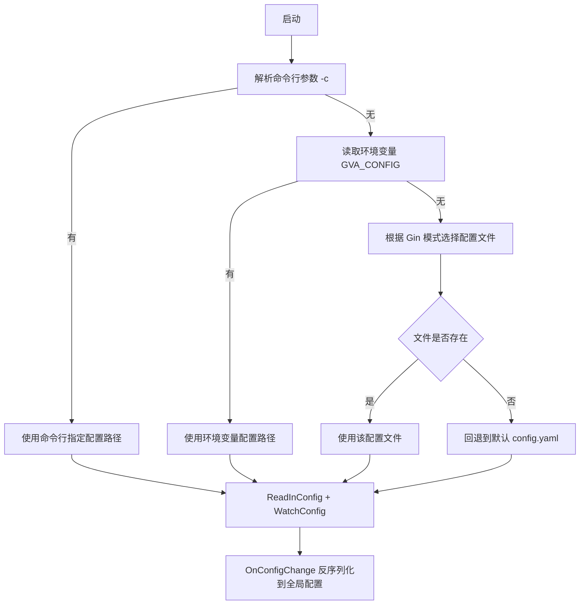
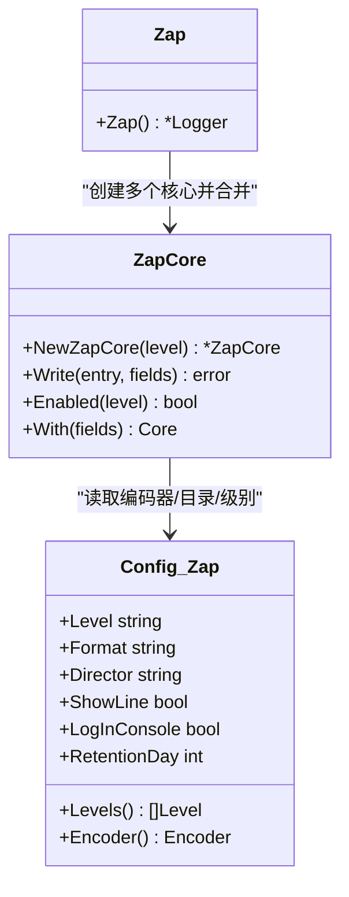
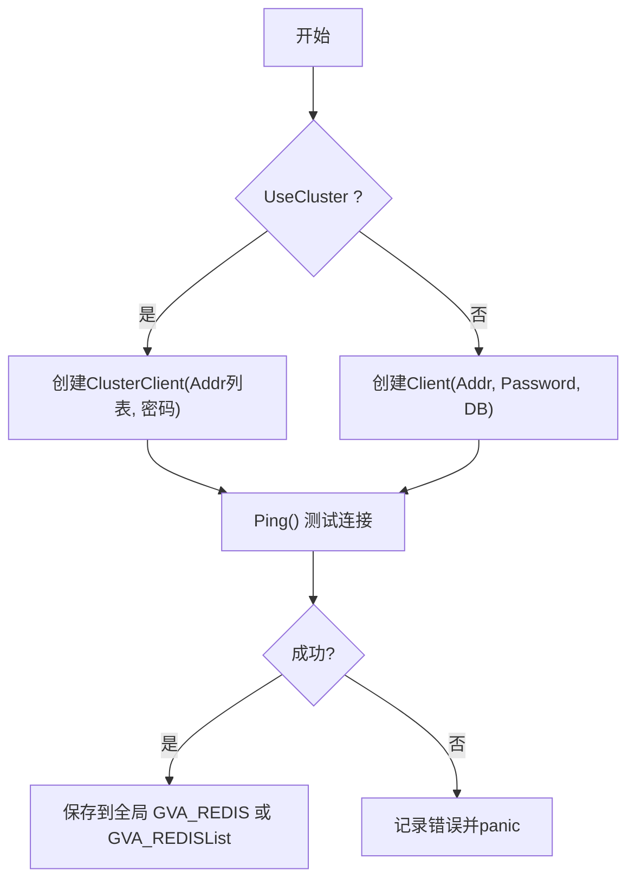
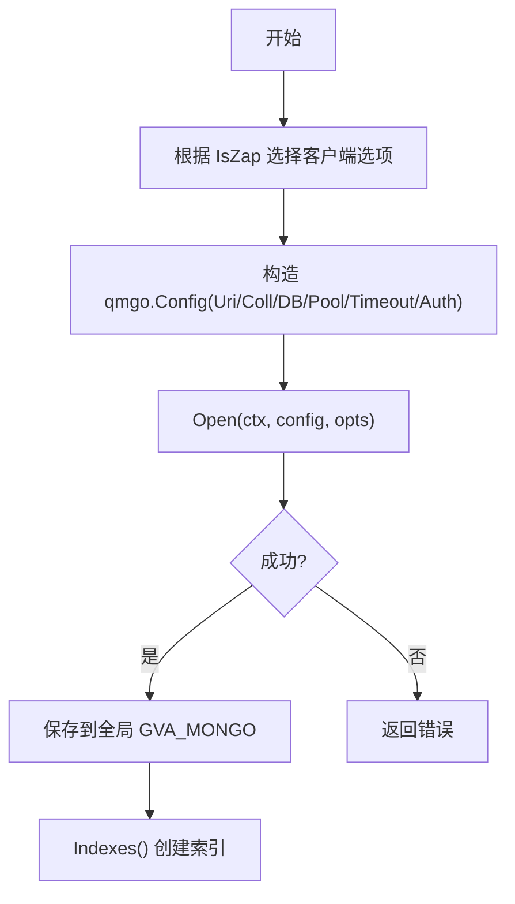
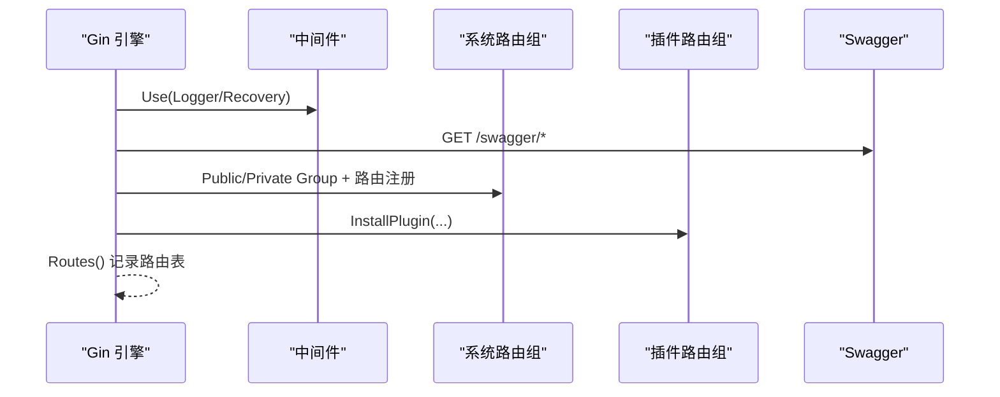
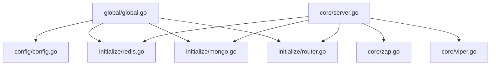
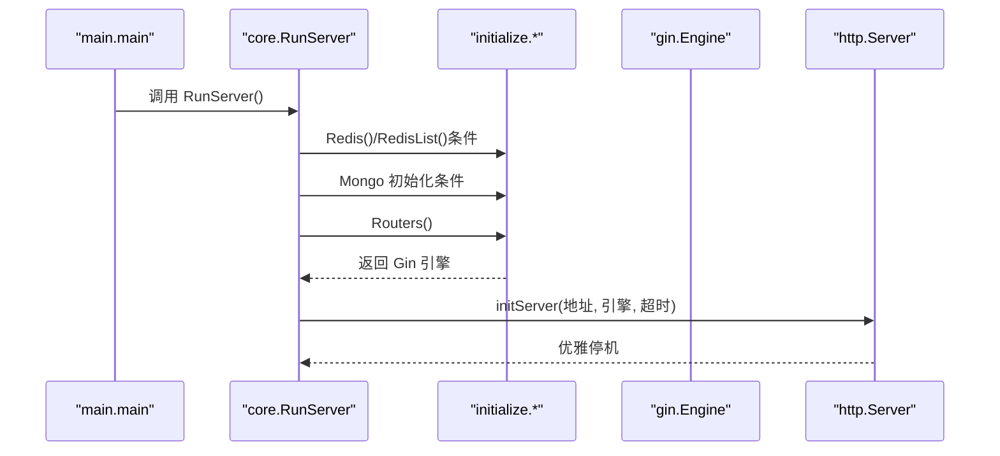

# 核心服务

<cite>
**本文引用的文件**
- [server/main.go](file://server/main.go)
- [core/server.go](file://core/server.go)
- [core/server_run.go](file://core/server_run.go)
- [core/viper.go](file://core/viper.go)
- [core/zap.go](file://core/zap.go)
- [core/internal/constant.go](file://core/internal/constant.go)
- [core/internal/zap_core.go](file://core/internal/zap_core.go)
- [initialize/router.go](file://initialize/router.go)
- [initialize/redis.go](file://initialize/redis.go)
- [initialize/mongo.go](file://initialize/mongo.go)
- [global/global.go](file://global/global.go)
- [config/config.go](file://config/config.go)
- [config/zap.go](file://config/zap.go)
- [config/mongo.go](file://config/mongo.go)
- [config/redis.go](file://config/redis.go)
- [config.yaml](file://config.yaml)
</cite>

## 目录
1. [简介](#简介)
2. [项目结构](#项目结构)
3. [核心组件](#核心组件)
4. [架构总览](#架构总览)
5. [详细组件分析](#详细组件分析)
6. [依赖分析](#依赖分析)
7. [性能考虑](#性能考虑)
8. [故障排查指南](#故障排查指南)
9. [结论](#结论)
10. [附录](#附录)

## 简介
本文件面向测试管理平台的核心服务，聚焦以下主题：
- 服务器启动流程与优雅停机
- 配置管理系统（Viper）的加载、优先级与热更新
- 日志记录系统（Zap）的配置、多核输出与错误入库
- RunServer 函数工作机制：Redis 初始化、MongoDB 连接、路由注册等关键步骤
- 提供可操作的配置示例与扩展建议，帮助开发者快速理解与二次开发

## 项目结构
核心服务位于 server 目录，采用“入口 -> 初始化 -> 核心运行”的分层组织方式：
- 入口程序负责系统初始化与启动
- 初始化模块负责各外部组件（Redis、Mongo、GORM、定时任务、路由等）的装配
- 核心模块负责服务器运行与优雅停机
- 配置模块提供结构化配置模型与解析
- 日志模块提供多级编码器、落盘切割与错误入库能力

图表来源
- [server/main.go:30-52](file://server/main.go#L30-L52)
- [core/server.go:14-48](file://core/server.go#L14-L48)
- [core/server_run.go:21-60](file://core/server_run.go#L21-L60)
- [core/viper.go:17-42](file://core/viper.go#L17-L42)
- [core/zap.go:15-36](file://core/zap.go#L15-L36)
- [initialize/router.go:36-117](file://initialize/router.go#L36-L117)
- [initialize/redis.go:39-60](file://initialize/redis.go#L39-L60)
- [initialize/mongo.go:42-75](file://initialize/mongo.go#L42-L75)

章节来源
- [server/main.go:30-52](file://server/main.go#L30-L52)
- [core/server.go:14-48](file://core/server.go#L14-L48)

## 核心组件
- 服务器启动与优雅停机：通过 HTTP Server 包装与信号监听实现
- 配置管理：Viper 加载 YAML，支持命令行、环境变量与默认文件，支持变更热更新
- 日志系统：多核心 Tee 输出，支持控制台与文件落盘、行号与堆栈、错误入库
- 外部依赖初始化：Redis（单实例/集群）、MongoDB（连接、认证、索引）
- 路由注册：基于 Gin 的系统路由与插件路由组合

章节来源
- [core/server_run.go:21-60](file://core/server_run.go#L21-L60)
- [core/viper.go:17-77](file://core/viper.go#L17-L77)
- [core/zap.go:15-36](file://core/zap.go#L15-L36)
- [core/internal/zap_core.go:23-134](file://core/internal/zap_core.go#L23-L134)
- [initialize/redis.go:39-60](file://initialize/redis.go#L39-L60)
- [initialize/mongo.go:42-75](file://initialize/mongo.go#L42-L75)
- [initialize/router.go:36-117](file://initialize/router.go#L36-L117)

## 架构总览
下图展示核心服务启动的关键交互：入口程序调用初始化，随后进入 RunServer，按配置启用 Redis/Mongo，注册路由并启动 HTTP 服务，最后等待信号进行优雅停机。

图表来源
- [server/main.go:30-52](file://server/main.go#L30-L52)
- [core/server.go:14-48](file://core/server.go#L14-L48)
- [core/server_run.go:21-60](file://core/server_run.go#L21-L60)
- [initialize/router.go:36-117](file://initialize/router.go#L36-L117)
- [initialize/redis.go:39-60](file://initialize/redis.go#L39-L60)
- [initialize/mongo.go:42-75](file://initialize/mongo.go#L42-L75)

## 详细组件分析

### 服务器启动流程与优雅停机（RunServer 与 initServer）
- RunServer 负责根据配置决定是否初始化 Redis/Mongo，加载系统数据，注册路由并启动 HTTP 服务
- initServer 创建 http.Server，启动 goroutine 监听 ListenAndServe；捕获 SIGINT/SIGTERM 实现优雅停机；设置超时并调用 Shutdown

图表来源
- [core/server.go:14-48](file://core/server.go#L14-L48)
- [core/server_run.go:21-60](file://core/server_run.go#L21-L60)

章节来源
- [core/server.go:14-48](file://core/server.go#L14-L48)
- [core/server_run.go:21-60](file://core/server_run.go#L21-L60)

### 配置管理系统（Viper）
- 配置文件优先级：命令行参数 -c > 环境变量 GVA_CONFIG > 根据 Gin 模式选择 debug/release/test 对应文件 > 默认 config.yaml
- 加载后启用 WatchConfig 并注册 OnConfigChange 回调，变更时重新反序列化到全局配置对象
- 根路径适配：通过绝对路径修正 AutoCode.Root，保证迁移路径有效

图表来源
- [core/viper.go:17-77](file://core/viper.go#L17-L77)
- [core/internal/constant.go:3-9](file://core/internal/constant.go#L3-L9)

章节来源
- [core/viper.go:17-77](file://core/viper.go#L17-L77)
- [core/internal/constant.go:3-9](file://core/internal/constant.go#L3-L9)
- [config.yaml:1-284](file://config.yaml#L1-L284)

### 日志记录系统（Zap）
- Zap() 根据配置创建多核心（Levels），每个级别一个核心，使用 tee 合并输出
- 支持控制台与文件落盘，按级别与日期切割；可选显示行号与堆栈
- 内部核心（ZapCore）在 Error 及以上级别时，将错误信息与调用栈入库（SysErrorService），避免与 GORM 日志写入递归

图表来源
- [core/zap.go:15-36](file://core/zap.go#L15-L36)
- [core/internal/zap_core.go:23-134](file://core/internal/zap_core.go#L23-L134)
- [config/zap.go:8-72](file://config/zap.go#L8-L72)

章节来源
- [core/zap.go:15-36](file://core/zap.go#L15-L36)
- [core/internal/zap_core.go:23-134](file://core/internal/zap_core.go#L23-L134)
- [config/zap.go:8-72](file://config/zap.go#L8-L72)

### Redis 初始化
- 支持单实例与集群两种模式，通过 UseCluster 切换
- Ping 成功后记录日志并写入全局客户端；支持多 Redis 实例（RedisList）

图表来源
- [initialize/redis.go:13-60](file://initialize/redis.go#L13-L60)
- [config/redis.go:3-11](file://config/redis.go#L3-L11)

章节来源
- [initialize/redis.go:13-60](file://initialize/redis.go#L13-L60)
- [config/redis.go:3-11](file://config/redis.go#L3-L11)

### MongoDB 初始化
- 依据配置构造 qmgo.Config，支持用户名/密码/认证库、连接与Socket超时、最小/最大连接池
- 可选启用内部 Mongo 日志选项；连接成功后可创建索引
- 提供索引创建工具方法，避免重复索引

图表来源
- [initialize/mongo.go:42-75](file://initialize/mongo.go#L42-L75)
- [config/mongo.go:8-42](file://config/mongo.go#L8-L42)

章节来源
- [initialize/mongo.go:42-75](file://initialize/mongo.go#L42-L75)
- [config/mongo.go:8-42](file://config/mongo.go#L8-L42)

### 路由注册
- 基于 Gin.New() 创建引擎，按需启用 Logger 与 Recovery 中间件
- 注册 Swagger 文档、静态资源、健康检查、系统路由与插件路由
- 统一前缀由配置项 RouterPrefix 控制，便于多服务部署

图表来源
- [initialize/router.go:36-117](file://initialize/router.go#L36-L117)

章节来源
- [initialize/router.go:36-117](file://initialize/router.go#L36-L117)

### RunServer 关键步骤详解
- 条件初始化 Redis：若启用 UseRedis，则初始化单实例或 RedisList
- 条件初始化 Mongo：若启用 UseMongo，则执行初始化并处理错误
- 系统数据加载：当存在主数据库连接时，加载系统常量与配置
- 路由构建与启动：构建路由引擎，打印服务信息，启动 HTTP 服务并进入优雅停机循环

章节来源
- [core/server.go:14-48](file://core/server.go#L14-L48)

## 依赖分析
- 全局状态：通过 global 包暴露数据库、Redis、Mongo、配置、日志、定时器等全局对象
- 配置模型：config 包提供 Server 结构体及其子结构（Zap、Redis、Mongo、DB 等）
- 初始化模块：initialize 负责各外部组件的连接与注册
- 核心模块：core 负责服务器运行与配置、日志初始化

图表来源
- [global/global.go:25-42](file://global/global.go#L25-L42)
- [config/config.go:3-41](file://config/config.go#L3-L41)
- [core/server.go:14-48](file://core/server.go#L14-L48)
- [initialize/redis.go:39-60](file://initialize/redis.go#L39-L60)
- [initialize/mongo.go:42-75](file://initialize/mongo.go#L42-L75)
- [initialize/router.go:36-117](file://initialize/router.go#L36-L117)
- [core/zap.go:15-36](file://core/zap.go#L15-L36)
- [core/viper.go:17-42](file://core/viper.go#L17-L42)

章节来源
- [global/global.go:25-42](file://global/global.go#L25-L42)
- [config/config.go:3-41](file://config/config.go#L3-L41)

## 性能考虑
- Redis
  - 集群模式适合高并发与水平扩展；单实例模式简单易用
  - 合理设置 DB 与密码，避免跨库误用
- MongoDB
  - 连接池大小与超时需结合业务峰值与网络状况调整
  - 索引创建遵循查询模式，避免冗余索引导致写入性能下降
- 日志
  - 多核心 Tee 输出会带来一定开销，建议仅在调试阶段启用多级别输出
  - 控制台输出与文件落盘同时开启时，注意磁盘 IO 与切割策略
- 路由
  - 生产环境建议关闭 Debug 模式的 Gin Logger，减少额外开销
  - 合理划分 Public/Private Group，避免不必要的鉴权开销

## 故障排查指南
- 启动失败
  - 检查配置文件路径与权限；确认命令行参数 -c 与环境变量 GVA_CONFIG 是否正确
  - 查看日志中 server启动失败 的错误信息，定位具体组件初始化问题
- Redis 连接失败
  - 核对 Addr/Password/DB 或集群 Addrs 列表
  - 使用 PING 验证连通性，查看日志中的 ping response 与错误
- MongoDB 连接失败
  - 校验 Uri、用户名/密码、认证库与数据库名
  - 检查连接/Socket 超时配置与网络策略
- 日志入库异常
  - 确认 SysErrorService 可用且数据库连接正常
  - 检查错误字段提取逻辑与调用栈解析是否触发递归

章节来源
- [core/server_run.go:34-38](file://core/server_run.go#L34-L38)
- [initialize/redis.go:29-36](file://initialize/redis.go#L29-L36)
- [initialize/mongo.go:64-68](file://initialize/mongo.go#L64-L68)
- [core/internal/zap_core.go:74-127](file://core/internal/zap_core.go#L74-L127)

## 结论
本核心服务通过清晰的分层设计与完善的初始化流程，实现了配置驱动、可扩展的服务器启动与运行。借助 Viper 的灵活配置与 Zap 的高性能日志体系，以及对 Redis/Mongo 的标准化接入，开发者可以快速搭建稳定可靠的测试管理平台后端服务。建议在生产环境中：
- 明确配置来源与覆盖顺序，避免误用默认配置
- 合理设置日志级别与输出策略，平衡可观测性与性能
- 对 Redis/Mongo 进行容量与超时评估，保障高并发稳定性

## 附录

### RunServer 工作流（代码级）

图表来源
- [server/main.go:30-35](file://server/main.go#L30-L35)
- [core/server.go:14-48](file://core/server.go#L14-L48)
- [core/server_run.go:21-60](file://core/server_run.go#L21-L60)
- [initialize/router.go:36-117](file://initialize/router.go#L36-L117)

### 配置示例（节选）
- 配置文件位置与优先级：命令行 -c > 环境变量 GVA_CONFIG > 模式文件 > 默认 config.yaml
- 示例字段（摘自 config.yaml）：
  - jwt.signing-key、jwt.expires-time、jwt.buffer-time、jwt.issuer
  - zap.level、zap.format、zap.director、zap.show-line、zap.encode-level、zap.log-in-console、zap.retention-day
  - redis.useCluster、redis.addr、redis.password、redis.db、redis.clusterAddrs
  - mongo.coll、mongo.database、mongo.username、mongo.password、mongo.auth-source、mongo.min-pool-size、mongo.max-pool-size、mongo.socket-timeout-ms、mongo.connect-timeout-ms、mongo.is-zap、mongo.hosts
  - system.env、system.addr、system.db-type、system.use-redis、system.use-mongo、system.router-prefix

章节来源
- [core/viper.go:44-77](file://core/viper.go#L44-L77)
- [config.yaml:1-284](file://config.yaml#L1-L284)