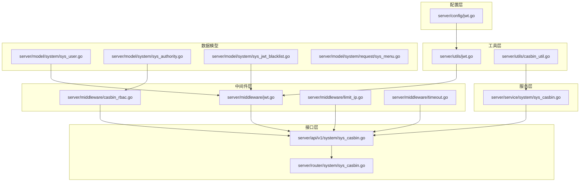
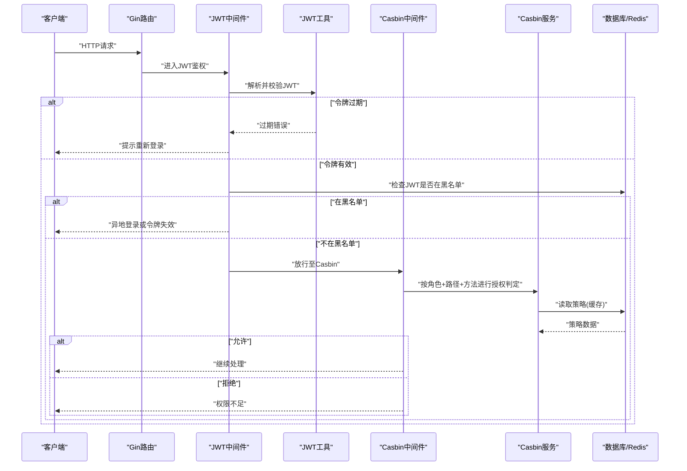
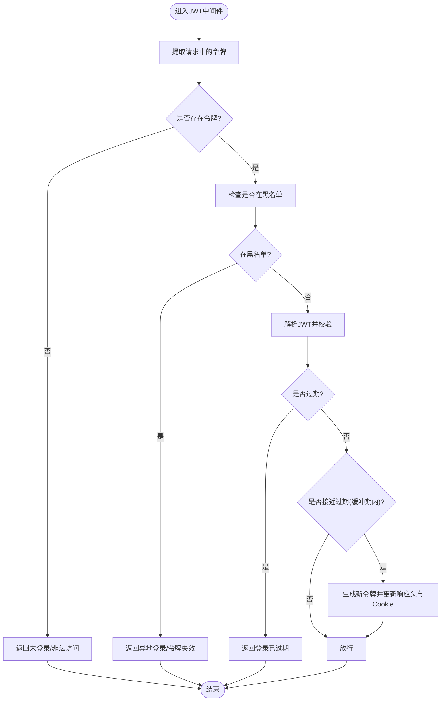
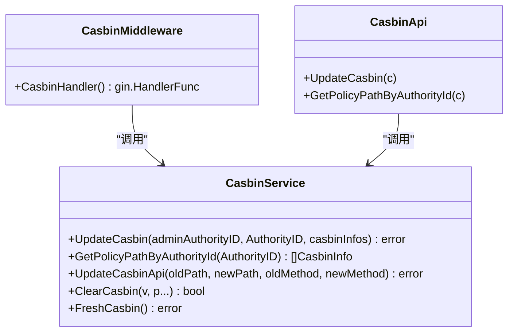
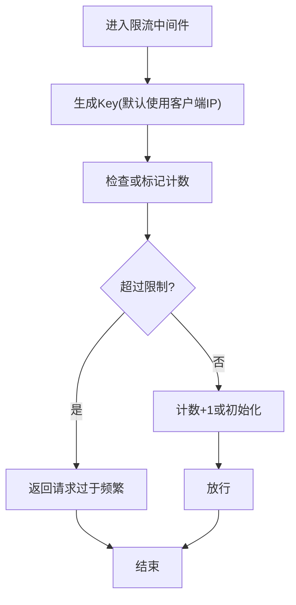
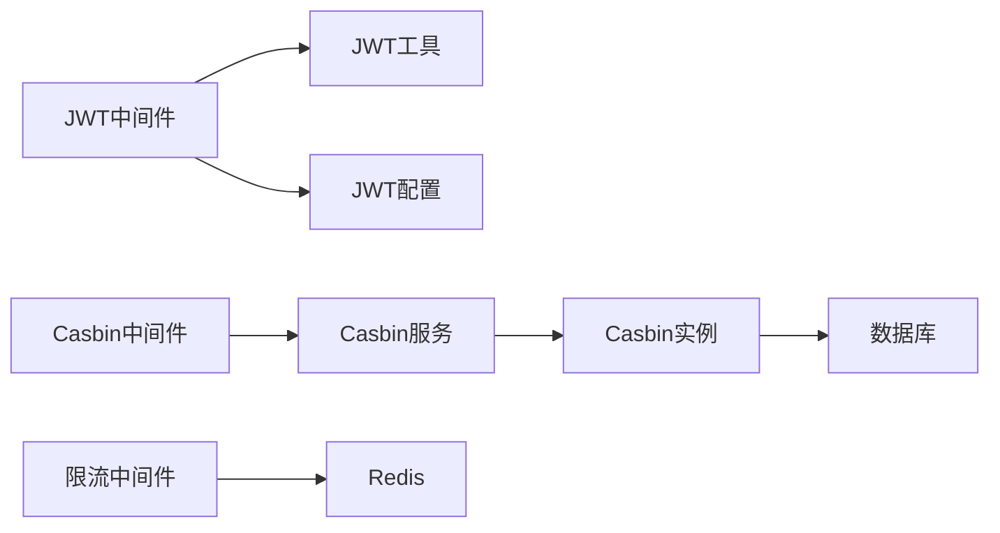

# 安全权限

<cite>
**本文引用的文件**
- [server/config/jwt.go](file://server/config/jwt.go)
- [server/middleware/jwt.go](file://server/middleware/jwt.go)
- [server/utils/jwt.go](file://server/utils/jwt.go)
- [server/model/system/sys_user.go](file://server/model/system/sys_user.go)
- [server/model/system/sys_authority.go](file://server/model/system/sys_authority.go)
- [server/middleware/casbin_rbac.go](file://server/middleware/casbin_rbac.go)
- [server/service/system/sys_casbin.go](file://server/service/system/sys_casbin.go)
- [server/router/system/sys_casbin.go](file://server/router/system/sys_casbin.go)
- [server/api/v1/system/sys_casbin.go](file://server/api/v1/system/sys_casbin.go)
- [server/utils/casbin_util.go](file://server/utils/casbin_util.go)
- [server/model/system/sys_jwt_blacklist.go](file://server/model/system/sys_jwt_blacklist.go)
- [server/middleware/limit_ip.go](file://server/middleware/limit_ip.go)
- [server/middleware/timeout.go](file://server/middleware/timeout.go)
- [server/model/system/request/sys_menu.go](file://server/model/system/request/sys_menu.go)
</cite>

## 目录
1. [简介](#简介)
2. [项目结构](#项目结构)
3. [核心组件](#核心组件)
4. [架构总览](#架构总览)
5. [详细组件分析](#详细组件分析)
6. [依赖分析](#依赖分析)
7. [性能考虑](#性能考虑)
8. [故障排查指南](#故障排查指南)
9. [结论](#结论)
10. [附录](#附录)

## 简介
本文件面向测试管理平台的安全权限体系，围绕“基于JWT的认证与令牌管理”和“基于Casbin的RBAC权限控制”两大核心能力，系统阐述以下内容：
- 用户认证流程、令牌生命周期与会话控制
- 权限控制的粒度设计：菜单权限、按钮权限、API权限
- 多点登录限制、IP限制与超时控制等安全策略
- 安全配置最佳实践与常见问题防护
- 权限模型设计原理与扩展方法

## 项目结构
安全权限相关代码主要分布在以下模块：
- 配置层：JWT签名密钥、过期时间、缓冲时间、签发者等
- 中间件层：JWT鉴权、Casbin RBAC拦截、IP频率限制、超时控制
- 工具层：JWT工具、Casbin实例初始化与缓存
- 服务层：Casbin策略更新、策略查询、策略同步
- 接口层：Casbin权限更新与查询API
- 数据模型：用户、角色、JWT黑名单、菜单权限等

**图表来源**
- [server/config/jwt.go:1-9](file://server/config/jwt.go#L1-L9)
- [server/middleware/jwt.go:1-90](file://server/middleware/jwt.go#L1-L90)
- [server/middleware/casbin_rbac.go:1-33](file://server/middleware/casbin_rbac.go#L1-L33)
- [server/middleware/limit_ip.go:1-93](file://server/middleware/limit_ip.go#L1-L93)
- [server/middleware/timeout.go:1-56](file://server/middleware/timeout.go#L1-L56)
- [server/utils/jwt.go:1-106](file://server/utils/jwt.go#L1-L106)
- [server/utils/casbin_util.go:1-53](file://server/utils/casbin_util.go#L1-L53)
- [server/service/system/sys_casbin.go:1-216](file://server/service/system/sys_casbin.go#L1-L216)
- [server/api/v1/system/sys_casbin.go:1-70](file://server/api/v1/system/sys_casbin.go#L1-L70)
- [server/router/system/sys_casbin.go:1-20](file://server/router/system/sys_casbin.go#L1-L20)
- [server/model/system/sys_user.go:1-63](file://server/model/system/sys_user.go#L1-L63)
- [server/model/system/sys_authority.go:1-24](file://server/model/system/sys_authority.go#L1-L24)
- [server/model/system/sys_jwt_blacklist.go:1-11](file://server/model/system/sys_jwt_blacklist.go#L1-L11)
- [server/model/system/request/sys_menu.go:1-34](file://server/model/system/request/sys_menu.go#L1-L34)

**章节来源**
- [server/config/jwt.go:1-9](file://server/config/jwt.go#L1-L9)
- [server/middleware/jwt.go:1-90](file://server/middleware/jwt.go#L1-L90)
- [server/middleware/casbin_rbac.go:1-33](file://server/middleware/casbin_rbac.go#L1-L33)
- [server/middleware/limit_ip.go:1-93](file://server/middleware/limit_ip.go#L1-L93)
- [server/middleware/timeout.go:1-56](file://server/middleware/timeout.go#L1-L56)
- [server/utils/jwt.go:1-106](file://server/utils/jwt.go#L1-L106)
- [server/utils/casbin_util.go:1-53](file://server/utils/casbin_util.go#L1-L53)
- [server/service/system/sys_casbin.go:1-216](file://server/service/system/sys_casbin.go#L1-L216)
- [server/api/v1/system/sys_casbin.go:1-70](file://server/api/v1/system/sys_casbin.go#L1-L70)
- [server/router/system/sys_casbin.go:1-20](file://server/router/system/sys_casbin.go#L1-L20)
- [server/model/system/sys_user.go:1-63](file://server/model/system/sys_user.go#L1-L63)
- [server/model/system/sys_authority.go:1-24](file://server/model/system/sys_authority.go#L1-L24)
- [server/model/system/sys_jwt_blacklist.go:1-11](file://server/model/system/sys_jwt_blacklist.go#L1-L11)
- [server/model/system/request/sys_menu.go:1-34](file://server/model/system/request/sys_menu.go#L1-L34)

## 核心组件
- JWT认证与令牌管理
  - 配置项：签名密钥、过期时间、缓冲时间、签发者
  - 工具：创建、解析、续期、并发保护
  - 中间件：鉴权、黑名单校验、多点登录记录
- Casbin RBAC权限控制
  - 模型定义：sub(obj)->p(策略)->g(角色关系)->m(匹配器)
  - 服务：批量策略写入、按角色查询、API变更联动、策略同步
  - 中间件：统一鉴权拦截
- 安全策略
  - IP频率限制：周期内请求次数限制
  - 超时控制：请求超时保护
  - 会话控制：JWT黑名单、异地登录检测

**章节来源**
- [server/config/jwt.go:1-9](file://server/config/jwt.go#L1-L9)
- [server/utils/jwt.go:1-106](file://server/utils/jwt.go#L1-L106)
- [server/middleware/jwt.go:1-90](file://server/middleware/jwt.go#L1-L90)
- [server/utils/casbin_util.go:1-53](file://server/utils/casbin_util.go#L1-L53)
- [server/service/system/sys_casbin.go:1-216](file://server/service/system/sys_casbin.go#L1-L216)
- [server/middleware/casbin_rbac.go:1-33](file://server/middleware/casbin_rbac.go#L1-L33)
- [server/middleware/limit_ip.go:1-93](file://server/middleware/limit_ip.go#L1-L93)
- [server/middleware/timeout.go:1-56](file://server/middleware/timeout.go#L1-L56)

## 架构总览
下图展示了从客户端请求到权限判定与响应的总体流程，以及各组件之间的交互关系。

**图表来源**
- [server/middleware/jwt.go:1-90](file://server/middleware/jwt.go#L1-L90)
- [server/utils/jwt.go:1-106](file://server/utils/jwt.go#L1-L106)
- [server/middleware/casbin_rbac.go:1-33](file://server/middleware/casbin_rbac.go#L1-L33)
- [server/service/system/sys_casbin.go:1-216](file://server/service/system/sys_casbin.go#L1-L216)
- [server/utils/casbin_util.go:1-53](file://server/utils/casbin_util.go#L1-L53)

## 详细组件分析

### JWT认证与令牌管理
- 配置项
  - 签名密钥：用于JWT签名与验证
  - 过期时间：令牌有效期
  - 缓冲时间：临近过期自动续期阈值
  - 签发者：发行方标识
- 令牌生命周期
  - 创建：使用HS256签名，包含受众、生效时间、过期时间、签发者等注册声明
  - 解析：校验签名与有效期；区分过期、格式错误、签名无效等场景
  - 续期：当剩余有效期小于缓冲时间时，生成新令牌并下发新头部与Cookie
- 会话控制
  - 黑名单：支持将失效令牌加入黑名单，拦截后续请求
  - 多点登录：可选记录当前活跃JWT，实现互斥登录或踢出策略
  - 清理：过期或异常时清除令牌

**图表来源**
- [server/middleware/jwt.go:1-90](file://server/middleware/jwt.go#L1-L90)
- [server/utils/jwt.go:1-106](file://server/utils/jwt.go#L1-L106)

**章节来源**
- [server/config/jwt.go:1-9](file://server/config/jwt.go#L1-L9)
- [server/utils/jwt.go:1-106](file://server/utils/jwt.go#L1-L106)
- [server/middleware/jwt.go:1-90](file://server/middleware/jwt.go#L1-L90)
- [server/model/system/sys_jwt_blacklist.go:1-11](file://server/model/system/sys_jwt_blacklist.go#L1-L11)

### Casbin RBAC权限控制
- 权限模型
  - 请求主体(sub)：角色ID
  - 资源(obj)：去除路由前缀后的路径
  - 行为(act)：HTTP方法
  - 匹配器：使用路径匹配规则对资源进行模式匹配
- 策略存储
  - 使用GORM适配器将策略持久化到数据库
  - 提供缓存增强，减少数据库压力
- 接口与中间件
  - 中间件统一拦截，按角色+路径+方法进行授权判定
  - API提供策略更新与查询能力，支持严格模式校验

**图表来源**
- [server/service/system/sys_casbin.go:1-216](file://server/service/system/sys_casbin.go#L1-L216)
- [server/api/v1/system/sys_casbin.go:1-70](file://server/api/v1/system/sys_casbin.go#L1-L70)
- [server/middleware/casbin_rbac.go:1-33](file://server/middleware/casbin_rbac.go#L1-L33)

**章节来源**
- [server/utils/casbin_util.go:1-53](file://server/utils/casbin_util.go#L1-L53)
- [server/service/system/sys_casbin.go:1-216](file://server/service/system/sys_casbin.go#L1-L216)
- [server/middleware/casbin_rbac.go:1-33](file://server/middleware/casbin_rbac.go#L1-L33)
- [server/api/v1/system/sys_casbin.go:1-70](file://server/api/v1/system/sys_casbin.go#L1-L70)
- [server/router/system/sys_casbin.go:1-20](file://server/router/system/sys_casbin.go#L1-L20)

### 权限控制粒度设计
- API权限
  - 由Casbin中间件根据“角色ID、请求路径、请求方法”进行判定
  - 支持严格模式：仅允许已登记的API路径写入策略
- 菜单权限
  - 角色与菜单的多对多关联存储于数据库
  - 通过菜单服务与请求结构体维护默认菜单与菜单树
- 按钮权限
  - 通过按钮级权限模型与前端指令结合实现
  - 服务层提供按钮权限查询与覆盖能力

**章节来源**
- [server/middleware/casbin_rbac.go:1-33](file://server/middleware/casbin_rbac.go#L1-L33)
- [server/service/system/sys_casbin.go:1-216](file://server/service/system/sys_casbin.go#L1-L216)
- [server/model/system/request/sys_menu.go:1-34](file://server/model/system/request/sys_menu.go#L1-L34)
- [server/model/system/sys_authority.go:1-24](file://server/model/system/sys_authority.go#L1-L24)

### 多点登录限制、IP限制与超时控制
- 多点登录限制
  - 可选记录当前活跃JWT，配合JWT黑名单实现互斥登录
  - 异地登录时将旧令牌加入黑名单并强制下线
- IP限制
  - 基于Redis的周期计数器，限制单位时间内同一IP的请求次数
  - 支持自定义生成Key与检查逻辑
- 超时控制
  - 为每个请求设置上下文超时，避免慢请求占用资源
  - 超时后返回网关超时响应并关闭连接

**图表来源**
- [server/middleware/limit_ip.go:1-93](file://server/middleware/limit_ip.go#L1-L93)

**章节来源**
- [server/middleware/jwt.go:1-90](file://server/middleware/jwt.go#L1-L90)
- [server/middleware/limit_ip.go:1-93](file://server/middleware/limit_ip.go#L1-L93)
- [server/middleware/timeout.go:1-56](file://server/middleware/timeout.go#L1-L56)

## 依赖分析
- 组件耦合
  - JWT中间件依赖JWT工具与配置
  - Casbin中间件依赖Casbin服务与配置
  - Casbin服务依赖数据库适配器与Casbin实例
- 外部依赖
  - JWT：golang-jwt
  - 权限：Casbin + GORM适配器
  - 缓存：Redis（用于限流与JWT活跃记录）
- 循环依赖
  - 当前结构清晰，未见循环导入

**图表来源**
- [server/middleware/jwt.go:1-90](file://server/middleware/jwt.go#L1-L90)
- [server/utils/jwt.go:1-106](file://server/utils/jwt.go#L1-L106)
- [server/config/jwt.go:1-9](file://server/config/jwt.go#L1-L9)
- [server/middleware/casbin_rbac.go:1-33](file://server/middleware/casbin_rbac.go#L1-L33)
- [server/service/system/sys_casbin.go:1-216](file://server/service/system/sys_casbin.go#L1-L216)
- [server/utils/casbin_util.go:1-53](file://server/utils/casbin_util.go#L1-L53)
- [server/middleware/limit_ip.go:1-93](file://server/middleware/limit_ip.go#L1-L93)

**章节来源**
- [server/middleware/jwt.go:1-90](file://server/middleware/jwt.go#L1-L90)
- [server/middleware/casbin_rbac.go:1-33](file://server/middleware/casbin_rbac.go#L1-L33)
- [server/service/system/sys_casbin.go:1-216](file://server/service/system/sys_casbin.go#L1-L216)
- [server/utils/casbin_util.go:1-53](file://server/utils/casbin_util.go#L1-L53)
- [server/middleware/limit_ip.go:1-93](file://server/middleware/limit_ip.go#L1-L93)

## 性能考虑
- JWT并发续期
  - 使用并发控制合并回源，避免高并发下的重复签发
- Casbin缓存
  - 使用带缓存的策略执行器，降低数据库读取频率
- Redis限流
  - 使用管道命令原子性增加计数并设置过期，减少往返开销
- 超时控制
  - 为请求设置超时，防止慢请求阻塞资源

**章节来源**
- [server/utils/jwt.go:54-60](file://server/utils/jwt.go#L54-L60)
- [server/utils/casbin_util.go:47-50](file://server/utils/casbin_util.go#L47-L50)
- [server/middleware/limit_ip.go:66-92](file://server/middleware/limit_ip.go#L66-L92)
- [server/middleware/timeout.go:1-56](file://server/middleware/timeout.go#L1-L56)

## 故障排查指南
- JWT相关
  - 令牌过期：前端需重新登录或触发续期流程
  - 令牌非法：检查签名密钥与算法一致性
  - 异地登录：确认黑名单是否正确写入与拦截
- Casbin相关
  - 权限不足：核对角色ID、路径与方法是否匹配策略
  - 严格模式报错：确保API已在系统中登记
  - 策略未生效：调用策略刷新接口或重启服务
- 安全策略
  - 请求过于频繁：检查限流配置与Redis可用性
  - 请求超时：调整超时阈值或优化后端处理逻辑

**章节来源**
- [server/middleware/jwt.go:35-44](file://server/middleware/jwt.go#L35-L44)
- [server/service/system/sys_casbin.go:33-51](file://server/service/system/sys_casbin.go#L33-L51)
- [server/middleware/limit_ip.go:81-87](file://server/middleware/limit_ip.go#L81-L87)
- [server/middleware/timeout.go:45-52](file://server/middleware/timeout.go#L45-L52)

## 结论
本安全权限体系以JWT为核心认证载体，结合Casbin实现细粒度的RBAC权限控制，并辅以多点登录限制、IP频率限制与超时控制等安全策略。通过合理的配置与中间件编排，既保证了系统的安全性，也兼顾了性能与可维护性。建议在生产环境中启用严格模式、完善策略同步与审计日志，并定期评估权限模型与策略有效性。

## 附录
- 最佳实践
  - 使用强随机签名密钥并定期轮换
  - 启用严格模式，确保策略来源可控
  - 对高频接口启用缓存与限流
  - 定期清理过期策略与JWT黑名单
- 扩展方法
  - 新增权限维度：可在Casbin模型中扩展策略字段
  - 自定义匹配器：根据业务需求调整路径匹配规则
  - 多租户隔离：通过角色域或命名空间隔离策略