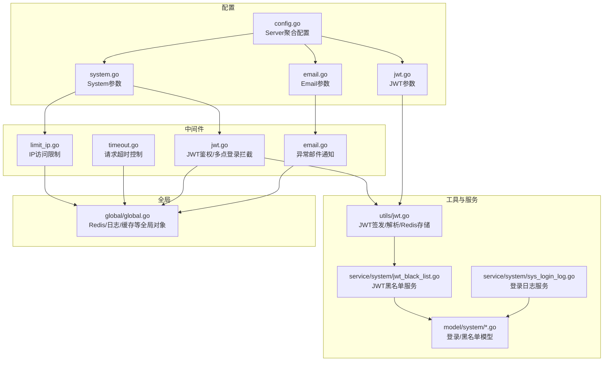
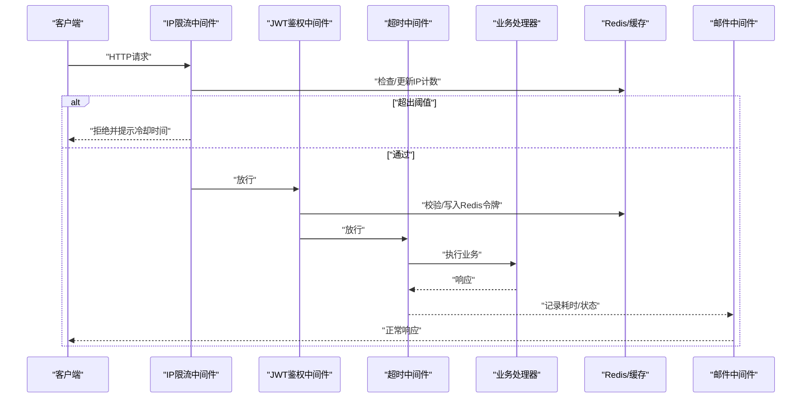
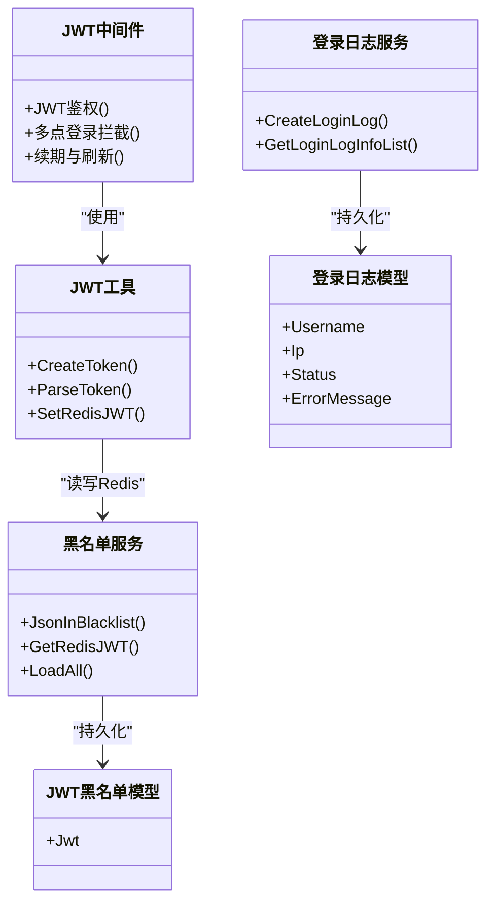
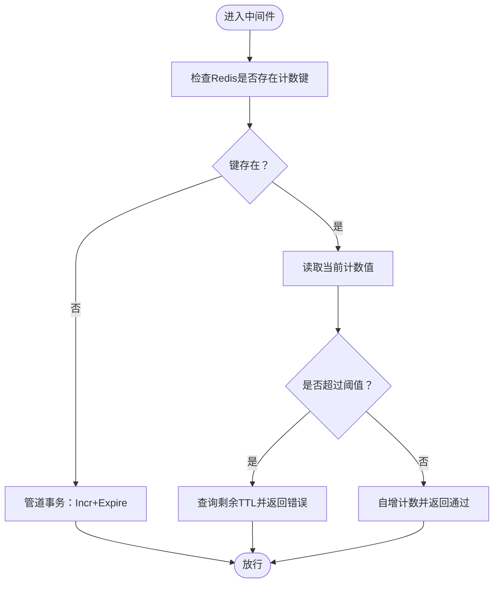
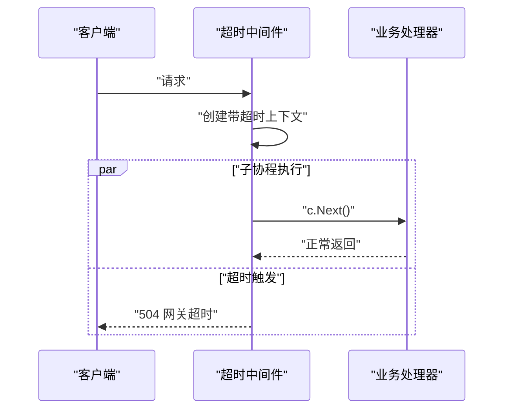
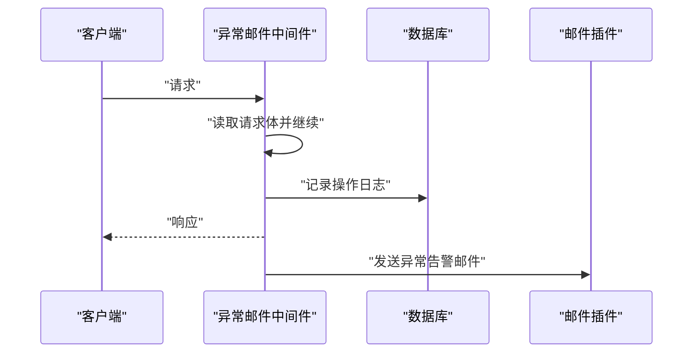
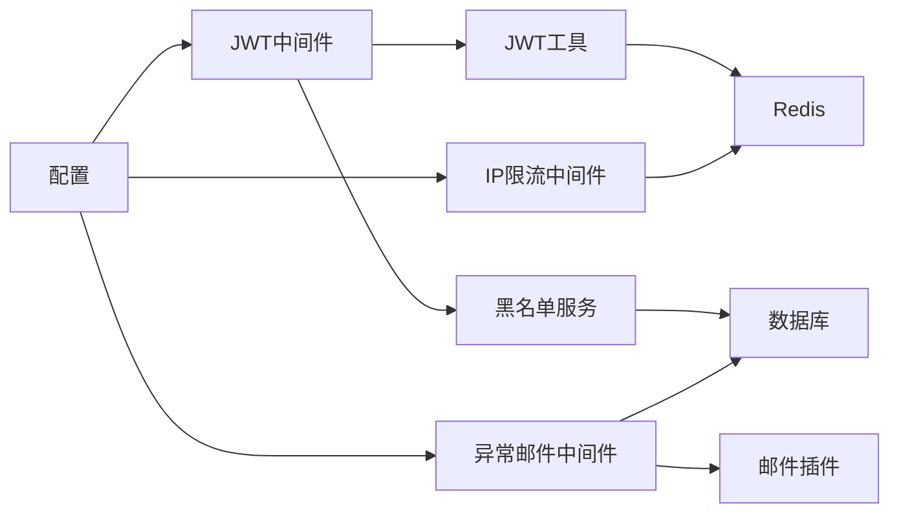

# 安全策略

<cite>
**本文引用的文件**
- [server/middleware/limit_ip.go](file://server/middleware/limit_ip.go)
- [server/middleware/timeout.go](file://server/middleware/timeout.go)
- [server/middleware/jwt.go](file://server/middleware/jwt.go)
- [server/middleware/email.go](file://server/middleware/email.go)
- [server/config/system.go](file://server/config/system.go)
- [server/config/jwt.go](file://server/config/jwt.go)
- [server/config/email.go](file://server/config/email.go)
- [server/config/config.go](file://server/config/config.go)
- [server/global/global.go](file://server/global/global.go)
- [server/utils/jwt.go](file://server/utils/jwt.go)
- [server/service/system/sys_login_log.go](file://server/service/system/sys_login_log.go)
- [server/service/system/jwt_black_list.go](file://server/service/system/jwt_black_list.go)
- [server/model/system/sys_login_log.go](file://server/model/system/sys_login_log.go)
- [server/model/system/sys_jwt_blacklist.go](file://server/model/system/sys_jwt_blacklist.go)
- [server/docs/swagger.json](file://server/docs/swagger.json)
</cite>

## 目录
1. [引言](#引言)
2. [项目结构](#项目结构)
3. [核心组件](#核心组件)
4. [架构总览](#架构总览)
5. [详细组件分析](#详细组件分析)
6. [依赖分析](#依赖分析)
7. [性能考量](#性能考量)
8. [故障排查指南](#故障排查指南)
9. [结论](#结论)
10. [附录](#附录)

## 引言
本文件面向测试管理平台的安全策略，围绕多点登录限制、IP访问限制、请求超时控制与邮件通知机制展开，系统性阐述安全配置参数、中间件实现原理、最佳实践与调优建议，并结合代码级图示帮助读者快速定位实现位置与扩展点。

## 项目结构
安全策略相关代码主要分布在以下模块：
- 中间件层：限流与IP限制、请求超时、JWT鉴权、异常邮件通知
- 配置层：系统参数、JWT参数、邮件参数、全局配置聚合
- 工具与服务层：JWT签发与解析、黑名单拉黑与缓存、登录日志持久化
- 文档层：Swagger对系统参数的描述

图表来源
- [server/middleware/limit_ip.go:1-93](file://server/middleware/limit_ip.go#L1-L93)
- [server/middleware/timeout.go:1-56](file://server/middleware/timeout.go#L1-L56)
- [server/middleware/jwt.go:1-90](file://server/middleware/jwt.go#L1-L90)
- [server/middleware/email.go:1-59](file://server/middleware/email.go#L1-L59)
- [server/config/system.go:1-16](file://server/config/system.go#L1-L16)
- [server/config/jwt.go:1-9](file://server/config/jwt.go#L1-L9)
- [server/config/email.go:1-13](file://server/config/email.go#L1-L13)
- [server/config/config.go:1-41](file://server/config/config.go#L1-L41)
- [server/global/global.go:1-69](file://server/global/global.go#L1-L69)
- [server/utils/jwt.go:1-106](file://server/utils/jwt.go#L1-L106)
- [server/service/system/jwt_black_list.go:1-52](file://server/service/system/jwt_black_list.go#L1-L52)
- [server/service/system/sys_login_log.go:1-54](file://server/service/system/sys_login_log.go#L1-L54)
- [server/model/system/sys_login_log.go:1-17](file://server/model/system/sys_login_log.go#L1-L17)
- [server/model/system/sys_jwt_blacklist.go:1-10](file://server/model/system/sys_jwt_blacklist.go#L1-L10)

章节来源
- [server/middleware/limit_ip.go:1-93](file://server/middleware/limit_ip.go#L1-L93)
- [server/middleware/timeout.go:1-56](file://server/middleware/timeout.go#L1-L56)
- [server/middleware/jwt.go:1-90](file://server/middleware/jwt.go#L1-L90)
- [server/middleware/email.go:1-59](file://server/middleware/email.go#L1-L59)
- [server/config/system.go:1-16](file://server/config/system.go#L1-L16)
- [server/config/jwt.go:1-9](file://server/config/jwt.go#L1-L9)
- [server/config/email.go:1-13](file://server/config/email.go#L1-L13)
- [server/config/config.go:1-41](file://server/config/config.go#L1-L41)
- [server/global/global.go:1-69](file://server/global/global.go#L1-L69)
- [server/utils/jwt.go:1-106](file://server/utils/jwt.go#L1-L106)
- [server/service/system/jwt_black_list.go:1-52](file://server/service/system/jwt_black_list.go#L1-L52)
- [server/service/system/sys_login_log.go:1-54](file://server/service/system/sys_login_log.go#L1-L54)
- [server/model/system/sys_login_log.go:1-17](file://server/model/system/sys_login_log.go#L1-L17)
- [server/model/system/sys_jwt_blacklist.go:1-10](file://server/model/system/sys_jwt_blacklist.go#L1-L10)

## 核心组件
- 多点登录限制与JWT生命周期
  - 通过JWT中间件在登录成功后将当前令牌写入Redis，并结合黑名单缓存实现异地登录拦截与令牌失效控制。
  - 当启用多点登录开关时，同一账号的新令牌会覆盖旧令牌，确保仅保留最新活跃会话。
- IP访问限制
  - 基于Redis的滑动窗口计数器，按客户端IP统计周期内请求次数，超过阈值则拒绝请求并提示剩余冷却时间。
- 请求超时控制
  - 使用带超时上下文的中间件，避免长时间阻塞导致资源占用；超时返回标准网关超时响应。
- 邮件通知机制
  - 异常邮件中间件在非200响应时收集请求与错误信息并通过插件发送邮件，支持异常登录与安全告警场景。

章节来源
- [server/middleware/jwt.go:16-78](file://server/middleware/jwt.go#L16-L78)
- [server/utils/jwt.go:96-105](file://server/utils/jwt.go#L96-L105)
- [server/service/system/jwt_black_list.go:22-29](file://server/service/system/jwt_black_list.go#L22-L29)
- [server/middleware/limit_ip.go:44-92](file://server/middleware/limit_ip.go#L44-L92)
- [server/middleware/timeout.go:13-55](file://server/middleware/timeout.go#L13-L55)
- [server/middleware/email.go:18-58](file://server/middleware/email.go#L18-L58)

## 架构总览
下图展示安全策略在请求链路中的交互关系与关键决策点。

图表来源
- [server/middleware/limit_ip.go:27-62](file://server/middleware/limit_ip.go#L27-L62)
- [server/middleware/jwt.go:16-78](file://server/middleware/jwt.go#L16-L78)
- [server/middleware/timeout.go:13-55](file://server/middleware/timeout.go#L13-L55)
- [server/middleware/email.go:18-58](file://server/middleware/email.go#L18-L58)
- [server/utils/jwt.go:96-105](file://server/utils/jwt.go#L96-L105)

## 详细组件分析

### 多点登录限制与JWT生命周期
- 关键点
  - 登录成功后，服务端签发JWT并写入Redis，键为用户名，值为JWT字符串，过期时间与JWT一致。
  - JWT中间件在每次请求解析令牌时，若发现令牌在黑名单或已过期，则强制要求重新登录。
  - 启用多点登录开关时，新令牌生成后会覆盖Redis中的旧令牌，实现“一处登录，其余设备失效”的效果。
  - 黑名单加载：启动时从数据库批量加载至本地缓存，提升鉴权效率。
- 参数与配置
  - 多点登录开关：System.use-multipoint
  - JWT签名密钥、过期时间、签发者等：JWT配置项
  - 登录日志：SysLoginLog模型与服务，便于审计与追踪

图表来源
- [server/middleware/jwt.go:16-78](file://server/middleware/jwt.go#L16-L78)
- [server/utils/jwt.go:48-105](file://server/utils/jwt.go#L48-L105)
- [server/service/system/jwt_black_list.go:22-52](file://server/service/system/jwt_black_list.go#L22-L52)
- [server/service/system/sys_login_log.go:14-53](file://server/service/system/sys_login_log.go#L14-L53)
- [server/model/system/sys_login_log.go:7-16](file://server/model/system/sys_login_log.go#L7-L16)
- [server/model/system/sys_jwt_blacklist.go:7-10](file://server/model/system/sys_jwt_blacklist.go#L7-L10)

章节来源
- [server/middleware/jwt.go:16-78](file://server/middleware/jwt.go#L16-L78)
- [server/utils/jwt.go:48-105](file://server/utils/jwt.go#L48-L105)
- [server/service/system/jwt_black_list.go:22-52](file://server/service/system/jwt_black_list.go#L22-L52)
- [server/service/system/sys_login_log.go:14-53](file://server/service/system/sys_login_log.go#L14-L53)
- [server/model/system/sys_login_log.go:7-16](file://server/model/system/sys_login_log.go#L7-L16)
- [server/model/system/sys_jwt_blacklist.go:7-10](file://server/model/system/sys_jwt_blacklist.go#L7-L10)

### IP访问限制（滑动窗口）
- 实现要点
  - 默认按客户端IP生成键，周期内累计请求次数，首次访问原子地设置过期时间并自增。
  - 超阈值时返回剩余冷却时间，避免暴力刷接口。
  - 依赖Redis实现分布式计数，需确保Redis可用。
- 配置参数
  - System.iplimit-count：周期内允许的最大请求次数
  - System.iplimit-time：统计周期（秒）

图表来源
- [server/middleware/limit_ip.go:64-92](file://server/middleware/limit_ip.go#L64-L92)
- [server/config/system.go:8-9](file://server/config/system.go#L8-L9)

章节来源
- [server/middleware/limit_ip.go:27-62](file://server/middleware/limit_ip.go#L27-L62)
- [server/middleware/limit_ip.go:44-92](file://server/middleware/limit_ip.go#L44-L92)
- [server/config/system.go:8-9](file://server/config/system.go#L8-L9)

### 请求超时控制
- 实现要点
  - 为每个请求创建带超时的上下文，子协程执行后续处理，使用缓冲通道避免goroutine泄漏。
  - 超时发生时设置连接关闭头并返回标准网关超时响应。
- 使用建议
  - 对IO密集或外部依赖接口设置合理超时，避免阻塞线程池。
  - 结合上游Nginx/反向代理的超时配置，统一处理。

图表来源
- [server/middleware/timeout.go:13-55](file://server/middleware/timeout.go#L13-L55)

章节来源
- [server/middleware/timeout.go:13-55](file://server/middleware/timeout.go#L13-L55)

### 邮件通知机制（异常与安全告警）
- 实现要点
  - 异常邮件中间件在请求结束后根据状态码判断是否发送邮件。
  - 收集请求IP、路径、方法、UA、耗时与错误信息，拼装主题与正文。
  - 通过插件发送邮件，支持收件人、SMTP主机、端口、SSL等配置。
- 应用场景
  - 非200响应时的异常告警
  - 可扩展为异常登录提醒、风控告警等

图表来源
- [server/middleware/email.go:18-58](file://server/middleware/email.go#L18-L58)
- [server/config/email.go:3-12](file://server/config/email.go#L3-L12)

章节来源
- [server/middleware/email.go:18-58](file://server/middleware/email.go#L18-L58)
- [server/config/email.go:3-12](file://server/config/email.go#L3-L12)

## 依赖分析
- 组件耦合
  - JWT中间件强依赖Redis与JWT工具；黑名单服务负责持久化与缓存加载。
  - IP限流中间件依赖Redis实现计数与过期控制。
  - 异常邮件中间件依赖数据库记录与邮件插件。
- 外部依赖
  - Redis：计数、令牌存储、黑名单缓存
  - 日志：Zap用于错误与调试输出
  - Swagger：系统参数的在线文档描述

图表来源
- [server/middleware/jwt.go:16-78](file://server/middleware/jwt.go#L16-L78)
- [server/utils/jwt.go:96-105](file://server/utils/jwt.go#L96-L105)
- [server/service/system/jwt_black_list.go:22-52](file://server/service/system/jwt_black_list.go#L22-L52)
- [server/middleware/limit_ip.go:44-92](file://server/middleware/limit_ip.go#L44-L92)
- [server/middleware/email.go:18-58](file://server/middleware/email.go#L18-L58)
- [server/config/config.go:3-40](file://server/config/config.go#L3-L40)

章节来源
- [server/middleware/jwt.go:16-78](file://server/middleware/jwt.go#L16-L78)
- [server/utils/jwt.go:96-105](file://server/utils/jwt.go#L96-L105)
- [server/service/system/jwt_black_list.go:22-52](file://server/service/system/jwt_black_list.go#L22-L52)
- [server/middleware/limit_ip.go:44-92](file://server/middleware/limit_ip.go#L44-L92)
- [server/middleware/email.go:18-58](file://server/middleware/email.go#L18-L58)
- [server/config/config.go:3-40](file://server/config/config.go#L3-L40)

## 性能考量
- Redis热点键
  - IP限流与JWT令牌键可能成为热点，建议使用Redis集群或合理的键空间设计，避免单点瓶颈。
- 并发与幂等
  - JWT刷新采用并发合并策略，减少重复签发开销。
- 超时设置
  - 业务接口应设置合理超时，防止慢查询拖垮整体吞吐。
- 日志与告警
  - 异常邮件中间件仅在非200时触发，避免噪声；建议配合限流与熔断策略。

## 故障排查指南
- 多点登录不生效
  - 检查System.use-multipoint开关是否开启
  - 确认Redis可用且令牌能正确写入/读取
  - 查看JWT黑名单加载是否成功
- 频繁触发IP限流
  - 调整System.iplimit-count与System.iplimit-time
  - 检查客户端是否使用代理或NAT导致IP相同
- 超时频繁
  - 分析下游依赖与数据库慢查询，适当提高超时阈值
- 邮件告警未发送
  - 检查Email配置（SMTP、端口、SSL、登录认证）
  - 确认异常邮件中间件挂载位置与状态码判定

章节来源
- [server/config/system.go:8-10](file://server/config/system.go#L8-L10)
- [server/config/email.go:3-12](file://server/config/email.go#L3-L12)
- [server/middleware/limit_ip.go:44-92](file://server/middleware/limit_ip.go#L44-L92)
- [server/middleware/timeout.go:13-55](file://server/middleware/timeout.go#L13-L55)
- [server/middleware/email.go:18-58](file://server/middleware/email.go#L18-L58)

## 结论
本平台通过“JWT鉴权+多点登录拦截+Redis限流+超时控制+异常邮件通知”的组合拳，构建了基础而实用的安全体系。建议在生产环境中：
- 合理设置IP限流阈值与周期，平衡安全与用户体验
- 开启多点登录拦截，保障会话安全
- 为关键接口设置超时，避免级联阻塞
- 完善邮件告警策略，覆盖异常登录与高风险行为
- 持续监控Redis与数据库性能，确保安全中间件稳定运行

## 附录

### 安全配置参数一览
- 系统参数（System）
  - iplimit-count：周期内IP最大请求次数
  - iplimit-time：统计周期（秒）
  - use-multipoint：是否启用多点登录拦截
  - use-redis/use-mongo/use-strict-auth：运行环境与权限模式开关
- JWT参数（JWT）
  - signing-key：签名密钥
  - expires-time：过期时间
  - buffer-time：缓冲时间
  - issuer：签发者
- 邮件参数（Email）
  - to/from/host/secret/nickname/port/is-ssl/is-loginauth：SMTP配置

章节来源
- [server/config/system.go:3-15](file://server/config/system.go#L3-L15)
- [server/config/jwt.go:3-8](file://server/config/jwt.go#L3-L8)
- [server/config/email.go:3-12](file://server/config/email.go#L3-L12)
- [server/docs/swagger.json:7404-7420](file://server/docs/swagger.json#L7404-L7420)