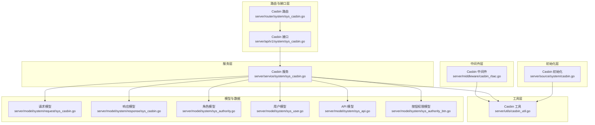
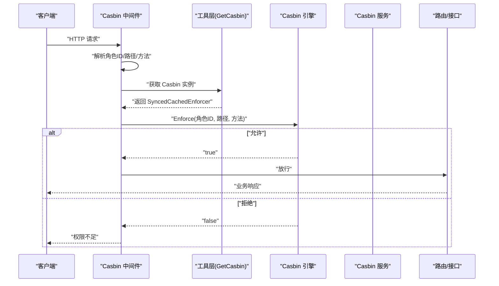
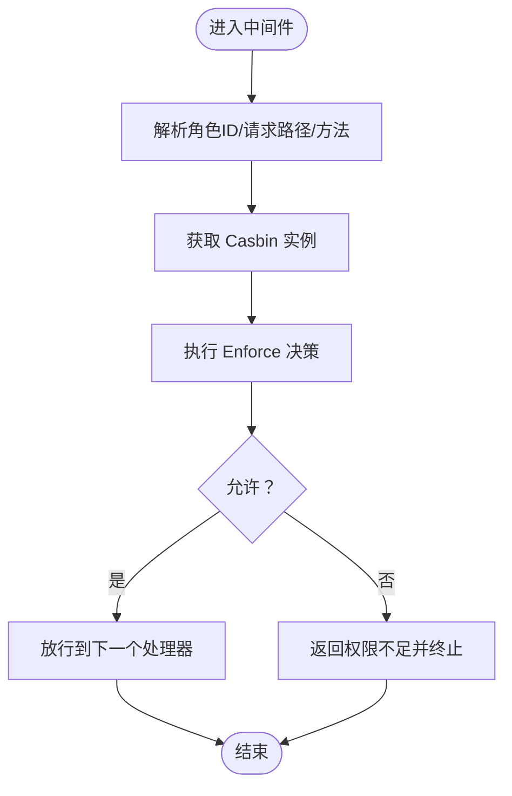
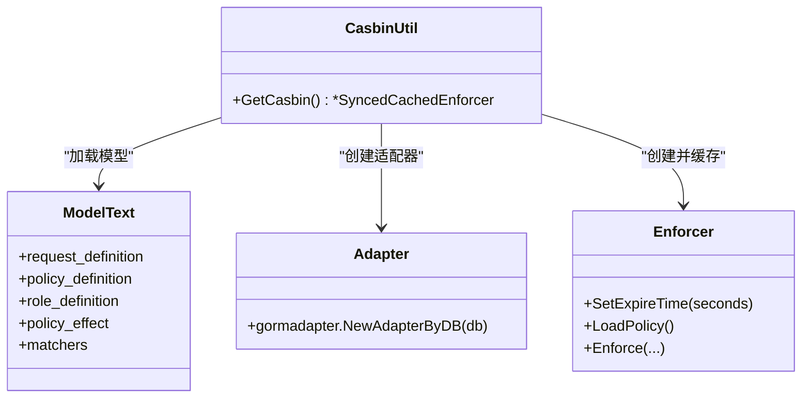
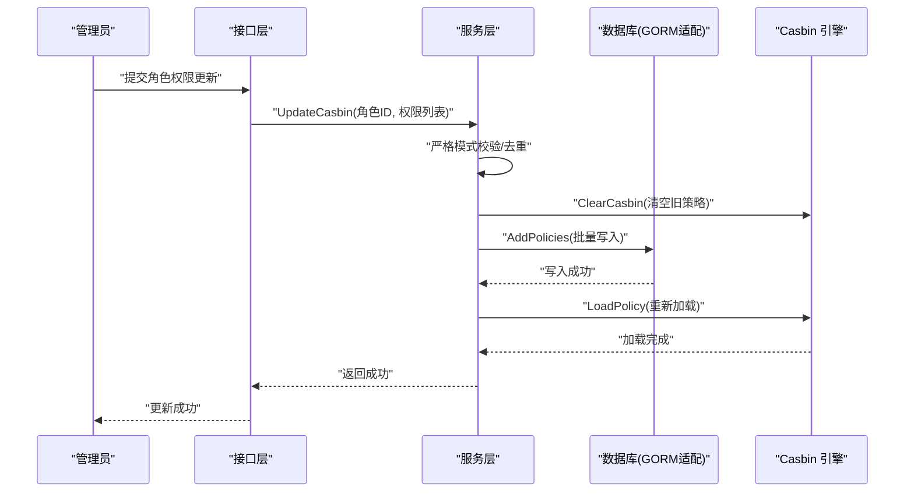
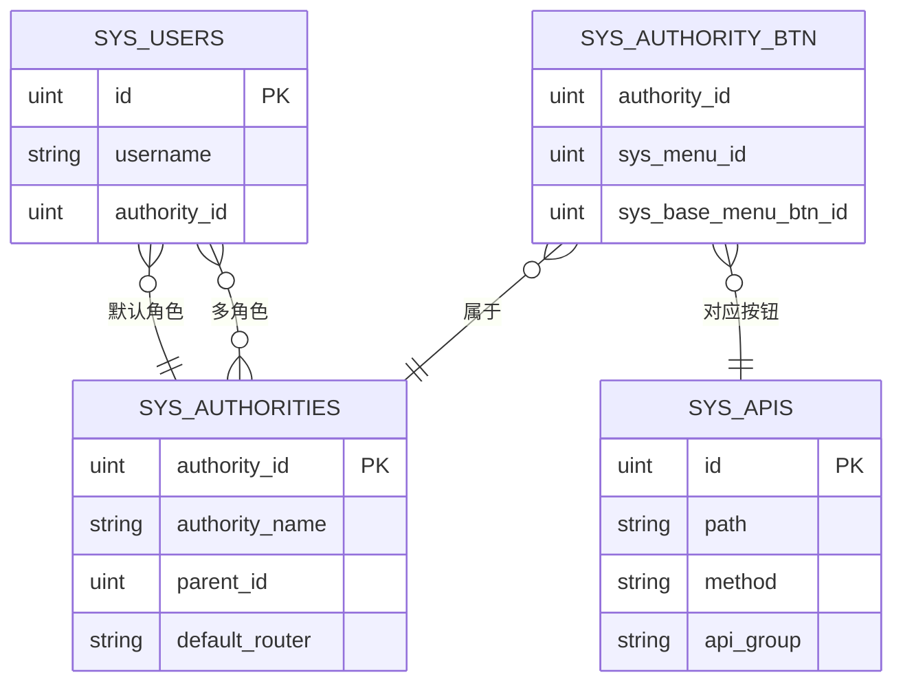
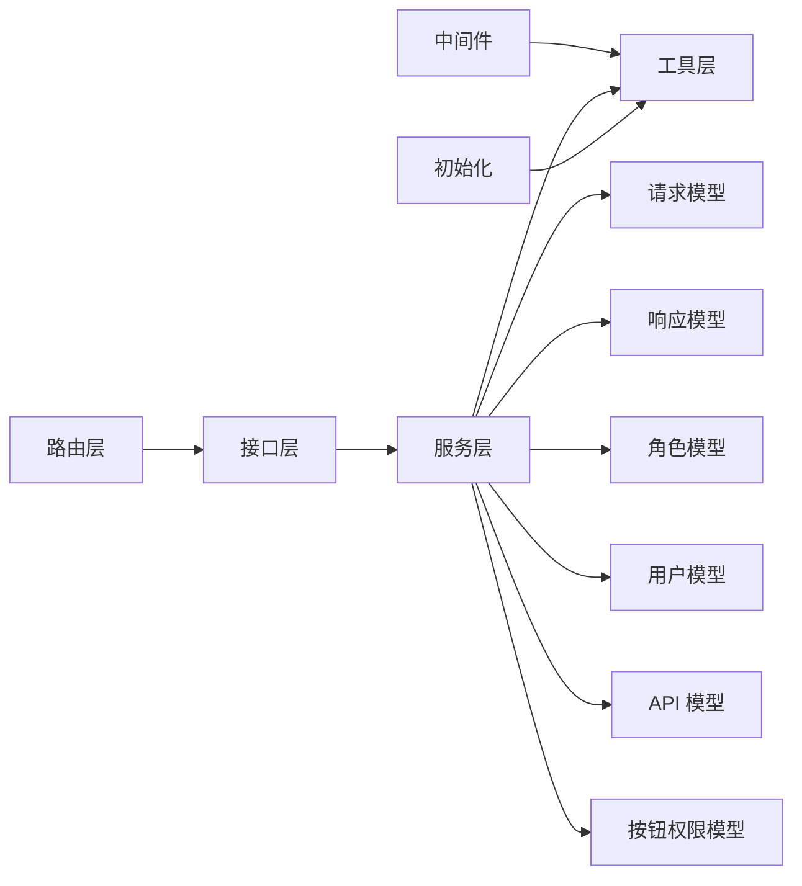

# 授权系统

<cite>
**本文引用的文件**
- [server/middleware/casbin_rbac.go](file://server/middleware/casbin_rbac.go)
- [server/utils/casbin_util.go](file://server/utils/casbin_util.go)
- [server/service/system/sys_casbin.go](file://server/service/system/sys_casbin.go)
- [server/router/system/sys_casbin.go](file://server/router/system/sys_casbin.go)
- [server/api/v1/system/sys_casbin.go](file://server/api/v1/system/sys_casbin.go)
- [server/source/system/casbin.go](file://server/source/system/casbin.go)
- [server/model/system/request/sys_casbin.go](file://server/model/system/request/sys_casbin.go)
- [server/model/system/response/sys_casbin.go](file://server/model/system/response/sys_casbin.go)
- [server/model/system/sys_authority.go](file://server/model/system/sys_authority.go)
- [server/model/system/sys_authority_btn.go](file://server/model/system/sys_authority_btn.go)
- [server/model/system/sys_api.go](file://server/model/system/sys_api.go)
- [server/model/system/sys_user.go](file://server/model/system/sys_user.go)
</cite>

## 目录
1. [引言](#引言)
2. [项目结构](#项目结构)
3. [核心组件](#核心组件)
4. [架构总览](#架构总览)
5. [详细组件分析](#详细组件分析)
6. [依赖分析](#依赖分析)
7. [性能考虑](#性能考虑)
8. [故障排查指南](#故障排查指南)
9. [结论](#结论)
10. [附录：权限配置示例与操作步骤](#附录权限配置示例与操作步骤)

## 引言
本文件面向测试管理平台的授权系统，围绕基于 Casbin 的 RBAC（基于角色的访问控制）实现进行系统化说明。内容涵盖权限模型设计、策略定义、访问控制列表（ACL）管理、菜单权限与按钮权限的粒度控制、角色继承与分配、动态权限更新流程，以及权限中间件的实现原理（含权限检查、缓存策略与性能优化）。最后提供可直接落地的操作步骤，帮助读者完成角色创建、权限分配与权限验证。

## 项目结构
授权系统在服务端采用分层架构：
- 中间件层：统一拦截请求，执行权限校验。
- 工具层：封装 Casbin 实例初始化、模型与适配器配置、缓存策略。
- 服务层：提供权限策略的增删改查、批量同步、API变更联动等能力。
- 路由与接口层：暴露权限管理的 REST 接口。
- 初始化层：自动迁移与初始化 Casbin 策略数据。
- 模型层：定义角色、用户、API、按钮权限等实体及请求/响应结构。

图表来源
- [server/middleware/casbin_rbac.go:1-33](file://server/middleware/casbin_rbac.go#L1-L33)
- [server/utils/casbin_util.go:1-53](file://server/utils/casbin_util.go#L1-L53)
- [server/service/system/sys_casbin.go:1-216](file://server/service/system/sys_casbin.go#L1-L216)
- [server/router/system/sys_casbin.go:1-20](file://server/router/system/sys_casbin.go#L1-L20)
- [server/api/v1/system/sys_casbin.go:1-70](file://server/api/v1/system/sys_casbin.go#L1-L70)
- [server/source/system/casbin.go:1-373](file://server/source/system/casbin.go#L1-L373)
- [server/model/system/request/sys_casbin.go:1-28](file://server/model/system/request/sys_casbin.go#L1-L28)
- [server/model/system/response/sys_casbin.go:1-10](file://server/model/system/response/sys_casbin.go#L1-L10)
- [server/model/system/sys_authority.go:1-24](file://server/model/system/sys_authority.go#L1-L24)
- [server/model/system/sys_user.go:1-63](file://server/model/system/sys_user.go#L1-L63)
- [server/model/system/sys_api.go:1-29](file://server/model/system/sys_api.go#L1-L29)
- [server/model/system/sys_authority_btn.go:1-9](file://server/model/system/sys_authority_btn.go#L1-L9)

章节来源
- [server/middleware/casbin_rbac.go:1-33](file://server/middleware/casbin_rbac.go#L1-L33)
- [server/utils/casbin_util.go:1-53](file://server/utils/casbin_util.go#L1-L53)
- [server/service/system/sys_casbin.go:1-216](file://server/service/system/sys_casbin.go#L1-L216)
- [server/router/system/sys_casbin.go:1-20](file://server/router/system/sys_casbin.go#L1-L20)
- [server/api/v1/system/sys_casbin.go:1-70](file://server/api/v1/system/sys_casbin.go#L1-L70)
- [server/source/system/casbin.go:1-373](file://server/source/system/casbin.go#L1-L373)
- [server/model/system/request/sys_casbin.go:1-28](file://server/model/system/request/sys_casbin.go#L1-L28)
- [server/model/system/response/sys_casbin.go:1-10](file://server/model/system/response/sys_casbin.go#L1-L10)
- [server/model/system/sys_authority.go:1-24](file://server/model/system/sys_authority.go#L1-L24)
- [server/model/system/sys_user.go:1-63](file://server/model/system/sys_user.go#L1-L63)
- [server/model/system/sys_api.go:1-29](file://server/model/system/sys_api.go#L1-L29)
- [server/model/system/sys_authority_btn.go:1-9](file://server/model/system/sys_authority_btn.go#L1-L9)

## 核心组件
- 权限中间件：统一拦截请求，提取用户角色、请求路径与方法，调用 Casbin 执行权限决策。
- Casbin 工具：负责模型加载、适配器初始化、缓存策略设置与策略装载。
- Casbin 服务：提供策略更新、批量同步、API 变更联动、按角色查询策略、按 API 查询角色等能力。
- 路由与接口：暴露“更新角色 API 权限”“获取权限列表”等接口。
- 初始化：自动迁移策略表并预置多套角色的初始策略数据。
- 模型与数据：角色、用户、API、按钮权限等实体及其请求/响应结构。

章节来源
- [server/middleware/casbin_rbac.go:12-32](file://server/middleware/casbin_rbac.go#L12-L32)
- [server/utils/casbin_util.go:18-52](file://server/utils/casbin_util.go#L18-L52)
- [server/service/system/sys_casbin.go:22-74](file://server/service/system/sys_casbin.go#L22-L74)
- [server/router/system/sys_casbin.go:10-19](file://server/router/system/sys_casbin.go#L10-L19)
- [server/api/v1/system/sys_casbin.go:15-44](file://server/api/v1/system/sys_casbin.go#L15-L44)
- [server/source/system/casbin.go:42-372](file://server/source/system/casbin.go#L42-L372)
- [server/model/system/request/sys_casbin.go:3-27](file://server/model/system/request/sys_casbin.go#L3-L27)
- [server/model/system/response/sys_casbin.go:7-9](file://server/model/system/response/sys_casbin.go#L7-L9)

## 架构总览
下图展示从请求进入至权限判断的整体流程，以及各组件之间的交互关系。

图表来源
- [server/middleware/casbin_rbac.go:13-31](file://server/middleware/casbin_rbac.go#L13-L31)
- [server/utils/casbin_util.go:18-52](file://server/utils/casbin_util.go#L18-L52)

## 详细组件分析

### 权限中间件（CasbinHandler）
- 功能职责：从 JWT 声明中提取用户角色 ID；从请求中提取路径与方法；调用 Casbin 执行权限决策；根据结果放行或返回错误。
- 关键点：
  - 路径去除路由前缀后参与匹配。
  - 使用带缓存的策略执行器，命中缓存时避免重复计算。
  - 拒绝时立即中断后续处理。

图表来源
- [server/middleware/casbin_rbac.go:13-31](file://server/middleware/casbin_rbac.go#L13-L31)

章节来源
- [server/middleware/casbin_rbac.go:12-32](file://server/middleware/casbin_rbac.go#L12-L32)

### Casbin 工具（GetCasbin）
- 功能职责：单例初始化 Casbin，加载模型文本，创建适配器连接数据库，启用缓存并加载策略。
- 关键点：
  - 使用 GORM 适配器持久化策略。
  - 模型包含请求定义、策略定义、角色定义、策略效果、匹配器。
  - 匹配器使用路径通配规则，支持路径层级匹配。
  - 设置缓存过期时间，提升查询性能。

图表来源
- [server/utils/casbin_util.go:18-52](file://server/utils/casbin_util.go#L18-L52)

章节来源
- [server/utils/casbin_util.go:13-52](file://server/utils/casbin_util.go#L13-L52)

### Casbin 服务（策略管理与联动）
- 功能职责：
  - 更新角色 API 权限：严格模式下校验 API 是否存在，去重后批量写入策略，支持清空后再写入。
  - API 更新随动：当 API 路径或方法变更时，更新数据库中的策略并重新加载。
  - 查询策略：按角色查询策略列表；按 API 查询拥有权限的角色集合。
  - 同步与刷新：移除旧策略并批量新增，随后加载策略以即时生效。
- 关键点：
  - 严格模式：仅允许在系统已登记的 API 上授权。
  - 去重：基于“角色ID+路径+方法”的组合去重，避免重复策略。
  - 批量操作：使用批量插入与批量删除，降低数据库往返次数。

图表来源
- [server/api/v1/system/sys_casbin.go:24-44](file://server/api/v1/system/sys_casbin.go#L24-L44)
- [server/service/system/sys_casbin.go:26-74](file://server/service/system/sys_casbin.go#L26-L74)
- [server/utils/casbin_util.go:47-52](file://server/utils/casbin_util.go#L47-L52)

章节来源
- [server/service/system/sys_casbin.go:22-216](file://server/service/system/sys_casbin.go#L22-L216)
- [server/api/v1/system/sys_casbin.go:15-69](file://server/api/v1/system/sys_casbin.go#L15-L69)

### 路由与接口
- 路由：提供“更新角色 API 权限”和“获取权限列表”两个接口，并挂载操作审计中间件。
- 接口：参数校验、鉴权、调用服务层并返回标准响应格式。

章节来源
- [server/router/system/sys_casbin.go:10-19](file://server/router/system/sys_casbin.go#L10-L19)
- [server/api/v1/system/sys_casbin.go:15-69](file://server/api/v1/system/sys_casbin.go#L15-L69)

### 初始化：策略表与默认策略
- 自动迁移：初始化阶段自动迁移策略表。
- 预置策略：为不同角色预置大量初始 API 权限，确保平台基础功能可用。
- 标识：通过初始化器名称与上下文标识，确保只在首次部署时写入。

章节来源
- [server/source/system/casbin.go:21-372](file://server/source/system/casbin.go#L21-L372)

### 数据模型与权限粒度
- 角色模型：包含角色 ID、角色名、父角色 ID、默认菜单等字段，支持多对多关联菜单与用户。
- 用户模型：包含默认角色 ID 与多角色关联，便于多角色场景下的权限叠加。
- API 模型：记录 API 路径、方法、分组与中文描述，用于严格模式校验与策略匹配。
- 按钮权限模型：角色-菜单-按钮三元关联，支持按钮级权限控制。

图表来源
- [server/model/system/sys_authority.go:7-19](file://server/model/system/sys_authority.go#L7-L19)
- [server/model/system/sys_user.go:20-34](file://server/model/system/sys_user.go#L20-L34)
- [server/model/system/sys_api.go:7-17](file://server/model/system/sys_api.go#L7-L17)
- [server/model/system/sys_authority_btn.go:3-8](file://server/model/system/sys_authority_btn.go#L3-L8)

章节来源
- [server/model/system/sys_authority.go:1-24](file://server/model/system/sys_authority.go#L1-L24)
- [server/model/system/sys_user.go:1-63](file://server/model/system/sys_user.go#L1-L63)
- [server/model/system/sys_api.go:1-29](file://server/model/system/sys_api.go#L1-L29)
- [server/model/system/sys_authority_btn.go:1-9](file://server/model/system/sys_authority_btn.go#L1-L9)

## 依赖分析
- 组件耦合：
  - 中间件依赖工具层提供的 Casbin 实例。
  - 服务层依赖工具层与数据库适配器，同时依赖模型层的数据结构。
  - 路由与接口层依赖服务层。
  - 初始化层依赖工具层与数据库。
- 外部依赖：
  - Casbin 核心库与 GORM 适配器。
  - Gin Web 框架与中间件生态。
- 循环依赖：未发现循环导入或循环依赖。

图表来源
- [server/middleware/casbin_rbac.go:13-31](file://server/middleware/casbin_rbac.go#L13-L31)
- [server/utils/casbin_util.go:18-52](file://server/utils/casbin_util.go#L18-L52)
- [server/service/system/sys_casbin.go:22-216](file://server/service/system/sys_casbin.go#L22-L216)
- [server/router/system/sys_casbin.go:10-19](file://server/router/system/sys_casbin.go#L10-L19)
- [server/api/v1/system/sys_casbin.go:15-69](file://server/api/v1/system/sys_casbin.go#L15-L69)
- [server/source/system/casbin.go:42-372](file://server/source/system/casbin.go#L42-L372)

## 性能考虑
- 缓存策略：使用带缓存的策略执行器，设置缓存过期时间，显著降低重复决策开销。
- 批量操作：批量写入与批量删除策略，减少数据库往返次数。
- 去重与严格模式：在写入前去重并校验 API 存在性，避免冗余策略与无效授权。
- 路径匹配：匹配器采用路径层级匹配，兼顾灵活性与性能。

章节来源
- [server/utils/casbin_util.go:47-52](file://server/utils/casbin_util.go#L47-L52)
- [server/service/system/sys_casbin.go:56-74](file://server/service/system/sys_casbin.go#L56-L74)

## 故障排查指南
- 权限不足：
  - 检查中间件是否正确提取角色 ID、路径与方法。
  - 确认策略表中是否存在对应策略。
  - 若刚更新策略，请确认是否已触发策略重新加载。
- 策略未生效：
  - 确认服务层调用了策略加载方法。
  - 检查缓存是否过期或被禁用。
- API 变更导致权限异常：
  - 使用 API 更新随动功能更新策略。
  - 确认数据库中策略已更新且已重新加载。
- 严格模式报错：
  - 确认 API 已在系统登记，且路径与方法一致。

章节来源
- [server/middleware/casbin_rbac.go:24-29](file://server/middleware/casbin_rbac.go#L24-L29)
- [server/service/system/sys_casbin.go:82-93](file://server/service/system/sys_casbin.go#L82-L93)
- [server/service/system/sys_casbin.go:169-173](file://server/service/system/sys_casbin.go#L169-L173)

## 结论
本授权系统以 Casbin 为核心，结合 Gin 中间件与 GORM 适配器，实现了灵活、高性能的 RBAC 权限控制。系统支持细粒度的 API 权限控制，并通过初始化预置策略保障平台可用性。中间件统一接入，服务层提供完善的策略管理与联动能力，满足动态权限更新与运维需求。

## 附录：权限配置示例与操作步骤
以下步骤基于现有接口与服务实现，指导如何完成角色创建、权限分配与权限验证。

- 角色创建
  - 通过角色管理接口创建新角色，记录角色 ID。
  - 参考：角色模型字段与默认菜单配置。

- 权限分配（API 权限）
  - 准备权限列表：包含路径与方法的数组。
  - 调用“更新角色 API 权限”接口，传入角色 ID 与权限列表。
  - 若开启严格模式，系统会校验权限是否在已登记 API 列表中。
  - 提交后，系统会清空旧策略并批量写入新策略，随后重新加载策略。
  - 参考：接口定义与服务层实现。

- 权限验证
  - 发送携带 JWT 的请求到受控 API。
  - 中间件将自动执行权限决策，若允许则放行，否则返回权限不足。
  - 参考：中间件与工具层实现。

- API 变更随动
  - 当 API 路径或方法发生变更时，调用 API 更新随动接口。
  - 系统将更新数据库中的策略并重新加载。
  - 参考：服务层实现。

- 查询权限
  - 调用“获取权限列表”接口，传入角色 ID，即可获得该角色当前拥有的 API 权限列表。
  - 参考：接口与服务层实现。

章节来源
- [server/api/v1/system/sys_casbin.go:15-69](file://server/api/v1/system/sys_casbin.go#L15-L69)
- [server/service/system/sys_casbin.go:26-112](file://server/service/system/sys_casbin.go#L26-L112)
- [server/middleware/casbin_rbac.go:13-31](file://server/middleware/casbin_rbac.go#L13-L31)
- [server/utils/casbin_util.go:18-52](file://server/utils/casbin_util.go#L18-L52)
- [server/model/system/sys_authority.go:7-19](file://server/model/system/sys_authority.go#L7-L19)