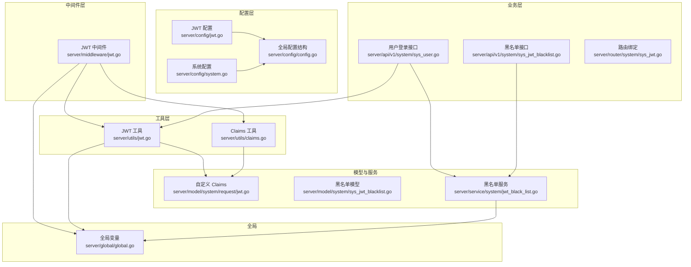
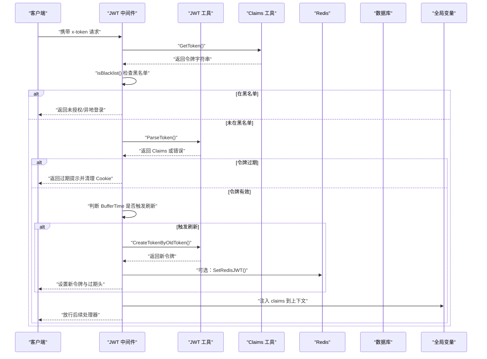
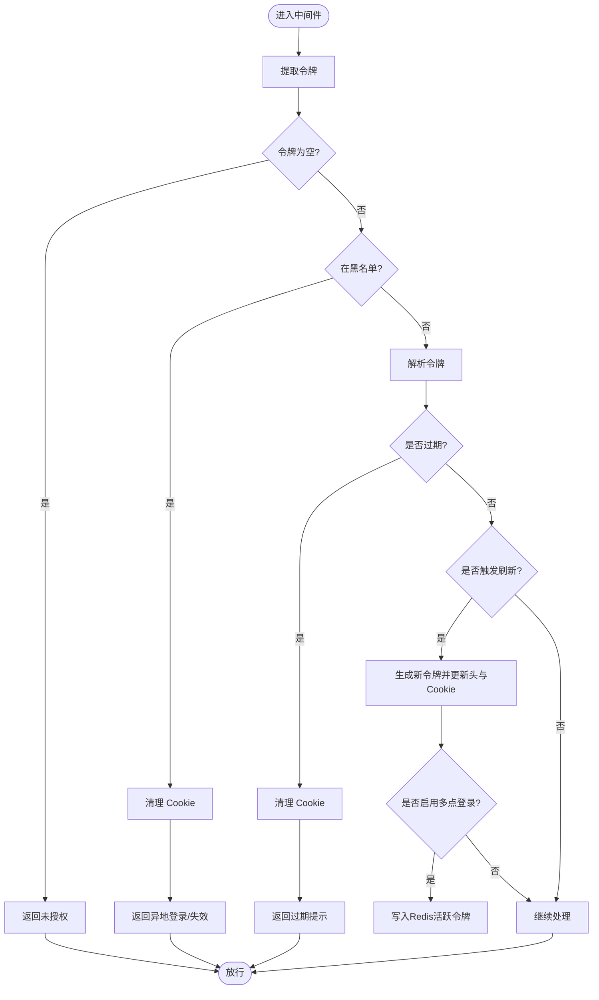
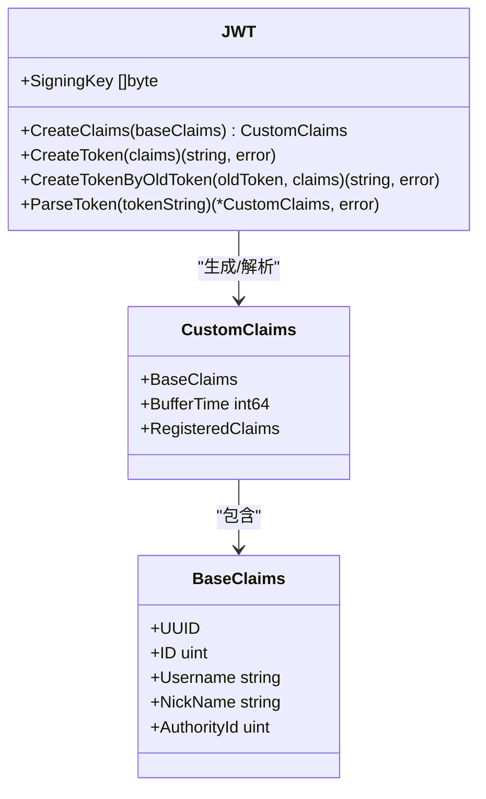
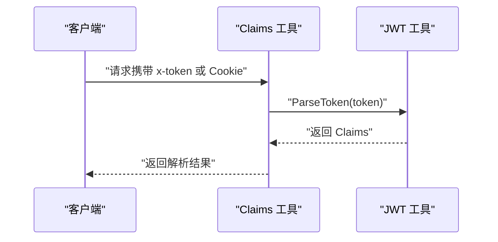
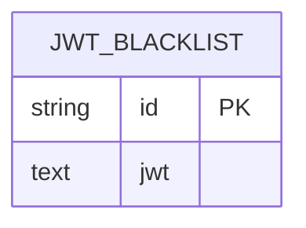
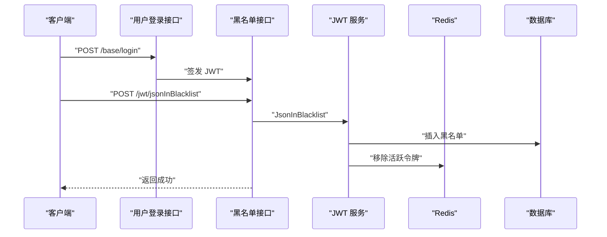
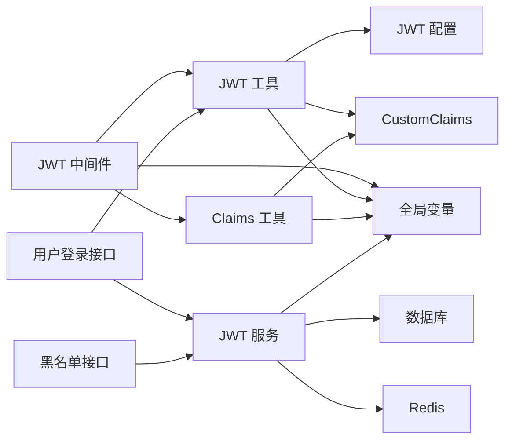

# 认证系统

<cite>
**本文引用的文件**
- [server/middleware/jwt.go](file://server/middleware/jwt.go)
- [server/utils/jwt.go](file://server/utils/jwt.go)
- [server/utils/claims.go](file://server/utils/claims.go)
- [server/config/jwt.go](file://server/config/jwt.go)
- [server/config/config.go](file://server/config/config.go)
- [server/config/system.go](file://server/config/system.go)
- [server/model/system/request/jwt.go](file://server/model/system/request/jwt.go)
- [server/model/system/sys_jwt_blacklist.go](file://server/model/system/sys_jwt_blacklist.go)
- [server/service/system/jwt_black_list.go](file://server/service/system/jwt_black_list.go)
- [server/router/system/sys_jwt.go](file://server/router/system/sys_jwt.go)
- [server/api/v1/system/sys_jwt_blacklist.go](file://server/api/v1/system/sys_jwt_blacklist.go)
- [server/api/v1/system/sys_user.go](file://server/api/v1/system/sys_user.go)
- [server/global/global.go](file://server/global/global.go)
</cite>

## 目录
1. [简介](#简介)
2. [项目结构](#项目结构)
3. [核心组件](#核心组件)
4. [架构总览](#架构总览)
5. [详细组件分析](#详细组件分析)
6. [依赖分析](#依赖分析)
7. [性能考量](#性能考量)
8. [故障排查指南](#故障排查指南)
9. [结论](#结论)
10. [附录](#附录)

## 简介
本文件面向测试管理平台的认证系统，围绕基于 JWT 的用户认证机制进行深入说明，涵盖令牌生成、解析与验证流程；JWT 中间件的工作原理（令牌提取、黑名单检查、过期处理与自动刷新）；多点登录控制、异地登录检测与令牌失效策略；JWT 配置参数（过期时间、缓冲时间、刷新策略）；以及完整的认证流程示例、最佳实践与安全注意事项。

## 项目结构
认证相关代码主要分布在以下模块：
- 中间件层：负责请求拦截、令牌提取、黑名单校验、过期与刷新处理
- 工具层：封装 JWT 结构体、Claims 定义、令牌生成/解析、Redis 存储等
- 配置层：定义 JWT 与系统级配置项（如多点登录开关）
- 业务层：登录接口签发令牌、加入黑名单接口、用户信息读取工具
- 全局层：集中持有 Redis、数据库、缓存等全局资源

**图示来源**
- [server/middleware/jwt.go:16-78](file://server/middleware/jwt.go#L16-L78)
- [server/utils/jwt.go:13-106](file://server/utils/jwt.go#L13-L106)
- [server/utils/claims.go:42-65](file://server/utils/claims.go#L42-L65)
- [server/config/jwt.go:3-8](file://server/config/jwt.go#L3-L8)
- [server/config/system.go:3-15](file://server/config/system.go#L3-L15)
- [server/config/config.go:3-40](file://server/config/config.go#L3-L40)
- [server/model/system/request/jwt.go:8-22](file://server/model/system/request/jwt.go#L8-L22)
- [server/model/system/sys_jwt_blacklist.go:7-10](file://server/model/system/sys_jwt_blacklist.go#L7-L10)
- [server/service/system/jwt_black_list.go:12-52](file://server/service/system/jwt_black_list.go#L12-L52)
- [server/api/v1/system/sys_user.go:101-161](file://server/api/v1/system/sys_user.go#L101-L161)
- [server/api/v1/system/sys_jwt_blacklist.go:14-33](file://server/api/v1/system/sys_jwt_blacklist.go#L14-L33)
- [server/router/system/sys_jwt.go:9-14](file://server/router/system/sys_jwt.go#L9-L14)
- [server/global/global.go:25-42](file://server/global/global.go#L25-L42)

**章节来源**
- [server/middleware/jwt.go:16-78](file://server/middleware/jwt.go#L16-L78)
- [server/utils/jwt.go:13-106](file://server/utils/jwt.go#L13-L106)
- [server/utils/claims.go:42-65](file://server/utils/claims.go#L42-L65)
- [server/config/jwt.go:3-8](file://server/config/jwt.go#L3-L8)
- [server/config/system.go:3-15](file://server/config/system.go#L3-L15)
- [server/config/config.go:3-40](file://server/config/config.go#L3-L40)
- [server/model/system/request/jwt.go:8-22](file://server/model/system/request/jwt.go#L8-L22)
- [server/model/system/sys_jwt_blacklist.go:7-10](file://server/model/system/sys_jwt_blacklist.go#L7-L10)
- [server/service/system/jwt_black_list.go:12-52](file://server/service/system/jwt_black_list.go#L12-L52)
- [server/api/v1/system/sys_user.go:101-161](file://server/api/v1/system/sys_user.go#L101-L161)
- [server/api/v1/system/sys_jwt_blacklist.go:14-33](file://server/api/v1/system/sys_jwt_blacklist.go#L14-L33)
- [server/router/system/sys_jwt.go:9-14](file://server/router/system/sys_jwt.go#L9-L14)
- [server/global/global.go:25-42](file://server/global/global.go#L25-L42)

## 核心组件
- JWT 中间件：统一处理请求鉴权，提取令牌、检查黑名单、解析与刷新、注入用户信息
- JWT 工具：封装 JWT 结构体、Claims、令牌生成与解析、并发安全的旧令牌换新令牌
- Claims 工具：从请求上下文提取与解析 Claims，设置/清除 Cookie，获取用户信息
- 配置模块：JWT 签名密钥、过期时间、缓冲时间、签发者；系统多点登录开关
- 黑名单模型与服务：持久化黑名单、加载至本地缓存、Redis 存取当前活跃令牌
- 登录与黑名单接口：登录签发令牌、主动拉黑当前令牌并清理 Cookie

**章节来源**
- [server/middleware/jwt.go:16-78](file://server/middleware/jwt.go#L16-L78)
- [server/utils/jwt.go:13-106](file://server/utils/jwt.go#L13-L106)
- [server/utils/claims.go:42-149](file://server/utils/claims.go#L42-L149)
- [server/config/jwt.go:3-8](file://server/config/jwt.go#L3-L8)
- [server/config/system.go:3-15](file://server/config/system.go#L3-L15)
- [server/model/system/request/jwt.go:8-22](file://server/model/system/request/jwt.go#L8-L22)
- [server/model/system/sys_jwt_blacklist.go:7-10](file://server/model/system/sys_jwt_blacklist.go#L7-L10)
- [server/service/system/jwt_black_list.go:12-52](file://server/service/system/jwt_black_list.go#L12-L52)
- [server/api/v1/system/sys_user.go:101-161](file://server/api/v1/system/sys_user.go#L101-L161)
- [server/api/v1/system/sys_jwt_blacklist.go:14-33](file://server/api/v1/system/sys_jwt_blacklist.go#L14-L33)

## 架构总览
下图展示从客户端发起请求到服务端完成鉴权与刷新的整体流程，包括令牌提取、黑名单检查、过期判断、自动刷新与多点登录控制。

**图示来源**
- [server/middleware/jwt.go:16-78](file://server/middleware/jwt.go#L16-L78)
- [server/utils/jwt.go:48-88](file://server/utils/jwt.go#L48-L88)
- [server/utils/claims.go:42-65](file://server/utils/claims.go#L42-L65)
- [server/global/global.go:25-42](file://server/global/global.go#L25-L42)

## 详细组件分析

### JWT 中间件（server/middleware/jwt.go）
- 令牌提取：优先从请求头 x-token 获取，若为空则尝试从 Cookie 中解析并回写 Cookie
- 黑名单检查：调用 isBlacklist 判断当前令牌是否在黑名单缓存中
- 令牌解析：使用 JWT 工具解析并校验签名、有效期等
- 过期处理：对过期错误进行专门处理，清理 Cookie 并终止请求
- 自动刷新：当剩余有效期小于缓冲时间时，生成新令牌并更新响应头与 Cookie；支持多点登录记录
- 多点登录控制：当启用 UseMultipoint 时，将新令牌写入 Redis，并以用户名为键，保证同一账号仅保留一个活跃令牌

**图示来源**
- [server/middleware/jwt.go:16-78](file://server/middleware/jwt.go#L16-L78)

**章节来源**
- [server/middleware/jwt.go:16-78](file://server/middleware/jwt.go#L16-L78)

### JWT 工具（server/utils/jwt.go）
- 结构体与常量：定义 JWT 结构体与各类错误常量（过期、格式错误、签名无效等）
- Claims 构造：根据配置计算缓冲时间与过期时间，填充受众多标字段
- 令牌生成：使用 HS256 签名生成 JWT 字符串
- 旧令牌换新令牌：通过并发控制（singleflight）避免并发刷新导致的重复生成
- 令牌解析：统一解析并映射错误类型，返回自定义 Claims

**图示来源**
- [server/utils/jwt.go:13-106](file://server/utils/jwt.go#L13-L106)
- [server/model/system/request/jwt.go:8-22](file://server/model/system/request/jwt.go#L8-L22)

**章节来源**
- [server/utils/jwt.go:13-106](file://server/utils/jwt.go#L13-L106)
- [server/model/system/request/jwt.go:8-22](file://server/model/system/request/jwt.go#L8-L22)

### Claims 工具（server/utils/claims.go）
- 令牌与 Cookie：GetToken 支持从请求头或 Cookie 提取并回写；SetToken/ClearToken 统一设置与清理 Cookie
- Claims 解析：GetClaims 从上下文或请求解析并返回自定义 Claims
- 用户信息读取：提供便捷方法获取用户 ID、UUID、角色 ID、用户名等

**图示来源**
- [server/utils/claims.go:42-65](file://server/utils/claims.go#L42-L65)
- [server/utils/jwt.go:62-88](file://server/utils/jwt.go#L62-L88)

**章节来源**
- [server/utils/claims.go:42-149](file://server/utils/claims.go#L42-L149)

### 配置模块（server/config/jwt.go, server/config/system.go, server/config/config.go）
- JWT 配置：签名密钥、过期时间、缓冲时间、签发者
- 系统配置：多点登录开关 UseMultipoint、Redis/Mongo 开关等
- 全局配置结构：Server 包含 JWT、Zap、Redis、Mongo、System 等子配置

**章节来源**
- [server/config/jwt.go:3-8](file://server/config/jwt.go#L3-L8)
- [server/config/system.go:3-15](file://server/config/system.go#L3-L15)
- [server/config/config.go:3-40](file://server/config/config.go#L3-L40)

### 黑名单模型与服务（server/model/system/sys_jwt_blacklist.go, server/service/system/jwt_black_list.go）
- 黑名单模型：持久化存储 JWT 字符串
- 黑名单服务：将令牌加入黑名单并同步到本地缓存；从 Redis 读取当前活跃令牌；启动时加载数据库黑名单至缓存

**图示来源**
- [server/model/system/sys_jwt_blacklist.go:7-10](file://server/model/system/sys_jwt_blacklist.go#L7-L10)
- [server/service/system/jwt_black_list.go:22-52](file://server/service/system/jwt_black_list.go#L22-L52)

**章节来源**
- [server/model/system/sys_jwt_blacklist.go:7-10](file://server/model/system/sys_jwt_blacklist.go#L7-L10)
- [server/service/system/jwt_black_list.go:12-52](file://server/service/system/jwt_black_list.go#L12-L52)

### 登录与黑名单接口（server/api/v1/system/sys_user.go, server/api/v1/system/sys_jwt_blacklist.go, server/router/system/sys_jwt.go）
- 登录接口：校验用户凭据后签发 JWT，支持多点登录策略（覆盖旧令牌并写入 Redis）
- 黑名单接口：将当前令牌加入黑名单并清理 Cookie
- 路由绑定：提供黑名单接口的路由

**图示来源**
- [server/api/v1/system/sys_user.go:101-161](file://server/api/v1/system/sys_user.go#L101-L161)
- [server/api/v1/system/sys_jwt_blacklist.go:14-33](file://server/api/v1/system/sys_jwt_blacklist.go#L14-L33)
- [server/router/system/sys_jwt.go:9-14](file://server/router/system/sys_jwt.go#L9-L14)
- [server/service/system/jwt_black_list.go:22-29](file://server/service/system/jwt_black_list.go#L22-L29)

**章节来源**
- [server/api/v1/system/sys_user.go:101-161](file://server/api/v1/system/sys_user.go#L101-L161)
- [server/api/v1/system/sys_jwt_blacklist.go:14-33](file://server/api/v1/system/sys_jwt_blacklist.go#L14-L33)
- [server/router/system/sys_jwt.go:9-14](file://server/router/system/sys_jwt.go#L9-L14)
- [server/service/system/jwt_black_list.go:22-29](file://server/service/system/jwt_black_list.go#L22-L29)

## 依赖分析
- 中间件依赖 JWT 工具与 Claims 工具，间接依赖全局变量（Redis、数据库、缓存）
- JWT 工具依赖配置模块与模型层的 Claims 定义
- 黑名单服务依赖数据库与 Redis，同时维护本地缓存
- 登录接口依赖 JWT 工具与黑名单服务，按系统配置决定是否启用多点登录

**图示来源**
- [server/middleware/jwt.go:16-78](file://server/middleware/jwt.go#L16-L78)
- [server/utils/jwt.go:13-106](file://server/utils/jwt.go#L13-L106)
- [server/utils/claims.go:42-65](file://server/utils/claims.go#L42-L65)
- [server/config/jwt.go:3-8](file://server/config/jwt.go#L3-L8)
- [server/model/system/request/jwt.go:8-22](file://server/model/system/request/jwt.go#L8-L22)
- [server/service/system/jwt_black_list.go:12-52](file://server/service/system/jwt_black_list.go#L12-L52)
- [server/api/v1/system/sys_user.go:101-161](file://server/api/v1/system/sys_user.go#L101-L161)
- [server/api/v1/system/sys_jwt_blacklist.go:14-33](file://server/api/v1/system/sys_jwt_blacklist.go#L14-L33)
- [server/global/global.go:25-42](file://server/global/global.go#L25-L42)

**章节来源**
- [server/middleware/jwt.go:16-78](file://server/middleware/jwt.go#L16-L78)
- [server/utils/jwt.go:13-106](file://server/utils/jwt.go#L13-L106)
- [server/utils/claims.go:42-65](file://server/utils/claims.go#L42-L65)
- [server/config/jwt.go:3-8](file://server/config/jwt.go#L3-L8)
- [server/model/system/request/jwt.go:8-22](file://server/model/system/request/jwt.go#L8-L22)
- [server/service/system/jwt_black_list.go:12-52](file://server/service/system/jwt_black_list.go#L12-L52)
- [server/api/v1/system/sys_user.go:101-161](file://server/api/v1/system/sys_user.go#L101-L161)
- [server/api/v1/system/sys_jwt_blacklist.go:14-33](file://server/api/v1/system/sys_jwt_blacklist.go#L14-L33)
- [server/global/global.go:25-42](file://server/global/global.go#L25-L42)

## 性能考量
- 并发刷新控制：通过 singleflight 避免同一旧令牌并发刷新导致的重复生成，降低数据库与 Redis 压力
- 黑名单缓存：本地缓存加载数据库黑名单，减少频繁查询数据库
- 多点登录策略：Redis 记录活跃令牌，避免重复登录导致的资源浪费
- Cookie 回写：首次从 Cookie 解析后回写，减少重复解析成本

[本节为通用性能讨论，不直接分析具体文件]

## 故障排查指南
- 未登录或非法访问：中间件未检测到令牌，返回未授权
- 异地登录或令牌失效：令牌在黑名单中，清理 Cookie 并提示失效
- 令牌过期：解析返回过期错误，清理 Cookie 并提示重新登录
- 签名或格式错误：解析返回对应错误，清理 Cookie 并提示错误信息
- 多点登录冲突：启用多点登录时，新登录会拉黑旧令牌并写入 Redis，确保同一账号仅有一个活跃令牌
- 主动拉黑：调用黑名单接口将当前令牌加入黑名单并清理 Cookie

**章节来源**
- [server/middleware/jwt.go:16-78](file://server/middleware/jwt.go#L16-L78)
- [server/utils/jwt.go:62-88](file://server/utils/jwt.go#L62-L88)
- [server/api/v1/system/sys_jwt_blacklist.go:14-33](file://server/api/v1/system/sys_jwt_blacklist.go#L14-L33)
- [server/service/system/jwt_black_list.go:22-29](file://server/service/system/jwt_black_list.go#L22-L29)

## 结论
本认证系统以 JWT 为核心，结合中间件统一鉴权、工具层安全生成与解析、配置灵活可控、服务层黑名单与多点登录策略，形成一套完整的用户认证方案。通过缓冲时间与并发控制实现平滑刷新，通过黑名单与 Redis 实现异地登录检测与令牌失效处理，满足测试管理平台的安全与可用性需求。

[本节为总结性内容，不直接分析具体文件]

## 附录

### JWT 配置参数说明
- 签名密钥（SigningKey）：用于 HS256 签名的密钥
- 过期时间（ExpiresTime）：JWT 的过期时长
- 缓冲时间（BufferTime）：提前刷新的窗口时间
- 签发者（Issuer）：JWT 的签发标识
- 多点登录开关（UseMultipoint）：是否启用多点登录拦截与活跃令牌记录

**章节来源**
- [server/config/jwt.go:3-8](file://server/config/jwt.go#L3-L8)
- [server/config/system.go:10-10](file://server/config/system.go#L10-L10)
- [server/config/config.go:3-40](file://server/config/config.go#L3-L40)

### 认证流程示例（登录与刷新）
- 登录：用户提交凭据 → 校验通过 → 生成 JWT → 写入 Cookie/响应 → 记录登录日志
- 请求：中间件提取令牌 → 黑名单检查 → 解析与校验 → 刷新判定 → 注入 Claims → 放行
- 主动拉黑：调用黑名单接口 → 插入黑名单 → 清理 Cookie

**章节来源**
- [server/api/v1/system/sys_user.go:101-161](file://server/api/v1/system/sys_user.go#L101-L161)
- [server/middleware/jwt.go:16-78](file://server/middleware/jwt.go#L16-L78)
- [server/api/v1/system/sys_jwt_blacklist.go:14-33](file://server/api/v1/system/sys_jwt_blacklist.go#L14-L33)