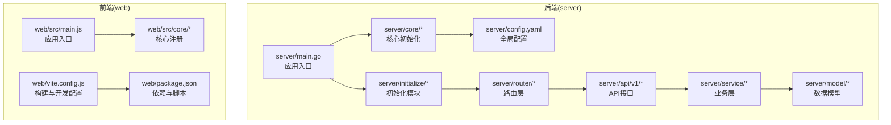
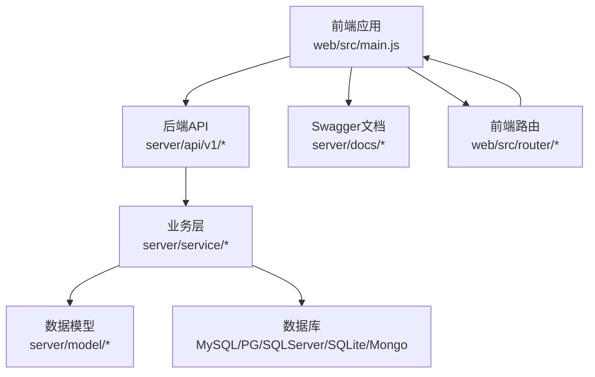
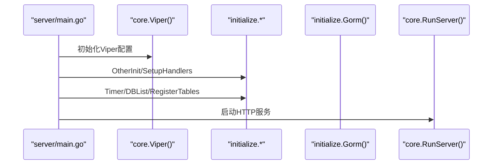
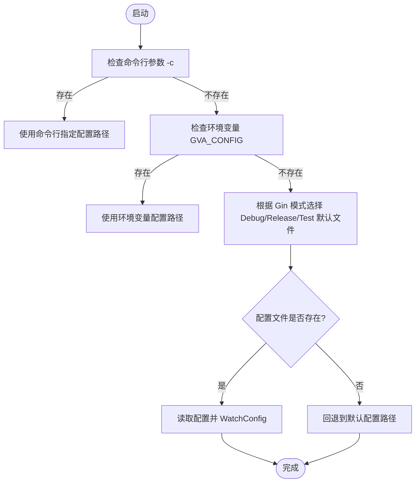
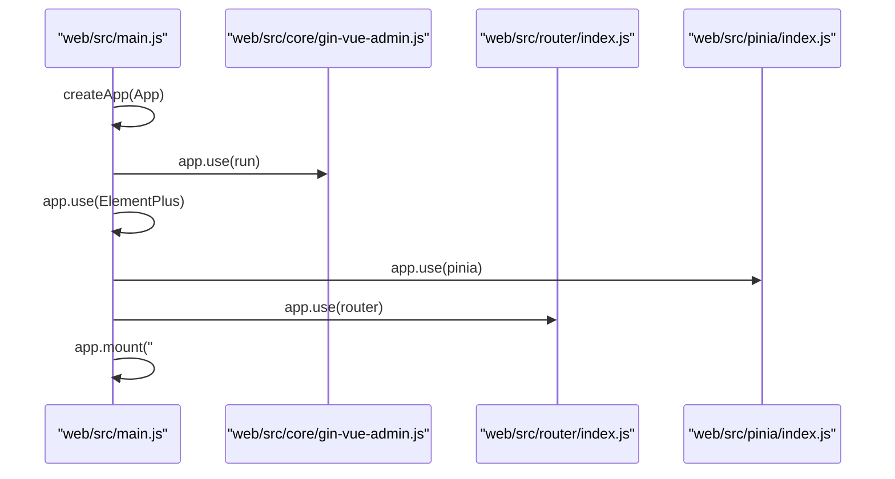
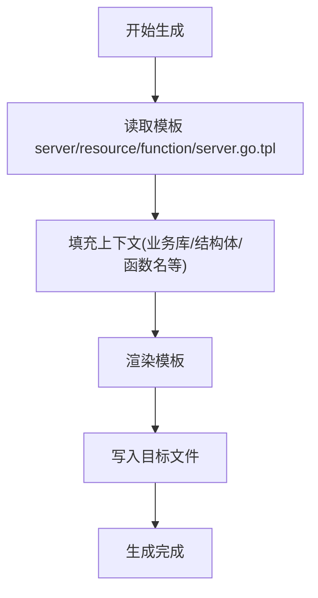

# 开发指南

<cite>
**本文引用的文件**
- [README.md](file://README.md)
- [server/main.go](file://server/main.go)
- [server/go.mod](file://server/go.mod)
- [server/config.yaml](file://server/config.yaml)
- [server/core/viper.go](file://server/core/viper.go)
- [web/package.json](file://web/package.json)
- [web/vite.config.js](file://web/vite.config.js)
- [web/src/main.js](file://web/src/main.js)
- [web/src/core/gin-vue-admin.js](file://web/src/core/gin-vue-admin.js)
- [web/src/core/config.js](file://web/src/core/config.js)
- [Makefile](file://Makefile)
- [CONTRIBUTING.md](file://CONTRIBUTING.md)
- [server/resource/function/server.go.tpl](file://server/resource/function/server.go.tpl)
</cite>

## 目录
1. [简介](#简介)
2. [项目结构](#项目结构)
3. [核心组件](#核心组件)
4. [架构总览](#架构总览)
5. [详细组件分析](#详细组件分析)
6. [依赖分析](#依赖分析)
7. [性能考虑](#性能考虑)
8. [故障排查指南](#故障排查指南)
9. [结论](#结论)
10. [附录](#附录)

## 简介
本开发指南面向测试管理平台的开发者，提供从环境搭建、代码规范、项目结构、开发流程、调试与性能优化到测试策略与代码生成器使用的完整指引。平台采用 Go 语言（后端）与 Vue.js（前端）技术栈，集成 JWT 鉴权、动态路由、代码生成器、Swagger 文档等能力，适合快速搭建中小型项目。

## 项目结构
项目采用前后端分离架构，后端位于 server 目录，前端位于 web 目录；另有 Makefile、Docker 与 Kubernetes 部署脚本，便于本地与容器化构建与发布。

图表来源
- [server/main.go:30-52](file://server/main.go#L30-L52)
- [server/config.yaml:1-284](file://server/config.yaml#L1-L284)
- [web/vite.config.js:15-119](file://web/vite.config.js#L15-L119)
- [web/src/main.js:1-38](file://web/src/main.js#L1-L38)

章节来源
- [README.md:203-302](file://README.md#L203-L302)
- [server/main.go:30-52](file://server/main.go#L30-L52)
- [web/vite.config.js:15-119](file://web/vite.config.js#L15-L119)

## 核心组件
- 应用入口与初始化
  - 后端入口负责初始化配置、日志、数据库、定时任务、全局处理器与表结构注册，并启动服务。
  - 前端入口负责挂载应用、注册 Element Plus、路由、状态管理与指令等。
- 配置系统
  - 后端通过 viper 读取 YAML 配置，支持按环境切换与热更新。
  - 前端通过 Vite 环境变量与代理配置对接后端 API。
- 构建与打包
  - 前端使用 Vite 构建，支持代理、SVG 自动引入、UnoCSS、DevTools 等插件。
  - 后端使用 go build 与 Makefile 提供容器化与本地打包流程。
- 文档与插件
  - Swagger 文档生成与插件市场接入。

章节来源
- [server/main.go:30-52](file://server/main.go#L30-L52)
- [server/core/viper.go:16-77](file://server/core/viper.go#L16-L77)
- [web/src/main.js:21-38](file://web/src/main.js#L21-L38)
- [web/vite.config.js:15-119](file://web/vite.config.js#L15-L119)
- [Makefile:46-76](file://Makefile#L46-L76)

## 架构总览
后端基于 Gin 框架，采用 MVC 分层与初始化模块化设计；前端基于 Vue 3 与 Element Plus，使用 Pinia 管理状态，Vite 提供开发与构建能力。两者通过 Swagger 文档与 API 接口交互。

图表来源
- [server/main.go:30-52](file://server/main.go#L30-L52)
- [web/src/main.js:10-18](file://web/src/main.js#L10-L18)
- [web/vite.config.js:61-78](file://web/vite.config.js#L61-L78)

## 详细组件分析

### 后端初始化流程
后端通过入口函数完成配置、日志、数据库、定时任务、全局处理器与表结构注册，随后启动服务。

图表来源
- [server/main.go:30-52](file://server/main.go#L30-L52)
- [server/core/viper.go:16-42](file://server/core/viper.go#L16-L42)

章节来源
- [server/main.go:30-52](file://server/main.go#L30-L52)
- [server/core/viper.go:16-77](file://server/core/viper.go#L16-L77)

### 配置系统与环境切换
- 后端 viper 优先从命令行参数读取配置文件路径，其次读取环境变量，最后根据 Gin 模式选择默认配置文件，支持热更新。
- 前端通过 Vite 环境变量与代理规则将 API 请求转发至后端。

图表来源
- [server/core/viper.go:44-77](file://server/core/viper.go#L44-L77)

章节来源
- [server/core/viper.go:16-77](file://server/core/viper.go#L16-L77)
- [web/vite.config.js:57-79](file://web/vite.config.js#L57-L79)

### 前端应用启动与核心注册
- 前端入口注册 Element Plus、路由、状态管理、指令与权限守卫，并输出欢迎信息与文档地址提示。

图表来源
- [web/src/main.js:21-38](file://web/src/main.js#L21-L38)
- [web/src/core/gin-vue-admin.js:9-29](file://web/src/core/gin-vue-admin.js#L9-L29)

章节来源
- [web/src/main.js:1-38](file://web/src/main.js#L1-L38)
- [web/src/core/gin-vue-admin.js:1-30](file://web/src/core/gin-vue-admin.js#L1-L30)

### 代码生成器与模板
- 后端提供函数模板，用于生成服务层方法，支持插件与业务库选择。
- 模板通过注释与占位符生成标准结构，便于统一规范。

图表来源
- [server/resource/function/server.go.tpl:1-26](file://server/resource/function/server.go.tpl#L1-L26)

章节来源
- [server/resource/function/server.go.tpl:1-26](file://server/resource/function/server.go.tpl#L1-L26)

## 依赖分析
- 后端依赖
  - Web 框架：Gin
  - ORM：GORM（含多数据库驱动）
  - 缓存：Redis
  - 日志：Zap
  - 鉴权：JWT/Casbin
  - 文档：Swagger
  - 配置：Viper + fsnotify
- 前端依赖
  - 框架：Vue 3
  - UI：Element Plus
  - 状态：Pinia
  - 工具：Axios、ECharts、富文本编辑器、Markdown 渲染等
  - 构建：Vite、UnoCSS、ESLint、DevTools 插件

章节来源
- [server/go.mod:7-61](file://server/go.mod#L7-L61)
- [web/package.json:14-86](file://web/package.json#L14-L86)

## 性能考虑
- 后端
  - 使用 automaxprocs 与 GORM 连接池参数优化并发与资源占用。
  - 启用 Swagger 文档便于接口压测与问题定位。
- 前端
  - Vite 生产构建启用 Terser 压缩与去除 console/debugger，减少体积与运行时开销。
  - 使用 UnoCSS 按需引入样式，避免全局污染。
- 构建与部署
  - Makefile 提供容器化构建与镜像打包，支持多阶段构建与最小化产物。

章节来源
- [server/go.mod:49-50](file://server/go.mod#L49-L50)
- [web/vite.config.js:80-93](file://web/vite.config.js#L80-L93)
- [Makefile:46-76](file://Makefile#L46-L76)

## 故障排查指南
- 配置加载失败
  - 检查命令行参数 -c、环境变量 GVA_CONFIG 与 Gin 模式对应的默认配置文件是否存在。
  - 查看 viper 的 OnConfigChange 输出与 Unmarshal 错误。
- 前端代理无效
  - 确认 VITE_BASE_API、VITE_BASE_PATH、VITE_SERVER_PORT 环境变量正确，代理规则与后端端口一致。
- Swagger 文档未生成
  - 在 server 目录执行 swag 初始化，确保注释标签与入口文件一致。
- 构建失败
  - 检查 Go 与 Node 版本要求，确认依赖安装与构建脚本可用。

章节来源
- [server/core/viper.go:29-37](file://server/core/viper.go#L29-L37)
- [web/vite.config.js:61-78](file://web/vite.config.js#L61-L78)
- [README.md:147-162](file://README.md#L147-L162)
- [Makefile:46-76](file://Makefile#L46-L76)

## 结论
本指南提供了测试管理平台的开发环境搭建、代码规范、项目结构、开发流程、调试与性能优化、测试策略以及代码生成器使用方法的系统性说明。建议开发者遵循统一的配置与构建流程，结合 Swagger 文档与插件机制提升开发效率与质量。

## 附录

### 开发环境搭建
- 后端
  - 使用 GoLand 打开 server 目录，执行 go generate 与 go run . 启动服务。
  - 安装并生成 Swagger 文档。
- 前端
  - 在 web 目录执行 npm install 与 npm run serve 启动开发服务器。
  - 配置 Vite 代理以访问后端 API。

章节来源
- [README.md:115-145](file://README.md#L115-L145)
- [README.md:147-162](file://README.md#L147-L162)

### 代码规范与最佳实践
- Go 语言
  - 使用 gofmt/goimports 统一格式；错误处理遵循“返回 error 并尽早检查”原则；结构体字段与函数命名清晰且语义明确。
- Vue.js 组件开发
  - 组件命名采用 PascalCase；模板结构清晰，避免复杂逻辑；使用 Pinia 管理状态；合理拆分视图与通用组件。
- 命名约定
  - Go：包名小写、结构体首字母大写、方法首字母大写；变量与常量遵循驼峰或下划线风格但保持一致性。
  - Vue：组件文件以 .vue 结尾，API 文件以 .js 结尾，样式文件以 .scss/.css 结尾。

章节来源
- [README.md:86-106](file://README.md#L86-L106)

### 开发流程
- 分支策略
  - PR 提交至 develop 分支，遵循提交信息格式 [文件名]: 描述信息。
- 提交流程
  - Fork 仓库 → 在 develop 分支上创建变更 → 提交 PR → 两位维护者 Review 与合并。

章节来源
- [CONTRIBUTING.md:9-20](file://CONTRIBUTING.md#L9-L20)

### 调试技巧
- 后端
  - 使用 Zap 输出结构化日志；结合 Gin 的 Debug/Release/Test 模式调整日志级别与配置。
- 前端
  - 使用 Vite DevTools 插件与浏览器开发者工具；通过环境变量控制代理与端口。

章节来源
- [server/config.yaml:10-20](file://server/config.yaml#L10-L20)
- [web/vite.config.js:96-115](file://web/vite.config.js#L96-L115)

### 性能优化
- 后端
  - 合理设置数据库连接池参数；启用缓存与限流中间件；使用 Swagger 进行接口性能评估。
- 前端
  - 使用 Vite 的 Tree Shaking 与按需加载；减少不必要的第三方依赖；使用 ECharts 等组件时按需引入。

章节来源
- [server/config.yaml:101-180](file://server/config.yaml#L101-L180)
- [web/vite.config.js:80-93](file://web/vite.config.js#L80-L93)

### 测试策略
- 单元测试
  - 使用 testify 进行断言；为关键服务与工具函数编写测试用例。
- 集成测试
  - 通过 Swagger 文档验证接口行为；使用 Postman 或 curl 进行手工回归。
- 前端测试
  - 使用 Vitest/Jest（如已配置）进行组件与工具函数测试；结合 E2E 工具进行端到端验证。

章节来源
- [server/go.mod:41](file://server/go.mod#L41)

### 代码生成器使用与自定义模板
- 使用
  - 在后端通过模板生成服务层方法，填充上下文后渲染写入目标文件。
- 自定义模板
  - 在 server/resource/function 下新增模板文件，遵循现有占位符与注释规范，确保生成代码符合团队规范。

章节来源
- [server/resource/function/server.go.tpl:1-26](file://server/resource/function/server.go.tpl#L1-L26)

### Git 工作流程与协作
- 分支与 PR
  - 严格遵循 PR 至 develop 分支与双维护者 Review 流程。
- 提交信息
  - 采用 [文件名]: 描述信息 的格式，便于追踪与审计。

章节来源
- [CONTRIBUTING.md:9-20](file://CONTRIBUTING.md#L9-L20)