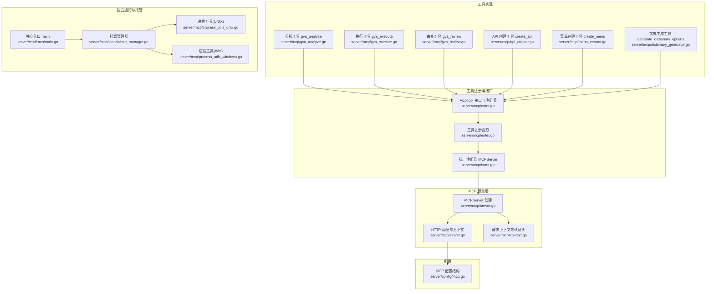
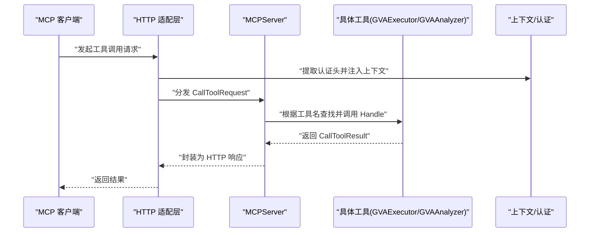
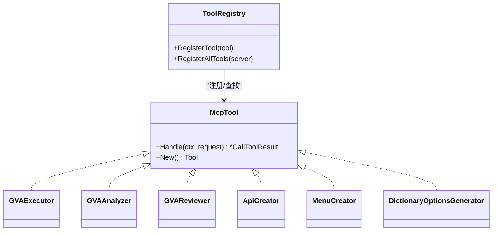
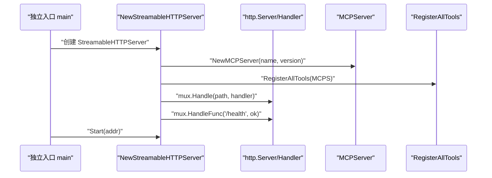
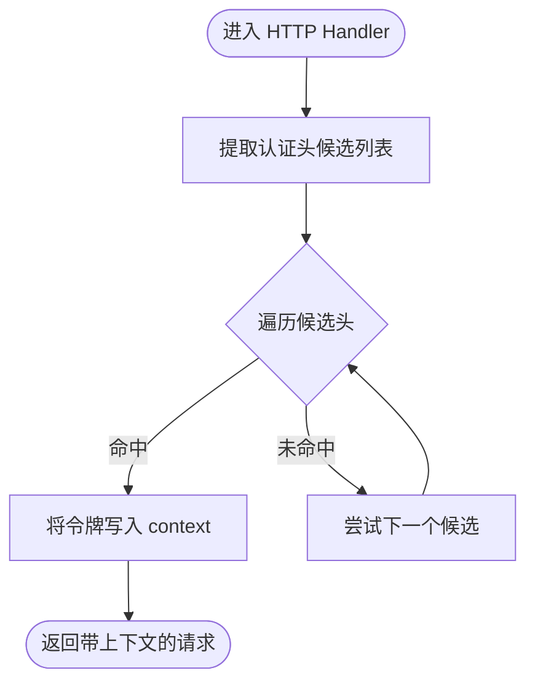
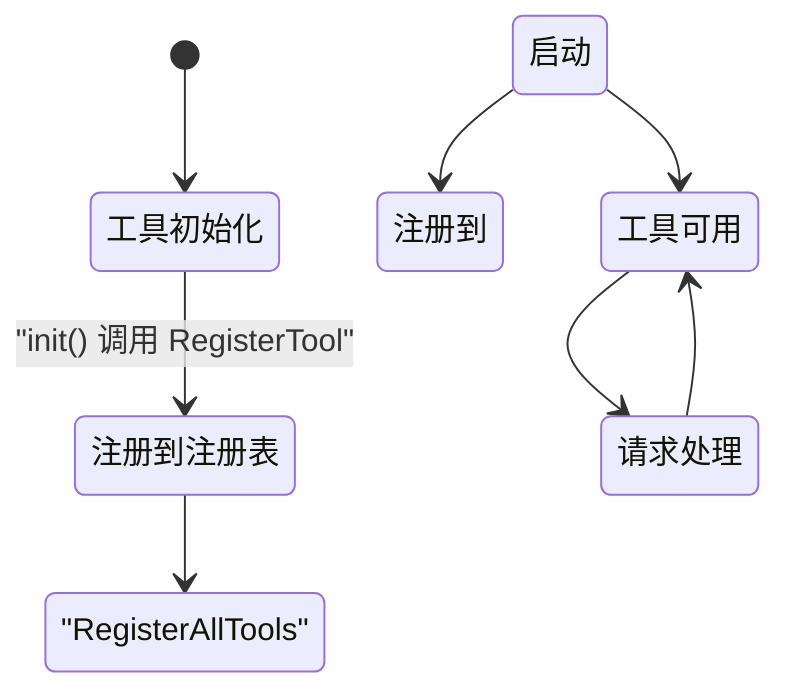
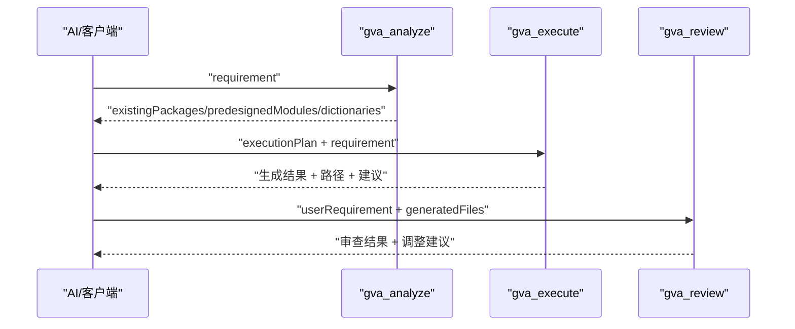
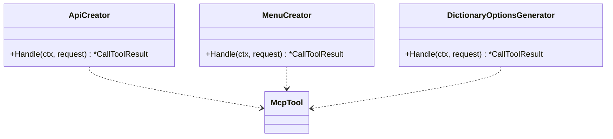
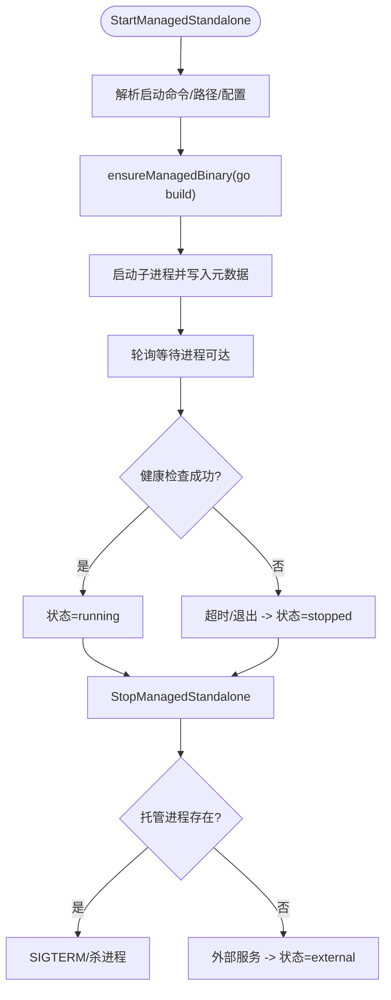
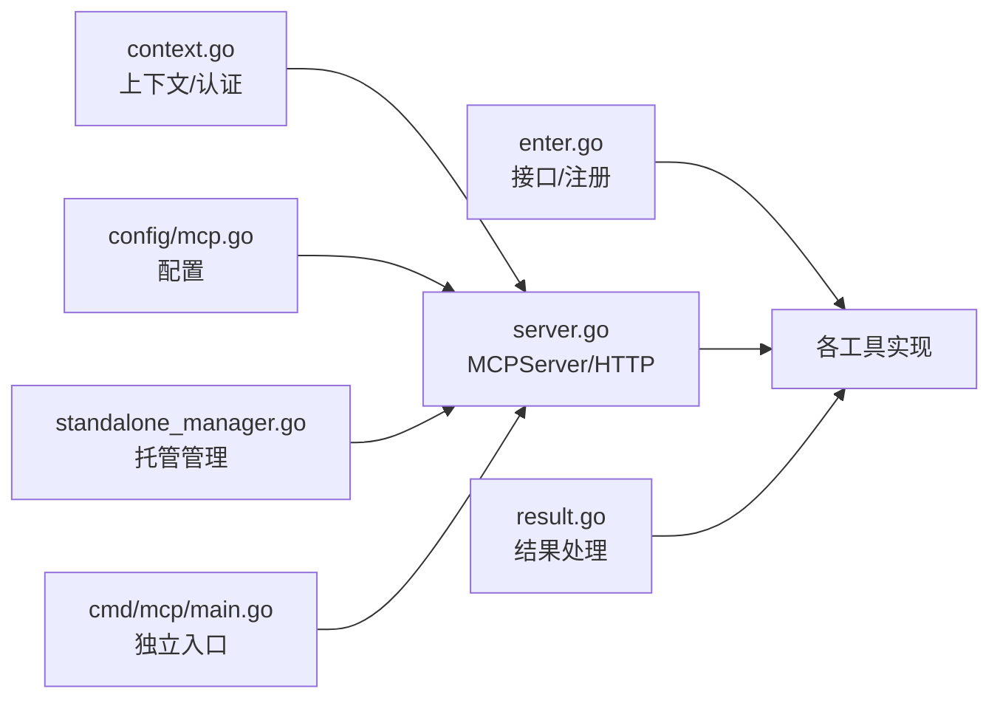

# MCP插件架构

<cite>
**本文引用的文件**
- [server/mcp/enter.go](file://server/mcp/enter.go)
- [server/mcp/server.go](file://server/mcp/server.go)
- [server/mcp/context.go](file://server/mcp/context.go)
- [server/mcp/result.go](file://server/mcp/result.go)
- [server/mcp/gva_analyze.go](file://server/mcp/gva_analyze.go)
- [server/mcp/gva_execute.go](file://server/mcp/gva_execute.go)
- [server/mcp/gva_review.go](file://server/mcp/gva_review.go)
- [server/mcp/api_creator.go](file://server/mcp/api_creator.go)
- [server/mcp/menu_creator.go](file://server/mcp/menu_creator.go)
- [server/mcp/dictionary_generator.go](file://server/mcp/dictionary_generator.go)
- [server/mcp/standalone_manager.go](file://server/mcp/standalone_manager.go)
- [server/cmd/mcp/main.go](file://server/cmd/mcp/main.go)
- [server/config/mcp.go](file://server/config/mcp.go)
- [server/mcp/process_utils_unix.go](file://server/mcp/process_utils_unix.go)
- [server/mcp/process_utils_windows.go](file://server/mcp/process_utils_windows.go)
</cite>

## 目录
1. [简介](#简介)
2. [项目结构](#项目结构)
3. [核心组件](#核心组件)
4. [架构总览](#架构总览)
5. [详细组件分析](#详细组件分析)
6. [依赖关系分析](#依赖关系分析)
7. [性能考量](#性能考量)
8. [故障排查指南](#故障排查指南)
9. [结论](#结论)
10. [附录](#附录)

## 简介
本文件面向开发者，系统化阐述基于 Model Context Protocol（MCP）的插件架构设计与实现。文档聚焦以下主题：
- McpTool 接口定义与工具注册机制
- MCPServer 启动流程与插件生命周期管理
- 工具注册表工作机制与插件间通信
- 插件上下文管理与结果处理
- 基于工具链的代码生成与审查流程

通过架构图与代码级示意图，帮助读者快速理解整体设计思路与技术实现细节。

## 项目结构
围绕 MCP 的核心代码主要位于 server/mcp 目录，配合独立运行入口 server/cmd/mcp 与配置结构 server/config/mcp.go。关键模块职责如下：
- 插件接口与注册：定义 McpTool 接口、工具注册表与统一注册函数
- 服务器与上下文：封装 MCPServer 创建、HTTP 适配、请求上下文注入与认证头提取
- 工具实现：分析、执行、审查、API/菜单/字典生成等工具
- 独立运行与托管：独立进程启动、健康检查、进程生命周期管理
- 配置：MCP 服务名称、版本、监听地址、路径、上游地址、认证头等

**图表来源**
- [server/mcp/server.go:11-52](file://server/mcp/server.go#L11-L52)
- [server/mcp/context.go:15-66](file://server/mcp/context.go#L15-L66)
- [server/mcp/enter.go:9-31](file://server/mcp/enter.go#L9-L31)
- [server/mcp/gva_analyze.go:16-19](file://server/mcp/gva_analyze.go#L16-L19)
- [server/mcp/gva_execute.go:17-19](file://server/mcp/gva_execute.go#L17-L19)
- [server/mcp/gva_review.go:16-19](file://server/mcp/gva_review.go#L16-L19)
- [server/mcp/api_creator.go:15-17](file://server/mcp/api_creator.go#L15-L17)
- [server/mcp/menu_creator.go:13-15](file://server/mcp/menu_creator.go#L13-L15)
- [server/mcp/dictionary_generator.go:13-15](file://server/mcp/dictionary_generator.go#L13-L15)
- [server/mcp/standalone_manager.go:142-198](file://server/mcp/standalone_manager.go#L142-L198)
- [server/cmd/mcp/main.go:12-35](file://server/cmd/mcp/main.go#L12-L35)
- [server/config/mcp.go:3-18](file://server/config/mcp.go#L3-L18)
- [server/mcp/process_utils_unix.go:11-24](file://server/mcp/process_utils_unix.go#L11-L24)
- [server/mcp/process_utils_windows.go:16-40](file://server/mcp/process_utils_windows.go#L16-L40)

**章节来源**
- [server/mcp/server.go:11-52](file://server/mcp/server.go#L11-L52)
- [server/mcp/context.go:15-66](file://server/mcp/context.go#L15-L66)
- [server/mcp/enter.go:9-31](file://server/mcp/enter.go#L9-L31)
- [server/mcp/gva_analyze.go:16-19](file://server/mcp/gva_analyze.go#L16-L19)
- [server/mcp/gva_execute.go:17-19](file://server/mcp/gva_execute.go#L17-L19)
- [server/mcp/gva_review.go:16-19](file://server/mcp/gva_review.go#L16-L19)
- [server/mcp/api_creator.go:15-17](file://server/mcp/api_creator.go#L15-L17)
- [server/mcp/menu_creator.go:13-15](file://server/mcp/menu_creator.go#L13-L15)
- [server/mcp/dictionary_generator.go:13-15](file://server/mcp/dictionary_generator.go#L13-L15)
- [server/mcp/standalone_manager.go:142-198](file://server/mcp/standalone_manager.go#L142-L198)
- [server/cmd/mcp/main.go:12-35](file://server/cmd/mcp/main.go#L12-L35)
- [server/config/mcp.go:3-18](file://server/config/mcp.go#L3-L18)
- [server/mcp/process_utils_unix.go:11-24](file://server/mcp/process_utils_unix.go#L11-L24)
- [server/mcp/process_utils_windows.go:16-40](file://server/mcp/process_utils_windows.go#L16-L40)

## 核心组件
- McpTool 接口：定义 Handle(ctx, request) 与 New() 两个方法，分别负责工具调用与元数据注册。
- 工具注册表：全局 map[string]McpTool，按工具名索引工具实例。
- 统一注册：RegisterAllTools 将注册表中的工具一次性注册到 MCPServer。
- 上下文与认证：WithHTTPRequestContext 将请求头中的认证令牌注入 context，支持多种候选头名。
- 结果处理：textResultWithJSON 将任意负载序列化为 JSON 文本内容，便于 MCP 客户端消费。

**章节来源**
- [server/mcp/enter.go:9-31](file://server/mcp/enter.go#L9-L31)
- [server/mcp/context.go:15-66](file://server/mcp/context.go#L15-L66)
- [server/mcp/result.go:10-29](file://server/mcp/result.go#L10-L29)

## 架构总览
MCP 插件架构采用“工具即服务”的思想：每个工具实现 McpTool 接口并通过 init() 注册到全局注册表；MCPServer 在启动时统一注册这些工具；HTTP 层负责将请求转换为 MCP 请求并注入上下文（含认证令牌）；工具 Handle 中完成业务逻辑并返回标准化结果。

**图表来源**
- [server/mcp/server.go:25-51](file://server/mcp/server.go#L25-L51)
- [server/mcp/context.go:15-66](file://server/mcp/context.go#L15-L66)
- [server/mcp/enter.go:26-31](file://server/mcp/enter.go#L26-L31)
- [server/mcp/gva_execute.go:217-289](file://server/mcp/gva_execute.go#L217-L289)
- [server/mcp/gva_analyze.go:85-115](file://server/mcp/gva_analyze.go#L85-L115)

## 详细组件分析

### McpTool 接口与注册机制
- 接口定义：McpTool 暴露 Handle(ctx, request) 与 New()，前者处理业务，后者返回工具元数据（名称、描述、参数 Schema 等）。
- 注册表：全局 map 以工具名作为键，避免重复注册与命名冲突。
- 注册流程：工具在 init() 中调用 RegisterTool(tool)，最终由 RegisterAllTools 将工具注册到 MCPServer。

**图表来源**
- [server/mcp/enter.go:9-31](file://server/mcp/enter.go#L9-L31)
- [server/mcp/gva_execute.go:17-19](file://server/mcp/gva_execute.go#L17-L19)
- [server/mcp/gva_analyze.go:16-19](file://server/mcp/gva_analyze.go#L16-L19)
- [server/mcp/gva_review.go:16-19](file://server/mcp/gva_review.go#L16-L19)
- [server/mcp/api_creator.go:15-17](file://server/mcp/api_creator.go#L15-L17)
- [server/mcp/menu_creator.go:13-15](file://server/mcp/menu_creator.go#L13-L15)
- [server/mcp/dictionary_generator.go:13-15](file://server/mcp/dictionary_generator.go#L13-L15)

**章节来源**
- [server/mcp/enter.go:9-31](file://server/mcp/enter.go#L9-L31)

### MCPServer 启动流程与 HTTP 适配
- NewMCPServer：从全局配置读取服务名与版本，创建 MCPServer 实例，并注册全部工具。
- NewStreamableHTTPServer：创建 ServeMux 与 http.Server，包装 StreamableHTTPServer，注入 WithHTTPRequestContext，挂载工具路径与健康检查端点。
- 路径与健康：默认路径为 /mcp，健康检查 /health 返回 200。

**图表来源**
- [server/mcp/server.go:11-52](file://server/mcp/server.go#L11-L52)
- [server/cmd/mcp/main.go:22-35](file://server/cmd/mcp/main.go#L22-L35)

**章节来源**
- [server/mcp/server.go:11-52](file://server/mcp/server.go#L11-L52)
- [server/cmd/mcp/main.go:22-35](file://server/cmd/mcp/main.go#L22-L35)

### 插件上下文管理与认证
- WithHTTPRequestContext：从请求头提取认证令牌，支持配置项与常见头名（x-token、token、authorization），并将令牌放入 context。
- ConfiguredAuthHeader：返回配置的认证头名（默认 x-token）。
- 使用场景：工具 Handle 可从 context 中读取令牌，用于鉴权或审计。

**图表来源**
- [server/mcp/context.go:36-66](file://server/mcp/context.go#L36-L66)

**章节来源**
- [server/mcp/context.go:15-66](file://server/mcp/context.go#L15-L66)

### 工具注册表与插件生命周期
- 注册阶段：各工具在 init() 中调用 RegisterTool，将自身加入全局注册表。
- 启动阶段：NewMCPServer 调用 RegisterAllTools，将工具元数据与处理器注册到 MCPServer。
- 生命周期：工具实例随 MCPServer 存活；HTTP 适配层贯穿请求生命周期，注入上下文并转发给工具。

**图表来源**
- [server/mcp/enter.go:17-31](file://server/mcp/enter.go#L17-L31)
- [server/mcp/server.go:19-22](file://server/mcp/server.go#L19-L22)

**章节来源**
- [server/mcp/enter.go:17-31](file://server/mcp/enter.go#L17-L31)
- [server/mcp/server.go:19-22](file://server/mcp/server.go#L19-L22)

### 工具链：分析-执行-审查
- gva_analyze：扫描现有包、模块与字典，清理空包，输出现有资产与清理建议。
- gva_execute：根据执行计划直接生成代码（包、模块、字典），返回生成路径与后续动作建议。
- gva_review：接收用户需求与生成文件列表，输出审查结果与调整建议。

**图表来源**
- [server/mcp/gva_analyze.go:85-115](file://server/mcp/gva_analyze.go#L85-L115)
- [server/mcp/gva_execute.go:217-289](file://server/mcp/gva_execute.go#L217-L289)
- [server/mcp/gva_review.go:80-140](file://server/mcp/gva_review.go#L80-L140)

**章节来源**
- [server/mcp/gva_analyze.go:85-115](file://server/mcp/gva_analyze.go#L85-L115)
- [server/mcp/gva_execute.go:217-289](file://server/mcp/gva_execute.go#L217-L289)
- [server/mcp/gva_review.go:80-140](file://server/mcp/gva_review.go#L80-L140)

### 辅助工具：API/菜单/字典生成
- create_api：创建后端 API 记录并返回 API ID 与查询结果。
- create_menu：创建前端菜单记录并返回菜单 ID。
- generate_dictionary_options：根据字段描述与选项生成字典及字典详情。

**图表来源**
- [server/mcp/api_creator.go:65-159](file://server/mcp/api_creator.go#L65-L159)
- [server/mcp/menu_creator.go:114-216](file://server/mcp/menu_creator.go#L114-L216)
- [server/mcp/dictionary_generator.go:64-102](file://server/mcp/dictionary_generator.go#L64-L102)

**章节来源**
- [server/mcp/api_creator.go:65-159](file://server/mcp/api_creator.go#L65-L159)
- [server/mcp/menu_creator.go:114-216](file://server/mcp/menu_creator.go#L114-L216)
- [server/mcp/dictionary_generator.go:64-102](file://server/mcp/dictionary_generator.go#L64-L102)

### 独立运行与托管管理
- 独立入口：server/cmd/mcp/main.go 读取配置、初始化日志，创建 StreamableHTTPServer 并启动。
- 托管管理：standalone_manager.go 提供托管进程的启动、停止、健康检查、元数据持久化与二进制构建。
- 进程工具：process_utils_unix.go 与 process_utils_windows.go 提供跨平台进程控制。

**图表来源**
- [server/mcp/standalone_manager.go:142-198](file://server/mcp/standalone_manager.go#L142-L198)
- [server/mcp/standalone_manager.go:242-269](file://server/mcp/standalone_manager.go#L242-L269)
- [server/mcp/standalone_manager.go:295-353](file://server/mcp/standalone_manager.go#L295-L353)
- [server/mcp/process_utils_unix.go:11-24](file://server/mcp/process_utils_unix.go#L11-L24)
- [server/mcp/process_utils_windows.go:16-40](file://server/mcp/process_utils_windows.go#L16-L40)
- [server/cmd/mcp/main.go:12-35](file://server/cmd/mcp/main.go#L12-L35)

**章节来源**
- [server/mcp/standalone_manager.go:142-198](file://server/mcp/standalone_manager.go#L142-L198)
- [server/mcp/standalone_manager.go:242-269](file://server/mcp/standalone_manager.go#L242-L269)
- [server/mcp/standalone_manager.go:295-353](file://server/mcp/standalone_manager.go#L295-L353)
- [server/mcp/process_utils_unix.go:11-24](file://server/mcp/process_utils_unix.go#L11-L24)
- [server/mcp/process_utils_windows.go:16-40](file://server/mcp/process_utils_windows.go#L16-L40)
- [server/cmd/mcp/main.go:12-35](file://server/cmd/mcp/main.go#L12-L35)

## 依赖关系分析
- 组件耦合：工具实现依赖 McpTool 接口与注册表；MCPServer 依赖工具元数据与处理器；HTTP 适配依赖上下文注入。
- 外部依赖：mcp-go 的 server 与 mcp 包用于协议实现与消息结构；全局配置与日志库用于运行时行为控制。
- 循环依赖：未见循环依赖迹象；工具通过接口与注册表解耦。

**图表来源**
- [server/mcp/enter.go:9-31](file://server/mcp/enter.go#L9-L31)
- [server/mcp/server.go:11-52](file://server/mcp/server.go#L11-L52)
- [server/mcp/context.go:15-66](file://server/mcp/context.go#L15-L66)
- [server/mcp/result.go:10-29](file://server/mcp/result.go#L10-L29)
- [server/config/mcp.go:3-18](file://server/config/mcp.go#L3-L18)
- [server/mcp/standalone_manager.go:142-198](file://server/mcp/standalone_manager.go#L142-L198)
- [server/cmd/mcp/main.go:12-35](file://server/cmd/mcp/main.go#L12-L35)

**章节来源**
- [server/mcp/enter.go:9-31](file://server/mcp/enter.go#L9-L31)
- [server/mcp/server.go:11-52](file://server/mcp/server.go#L11-L52)
- [server/mcp/context.go:15-66](file://server/mcp/context.go#L15-L66)
- [server/mcp/result.go:10-29](file://server/mcp/result.go#L10-L29)
- [server/config/mcp.go:3-18](file://server/config/mcp.go#L3-L18)
- [server/mcp/standalone_manager.go:142-198](file://server/mcp/standalone_manager.go#L142-L198)
- [server/cmd/mcp/main.go:12-35](file://server/cmd/mcp/main.go#L12-L35)

## 性能考量
- 工具注册：注册表为内存 map，注册与查找均为 O(1)，开销极低。
- HTTP 适配：使用标准库 ServeMux 与 http.Server，路径与处理器映射简单高效。
- 结果序列化：textResultWithJSON 使用缩进序列化，便于阅读但会增加体积；在高吞吐场景可考虑压缩或流式输出。
- 独立运行：托管管理器在启动与停止时进行多次系统调用与文件 IO，建议在生产环境使用二进制而非每次 go build。

[本节为通用性能讨论，不直接分析具体文件]

## 故障排查指南
- 工具未注册：检查工具 init() 是否调用 RegisterTool；确认 RegisterAllTools 已被调用。
- 认证失败：核对请求头中是否包含配置的认证头名；确认 WithHTTPRequestContext 正常提取令牌。
- 健康检查失败：检查 /health 端点是否可达；确认监听地址与路径配置正确。
- 独立进程异常：查看托管日志文件；确认二进制构建成功；检查进程 PID 与元数据文件。

**章节来源**
- [server/mcp/enter.go:17-31](file://server/mcp/enter.go#L17-L31)
- [server/mcp/context.go:36-66](file://server/mcp/context.go#L36-L66)
- [server/mcp/server.go:46-49](file://server/mcp/server.go#L46-L49)
- [server/mcp/standalone_manager.go:242-269](file://server/mcp/standalone_manager.go#L242-L269)

## 结论
本架构以 McpTool 接口为核心，通过注册表与统一注册机制实现工具的动态发现与装配；借助 StreamableHTTPServer 与上下文注入，完成 MCP 协议与业务逻辑的桥接；结合分析-执行-审查的工具链，形成从需求到代码再到质量保障的闭环。独立运行与托管管理进一步增强了部署灵活性与可观测性。

[本节为总结性内容，不直接分析具体文件]

## 附录
- 配置项说明（来自 server/config/mcp.go）：
  - name：服务名称
  - version：服务版本
  - path：工具端点路径（默认 /mcp）
  - addr：监听端口
  - base_url：服务基础 URL
  - upstream_base_url：上游服务基础 URL
  - auth_header：认证头名称（默认 x-token）
  - request_timeout：请求超时（秒）

**章节来源**
- [server/config/mcp.go:3-18](file://server/config/mcp.go#L3-L18)