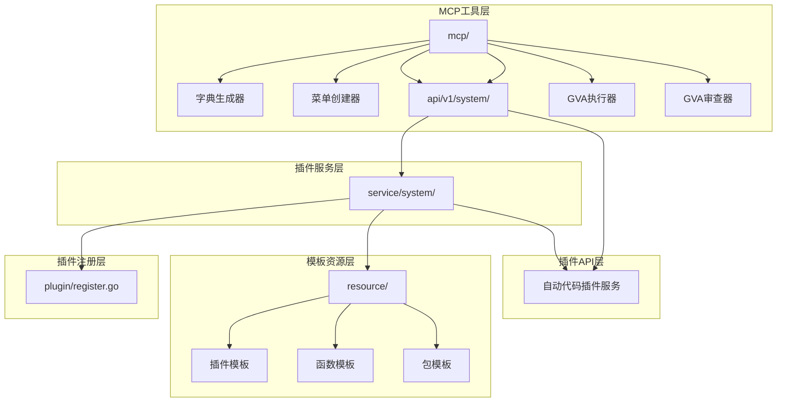
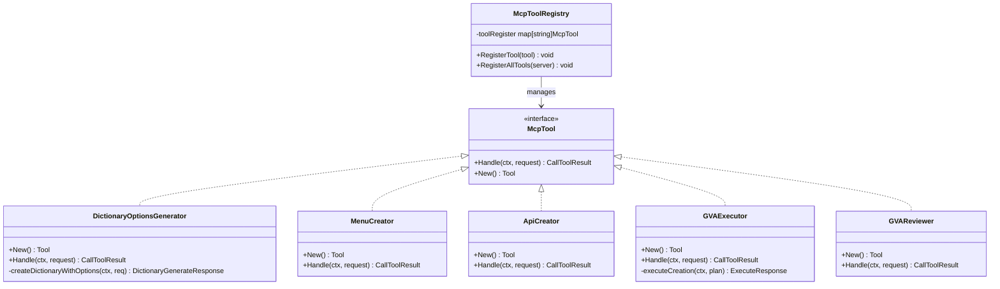
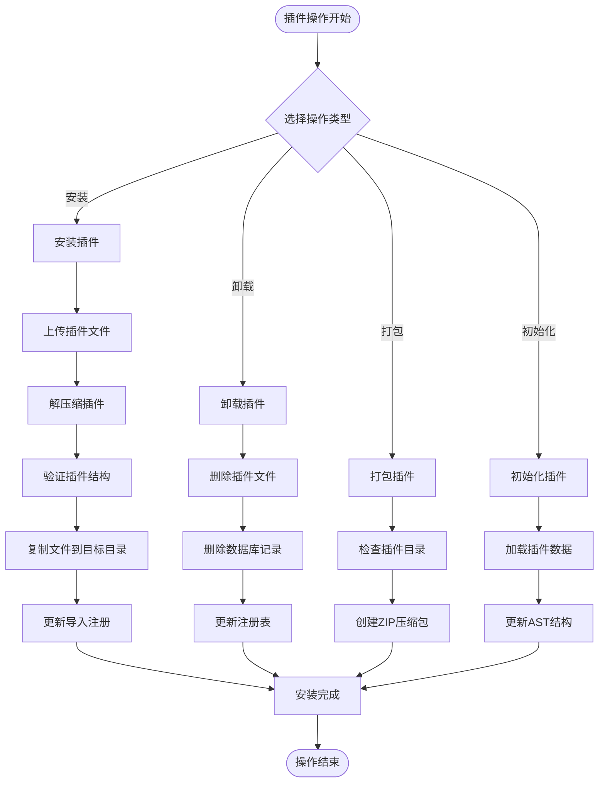
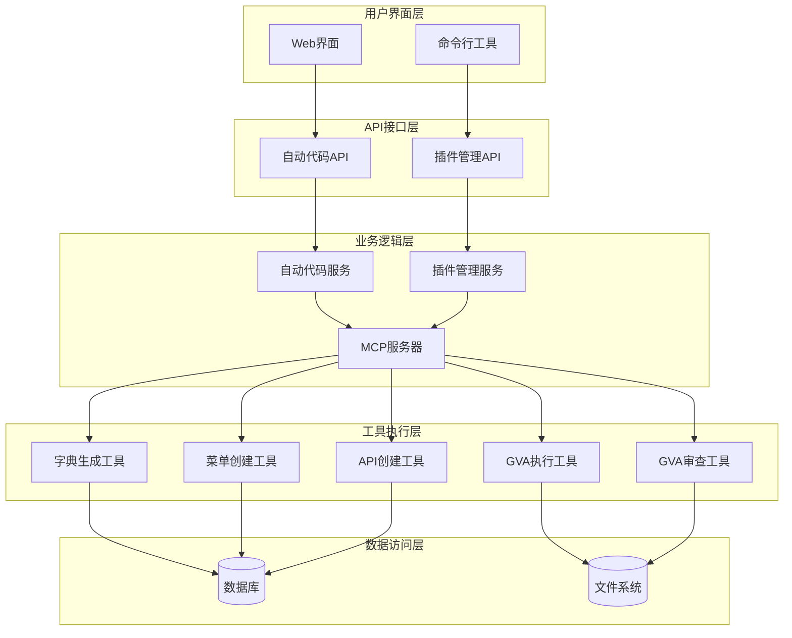
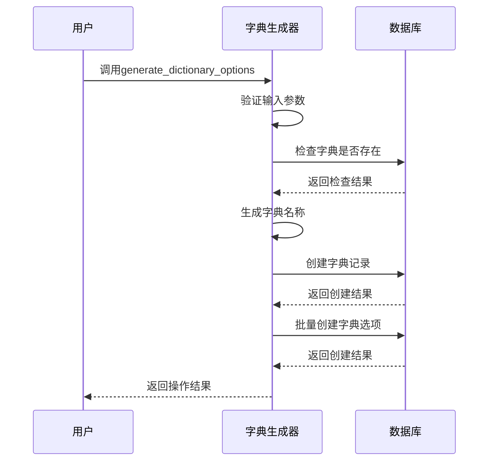
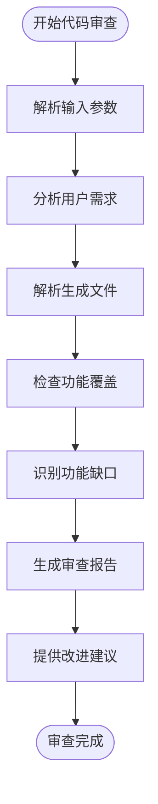
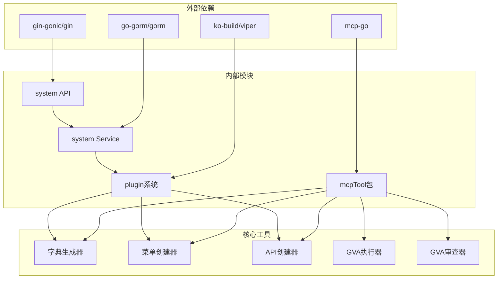
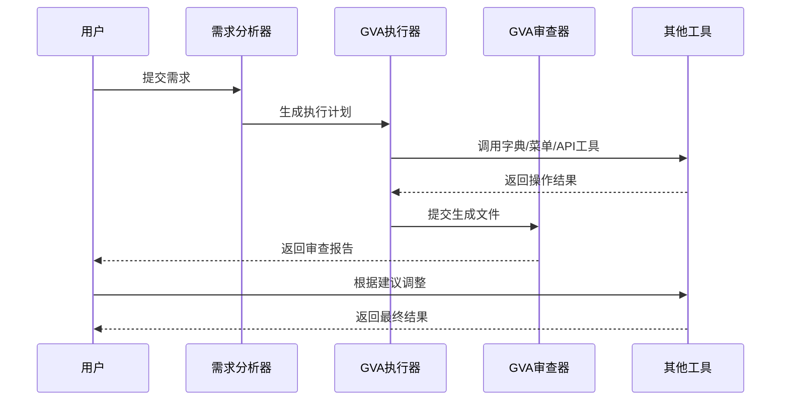

# 内置插件功能

<cite>
**本文档引用的文件**
- [dictionary_generator.go](file://server/mcp/dictionary_generator.go)
- [menu_creator.go](file://server/mcp/menu_creator.go)
- [api_creator.go](file://server/mcp/api_creator.go)
- [gva_execute.go](file://server/mcp/gva_execute.go)
- [gva_review.go](file://server/mcp/gva_review.go)
- [enter.go](file://server/mcp/enter.go)
- [context.go](file://server/mcp/context.go)
- [result.go](file://server/mcp/result.go)
- [auto_code_plugin.go](file://server/api/v1/system/auto_code_plugin.go)
- [auto_code_plugin.go](file://server/service/system/auto_code_plugin.go)
- [plugin.go.tpl](file://server/resource/plugin/server/plugin.go.tpl)
- [view.vue.tpl](file://server/resource/plugin/web/view/view.vue.tpl)
- [register.go](file://server/plugin/register.go)
</cite>

## 目录
1. [简介](#简介)
2. [项目结构](#项目结构)
3. [核心组件](#核心组件)
4. [架构概览](#架构概览)
5. [详细组件分析](#详细组件分析)
6. [依赖关系分析](#依赖关系分析)
7. [性能考虑](#性能考虑)
8. [故障排除指南](#故障排除指南)
9. [结论](#结论)
10. [附录](#附录)

## 简介

测试管理平台的内置插件功能是一个强大的自动化代码生成和管理系统，旨在简化开发者的工作流程，提高开发效率。该系统提供了多种内置插件，包括代码生成器、字典管理器、菜单生成器等工具，能够自动创建和管理应用程序的各种组件。

这些插件采用MCP（Model Context Protocol）协议，允许AI助手与系统进行智能交互，实现自动化代码生成、API创建、菜单管理和字典管理等功能。系统支持插件的安装、卸载、打包和初始化，为开发者提供了一个完整的插件生态系统。

## 项目结构

测试管理平台的内置插件功能主要分布在以下几个关键目录中：



**图表来源**
- [dictionary_generator.go:1-175](file://server/mcp/dictionary_generator.go#L1-L175)
- [menu_creator.go:1-229](file://server/mcp/menu_creator.go#L1-L229)
- [api_creator.go:1-160](file://server/mcp/api_creator.go#L1-L160)
- [auto_code_plugin.go:1-219](file://server/api/v1/system/auto_code_plugin.go#L1-L219)

**章节来源**
- [dictionary_generator.go:1-175](file://server/mcp/dictionary_generator.go#L1-L175)
- [menu_creator.go:1-229](file://server/mcp/menu_creator.go#L1-L229)
- [api_creator.go:1-160](file://server/mcp/api_creator.go#L1-L160)
- [auto_code_plugin.go:1-219](file://server/api/v1/system/auto_code_plugin.go#L1-L219)

## 核心组件

### MCP工具注册系统

MCP工具注册系统是整个插件功能的核心基础设施，负责管理所有可用的工具和它们的生命周期。



**图表来源**
- [enter.go:9-31](file://server/mcp/enter.go#L9-L31)
- [dictionary_generator.go:17-62](file://server/mcp/dictionary_generator.go#L17-L62)
- [menu_creator.go:53-112](file://server/mcp/menu_creator.go#L53-L112)
- [api_creator.go:34-63](file://server/mcp/api_creator.go#L34-L63)

### 插件管理系统

插件管理系统负责插件的安装、卸载、打包和初始化操作，为开发者提供完整的插件生命周期管理。



**图表来源**
- [auto_code_plugin.go:33-129](file://server/service/system/auto_code_plugin.go#L33-L129)
- [auto_code_plugin.go:225-275](file://server/service/system/auto_code_plugin.go#L225-L275)

**章节来源**
- [enter.go:1-32](file://server/mcp/enter.go#L1-L32)
- [auto_code_plugin.go:1-219](file://server/api/v1/system/auto_code_plugin.go#L1-L219)
- [auto_code_plugin.go:1-513](file://server/service/system/auto_code_plugin.go#L1-L513)

## 架构概览

测试管理平台的内置插件功能采用分层架构设计，确保了系统的可扩展性和可维护性。



**图表来源**
- [gva_execute.go:16-215](file://server/mcp/gva_execute.go#L16-L215)
- [gva_review.go:13-78](file://server/mcp/gva_review.go#L13-L78)

## 详细组件分析

### 字典管理器

字典管理器是专门用于智能生成字典选项并自动创建字典和字典详情的工具。它能够根据用户提供的字段描述自动生成合适的字典选项，并确保字典的唯一性和完整性。

#### 功能特性

- **智能字典生成**：根据字段描述自动生成字典选项
- **唯一性检查**：自动检查字典类型是否已存在
- **批量选项创建**：支持一次性创建多个字典选项
- **自动命名**：根据字段描述自动生成字典名称

#### 输入输出格式

**输入参数**
- `dictType` (string, 必需): 字典类型，用于标识字典的唯一性
- `fieldDesc` (string, 必需): 字段描述，用于AI理解字段含义
- `options` (string, 必需): 字典选项JSON字符串，格式：`[{"label":"显示名","value":"值","sort":1}]`
- `dictName` (string): 字典名称，如果不提供将自动生成
- `description` (string): 字典描述

**输出结果**
- `success` (boolean): 操作是否成功
- `message` (string): 操作结果描述
- `dictType` (string): 字典类型
- `optionsCount` (integer): 创建的选项数量

#### 使用示例



**图表来源**
- [dictionary_generator.go:64-102](file://server/mcp/dictionary_generator.go#L64-L102)
- [dictionary_generator.go:104-160](file://server/mcp/dictionary_generator.go#L104-L160)

**章节来源**
- [dictionary_generator.go:1-175](file://server/mcp/dictionary_generator.go#L1-L175)

### 菜单生成器

菜单生成器用于创建前端菜单记录，支持AI编辑器自动添加前端页面时自动创建对应的菜单项。它提供了完整的菜单配置选项，包括路由路径、组件路径、显示标题、图标等。

#### 功能特性

- **完整菜单配置**：支持所有菜单属性的配置
- **路由参数支持**：支持菜单参数的动态配置
- **按钮权限管理**：支持菜单按钮的权限配置
- **层级结构管理**：支持父子菜单关系的建立

#### 输入输出格式

**输入参数**
- `parentId` (number): 父菜单ID，0表示根菜单
- `path` (string, 必需): 路由path，如：userList
- `name` (string, 必需): 路由name，用于Vue Router
- `hidden` (boolean): 是否在菜单列表中隐藏
- `component` (string, 必需): 对应的前端Vue组件路径
- `sort` (number): 菜单排序号，数字越小越靠前
- `title` (string, 必需): 菜单显示标题
- `icon` (string): 菜单图标名称
- `keepAlive` (boolean): 是否缓存页面
- `defaultMenu` (boolean): 是否是基础路由
- `closeTab` (boolean): 是否自动关闭tab
- `activeName` (string): 高亮菜单名称
- `parameters` (string): 路由参数JSON字符串
- `menuBtn` (string): 菜单按钮JSON字符串

**输出结果**
- `success` (boolean): 操作是否成功
- `message` (string): 操作结果描述
- `menuId` (number): 创建的菜单ID
- `name` (string): 菜单名称
- `path` (string): 路由路径

#### 使用场景

菜单生成器主要用于以下场景：
1. 单独创建菜单（不涉及模块创建）
2. AI编辑器自动添加前端页面时
3. 需要精确控制菜单配置的情况

**章节来源**
- [menu_creator.go:1-229](file://server/mcp/menu_creator.go#L1-L229)

### API创建器

API创建器用于创建后端API记录，支持AI编辑器自动添加API接口时自动创建对应的API权限记录。它提供了批量创建API的功能，支持单个和批量API的创建操作。

#### 功能特性

- **批量API创建**：支持单个和批量API的创建
- **完整API配置**：支持所有API属性的配置
- **权限自动分配**：自动创建API权限记录
- **灵活的参数格式**：支持多种参数传递方式

#### 输入输出格式

**输入参数**
- `path` (string, 必需): API路径，如：/user/create
- `description` (string, 必需): API中文描述，如：创建用户
- `apiGroup` (string, 必需): API组名称，用于分类管理
- `method` (string): HTTP方法，默认POST
- `apis` (string): 批量创建API的JSON字符串

**批量API格式**
```json
[
  {
    "path": "/user/create",
    "description": "创建用户",
    "apiGroup": "用户管理",
    "method": "POST"
  },
  {
    "path": "/user/list",
    "description": "获取用户列表",
    "apiGroup": "用户管理",
    "method": "GET"
  }
]
```

**输出结果**
- `success` (boolean): 操作是否成功
- `totalCount` (number): 总API数量
- `successCount` (number): 成功创建数量
- `failedCount` (number): 失败数量
- `details` (array): 详细结果列表

#### 使用场景

API创建器主要用于以下场景：
1. 单独创建API（不涉及模块创建）
2. AI编辑器自动添加API
3. router下的文件产生路径变化时

**章节来源**
- [api_creator.go:1-160](file://server/mcp/api_creator.go#L1-L160)

### GVA执行器

GVA执行器是最核心的代码生成工具，能够直接执行代码生成而无需确认步骤。它支持批量创建多个模块、自动创建包、模块、字典等，是整个插件系统的大脑。

#### 功能特性

- **直接执行模式**：无需确认步骤，直接生成代码
- **批量模块创建**：支持同时创建多个模块
- **智能包管理**：自动创建和管理包结构
- **字典自动创建**：根据字段配置自动创建字典

#### 执行计划结构

**执行计划参数**
- `packageName` (string): 包名（小写开头）
- `packageType` (string): package 或 plugin
- `needCreatedPackage` (boolean): 是否需要创建包
- `needCreatedModules` (boolean): 是否需要创建模块
- `needCreatedDictionaries` (boolean): 是否需要创建字典
- `packageInfo` (object): 包创建信息
- `modulesInfo` (array): 模块配置列表
- `paths` (object): 生成的文件路径映射
- `dictionariesInfo` (array): 字典创建信息

#### 输出结果

**执行响应**
- `success` (boolean): 执行是否成功
- `message` (string): 执行结果描述
- `packageId` (number): 包ID
- `historyId` (number): 历史ID
- `paths` (object): 文件路径映射
- `generatedPaths` (array): 生成的文件路径列表
- `nextActions` (array): 下一步操作建议

#### 使用场景

GVA执行器主要用于以下场景：
1. 在需求分析完成后直接生成代码
2. 自动化代码生成流程
3. 批量创建复杂的业务模块

**章节来源**
- [gva_execute.go:1-751](file://server/mcp/gva_execute.go#L1-L751)

### GVA审查器

GVA审查器用于在代码生成后进行质量审查，确保生成的代码满足用户的需求和业务逻辑。它接收经过需求分析处理的用户需求和生成的文件列表，提供详细的审查报告和改进建议。

#### 功能特性

- **需求匹配分析**：分析生成代码是否满足用户需求
- **功能完整性检查**：检查模块间的关联关系和交互功能
- **代码质量评估**：提供代码优化和完善的建议
- **详细审查报告**：生成结构化的审查结果

#### 输入输出格式

**输入参数**
- `userRequirement` (string, 必需): 经过需求分析处理的用户需求描述
- `generatedFiles` (string, 必需): 生成的文件列表JSON字符串

**输出结果**
- `success` (boolean): 审查是否成功
- `message` (string): 审查结果消息
- `adjustmentPrompt` (string): 调整代码的提示
- `reviewDetails` (string): 详细的审查结果

#### 审查流程



**图表来源**
- [gva_review.go:80-140](file://server/mcp/gva_review.go#L80-L140)

**章节来源**
- [gva_review.go:1-171](file://server/mcp/gva_review.go#L1-L171)

## 依赖关系分析

测试管理平台的内置插件功能具有清晰的依赖关系，确保了系统的稳定性和可维护性。



**图表来源**
- [dictionary_generator.go:3-11](file://server/mcp/dictionary_generator.go#L3-L11)
- [menu_creator.go:3-11](file://server/mcp/menu_creator.go#L3-L11)
- [api_creator.go:3-12](file://server/mcp/api_creator.go#L3-L12)

### 工具协作关系

各个工具之间存在紧密的协作关系，形成了完整的插件生态系统：



**图表来源**
- [gva_execute.go:217-289](file://server/mcp/gva_execute.go#L217-L289)
- [gva_review.go:80-140](file://server/mcp/gva_review.go#L80-L140)

**章节来源**
- [enter.go:1-32](file://server/mcp/enter.go#L1-L32)
- [context.go:1-67](file://server/mcp/context.go#L1-L67)
- [result.go:1-30](file://server/mcp/result.go#L1-L30)

## 性能考虑

内置插件功能在设计时充分考虑了性能优化，采用了多种策略来确保系统的高效运行：

### 并发处理
- **异步操作**：支持并发执行多个插件操作
- **连接池管理**：数据库连接采用连接池技术
- **文件I/O优化**：批量文件操作减少磁盘I/O次数

### 内存管理
- **流式处理**：大文件采用流式处理避免内存溢出
- **垃圾回收优化**：合理控制对象生命周期
- **缓存机制**：常用数据采用内存缓存

### 网络优化
- **HTTP客户端复用**：MCP工具调用使用连接复用
- **超时控制**：设置合理的超时时间
- **重试机制**：网络异常时自动重试

## 故障排除指南

### 常见问题及解决方案

**插件安装失败**
- 检查插件文件格式是否正确
- 确认目标目录权限是否足够
- 验证插件依赖关系是否完整

**字典创建冲突**
- 检查字典类型是否已存在
- 验证字段描述的准确性
- 确认字典选项格式是否正确

**API创建权限不足**
- 检查用户权限配置
- 验证API路径的唯一性
- 确认API组的正确性

**菜单创建失败**
- 检查路由路径的有效性
- 验证组件文件的存在性
- 确认父菜单ID的正确性

### 调试技巧

1. **启用详细日志**：查看系统日志获取详细错误信息
2. **参数验证**：确保所有必需参数都已正确提供
3. **依赖检查**：验证相关依赖服务的可用性
4. **权限验证**：确认用户具有执行操作的权限

**章节来源**
- [dictionary_generator.go:64-102](file://server/mcp/dictionary_generator.go#L64-L102)
- [menu_creator.go:114-216](file://server/mcp/menu_creator.go#L114-L216)
- [api_creator.go:65-159](file://server/mcp/api_creator.go#L65-L159)

## 结论

测试管理平台的内置插件功能提供了一个完整、强大且易于使用的自动化代码生成和管理系统。通过集成多种专用工具，该系统能够显著提高开发效率，减少重复性工作，并确保代码质量和一致性。

主要优势包括：
- **高度自动化**：支持从需求分析到代码生成的全流程自动化
- **灵活配置**：提供丰富的配置选项满足不同场景需求
- **强扩展性**：基于MCP协议的设计便于功能扩展
- **完整生态**：包含插件管理、代码生成、质量审查等完整功能

未来发展方向：
- 增强AI辅助功能，提供更智能的代码生成建议
- 扩展插件生态系统，支持更多第三方插件
- 优化性能表现，支持更大规模的代码生成任务
- 加强与其他开发工具的集成能力

## 附录

### 快速开始指南

1. **环境准备**：确保系统满足最低配置要求
2. **安装插件**：通过Web界面或命令行安装所需插件
3. **配置参数**：根据项目需求配置插件参数
4. **执行操作**：启动插件执行相应的功能
5. **验证结果**：检查生成的代码和配置是否符合预期

### 最佳实践

- **版本管理**：定期备份插件配置和生成的代码
- **权限控制**：合理设置用户权限，防止误操作
- **监控告警**：建立监控机制及时发现异常情况
- **文档维护**：保持插件使用文档的及时更新