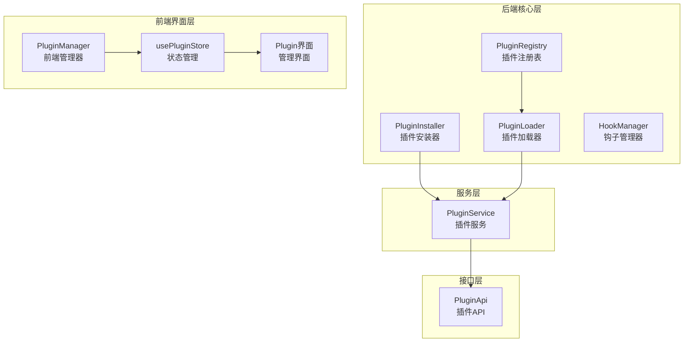
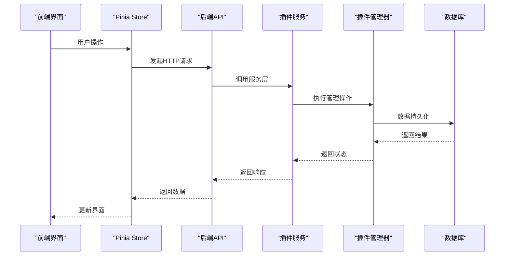
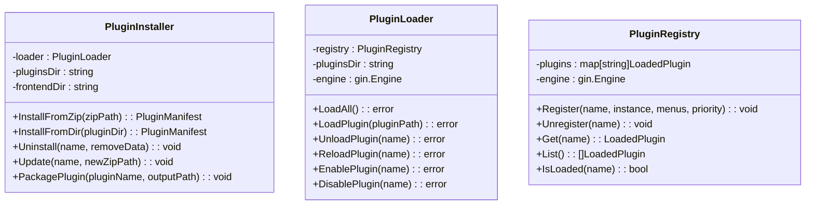
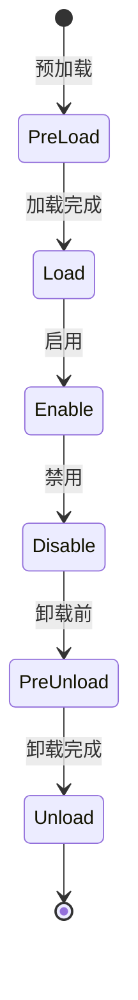
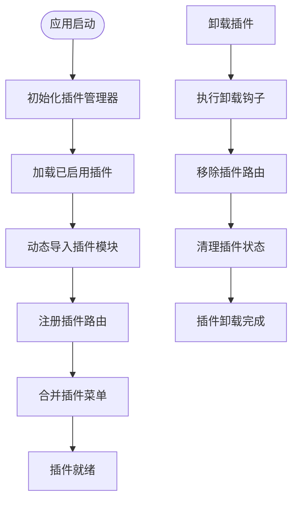
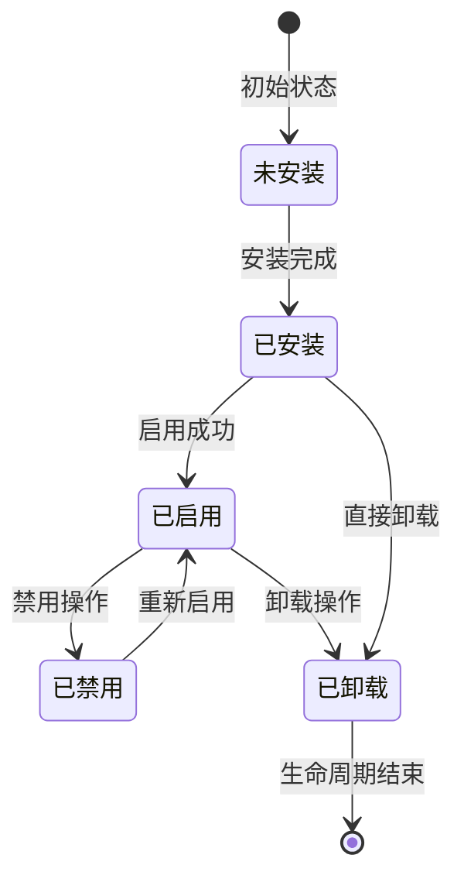
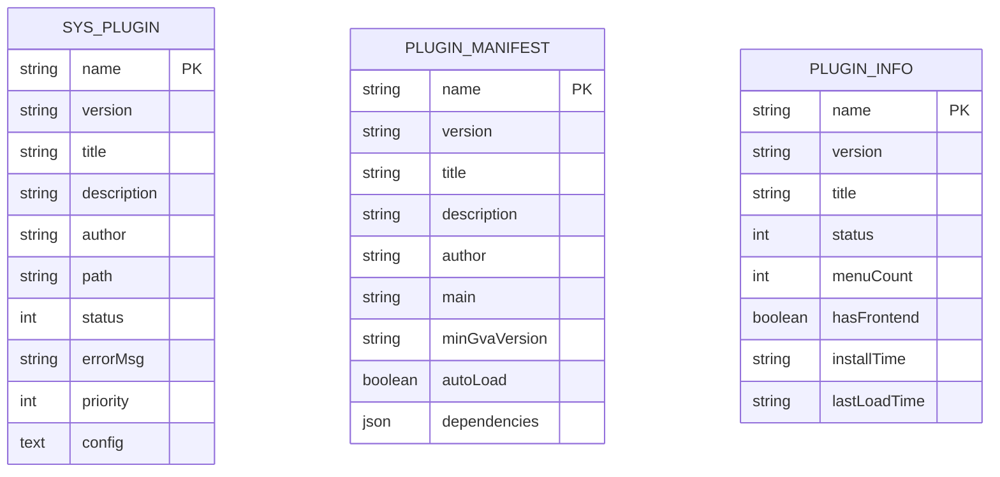
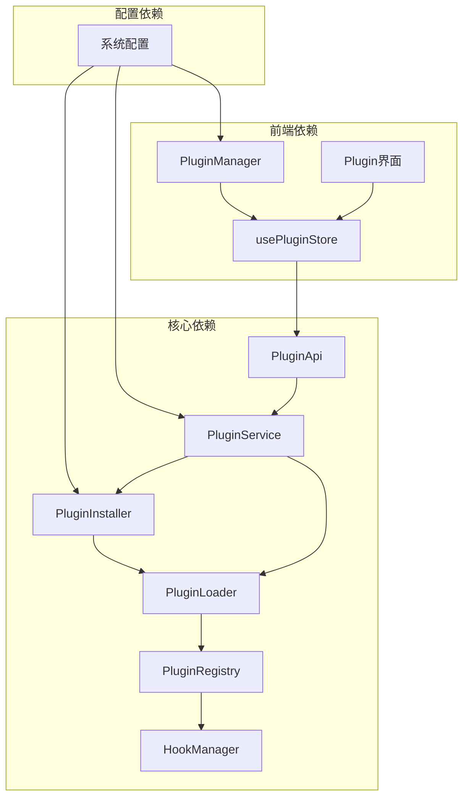

# 插件管理

<cite>
**本文档引用的文件**
- [server\plugin\manager\installer.go](file://server/plugin/manager/installer.go)
- [server\plugin\manager\loader.go](file://server/plugin/manager/loader.go)
- [server\plugin\manager\registry.go](file://server/plugin/manager/registry.go)
- [server\plugin\manager\hooks\hooks.go](file://server/plugin/manager/hooks/hooks.go)
- [server\api\v1\system\sys_plugin.go](file://server/api/v1/system/sys_plugin.go)
- [server\service\system\plugin_service.go](file://server/service/system/plugin_service.go)
- [server\model\system\sys_plugin.go](file://server/model/system/sys_plugin.go)
- [web\src\plugin\manager.js](file://web/src/plugin/manager.js)
- [web\src\pinia\modules\plugin.js](file://web/src/pinia/modules/plugin.js)
- [web\src\api\plugin.js](file://web/src/api/plugin.js)
- [web\src\view\systemTools\plugin\index.vue](file://web/src/view/systemTools/plugin/index.vue)
- [web\src\plugin\demo-plugin\index.js](file://web/src/plugin/demo-plugin/index.js)
</cite>

## 更新摘要
**所做更改**
- 新增完整的插件生命周期管理功能分析
- 添加前端插件管理界面详细说明
- 补充插件安装器、加载器和注册表的完整实现
- 增加钩子系统和热更新机制说明
- 更新插件管理API接口和数据库模型

## 目录
1. [简介](#简介)
2. [项目结构](#项目结构)
3. [核心组件](#核心组件)
4. [架构总览](#架构总览)
5. [详细组件分析](#详细组件分析)
6. [插件生命周期管理](#插件生命周期管理)
7. [前端插件管理界面](#前端插件管理界面)
8. [插件API接口](#插件api接口)
9. [依赖关系分析](#依赖关系分析)
10. [性能与可扩展性](#性能与可扩展性)
11. [故障排查指南](#故障排查指南)
12. [结论](#结论)
13. [附录](#附录)

## 简介
本文档全面阐述测试管理平台的插件管理体系，涵盖完整的插件生命周期管理（安装、卸载、启用、禁用、更新、重载等），前端插件管理界面，插件配置管理、版本控制与依赖解析机制，插件市场使用方法，命令行工具与API接口，热更新与故障恢复策略，以及权限与安全控制。文档基于仓库现有实现进行深入分析，通过详细的架构图和代码示例帮助开发者快速理解和使用插件系统。

## 项目结构
插件体系采用"接口层 + 管理器层 + 服务层 + 前端界面层"的多层架构设计，支持完整的插件生命周期管理：



**图表来源**
- [server\plugin\manager\installer.go:17-31](file://server/plugin/manager/installer.go#L17-L31)
- [server\plugin\manager\loader.go:20-34](file://server/plugin/manager/loader.go#L20-L34)
- [server\plugin\manager\registry.go:21-50](file://server/plugin/manager/registry.go#L21-L50)
- [server\plugin\manager\hooks\hooks.go:26-36](file://server/plugin/manager/hooks/hooks.go#L26-L36)
- [server\service\system\plugin_service.go:13-38](file://server/service/system/plugin_service.go#L13-L38)
- [server\api\v1\system\sys_plugin.go:15-21](file://server/api/v1/system/sys_plugin.go#L15-L21)
- [web\src\plugin\manager.js:10-18](file://web/src/plugin/manager.js#L10-L18)
- [web\src\pinia\modules\plugin.js:6-12](file://web/src/pinia/modules/plugin.js#L6-L12)
- [web\src\view\systemTools\plugin\index.vue:1-314](file://web/src/view/systemTools/plugin/index.vue#L1-L314)

## 核心组件
- **插件安装器（PluginInstaller）**
  - 支持从ZIP包和目录安装插件
  - 自动处理插件清单、依赖关系和版本兼容性
  - 提供安装回滚和错误处理机制
  
- **插件加载器（PluginLoader）**
  - 负责插件的动态加载和卸载
  - 管理插件的生命周期和状态转换
  - 支持优先级排序和依赖检查
  
- **插件注册表（PluginRegistry）**
  - 维护已加载插件的全局状态
  - 提供插件查询、菜单管理和配置存储
  - 支持插件间的依赖关系追踪
  
- **钩子系统（HookManager）**
  - 提供插件生命周期事件通知
  - 支持预加载、加载、卸载等钩子类型
  - 实现插件间通信和协作机制

**章节来源**
- [server\plugin\manager\installer.go:17-120](file://server/plugin/manager/installer.go#L17-L120)
- [server\plugin\manager\loader.go:20-135](file://server/plugin/manager/loader.go#L20-L135)
- [server\plugin\manager\registry.go:21-101](file://server/plugin/manager/registry.go#L21-L101)
- [server\plugin\manager\hooks\hooks.go:26-107](file://server/plugin/manager/hooks/hooks.go#L26-L107)

## 架构总览
插件系统采用分层架构设计，实现前后端分离的完整插件管理：



**图表来源**
- [web\src\view\systemTools\plugin\index.vue:151-162](file://web/src/view/systemTools/plugin/index.vue#L151-L162)
- [web\src\pinia\modules\plugin.js:14-27](file://web/src/pinia/modules/plugin.js#L14-L27)
- [server\api\v1\system\sys_plugin.go:30-49](file://server/api/v1/system/sys_plugin.go#L30-L49)
- [server\service\system\plugin_service.go:40-75](file://server/service/system/plugin_service.go#L40-L75)

## 详细组件分析

### 组件A：插件安装器实现
插件安装器负责处理插件的安装、更新和卸载操作，提供完整的生命周期管理：



**图表来源**
- [server\plugin\manager\installer.go:17-505](file://server/plugin/manager/installer.go#L17-L505)
- [server\plugin\manager\loader.go:20-533](file://server/plugin/manager/loader.go#L20-L533)
- [server\plugin\manager\registry.go:21-431](file://server/plugin/manager/registry.go#L21-L431)

**章节来源**
- [server\plugin\manager\installer.go:33-120](file://server/plugin/manager/installer.go#L33-L120)
- [server\plugin\manager\loader.go:79-135](file://server/plugin/manager/loader.go#L79-L135)
- [server\plugin\manager\registry.go:57-101](file://server/plugin/manager/registry.go#L57-L101)

### 组件B：钩子系统与事件管理
钩子系统提供插件生命周期事件的通知机制，支持插件间的通信和协作：



**图表来源**
- [server\plugin\manager\hooks\hooks.go:8-21](file://server/plugin/manager/hooks/hooks.go#L8-L21)
- [server\plugin\manager\hooks\hooks.go:194-227](file://server/plugin/manager/hooks/hooks.go#L194-L227)

**章节来源**
- [server\plugin\manager\hooks\hooks.go:11-21](file://server/plugin/manager/hooks/hooks.go#L11-L21)
- [server\plugin\manager\hooks\hooks.go:194-227](file://server/plugin/manager/hooks/hooks.go#L194-L227)

### 组件C：前端插件管理器
前端插件管理器负责动态加载和卸载插件的前端代码，实现热插拔功能：



**图表来源**
- [web\src\plugin\manager.js:23-34](file://web/src/plugin/manager.js#L23-L34)
- [web\src\plugin\manager.js:54-97](file://web/src/plugin/manager.js#L54-L97)
- [web\src\plugin\manager.js:144-175](file://web/src/plugin/manager.js#L144-L175)

**章节来源**
- [web\src\plugin\manager.js:10-18](file://web/src/plugin/manager.js#L10-L18)
- [web\src\plugin\manager.js:54-97](file://web/src/plugin/manager.js#L54-L97)
- [web\src\plugin\manager.js:144-175](file://web/src/plugin/manager.js#L144-L175)

## 插件生命周期管理

### 生命周期状态转换
插件在系统中经历完整的生命周期状态转换：



**图表来源**
- [server\model\system\sys_plugin.go:7-14](file://server/model/system/sys_plugin.go#L7-L14)
- [server\service\system\plugin_service.go:189-226](file://server/service/system/plugin_service.go#L189-L226)

### 安装流程详解
完整的插件安装流程包含多个验证和处理步骤：

1. **文件验证**：检查ZIP包格式和完整性
2. **清单解析**：读取plugin.json并验证插件信息
3. **依赖检查**：验证插件依赖关系
4. **版本兼容**：检查GVA版本兼容性
5. **文件复制**：将插件文件复制到目标目录
6. **数据库记录**：保存插件元数据到数据库
7. **自动加载**：根据配置自动加载插件

**章节来源**
- [server\plugin\manager\installer.go:33-120](file://server/plugin/manager/installer.go#L33-L120)
- [server\plugin\manager\loader.go:264-277](file://server/plugin/manager/loader.go#L264-L277)

### 卸载与更新机制
插件的卸载和更新操作都具备完善的回滚和错误处理机制：

- **卸载流程**：安全移除插件文件、清理数据库记录、卸载前端代码
- **更新流程**：备份配置、卸载旧版本、安装新版本、恢复配置
- **回滚机制**：更新失败时自动回滚到上一个稳定版本

**章节来源**
- [server\plugin\manager\installer.go:122-164](file://server/plugin/manager/installer.go#L122-L164)
- [server\plugin\manager\installer.go:166-236](file://server/plugin/manager/installer.go#L166-L236)

## 前端插件管理界面

### 管理界面功能
前端插件管理界面提供完整的插件管理操作：

```mermaid
graph TB
subgraph "插件管理界面"
INSTALL["安装插件<br/>ZIP上传"]
ENABLE["启用插件"]
DISABLE["禁用插件"]
RELOAD["重载插件"]
UNINSTALL["卸载插件"]
CONFIG["配置插件"]
UPDATE["更新插件"]
MARKET["插件市场"]
end
subgraph "状态显示"
STATUS["插件状态"]
VERSION["版本信息"]
AUTHOR["作者信息"]
DESC["描述信息"]
MENU_COUNT["菜单数量"]
END
INSTALL --> STATUS
ENABLE --> STATUS
DISABLE --> STATUS
RELOAD --> STATUS
UNINSTALL --> STATUS
CONFIG --> STATUS
UPDATE --> STATUS
MARKET --> STATUS
```

**图表来源**
- [web\src\view\systemTools\plugin\index.vue:25-72](file://web/src/view/systemTools/plugin/index.vue#L25-L72)
- [web\src\view\systemTools\plugin\index.vue:194-272](file://web/src/view/systemTools/plugin/index.vue#L194-L272)

### 插件状态管理
插件状态通过Pinia状态管理器进行集中管理：

- **插件列表**：实时获取和显示所有插件信息
- **加载状态**：跟踪已启用插件的前端加载状态
- **当前插件**：维护当前选中的插件上下文
- **异步加载**：支持插件的异步加载和卸载

**章节来源**
- [web\src\pinia\modules\plugin.js:6-139](file://web/src/pinia/modules/plugin.js#L6-L139)
- [web\src\view\systemTools\plugin\index.vue:121-162](file://web/src/view/systemTools/plugin/index.vue#L121-L162)

### 插件热更新机制
前端插件支持热更新功能，实现无重启的插件更新：

- **动态导入**：使用ES6动态导入实现插件的按需加载
- **路由管理**：插件卸载时自动移除对应的路由
- **状态清理**：卸载时清理插件的状态和实例
- **菜单合并**：插件启用时动态合并菜单到系统

**章节来源**
- [web\src\plugin\manager.js:54-97](file://web/src/plugin/manager.js#L54-L97)
- [web\src\plugin\manager.js:144-175](file://web/src/plugin/manager.js#L144-L175)

## 插件API接口

### 后端API接口
后端提供完整的RESTful API接口支持插件管理：

| 接口 | 方法 | 路径 | 功能描述 |
|------|------|------|----------|
| 获取插件列表 | GET | /plugin/list | 获取所有插件信息 |
| 安装插件 | POST | /plugin/install | 从ZIP包安装插件 |
| 卸载插件 | DELETE | /plugin/uninstall/{name} | 卸载指定插件 |
| 启用插件 | POST | /plugin/enable/{name} | 启用指定插件 |
| 禁用插件 | POST | /plugin/disable/{name} | 禁用指定插件 |
| 重载插件 | POST | /plugin/reload/{name} | 重载指定插件 |
| 更新插件 | POST | /plugin/update/{name} | 更新插件版本 |
| 获取插件配置 | GET | /plugin/config/{name} | 获取插件配置 |
| 更新插件配置 | PUT | /plugin/config | 更新插件配置 |

**章节来源**
- [server\api\v1\system\sys_plugin.go:23-604](file://server/api/v1/system/sys_plugin.go#L23-L604)

### 前端API封装
前端通过Axios封装了所有插件相关的API调用：

- **请求拦截器**：自动添加认证令牌和错误处理
- **响应拦截器**：统一处理响应状态和错误信息
- **API函数**：提供简洁的JavaScript函数接口
- **类型定义**：完整的TypeScript类型定义

**章节来源**
- [web\src\api\plugin.js:1-249](file://web/src/api/plugin.js#L1-L249)

### 数据库模型设计
插件系统使用标准化的数据库模型存储插件信息：



**图表来源**
- [server\model\system\sys_plugin.go:16-32](file://server/model/system/sys_plugin.go#L16-L32)
- [server\model\system\sys_plugin.go:34-50](file://server/model/system/sys_plugin.go#L34-L50)
- [server\model\system\sys_plugin.go:63-77](file://server/model/system/sys_plugin.go#L63-L77)

**章节来源**
- [server\model\system\sys_plugin.go:16-95](file://server/model/system/sys_plugin.go#L16-L95)

## 依赖关系分析
插件系统各组件之间存在清晰的依赖关系：



**图表来源**
- [server\service\system\plugin_service.go:21-38](file://server/service/system/plugin_service.go#L21-L38)
- [web\src\plugin\manager.js:6-8](file://web/src/plugin/manager.js#L6-L8)
- [web\src\pinia\modules\plugin.js:3-4](file://web/src/pinia/modules/plugin.js#L3-L4)

**章节来源**
- [server\service\system\plugin_service.go:21-38](file://server/service/system/plugin_service.go#L21-L38)
- [web\src\plugin\manager.js:6-8](file://web/src/plugin/manager.js#L6-L8)
- [web\src\pinia\modules\plugin.js:3-4](file://web/src/pinia/modules/plugin.js#L3-L4)

## 性能与可扩展性
插件系统在设计时充分考虑了性能和可扩展性：

- **并发安全**：使用读写锁保护插件注册表，避免并发访问冲突
- **懒加载**：插件采用按需加载策略，减少启动时间和内存占用
- **缓存机制**：前端插件实例和状态进行缓存，提升切换性能
- **异步处理**：所有插件操作都支持异步执行，避免阻塞主线程
- **插件隔离**：每个插件都有独立的命名空间和状态管理

## 故障排查指南

### 常见问题及解决方案
- **插件安装失败**：检查ZIP包完整性、插件清单格式和依赖关系
- **插件启用失败**：验证插件版本兼容性和依赖检查
- **插件卸载异常**：确认插件未被其他组件引用，检查文件权限
- **前端插件加载失败**：检查插件入口文件格式和路由配置
- **钩子事件未触发**：验证钩子注册和事件类型是否正确

### 调试工具和日志
- **后端日志**：详细的插件操作日志和错误信息
- **前端调试**：浏览器开发者工具中的插件状态监控
- **数据库检查**：插件状态和配置的数据库一致性检查
- **网络监控**：API调用的网络请求和响应分析

**章节来源**
- [server\plugin\manager\installer.go:33-120](file://server/plugin/manager/installer.go#L33-L120)
- [web\src\plugin\manager.js:93-96](file://web/src/plugin/manager.js#L93-L96)

## 结论
测试管理平台的插件系统经过重构和完善，现已形成完整的插件生命周期管理体系。通过后端的安装器、加载器和注册表，以及前端的管理器和界面，实现了从安装到卸载的全流程自动化管理。钩子系统的引入使得插件间能够进行有效的通信和协作，而热更新机制则提供了无缝的用户体验。该系统具有良好的扩展性，为未来的插件生态建设奠定了坚实的基础。

## 附录

### 插件开发规范
- **清单文件**：必须包含完整的plugin.json清单文件
- **入口导出**：前端插件必须导出标准的插件接口
- **错误处理**：插件必须提供完善的错误处理和回退机制
- **配置管理**：支持插件配置的动态更新和持久化

### 最佳实践建议
- **版本管理**：严格遵循语义化版本控制
- **依赖声明**：明确定义插件间的依赖关系
- **性能优化**：避免插件对系统性能造成负面影响
- **安全考虑**：确保插件代码的安全性和可靠性

### 技术演进方向
- **插件市场**：建立在线插件市场和版本管理
- **依赖解析**：实现自动化的依赖解析和冲突解决
- **热更新增强**：支持更精细的热更新粒度控制
- **监控告警**：建立插件运行状态的监控和告警机制