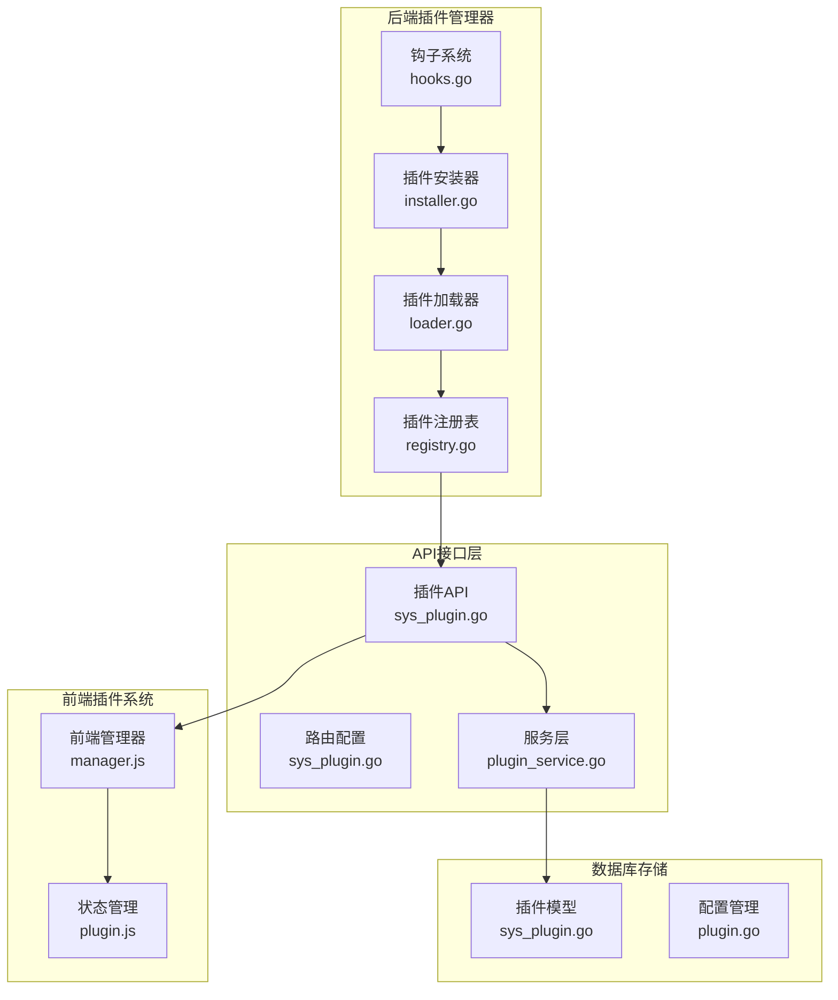
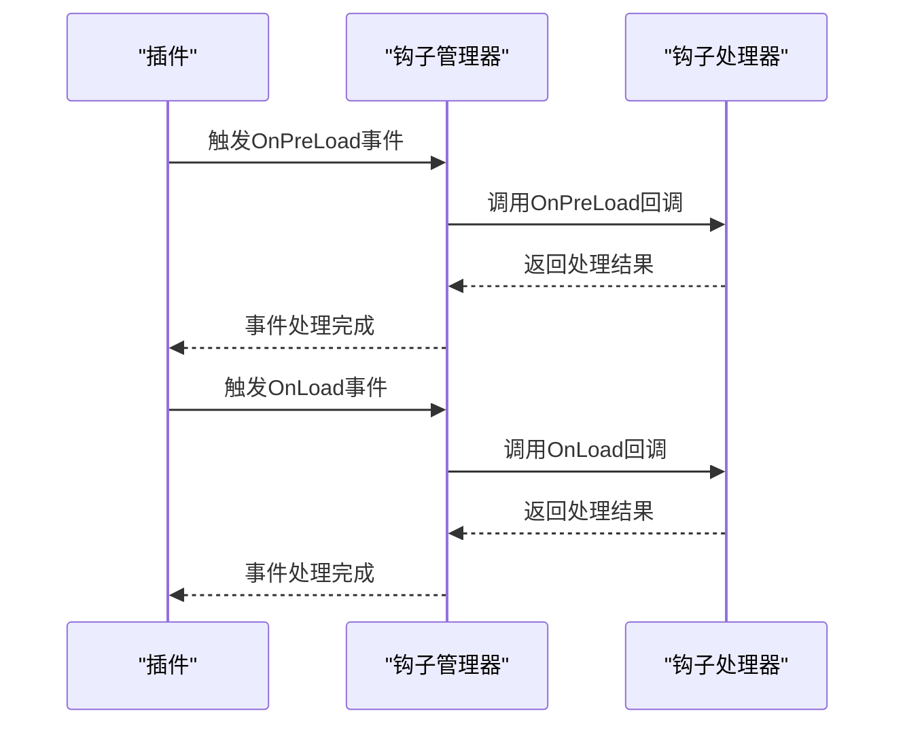
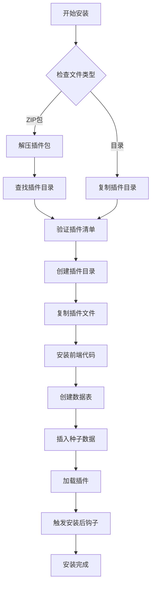
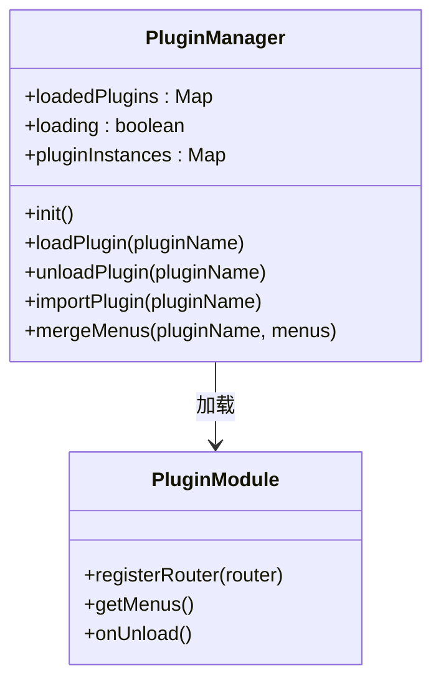
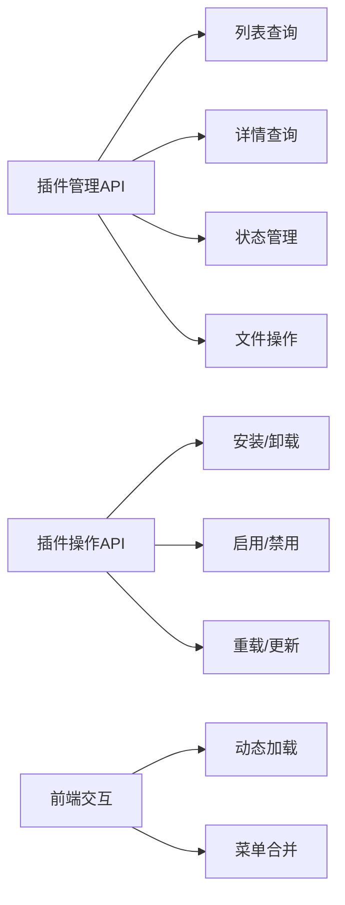
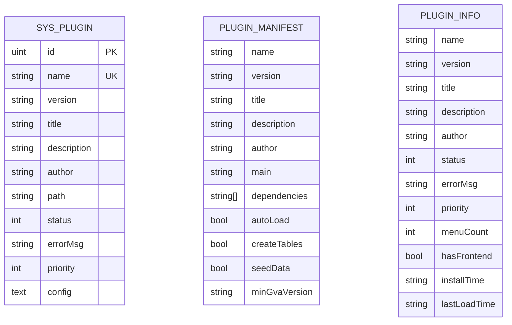
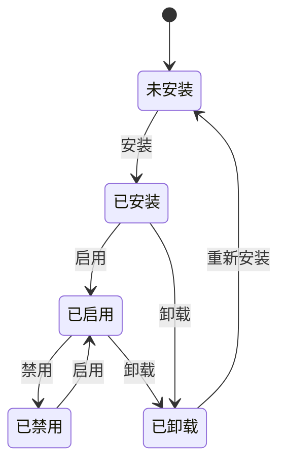
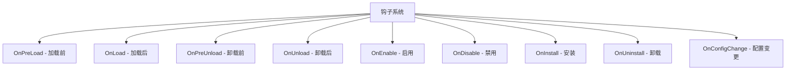
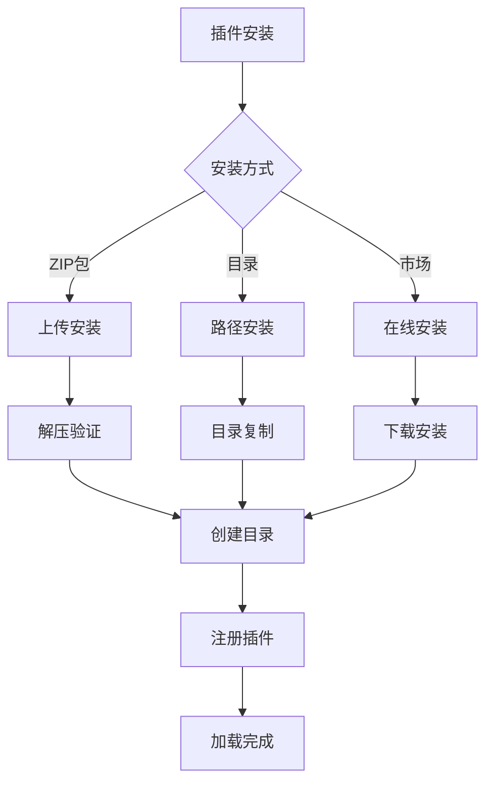

# 插件系统

<cite>
**本文引用的文件**
- [hooks.go](file://server/plugin/manager/hooks/hooks.go)
- [installer.go](file://server/plugin/manager/installer.go)
- [loader.go](file://server/plugin/manager/loader.go)
- [registry.go](file://server/plugin/manager/registry.go)
- [sys_plugin.go](file://server/api/v1/system/sys_plugin.go)
- [sys_plugin.go](file://server/router/system/sys_plugin.go)
- [sys_plugin.go](file://server/service/system/plugin_service.go)
- [sys_plugin.go](file://server/model/system/sys_plugin.go)
- [plugin.go](file://server/config/plugin.go)
- [manager.js](file://web/src/plugin/manager.js)
- [plugin.js](file://web/src/pinia/modules/plugin.js)
- [api.js](file://web/src/api/plugin/api.js)
- [register.go](file://server/plugin/register.go)
</cite>

## 更新摘要
**所做更改**
- 完全重构插件系统架构，从MCP插件系统迁移到全新的插件管理系统
- 引入完整的后端插件管理器（server/plugin/manager/），包含钩子系统、安装器、加载器和注册表
- 新增15个API端点，覆盖插件的完整生命周期管理
- 建立数据库模型和管理界面，支持插件的持久化存储和可视化管理
- 实现前后端分离的插件架构，支持动态加载和卸载前端插件
- 新增插件市场功能，支持在线插件获取和管理

## 目录
1. [简介](#简介)
2. [全新插件架构概览](#全新插件架构概览)
3. [后端插件管理器](#后端插件管理器)
4. [前端插件系统](#前端插件系统)
5. [API端点详解](#api端点详解)
6. [数据库模型](#数据库模型)
7. [插件生命周期管理](#插件生命周期管理)
8. [钩子系统](#钩子系统)
9. [插件开发规范](#插件开发规范)
10. [插件市场与安装配置](#插件市场与安装配置)
11. [最佳实践与扩展指导](#最佳实践与扩展指导)
12. [故障排查指南](#故障排查指南)

## 简介
测试管理平台现已完全重构插件系统，从原有的MCP插件架构迁移至全新的插件管理体系。新架构采用前后端分离的设计，后端提供完整的插件管理功能，前端实现动态插件加载和卸载，支持插件的完整生命周期管理。系统包含15个核心API端点、数据库模型、钩子系统和插件市场功能，为企业级应用提供了强大而灵活的扩展能力。

## 全新插件架构概览
新插件系统采用模块化设计，分为后端管理器、前端管理器、API接口层和数据库存储层四个主要部分。



**图表来源**
- [hooks.go:1-249](file://server/plugin/manager/hooks/hooks.go#L1-L249)
- [installer.go:1-505](file://server/plugin/manager/installer.go#L1-L505)
- [loader.go:1-533](file://server/plugin/manager/loader.go#L1-L533)
- [registry.go:1-431](file://server/plugin/manager/registry.go#L1-L431)

## 后端插件管理器
后端插件管理器是整个插件系统的核心，包含四个主要组件：钩子系统、安装器、加载器和注册表。

### 钩子系统
钩子系统提供插件生命周期事件通知机制，支持预加载、加载、卸载、启用、禁用等多种事件类型。



**图表来源**
- [hooks.go:105-107](file://server/plugin/manager/hooks/hooks.go#L105-L107)
- [hooks.go:194-227](file://server/plugin/manager/hooks/hooks.go#L194-L227)

### 插件安装器
插件安装器负责插件的安装、卸载、更新和打包功能，支持从ZIP包和目录安装插件。



**图表来源**
- [installer.go:33-120](file://server/plugin/manager/installer.go#L33-L120)
- [installer.go:122-164](file://server/plugin/manager/installer.go#L122-L164)

### 插件加载器
插件加载器负责插件的动态加载、卸载和重载，支持版本兼容性和依赖检查。

**章节来源**
- [loader.go:20-41](file://server/plugin/manager/loader.go#L20-L41)
- [loader.go:79-135](file://server/plugin/manager/loader.go#L79-L135)
- [loader.go:137-188](file://server/plugin/manager/loader.go#L137-L188)

### 插件注册表
插件注册表维护已加载插件的状态和元数据，提供插件查询、菜单管理和优先级排序功能。

**章节来源**
- [registry.go:21-68](file://server/plugin/manager/registry.go#L21-L68)
- [registry.go:103-113](file://server/plugin/manager/registry.go#L103-L113)
- [registry.go:202-217](file://server/plugin/manager/registry.go#L202-L217)

## 前端插件系统
前端插件系统实现插件的动态加载和卸载，支持路由注册、菜单合并和状态管理。

### 前端管理器
前端管理器负责插件的动态导入、路由注册和菜单合并功能。



**图表来源**
- [manager.js:10-97](file://web/src/plugin/manager.js#L10-L97)
- [manager.js:144-175](file://web/src/plugin/manager.js#L144-L175)

### 状态管理
Pinia状态管理器提供插件状态的响应式管理，支持插件列表、加载状态和当前插件的管理。

**章节来源**
- [manager.js:1-316](file://web/src/plugin/manager.js#L1-L316)
- [plugin.js:1-140](file://web/src/pinia/modules/plugin.js#L1-L140)

## API端点详解
新插件系统提供15个核心API端点，覆盖插件的完整生命周期管理。

### 插件管理端点
- `GET /plugin/list` - 获取插件列表
- `GET /plugin/info/:name` - 获取插件详情
- `GET /plugin/loaded` - 获取已加载插件
- `GET /plugin/menus` - 获取插件菜单
- `GET /plugin/market` - 获取插件市场
- `GET /plugin/config/:name` - 获取插件配置
- `GET /plugin/:name/frontend` - 获取插件前端资源
- `GET /plugin/:name/frontend/file` - 获取插件前端文件

### 插件操作端点
- `POST /plugin/install` - 安装插件（支持ZIP上传）
- `POST /plugin/install/path` - 从路径安装插件
- `POST /plugin/enable/:name` - 启用插件
- `POST /plugin/disable/:name` - 禁用插件
- `POST /plugin/reload/:name` - 重载插件
- `POST /plugin/update/:name` - 更新插件
- `PUT /plugin/config` - 更新插件配置
- `DELETE /plugin/uninstall/:name` - 卸载插件



**图表来源**
- [sys_plugin.go:23-604](file://server/api/v1/system/sys_plugin.go#L23-L604)
- [sys_plugin.go:11-36](file://server/router/system/sys_plugin.go#L11-L36)

**章节来源**
- [sys_plugin.go:23-604](file://server/api/v1/system/sys_plugin.go#L23-L604)
- [sys_plugin.go:11-36](file://server/router/system/sys_plugin.go#L11-L36)

## 数据库模型
插件系统使用GORM ORM框架，提供完整的插件数据模型和操作接口。

### 插件模型
插件模型包含插件的基本信息、状态、配置和元数据。



**图表来源**
- [sys_plugin.go:16-32](file://server/model/system/sys_plugin.go#L16-L32)
- [sys_plugin.go:34-50](file://server/model/system/sys_plugin.go#L34-L50)
- [sys_plugin.go:63-77](file://server/model/system/sys_plugin.go#L63-L77)

### 配置模型
插件配置模型支持插件目录、前端目录、自动加载和自动菜单注册等功能。

**章节来源**
- [sys_plugin.go:16-95](file://server/model/system/sys_plugin.go#L16-L95)
- [plugin.go:7-32](file://server/config/plugin.go#L7-L32)

## 插件生命周期管理
新插件系统提供完整的生命周期管理，从安装到卸载的每个阶段都有相应的钩子和事件处理。

### 生命周期流程


### 钩子事件处理
插件生命周期中的关键节点都会触发相应的钩子事件：

- **预加载事件** (`OnPreLoad`)：插件即将加载时触发
- **加载事件** (`OnLoad`)：插件加载完成后触发  
- **卸载前事件** (`OnPreUnload`)：插件即将卸载时触发
- **卸载事件** (`OnUnload`)：插件卸载完成后触发
- **启用事件** (`OnEnable`)：插件启用时触发
- **禁用事件** (`OnDisable`)：插件禁用时触发
- **安装事件** (`OnInstall`)：插件安装时触发
- **卸载事件** (`OnUninstall`)：插件卸载时触发
- **配置变更事件** (`OnConfigChange`)：插件配置变更时触发

**章节来源**
- [hooks.go:8-21](file://server/plugin/manager/hooks/hooks.go#L8-L21)
- [hooks.go:105-133](file://server/plugin/manager/hooks/hooks.go#L105-L133)
- [hooks.go:194-227](file://server/plugin/manager/hooks/hooks.go#L194-L227)

## 钩子系统
钩子系统是插件生命周期管理的核心机制，提供事件驱动的插件扩展能力。

### 钩子类型定义
系统定义了九种不同类型的钩子事件，每种事件对应插件生命周期的不同阶段：



**图表来源**
- [hooks.go:8-21](file://server/plugin/manager/hooks/hooks.go#L8-L21)

### 钩子处理器接口
插件可以通过实现`PluginHookHandler`接口来响应特定的钩子事件：

```go
type PluginHookHandler interface {
    OnPreLoad(ctx *HookContext) error
    OnLoad(ctx *HookContext) error
    OnPreUnload(ctx *HookContext) error
    OnUnload(ctx *HookContext) error
    OnEnable(ctx *HookContext) error
    OnDisable(ctx *HookContext) error
    OnInstall(ctx *HookContext) error
    OnUninstall(ctx *HookContext) error
    OnConfigChange(ctx *HookContext) error
}
```

**章节来源**
- [hooks.go:142-153](file://server/plugin/manager/hooks/hooks.go#L142-L153)
- [hooks.go:194-227](file://server/plugin/manager/hooks/hooks.go#L194-L227)

## 插件开发规范
新插件系统提供了标准化的插件开发规范，确保插件的一致性和可维护性。

### 插件目录结构
标准插件目录包含以下必需文件：
- `plugin.json` - 插件清单文件
- `menus.json` - 菜单配置文件
- `schema.sql` - 数据库表结构定义
- `seed.json` - 种子数据定义
- `install.sh` - 安装脚本
- `uninstall.sh` - 卸载脚本
- `frontend/` - 前端代码目录

### 插件清单文件
插件清单文件定义插件的基本信息和安装配置：

```json
{
  "name": "demo-plugin",
  "version": "1.0.0",
  "title": "演示插件",
  "description": "这是一个演示插件",
  "author": "开发者",
  "main": "index.js",
  "dependencies": [],
  "autoLoad": true,
  "install": {
    "createTables": true,
    "seedData": true
  },
  "minGvaVersion": "1.0.0"
}
```

### 前端插件接口
前端插件需要实现以下接口方法：

```javascript
export default {
  // 插件名称
  name: 'demo-plugin',
  // 插件版本
  version: '1.0.0',
  // 注册路由
  registerRouter(router) {
    // 注册插件路由
  },
  // 获取菜单
  getMenus() {
    // 返回菜单配置
  },
  // 卸载钩子
  async onUnload() {
    // 执行卸载清理
  }
}
```

**章节来源**
- [registry.go:387-399](file://server/plugin/manager/registry.go#L387-L399)
- [manager.js:69-81](file://web/src/plugin/manager.js#L69-L81)

## 插件市场与安装配置
新插件系统集成了插件市场功能，支持在线插件获取和本地插件管理。

### 插件市场功能
插件市场提供以下功能：
- 在线插件列表获取
- 插件下载和安装
- 版本更新检查
- 插件评价和评论

### 安装配置
插件系统支持多种安装方式：



**图表来源**
- [installer.go:33-55](file://server/plugin/manager/installer.go#L33-L55)
- [installer.go:57-120](file://server/plugin/manager/installer.go#L57-L120)

### 配置管理
插件系统配置支持以下参数：
- `dir` - 插件目录路径
- `frontend-dir` - 前端代码目录
- `auto-load` - 是否自动加载
- `auto-menu` - 是否自动注册菜单

**章节来源**
- [plugin.go:7-32](file://server/config/plugin.go#L7-L32)
- [sys_plugin.go:493-516](file://server/api/v1/system/sys_plugin.go#L493-L516)

## 最佳实践与扩展指导
新插件系统提供了丰富的扩展能力和最佳实践指导。

### 性能优化
- 使用钩子系统进行插件间通信，避免直接依赖
- 实现插件懒加载，减少启动时间
- 使用缓存机制提高插件加载速度
- 合理使用异步操作，避免阻塞主线程

### 安全考虑
- 验证插件签名和来源
- 限制插件权限范围
- 实施沙箱执行环境
- 定期更新插件安全补丁

### 扩展开发
- 参考现有插件实现最佳实践
- 使用标准化的插件接口
- 提供完整的文档和示例
- 支持多语言和多平台

## 故障排查指南
新插件系统提供了完善的故障排查机制和错误处理方案。

### 常见问题
1. **插件加载失败**：检查插件清单文件格式和依赖关系
2. **钩子事件未触发**：确认钩子处理器正确注册
3. **前端插件无法加载**：验证前端入口文件路径和格式
4. **数据库操作失败**：检查数据库连接和权限设置

### 调试方法
- 启用详细日志记录
- 使用浏览器开发者工具调试前端插件
- 检查插件目录权限和文件完整性
- 验证钩子事件的正确触发顺序

### 错误处理
系统提供统一的错误处理机制：
- 插件安装错误：自动回滚并记录详细错误信息
- 插件加载错误：跳过该插件继续加载其他插件
- 钩子执行错误：记录错误但不影响整体系统运行
- 前端插件错误：隔离错误插件不影响其他插件运行

**章节来源**
- [loader.go:64-77](file://server/plugin/manager/loader.go#L64-L77)
- [installer.go:72-120](file://server/plugin/manager/installer.go#L72-L120)
- [hooks.go:230-232](file://server/plugin/manager/hooks/hooks.go#L230-L232)