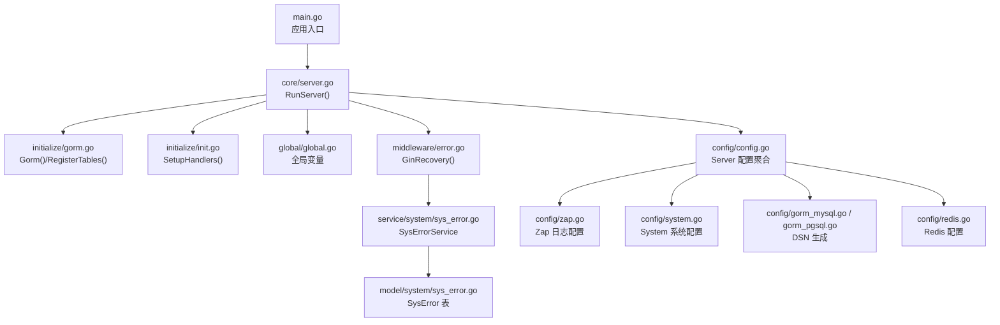
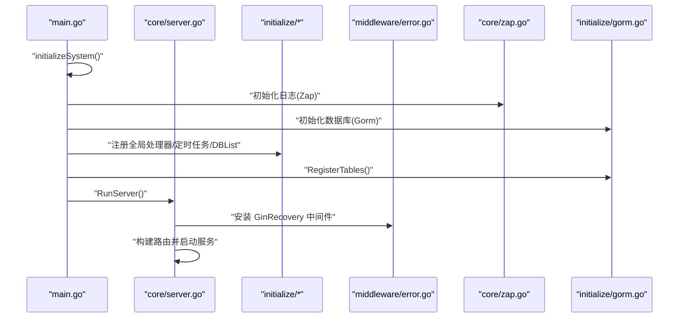
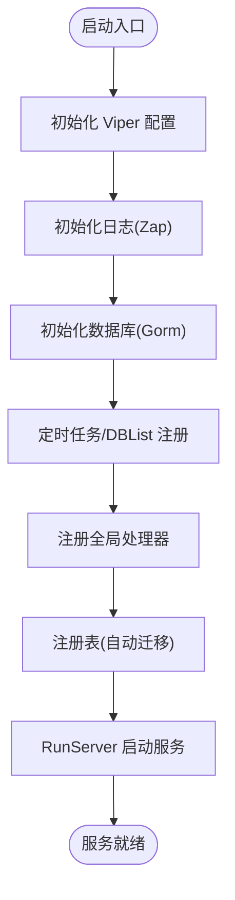
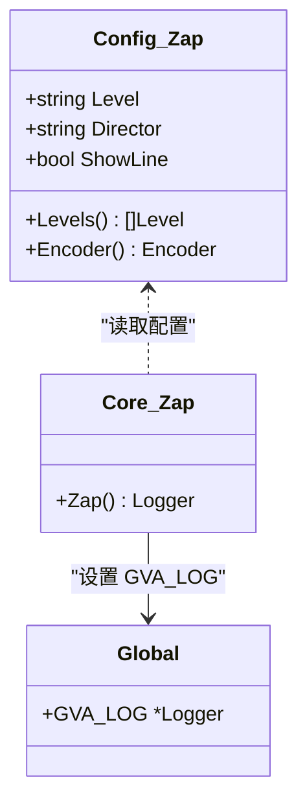
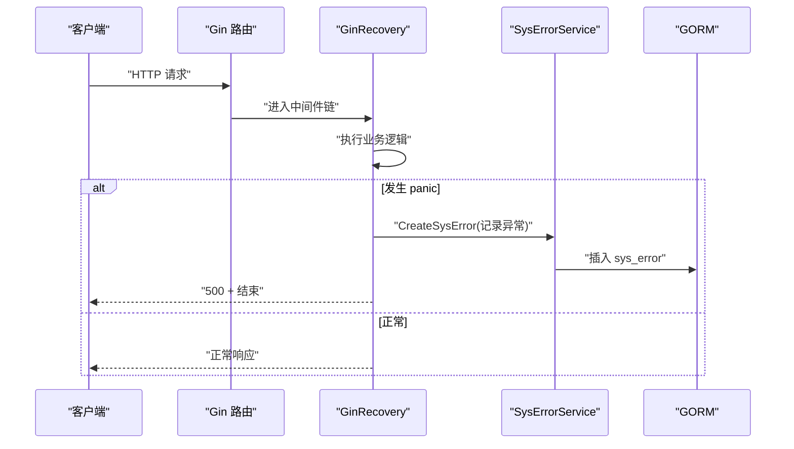
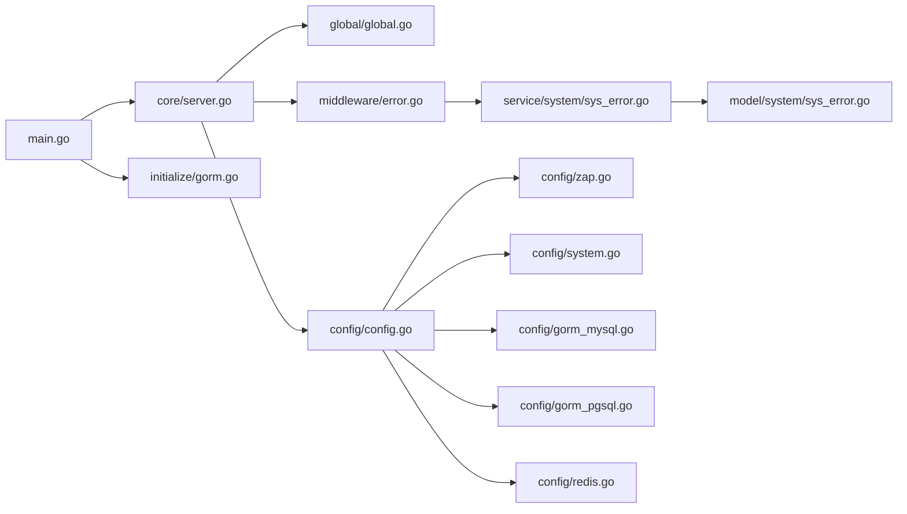

# 故障排除

<cite>
**本文引用的文件**
- [server/main.go](file://server/main.go)
- [server/core/server.go](file://server/core/server.go)
- [server/core/zap.go](file://server/core/zap.go)
- [server/config/config.go](file://server/config/config.go)
- [server/config/zap.go](file://server/config/zap.go)
- [server/config/system.go](file://server/config/system.go)
- [server/config/gorm_mysql.go](file://server/config/gorm_mysql.go)
- [server/config/gorm_pgsql.go](file://server/config/gorm_pgsql.go)
- [server/config/redis.go](file://server/config/redis.go)
- [server/initialize/gorm.go](file://server/initialize/gorm.go)
- [server/initialize/init.go](file://server/initialize/init.go)
- [server/global/global.go](file://server/global/global.go)
- [server/middleware/error.go](file://server/middleware/error.go)
- [server/model/system/sys_error.go](file://server/model/system/sys_error.go)
- [server/service/system/sys_error.go](file://server/service/system/sys_error.go)
</cite>

## 目录
1. [简介](#简介)
2. [项目结构](#项目结构)
3. [核心组件](#核心组件)
4. [架构总览](#架构总览)
5. [详细组件分析](#详细组件分析)
6. [依赖分析](#依赖分析)
7. [性能考虑](#性能考虑)
8. [故障排除指南](#故障排除指南)
9. [结论](#结论)
10. [附录](#附录)

## 简介
本指南面向测试管理平台的运维与开发人员，聚焦于启动失败、数据库连接问题、权限错误、日志系统使用与分析、性能监控与调试工具、错误处理机制与异常流程、以及开发与生产环境问题排查方法。文档基于代码库的实际实现，提供可操作的诊断步骤与解决路径。

## 项目结构
后端采用 Go + Gin + GORM + Viper + Zap 的分层架构，主要模块包括：
- 入口与启动：main.go 负责初始化系统并启动服务。
- 核心运行：core 包负责服务初始化、路由与运行。
- 配置中心：config 包定义系统、数据库、Redis、日志等配置结构。
- 初始化：initialize 包负责数据库、定时任务、路由、表注册等。
- 全局状态：global 包维护全局 DB、Redis、Mongo、配置、日志等。
- 中间件：middleware 提供统一错误恢复与日志记录。
- 错误模型与服务：model/system/sys_error.go 与 service/system/sys_error.go 提供错误记录与异步处理。



图表来源
- [server/main.go:30-52](file://server/main.go#L30-L52)
- [server/core/server.go:14-49](file://server/core/server.go#L14-L49)
- [server/initialize/gorm.go:14-88](file://server/initialize/gorm.go#L14-L88)
- [server/initialize/init.go:9-16](file://server/initialize/init.go#L9-L16)
- [server/global/global.go:25-42](file://server/global/global.go#L25-L42)
- [server/middleware/error.go:20-81](file://server/middleware/error.go#L20-L81)
- [server/service/system/sys_error.go:12-127](file://server/service/system/sys_error.go#L12-L127)
- [server/model/system/sys_error.go:8-22](file://server/model/system/sys_error.go#L8-L22)
- [server/config/config.go:3-41](file://server/config/config.go#L3-L41)
- [server/config/zap.go:8-72](file://server/config/zap.go#L8-L72)
- [server/config/system.go:3-16](file://server/config/system.go#L3-L16)
- [server/config/gorm_mysql.go:3-10](file://server/config/gorm_mysql.go#L3-L10)
- [server/config/gorm_pgsql.go:3-18](file://server/config/gorm_pgsql.go#L3-L18)
- [server/config/redis.go:3-11](file://server/config/redis.go#L3-L11)

章节来源
- [server/main.go:30-52](file://server/main.go#L30-L52)
- [server/core/server.go:14-49](file://server/core/server.go#L14-L49)
- [server/initialize/gorm.go:14-88](file://server/initialize/gorm.go#L14-L88)
- [server/initialize/init.go:9-16](file://server/initialize/init.go#L9-L16)
- [server/global/global.go:25-42](file://server/global/global.go#L25-L42)
- [server/middleware/error.go:20-81](file://server/middleware/error.go#L20-L81)
- [server/service/system/sys_error.go:12-127](file://server/service/system/sys_error.go#L12-L127)
- [server/model/system/sys_error.go:8-22](file://server/model/system/sys_error.go#L8-L22)
- [server/config/config.go:3-41](file://server/config/config.go#L3-L41)
- [server/config/zap.go:8-72](file://server/config/zap.go#L8-L72)
- [server/config/system.go:3-16](file://server/config/system.go#L3-L16)
- [server/config/gorm_mysql.go:3-10](file://server/config/gorm_mysql.go#L3-L10)
- [server/config/gorm_pgsql.go:3-18](file://server/config/gorm_pgsql.go#L3-L18)
- [server/config/redis.go:3-11](file://server/config/redis.go#L3-L11)

## 核心组件
- 应用入口与初始化
  - main.go 调用 initializeSystem 完成 Viper、日志、数据库、定时任务、DBList、全局处理器注册与表初始化；随后调用 core.RunServer 启动服务。
- 服务运行与资源加载
  - core.RunServer 根据配置决定是否初始化 Redis/Mongo；加载系统常量；构建路由并启动 HTTP 服务。
- 配置体系
  - config.Server 聚合系统、数据库、Redis、Mongo、日志、跨域、MCP 等配置；config.Zap 控制日志级别、编码器、输出位置与保留策略；config.System 控制数据库类型、端口、限流、Redis/Mongo 开关等。
- 初始化流程
  - initialize.Gorm 根据 DbType 选择具体数据库驱动并返回 gorm.DB；RegisterTables 在启用自动迁移时注册系统与业务表。
- 全局状态
  - global 维护 GVA_DB、GVA_DBList、GVA_REDIS、GVA_REDISList、GVA_MONGO、GVA_CONFIG、GVA_LOG 等全局对象。
- 错误恢复与记录
  - middleware.GinRecovery 捕获 panic，区分“断开连接”场景，记录请求与堆栈，必要时持久化到 sys_error 表。
- 错误模型与服务
  - model/system/SysError 定义错误记录表结构；service/system.SysErrorService 提供创建、查询、分页、异步生成解决方案等能力。

章节来源
- [server/main.go:30-52](file://server/main.go#L30-L52)
- [server/core/server.go:14-49](file://server/core/server.go#L14-L49)
- [server/config/config.go:3-41](file://server/config/config.go#L3-L41)
- [server/config/zap.go:8-72](file://server/config/zap.go#L8-L72)
- [server/config/system.go:3-16](file://server/config/system.go#L3-L16)
- [server/initialize/gorm.go:14-88](file://server/initialize/gorm.go#L14-L88)
- [server/global/global.go:25-42](file://server/global/global.go#L25-L42)
- [server/middleware/error.go:20-81](file://server/middleware/error.go#L20-L81)
- [server/model/system/sys_error.go:8-22](file://server/model/system/sys_error.go#L8-L22)
- [server/service/system/sys_error.go:12-127](file://server/service/system/sys_error.go#L12-L127)

## 架构总览
下图展示启动阶段的关键交互：入口初始化 -> 核心运行 -> 初始化子系统 -> 错误恢复与日志。



图表来源
- [server/main.go:30-52](file://server/main.go#L30-L52)
- [server/core/server.go:14-49](file://server/core/server.go#L14-L49)
- [server/core/zap.go:13-37](file://server/core/zap.go#L13-L37)
- [server/initialize/gorm.go:14-88](file://server/initialize/gorm.go#L14-L88)
- [server/middleware/error.go:20-81](file://server/middleware/error.go#L20-L81)

## 详细组件分析

### 组件A：启动与初始化流程
- 关键路径
  - 入口：[server/main.go:30-52](file://server/main.go#L30-L52)
  - 核心运行：[server/core/server.go:14-49](file://server/core/server.go#L14-L49)
  - 初始化注册：[server/initialize/init.go:9-16](file://server/initialize/init.go#L9-L16)
- 流程要点
  - initializeSystem 顺序：Viper -> 日志 -> DB -> 定时任务/DBList -> 全局处理器 -> 表注册。
  - RunServer 条件初始化：Redis/Mongo、系统常量加载、路由构建、服务启动。
- 常见问题定位
  - 若启动后立即退出或无法访问：检查日志目录创建与权限、数据库连接 DSN、系统端口占用。
  - 若路由不可用：确认 RunServer 已构建 Router 并启动。



图表来源
- [server/main.go:39-52](file://server/main.go#L39-L52)
- [server/core/server.go:14-49](file://server/core/server.go#L14-L49)
- [server/initialize/gorm.go:37-88](file://server/initialize/gorm.go#L37-L88)
- [server/initialize/init.go:9-16](file://server/initialize/init.go#L9-L16)

章节来源
- [server/main.go:30-52](file://server/main.go#L30-L52)
- [server/core/server.go:14-49](file://server/core/server.go#L14-L49)
- [server/initialize/init.go:9-16](file://server/initialize/init.go#L9-L16)
- [server/initialize/gorm.go:14-88](file://server/initialize/gorm.go#L14-L88)

### 组件B：数据库连接与表注册
- 关键路径
  - 选择数据库类型与 DSN：[server/initialize/gorm.go:14-35](file://server/initialize/gorm.go#L14-L35)
  - 注册表与自动迁移：[server/initialize/gorm.go:37-88](file://server/initialize/gorm.go#L37-L88)
  - MySQL DSN 生成：[server/config/gorm_mysql.go:7-10](file://server/config/gorm_mysql.go#L7-L10)
  - PostgreSQL DSN 生成：[server/config/gorm_pgsql.go:9-18](file://server/config/gorm_pgsql.go#L9-L18)
- 常见问题
  - 连接失败：核对 DbType、主机名、端口、用户名、密码、数据库名、字符集与超时设置。
  - 自动迁移失败：检查 DisableAutoMigrate 配置、数据库权限、表锁与并发迁移冲突。
- 排查步骤
  - 逐项验证 DSN 字符串拼接是否正确。
  - 查看日志中 register table 的错误信息与堆栈。
  - 生产环境建议关闭自动迁移，改为手动迁移并回滚脚本。

```mermaid
flowchart TD
A["读取 System.DbType"] --> B{"类型判断"}
B --> |mysql| C["使用 Mysql.Dsn()"]
B --> |pgsql| D["使用 Pgsql.Dsn()"]
B --> |oracle|mssql|sqlite|E["使用对应 DSN 方法"]
C --> F["建立 gorm.DB 连接"]
D --> F
E --> F
F --> G{"DisableAutoMigrate ?"}
G --> |是| H["跳过自动迁移"]
G --> |否| I["AutoMigrate 注册表"]
I --> J["成功/失败记录日志"]
```

图表来源
- [server/initialize/gorm.go:14-35](file://server/initialize/gorm.go#L14-L35)
- [server/config/gorm_mysql.go:7-10](file://server/config/gorm_mysql.go#L7-L10)
- [server/config/gorm_pgsql.go:9-18](file://server/config/gorm_pgsql.go#L9-L18)
- [server/config/system.go:3-16](file://server/config/system.go#L3-L16)

章节来源
- [server/initialize/gorm.go:14-88](file://server/initialize/gorm.go#L14-L88)
- [server/config/gorm_mysql.go:7-10](file://server/config/gorm_mysql.go#L7-L10)
- [server/config/gorm_pgsql.go:9-18](file://server/config/gorm_pgsql.go#L9-L18)
- [server/config/system.go:3-16](file://server/config/system.go#L3-L16)

### 组件C：日志系统与分析
- 关键路径
  - 日志初始化：[server/core/zap.go:13-37](file://server/core/zap.go#L13-L37)
  - 日志配置结构：[server/config/zap.go:8-72](file://server/config/zap.go#L8-L72)
  - 全局日志变量：[server/global/global.go:33-34](file://server/global/global.go#L33-L34)
- 日志特性
  - 支持多级别、多编码器、控制台与文件输出、行号与堆栈、日志保留天数。
  - 启动时若日志目录不存在会自动创建。
- 分析技巧
  - 通过 Level 与 Encoder 快速定位错误级别与格式。
  - 使用 ShowLine 定位具体调用行。
  - 结合错误恢复中间件，快速定位异常请求上下文。



图表来源
- [server/config/zap.go:8-72](file://server/config/zap.go#L8-L72)
- [server/core/zap.go:13-37](file://server/core/zap.go#L13-L37)
- [server/global/global.go:33-34](file://server/global/global.go#L33-L34)

章节来源
- [server/core/zap.go:13-37](file://server/core/zap.go#L13-L37)
- [server/config/zap.go:8-72](file://server/config/zap.go#L8-L72)
- [server/global/global.go:33-34](file://server/global/global.go#L33-L34)

### 组件D：错误恢复与异常处理
- 关键路径
  - 错误恢复中间件：[server/middleware/error.go:20-81](file://server/middleware/error.go#L20-L81)
  - 错误记录服务：[server/service/system/sys_error.go:12-127](file://server/service/system/sys_error.go#L12-L127)
  - 错误模型：[server/model/system/sys_error.go:8-22](file://server/model/system/sys_error.go#L8-L22)
- 处理流程
  - 捕获 panic，区分“断开连接”与一般异常。
  - 记录请求信息与堆栈；在需要时持久化到 sys_error。
  - 提供异步生成解决方案的任务，更新状态与方案字段。
- 建议
  - 开发环境开启堆栈记录，生产环境按需开启以平衡性能。
  - 定期清理 sys_error 表，避免数据膨胀。



图表来源
- [server/middleware/error.go:20-81](file://server/middleware/error.go#L20-L81)
- [server/service/system/sys_error.go:12-127](file://server/service/system/sys_error.go#L12-L127)
- [server/model/system/sys_error.go:8-22](file://server/model/system/sys_error.go#L8-L22)

章节来源
- [server/middleware/error.go:20-81](file://server/middleware/error.go#L20-L81)
- [server/service/system/sys_error.go:12-127](file://server/service/system/sys_error.go#L12-L127)
- [server/model/system/sys_error.go:8-22](file://server/model/system/sys_error.go#L8-L22)

### 组件E：Redis/Mongo 与系统配置
- 关键路径
  - 系统配置开关：[server/config/system.go:3-16](file://server/config/system.go#L3-L16)
  - Redis 配置：[server/config/redis.go:3-11](file://server/config/redis.go#L3-L11)
  - MongoDB 初始化入口：[server/core/server.go:22-26](file://server/core/server.go#L22-L26)
- 常见问题
  - Redis 地址/密码/DB 不匹配导致认证失败或连接超时。
  - Mongo 初始化失败时会记录错误日志，需检查连接串与权限。
- 排查步骤
  - 核对 UseRedis/UseMongo 开关与实际部署。
  - 验证 Redis ClusterAddrs 或单机 Addr 与密码。
  - 检查 Mongo 初始化返回的错误信息。

章节来源
- [server/config/system.go:3-16](file://server/config/system.go#L3-L16)
- [server/config/redis.go:3-11](file://server/config/redis.go#L3-L11)
- [server/core/server.go:14-49](file://server/core/server.go#L14-L49)

## 依赖分析
- 组件耦合
  - main.go 依赖 core 与 initialize；core 依赖 global 与 initialize；middleware 依赖 global 与 service；service 依赖 global 与 model。
- 外部依赖
  - GORM、Viper、Zap、Redis、Mongo 等第三方库通过配置与初始化注入。
- 循环依赖
  - 未发现直接循环导入；初始化顺序严格控制在入口处。



图表来源
- [server/main.go:30-52](file://server/main.go#L30-L52)
- [server/core/server.go:14-49](file://server/core/server.go#L14-L49)
- [server/initialize/gorm.go:14-88](file://server/initialize/gorm.go#L14-L88)
- [server/global/global.go:25-42](file://server/global/global.go#L25-L42)
- [server/middleware/error.go:20-81](file://server/middleware/error.go#L20-L81)
- [server/service/system/sys_error.go:12-127](file://server/service/system/sys_error.go#L12-L127)
- [server/model/system/sys_error.go:8-22](file://server/model/system/sys_error.go#L8-L22)
- [server/config/config.go:3-41](file://server/config/config.go#L3-L41)
- [server/config/zap.go:8-72](file://server/config/zap.go#L8-L72)
- [server/config/system.go:3-16](file://server/config/system.go#L3-L16)
- [server/config/gorm_mysql.go:3-10](file://server/config/gorm_mysql.go#L3-L10)
- [server/config/gorm_pgsql.go:3-18](file://server/config/gorm_pgsql.go#L3-L18)
- [server/config/redis.go:3-11](file://server/config/redis.go#L3-L11)

章节来源
- [server/main.go:30-52](file://server/main.go#L30-L52)
- [server/core/server.go:14-49](file://server/core/server.go#L14-L49)
- [server/initialize/gorm.go:14-88](file://server/initialize/gorm.go#L14-L88)
- [server/global/global.go:25-42](file://server/global/global.go#L25-L42)
- [server/middleware/error.go:20-81](file://server/middleware/error.go#L20-L81)
- [server/service/system/sys_error.go:12-127](file://server/service/system/sys_error.go#L12-L127)
- [server/model/system/sys_error.go:8-22](file://server/model/system/sys_error.go#L8-L22)
- [server/config/config.go:3-41](file://server/config/config.go#L3-L41)
- [server/config/zap.go:8-72](file://server/config/zap.go#L8-L72)
- [server/config/system.go:3-16](file://server/config/system.go#L3-L16)
- [server/config/gorm_mysql.go:3-10](file://server/config/gorm_mysql.go#L3-L10)
- [server/config/gorm_pgsql.go:3-18](file://server/config/gorm_pgsql.go#L3-L18)
- [server/config/redis.go:3-11](file://server/config/redis.go#L3-L11)

## 性能考虑
- 日志级别与输出
  - 在高并发场景降低日志级别或关闭堆栈记录，减少 I/O 与 CPU 开销。
- 数据库连接
  - 合理设置连接池大小与最大空闲连接，避免连接耗尽。
- Redis/Mongo
  - 使用连接池与超时配置，避免阻塞；集群模式下注意节点健康与网络延迟。
- 自动迁移
  - 生产环境禁用自动迁移，改为灰度发布与回滚脚本，降低启动时间与风险。

## 故障排除指南

### 启动失败
- 现象
  - 进程启动后立即退出或无法访问服务。
- 诊断步骤
  - 检查日志目录是否存在且具备写权限（Zap 初始化会自动创建目录）。
  - 核对 System.Addr 端口是否被占用。
  - 查看初始化阶段的错误日志，关注数据库连接与表注册失败信息。
- 解决方案
  - 修正日志目录权限或路径；更换端口；修复配置项后重启。

章节来源
- [server/core/zap.go:13-37](file://server/core/zap.go#L13-L37)
- [server/config/system.go:7](file://server/config/system.go#L7)
- [server/initialize/gorm.go:75-87](file://server/initialize/gorm.go#L75-L87)

### 数据库连接问题
- 现象
  - 启动时报错无法连接数据库；或运行中出现连接中断。
- 诊断步骤
  - 根据 DbType 选择对应 DSN 生成逻辑，核对主机、端口、用户名、密码、数据库名、字符集与超时。
  - 检查 DisableAutoMigrate 配置，确认是否期望自动迁移。
  - 观察日志中 register table 的错误信息与堆栈。
- 解决方案
  - 修正 DSN 参数；在生产环境关闭自动迁移，改为手动迁移；确保数据库可达与权限正确。

章节来源
- [server/initialize/gorm.go:14-35](file://server/initialize/gorm.go#L14-L35)
- [server/config/gorm_mysql.go:7-10](file://server/config/gorm_mysql.go#L7-L10)
- [server/config/gorm_pgsql.go:9-18](file://server/config/gorm_pgsql.go#L9-L18)
- [server/config/system.go:14](file://server/config/system.go#L14)
- [server/initialize/gorm.go:75-87](file://server/initialize/gorm.go#L75-L87)

### 权限错误
- 现象
  - 访问受限或 RBAC 拦截导致 403；或某些接口无权限。
- 诊断步骤
  - 检查用户角色与菜单按钮权限配置；确认 Casbin 规则与资源路径匹配。
  - 查看中间件日志与操作记录，定位具体请求与权限判定。
- 解决方案
  - 为用户授予相应角色与菜单权限；校验权限规则与资源路径一致性。

章节来源
- [server/middleware/error.go:20-81](file://server/middleware/error.go#L20-L81)

### 日志系统使用与分析
- 使用方法
  - 通过 config/zap.go 配置日志级别、编码器、输出位置与保留天数；启动时自动创建日志目录。
  - 在业务中使用 global.GVA_LOG 记录关键事件与错误。
- 分析技巧
  - 使用 Levels() 与 Encoder() 快速切换格式与级别；结合 ShowLine 定位调用行。
  - 结合错误恢复中间件，提取请求上下文与堆栈信息。

章节来源
- [server/config/zap.go:8-72](file://server/config/zap.go#L8-L72)
- [server/core/zap.go:13-37](file://server/core/zap.go#L13-L37)
- [server/global/global.go:33-34](file://server/global/global.go#L33-L34)
- [server/middleware/error.go:20-81](file://server/middleware/error.go#L20-L81)

### 性能监控与调试工具
- 建议
  - 使用系统自带日志与错误恢复中间件定位热点与异常；在高负载场景降低日志级别或关闭堆栈记录。
  - 对数据库、Redis、Mongo 增加连接池与超时配置；监控连接数与延迟。
  - 生产环境禁用自动迁移，采用灰度与回滚脚本。

章节来源
- [server/config/zap.go:8-72](file://server/config/zap.go#L8-L72)
- [server/config/system.go:14](file://server/config/system.go#L14)

### 错误处理机制与异常流程
- 机制
  - GinRecovery 捕获 panic，区分断开连接与一般异常；记录请求与堆栈；必要时持久化到 sys_error。
  - SysErrorService 提供创建、查询、分页与异步生成解决方案的能力。
- 流程
  - 发生异常 -> 记录 sys_error -> 异步生成方案 -> 更新状态与方案字段。

章节来源
- [server/middleware/error.go:20-81](file://server/middleware/error.go#L20-L81)
- [server/service/system/sys_error.go:12-127](file://server/service/system/sys_error.go#L12-L127)
- [server/model/system/sys_error.go:8-22](file://server/model/system/sys_error.go#L8-L22)

### 开发与生产环境问题排查
- 开发环境
  - 开启堆栈记录与详细日志；使用自动迁移简化本地调试。
- 生产环境
  - 关闭自动迁移；限制日志级别；启用错误恢复中间件并定期清理 sys_error。
  - 核对 Redis/Mongo 开关与配置，确保连接稳定。

章节来源
- [server/config/system.go:14](file://server/config/system.go#L14)
- [server/config/zap.go:8-72](file://server/config/zap.go#L8-L72)
- [server/middleware/error.go:20-81](file://server/middleware/error.go#L20-L81)

### 问题反馈与社区支持
- 渠道
  - 项目地址与插件市场信息可在服务启动日志中查看。
  - GitHub Issues 与工作流用于问题反馈与协作。

章节来源
- [server/core/server.go:36-45](file://server/core/server.go#L36-L45)

## 结论
本指南基于代码库的实际实现，提供了从启动、数据库、权限、日志到性能与异常处理的完整排查路径。建议在开发环境充分验证，在生产环境遵循最小化日志、禁用自动迁移与严格的权限控制原则，配合错误恢复与日志系统，快速定位并解决问题。

## 附录
- 关键配置项参考
  - 系统配置：DbType、Addr、UseRedis、UseMongo、DisableAutoMigrate
  - 日志配置：Level、Director、ShowLine、Format、RetentionDay
  - 数据库配置：MySQL/Pgsql 的 DSN 组成要素
  - Redis 配置：Addr、Password、DB、UseCluster、ClusterAddrs

章节来源
- [server/config/system.go:3-16](file://server/config/system.go#L3-L16)
- [server/config/zap.go:8-72](file://server/config/zap.go#L8-L72)
- [server/config/gorm_mysql.go:7-10](file://server/config/gorm_mysql.go#L7-L10)
- [server/config/gorm_pgsql.go:9-18](file://server/config/gorm_pgsql.go#L9-L18)
- [server/config/redis.go:3-11](file://server/config/redis.go#L3-L11)