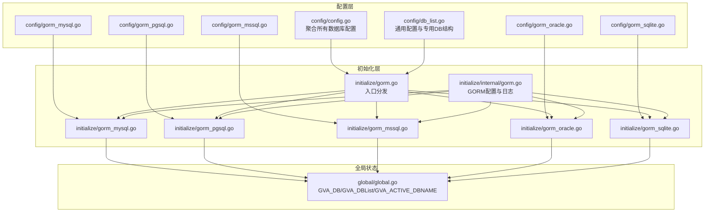
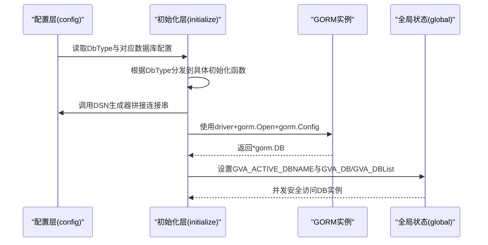
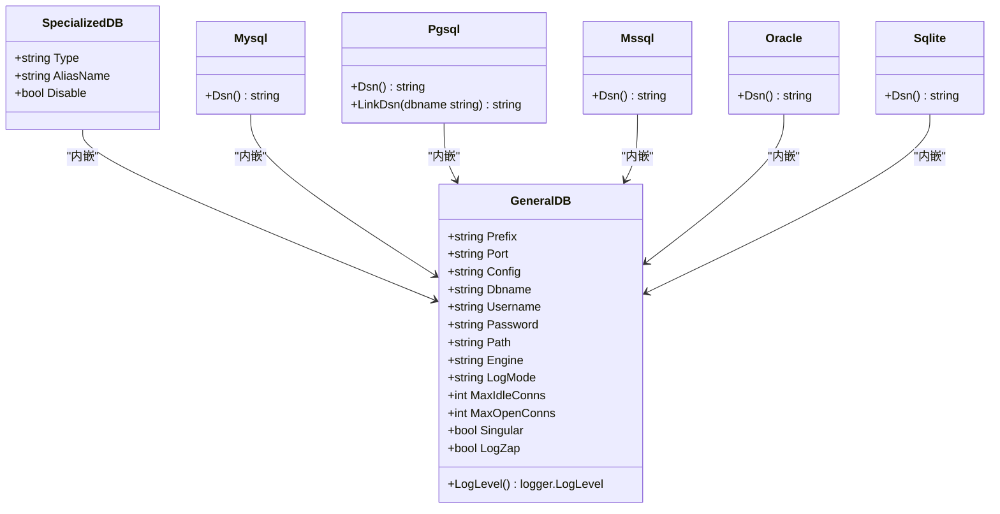
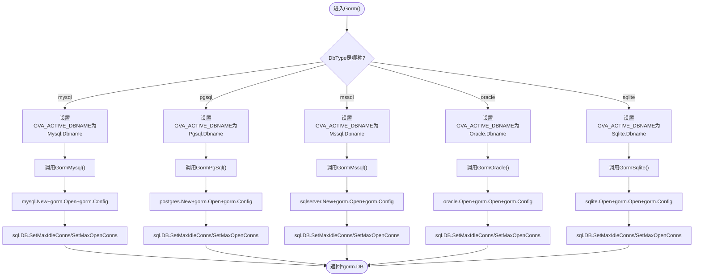
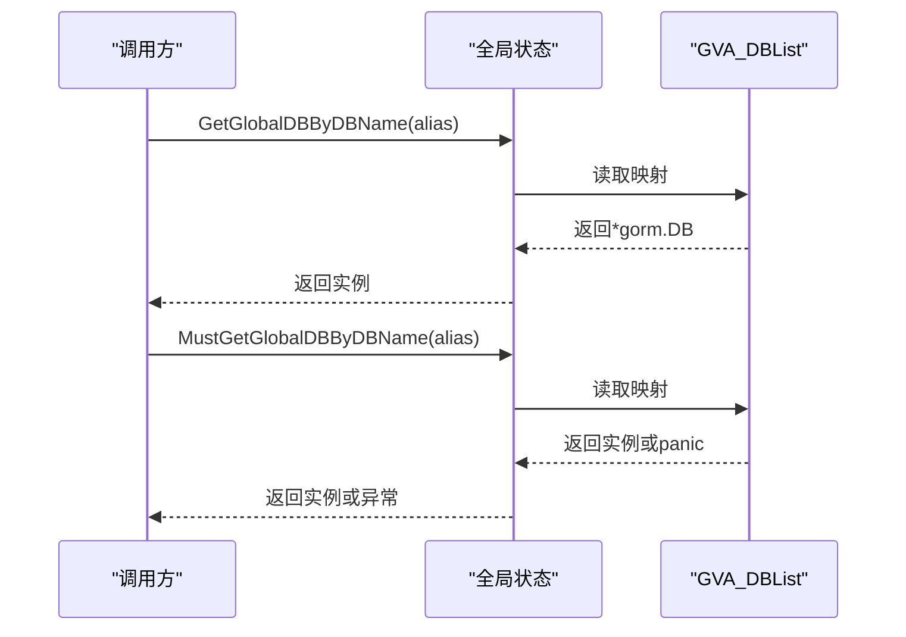
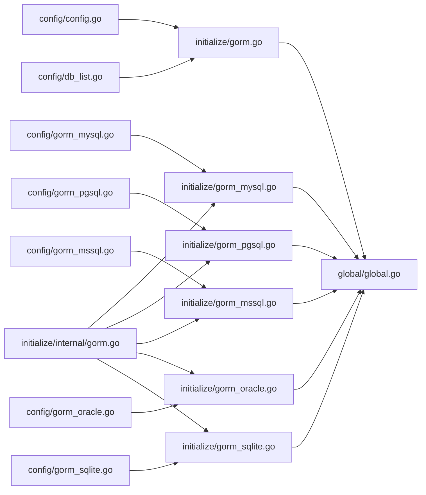

# 数据库配置与支持

<cite>
**本文引用的文件**
- [server/config/db_list.go](file://server/config/db_list.go)
- [server/config/gorm_mysql.go](file://server/config/gorm_mysql.go)
- [server/config/gorm_pgsql.go](file://server/config/gorm_pgsql.go)
- [server/config/gorm_mssql.go](file://server/config/gorm_mssql.go)
- [server/config/gorm_oracle.go](file://server/config/gorm_oracle.go)
- [server/config/gorm_sqlite.go](file://server/config/gorm_sqlite.go)
- [server/config/config.go](file://server/config/config.go)
- [server/initialize/gorm.go](file://server/initialize/gorm.go)
- [server/initialize/gorm_mysql.go](file://server/initialize/gorm_mysql.go)
- [server/initialize/gorm_pgsql.go](file://server/initialize/gorm_pgsql.go)
- [server/initialize/gorm_mssql.go](file://server/initialize/gorm_mssql.go)
- [server/initialize/gorm_oracle.go](file://server/initialize/gorm_oracle.go)
- [server/initialize/gorm_sqlite.go](file://server/initialize/gorm_sqlite.go)
- [server/initialize/internal/gorm.go](file://server/initialize/internal/gorm.go)
- [server/global/global.go](file://server/global/global.go)
</cite>

## 目录
1. [简介](#简介)
2. [项目结构](#项目结构)
3. [核心组件](#核心组件)
4. [架构总览](#架构总览)
5. [详细组件分析](#详细组件分析)
6. [依赖分析](#依赖分析)
7. [性能考虑](#性能考虑)
8. [故障排查指南](#故障排查指南)
9. [结论](#结论)
10. [附录](#附录)

## 简介
本文件系统性阐述测试管理平台的数据库配置与多数据库支持方案，覆盖 GORM 初始化流程、各数据库（MySQL、PostgreSQL、SQL Server、Oracle、SQLite）的适配配置、连接池与事务处理、并发控制、数据库切换与最佳实践、性能优化与运维要点，并给出基于业务需求的选型建议。

## 项目结构
围绕数据库配置与初始化的关键目录与文件如下：
- 配置层：集中定义通用与专用数据库配置结构体及 DSN 生成逻辑
- 初始化层：按数据库类型分别初始化 GORM 实例，统一注入连接池与日志策略
- 全局层：维护主库与多库实例映射、活跃库名等运行期状态

图表来源
- [server/config/config.go:1-41](file://server/config/config.go#L1-L41)
- [server/config/db_list.go:1-54](file://server/config/db_list.go#L1-L54)
- [server/config/gorm_mysql.go:1-10](file://server/config/gorm_mysql.go#L1-L10)
- [server/config/gorm_pgsql.go:1-18](file://server/config/gorm_pgsql.go#L1-L18)
- [server/config/gorm_mssql.go:1-11](file://server/config/gorm_mssql.go#L1-L11)
- [server/config/gorm_oracle.go:1-19](file://server/config/gorm_oracle.go#L1-L19)
- [server/config/gorm_sqlite.go:1-14](file://server/config/gorm_sqlite.go#L1-L14)
- [server/initialize/gorm.go:1-88](file://server/initialize/gorm.go#L1-L88)
- [server/initialize/gorm_mysql.go:1-49](file://server/initialize/gorm_mysql.go#L1-L49)
- [server/initialize/gorm_pgsql.go:1-44](file://server/initialize/gorm_pgsql.go#L1-L44)
- [server/initialize/gorm_mssql.go:1-65](file://server/initialize/gorm_mssql.go#L1-L65)
- [server/initialize/gorm_oracle.go:1-38](file://server/initialize/gorm_oracle.go#L1-L38)
- [server/initialize/gorm_sqlite.go:1-39](file://server/initialize/gorm_sqlite.go#L1-L39)
- [server/initialize/internal/gorm.go:1-32](file://server/initialize/internal/gorm.go#L1-L32)
- [server/global/global.go:1-69](file://server/global/global.go#L1-L69)

章节来源
- [server/config/config.go:1-41](file://server/config/config.go#L1-L41)
- [server/config/db_list.go:1-54](file://server/config/db_list.go#L1-L54)
- [server/initialize/gorm.go:1-88](file://server/initialize/gorm.go#L1-L88)
- [server/global/global.go:1-69](file://server/global/global.go#L1-L69)

## 核心组件
- 通用配置结构 GeneralDB：统一承载数据库连接所需的基础字段（主机、端口、用户名、密码、数据库名、高级配置、引擎、日志模式、连接池参数、是否禁用复数），并提供日志级别解析能力。
- 专用配置结构 SpecializedDB：在通用配置之上增加类型、别名与禁用开关，支持多数据库列表配置。
- 各数据库 DSN 生成器：为 MySQL、PostgreSQL、SQL Server、Oracle、SQLite 提供各自 DSN 拼装逻辑。
- GORM 初始化入口：根据系统配置的 DbType 分发到对应数据库初始化函数，设置活跃库名并返回 GORM 实例。
- GORM 配置与日志：统一注入命名策略、慢查询阈值、日志级别与颜色化输出。
- 全局状态：维护主库 GVA_DB、多库映射 GVA_DBList、当前活跃库名 GVA_ACTIVE_DBNAME，以及读写锁保护的并发安全访问。

章节来源
- [server/config/db_list.go:17-54](file://server/config/db_list.go#L17-L54)
- [server/config/gorm_mysql.go:3-10](file://server/config/gorm_mysql.go#L3-L10)
- [server/config/gorm_pgsql.go:3-18](file://server/config/gorm_pgsql.go#L3-L18)
- [server/config/gorm_mssql.go:3-11](file://server/config/gorm_mssql.go#L3-L11)
- [server/config/gorm_oracle.go:9-19](file://server/config/gorm_oracle.go#L9-L19)
- [server/config/gorm_sqlite.go:7-14](file://server/config/gorm_sqlite.go#L7-L14)
- [server/initialize/gorm.go:14-35](file://server/initialize/gorm.go#L14-L35)
- [server/initialize/internal/gorm.go:18-31](file://server/initialize/internal/gorm.go#L18-L31)
- [server/global/global.go:25-69](file://server/global/global.go#L25-L69)

## 架构总览
下图展示从配置到初始化再到运行期使用的整体流程与关键交互。

图表来源
- [server/initialize/gorm.go:14-35](file://server/initialize/gorm.go#L14-L35)
- [server/config/gorm_mysql.go:7-9](file://server/config/gorm_mysql.go#L7-L9)
- [server/config/gorm_pgsql.go:9-11](file://server/config/gorm_pgsql.go#L9-L11)
- [server/config/gorm_mssql.go:8-10](file://server/config/gorm_mssql.go#L8-L10)
- [server/config/gorm_oracle.go:13-17](file://server/config/gorm_oracle.go#L13-L17)
- [server/config/gorm_sqlite.go:11-13](file://server/config/gorm_sqlite.go#L11-L13)
- [server/initialize/gorm_mysql.go:32-47](file://server/initialize/gorm_mysql.go#L32-L47)
- [server/initialize/gorm_pgsql.go:29-42](file://server/initialize/gorm_pgsql.go#L29-L42)
- [server/initialize/gorm_mssql.go:27-41](file://server/initialize/gorm_mssql.go#L27-L41)
- [server/initialize/gorm_oracle.go:22-36](file://server/initialize/gorm_oracle.go#L22-L36)
- [server/initialize/gorm_sqlite.go:22-37](file://server/initialize/gorm_sqlite.go#L22-L37)
- [server/global/global.go:25-69](file://server/global/global.go#L25-L69)

## 详细组件分析

### 通用与专用配置模型
- 通用配置 GeneralDB：包含连接基础信息、高级配置、引擎、日志模式、连接池上限与空闲数、是否禁用复数表名等；提供日志级别解析方法。
- 专用配置 SpecializedDB：在通用配置基础上扩展类型、别名与禁用标记，支持多数据库列表配置，便于运行时按别名选择目标库。

图表来源
- [server/config/db_list.go:17-54](file://server/config/db_list.go#L17-L54)
- [server/config/gorm_mysql.go:3-10](file://server/config/gorm_mysql.go#L3-L10)
- [server/config/gorm_pgsql.go:3-18](file://server/config/gorm_pgsql.go#L3-L18)
- [server/config/gorm_mssql.go:3-11](file://server/config/gorm_mssql.go#L3-L11)
- [server/config/gorm_oracle.go:9-19](file://server/config/gorm_oracle.go#L9-L19)
- [server/config/gorm_sqlite.go:7-14](file://server/config/gorm_sqlite.go#L7-L14)

章节来源
- [server/config/db_list.go:17-54](file://server/config/db_list.go#L17-L54)
- [server/config/gorm_mysql.go:3-10](file://server/config/gorm_mysql.go#L3-L10)
- [server/config/gorm_pgsql.go:3-18](file://server/config/gorm_pgsql.go#L3-L18)
- [server/config/gorm_mssql.go:3-11](file://server/config/gorm_mssql.go#L3-L11)
- [server/config/gorm_oracle.go:9-19](file://server/config/gorm_oracle.go#L9-L19)
- [server/config/gorm_sqlite.go:7-14](file://server/config/gorm_sqlite.go#L7-L14)

### GORM 初始化与日志配置
- 初始化入口：根据 DbType 分发到具体数据库初始化函数，设置当前活跃库名为对应数据库名。
- 日志配置：统一注入命名策略（表前缀、单数表名）、慢查询阈值、日志级别与颜色化输出。
- 连接池：在打开数据库后获取底层 sql.DB 并设置最大空闲连接与最大打开连接数。

图表来源
- [server/initialize/gorm.go:14-35](file://server/initialize/gorm.go#L14-L35)
- [server/initialize/gorm_mysql.go:32-47](file://server/initialize/gorm_mysql.go#L32-L47)
- [server/initialize/gorm_pgsql.go:29-42](file://server/initialize/gorm_pgsql.go#L29-L42)
- [server/initialize/gorm_mssql.go:27-41](file://server/initialize/gorm_mssql.go#L27-L41)
- [server/initialize/gorm_oracle.go:22-36](file://server/initialize/gorm_oracle.go#L22-L36)
- [server/initialize/gorm_sqlite.go:22-37](file://server/initialize/gorm_sqlite.go#L22-L37)
- [server/initialize/internal/gorm.go:18-31](file://server/initialize/internal/gorm.go#L18-L31)

章节来源
- [server/initialize/gorm.go:14-35](file://server/initialize/gorm.go#L14-L35)
- [server/initialize/internal/gorm.go:18-31](file://server/initialize/internal/gorm.go#L18-L31)
- [server/initialize/gorm_mysql.go:32-47](file://server/initialize/gorm_mysql.go#L32-L47)
- [server/initialize/gorm_pgsql.go:29-42](file://server/initialize/gorm_pgsql.go#L29-L42)
- [server/initialize/gorm_mssql.go:27-41](file://server/initialize/gorm_mssql.go#L27-L41)
- [server/initialize/gorm_oracle.go:22-36](file://server/initialize/gorm_oracle.go#L22-L36)
- [server/initialize/gorm_sqlite.go:22-37](file://server/initialize/gorm_sqlite.go#L22-L37)

### 各数据库适配配置

#### MySQL
- DSN 组成：用户名、密码、主机、端口、数据库名、高级配置。
- 初始化要点：设置默认字符串长度、根据版本自动配置；设置表存储引擎；设置连接池。
- 注意事项：当未配置数据库名时直接返回空，避免误初始化。

章节来源
- [server/config/gorm_mysql.go:7-9](file://server/config/gorm_mysql.go#L7-L9)
- [server/initialize/gorm_mysql.go:26-48](file://server/initialize/gorm_mysql.go#L26-L48)

#### PostgreSQL
- DSN 组成：host、user、password、dbname、port、高级配置。
- 初始化要点：可生成仅变更数据库名的链接串；设置连接池。
- 注意事项：当未配置数据库名时直接返回空，避免误初始化。

章节来源
- [server/config/gorm_pgsql.go:9-17](file://server/config/gorm_pgsql.go#L9-L17)
- [server/initialize/gorm_pgsql.go:24-43](file://server/initialize/gorm_pgsql.go#L24-L43)

#### SQL Server
- DSN 组成：sqlserver:// 用户名:密码@主机:端口?database=库名&encrypt=disable。
- 初始化要点：设置默认字符串长度；设置连接池；兼容引擎参数。
- 注意事项：当未配置数据库名时直接返回空，避免误初始化。

章节来源
- [server/config/gorm_mssql.go:7-10](file://server/config/gorm_mssql.go#L7-L10)
- [server/initialize/gorm_mssql.go:20-42](file://server/initialize/gorm_mssql.go#L20-L42)

#### Oracle
- DSN 组成：oracle://用户名:密码@主机:端口/库名?高级配置（含路径转义）。
- 初始化要点：使用第三方驱动；设置连接池。
- 注意事项：当未配置数据库名时直接返回空，避免误初始化。

章节来源
- [server/config/gorm_oracle.go:13-18](file://server/config/gorm_oracle.go#L13-L18)
- [server/initialize/gorm_oracle.go:22-37](file://server/initialize/gorm_oracle.go#L22-L37)

#### SQLite
- DSN 组成：基于 Path 与 Dbname 拼接绝对路径。
- 初始化要点：使用轻量驱动；设置连接池。
- 注意事项：当未配置数据库名时直接返回空，避免误初始化。

章节来源
- [server/config/gorm_sqlite.go:11-13](file://server/config/gorm_sqlite.go#L11-L13)
- [server/initialize/gorm_sqlite.go:22-38](file://server/initialize/gorm_sqlite.go#L22-L38)

### 多数据库支持与切换
- 多库列表：通过专用结构体列表与别名实现多数据库实例管理。
- 切换机制：通过全局状态提供的按库名获取方法实现运行期切换；并发安全读取。
- 入口分发：初始化入口根据 DbType 决定使用哪个数据库实例。

图表来源
- [server/global/global.go:44-69](file://server/global/global.go#L44-L69)

章节来源
- [server/global/global.go:25-69](file://server/global/global.go#L25-L69)

## 依赖分析
- 配置聚合：Server 结构体聚合了所有数据库配置与多库列表，确保初始化入口可直接读取。
- 初始化耦合：各数据库初始化函数依赖对应 DSN 生成器与通用 GORM 配置模块。
- 运行期依赖：全局状态提供并发安全的多库访问接口，初始化阶段填充映射。

图表来源
- [server/config/config.go:1-41](file://server/config/config.go#L1-L41)
- [server/config/db_list.go:1-54](file://server/config/db_list.go#L1-L54)
- [server/config/gorm_mysql.go:1-10](file://server/config/gorm_mysql.go#L1-L10)
- [server/config/gorm_pgsql.go:1-18](file://server/config/gorm_pgsql.go#L1-L18)
- [server/config/gorm_mssql.go:1-11](file://server/config/gorm_mssql.go#L1-L11)
- [server/config/gorm_oracle.go:1-19](file://server/config/gorm_oracle.go#L1-L19)
- [server/config/gorm_sqlite.go:1-14](file://server/config/gorm_sqlite.go#L1-L14)
- [server/initialize/gorm.go:1-88](file://server/initialize/gorm.go#L1-L88)
- [server/initialize/gorm_mysql.go:1-49](file://server/initialize/gorm_mysql.go#L1-L49)
- [server/initialize/gorm_pgsql.go:1-44](file://server/initialize/gorm_pgsql.go#L1-L44)
- [server/initialize/gorm_mssql.go:1-65](file://server/initialize/gorm_mssql.go#L1-L65)
- [server/initialize/gorm_oracle.go:1-38](file://server/initialize/gorm_oracle.go#L1-L38)
- [server/initialize/gorm_sqlite.go:1-39](file://server/initialize/gorm_sqlite.go#L1-L39)
- [server/initialize/internal/gorm.go:1-32](file://server/initialize/internal/gorm.go#L1-L32)
- [server/global/global.go:1-69](file://server/global/global.go#L1-L69)

章节来源
- [server/config/config.go:1-41](file://server/config/config.go#L1-L41)
- [server/initialize/gorm.go:1-88](file://server/initialize/gorm.go#L1-L88)
- [server/global/global.go:1-69](file://server/global/global.go#L1-L69)

## 性能考虑
- 连接池参数
  - 最大空闲连接数：用于控制空闲连接上限，降低资源占用。
  - 最大打开连接数：限制并发连接上限，避免数据库压力过大。
  - 建议：结合数据库最大连接数与业务并发峰值进行调优。
- 日志与慢查询
  - 慢查询阈值：统一设置为毫秒级阈值，便于识别慢操作。
  - 日志级别：根据环境选择，生产环境建议提升至 warn 或更高。
- 命名策略
  - 表前缀与单数表名：影响迁移与查询生成，需与团队规范一致。
- 引擎与字符集
  - MySQL 存储引擎：初始化时设置默认 ENGINE，配合高级配置保证一致性。
- 并发控制
  - 全局状态采用读写锁保护多库映射，确保高并发场景下的安全访问。

章节来源
- [server/initialize/internal/gorm.go:18-31](file://server/initialize/internal/gorm.go#L18-L31)
- [server/initialize/gorm_mysql.go:43-46](file://server/initialize/gorm_mysql.go#L43-L46)
- [server/initialize/gorm_pgsql.go:38-41](file://server/initialize/gorm_pgsql.go#L38-L41)
- [server/initialize/gorm_mssql.go:37-40](file://server/initialize/gorm_mssql.go#L37-L40)
- [server/initialize/gorm_oracle.go:31-35](file://server/initialize/gorm_oracle.go#L31-L35)
- [server/initialize/gorm_sqlite.go:32-36](file://server/initialize/gorm_sqlite.go#L32-L36)
- [server/global/global.go:44-69](file://server/global/global.go#L44-L69)

## 故障排查指南
- 初始化失败
  - 检查 DbType 与对应配置是否正确；确认数据库名非空。
  - 查看日志输出定位具体错误位置。
- 连接池问题
  - 确认最大空闲/打开连接数设置合理；观察数据库连接数上限。
- 日志与慢查询
  - 调整日志级别与慢查询阈值，结合监控工具定位热点。
- 并发访问
  - 使用全局提供的按库名获取方法，避免直接共享实例导致竞争。
- 多库切换
  - 确保别名唯一且初始化时已注册；必要时使用 MustGetGlobalDBByDBName 获取并校验。

章节来源
- [server/initialize/gorm.go:38-87](file://server/initialize/gorm.go#L38-L87)
- [server/global/global.go:44-69](file://server/global/global.go#L44-L69)

## 结论
该系统通过统一的通用配置与专用配置抽象，结合各数据库的 DSN 生成与初始化封装，实现了对 MySQL、PostgreSQL、SQL Server、Oracle、SQLite 的一致化接入。配合连接池、日志与命名策略的统一配置，以及全局状态的并发安全访问，满足了多数据库场景下的可维护性与可扩展性。建议在生产环境中结合业务并发与数据库能力，合理设置连接池与日志策略，并建立完善的监控与告警体系。

## 附录
- 配置项速览（节选）
  - 通用配置：主机、端口、用户名、密码、数据库名、高级配置、引擎、日志模式、连接池参数、是否禁用复数。
  - 专用配置：类型、别名、禁用标记。
  - 多库列表：支持多个数据库实例并按别名访问。
- 最佳实践
  - 明确 DbType 与数据库名，避免空配置导致初始化失败。
  - 生产环境提高日志级别，启用慢查询记录。
  - 根据数据库最大连接数与业务峰值调整连接池参数。
  - 使用全局提供的按库名获取方法进行多库切换，确保线程安全。
  - 定期评估迁移策略与命名规则，保持一致性。