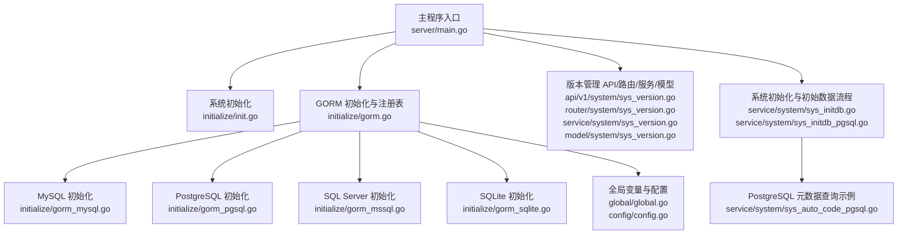
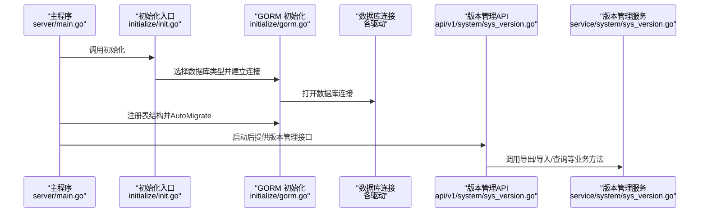
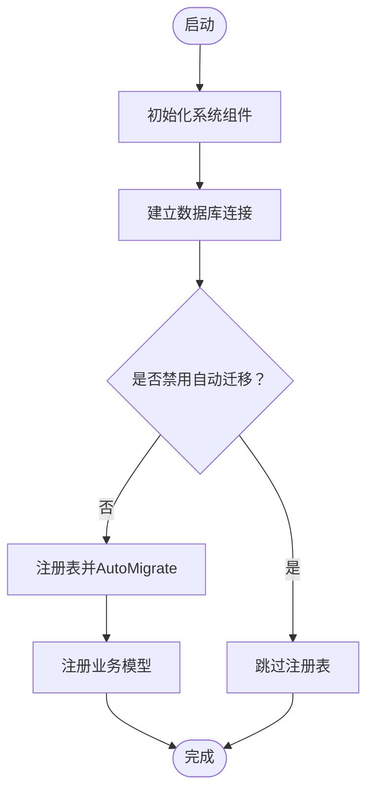
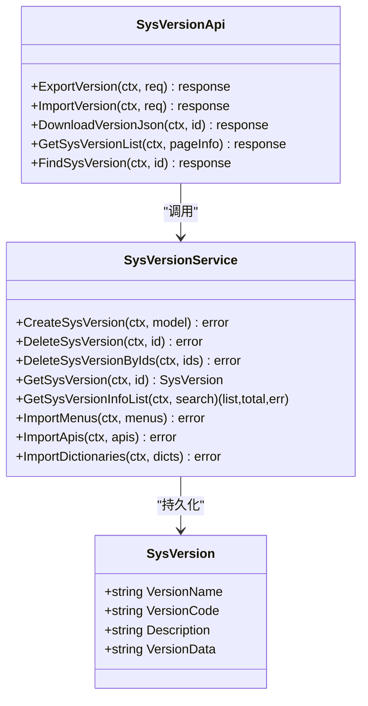
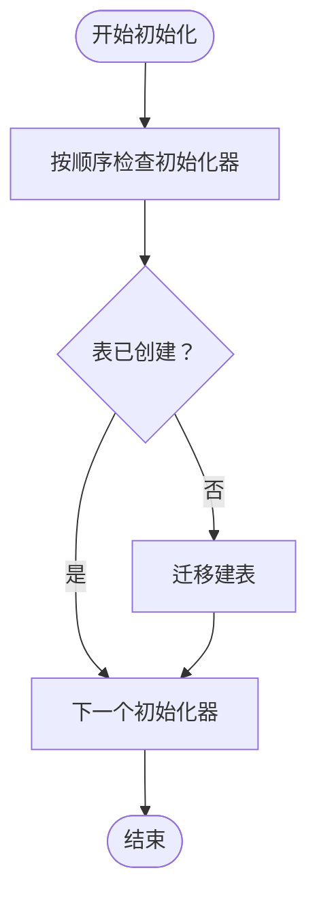
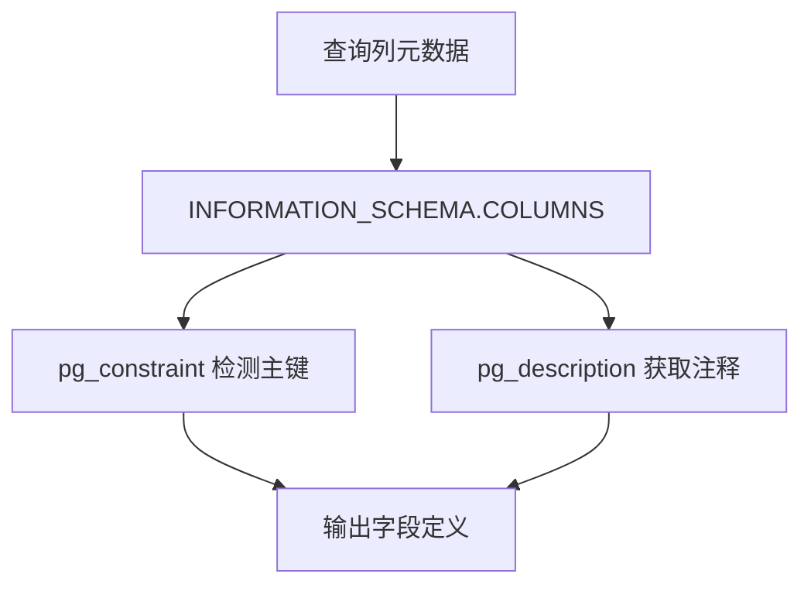
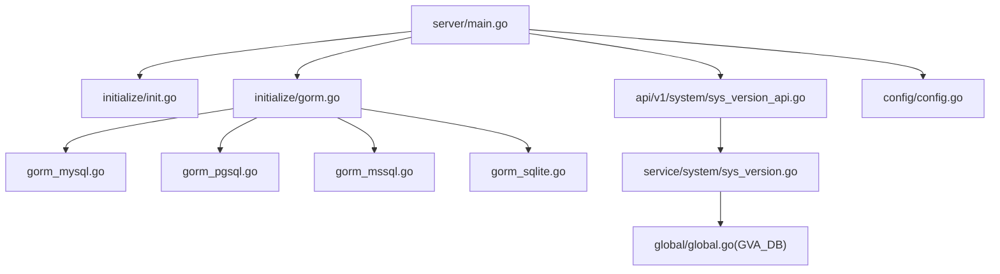

# 数据迁移策略

<cite>
**本文引用的文件**
- [main.go](file://server/main.go)
- [init.go](file://server/initialize/init.go)
- [gorm.go](file://server/initialize/gorm.go)
- [gorm_mysql.go](file://server/initialize/gorm_mysql.go)
- [gorm_pgsql.go](file://server/initialize/gorm_pgsql.go)
- [gorm_mssql.go](file://server/initialize/gorm_mssql.go)
- [gorm_sqlite.go](file://server/initialize/gorm_sqlite.go)
- [global.go](file://server/global/global.go)
- [config.go](file://server/config/config.go)
- [sys_version.go](file://server/model/system/sys_version.go)
- [sys_version_service.go](file://server/service/system/sys_version.go)
- [sys_version_api.go](file://server/api/v1/system/sys_version.go)
- [sys_version_router.go](file://server/router/system/sys_version.go)
- [sys_initdb.go](file://server/service/system/sys_initdb.go)
- [sys_initdb_pgsql.go](file://server/service/system/sys_initdb_pgsql.go)
- [sys_auto_code_pgsql.go](file://server/service/system/sys_auto_code_pgsql.go)
</cite>

## 目录
1. [引言](#引言)
2. [项目结构](#项目结构)
3. [核心组件](#核心组件)
4. [架构总览](#架构总览)
5. [详细组件分析](#详细组件分析)
6. [依赖分析](#依赖分析)
7. [性能考虑](#性能考虑)
8. [故障排查指南](#故障排查指南)
9. [结论](#结论)
10. [附录](#附录)

## 引言
本文件面向测试管理平台的数据迁移与版本管理需求，系统化阐述数据库表结构初始化、版本管理机制、自动建表流程、表结构校验与修复、迁移脚本编写规范与执行策略，并提供增量迁移与全量迁移实施方案、备份与回滚流程、schema 变更与数据兼容性处理、错误处理与异常恢复机制，以及生产环境最佳实践与风险控制措施。内容基于仓库中现有的初始化、版本管理与数据库适配层实现进行归纳总结。

## 项目结构
围绕数据迁移与版本管理的相关目录与文件如下：
- 初始化与数据库适配：server/initialize 下的 GORM 初始化与多数据库驱动封装
- 全局状态与配置：server/global 与 server/config
- 版本管理模型与业务：server/model/system/sys_version.go、server/service/system/sys_version.go、server/api/v1/system/sys_version.go、server/router/system/sys_version.go
- 系统初始化与注册：server/main.go、server/initialize/init.go
- 初始数据与迁移流程：server/service/system/sys_initdb.go、server/service/system/sys_initdb_pgsql.go
- PostgreSQL 字段元数据查询：server/service/system/sys_auto_code_pgsql.go

**图表来源**
- [main.go:30-52](file://server/main.go#L30-L52)
- [init.go:9-16](file://server/initialize/init.go#L9-L16)
- [gorm.go:14-88](file://server/initialize/gorm.go#L14-L88)
- [gorm_mysql.go:12-49](file://server/initialize/gorm_mysql.go#L12-L49)
- [gorm_pgsql.go:11-44](file://server/initialize/gorm_pgsql.go#L11-L44)
- [gorm_mssql.go:20-65](file://server/initialize/gorm_mssql.go#L20-L65)
- [gorm_sqlite.go:11-39](file://server/initialize/gorm_sqlite.go#L11-L39)
- [global.go:25-42](file://server/global/global.go#L25-L42)
- [config.go:3-41](file://server/config/config.go#L3-L41)
- [sys_version_api.go:21-487](file://server/api/v1/system/sys_version_api.go#L21-L487)
- [sys_version_router.go:8-26](file://server/router/system/sys_version_router.go#L8-L26)
- [sys_version_service.go:11-231](file://server/service/system/sys_version_service.go#L11-L231)
- [sys_version.go:8-21](file://server/model/system/sys_version.go#L8-L21)
- [sys_initdb.go:162-189](file://server/service/system/sys_initdb.go#L162-L189)
- [sys_initdb_pgsql.go:84-101](file://server/service/system/sys_initdb_pgsql.go#L84-L101)
- [sys_auto_code_pgsql.go:69-119](file://server/service/system/sys_auto_code_pgsql.go#L69-L119)

**章节来源**
- [main.go:30-52](file://server/main.go#L30-L52)
- [gorm.go:14-88](file://server/initialize/gorm.go#L14-L88)

## 核心组件
- 数据库初始化与注册
  - GORM 初始化根据配置选择数据库类型并建立连接，随后统一注册表结构并通过 AutoMigrate 完成建表与字段迁移
  - 支持 MySQL、PostgreSQL、SQL Server、SQLite 等驱动
- 版本管理
  - SysVersion 模型用于记录版本元数据与导出的菜单、API、字典等配置快照
  - SysVersionService 提供导出、导入、下载、查询、事务化写入等能力
  - SysVersionApi 与 SysVersionRouter 提供 REST 接口，支持导出 JSON、导入 JSON、分页查询、单条查询与下载
- 系统初始化与初始数据
  - SysInitDB 流程按顺序检查表是否已创建，未创建则迁移建表；随后按序初始化数据，支持取消上下文与顺序控制
  - PostgreSQL 初始化数据流程对每个初始化器逐一执行 InitializeData 并输出进度

**章节来源**
- [gorm.go:37-88](file://server/initialize/gorm.go#L37-L88)
- [sys_version.go:8-21](file://server/model/system/sys_version.go#L8-L21)
- [sys_version_service.go:11-231](file://server/service/system/sys_version_service.go#L11-L231)
- [sys_version_api.go:21-487](file://server/api/v1/system/sys_version_api.go#L21-L487)
- [sys_version_router.go:8-26](file://server/router/system/sys_version_router.go#L8-L26)
- [sys_initdb.go:162-189](file://server/service/system/sys_initdb.go#L162-L189)
- [sys_initdb_pgsql.go:84-101](file://server/service/system/sys_initdb_pgsql.go#L84-L101)

## 架构总览
下图展示启动阶段的数据库初始化与版本管理交互路径，包括初始化入口、GORM 注册表、版本管理 API 与服务层的关系。

**图表来源**
- [main.go:39-52](file://server/main.go#L39-L52)
- [init.go:9-16](file://server/initialize/init.go#L9-L16)
- [gorm.go:14-88](file://server/initialize/gorm.go#L14-L88)
- [sys_version_api.go:21-487](file://server/api/v1/system/sys_version_api.go#L21-L487)

## 详细组件分析

### 组件一：数据库初始化与自动建表
- 初始化入口
  - 主程序在启动时调用 initializeSystem，依次完成 Viper、Zap、GORM、定时器、DBList、全局处理器注册，最后在 GORM 成功时执行 RegisterTables
- GORM 注册与建表
  - RegisterTables 在关闭禁用迁移开关时跳过；否则对系统与示例模型集合执行 AutoMigrate
  - 支持多数据库类型，按配置选择对应驱动与连接参数
- 数据库驱动细节
  - MySQL：设置默认字符串长度、引擎、连接池参数
  - PostgreSQL：设置连接池参数
  - SQL Server：设置默认字符串长度、连接池参数
  - SQLite：设置连接池参数

**图表来源**
- [main.go:39-52](file://server/main.go#L39-L52)
- [gorm.go:37-88](file://server/initialize/gorm.go#L37-L88)
- [gorm_mysql.go:26-48](file://server/initialize/gorm_mysql.go#L26-L48)
- [gorm_pgsql.go:24-43](file://server/initialize/gorm_pgsql.go#L24-L43)
- [gorm_mssql.go:20-65](file://server/initialize/gorm_mssql.go#L20-L65)
- [gorm_sqlite.go:22-39](file://server/initialize/gorm_sqlite.go#L22-L39)

**章节来源**
- [main.go:39-52](file://server/main.go#L39-L52)
- [gorm.go:14-88](file://server/initialize/gorm.go#L14-L88)
- [gorm_mysql.go:12-49](file://server/initialize/gorm_mysql.go#L12-L49)
- [gorm_pgsql.go:11-44](file://server/initialize/gorm_pgsql.go#L11-L44)
- [gorm_mssql.go:20-65](file://server/initialize/gorm_mssql.go#L20-L65)
- [gorm_sqlite.go:11-39](file://server/initialize/gorm_sqlite.go#L11-L39)

### 组件二：版本管理模型与业务
- SysVersion 模型
  - 包含版本名称、版本号、描述、版本数据(JSON)等字段，并自定义表名为 sys_versions
- SysVersionService
  - 提供创建、删除、分页查询、按ID获取、导入菜单/API/字典等能力
  - 导入流程使用事务，避免部分导入导致的数据不一致
- SysVersionApi 与 SysVersionRouter
  - 提供导出版本(JSON)、导入版本(JSON)、下载版本JSON、分页查询、单条查询等接口
  - 导出时对菜单构建树形结构，对API/字典清理ID与时间戳字段，保证可移植性

**图表来源**
- [sys_version.go:8-21](file://server/model/system/sys_version.go#L8-L21)
- [sys_version_service.go:11-231](file://server/service/system/sys_version_service.go#L11-L231)
- [sys_version_api.go:21-487](file://server/api/v1/system/sys_version_api.go#L21-L487)

**章节来源**
- [sys_version.go:8-21](file://server/model/system/sys_version.go#L8-L21)
- [sys_version_service.go:11-231](file://server/service/system/sys_version_service.go#L11-L231)
- [sys_version_api.go:21-487](file://server/api/v1/system/sys_version_api.go#L21-L487)
- [sys_version_router.go:8-26](file://server/router/system/sys_version_router.go#L8-L26)

### 组件三：系统初始化与初始数据流程
- SysInitDB
  - 以顺序切片方式遍历初始化器，若表已创建则跳过；否则逐个迁移建表；支持取消上下文
- PostgreSQL 初始化数据
  - 对每个初始化器逐一执行 InitializeData，若已存在则跳过，执行成功后输出成功信息

**图表来源**
- [sys_initdb.go:162-189](file://server/service/system/sys_initdb.go#L162-L189)
- [sys_initdb_pgsql.go:84-101](file://server/service/system/sys_initdb_pgsql.go#L84-L101)

**章节来源**
- [sys_initdb.go:162-189](file://server/service/system/sys_initdb.go#L162-L189)
- [sys_initdb_pgsql.go:84-101](file://server/service/system/sys_initdb_pgsql.go#L84-L101)

### 组件四：PostgreSQL 元数据查询与字段解析
- 通过 INFORMATION_SCHEMA 查询列元数据，结合 pg_constraint、pg_description 等系统表获取主键、注释、精度等信息
- 用于自动代码生成或元数据一致性校验场景

**图表来源**
- [sys_auto_code_pgsql.go:69-119](file://server/service/system/sys_auto_code_pgsql.go#L69-L119)

**章节来源**
- [sys_auto_code_pgsql.go:69-119](file://server/service/system/sys_auto_code_pgsql.go#L69-L119)

## 依赖分析
- 启动依赖
  - main.go 依赖 initialize 与 core，先初始化系统再运行服务
  - initialize.init.go 注册系统重载处理函数
- 数据库依赖
  - global.go 暴露全局 GVA_DB 与配置对象，供各模块使用
  - config.go 定义系统、数据库等配置结构
- 版本管理依赖
  - SysVersionApi 依赖 SysVersionService；SysVersionService 依赖 GORM DB 实例
  - SysVersionRouter 依赖 SysVersionApi

**图表来源**
- [main.go:30-52](file://server/main.go#L30-L52)
- [init.go:9-16](file://server/initialize/init.go#L9-L16)
- [gorm.go:14-88](file://server/initialize/gorm.go#L14-L88)
- [gorm_mysql.go:12-49](file://server/initialize/gorm_mysql.go#L12-L49)
- [gorm_pgsql.go:11-44](file://server/initialize/gorm_pgsql.go#L11-L44)
- [gorm_mssql.go:20-65](file://server/initialize/gorm_mssql.go#L20-L65)
- [gorm_sqlite.go:11-39](file://server/initialize/gorm_sqlite.go#L11-L39)
- [global.go:25-42](file://server/global/global.go#L25-L42)
- [config.go:3-41](file://server/config/config.go#L3-L41)
- [sys_version_api.go:21-487](file://server/api/v1/system/sys_version_api.go#L21-L487)
- [sys_version_service.go:11-231](file://server/service/system/sys_version_service.go#L11-L231)

**章节来源**
- [main.go:30-52](file://server/main.go#L30-L52)
- [global.go:25-42](file://server/global/global.go#L25-L42)
- [config.go:3-41](file://server/config/config.go#L3-L41)

## 性能考虑
- 连接池与并发
  - 各数据库驱动均设置最大空闲连接数与最大打开连接数，建议结合业务峰值合理配置
- AutoMigrate 开销
  - 生产环境建议谨慎开启自动迁移，优先通过显式迁移脚本控制版本演进
- 事务与批量导入
  - 导入菜单/API/字典采用事务，减少中间态数据；建议在大体量导入时分批处理并设置超时

[本节为通用指导，无需特定文件引用]

## 故障排查指南
- 启动阶段无法连接数据库
  - 检查配置项与 DSN；确认数据库服务可用；查看 GORM 初始化日志
- AutoMigrate 失败
  - 关闭禁用迁移开关后跳过；否则检查权限、字符集、引擎设置；查看具体错误日志
- 版本管理导入失败
  - 检查导入 JSON 格式；确认版本信息完整性；查看服务层日志定位具体步骤
- 初始化数据流程中断
  - 使用取消上下文触发中断；检查初始化器顺序与依赖；查看 PostgreSQL 初始化数据流程日志

**章节来源**
- [gorm.go:37-88](file://server/initialize/gorm.go#L37-L88)
- [sys_version_api.go:417-487](file://server/api/v1/system/sys_version_api.go#L417-L487)
- [sys_initdb.go:162-189](file://server/service/system/sys_initdb.go#L162-L189)
- [sys_initdb_pgsql.go:84-101](file://server/service/system/sys_initdb_pgsql.go#L84-L101)

## 结论
本项目通过 GORM 的 AutoMigrate 与初始化器流程实现了数据库表结构的自动注册与迁移；通过 SysVersion 模型与 API 提供了配置快照的导出/导入能力，满足版本化管理与跨环境迁移的需求。建议在生产环境中采用显式迁移脚本与严格的版本控制，配合备份与回滚策略，确保变更可控、可追踪、可恢复。

[本节为总结，无需特定文件引用]

## 附录

### 数据迁移策略与规范
- 迁移脚本编写规范
  - 显式定义版本号与描述；区分字段新增/修改/删除；对索引变更进行幂等处理
  - 使用事务包裹批量 DDL/DML；在导入前进行数据校验与备份
- 执行策略
  - 全量迁移：在维护窗口执行，先备份，再执行迁移，最后验证
  - 增量迁移：按版本逐步升级，保留回滚点，记录迁移日志
- 备份与回滚
  - 迁移前导出 SysVersion 快照；对关键表进行逻辑/物理备份；准备回滚脚本
  - 回滚时优先使用 SysVersion 导入恢复到上一版本配置，再执行数据库回滚
- schema 变更与兼容性
  - 保持向后兼容字段；对必填字段变更提供默认值；对枚举/字典使用外键或受控枚举
- 错误处理与异常恢复
  - 使用取消上下文中断长时间任务；对关键步骤增加重试与告警；失败即回滚
- 生产环境最佳实践
  - 严格审批与灰度发布；监控迁移期间的数据库负载与慢查询；准备应急预案

[本节为通用指导，无需特定文件引用]