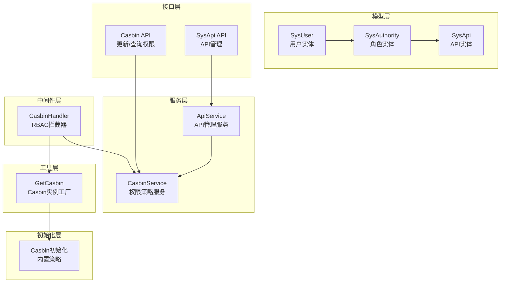
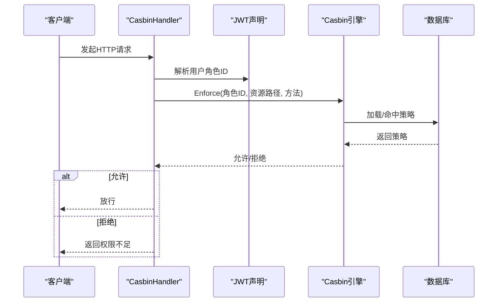
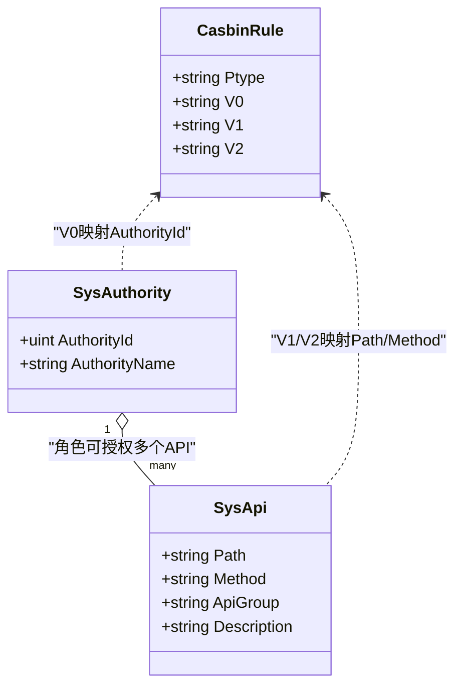
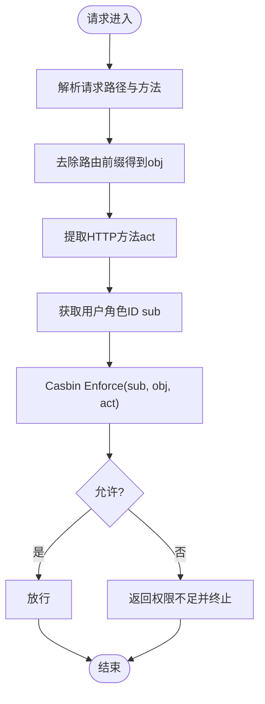
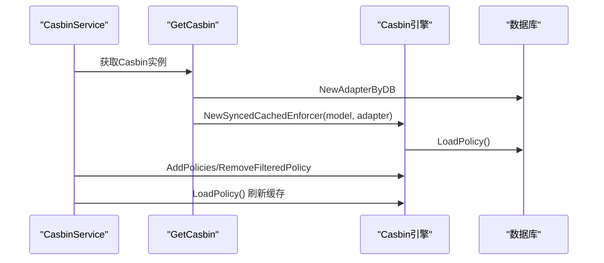
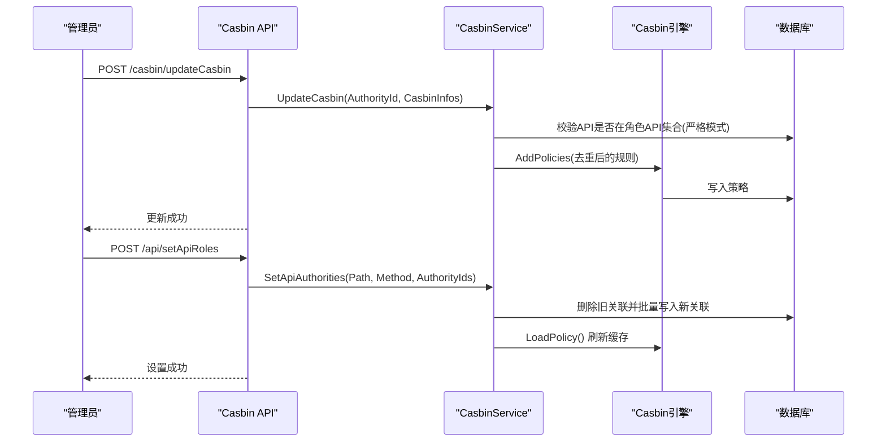
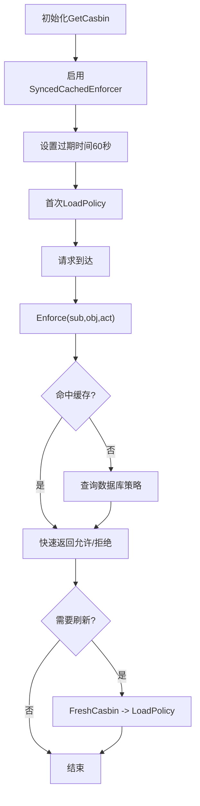
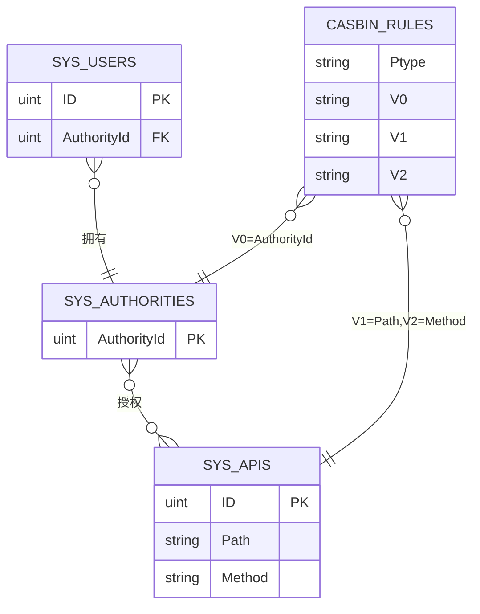
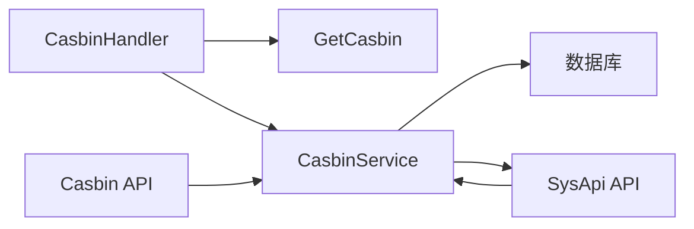

# API权限模型

<cite>
**本文档引用的文件**
- [server/model/system/sys_api.go](file://server/model/system/sys_api.go)
- [server/middleware/casbin_rbac.go](file://server/middleware/casbin_rbac.go)
- [server/service/system/sys_casbin.go](file://server/service/system/sys_casbin.go)
- [server/router/system/sys_casbin.go](file://server/router/system/sys_casbin.go)
- [server/api/v1/system/sys_casbin.go](file://server/api/v1/system/sys_casbin.go)
- [server/utils/casbin_util.go](file://server/utils/casbin_util.go)
- [server/model/system/request/sys_casbin.go](file://server/model/system/request/sys_casbin.go)
- [server/model/system/response/sys_casbin.go](file://server/model/system/response/sys_casbin.go)
- [server/source/system/casbin.go](file://server/source/system/casbin.go)
- [server/model/system/sys_authority.go](file://server/model/system/sys_authority.go)
- [server/model/system/sys_user.go](file://server/model/system/sys_user.go)
- [server/api/v1/system/sys_api.go](file://server/api/v1/system/sys_api.go)
- [server/service/system/sys_api.go](file://server/service/system/sys_api.go)
</cite>

## 目录
1. [简介](#简介)
2. [项目结构](#项目结构)
3. [核心组件](#核心组件)
4. [架构总览](#架构总览)
5. [详细组件分析](#详细组件分析)
6. [依赖关系分析](#依赖关系分析)
7. [性能考量](#性能考量)
8. [故障排查指南](#故障排查指南)
9. [结论](#结论)

## 简介
本文件系统性阐述测试管理平台的API权限模型与实现，重点围绕以下方面：
- SysApi API实体与Casbin规则模型的设计
- 基于路径与方法的权限匹配规则
- Casbin权限引擎集成与RBAC模型应用
- 动态权限更新、权限缓存与权限验证机制
- API权限关系图，展示用户权限、角色权限、API权限的三层权限体系

## 项目结构
围绕权限控制的关键目录与文件如下：
- 模型层：SysApi、SysAuthority、SysUser等
- 中间件层：Casbin RBAC拦截器
- 服务层：CasbinService、ApiService
- 接口层：Casbin API、API管理API
- 工具层：Casbin实例工厂（含缓存）
- 初始化层：Casbin规则初始化

**图表来源**
- [server/model/system/sys_api.go:7-17](file://server/model/system/sys_api.go#L7-L17)
- [server/model/system/sys_authority.go:7-19](file://server/model/system/sys_authority.go#L7-L19)
- [server/model/system/sys_user.go:20-34](file://server/model/system/sys_user.go#L20-L34)
- [server/middleware/casbin_rbac.go:13-32](file://server/middleware/casbin_rbac.go#L13-L32)
- [server/service/system/sys_casbin.go:22-74](file://server/service/system/sys_casbin.go#L22-L74)
- [server/service/system/sys_api.go:276-302](file://server/service/system/sys_api.go#L276-L302)
- [server/api/v1/system/sys_casbin.go:24-44](file://server/api/v1/system/sys_casbin.go#L24-L44)
- [server/api/v1/system/sys_api.go:335-381](file://server/api/v1/system/sys_api.go#L335-L381)
- [server/utils/casbin_util.go:18-52](file://server/utils/casbin_util.go#L18-L52)
- [server/source/system/casbin.go:42-373](file://server/source/system/casbin.go#L42-L373)

**章节来源**
- [server/model/system/sys_api.go:1-29](file://server/model/system/sys_api.go#L1-L29)
- [server/middleware/casbin_rbac.go:1-33](file://server/middleware/casbin_rbac.go#L1-L33)
- [server/service/system/sys_casbin.go:1-216](file://server/service/system/sys_casbin.go#L1-L216)
- [server/router/system/sys_casbin.go:1-20](file://server/router/system/sys_casbin.go#L1-L20)
- [server/api/v1/system/sys_casbin.go:1-70](file://server/api/v1/system/sys_casbin.go#L1-L70)
- [server/utils/casbin_util.go:1-53](file://server/utils/casbin_util.go#L1-L53)
- [server/model/system/request/sys_casbin.go:1-28](file://server/model/system/request/sys_casbin.go#L1-L28)
- [server/model/system/response/sys_casbin.go:1-10](file://server/model/system/response/sys_casbin.go#L1-L10)
- [server/source/system/casbin.go:1-373](file://server/source/system/casbin.go#L1-L373)
- [server/model/system/sys_authority.go:1-24](file://server/model/system/sys_authority.go#L1-L24)
- [server/model/system/sys_user.go:1-63](file://server/model/system/sys_user.go#L1-L63)
- [server/api/v1/system/sys_api.go:319-382](file://server/api/v1/system/sys_api.go#L319-L382)
- [server/service/system/sys_api.go:257-327](file://server/service/system/sys_api.go#L257-L327)

## 核心组件
- SysApi API实体：定义API的路径、方法、分组与描述，持久化到sys_apis表
- Casbin规则模型：以“角色ID-资源路径-HTTP方法”三元组存储权限策略
- Casbin RBAC拦截器：在请求进入时进行权限判定
- CasbinService：封装策略增删改查、严格模式校验、API变更联动更新、缓存刷新
- Casbin实例工厂：提供带缓存的同步式Casbin执行器
- 权限初始化：内置多套角色的初始策略，确保系统具备基础能力

**章节来源**
- [server/model/system/sys_api.go:7-17](file://server/model/system/sys_api.go#L7-L17)
- [server/middleware/casbin_rbac.go:13-32](file://server/middleware/casbin_rbac.go#L13-L32)
- [server/service/system/sys_casbin.go:22-74](file://server/service/system/sys_casbin.go#L22-L74)
- [server/utils/casbin_util.go:18-52](file://server/utils/casbin_util.go#L18-L52)
- [server/source/system/casbin.go:42-373](file://server/source/system/casbin.go#L42-L373)

## 架构总览
下图展示了从请求到权限判定的整体流程，以及三层权限体系的关系。

**图表来源**
- [server/middleware/casbin_rbac.go:13-32](file://server/middleware/casbin_rbac.go#L13-L32)
- [server/utils/casbin_util.go:18-52](file://server/utils/casbin_util.go#L18-L52)

## 详细组件分析

### SysApi API实体与Casbin规则模型
- SysApi字段
  - Path：API访问路径
  - Method：HTTP方法（默认POST）
  - ApiGroup：API分组
  - Description：中文描述
- Casbin规则
  - 角色ID（sub）对应SysAuthority.AuthorityId
  - 资源路径（obj）对应SysApi.Path
  - 方法（act）对应SysApi.Method
  - 匹配器使用keyMatch2，支持路径参数与通配符

**图表来源**
- [server/model/system/sys_api.go:7-17](file://server/model/system/sys_api.go#L7-L17)
- [server/source/system/casbin.go:47-354](file://server/source/system/casbin.go#L47-L354)

**章节来源**
- [server/model/system/sys_api.go:7-17](file://server/model/system/sys_api.go#L7-L17)
- [server/source/system/casbin.go:47-354](file://server/source/system/casbin.go#L47-L354)

### 基于路径与方法的权限匹配规则
- 路由前缀剥离：从请求URL中去除系统路由前缀，得到实际资源路径
- 资源对象标准化：obj = TrimPrefix(path, RouterPrefix)
- 方法匹配：直接使用HTTP方法作为act
- 匹配器：keyMatch2用于路径匹配，支持参数化路径与通配符

**图表来源**
- [server/middleware/casbin_rbac.go:16-24](file://server/middleware/casbin_rbac.go#L16-L24)
- [server/utils/casbin_util.go:26-41](file://server/utils/casbin_util.go#L26-L41)

**章节来源**
- [server/middleware/casbin_rbac.go:13-32](file://server/middleware/casbin_rbac.go#L13-L32)
- [server/utils/casbin_util.go:18-52](file://server/utils/casbin_util.go#L18-L52)

### Casbin权限引擎集成与RBAC模型
- 引擎初始化：通过gorm-adapter连接数据库，加载内存模型文本
- 缓存策略：SyncedCachedEnforcer启用缓存，过期时间60秒
- 策略加载：启动时LoadPolicy，后续可通过FreshCasbin刷新
- 严格模式：更新角色权限时，若开启严格模式则校验API是否存在于当前角色的API集合

**图表来源**
- [server/service/system/sys_casbin.go:26-74](file://server/service/system/sys_casbin.go#L26-L74)
- [server/utils/casbin_util.go:18-52](file://server/utils/casbin_util.go#L18-L52)

**章节来源**
- [server/service/system/sys_casbin.go:26-74](file://server/service/system/sys_casbin.go#L26-L74)
- [server/utils/casbin_util.go:18-52](file://server/utils/casbin_util.go#L18-L52)

### 动态权限更新机制
- 更新角色API权限
  - 输入：角色ID + API权限列表（路径+方法）
  - 流程：严格模式校验 → 去重 → 批量写入策略 → 成功后AddPolicies
- API变更联动更新
  - 当API路径或方法变更时，更新数据库中的CasbinRule并重新加载策略
- API级角色覆盖
  - 提供按API维度全量设置角色列表的能力，并即时刷新缓存

**图表来源**
- [server/api/v1/system/sys_casbin.go:24-44](file://server/api/v1/system/sys_casbin.go#L24-L44)
- [server/service/system/sys_casbin.go:26-74](file://server/service/system/sys_casbin.go#L26-L74)
- [server/api/v1/system/sys_api.go:363-381](file://server/api/v1/system/sys_api.go#L363-L381)
- [server/service/system/sys_api.go:296-299](file://server/service/system/sys_api.go#L296-L299)

**章节来源**
- [server/api/v1/system/sys_casbin.go:15-44](file://server/api/v1/system/sys_casbin.go#L15-L44)
- [server/service/system/sys_casbin.go:26-74](file://server/service/system/sys_casbin.go#L26-L74)
- [server/api/v1/system/sys_api.go:363-381](file://server/api/v1/system/sys_api.go#L363-L381)
- [server/service/system/sys_api.go:296-299](file://server/service/system/sys_api.go#L296-L299)

### 权限缓存与验证实现
- 缓存：SyncedCachedEnforcer启用缓存，减少数据库压力
- 过期：设置缓存过期时间为60秒
- 刷新：提供FreshCasbin接口，手动触发LoadPolicy
- 验证：中间件在每次请求时调用Enforce进行即时判定

**图表来源**
- [server/utils/casbin_util.go:18-52](file://server/utils/casbin_util.go#L18-L52)
- [server/service/system/sys_casbin.go:169-173](file://server/service/system/sys_casbin.go#L169-L173)
- [server/middleware/casbin_rbac.go:23-29](file://server/middleware/casbin_rbac.go#L23-L29)

**章节来源**
- [server/utils/casbin_util.go:18-52](file://server/utils/casbin_util.go#L18-L52)
- [server/service/system/sys_casbin.go:169-173](file://server/service/system/sys_casbin.go#L169-L173)
- [server/middleware/casbin_rbac.go:13-32](file://server/middleware/casbin_rbac.go#L13-L32)

### API权限关系图（三层权限体系）
- 用户权限：SysUser通过AuthorityId关联SysAuthority
- 角色权限：SysAuthority与SysApi通过Casbin规则建立多对多关系
- API权限：Casbin规则以(p, 角色ID, 路径, 方法)形式存储

**图表来源**
- [server/model/system/sys_user.go:27-29](file://server/model/system/sys_user.go#L27-L29)
- [server/model/system/sys_authority.go:11-16](file://server/model/system/sys_authority.go#L11-L16)
- [server/model/system/sys_api.go:9-12](file://server/model/system/sys_api.go#L9-L12)
- [server/source/system/casbin.go:47-354](file://server/source/system/casbin.go#L47-L354)

**章节来源**
- [server/model/system/sys_user.go:1-63](file://server/model/system/sys_user.go#L1-L63)
- [server/model/system/sys_authority.go:1-24](file://server/model/system/sys_authority.go#L1-L24)
- [server/model/system/sys_api.go:1-29](file://server/model/system/sys_api.go#L1-L29)
- [server/source/system/casbin.go:42-373](file://server/source/system/casbin.go#L42-L373)

## 依赖关系分析
- 组件耦合
  - 中间件仅依赖JWT解析与Casbin实例工厂，低耦合
  - 服务层依赖Casbin引擎与数据库，承担业务逻辑
  - API层薄薄的控制器，负责参数绑定与响应
- 外部依赖
  - Casbin核心库与gorm-adapter
  - Gin框架与GVA通用响应模型

**图表来源**
- [server/middleware/casbin_rbac.go:13-32](file://server/middleware/casbin_rbac.go#L13-L32)
- [server/utils/casbin_util.go:18-52](file://server/utils/casbin_util.go#L18-L52)
- [server/service/system/sys_casbin.go:22-74](file://server/service/system/sys_casbin.go#L22-L74)
- [server/api/v1/system/sys_casbin.go:24-44](file://server/api/v1/system/sys_casbin.go#L24-L44)
- [server/api/v1/system/sys_api.go:335-381](file://server/api/v1/system/sys_api.go#L335-L381)

**章节来源**
- [server/middleware/casbin_rbac.go:1-33](file://server/middleware/casbin_rbac.go#L1-L33)
- [server/utils/casbin_util.go:1-53](file://server/utils/casbin_util.go#L1-L53)
- [server/service/system/sys_casbin.go:1-216](file://server/service/system/sys_casbin.go#L1-L216)
- [server/api/v1/system/sys_casbin.go:1-70](file://server/api/v1/system/sys_casbin.go#L1-L70)
- [server/api/v1/system/sys_api.go:319-382](file://server/api/v1/system/sys_api.go#L319-L382)

## 性能考量
- 缓存命中：SyncedCachedEnforcer显著降低重复策略查询成本
- 批量写入：UpdateCasbin对规则进行去重并批量AddPolicies，减少多次往返
- 严格模式：在更新前校验API合法性，避免无效策略写入
- 刷新策略：FreshCasbin按需调用，避免频繁全量加载

## 故障排查指南
- 权限不足
  - 检查CasbinHandler是否正确解析角色ID与请求路径/方法
  - 确认Casbin规则中是否存在(sub,obj,act)匹配项
- 更新失败
  - 若开启严格模式，确认API确实在当前角色的API集合中
  - 查看AddPolicies返回值，避免重复策略导致失败
- 缓存未生效
  - 调用FreshCasbin或SetApiRoles后确保LoadPolicy已执行
- API变更未生效
  - 确认UpdateCasbinApi已更新数据库并重新加载策略

**章节来源**
- [server/middleware/casbin_rbac.go:23-29](file://server/middleware/casbin_rbac.go#L23-L29)
- [server/service/system/sys_casbin.go:47-50](file://server/service/system/sys_casbin.go#L47-L50)
- [server/service/system/sys_casbin.go:68-73](file://server/service/system/sys_casbin.go#L68-L73)
- [server/service/system/sys_casbin.go:169-173](file://server/service/system/sys_casbin.go#L169-L173)
- [server/service/system/sys_api.go:296-299](file://server/service/system/sys_api.go#L296-L299)

## 结论
本权限模型以SysApi为核心，结合Casbin的RBAC策略与GORM适配器，实现了灵活、可扩展且高性能的API权限控制。通过路径与方法的精确匹配、严格的权限更新校验、以及缓存与刷新机制，系统能够在保证安全性的前提下，满足动态权限管理的需求。三层权限体系（用户→角色→API）清晰明确，便于维护与扩展。