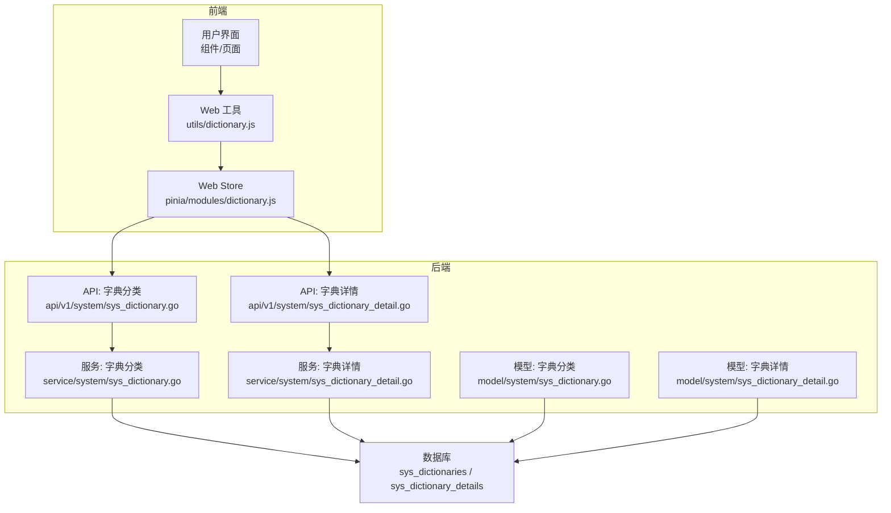
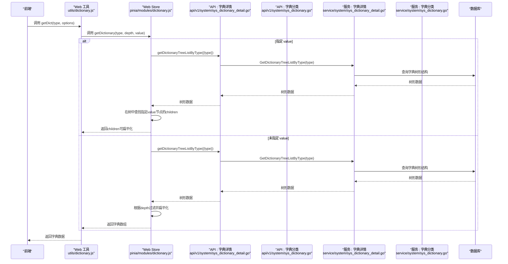
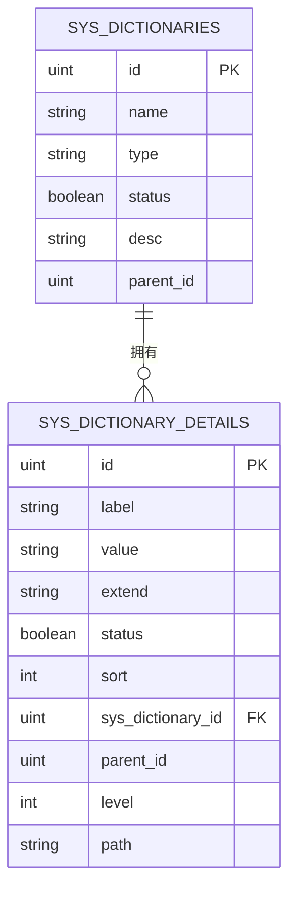
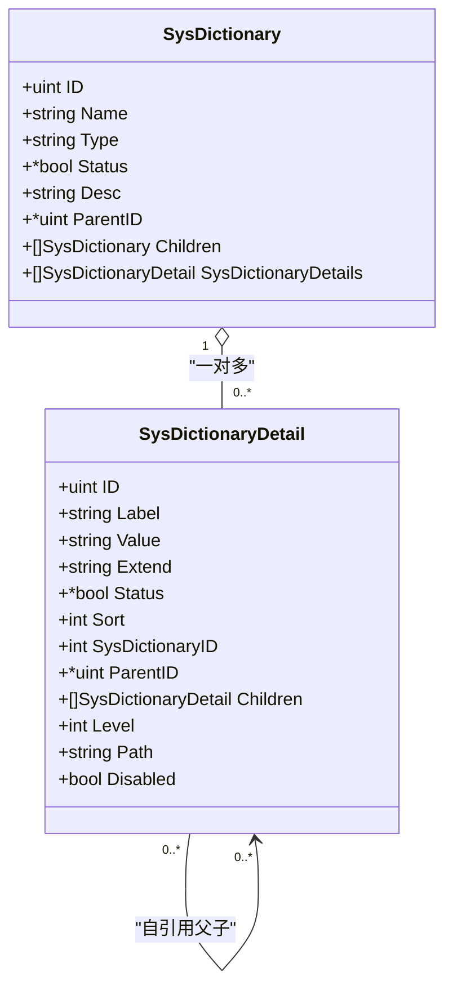
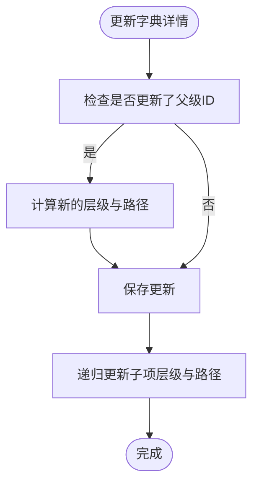
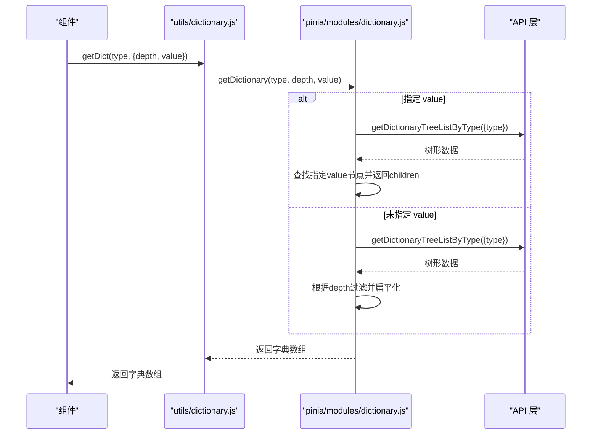
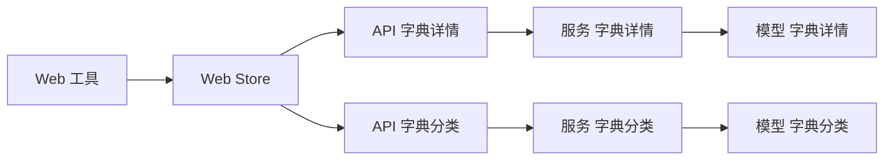

# 字典管理模型

<cite>
**本文档引用的文件**
- [server/model/system/sys_dictionary.go](file://server/model/system/sys_dictionary.go)
- [server/model/system/sys_dictionary_detail.go](file://server/model/system/sys_dictionary_detail.go)
- [server/service/system/sys_dictionary.go](file://server/service/system/sys_dictionary.go)
- [server/service/system/sys_dictionary_detail.go](file://server/service/system/sys_dictionary_detail.go)
- [server/api/v1/system/sys_dictionary.go](file://server/api/v1/system/sys_dictionary.go)
- [server/api/v1/system/sys_dictionary_detail.go](file://server/api/v1/system/sys_dictionary_detail.go)
- [server/model/system/request/sys_dictionary.go](file://server/model/system/request/sys_dictionary.go)
- [server/model/system/request/sys_dictionary_detail.go](file://server/model/system/request/sys_dictionary_detail.go)
- [web/src/utils/dictionary.js](file://web/src/utils/dictionary.js)
- [web/src/pinia/modules/dictionary.js](file://web/src/pinia/modules/dictionary.js)
- [server/initialize/register_init.go](file://server/initialize/register_init.go)
</cite>

## 目录
1. [简介](#简介)
2. [项目结构](#项目结构)
3. [核心组件](#核心组件)
4. [架构总览](#架构总览)
5. [详细组件分析](#详细组件分析)
6. [依赖关系分析](#依赖关系分析)
7. [性能考虑](#性能考虑)
8. [故障排除指南](#故障排除指南)
9. [结论](#结论)
10. [附录](#附录)

## 简介
本文件系统性阐述“字典管理模型”的设计与实现，重点覆盖：
- SysDictionary（字典分类）与 SysDictionaryDetail（字典项）的实体设计与关系
- 一对多关系的组织结构与数据流
- 字典值的数据类型支持、状态管理与排序机制
- 动态字典数据的获取流程、缓存策略与前端使用方式
- 数据库表结构图与关键流程时序图

## 项目结构
字典管理功能由后端模型层、服务层、API 层与前端工具层协同完成，采用清晰的分层职责划分：
- 模型层：定义 SysDictionary 与 SysDictionaryDetail 的结构与表映射
- 服务层：封装业务逻辑，包括树形结构构建、层级路径计算、导入导出、循环引用检测等
- API 层：提供 REST 接口，支持 CRUD、树形查询、按类型查询、路径查询等
- 前端工具层：提供字典缓存与树形/扁平化转换能力，并通过 Pinia Store 管理状态

图表来源
- [server/api/v1/system/sys_dictionary.go:1-192](file://server/api/v1/system/sys_dictionary.go#L1-L192)
- [server/api/v1/system/sys_dictionary_detail.go:1-268](file://server/api/v1/system/sys_dictionary_detail.go#L1-L268)
- [server/service/system/sys_dictionary.go:1-298](file://server/service/system/sys_dictionary.go#L1-L298)
- [server/service/system/sys_dictionary_detail.go:1-393](file://server/service/system/sys_dictionary_detail.go#L1-L393)
- [server/model/system/sys_dictionary.go:1-23](file://server/model/system/sys_dictionary.go#L1-L23)
- [server/model/system/sys_dictionary_detail.go:1-27](file://server/model/system/sys_dictionary_detail.go#L1-L27)
- [web/src/utils/dictionary.js:1-94](file://web/src/utils/dictionary.js#L1-L94)
- [web/src/pinia/modules/dictionary.js:1-253](file://web/src/pinia/modules/dictionary.js#L1-L253)

章节来源
- [server/api/v1/system/sys_dictionary.go:1-192](file://server/api/v1/system/sys_dictionary.go#L1-L192)
- [server/api/v1/system/sys_dictionary_detail.go:1-268](file://server/api/v1/system/sys_dictionary_detail.go#L1-L268)
- [server/service/system/sys_dictionary.go:1-298](file://server/service/system/sys_dictionary.go#L1-L298)
- [server/service/system/sys_dictionary_detail.go:1-393](file://server/service/system/sys_dictionary_detail.go#L1-L393)
- [server/model/system/sys_dictionary.go:1-23](file://server/model/system/sys_dictionary.go#L1-L23)
- [server/model/system/sys_dictionary_detail.go:1-27](file://server/model/system/sys_dictionary_detail.go#L1-L27)
- [web/src/utils/dictionary.js:1-94](file://web/src/utils/dictionary.js#L1-L94)
- [web/src/pinia/modules/dictionary.js:1-253](file://web/src/pinia/modules/dictionary.js#L1-L253)

## 核心组件
- SysDictionary（字典分类）
  - 字段：名称、英文类型、状态、描述、父级ID、子分类集合、字典项集合
  - 表名：sys_dictionaries
  - 关系：自引用父子关系；一对多关联字典项
- SysDictionaryDetail（字典项）
  - 字段：标签、值、扩展值、状态、排序、所属字典ID、父级字典详情ID、子项集合、层级深度、层级路径、禁用标志
  - 表名：sys_dictionary_details
  - 关系：自引用父子关系；多级树形结构

章节来源
- [server/model/system/sys_dictionary.go:9-18](file://server/model/system/sys_dictionary.go#L9-L18)
- [server/model/system/sys_dictionary_detail.go:9-22](file://server/model/system/sys_dictionary_detail.go#L9-L22)

## 架构总览
字典管理采用“模型-服务-接口-前端工具”的分层架构：
- 模型层负责数据结构与表映射
- 服务层负责业务规则与数据处理（树形构建、层级路径、导入导出、循环引用检测）
- API 层负责对外暴露 REST 接口
- 前端工具层负责缓存、树形/扁平化转换与状态管理

图表来源
- [web/src/utils/dictionary.js:38-74](file://web/src/utils/dictionary.js#L38-L74)
- [web/src/pinia/modules/dictionary.js:117-245](file://web/src/pinia/modules/dictionary.js#L117-L245)
- [server/api/v1/system/sys_dictionary_detail.go:185-208](file://server/api/v1/system/sys_dictionary_detail.go#L185-L208)
- [server/service/system/sys_dictionary_detail.go:318-346](file://server/service/system/sys_dictionary_detail.go#L318-L346)

## 详细组件分析

### SysDictionary 实体与关系
- 设计要点
  - 自引用父子关系：通过 ParentID 与 Children 字段建立树形结构
  - 一对多关系：SysDictionary 与 SysDictionaryDetail 通过 SysDictionaryID 关联
  - 状态字段：用于控制启用/禁用
- 表结构与字段
  - 表名：sys_dictionaries
  - 关键字段：id、name、type、status、desc、parent_id
- 关系映射
  - SysDictionary.Children -> SysDictionary.ParentID
  - SysDictionary.SysDictionaryDetails -> SysDictionaryDetail.SysDictionaryID

图表来源
- [server/model/system/sys_dictionary.go:9-18](file://server/model/system/sys_dictionary.go#L9-L18)
- [server/model/system/sys_dictionary_detail.go:9-22](file://server/model/system/sys_dictionary_detail.go#L9-L22)

章节来源
- [server/model/system/sys_dictionary.go:9-18](file://server/model/system/sys_dictionary.go#L9-L18)
- [server/model/system/sys_dictionary_detail.go:9-22](file://server/model/system/sys_dictionary_detail.go#L9-L22)

### SysDictionaryDetail 实体与树形结构
- 设计要点
  - 多级树形结构：通过 ParentID 与 Children 建立层级关系
  - 层级与路径：Level 与 Path 字段用于维护层级深度与路径字符串
  - 禁用标志：Disabled 字段根据 Status 动态计算
  - 排序：Sort 字段用于排序
- 表结构与字段
  - 表名：sys_dictionary_details
  - 关键字段：id、label、value、extend、status、sort、sys_dictionary_id、parent_id、level、path
- 服务层能力
  - 树形构建：GetDictionaryTreeList、GetDictionaryTreeListByType
  - 路径查询：GetDictionaryPath、GetDictionaryPathByValue
  - 循环引用检测：checkCircularReference
  - 层级路径更新：updateChildrenLevelAndPath

图表来源
- [server/model/system/sys_dictionary.go:9-18](file://server/model/system/sys_dictionary.go#L9-L18)
- [server/model/system/sys_dictionary_detail.go:9-22](file://server/model/system/sys_dictionary_detail.go#L9-L22)

章节来源
- [server/model/system/sys_dictionary_detail.go:9-22](file://server/model/system/sys_dictionary_detail.go#L9-L22)
- [server/service/system/sys_dictionary_detail.go:106-160](file://server/service/system/sys_dictionary_detail.go#L106-L160)

### 服务层：字典分类与字典详情
- 字典分类服务
  - 创建/删除/更新：Create/Delete/UpdateSysDictionary
  - 查询：GetSysDictionary（支持按 type 或 id 查询，预加载字典项）
  - 列表：GetSysDictionaryInfoList（支持模糊搜索 name/type，预加载子分类）
  - 导出/导入：ExportSysDictionary、ImportSysDictionary
  - 循环引用检测：checkCircularReference
- 字典详情服务
  - 创建/删除/更新：Create/Update/DeleteSysDictionaryDetail
  - 查询：GetSysDictionaryDetail、GetSysDictionaryDetailInfoList
  - 树形结构：GetDictionaryTreeList、GetDictionaryTreeListByType
  - 按父级查询：GetDictionaryDetailsByParent
  - 路径查询：GetDictionaryPath、GetDictionaryPathByValue
  - 层级路径计算与更新：updateChildrenLevelAndPath
  - 循环引用检测：checkCircularReference

图表来源
- [server/service/system/sys_dictionary_detail.go:72-104](file://server/service/system/sys_dictionary_detail.go#L72-L104)
- [server/service/system/sys_dictionary_detail.go:125-160](file://server/service/system/sys_dictionary_detail.go#L125-L160)

章节来源
- [server/service/system/sys_dictionary.go:25-93](file://server/service/system/sys_dictionary.go#L25-L93)
- [server/service/system/sys_dictionary.go:121-131](file://server/service/system/sys_dictionary.go#L121-L131)
- [server/service/system/sys_dictionary.go:163-198](file://server/service/system/sys_dictionary.go#L163-L198)
- [server/service/system/sys_dictionary.go:206-297](file://server/service/system/sys_dictionary.go#L206-L297)
- [server/service/system/sys_dictionary_detail.go:22-104](file://server/service/system/sys_dictionary_detail.go#L22-L104)
- [server/service/system/sys_dictionary_detail.go:179-210](file://server/service/system/sys_dictionary_detail.go#L179-L210)
- [server/service/system/sys_dictionary_detail.go:219-270](file://server/service/system/sys_dictionary_detail.go#L219-L270)
- [server/service/system/sys_dictionary_detail.go:273-307](file://server/service/system/sys_dictionary_detail.go#L273-L307)
- [server/service/system/sys_dictionary_detail.go:318-346](file://server/service/system/sys_dictionary_detail.go#L318-L346)

### API 层：接口定义与调用
- 字典分类 API
  - 创建/删除/更新/查询/列表/导出/导入
- 字典详情 API
  - 创建/删除/更新/查询/列表/树形查询/按父级查询/路径查询
- 参数校验与响应封装
  - 使用请求模型进行参数绑定与校验
  - 统一响应封装

章节来源
- [server/api/v1/system/sys_dictionary.go:14-192](file://server/api/v1/system/sys_dictionary.go#L14-L192)
- [server/api/v1/system/sys_dictionary_detail.go:17-268](file://server/api/v1/system/sys_dictionary_detail.go#L17-L268)
- [server/model/system/request/sys_dictionary.go:3-10](file://server/model/system/request/sys_dictionary.go#L3-L10)
- [server/model/system/request/sys_dictionary_detail.go:8-44](file://server/model/system/request/sys_dictionary_detail.go#L8-L44)

### 前端：字典缓存与使用
- 工具函数 getDict
  - 支持获取完整树形、指定深度的扁平化数据、指定节点的 children
  - 缓存键生成：根据 type、depth、value 生成唯一缓存键
- Store：useDictionaryStore
  - 树形/扁平化转换、按深度过滤、按 value 查找子节点
  - 回退机制：当树形接口不可用时回退到旧的平铺方式
- 使用建议
  - 优先使用树形结构以获得完整的层级信息
  - 对于复杂场景，结合深度参数与 children 查询实现灵活展示

图表来源
- [web/src/utils/dictionary.js:38-74](file://web/src/utils/dictionary.js#L38-L74)
- [web/src/pinia/modules/dictionary.js:117-245](file://web/src/pinia/modules/dictionary.js#L117-L245)

章节来源
- [web/src/utils/dictionary.js:1-94](file://web/src/utils/dictionary.js#L1-L94)
- [web/src/pinia/modules/dictionary.js:1-253](file://web/src/pinia/modules/dictionary.js#L1-L253)

## 依赖关系分析
- 模块耦合
  - API 层仅依赖服务层，服务层仅依赖模型层与全局配置
  - 前端工具层依赖 API 层与 Pinia Store
- 外部依赖
  - GORM 用于 ORM 映射与查询
  - Gin 用于 HTTP 接口
  - Vue/Pinia 用于前端状态管理
- 初始化注册
  - 通过初始化包注册源模块，确保依赖正确加载

图表来源
- [server/api/v1/system/sys_dictionary.go:1-192](file://server/api/v1/system/sys_dictionary.go#L1-L192)
- [server/api/v1/system/sys_dictionary_detail.go:1-268](file://server/api/v1/system/sys_dictionary_detail.go#L1-L268)
- [server/service/system/sys_dictionary.go:1-298](file://server/service/system/sys_dictionary.go#L1-L298)
- [server/service/system/sys_dictionary_detail.go:1-393](file://server/service/system/sys_dictionary_detail.go#L1-L393)
- [web/src/utils/dictionary.js:1-94](file://web/src/utils/dictionary.js#L1-L94)
- [web/src/pinia/modules/dictionary.js:1-253](file://web/src/pinia/modules/dictionary.js#L1-L253)

章节来源
- [server/initialize/register_init.go:1-11](file://server/initialize/register_init.go#L1-L11)

## 性能考虑
- 查询优化
  - 预加载策略：字典分类查询时预加载子分类与字典项，减少 N+1 查询
  - 排序与索引：字典项按 sort 排序，建议在数据库层面建立索引以提升查询性能
- 缓存策略
  - 前端缓存：按 type、depth、value 生成缓存键，避免重复请求
  - 深度过滤：在前端进行深度过滤，减少不必要的数据传输
- 树形构建
  - 递归构建树形结构时注意层级深度，避免过深导致性能问题
- 导入导出
  - 导入采用事务保证一致性，批量插入时注意数据库性能与锁竞争

## 故障排除指南
- 常见错误与定位
  - 循环引用：更新父级时触发循环引用检测，需检查父子关系链
  - 删除约束：删除字典详情前需确认无子项
  - 类型冲突：创建/更新字典分类时需确保 type 唯一
  - 参数校验：前端调用时需确保 type 为非空字符串，depth 为非负数
- 日志与调试
  - API 层统一记录错误日志，便于定位问题
  - 前端工具层提供错误回退机制，确保用户体验

章节来源
- [server/service/system/sys_dictionary.go:133-155](file://server/service/system/sys_dictionary.go#L133-L155)
- [server/service/system/sys_dictionary_detail.go:51-64](file://server/service/system/sys_dictionary_detail.go#L51-L64)
- [server/service/system/sys_dictionary.go:26-31](file://server/service/system/sys_dictionary.go#L26-L31)
- [web/src/utils/dictionary.js:46-54](file://web/src/utils/dictionary.js#L46-L54)

## 结论
字典管理模型通过清晰的分层设计与完善的业务逻辑，实现了灵活的字典分类与字典项管理。模型层提供稳定的表结构，服务层保障数据一致性与性能，API 层提供易用的接口，前端工具层提供高效的缓存与转换能力。整体方案具备良好的扩展性与可维护性，适合在复杂业务场景中使用。

## 附录
- 数据类型支持
  - 字典值与扩展值：字符串类型
  - 状态：布尔类型（启用/禁用）
  - 排序：整数类型
  - 层级与路径：整数与字符串组合
- 状态管理
  - 字典分类与字典项均支持状态字段，用于控制启用/禁用
  - 前端通过 Disabled 字段动态计算禁用状态
- 排序机制
  - 字典项按 sort 字段排序，支持多级树形结构的层级排序